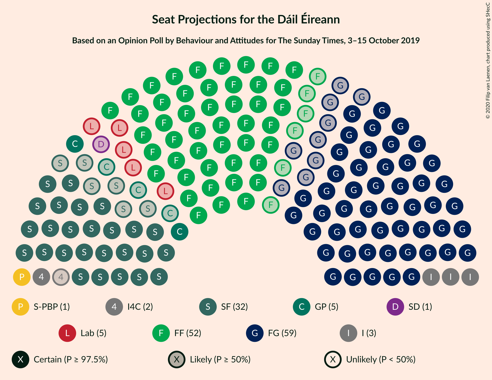
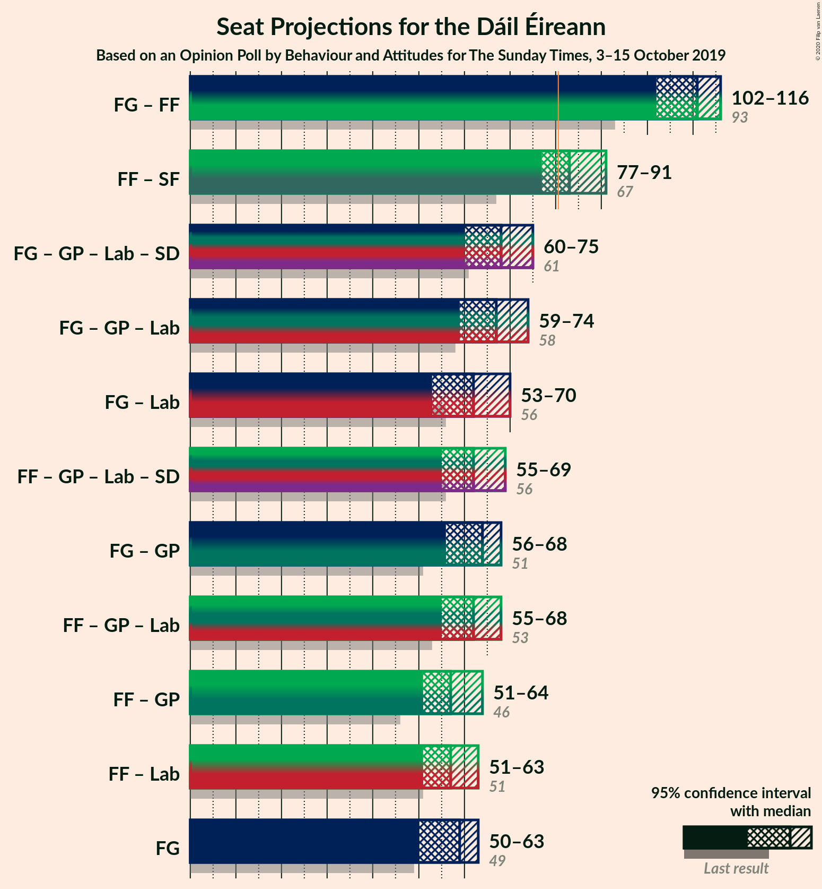
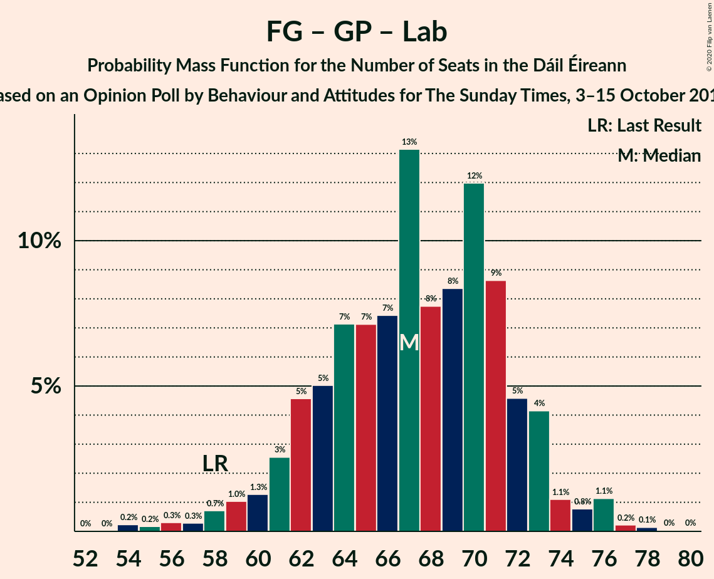
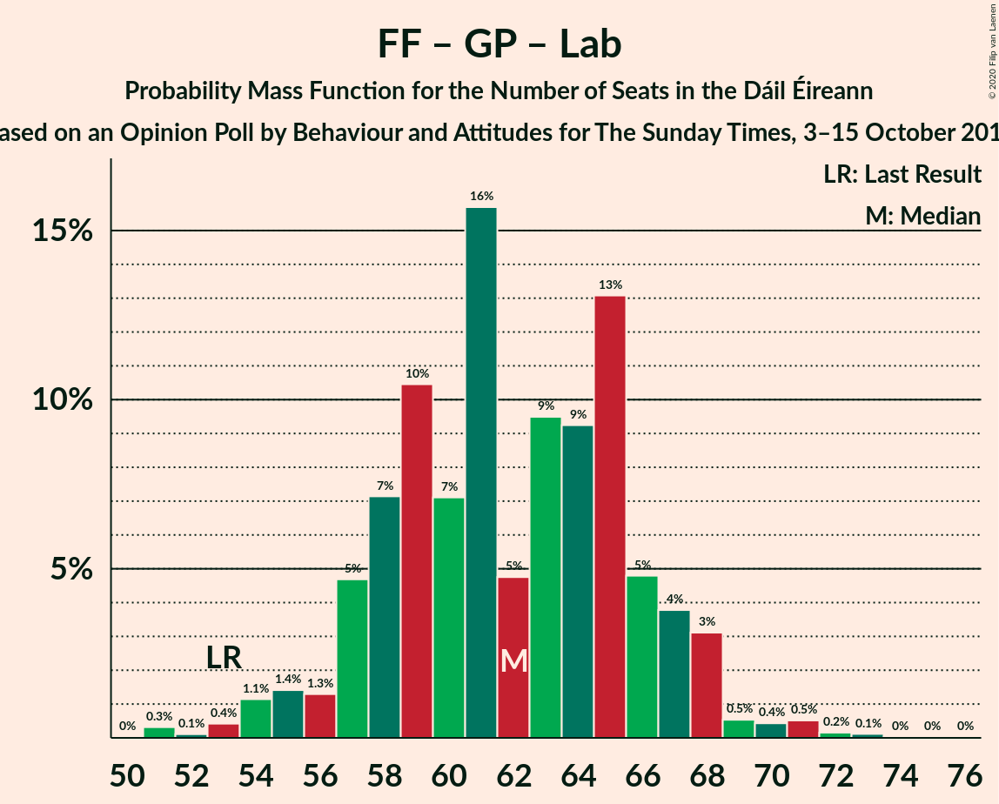

# Opinion Poll by Behaviour and Attitudes for The Sunday Times, 3–15 October 2019

<a href="#voting-intentions">Voting Intentions</a> | <a href="#seats">Seats</a> | <a href="#coalitions">Coalitions</a> | <a href="#technical-information">Technical Information</a>

## Voting Intentions

### Confidence Intervals

| Party | Last Result | Poll Result | 80% Confidence Interval | 90% Confidence Interval | 95% Confidence Interval | 99% Confidence Interval |
|:-----:|:-----------:|:-----------:|:-----------------------:|:-----------------------:|:-----------------------:|:-----------------------:|
| Fine Gael | 25.5% | 29.0% | 27.1–31.0% |26.6–31.6% |26.1–32.1% |25.2–33.0% |
| Fianna Fáil | 24.3% | 28.0% | 26.1–30.0% |25.6–30.5% |25.2–31.0% |24.3–32.0% |
| Sinn Féin | 13.8% | 16.0% | 14.5–17.7% |14.1–18.1% |13.7–18.5% |13.1–19.4% |
| Independent | 15.9% | 8.4% | 7.4–9.8% |7.1–10.1% |6.8–10.5% |6.3–11.1% |
| Green Party/Comhaontas Glas | 2.7% | 6.0% | 5.1–7.1% |4.8–7.5% |4.6–7.8% |4.2–8.3% |
| Labour Party | 6.6% | 5.0% | 4.2–6.1% |3.9–6.4% |3.7–6.6% |3.4–7.2% |
| Solidarity–People Before Profit | 3.9% | 3.0% | 2.4–3.9% |2.2–4.1% |2.1–4.3% |1.8–4.8% |
| Independents 4 Change | 1.5% | 1.1% | 0.8–1.7% |0.7–1.9% |0.6–2.0% |0.5–2.4% |
| Social Democrats | 3.0% | 1.0% | 0.7–1.6% |0.6–1.7% |0.5–1.9% |0.4–2.2% |

*Note:* The poll result column reflects the actual value used in the calculations. Published results may vary slightly, and in addition be rounded to fewer digits.

## Seats

### Confidence Intervals

| Party | Last Result | Median | 80% Confidence Interval | 90% Confidence Interval | 95% Confidence Interval | 99% Confidence Interval |
|:-----:|:-----------:|:------:|:-----------------------:|:-----------------------:|:-----------------------:|:-----------------------:|
| <a href="#fine-gael">Fine Gael</a> | 49 | 59 | 53–62 |51–63 |50–63 |46–65 |
| <a href="#fianna-fáil">Fianna Fáil</a> | 44 | 53 | 49–57 |47–57 |46–58 |44–59 |
| <a href="#sinn-féin">Sinn Féin</a> | 23 | 32 | 28–34 |27–35 |26–35 |23–37 |
| <a href="#independent">Independent</a> | 19 | 3 | 3–6 |3–8 |3–9 |3–11 |
| <a href="#green-party/comhaontas-glas">Green Party/Comhaontas Glas</a> | 2 | 5 | 4–6 |3–8 |2–8 |2–10 |
| <a href="#labour-party">Labour Party</a> | 7 | 5 | 1–8 |1–9 |0–10 |0–13 |
| <a href="#solidarity–people-before-profit">Solidarity–People Before Profit</a> | 6 | 2 | 1–4 |1–4 |1–4 |1–6 |
| <a href="#independents-4-change">Independents 4 Change</a> | 4 | 2 | 2–3 |1–3 |1–3 |0–3 |
| <a href="#social-democrats">Social Democrats</a> | 3 | 1 | 0–2 |0–2 |0–3 |0–3 |

### Fine Gael

*For a full overview of the results for this party, see the [Fine Gael](party-finegael.html) page.*

| Number of Seats | Probability | Accumulated | Special Marks |
|:---------------:|:-----------:|:-----------:|:-------------:|
| 44 | 0% | 100% |  |
| 45 | 0.1% | 99.9% |  |
| 46 | 0.3% | 99.8% |  |
| 47 | 0.3% | 99.5% |  |
| 48 | 0.4% | 99.2% |  |
| 49 | 0.6% | 98.8% | Last Result |
| 50 | 1.1% | 98% |  |
| 51 | 2% | 97% |  |
| 52 | 3% | 95% |  |
| 53 | 4% | 91% |  |
| 54 | 5% | 88% |  |
| 55 | 4% | 83% |  |
| 56 | 7% | 78% |  |
| 57 | 6% | 71% |  |
| 58 | 13% | 65% |  |
| 59 | 13% | 52% | Median |
| 60 | 19% | 39% |  |
| 61 | 7% | 20% |  |
| 62 | 7% | 12% |  |
| 63 | 3% | 5% |  |
| 64 | 1.3% | 2% |  |
| 65 | 0.7% | 1.1% |  |
| 66 | 0.2% | 0.4% |  |
| 67 | 0.1% | 0.2% |  |
| 68 | 0% | 0% |  |

### Fianna Fáil

*For a full overview of the results for this party, see the [Fianna Fáil](party-fiannafáil.html) page.*

| Number of Seats | Probability | Accumulated | Special Marks |
|:---------------:|:-----------:|:-----------:|:-------------:|
| 41 | 0% | 100% |  |
| 42 | 0.3% | 99.9% |  |
| 43 | 0.2% | 99.7% |  |
| 44 | 0.5% | 99.5% | Last Result |
| 45 | 0.6% | 99.0% |  |
| 46 | 1.3% | 98% |  |
| 47 | 3% | 97% |  |
| 48 | 3% | 94% |  |
| 49 | 10% | 91% |  |
| 50 | 7% | 80% |  |
| 51 | 7% | 73% |  |
| 52 | 15% | 66% |  |
| 53 | 11% | 51% | Median |
| 54 | 11% | 40% |  |
| 55 | 11% | 29% |  |
| 56 | 6% | 18% |  |
| 57 | 8% | 12% |  |
| 58 | 4% | 4% |  |
| 59 | 0.4% | 0.9% |  |
| 60 | 0.5% | 0.5% |  |
| 61 | 0% | 0% |  |

### Sinn Féin

*For a full overview of the results for this party, see the [Sinn Féin](party-sinnféin.html) page.*

| Number of Seats | Probability | Accumulated | Special Marks |
|:---------------:|:-----------:|:-----------:|:-------------:|
| 20 | 0% | 100% |  |
| 21 | 0.1% | 99.9% |  |
| 22 | 0.1% | 99.8% |  |
| 23 | 0.3% | 99.7% | Last Result |
| 24 | 0.6% | 99.4% |  |
| 25 | 1.1% | 98.8% |  |
| 26 | 1.2% | 98% |  |
| 27 | 4% | 96% |  |
| 28 | 15% | 92% |  |
| 29 | 7% | 78% |  |
| 30 | 7% | 71% |  |
| 31 | 9% | 63% |  |
| 32 | 29% | 55% | Median |
| 33 | 5% | 26% |  |
| 34 | 11% | 21% |  |
| 35 | 8% | 10% |  |
| 36 | 1.3% | 2% |  |
| 37 | 0.5% | 0.5% |  |
| 38 | 0% | 0% |  |

### Independent

*For a full overview of the results for this party, see the [Independent](party-independent.html) page.*

| Number of Seats | Probability | Accumulated | Special Marks |
|:---------------:|:-----------:|:-----------:|:-------------:|
| 2 | 0.2% | 100% |  |
| 3 | 51% | 99.8% | Median |
| 4 | 35% | 49% |  |
| 5 | 3% | 14% |  |
| 6 | 2% | 11% |  |
| 7 | 3% | 9% |  |
| 8 | 3% | 6% |  |
| 9 | 2% | 3% |  |
| 10 | 0.7% | 1.5% |  |
| 11 | 0.3% | 0.8% |  |
| 12 | 0.2% | 0.5% |  |
| 13 | 0.1% | 0.2% |  |
| 14 | 0.1% | 0.1% |  |
| 15 | 0% | 0.1% |  |
| 16 | 0% | 0% |  |
| 17 | 0% | 0% |  |
| 18 | 0% | 0% |  |
| 19 | 0% | 0% | Last Result |

### Green Party/Comhaontas Glas

*For a full overview of the results for this party, see the [Green Party/Comhaontas Glas](party-greenpartycomhaontasglas.html) page.*

| Number of Seats | Probability | Accumulated | Special Marks |
|:---------------:|:-----------:|:-----------:|:-------------:|
| 2 | 4% | 100% | Last Result |
| 3 | 4% | 96% |  |
| 4 | 15% | 92% |  |
| 5 | 65% | 76% | Median |
| 6 | 2% | 11% |  |
| 7 | 4% | 9% |  |
| 8 | 3% | 5% |  |
| 9 | 2% | 2% |  |
| 10 | 0.2% | 0.7% |  |
| 11 | 0.3% | 0.5% |  |
| 12 | 0.1% | 0.2% |  |
| 13 | 0.1% | 0.1% |  |
| 14 | 0% | 0% |  |

### Labour Party

*For a full overview of the results for this party, see the [Labour Party](party-labourparty.html) page.*

| Number of Seats | Probability | Accumulated | Special Marks |
|:---------------:|:-----------:|:-----------:|:-------------:|
| 0 | 4% | 100% |  |
| 1 | 9% | 96% |  |
| 2 | 19% | 87% |  |
| 3 | 8% | 68% |  |
| 4 | 8% | 60% |  |
| 5 | 15% | 51% | Median |
| 6 | 14% | 36% |  |
| 7 | 10% | 23% | Last Result |
| 8 | 7% | 12% |  |
| 9 | 2% | 5% |  |
| 10 | 0.7% | 3% |  |
| 11 | 1.3% | 2% |  |
| 12 | 0.3% | 1.0% |  |
| 13 | 0.2% | 0.6% |  |
| 14 | 0.2% | 0.4% |  |
| 15 | 0.1% | 0.2% |  |
| 16 | 0.1% | 0.1% |  |
| 17 | 0% | 0% |  |

### Solidarity–People Before Profit

*For a full overview of the results for this party, see the [Solidarity–People Before Profit](party-solidarity–peoplebeforeprofit.html) page.*

| Number of Seats | Probability | Accumulated | Special Marks |
|:---------------:|:-----------:|:-----------:|:-------------:|
| 0 | 0.2% | 100% |  |
| 1 | 36% | 99.8% |  |
| 2 | 27% | 63% | Median |
| 3 | 21% | 37% |  |
| 4 | 13% | 16% |  |
| 5 | 2% | 2% |  |
| 6 | 0.5% | 0.8% | Last Result |
| 7 | 0.1% | 0.2% |  |
| 8 | 0.1% | 0.1% |  |
| 9 | 0.1% | 0.1% |  |
| 10 | 0% | 0% |  |

### Independents 4 Change

*For a full overview of the results for this party, see the [Independents 4 Change](party-independents4change.html) page.*

| Number of Seats | Probability | Accumulated | Special Marks |
|:---------------:|:-----------:|:-----------:|:-------------:|
| 0 | 0.7% | 100% |  |
| 1 | 8% | 99.3% |  |
| 2 | 64% | 91% | Median |
| 3 | 27% | 27% |  |
| 4 | 0% | 0% | Last Result |

### Social Democrats

*For a full overview of the results for this party, see the [Social Democrats](party-socialdemocrats.html) page.*

| Number of Seats | Probability | Accumulated | Special Marks |
|:---------------:|:-----------:|:-----------:|:-------------:|
| 0 | 41% | 100% |  |
| 1 | 49% | 59% | Median |
| 2 | 6% | 10% |  |
| 3 | 4% | 4% | Last Result |
| 4 | 0% | 0% |  |

## Coalitions

### Confidence Intervals

| Coalition | Last Result | Median | Majority? | 80% Confidence Interval | 90% Confidence Interval | 95% Confidence Interval | 99% Confidence Interval |
|:---------:|:-----------:|:------:|:---------:|:-----------------------:|:-----------------------:|:-----------------------:|:-----------------------:|
| Fine Gael – Fianna Fáil | 93 | 111 | 100% | 106–115 | 104–116 | 102–116 | 99–118 |
| Fianna Fáil – Sinn Féin | 67 | 83 | 81% | 80–88 | 78–89 | 77–91 | 74–93 |
| Fine Gael – Green Party/Comhaontas Glas – Labour Party – Social Democrats | 61 | 68 | 0% | 63–73 | 62–74 | 60–75 | 57–77 |
| Fine Gael – Green Party/Comhaontas Glas – Labour Party | 58 | 67 | 0% | 62–72 | 61–73 | 59–74 | 56–76 |
| Fine Gael – Labour Party | 56 | 62 | 0% | 57–68 | 55–68 | 53–70 | 50–71 |
| Fianna Fáil – Green Party/Comhaontas Glas – Labour Party – Social Democrats | 56 | 62 | 0% | 58–67 | 57–68 | 55–69 | 53–72 |
| Fine Gael – Green Party/Comhaontas Glas | 51 | 64 | 0% | 58–67 | 57–67 | 56–68 | 52–70 |
| Fianna Fáil – Green Party/Comhaontas Glas – Labour Party | 53 | 62 | 0% | 58–66 | 57–67 | 55–68 | 53–71 |
| Fianna Fáil – Green Party/Comhaontas Glas | 46 | 57 | 0% | 53–62 | 52–63 | 51–64 | 48–66 |
| Fianna Fáil – Labour Party | 51 | 57 | 0% | 53–61 | 52–62 | 51–63 | 48–66 |
| Fine Gael | 49 | 59 | 0% | 53–62 | 51–63 | 50–63 | 46–65 |

### Fine Gael – Fianna Fáil

| Number of Seats | Probability | Accumulated | Special Marks |
|:---------------:|:-----------:|:-----------:|:-------------:|
| 93 | 0% | 100% | Last Result |
| 94 | 0% | 100% |  |
| 95 | 0% | 100% |  |
| 96 | 0% | 99.9% |  |
| 97 | 0.2% | 99.9% |  |
| 98 | 0.2% | 99.7% |  |
| 99 | 0.1% | 99.5% |  |
| 100 | 0.8% | 99.4% |  |
| 101 | 0.4% | 98.6% |  |
| 102 | 0.8% | 98% |  |
| 103 | 2% | 97% |  |
| 104 | 3% | 96% |  |
| 105 | 2% | 93% |  |
| 106 | 4% | 91% |  |
| 107 | 10% | 87% |  |
| 108 | 7% | 77% |  |
| 109 | 7% | 71% |  |
| 110 | 10% | 63% |  |
| 111 | 8% | 53% |  |
| 112 | 13% | 45% | Median |
| 113 | 11% | 32% |  |
| 114 | 5% | 21% |  |
| 115 | 10% | 16% |  |
| 116 | 4% | 5% |  |
| 117 | 0.6% | 2% |  |
| 118 | 0.8% | 1.1% |  |
| 119 | 0.2% | 0.3% |  |
| 120 | 0.1% | 0.1% |  |
| 121 | 0% | 0% |  |

### Fianna Fáil – Sinn Féin

| Number of Seats | Probability | Accumulated | Special Marks |
|:---------------:|:-----------:|:-----------:|:-------------:|
| 67 | 0% | 100% | Last Result |
| 68 | 0% | 100% |  |
| 69 | 0% | 100% |  |
| 70 | 0% | 100% |  |
| 71 | 0% | 100% |  |
| 72 | 0.1% | 100% |  |
| 73 | 0.2% | 99.9% |  |
| 74 | 0.2% | 99.6% |  |
| 75 | 0.5% | 99.4% |  |
| 76 | 0.6% | 98.9% |  |
| 77 | 2% | 98% |  |
| 78 | 2% | 96% |  |
| 79 | 4% | 95% |  |
| 80 | 9% | 91% |  |
| 81 | 11% | 81% | Majority |
| 82 | 7% | 70% |  |
| 83 | 15% | 63% |  |
| 84 | 9% | 48% |  |
| 85 | 8% | 39% | Median |
| 86 | 12% | 31% |  |
| 87 | 4% | 19% |  |
| 88 | 7% | 15% |  |
| 89 | 2% | 7% |  |
| 90 | 1.5% | 5% |  |
| 91 | 2% | 4% |  |
| 92 | 0.7% | 1.3% |  |
| 93 | 0.4% | 0.6% |  |
| 94 | 0.1% | 0.2% |  |
| 95 | 0% | 0.1% |  |
| 96 | 0.1% | 0.1% |  |
| 97 | 0% | 0% |  |

### Fine Gael – Green Party/Comhaontas Glas – Labour Party – Social Democrats

| Number of Seats | Probability | Accumulated | Special Marks |
|:---------------:|:-----------:|:-----------:|:-------------:|
| 54 | 0% | 100% |  |
| 55 | 0.1% | 99.9% |  |
| 56 | 0.1% | 99.8% |  |
| 57 | 0.6% | 99.7% |  |
| 58 | 0.5% | 99.1% |  |
| 59 | 0.5% | 98.6% |  |
| 60 | 1.3% | 98% |  |
| 61 | 0.8% | 97% | Last Result |
| 62 | 4% | 96% |  |
| 63 | 3% | 92% |  |
| 64 | 7% | 88% |  |
| 65 | 6% | 81% |  |
| 66 | 9% | 75% |  |
| 67 | 7% | 66% |  |
| 68 | 13% | 60% |  |
| 69 | 9% | 47% |  |
| 70 | 10% | 38% | Median |
| 71 | 8% | 28% |  |
| 72 | 8% | 20% |  |
| 73 | 7% | 12% |  |
| 74 | 2% | 5% |  |
| 75 | 1.0% | 3% |  |
| 76 | 2% | 2% |  |
| 77 | 0.4% | 0.7% |  |
| 78 | 0.1% | 0.3% |  |
| 79 | 0.1% | 0.2% |  |
| 80 | 0% | 0.1% |  |
| 81 | 0% | 0% | Majority |

### Fine Gael – Green Party/Comhaontas Glas – Labour Party

| Number of Seats | Probability | Accumulated | Special Marks |
|:---------------:|:-----------:|:-----------:|:-------------:|
| 53 | 0% | 100% |  |
| 54 | 0.2% | 99.9% |  |
| 55 | 0.2% | 99.7% |  |
| 56 | 0.3% | 99.5% |  |
| 57 | 0.3% | 99.2% |  |
| 58 | 0.7% | 98.9% | Last Result |
| 59 | 1.0% | 98% |  |
| 60 | 1.3% | 97% |  |
| 61 | 3% | 96% |  |
| 62 | 5% | 93% |  |
| 63 | 5% | 89% |  |
| 64 | 7% | 84% |  |
| 65 | 7% | 77% |  |
| 66 | 7% | 70% |  |
| 67 | 13% | 62% |  |
| 68 | 8% | 49% |  |
| 69 | 8% | 41% | Median |
| 70 | 12% | 33% |  |
| 71 | 9% | 21% |  |
| 72 | 5% | 12% |  |
| 73 | 4% | 8% |  |
| 74 | 1.1% | 3% |  |
| 75 | 0.8% | 2% |  |
| 76 | 1.1% | 2% |  |
| 77 | 0.2% | 0.4% |  |
| 78 | 0.1% | 0.2% |  |
| 79 | 0% | 0.1% |  |
| 80 | 0% | 0% |  |

### Fine Gael – Labour Party

| Number of Seats | Probability | Accumulated | Special Marks |
|:---------------:|:-----------:|:-----------:|:-------------:|
| 46 | 0.1% | 100% |  |
| 47 | 0% | 99.9% |  |
| 48 | 0.1% | 99.9% |  |
| 49 | 0.3% | 99.8% |  |
| 50 | 0.2% | 99.5% |  |
| 51 | 0.3% | 99.3% |  |
| 52 | 0.8% | 99.0% |  |
| 53 | 1.0% | 98% |  |
| 54 | 0.9% | 97% |  |
| 55 | 2% | 96% |  |
| 56 | 2% | 95% | Last Result |
| 57 | 6% | 93% |  |
| 58 | 4% | 87% |  |
| 59 | 7% | 83% |  |
| 60 | 7% | 76% |  |
| 61 | 6% | 69% |  |
| 62 | 14% | 63% |  |
| 63 | 7% | 49% |  |
| 64 | 8% | 42% | Median |
| 65 | 8% | 34% |  |
| 66 | 10% | 26% |  |
| 67 | 5% | 16% |  |
| 68 | 6% | 11% |  |
| 69 | 2% | 4% |  |
| 70 | 1.1% | 3% |  |
| 71 | 1.3% | 2% |  |
| 72 | 0.1% | 0.4% |  |
| 73 | 0.2% | 0.3% |  |
| 74 | 0.1% | 0.1% |  |
| 75 | 0% | 0.1% |  |
| 76 | 0% | 0% |  |

### Fianna Fáil – Green Party/Comhaontas Glas – Labour Party – Social Democrats

| Number of Seats | Probability | Accumulated | Special Marks |
|:---------------:|:-----------:|:-----------:|:-------------:|
| 51 | 0% | 100% |  |
| 52 | 0.3% | 99.9% |  |
| 53 | 0.3% | 99.6% |  |
| 54 | 0.6% | 99.4% |  |
| 55 | 1.5% | 98.8% |  |
| 56 | 0.9% | 97% | Last Result |
| 57 | 2% | 96% |  |
| 58 | 5% | 94% |  |
| 59 | 8% | 89% |  |
| 60 | 11% | 82% |  |
| 61 | 11% | 70% |  |
| 62 | 10% | 60% |  |
| 63 | 5% | 49% |  |
| 64 | 11% | 44% | Median |
| 65 | 14% | 33% |  |
| 66 | 5% | 20% |  |
| 67 | 7% | 15% |  |
| 68 | 4% | 8% |  |
| 69 | 2% | 4% |  |
| 70 | 0.6% | 2% |  |
| 71 | 0.4% | 1.2% |  |
| 72 | 0.5% | 0.8% |  |
| 73 | 0.2% | 0.3% |  |
| 74 | 0.1% | 0.2% |  |
| 75 | 0.1% | 0.1% |  |
| 76 | 0% | 0% |  |

### Fine Gael – Green Party/Comhaontas Glas

| Number of Seats | Probability | Accumulated | Special Marks |
|:---------------:|:-----------:|:-----------:|:-------------:|
| 50 | 0.1% | 100% |  |
| 51 | 0.2% | 99.9% | Last Result |
| 52 | 0.3% | 99.7% |  |
| 53 | 0.4% | 99.4% |  |
| 54 | 0.5% | 99.0% |  |
| 55 | 0.6% | 98.6% |  |
| 56 | 2% | 98% |  |
| 57 | 5% | 96% |  |
| 58 | 3% | 91% |  |
| 59 | 5% | 88% |  |
| 60 | 4% | 83% |  |
| 61 | 8% | 78% |  |
| 62 | 8% | 70% |  |
| 63 | 12% | 62% |  |
| 64 | 14% | 50% | Median |
| 65 | 17% | 36% |  |
| 66 | 7% | 19% |  |
| 67 | 8% | 12% |  |
| 68 | 2% | 4% |  |
| 69 | 1.1% | 2% |  |
| 70 | 0.5% | 0.9% |  |
| 71 | 0.2% | 0.4% |  |
| 72 | 0.1% | 0.2% |  |
| 73 | 0% | 0% |  |

### Fianna Fáil – Green Party/Comhaontas Glas – Labour Party

| Number of Seats | Probability | Accumulated | Special Marks |
|:---------------:|:-----------:|:-----------:|:-------------:|
| 50 | 0% | 100% |  |
| 51 | 0.3% | 99.9% |  |
| 52 | 0.1% | 99.6% |  |
| 53 | 0.4% | 99.5% | Last Result |
| 54 | 1.1% | 99.1% |  |
| 55 | 1.4% | 98% |  |
| 56 | 1.3% | 97% |  |
| 57 | 5% | 95% |  |
| 58 | 7% | 91% |  |
| 59 | 10% | 83% |  |
| 60 | 7% | 73% |  |
| 61 | 16% | 66% |  |
| 62 | 5% | 50% |  |
| 63 | 9% | 45% | Median |
| 64 | 9% | 36% |  |
| 65 | 13% | 27% |  |
| 66 | 5% | 14% |  |
| 67 | 4% | 9% |  |
| 68 | 3% | 5% |  |
| 69 | 0.5% | 2% |  |
| 70 | 0.4% | 1.3% |  |
| 71 | 0.5% | 0.9% |  |
| 72 | 0.2% | 0.4% |  |
| 73 | 0.1% | 0.2% |  |
| 74 | 0% | 0.1% |  |
| 75 | 0% | 0.1% |  |
| 76 | 0% | 0% |  |

### Fianna Fáil – Green Party/Comhaontas Glas

| Number of Seats | Probability | Accumulated | Special Marks |
|:---------------:|:-----------:|:-----------:|:-------------:|
| 46 | 0% | 100% | Last Result |
| 47 | 0.4% | 99.9% |  |
| 48 | 0.2% | 99.6% |  |
| 49 | 0.9% | 99.4% |  |
| 50 | 0.8% | 98% |  |
| 51 | 2% | 98% |  |
| 52 | 3% | 96% |  |
| 53 | 5% | 93% |  |
| 54 | 8% | 87% |  |
| 55 | 11% | 79% |  |
| 56 | 6% | 68% |  |
| 57 | 13% | 62% |  |
| 58 | 11% | 49% | Median |
| 59 | 8% | 37% |  |
| 60 | 10% | 30% |  |
| 61 | 7% | 20% |  |
| 62 | 6% | 13% |  |
| 63 | 4% | 8% |  |
| 64 | 2% | 4% |  |
| 65 | 1.0% | 2% |  |
| 66 | 0.6% | 1.0% |  |
| 67 | 0.2% | 0.4% |  |
| 68 | 0.2% | 0.2% |  |
| 69 | 0% | 0% |  |

### Fianna Fáil – Labour Party

| Number of Seats | Probability | Accumulated | Special Marks |
|:---------------:|:-----------:|:-----------:|:-------------:|
| 45 | 0% | 100% |  |
| 46 | 0.3% | 99.9% |  |
| 47 | 0.1% | 99.7% |  |
| 48 | 0.4% | 99.5% |  |
| 49 | 0.5% | 99.2% |  |
| 50 | 0.9% | 98.7% |  |
| 51 | 2% | 98% | Last Result |
| 52 | 4% | 96% |  |
| 53 | 8% | 91% |  |
| 54 | 8% | 84% |  |
| 55 | 10% | 75% |  |
| 56 | 12% | 65% |  |
| 57 | 8% | 53% |  |
| 58 | 10% | 45% | Median |
| 59 | 9% | 35% |  |
| 60 | 12% | 26% |  |
| 61 | 6% | 14% |  |
| 62 | 4% | 9% |  |
| 63 | 3% | 5% |  |
| 64 | 1.1% | 2% |  |
| 65 | 0.3% | 0.9% |  |
| 66 | 0.2% | 0.5% |  |
| 67 | 0.1% | 0.3% |  |
| 68 | 0.1% | 0.2% |  |
| 69 | 0% | 0.1% |  |
| 70 | 0% | 0.1% |  |
| 71 | 0% | 0% |  |

### Fine Gael

| Number of Seats | Probability | Accumulated | Special Marks |
|:---------------:|:-----------:|:-----------:|:-------------:|
| 44 | 0% | 100% |  |
| 45 | 0.1% | 99.9% |  |
| 46 | 0.3% | 99.8% |  |
| 47 | 0.3% | 99.5% |  |
| 48 | 0.4% | 99.2% |  |
| 49 | 0.6% | 98.8% | Last Result |
| 50 | 1.1% | 98% |  |
| 51 | 2% | 97% |  |
| 52 | 3% | 95% |  |
| 53 | 4% | 91% |  |
| 54 | 5% | 88% |  |
| 55 | 4% | 83% |  |
| 56 | 7% | 78% |  |
| 57 | 6% | 71% |  |
| 58 | 13% | 65% |  |
| 59 | 13% | 52% | Median |
| 60 | 19% | 39% |  |
| 61 | 7% | 20% |  |
| 62 | 7% | 12% |  |
| 63 | 3% | 5% |  |
| 64 | 1.3% | 2% |  |
| 65 | 0.7% | 1.1% |  |
| 66 | 0.2% | 0.4% |  |
| 67 | 0.1% | 0.2% |  |
| 68 | 0% | 0% |  |

## Technical Information

### Opinion Poll

+ **Polling firm:** Behaviour and Attitudes
+ **Commissioner(s):** The Sunday Times
+ **Fieldwork period:** 3–15 October 2019

### Calculations

+ **Sample size:** 900
+ **Simulations done:** 1,048,576
+ **Error estimate:** 1.92%

