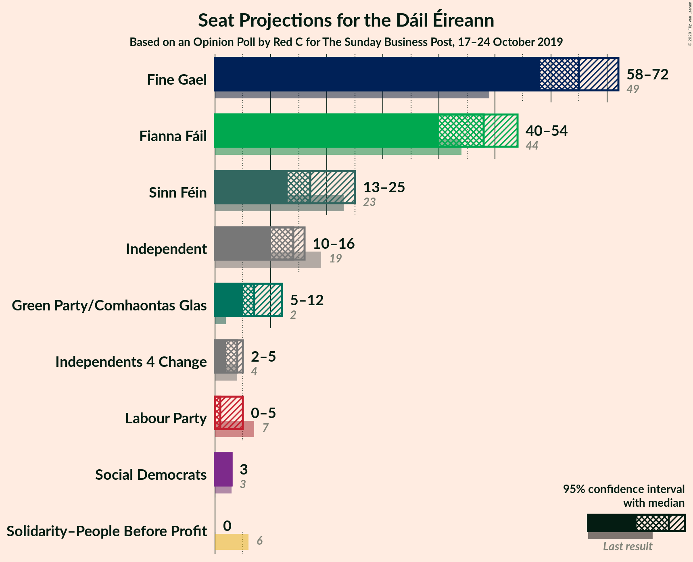
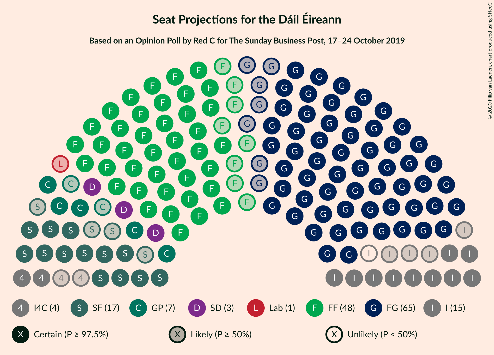
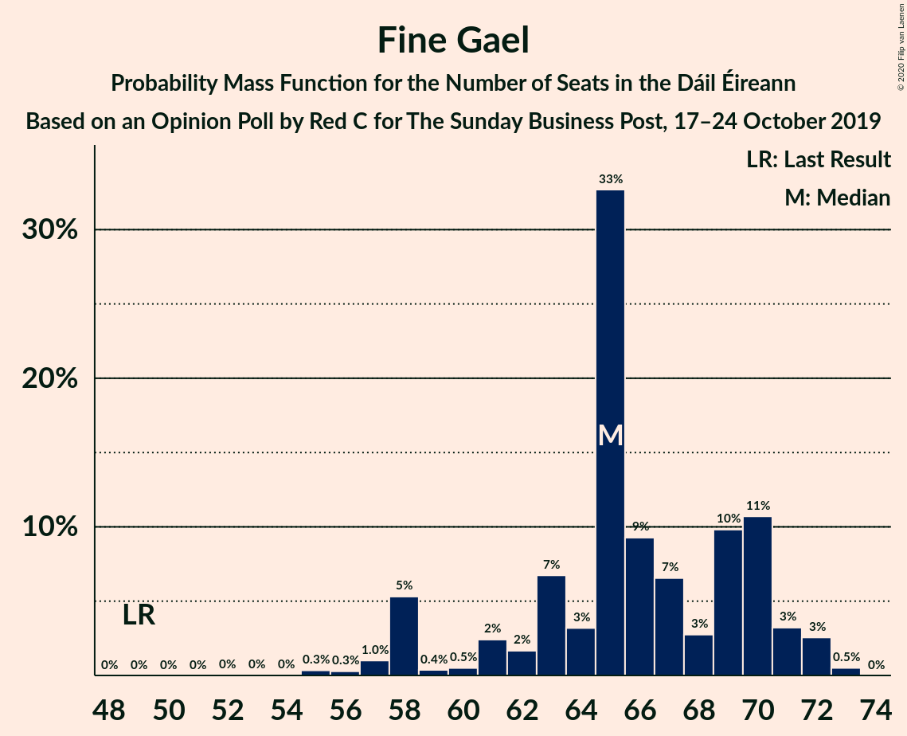
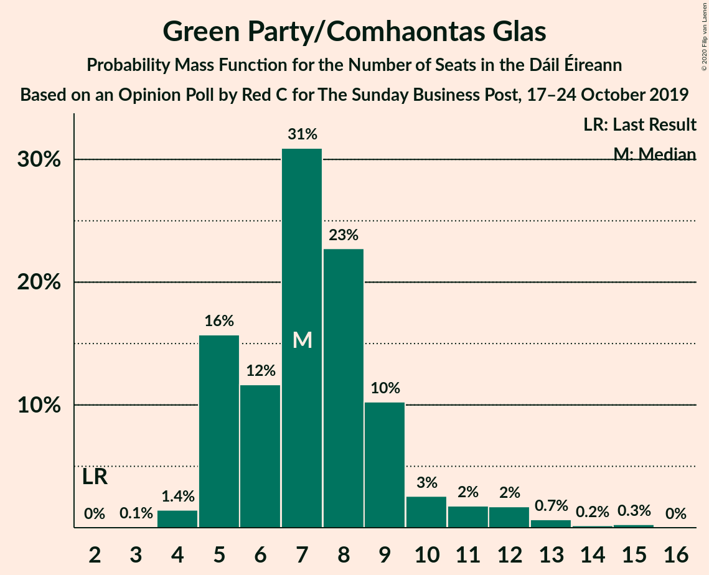
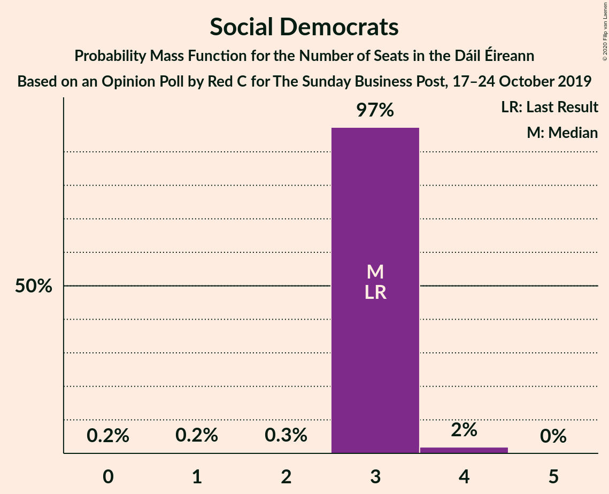
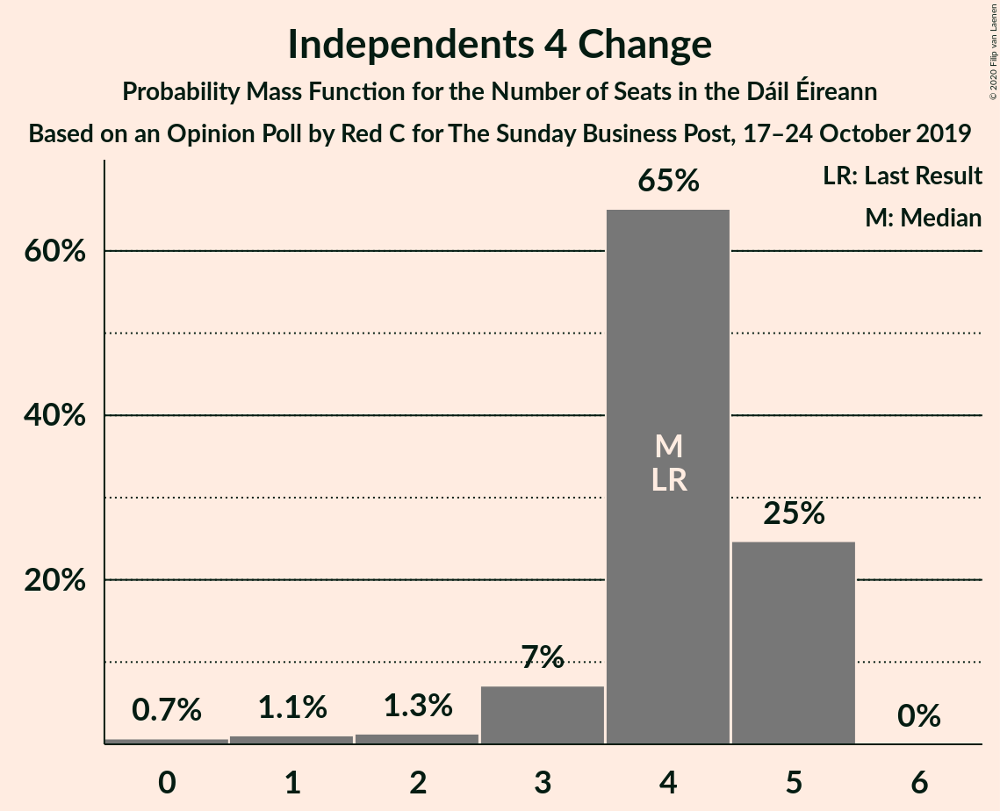
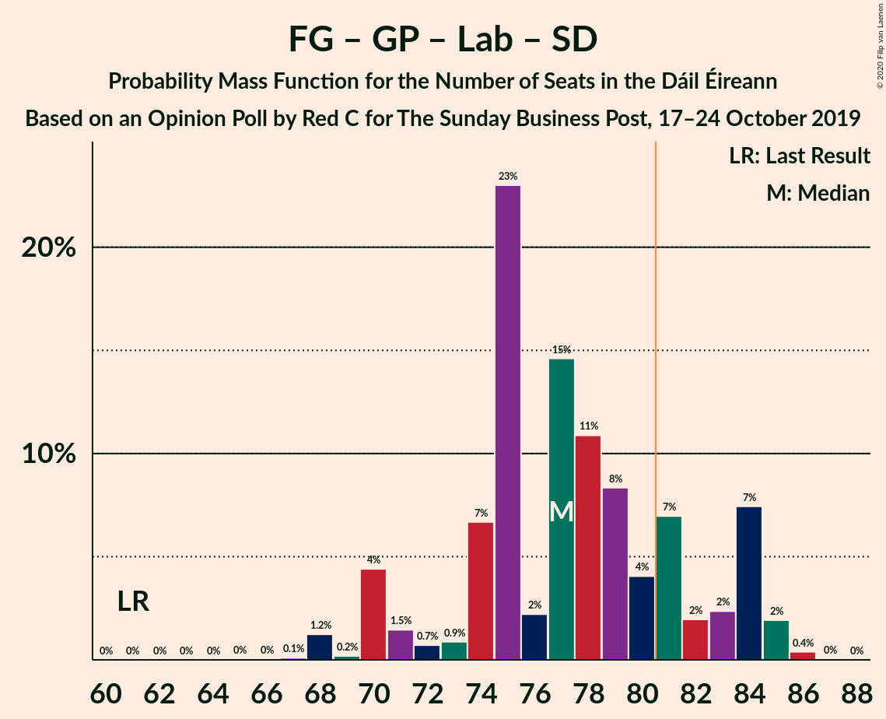
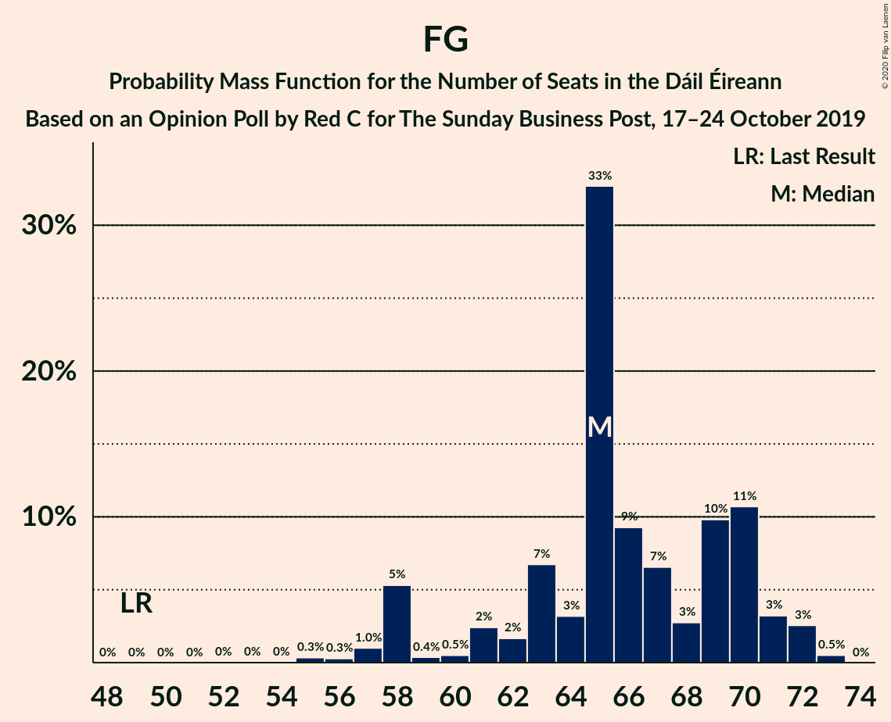
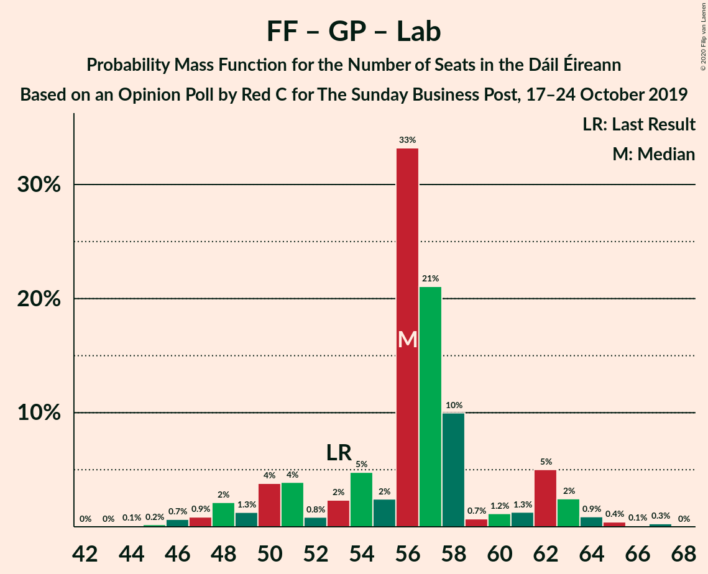

# Opinion Poll by Red C for The Sunday Business Post, 17–24 October 2019

<a href="#voting-intentions">Voting Intentions</a> | <a href="#seats">Seats</a> | <a href="#coalitions">Coalitions</a> | <a href="#technical-information">Technical Information</a>

## Voting Intentions

### Confidence Intervals

| Party | Last Result | Poll Result | 80% Confidence Interval | 90% Confidence Interval | 95% Confidence Interval | 99% Confidence Interval |
|:-----:|:-----------:|:-----------:|:-----------------------:|:-----------------------:|:-----------------------:|:-----------------------:|
| Fine Gael | 25.5% | 32.0% | 30.1–33.9% |29.6–34.5% |29.2–35.0% |28.3–35.9% |
| Fianna Fáil | 24.3% | 24.0% | 22.3–25.8% |21.9–26.3% |21.4–26.7% |20.7–27.6% |
| Independent | 15.9% | 12.7% | 11.4–14.1% |11.1–14.6% |10.8–14.9% |10.2–15.6% |
| Sinn Féin | 13.8% | 11.0% | 9.8–12.4% |9.5–12.8% |9.2–13.1% |8.7–13.8% |
| Green Party/Comhaontas Glas | 2.7% | 7.0% | 6.1–8.2% |5.8–8.5% |5.6–8.8% |5.2–9.3% |
| Labour Party | 6.6% | 4.0% | 3.3–4.9% |3.1–5.2% |2.9–5.4% |2.7–5.9% |
| Social Democrats | 3.0% | 2.0% | 1.5–2.7% |1.4–2.9% |1.3–3.1% |1.1–3.4% |
| Independents 4 Change | 1.5% | 1.6% | 1.2–2.2% |1.1–2.4% |1.0–2.6% |0.8–2.9% |
| Solidarity–People Before Profit | 3.9% | 1.0% | 0.7–1.5% |0.6–1.7% |0.5–1.8% |0.4–2.1% |

*Note:* The poll result column reflects the actual value used in the calculations. Published results may vary slightly, and in addition be rounded to fewer digits.

## Seats

### Confidence Intervals

| Party | Last Result | Median | 80% Confidence Interval | 90% Confidence Interval | 95% Confidence Interval | 99% Confidence Interval |
|:-----:|:-----------:|:------:|:-----------------------:|:-----------------------:|:-----------------------:|:-----------------------:|
| <a href="#fine-gael">Fine Gael</a> | 49 | 65 | 61–70 |58–71 |58–72 |56–73 |
| <a href="#fianna-fáil">Fianna Fáil</a> | 44 | 48 | 43–52 |41–54 |40–54 |38–55 |
| <a href="#independent">Independent</a> | 19 | 14 | 11–15 |11–16 |10–16 |8–16 |
| <a href="#sinn-féin">Sinn Féin</a> | 23 | 17 | 15–22 |14–24 |13–25 |9–26 |
| <a href="#green-party/comhaontas-glas">Green Party/Comhaontas Glas</a> | 2 | 7 | 5–9 |5–10 |5–12 |4–13 |
| <a href="#labour-party">Labour Party</a> | 7 | 1 | 0–3 |0–4 |0–5 |0–6 |
| <a href="#social-democrats">Social Democrats</a> | 3 | 3 | 3 |3 |3 |2–4 |
| <a href="#independents-4-change">Independents 4 Change</a> | 4 | 4 | 3–5 |3–5 |2–5 |0–5 |
| <a href="#solidarity–people-before-profit">Solidarity–People Before Profit</a> | 6 | 0 | 0 |0 |0 |0 |

### Fine Gael

*For a full overview of the results for this party, see the [Fine Gael](party-finegael.html) page.*

| Number of Seats | Probability | Accumulated | Special Marks |
|:---------------:|:-----------:|:-----------:|:-------------:|
| 49 | 0% | 100% | Last Result |
| 50 | 0% | 100% |  |
| 51 | 0% | 100% |  |
| 52 | 0% | 100% |  |
| 53 | 0% | 100% |  |
| 54 | 0% | 100% |  |
| 55 | 0.3% | 99.9% |  |
| 56 | 0.3% | 99.6% |  |
| 57 | 1.0% | 99.3% |  |
| 58 | 5% | 98% |  |
| 59 | 0.4% | 93% |  |
| 60 | 0.5% | 93% |  |
| 61 | 2% | 92% |  |
| 62 | 2% | 90% |  |
| 63 | 7% | 88% |  |
| 64 | 3% | 81% |  |
| 65 | 33% | 78% | Median |
| 66 | 9% | 45% |  |
| 67 | 7% | 36% |  |
| 68 | 3% | 30% |  |
| 69 | 10% | 27% |  |
| 70 | 11% | 17% |  |
| 71 | 3% | 6% |  |
| 72 | 3% | 3% |  |
| 73 | 0.5% | 0.5% |  |
| 74 | 0% | 0% |  |

### Fianna Fáil

*For a full overview of the results for this party, see the [Fianna Fáil](party-fiannafáil.html) page.*

| Number of Seats | Probability | Accumulated | Special Marks |
|:---------------:|:-----------:|:-----------:|:-------------:|
| 37 | 0.1% | 100% |  |
| 38 | 0.4% | 99.9% |  |
| 39 | 0.7% | 99.5% |  |
| 40 | 2% | 98.7% |  |
| 41 | 6% | 97% |  |
| 42 | 0.9% | 92% |  |
| 43 | 2% | 91% |  |
| 44 | 9% | 88% | Last Result |
| 45 | 5% | 80% |  |
| 46 | 4% | 75% |  |
| 47 | 3% | 71% |  |
| 48 | 28% | 68% | Median |
| 49 | 24% | 39% |  |
| 50 | 3% | 15% |  |
| 51 | 2% | 13% |  |
| 52 | 2% | 11% |  |
| 53 | 3% | 8% |  |
| 54 | 4% | 5% |  |
| 55 | 0.6% | 0.7% |  |
| 56 | 0% | 0% |  |

### Independent

*For a full overview of the results for this party, see the [Independent](party-independent.html) page.*

| Number of Seats | Probability | Accumulated | Special Marks |
|:---------------:|:-----------:|:-----------:|:-------------:|
| 7 | 0.1% | 100% |  |
| 8 | 0.5% | 99.9% |  |
| 9 | 1.2% | 99.3% |  |
| 10 | 1.1% | 98% |  |
| 11 | 12% | 97% |  |
| 12 | 8% | 85% |  |
| 13 | 21% | 77% |  |
| 14 | 11% | 55% | Median |
| 15 | 37% | 44% |  |
| 16 | 7% | 7% |  |
| 17 | 0.1% | 0.1% |  |
| 18 | 0% | 0% |  |
| 19 | 0% | 0% | Last Result |

### Sinn Féin

*For a full overview of the results for this party, see the [Sinn Féin](party-sinnféin.html) page.*

| Number of Seats | Probability | Accumulated | Special Marks |
|:---------------:|:-----------:|:-----------:|:-------------:|
| 9 | 0.5% | 100% |  |
| 10 | 0% | 99.5% |  |
| 11 | 0.2% | 99.4% |  |
| 12 | 0.7% | 99.2% |  |
| 13 | 3% | 98% |  |
| 14 | 4% | 96% |  |
| 15 | 10% | 92% |  |
| 16 | 28% | 81% |  |
| 17 | 26% | 53% | Median |
| 18 | 4% | 27% |  |
| 19 | 8% | 23% |  |
| 20 | 3% | 15% |  |
| 21 | 0.7% | 12% |  |
| 22 | 4% | 11% |  |
| 23 | 0.5% | 7% | Last Result |
| 24 | 3% | 6% |  |
| 25 | 2% | 4% |  |
| 26 | 1.0% | 1.2% |  |
| 27 | 0% | 0.2% |  |
| 28 | 0% | 0.1% |  |
| 29 | 0.1% | 0.1% |  |
| 30 | 0% | 0% |  |

### Green Party/Comhaontas Glas

*For a full overview of the results for this party, see the [Green Party/Comhaontas Glas](party-greenpartycomhaontasglas.html) page.*

| Number of Seats | Probability | Accumulated | Special Marks |
|:---------------:|:-----------:|:-----------:|:-------------:|
| 2 | 0% | 100% | Last Result |
| 3 | 0.1% | 100% |  |
| 4 | 1.4% | 99.9% |  |
| 5 | 16% | 98% |  |
| 6 | 12% | 83% |  |
| 7 | 31% | 71% | Median |
| 8 | 23% | 40% |  |
| 9 | 10% | 17% |  |
| 10 | 3% | 7% |  |
| 11 | 2% | 5% |  |
| 12 | 2% | 3% |  |
| 13 | 0.7% | 1.1% |  |
| 14 | 0.2% | 0.5% |  |
| 15 | 0.3% | 0.3% |  |
| 16 | 0% | 0% |  |

### Labour Party

*For a full overview of the results for this party, see the [Labour Party](party-labourparty.html) page.*

| Number of Seats | Probability | Accumulated | Special Marks |
|:---------------:|:-----------:|:-----------:|:-------------:|
| 0 | 38% | 100% |  |
| 1 | 29% | 62% | Median |
| 2 | 8% | 33% |  |
| 3 | 16% | 24% |  |
| 4 | 5% | 8% |  |
| 5 | 2% | 3% |  |
| 6 | 0.3% | 0.5% |  |
| 7 | 0.2% | 0.3% | Last Result |
| 8 | 0% | 0% |  |

### Social Democrats

*For a full overview of the results for this party, see the [Social Democrats](party-socialdemocrats.html) page.*

| Number of Seats | Probability | Accumulated | Special Marks |
|:---------------:|:-----------:|:-----------:|:-------------:|
| 0 | 0.2% | 100% |  |
| 1 | 0.2% | 99.8% |  |
| 2 | 0.3% | 99.6% |  |
| 3 | 97% | 99.3% | Last Result, Median |
| 4 | 2% | 2% |  |
| 5 | 0% | 0% |  |

### Independents 4 Change

*For a full overview of the results for this party, see the [Independents 4 Change](party-independents4change.html) page.*

| Number of Seats | Probability | Accumulated | Special Marks |
|:---------------:|:-----------:|:-----------:|:-------------:|
| 0 | 0.7% | 100% |  |
| 1 | 1.1% | 99.3% |  |
| 2 | 1.3% | 98% |  |
| 3 | 7% | 97% |  |
| 4 | 65% | 90% | Last Result, Median |
| 5 | 25% | 25% |  |
| 6 | 0% | 0% |  |

### Solidarity–People Before Profit

*For a full overview of the results for this party, see the [Solidarity–People Before Profit](party-solidarity–peoplebeforeprofit.html) page.*

| Number of Seats | Probability | Accumulated | Special Marks |
|:---------------:|:-----------:|:-----------:|:-------------:|
| 0 | 99.6% | 100% | Median |
| 1 | 0.3% | 0.4% |  |
| 2 | 0.1% | 0.1% |  |
| 3 | 0% | 0% |  |
| 4 | 0% | 0% |  |
| 5 | 0% | 0% |  |
| 6 | 0% | 0% | Last Result |

## Coalitions

### Confidence Intervals

| Coalition | Last Result | Median | Majority? | 80% Confidence Interval | 90% Confidence Interval | 95% Confidence Interval | 99% Confidence Interval |
|:---------:|:-----------:|:------:|:---------:|:-----------------------:|:-----------------------:|:-----------------------:|:-----------------------:|
| Fine Gael – Fianna Fáil | 93 | 114 | 100% | 108–118 | 106–118 | 106–120 | 104–121 |
| Fine Gael – Green Party/Comhaontas Glas – Labour Party – Social Democrats | 61 | 77 | 21% | 74–83 | 70–84 | 70–84 | 68–85 |
| Fine Gael – Green Party/Comhaontas Glas – Labour Party | 58 | 74 | 10% | 71–80 | 67–81 | 67–81 | 65–82 |
| Fine Gael – Green Party/Comhaontas Glas | 51 | 73 | 0.2% | 69–78 | 65–78 | 64–78 | 64–80 |
| Fine Gael – Labour Party | 56 | 66 | 0% | 63–72 | 61–73 | 59–74 | 58–75 |
| Fine Gael | 49 | 65 | 0% | 61–70 | 58–71 | 58–72 | 56–73 |
| Fianna Fáil – Sinn Féin | 67 | 65 | 0% | 59–70 | 59–70 | 58–71 | 55–72 |
| Fianna Fáil – Green Party/Comhaontas Glas – Labour Party – Social Democrats | 56 | 59 | 0% | 54–64 | 52–65 | 51–66 | 49–68 |
| Fianna Fáil – Green Party/Comhaontas Glas – Labour Party | 53 | 56 | 0% | 51–61 | 49–62 | 48–63 | 46–65 |
| Fianna Fáil – Green Party/Comhaontas Glas | 46 | 56 | 0% | 50–60 | 48–61 | 46–61 | 45–64 |
| Fianna Fáil – Labour Party | 51 | 49 | 0% | 45–53 | 43–55 | 41–55 | 40–56 |

### Fine Gael – Fianna Fáil

| Number of Seats | Probability | Accumulated | Special Marks |
|:---------------:|:-----------:|:-----------:|:-------------:|
| 93 | 0% | 100% | Last Result |
| 94 | 0% | 100% |  |
| 95 | 0% | 100% |  |
| 96 | 0% | 100% |  |
| 97 | 0% | 100% |  |
| 98 | 0.1% | 99.9% |  |
| 99 | 0% | 99.9% |  |
| 100 | 0% | 99.8% |  |
| 101 | 0.1% | 99.8% |  |
| 102 | 0.1% | 99.7% |  |
| 103 | 0.1% | 99.7% |  |
| 104 | 0.8% | 99.5% |  |
| 105 | 0.4% | 98.7% |  |
| 106 | 7% | 98% |  |
| 107 | 0.2% | 91% |  |
| 108 | 2% | 91% |  |
| 109 | 5% | 88% |  |
| 110 | 1.3% | 83% |  |
| 111 | 3% | 82% |  |
| 112 | 5% | 79% |  |
| 113 | 21% | 74% | Median |
| 114 | 26% | 53% |  |
| 115 | 5% | 27% |  |
| 116 | 1.4% | 22% |  |
| 117 | 7% | 20% |  |
| 118 | 9% | 14% |  |
| 119 | 2% | 4% |  |
| 120 | 2% | 3% |  |
| 121 | 0.6% | 0.9% |  |
| 122 | 0.1% | 0.2% |  |
| 123 | 0% | 0.1% |  |
| 124 | 0.1% | 0.1% |  |
| 125 | 0% | 0% |  |

### Fine Gael – Green Party/Comhaontas Glas – Labour Party – Social Democrats

| Number of Seats | Probability | Accumulated | Special Marks |
|:---------------:|:-----------:|:-----------:|:-------------:|
| 61 | 0% | 100% | Last Result |
| 62 | 0% | 100% |  |
| 63 | 0% | 100% |  |
| 64 | 0% | 100% |  |
| 65 | 0% | 100% |  |
| 66 | 0% | 100% |  |
| 67 | 0.1% | 99.9% |  |
| 68 | 1.2% | 99.8% |  |
| 69 | 0.2% | 98.6% |  |
| 70 | 4% | 98% |  |
| 71 | 1.5% | 94% |  |
| 72 | 0.7% | 93% |  |
| 73 | 0.9% | 92% |  |
| 74 | 7% | 91% |  |
| 75 | 23% | 84% |  |
| 76 | 2% | 61% | Median |
| 77 | 15% | 59% |  |
| 78 | 11% | 44% |  |
| 79 | 8% | 34% |  |
| 80 | 4% | 25% |  |
| 81 | 7% | 21% | Majority |
| 82 | 2% | 14% |  |
| 83 | 2% | 12% |  |
| 84 | 7% | 10% |  |
| 85 | 2% | 2% |  |
| 86 | 0.4% | 0.5% |  |
| 87 | 0% | 0.1% |  |
| 88 | 0% | 0% |  |

### Fine Gael – Green Party/Comhaontas Glas – Labour Party

| Number of Seats | Probability | Accumulated | Special Marks |
|:---------------:|:-----------:|:-----------:|:-------------:|
| 58 | 0% | 100% | Last Result |
| 59 | 0% | 100% |  |
| 60 | 0% | 100% |  |
| 61 | 0% | 100% |  |
| 62 | 0% | 100% |  |
| 63 | 0% | 100% |  |
| 64 | 0.1% | 99.9% |  |
| 65 | 1.2% | 99.8% |  |
| 66 | 0.2% | 98.6% |  |
| 67 | 4% | 98% |  |
| 68 | 1.5% | 94% |  |
| 69 | 1.1% | 93% |  |
| 70 | 0.5% | 91% |  |
| 71 | 7% | 91% |  |
| 72 | 23% | 84% |  |
| 73 | 2% | 61% | Median |
| 74 | 15% | 59% |  |
| 75 | 11% | 45% |  |
| 76 | 8% | 33% |  |
| 77 | 4% | 25% |  |
| 78 | 7% | 21% |  |
| 79 | 2% | 14% |  |
| 80 | 2% | 12% |  |
| 81 | 7% | 10% | Majority |
| 82 | 2% | 2% |  |
| 83 | 0.1% | 0.2% |  |
| 84 | 0% | 0.1% |  |
| 85 | 0% | 0.1% |  |
| 86 | 0% | 0% |  |

### Fine Gael – Green Party/Comhaontas Glas

| Number of Seats | Probability | Accumulated | Special Marks |
|:---------------:|:-----------:|:-----------:|:-------------:|
| 51 | 0% | 100% | Last Result |
| 52 | 0% | 100% |  |
| 53 | 0% | 100% |  |
| 54 | 0% | 100% |  |
| 55 | 0% | 100% |  |
| 56 | 0% | 100% |  |
| 57 | 0% | 100% |  |
| 58 | 0% | 100% |  |
| 59 | 0% | 100% |  |
| 60 | 0% | 100% |  |
| 61 | 0% | 100% |  |
| 62 | 0% | 100% |  |
| 63 | 0.4% | 99.9% |  |
| 64 | 4% | 99.6% |  |
| 65 | 1.2% | 95% |  |
| 66 | 0.1% | 94% |  |
| 67 | 0.9% | 94% |  |
| 68 | 1.0% | 93% |  |
| 69 | 3% | 92% |  |
| 70 | 6% | 89% |  |
| 71 | 2% | 83% |  |
| 72 | 29% | 81% | Median |
| 73 | 14% | 52% |  |
| 74 | 6% | 38% |  |
| 75 | 9% | 32% |  |
| 76 | 3% | 23% |  |
| 77 | 5% | 19% |  |
| 78 | 12% | 15% |  |
| 79 | 1.2% | 2% |  |
| 80 | 1.0% | 1.2% |  |
| 81 | 0.1% | 0.2% | Majority |
| 82 | 0% | 0% |  |

### Fine Gael – Labour Party

| Number of Seats | Probability | Accumulated | Special Marks |
|:---------------:|:-----------:|:-----------:|:-------------:|
| 54 | 0% | 100% |  |
| 55 | 0% | 99.9% |  |
| 56 | 0% | 99.9% | Last Result |
| 57 | 0.4% | 99.9% |  |
| 58 | 2% | 99.5% |  |
| 59 | 0.5% | 98% |  |
| 60 | 0.7% | 97% |  |
| 61 | 5% | 96% |  |
| 62 | 1.3% | 91% |  |
| 63 | 2% | 90% |  |
| 64 | 7% | 89% |  |
| 65 | 20% | 81% |  |
| 66 | 12% | 61% | Median |
| 67 | 11% | 49% |  |
| 68 | 1.4% | 38% |  |
| 69 | 6% | 37% |  |
| 70 | 8% | 31% |  |
| 71 | 8% | 23% |  |
| 72 | 9% | 15% |  |
| 73 | 2% | 6% |  |
| 74 | 2% | 3% |  |
| 75 | 1.3% | 1.4% |  |
| 76 | 0.1% | 0.1% |  |
| 77 | 0% | 0% |  |

### Fine Gael

| Number of Seats | Probability | Accumulated | Special Marks |
|:---------------:|:-----------:|:-----------:|:-------------:|
| 49 | 0% | 100% | Last Result |
| 50 | 0% | 100% |  |
| 51 | 0% | 100% |  |
| 52 | 0% | 100% |  |
| 53 | 0% | 100% |  |
| 54 | 0% | 100% |  |
| 55 | 0.3% | 99.9% |  |
| 56 | 0.3% | 99.6% |  |
| 57 | 1.0% | 99.3% |  |
| 58 | 5% | 98% |  |
| 59 | 0.4% | 93% |  |
| 60 | 0.5% | 93% |  |
| 61 | 2% | 92% |  |
| 62 | 2% | 90% |  |
| 63 | 7% | 88% |  |
| 64 | 3% | 81% |  |
| 65 | 33% | 78% | Median |
| 66 | 9% | 45% |  |
| 67 | 7% | 36% |  |
| 68 | 3% | 30% |  |
| 69 | 10% | 27% |  |
| 70 | 11% | 17% |  |
| 71 | 3% | 6% |  |
| 72 | 3% | 3% |  |
| 73 | 0.5% | 0.5% |  |
| 74 | 0% | 0% |  |

### Fianna Fáil – Sinn Féin

| Number of Seats | Probability | Accumulated | Special Marks |
|:---------------:|:-----------:|:-----------:|:-------------:|
| 54 | 0.1% | 100% |  |
| 55 | 0.4% | 99.9% |  |
| 56 | 0.4% | 99.5% |  |
| 57 | 0.7% | 99.1% |  |
| 58 | 2% | 98% |  |
| 59 | 9% | 97% |  |
| 60 | 3% | 88% |  |
| 61 | 1.4% | 84% |  |
| 62 | 7% | 83% |  |
| 63 | 4% | 76% |  |
| 64 | 22% | 72% |  |
| 65 | 2% | 50% | Median |
| 66 | 26% | 48% |  |
| 67 | 0.9% | 22% | Last Result |
| 68 | 5% | 21% |  |
| 69 | 2% | 16% |  |
| 70 | 11% | 15% |  |
| 71 | 3% | 4% |  |
| 72 | 0.3% | 0.8% |  |
| 73 | 0.3% | 0.5% |  |
| 74 | 0.1% | 0.2% |  |
| 75 | 0.1% | 0.1% |  |
| 76 | 0% | 0% |  |

### Fianna Fáil – Green Party/Comhaontas Glas – Labour Party – Social Democrats

| Number of Seats | Probability | Accumulated | Special Marks |
|:---------------:|:-----------:|:-----------:|:-------------:|
| 47 | 0.1% | 100% |  |
| 48 | 0.2% | 99.9% |  |
| 49 | 0.6% | 99.7% |  |
| 50 | 0.9% | 99.1% |  |
| 51 | 2% | 98% |  |
| 52 | 2% | 96% |  |
| 53 | 4% | 95% |  |
| 54 | 4% | 91% |  |
| 55 | 1.3% | 87% |  |
| 56 | 2% | 86% | Last Result |
| 57 | 5% | 84% |  |
| 58 | 2% | 79% |  |
| 59 | 33% | 77% | Median |
| 60 | 21% | 43% |  |
| 61 | 10% | 22% |  |
| 62 | 0.8% | 12% |  |
| 63 | 0.9% | 12% |  |
| 64 | 1.4% | 11% |  |
| 65 | 5% | 9% |  |
| 66 | 3% | 4% |  |
| 67 | 0.9% | 2% |  |
| 68 | 0.4% | 0.8% |  |
| 69 | 0.1% | 0.4% |  |
| 70 | 0.3% | 0.3% |  |
| 71 | 0% | 0% |  |

### Fianna Fáil – Green Party/Comhaontas Glas – Labour Party

| Number of Seats | Probability | Accumulated | Special Marks |
|:---------------:|:-----------:|:-----------:|:-------------:|
| 44 | 0.1% | 100% |  |
| 45 | 0.2% | 99.9% |  |
| 46 | 0.7% | 99.7% |  |
| 47 | 0.9% | 99.0% |  |
| 48 | 2% | 98% |  |
| 49 | 1.3% | 96% |  |
| 50 | 4% | 95% |  |
| 51 | 4% | 91% |  |
| 52 | 0.8% | 87% |  |
| 53 | 2% | 86% | Last Result |
| 54 | 5% | 84% |  |
| 55 | 2% | 79% |  |
| 56 | 33% | 77% | Median |
| 57 | 21% | 43% |  |
| 58 | 10% | 22% |  |
| 59 | 0.7% | 12% |  |
| 60 | 1.2% | 12% |  |
| 61 | 1.3% | 10% |  |
| 62 | 5% | 9% |  |
| 63 | 2% | 4% |  |
| 64 | 0.9% | 2% |  |
| 65 | 0.4% | 0.8% |  |
| 66 | 0.1% | 0.4% |  |
| 67 | 0.3% | 0.3% |  |
| 68 | 0% | 0% |  |

### Fianna Fáil – Green Party/Comhaontas Glas

| Number of Seats | Probability | Accumulated | Special Marks |
|:---------------:|:-----------:|:-----------:|:-------------:|
| 43 | 0.2% | 100% |  |
| 44 | 0.2% | 99.8% |  |
| 45 | 1.0% | 99.6% |  |
| 46 | 2% | 98.7% | Last Result |
| 47 | 0.4% | 97% |  |
| 48 | 4% | 96% |  |
| 49 | 2% | 92% |  |
| 50 | 3% | 90% |  |
| 51 | 4% | 87% |  |
| 52 | 1.1% | 83% |  |
| 53 | 13% | 82% |  |
| 54 | 8% | 69% |  |
| 55 | 6% | 61% | Median |
| 56 | 37% | 55% |  |
| 57 | 3% | 18% |  |
| 58 | 3% | 14% |  |
| 59 | 0.7% | 11% |  |
| 60 | 1.2% | 10% |  |
| 61 | 7% | 9% |  |
| 62 | 0.2% | 2% |  |
| 63 | 1.1% | 2% |  |
| 64 | 0.3% | 0.6% |  |
| 65 | 0% | 0.3% |  |
| 66 | 0.3% | 0.3% |  |
| 67 | 0% | 0% |  |

### Fianna Fáil – Labour Party

| Number of Seats | Probability | Accumulated | Special Marks |
|:---------------:|:-----------:|:-----------:|:-------------:|
| 38 | 0.1% | 100% |  |
| 39 | 0.4% | 99.9% |  |
| 40 | 0.9% | 99.5% |  |
| 41 | 2% | 98.7% |  |
| 42 | 1.0% | 96% |  |
| 43 | 2% | 95% |  |
| 44 | 3% | 93% |  |
| 45 | 4% | 90% |  |
| 46 | 2% | 86% |  |
| 47 | 10% | 84% |  |
| 48 | 7% | 74% |  |
| 49 | 39% | 67% | Median |
| 50 | 3% | 28% |  |
| 51 | 7% | 25% | Last Result |
| 52 | 7% | 18% |  |
| 53 | 3% | 11% |  |
| 54 | 3% | 8% |  |
| 55 | 5% | 6% |  |
| 56 | 0.5% | 0.9% |  |
| 57 | 0.3% | 0.4% |  |
| 58 | 0% | 0% |  |

## Technical Information

### Opinion Poll

+ **Polling firm:** Red C
+ **Commissioner(s):** The Sunday Business Post
+ **Fieldwork period:** 17–24 October 2019

### Calculations

+ **Sample size:** 1000
+ **Simulations done:** 131,072
+ **Error estimate:** 0.96%

