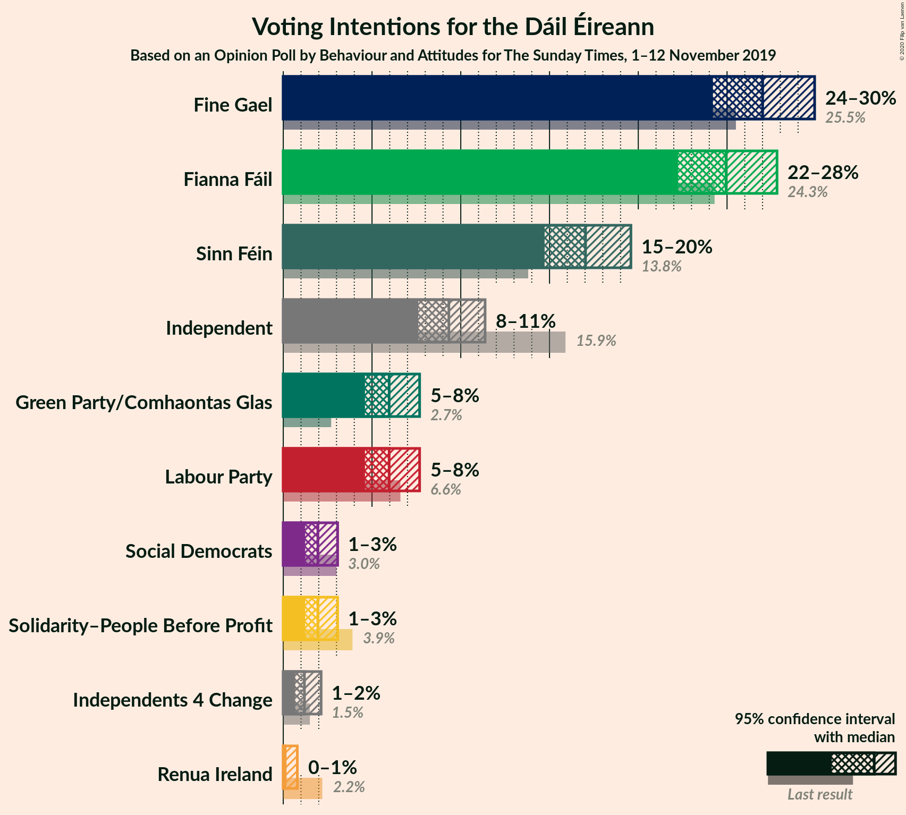
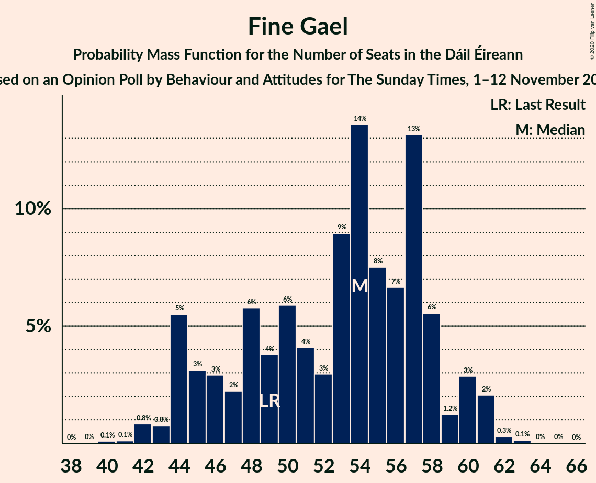
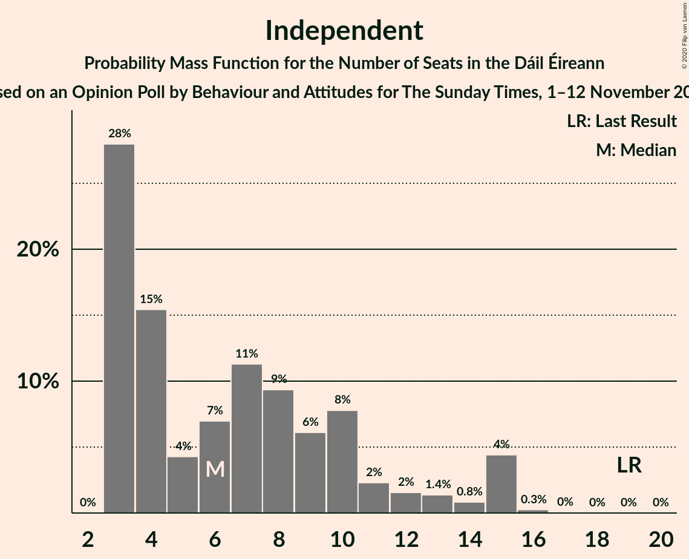
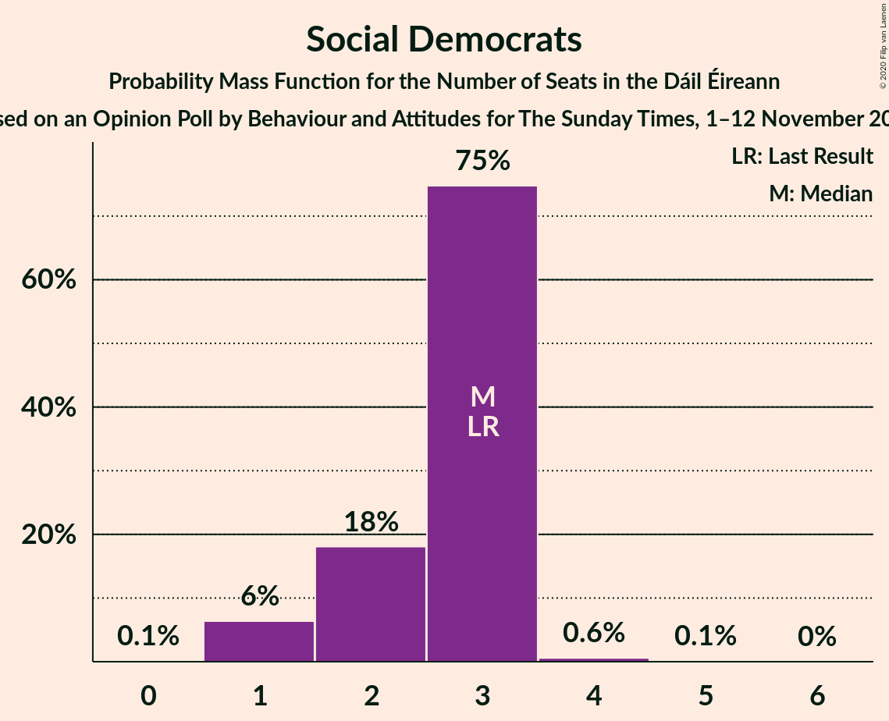
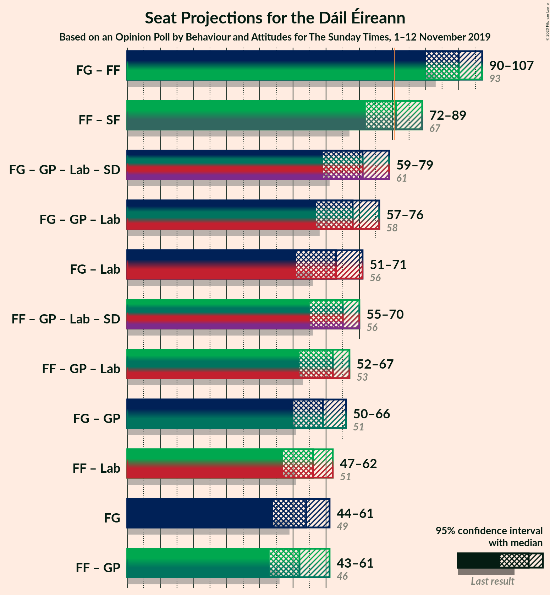

# Opinion Poll by Behaviour and Attitudes for The Sunday Times, 1–12 November 2019

<a href="#voting-intentions">Voting Intentions</a> | <a href="#seats">Seats</a> | <a href="#coalitions">Coalitions</a> | <a href="#technical-information">Technical Information</a>

## Voting Intentions

### Confidence Intervals

| Party | Last Result | Poll Result | 80% Confidence Interval | 90% Confidence Interval | 95% Confidence Interval | 99% Confidence Interval |
|:-----:|:-----------:|:-----------:|:-----------------------:|:-----------------------:|:-----------------------:|:-----------------------:|
| Fine Gael | 25.5% | 27.0% | 25.2–28.9% |24.6–29.5% |24.2–29.9% |23.4–30.9% |
| Fianna Fáil | 24.3% | 24.9% | 23.2–26.8% |22.7–27.3% |22.2–27.8% |21.4–28.7% |
| Sinn Féin | 13.8% | 17.0% | 15.5–18.7% |15.1–19.2% |14.7–19.6% |14.0–20.4% |
| Independent | 15.9% | 9.3% | 8.2–10.7% |7.9–11.0% |7.6–11.4% |7.1–12.0% |
| Labour Party | 6.6% | 6.0% | 5.1–7.1% |4.8–7.4% |4.6–7.7% |4.2–8.3% |
| Green Party/Comhaontas Glas | 2.7% | 6.0% | 5.1–7.1% |4.8–7.4% |4.6–7.7% |4.2–8.3% |
| Solidarity–People Before Profit | 3.9% | 2.0% | 1.5–2.7% |1.3–2.9% |1.2–3.1% |1.0–3.5% |
| Social Democrats | 3.0% | 2.0% | 1.5–2.7% |1.3–2.9% |1.2–3.1% |1.0–3.5% |
| Independents 4 Change | 1.5% | 1.2% | 0.8–1.8% |0.7–2.0% |0.7–2.1% |0.5–2.5% |
| Renua Ireland | 2.2% | 0.2% | 0.1–0.6% |0.1–0.7% |0.1–0.8% |0.0–1.0% |

*Note:* The poll result column reflects the actual value used in the calculations. Published results may vary slightly, and in addition be rounded to fewer digits.

## Seats

### Confidence Intervals

| Party | Last Result | Median | 80% Confidence Interval | 90% Confidence Interval | 95% Confidence Interval | 99% Confidence Interval |
|:-----:|:-----------:|:------:|:-----------------------:|:-----------------------:|:-----------------------:|:-----------------------:|
| <a href="#fine-gael">Fine Gael</a> | 49 | 53 | 44–56 |44–58 |43–59 |42–61 |
| <a href="#fianna-fáil">Fianna Fáil</a> | 44 | 48 | 42–51 |40–52 |37–55 |34–55 |
| <a href="#sinn-féin">Sinn Féin</a> | 23 | 34 | 32–36 |31–37 |31–37 |28–38 |
| <a href="#independent">Independent</a> | 19 | 7 | 4–15 |3–15 |3–15 |3–16 |
| <a href="#labour-party">Labour Party</a> | 7 | 7 | 6–13 |3–15 |3–16 |1–18 |
| <a href="#green-party/comhaontas-glas">Green Party/Comhaontas Glas</a> | 2 | 7 | 4–7 |4–8 |4–8 |3–10 |
| <a href="#solidarity–people-before-profit">Solidarity–People Before Profit</a> | 6 | 0 | 0–2 |0–2 |0–2 |0–3 |
| <a href="#social-democrats">Social Democrats</a> | 3 | 3 | 2–3 |1–3 |1–3 |1–4 |
| <a href="#independents-4-change">Independents 4 Change</a> | 4 | 3 | 2–3 |2–3 |2–3 |1–3 |
| <a href="#renua-ireland">Renua Ireland</a> | 0 | 0 | 0 |0 |0 |0 |

### Fine Gael

*For a full overview of the results for this party, see the [Fine Gael](party-finegael.html) page.*

| Number of Seats | Probability | Accumulated | Special Marks |
|:---------------:|:-----------:|:-----------:|:-------------:|
| 40 | 0.2% | 100% |  |
| 41 | 0.1% | 99.8% |  |
| 42 | 1.4% | 99.7% |  |
| 43 | 0.9% | 98% |  |
| 44 | 12% | 97% |  |
| 45 | 7% | 85% |  |
| 46 | 4% | 78% |  |
| 47 | 3% | 74% |  |
| 48 | 6% | 71% |  |
| 49 | 2% | 64% | Last Result |
| 50 | 1.0% | 63% |  |
| 51 | 1.5% | 62% |  |
| 52 | 4% | 60% |  |
| 53 | 10% | 56% | Median |
| 54 | 29% | 47% |  |
| 55 | 2% | 18% |  |
| 56 | 7% | 16% |  |
| 57 | 3% | 8% |  |
| 58 | 2% | 6% |  |
| 59 | 1.5% | 4% |  |
| 60 | 1.5% | 2% |  |
| 61 | 0.4% | 0.7% |  |
| 62 | 0.1% | 0.4% |  |
| 63 | 0.2% | 0.2% |  |
| 64 | 0% | 0.1% |  |
| 65 | 0% | 0% |  |

### Fianna Fáil

*For a full overview of the results for this party, see the [Fianna Fáil](party-fiannafáil.html) page.*

| Number of Seats | Probability | Accumulated | Special Marks |
|:---------------:|:-----------:|:-----------:|:-------------:|
| 33 | 0% | 100% |  |
| 34 | 0.5% | 99.9% |  |
| 35 | 0.7% | 99.4% |  |
| 36 | 0.7% | 98.7% |  |
| 37 | 1.1% | 98% |  |
| 38 | 1.0% | 97% |  |
| 39 | 0.8% | 96% |  |
| 40 | 0.4% | 95% |  |
| 41 | 4% | 95% |  |
| 42 | 1.3% | 91% |  |
| 43 | 9% | 90% |  |
| 44 | 1.2% | 81% | Last Result |
| 45 | 6% | 80% |  |
| 46 | 7% | 74% |  |
| 47 | 2% | 67% |  |
| 48 | 18% | 65% | Median |
| 49 | 27% | 46% |  |
| 50 | 6% | 19% |  |
| 51 | 8% | 13% |  |
| 52 | 1.2% | 6% |  |
| 53 | 0.8% | 4% |  |
| 54 | 0.6% | 4% |  |
| 55 | 3% | 3% |  |
| 56 | 0% | 0.1% |  |
| 57 | 0% | 0% |  |

### Sinn Féin

*For a full overview of the results for this party, see the [Sinn Féin](party-sinnféin.html) page.*

| Number of Seats | Probability | Accumulated | Special Marks |
|:---------------:|:-----------:|:-----------:|:-------------:|
| 22 | 0% | 100% |  |
| 23 | 0% | 99.9% | Last Result |
| 24 | 0% | 99.9% |  |
| 25 | 0% | 99.9% |  |
| 26 | 0.1% | 99.9% |  |
| 27 | 0.2% | 99.8% |  |
| 28 | 0.2% | 99.6% |  |
| 29 | 0.3% | 99.4% |  |
| 30 | 1.2% | 99.2% |  |
| 31 | 7% | 98% |  |
| 32 | 9% | 91% |  |
| 33 | 9% | 82% |  |
| 34 | 40% | 73% | Median |
| 35 | 18% | 33% |  |
| 36 | 8% | 15% |  |
| 37 | 6% | 7% |  |
| 38 | 0.7% | 0.9% |  |
| 39 | 0.1% | 0.1% |  |
| 40 | 0% | 0% |  |

### Independent

*For a full overview of the results for this party, see the [Independent](party-independent.html) page.*

| Number of Seats | Probability | Accumulated | Special Marks |
|:---------------:|:-----------:|:-----------:|:-------------:|
| 3 | 9% | 100% |  |
| 4 | 28% | 91% |  |
| 5 | 8% | 63% |  |
| 6 | 2% | 55% |  |
| 7 | 14% | 53% | Median |
| 8 | 8% | 39% |  |
| 9 | 4% | 31% |  |
| 10 | 7% | 27% |  |
| 11 | 3% | 20% |  |
| 12 | 2% | 17% |  |
| 13 | 3% | 15% |  |
| 14 | 1.4% | 12% |  |
| 15 | 10% | 11% |  |
| 16 | 0.4% | 0.5% |  |
| 17 | 0.1% | 0.1% |  |
| 18 | 0% | 0% |  |
| 19 | 0% | 0% | Last Result |

### Labour Party

*For a full overview of the results for this party, see the [Labour Party](party-labourparty.html) page.*

| Number of Seats | Probability | Accumulated | Special Marks |
|:---------------:|:-----------:|:-----------:|:-------------:|
| 1 | 0.6% | 100% |  |
| 2 | 1.4% | 99.4% |  |
| 3 | 4% | 98% |  |
| 4 | 0.9% | 94% |  |
| 5 | 3% | 93% |  |
| 6 | 3% | 91% |  |
| 7 | 39% | 87% | Last Result, Median |
| 8 | 19% | 49% |  |
| 9 | 7% | 29% |  |
| 10 | 3% | 23% |  |
| 11 | 6% | 20% |  |
| 12 | 3% | 14% |  |
| 13 | 2% | 11% |  |
| 14 | 2% | 9% |  |
| 15 | 2% | 7% |  |
| 16 | 3% | 5% |  |
| 17 | 0.8% | 2% |  |
| 18 | 0.8% | 1.0% |  |
| 19 | 0.2% | 0.2% |  |
| 20 | 0% | 0% |  |

### Green Party/Comhaontas Glas

*For a full overview of the results for this party, see the [Green Party/Comhaontas Glas](party-greenpartycomhaontasglas.html) page.*

| Number of Seats | Probability | Accumulated | Special Marks |
|:---------------:|:-----------:|:-----------:|:-------------:|
| 2 | 0.4% | 100% | Last Result |
| 3 | 1.2% | 99.6% |  |
| 4 | 12% | 98% |  |
| 5 | 17% | 86% |  |
| 6 | 1.4% | 69% |  |
| 7 | 60% | 68% | Median |
| 8 | 6% | 8% |  |
| 9 | 1.1% | 2% |  |
| 10 | 0.4% | 0.6% |  |
| 11 | 0.2% | 0.2% |  |
| 12 | 0% | 0% |  |

### Solidarity–People Before Profit

*For a full overview of the results for this party, see the [Solidarity–People Before Profit](party-solidarity–peoplebeforeprofit.html) page.*

| Number of Seats | Probability | Accumulated | Special Marks |
|:---------------:|:-----------:|:-----------:|:-------------:|
| 0 | 53% | 100% | Median |
| 1 | 37% | 47% |  |
| 2 | 9% | 10% |  |
| 3 | 1.4% | 1.5% |  |
| 4 | 0.1% | 0.1% |  |
| 5 | 0% | 0% |  |
| 6 | 0% | 0% | Last Result |

### Social Democrats

*For a full overview of the results for this party, see the [Social Democrats](party-socialdemocrats.html) page.*

| Number of Seats | Probability | Accumulated | Special Marks |
|:---------------:|:-----------:|:-----------:|:-------------:|
| 0 | 0.1% | 100% |  |
| 1 | 5% | 99.9% |  |
| 2 | 38% | 94% |  |
| 3 | 56% | 57% | Last Result, Median |
| 4 | 0.5% | 0.7% |  |
| 5 | 0.2% | 0.2% |  |
| 6 | 0% | 0% |  |

### Independents 4 Change

*For a full overview of the results for this party, see the [Independents 4 Change](party-independents4change.html) page.*

| Number of Seats | Probability | Accumulated | Special Marks |
|:---------------:|:-----------:|:-----------:|:-------------:|
| 0 | 0.3% | 100% |  |
| 1 | 0.8% | 99.7% |  |
| 2 | 34% | 99.0% |  |
| 3 | 65% | 65% | Median |
| 4 | 0% | 0% | Last Result |

### Renua Ireland

*For a full overview of the results for this party, see the [Renua Ireland](party-renuaireland.html) page.*

| Number of Seats | Probability | Accumulated | Special Marks |
|:---------------:|:-----------:|:-----------:|:-------------:|
| 0 | 99.5% | 100% | Last Result, Median |
| 1 | 0.5% | 0.5% |  |
| 2 | 0% | 0% |  |

## Coalitions

### Confidence Intervals

| Coalition | Last Result | Median | Majority? | 80% Confidence Interval | 90% Confidence Interval | 95% Confidence Interval | 99% Confidence Interval |
|:---------:|:-----------:|:------:|:---------:|:-----------------------:|:-----------------------:|:-----------------------:|:-----------------------:|
| Fine Gael – Fianna Fáil | 93 | 99 | 100% | 92–103 | 91–103 | 90–105 | 87–108 |
| Fianna Fáil – Sinn Féin | 67 | 83 | 70% | 75–86 | 72–86 | 70–90 | 68–90 |
| Fine Gael – Green Party/Comhaontas Glas – Labour Party – Social Democrats | 61 | 70 | 0.5% | 61–76 | 60–78 | 57–78 | 57–80 |
| Fine Gael – Green Party/Comhaontas Glas – Labour Party | 58 | 68 | 0.2% | 58–73 | 58–75 | 54–76 | 54–78 |
| Fianna Fáil – Green Party/Comhaontas Glas – Labour Party – Social Democrats | 56 | 65 | 0% | 60–69 | 58–69 | 55–70 | 51–73 |
| Fine Gael – Labour Party | 56 | 61 | 0% | 51–67 | 51–68 | 47–70 | 47–72 |
| Fianna Fáil – Green Party/Comhaontas Glas – Labour Party | 53 | 63 | 0% | 57–66 | 55–66 | 52–67 | 48–70 |
| Fine Gael – Green Party/Comhaontas Glas | 51 | 59 | 0% | 51–63 | 51–64 | 50–65 | 48–67 |
| Fianna Fáil – Green Party/Comhaontas Glas | 46 | 55 | 0% | 47–58 | 45–58 | 43–62 | 39–62 |
| Fianna Fáil – Labour Party | 51 | 56 | 0% | 52–59 | 48–60 | 47–61 | 43–65 |
| Fine Gael | 49 | 53 | 0% | 44–56 | 44–58 | 43–59 | 42–61 |

### Fine Gael – Fianna Fáil

| Number of Seats | Probability | Accumulated | Special Marks |
|:---------------:|:-----------:|:-----------:|:-------------:|
| 84 | 0.1% | 100% |  |
| 85 | 0% | 99.9% |  |
| 86 | 0.1% | 99.9% |  |
| 87 | 0.5% | 99.8% |  |
| 88 | 0.5% | 99.3% |  |
| 89 | 0.3% | 98.9% |  |
| 90 | 3% | 98.5% |  |
| 91 | 3% | 95% |  |
| 92 | 11% | 93% |  |
| 93 | 0.5% | 81% | Last Result |
| 94 | 3% | 81% |  |
| 95 | 3% | 78% |  |
| 96 | 12% | 75% |  |
| 97 | 6% | 63% |  |
| 98 | 1.2% | 57% |  |
| 99 | 17% | 56% |  |
| 100 | 2% | 39% |  |
| 101 | 2% | 37% | Median |
| 102 | 4% | 35% |  |
| 103 | 28% | 31% |  |
| 104 | 0.5% | 4% |  |
| 105 | 0.7% | 3% |  |
| 106 | 0.4% | 2% |  |
| 107 | 0.8% | 2% |  |
| 108 | 1.0% | 1.2% |  |
| 109 | 0.1% | 0.3% |  |
| 110 | 0.1% | 0.2% |  |
| 111 | 0.1% | 0.2% |  |
| 112 | 0% | 0.1% |  |
| 113 | 0% | 0% |  |

### Fianna Fáil – Sinn Féin

| Number of Seats | Probability | Accumulated | Special Marks |
|:---------------:|:-----------:|:-----------:|:-------------:|
| 67 | 0% | 100% | Last Result |
| 68 | 0.5% | 100% |  |
| 69 | 1.4% | 99.5% |  |
| 70 | 1.0% | 98% |  |
| 71 | 0.2% | 97% |  |
| 72 | 2% | 97% |  |
| 73 | 2% | 95% |  |
| 74 | 0.6% | 93% |  |
| 75 | 2% | 92% |  |
| 76 | 9% | 90% |  |
| 77 | 1.0% | 81% |  |
| 78 | 7% | 80% |  |
| 79 | 2% | 73% |  |
| 80 | 1.1% | 71% |  |
| 81 | 4% | 70% | Majority |
| 82 | 13% | 65% | Median |
| 83 | 28% | 52% |  |
| 84 | 5% | 25% |  |
| 85 | 9% | 20% |  |
| 86 | 7% | 11% |  |
| 87 | 0.2% | 4% |  |
| 88 | 0.7% | 4% |  |
| 89 | 0.1% | 3% |  |
| 90 | 3% | 3% |  |
| 91 | 0% | 0% |  |

### Fine Gael – Green Party/Comhaontas Glas – Labour Party – Social Democrats

| Number of Seats | Probability | Accumulated | Special Marks |
|:---------------:|:-----------:|:-----------:|:-------------:|
| 56 | 0% | 100% |  |
| 57 | 3% | 99.9% |  |
| 58 | 0.5% | 97% |  |
| 59 | 0.2% | 97% |  |
| 60 | 2% | 97% |  |
| 61 | 10% | 95% | Last Result |
| 62 | 1.4% | 84% |  |
| 63 | 7% | 83% |  |
| 64 | 4% | 76% |  |
| 65 | 8% | 73% |  |
| 66 | 2% | 65% |  |
| 67 | 3% | 63% |  |
| 68 | 1.4% | 60% |  |
| 69 | 3% | 59% |  |
| 70 | 32% | 56% | Median |
| 71 | 2% | 23% |  |
| 72 | 3% | 21% |  |
| 73 | 2% | 18% |  |
| 74 | 2% | 16% |  |
| 75 | 1.0% | 13% |  |
| 76 | 6% | 12% |  |
| 77 | 0.6% | 6% |  |
| 78 | 3% | 6% |  |
| 79 | 0.7% | 2% |  |
| 80 | 1.2% | 2% |  |
| 81 | 0.2% | 0.5% | Majority |
| 82 | 0.2% | 0.3% |  |
| 83 | 0% | 0% |  |

### Fine Gael – Green Party/Comhaontas Glas – Labour Party

| Number of Seats | Probability | Accumulated | Special Marks |
|:---------------:|:-----------:|:-----------:|:-------------:|
| 53 | 0.1% | 100% |  |
| 54 | 3% | 99.9% |  |
| 55 | 0.5% | 97% |  |
| 56 | 0.2% | 97% |  |
| 57 | 1.4% | 97% |  |
| 58 | 11% | 95% | Last Result |
| 59 | 1.5% | 84% |  |
| 60 | 7% | 83% |  |
| 61 | 1.1% | 76% |  |
| 62 | 5% | 75% |  |
| 63 | 6% | 70% |  |
| 64 | 2% | 64% |  |
| 65 | 2% | 61% |  |
| 66 | 4% | 59% |  |
| 67 | 2% | 56% | Median |
| 68 | 32% | 54% |  |
| 69 | 4% | 22% |  |
| 70 | 1.4% | 18% |  |
| 71 | 2% | 17% |  |
| 72 | 2% | 14% |  |
| 73 | 5% | 12% |  |
| 74 | 0.5% | 7% |  |
| 75 | 4% | 7% |  |
| 76 | 0.8% | 3% |  |
| 77 | 1.4% | 2% |  |
| 78 | 0.2% | 0.5% |  |
| 79 | 0.1% | 0.4% |  |
| 80 | 0.1% | 0.3% |  |
| 81 | 0.2% | 0.2% | Majority |
| 82 | 0% | 0% |  |

### Fianna Fáil – Green Party/Comhaontas Glas – Labour Party – Social Democrats

| Number of Seats | Probability | Accumulated | Special Marks |
|:---------------:|:-----------:|:-----------:|:-------------:|
| 46 | 0.1% | 100% |  |
| 47 | 0% | 99.9% |  |
| 48 | 0% | 99.9% |  |
| 49 | 0.1% | 99.9% |  |
| 50 | 0.1% | 99.8% |  |
| 51 | 0.2% | 99.7% |  |
| 52 | 0.1% | 99.5% |  |
| 53 | 0.8% | 99.3% |  |
| 54 | 0.5% | 98.6% |  |
| 55 | 2% | 98% |  |
| 56 | 0.7% | 97% | Last Result |
| 57 | 0.2% | 96% |  |
| 58 | 2% | 96% |  |
| 59 | 3% | 93% |  |
| 60 | 4% | 90% |  |
| 61 | 2% | 87% |  |
| 62 | 3% | 84% |  |
| 63 | 11% | 81% |  |
| 64 | 3% | 70% |  |
| 65 | 42% | 67% | Median |
| 66 | 4% | 25% |  |
| 67 | 4% | 21% |  |
| 68 | 5% | 17% |  |
| 69 | 9% | 12% |  |
| 70 | 1.0% | 3% |  |
| 71 | 0.9% | 2% |  |
| 72 | 0.3% | 0.9% |  |
| 73 | 0.1% | 0.5% |  |
| 74 | 0.1% | 0.4% |  |
| 75 | 0.1% | 0.3% |  |
| 76 | 0% | 0.2% |  |
| 77 | 0.1% | 0.2% |  |
| 78 | 0% | 0% |  |

### Fine Gael – Labour Party

| Number of Seats | Probability | Accumulated | Special Marks |
|:---------------:|:-----------:|:-----------:|:-------------:|
| 47 | 3% | 100% |  |
| 48 | 0.4% | 97% |  |
| 49 | 0% | 97% |  |
| 50 | 1.3% | 97% |  |
| 51 | 10% | 96% |  |
| 52 | 1.0% | 86% |  |
| 53 | 7% | 85% |  |
| 54 | 0.8% | 78% |  |
| 55 | 4% | 77% |  |
| 56 | 7% | 73% | Last Result |
| 57 | 2% | 66% |  |
| 58 | 2% | 64% |  |
| 59 | 2% | 62% |  |
| 60 | 1.2% | 60% | Median |
| 61 | 28% | 58% |  |
| 62 | 3% | 30% |  |
| 63 | 1.3% | 28% |  |
| 64 | 9% | 26% |  |
| 65 | 5% | 17% |  |
| 66 | 1.5% | 12% |  |
| 67 | 3% | 11% |  |
| 68 | 4% | 8% |  |
| 69 | 0.6% | 4% |  |
| 70 | 1.2% | 4% |  |
| 71 | 0.5% | 2% |  |
| 72 | 1.5% | 2% |  |
| 73 | 0.1% | 0.5% |  |
| 74 | 0.2% | 0.4% |  |
| 75 | 0% | 0.2% |  |
| 76 | 0.2% | 0.2% |  |
| 77 | 0% | 0% |  |

### Fianna Fáil – Green Party/Comhaontas Glas – Labour Party

| Number of Seats | Probability | Accumulated | Special Marks |
|:---------------:|:-----------:|:-----------:|:-------------:|
| 43 | 0.1% | 100% |  |
| 44 | 0% | 99.9% |  |
| 45 | 0% | 99.9% |  |
| 46 | 0.1% | 99.9% |  |
| 47 | 0.1% | 99.8% |  |
| 48 | 0.3% | 99.7% |  |
| 49 | 0.1% | 99.4% |  |
| 50 | 0.7% | 99.3% |  |
| 51 | 0.5% | 98.6% |  |
| 52 | 2% | 98% |  |
| 53 | 0.7% | 97% | Last Result |
| 54 | 0.2% | 96% |  |
| 55 | 3% | 96% |  |
| 56 | 2% | 93% |  |
| 57 | 3% | 91% |  |
| 58 | 3% | 88% |  |
| 59 | 4% | 86% |  |
| 60 | 6% | 82% |  |
| 61 | 8% | 75% |  |
| 62 | 11% | 67% | Median |
| 63 | 34% | 56% |  |
| 64 | 2% | 22% |  |
| 65 | 7% | 20% |  |
| 66 | 10% | 13% |  |
| 67 | 1.0% | 3% |  |
| 68 | 0.8% | 2% |  |
| 69 | 0.4% | 1.0% |  |
| 70 | 0.2% | 0.6% |  |
| 71 | 0.2% | 0.5% |  |
| 72 | 0.1% | 0.3% |  |
| 73 | 0.1% | 0.2% |  |
| 74 | 0.1% | 0.2% |  |
| 75 | 0% | 0% |  |

### Fine Gael – Green Party/Comhaontas Glas

| Number of Seats | Probability | Accumulated | Special Marks |
|:---------------:|:-----------:|:-----------:|:-------------:|
| 45 | 0% | 100% |  |
| 46 | 0.1% | 99.9% |  |
| 47 | 0.2% | 99.8% |  |
| 48 | 0.3% | 99.6% |  |
| 49 | 2% | 99.2% |  |
| 50 | 2% | 98% |  |
| 51 | 13% | 95% | Last Result |
| 52 | 8% | 83% |  |
| 53 | 2% | 75% |  |
| 54 | 4% | 72% |  |
| 55 | 6% | 68% |  |
| 56 | 1.4% | 62% |  |
| 57 | 8% | 61% |  |
| 58 | 3% | 53% |  |
| 59 | 6% | 50% |  |
| 60 | 3% | 44% | Median |
| 61 | 27% | 41% |  |
| 62 | 2% | 14% |  |
| 63 | 3% | 12% |  |
| 64 | 7% | 9% |  |
| 65 | 2% | 3% |  |
| 66 | 0.4% | 1.0% |  |
| 67 | 0.4% | 0.6% |  |
| 68 | 0.1% | 0.2% |  |
| 69 | 0% | 0.1% |  |
| 70 | 0% | 0.1% |  |
| 71 | 0% | 0% |  |

### Fianna Fáil – Green Party/Comhaontas Glas

| Number of Seats | Probability | Accumulated | Special Marks |
|:---------------:|:-----------:|:-----------:|:-------------:|
| 38 | 0.2% | 100% |  |
| 39 | 0.3% | 99.8% |  |
| 40 | 0.5% | 99.4% |  |
| 41 | 0.3% | 99.0% |  |
| 42 | 0.7% | 98.7% |  |
| 43 | 2% | 98% |  |
| 44 | 0.7% | 96% |  |
| 45 | 2% | 95% |  |
| 46 | 3% | 94% | Last Result |
| 47 | 1.5% | 91% |  |
| 48 | 0.9% | 90% |  |
| 49 | 2% | 89% |  |
| 50 | 12% | 86% |  |
| 51 | 6% | 75% |  |
| 52 | 2% | 68% |  |
| 53 | 3% | 66% |  |
| 54 | 2% | 63% |  |
| 55 | 18% | 61% | Median |
| 56 | 26% | 42% |  |
| 57 | 4% | 16% |  |
| 58 | 8% | 12% |  |
| 59 | 1.0% | 4% |  |
| 60 | 0.2% | 3% |  |
| 61 | 0.4% | 3% |  |
| 62 | 3% | 3% |  |
| 63 | 0.1% | 0.1% |  |
| 64 | 0% | 0% |  |

### Fianna Fáil – Labour Party

| Number of Seats | Probability | Accumulated | Special Marks |
|:---------------:|:-----------:|:-----------:|:-------------:|
| 38 | 0.1% | 100% |  |
| 39 | 0% | 99.9% |  |
| 40 | 0% | 99.9% |  |
| 41 | 0.1% | 99.8% |  |
| 42 | 0.1% | 99.8% |  |
| 43 | 0.4% | 99.7% |  |
| 44 | 0.3% | 99.2% |  |
| 45 | 0.4% | 98.9% |  |
| 46 | 0.4% | 98.5% |  |
| 47 | 2% | 98% |  |
| 48 | 0.9% | 96% |  |
| 49 | 0.5% | 95% |  |
| 50 | 2% | 94% |  |
| 51 | 2% | 92% | Last Result |
| 52 | 7% | 90% |  |
| 53 | 3% | 83% |  |
| 54 | 3% | 80% |  |
| 55 | 13% | 78% | Median |
| 56 | 32% | 65% |  |
| 57 | 9% | 33% |  |
| 58 | 8% | 24% |  |
| 59 | 10% | 16% |  |
| 60 | 3% | 6% |  |
| 61 | 1.1% | 3% |  |
| 62 | 0.6% | 2% |  |
| 63 | 0.1% | 1.1% |  |
| 64 | 0.3% | 0.9% |  |
| 65 | 0.2% | 0.6% |  |
| 66 | 0.2% | 0.4% |  |
| 67 | 0% | 0.2% |  |
| 68 | 0% | 0.2% |  |
| 69 | 0% | 0.2% |  |
| 70 | 0.1% | 0.1% |  |
| 71 | 0% | 0% |  |

### Fine Gael

| Number of Seats | Probability | Accumulated | Special Marks |
|:---------------:|:-----------:|:-----------:|:-------------:|
| 40 | 0.2% | 100% |  |
| 41 | 0.1% | 99.8% |  |
| 42 | 1.4% | 99.7% |  |
| 43 | 0.9% | 98% |  |
| 44 | 12% | 97% |  |
| 45 | 7% | 85% |  |
| 46 | 4% | 78% |  |
| 47 | 3% | 74% |  |
| 48 | 6% | 71% |  |
| 49 | 2% | 64% | Last Result |
| 50 | 1.0% | 63% |  |
| 51 | 1.5% | 62% |  |
| 52 | 4% | 60% |  |
| 53 | 10% | 56% | Median |
| 54 | 29% | 47% |  |
| 55 | 2% | 18% |  |
| 56 | 7% | 16% |  |
| 57 | 3% | 8% |  |
| 58 | 2% | 6% |  |
| 59 | 1.5% | 4% |  |
| 60 | 1.5% | 2% |  |
| 61 | 0.4% | 0.7% |  |
| 62 | 0.1% | 0.4% |  |
| 63 | 0.2% | 0.2% |  |
| 64 | 0% | 0.1% |  |
| 65 | 0% | 0% |  |

## Technical Information

### Opinion Poll

+ **Polling firm:** Behaviour and Attitudes
+ **Commissioner(s):** The Sunday Times
+ **Fieldwork period:** 1–12 November 2019

### Calculations

+ **Sample size:** 923
+ **Simulations done:** 524,288
+ **Error estimate:** 2.35%

