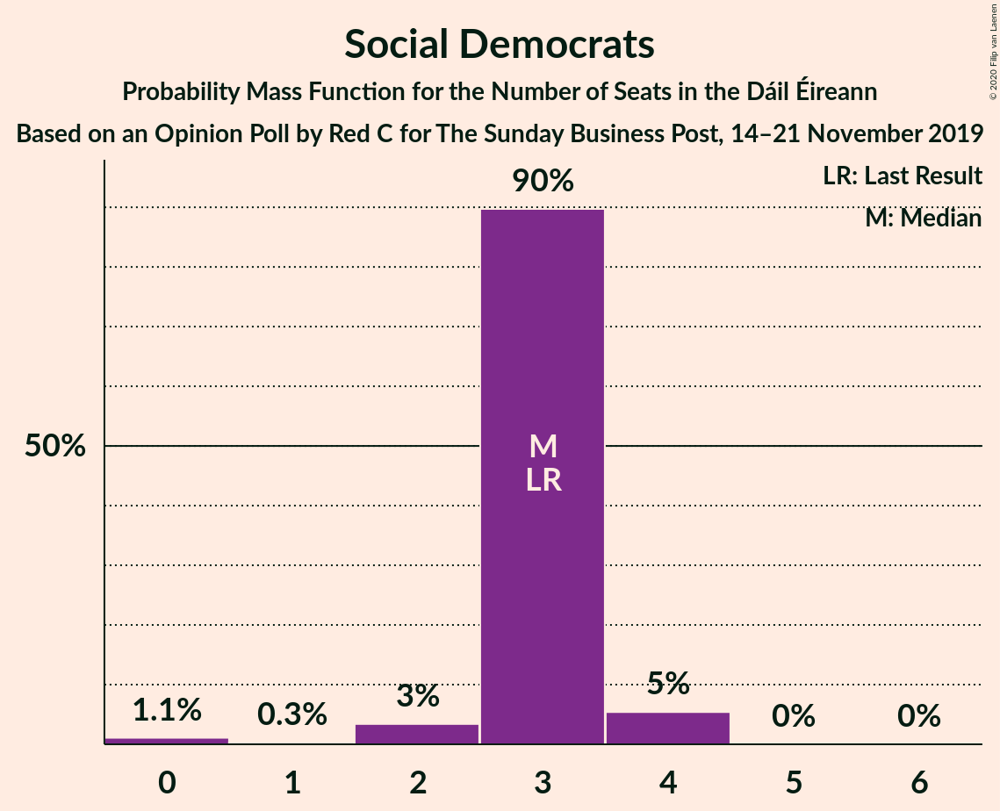

# Opinion Poll by Red C for The Sunday Business Post, 14–21 November 2019

<a href="#voting-intentions">Voting Intentions</a> | <a href="#seats">Seats</a> | <a href="#coalitions">Coalitions</a> | <a href="#technical-information">Technical Information</a>

## Voting Intentions

### Confidence Intervals

| Party | Last Result | Poll Result | 80% Confidence Interval | 90% Confidence Interval | 95% Confidence Interval | 99% Confidence Interval |
|:-----:|:-----------:|:-----------:|:-----------------------:|:-----------------------:|:-----------------------:|:-----------------------:|
| Fine Gael | 25.5% | 30.0% | 28.2–31.9% |27.7–32.4% |27.2–32.9% |26.4–33.9% |
| Fianna Fáil | 24.3% | 24.0% | 22.3–25.8% |21.9–26.3% |21.4–26.7% |20.7–27.6% |
| Independent | 15.9% | 12.4% | 11.1–13.8% |10.8–14.2% |10.5–14.6% |9.9–15.3% |
| Sinn Féin | 13.8% | 11.0% | 9.8–12.4% |9.5–12.8% |9.2–13.1% |8.7–13.8% |
| Green Party/Comhaontas Glas | 2.7% | 7.0% | 6.1–8.2% |5.8–8.5% |5.6–8.8% |5.2–9.3% |
| Labour Party | 6.6% | 6.0% | 5.1–7.1% |4.9–7.4% |4.7–7.7% |4.3–8.2% |
| Solidarity–People Before Profit | 3.9% | 2.0% | 1.5–2.7% |1.4–2.9% |1.3–3.1% |1.1–3.4% |
| Social Democrats | 3.0% | 2.0% | 1.5–2.7% |1.4–2.9% |1.3–3.1% |1.1–3.4% |
| Independents 4 Change | 1.5% | 1.6% | 1.2–2.2% |1.1–2.4% |1.0–2.6% |0.8–2.9% |

*Note:* The poll result column reflects the actual value used in the calculations. Published results may vary slightly, and in addition be rounded to fewer digits.

## Seats

### Confidence Intervals

| Party | Last Result | Median | 80% Confidence Interval | 90% Confidence Interval | 95% Confidence Interval | 99% Confidence Interval |
|:-----:|:-----------:|:------:|:-----------------------:|:-----------------------:|:-----------------------:|:-----------------------:|
| <a href="#fine-gael">Fine Gael</a> | 49 | 70 | 64–71 |60–71 |59–73 |55–76 |
| <a href="#fianna-fáil">Fianna Fáil</a> | 44 | 45 | 44–51 |42–53 |42–53 |41–56 |
| <a href="#independent">Independent</a> | 19 | 17 | 15–19 |15–19 |15–22 |12–23 |
| <a href="#sinn-féin">Sinn Féin</a> | 23 | 15 | 11–17 |11–17 |11–17 |9–18 |
| <a href="#green-party/comhaontas-glas">Green Party/Comhaontas Glas</a> | 2 | 4 | 3–6 |3–8 |3–8 |2–8 |
| <a href="#labour-party">Labour Party</a> | 7 | 2 | 1–5 |1–5 |1–8 |0–10 |
| <a href="#solidarity–people-before-profit">Solidarity–People Before Profit</a> | 6 | 0 | 0–1 |0–1 |0–2 |0–3 |
| <a href="#social-democrats">Social Democrats</a> | 3 | 3 | 1–3 |1–3 |1–3 |1–4 |
| <a href="#independents-4-change">Independents 4 Change</a> | 4 | 2 | 2–5 |1–5 |1–5 |0–5 |

### Fine Gael

*For a full overview of the results for this party, see the [Fine Gael](party-finegael.html) page.*

| Number of Seats | Probability | Accumulated | Special Marks |
|:---------------:|:-----------:|:-----------:|:-------------:|
| 49 | 0% | 100% | Last Result |
| 50 | 0% | 100% |  |
| 51 | 0% | 100% |  |
| 52 | 0% | 100% |  |
| 53 | 0% | 100% |  |
| 54 | 0% | 100% |  |
| 55 | 2% | 100% |  |
| 56 | 0.2% | 98% |  |
| 57 | 0.1% | 98% |  |
| 58 | 0.2% | 98% |  |
| 59 | 1.2% | 98% |  |
| 60 | 6% | 97% |  |
| 61 | 0.1% | 90% |  |
| 62 | 0% | 90% |  |
| 63 | 0% | 90% |  |
| 64 | 0.6% | 90% |  |
| 65 | 5% | 90% |  |
| 66 | 0.5% | 85% |  |
| 67 | 0.1% | 84% |  |
| 68 | 1.3% | 84% |  |
| 69 | 8% | 83% |  |
| 70 | 27% | 75% | Median |
| 71 | 44% | 48% |  |
| 72 | 1.2% | 4% |  |
| 73 | 1.0% | 3% |  |
| 74 | 0% | 2% |  |
| 75 | 0% | 1.5% |  |
| 76 | 1.0% | 1.5% |  |
| 77 | 0.5% | 0.5% |  |
| 78 | 0% | 0% |  |

### Fianna Fáil

*For a full overview of the results for this party, see the [Fianna Fáil](party-fiannafáil.html) page.*

| Number of Seats | Probability | Accumulated | Special Marks |
|:---------------:|:-----------:|:-----------:|:-------------:|
| 41 | 1.0% | 100% |  |
| 42 | 5% | 99.0% |  |
| 43 | 1.1% | 94% |  |
| 44 | 31% | 93% | Last Result |
| 45 | 35% | 63% | Median |
| 46 | 0.1% | 28% |  |
| 47 | 13% | 27% |  |
| 48 | 0.3% | 14% |  |
| 49 | 2% | 14% |  |
| 50 | 2% | 12% |  |
| 51 | 1.4% | 10% |  |
| 52 | 3% | 9% |  |
| 53 | 5% | 6% |  |
| 54 | 0.1% | 1.0% |  |
| 55 | 0.1% | 0.9% |  |
| 56 | 0.4% | 0.8% |  |
| 57 | 0.4% | 0.4% |  |
| 58 | 0% | 0% |  |

### Independent

*For a full overview of the results for this party, see the [Independent](party-independent.html) page.*

| Number of Seats | Probability | Accumulated | Special Marks |
|:---------------:|:-----------:|:-----------:|:-------------:|
| 11 | 0.1% | 100% |  |
| 12 | 0.4% | 99.9% |  |
| 13 | 0.9% | 99.5% |  |
| 14 | 0.9% | 98.6% |  |
| 15 | 16% | 98% |  |
| 16 | 8% | 82% |  |
| 17 | 27% | 74% | Median |
| 18 | 36% | 47% |  |
| 19 | 6% | 11% | Last Result |
| 20 | 1.2% | 5% |  |
| 21 | 0% | 4% |  |
| 22 | 2% | 4% |  |
| 23 | 2% | 2% |  |
| 24 | 0% | 0% |  |

### Sinn Féin

*For a full overview of the results for this party, see the [Sinn Féin](party-sinnféin.html) page.*

| Number of Seats | Probability | Accumulated | Special Marks |
|:---------------:|:-----------:|:-----------:|:-------------:|
| 8 | 0.1% | 100% |  |
| 9 | 0.9% | 99.9% |  |
| 10 | 1.0% | 99.0% |  |
| 11 | 32% | 98% |  |
| 12 | 3% | 66% |  |
| 13 | 0.5% | 63% |  |
| 14 | 3% | 63% |  |
| 15 | 29% | 60% | Median |
| 16 | 10% | 31% |  |
| 17 | 18% | 21% |  |
| 18 | 2% | 2% |  |
| 19 | 0.1% | 0.2% |  |
| 20 | 0.1% | 0.1% |  |
| 21 | 0% | 0% |  |
| 22 | 0% | 0% |  |
| 23 | 0% | 0% | Last Result |

### Green Party/Comhaontas Glas

*For a full overview of the results for this party, see the [Green Party/Comhaontas Glas](party-greenpartycomhaontasglas.html) page.*

| Number of Seats | Probability | Accumulated | Special Marks |
|:---------------:|:-----------:|:-----------:|:-------------:|
| 1 | 0.3% | 100% |  |
| 2 | 1.1% | 99.7% | Last Result |
| 3 | 17% | 98.6% |  |
| 4 | 32% | 82% | Median |
| 5 | 40% | 50% |  |
| 6 | 3% | 10% |  |
| 7 | 1.3% | 7% |  |
| 8 | 6% | 6% |  |
| 9 | 0.2% | 0.2% |  |
| 10 | 0% | 0% |  |

### Labour Party

*For a full overview of the results for this party, see the [Labour Party](party-labourparty.html) page.*

| Number of Seats | Probability | Accumulated | Special Marks |
|:---------------:|:-----------:|:-----------:|:-------------:|
| 0 | 1.3% | 100% |  |
| 1 | 47% | 98.7% |  |
| 2 | 10% | 52% | Median |
| 3 | 5% | 42% |  |
| 4 | 6% | 38% |  |
| 5 | 28% | 32% |  |
| 6 | 0% | 3% |  |
| 7 | 0.1% | 3% | Last Result |
| 8 | 2% | 3% |  |
| 9 | 0% | 1.0% |  |
| 10 | 0.9% | 0.9% |  |
| 11 | 0% | 0% |  |

### Solidarity–People Before Profit

*For a full overview of the results for this party, see the [Solidarity–People Before Profit](party-solidarity–peoplebeforeprofit.html) page.*

| Number of Seats | Probability | Accumulated | Special Marks |
|:---------------:|:-----------:|:-----------:|:-------------:|
| 0 | 54% | 100% | Median |
| 1 | 42% | 46% |  |
| 2 | 3% | 4% |  |
| 3 | 0.6% | 0.7% |  |
| 4 | 0.1% | 0.1% |  |
| 5 | 0% | 0% |  |
| 6 | 0% | 0% | Last Result |

### Social Democrats

*For a full overview of the results for this party, see the [Social Democrats](party-socialdemocrats.html) page.*

| Number of Seats | Probability | Accumulated | Special Marks |
|:---------------:|:-----------:|:-----------:|:-------------:|
| 0 | 0.5% | 100% |  |
| 1 | 11% | 99.5% |  |
| 2 | 3% | 88% |  |
| 3 | 84% | 86% | Last Result, Median |
| 4 | 1.1% | 1.1% |  |
| 5 | 0% | 0% |  |

### Independents 4 Change

*For a full overview of the results for this party, see the [Independents 4 Change](party-independents4change.html) page.*

| Number of Seats | Probability | Accumulated | Special Marks |
|:---------------:|:-----------:|:-----------:|:-------------:|
| 0 | 0.6% | 100% |  |
| 1 | 6% | 99.4% |  |
| 2 | 46% | 94% | Median |
| 3 | 2% | 48% |  |
| 4 | 3% | 46% | Last Result |
| 5 | 43% | 43% |  |
| 6 | 0% | 0% |  |

## Coalitions

### Confidence Intervals

| Coalition | Last Result | Median | Majority? | 80% Confidence Interval | 90% Confidence Interval | 95% Confidence Interval | 99% Confidence Interval |
|:---------:|:-----------:|:------:|:---------:|:-----------------------:|:-----------------------:|:-----------------------:|:-----------------------:|
| Fine Gael – Fianna Fáil | 93 | 115 | 100% | 113–118 | 111–118 | 105–118 | 104–124 |
| Fine Gael – Green Party/Comhaontas Glas – Labour Party – Social Democrats | 61 | 80 | 36% | 74–82 | 73–82 | 70–84 | 66–86 |
| Fine Gael – Green Party/Comhaontas Glas – Labour Party | 58 | 77 | 4% | 71–79 | 70–79 | 67–81 | 63–84 |
| Fine Gael – Green Party/Comhaontas Glas | 51 | 74 | 0.5% | 68–76 | 67–76 | 65–78 | 61–80 |
| Fine Gael – Labour Party | 56 | 72 | 0% | 68–75 | 62–75 | 61–77 | 57–80 |
| Fine Gael | 49 | 70 | 0% | 64–71 | 60–71 | 59–73 | 55–76 |
| Fianna Fáil – Sinn Féin | 67 | 59 | 0% | 56–67 | 53–70 | 53–70 | 53–70 |
| Fianna Fáil – Green Party/Comhaontas Glas – Labour Party – Social Democrats | 56 | 54 | 0% | 52–61 | 52–66 | 52–66 | 49–66 |
| Fianna Fáil – Green Party/Comhaontas Glas – Labour Party | 53 | 51 | 0% | 50–59 | 49–63 | 49–63 | 46–63 |
| Fianna Fáil – Green Party/Comhaontas Glas | 46 | 49 | 0% | 49–55 | 45–61 | 45–61 | 43–61 |
| Fianna Fáil – Labour Party | 51 | 48 | 0% | 45–55 | 45–55 | 45–55 | 44–59 |

### Fine Gael – Fianna Fáil

| Number of Seats | Probability | Accumulated | Special Marks |
|:---------------:|:-----------:|:-----------:|:-------------:|
| 93 | 0% | 100% | Last Result |
| 94 | 0% | 100% |  |
| 95 | 0% | 100% |  |
| 96 | 0% | 100% |  |
| 97 | 0% | 100% |  |
| 98 | 0% | 100% |  |
| 99 | 0% | 100% |  |
| 100 | 0% | 100% |  |
| 101 | 0% | 100% |  |
| 102 | 0% | 100% |  |
| 103 | 0% | 100% |  |
| 104 | 2% | 100% |  |
| 105 | 0.1% | 98% |  |
| 106 | 0% | 97% |  |
| 107 | 0% | 97% |  |
| 108 | 0% | 97% |  |
| 109 | 0.3% | 97% |  |
| 110 | 1.1% | 97% |  |
| 111 | 1.0% | 96% |  |
| 112 | 2% | 95% |  |
| 113 | 10% | 93% |  |
| 114 | 8% | 83% |  |
| 115 | 56% | 75% | Median |
| 116 | 2% | 19% |  |
| 117 | 4% | 17% |  |
| 118 | 11% | 13% |  |
| 119 | 0.9% | 2% |  |
| 120 | 0.8% | 1.4% |  |
| 121 | 0% | 0.6% |  |
| 122 | 0% | 0.5% |  |
| 123 | 0% | 0.5% |  |
| 124 | 0.4% | 0.5% |  |
| 125 | 0% | 0.1% |  |
| 126 | 0.1% | 0.1% |  |
| 127 | 0% | 0% |  |

### Fine Gael – Green Party/Comhaontas Glas – Labour Party – Social Democrats

| Number of Seats | Probability | Accumulated | Special Marks |
|:---------------:|:-----------:|:-----------:|:-------------:|
| 61 | 0% | 100% | Last Result |
| 62 | 0% | 100% |  |
| 63 | 0% | 100% |  |
| 64 | 0% | 100% |  |
| 65 | 0% | 100% |  |
| 66 | 2% | 100% |  |
| 67 | 0.4% | 98% |  |
| 68 | 0.2% | 98% |  |
| 69 | 0.1% | 98% |  |
| 70 | 1.3% | 98% |  |
| 71 | 0% | 96% |  |
| 72 | 0.1% | 96% |  |
| 73 | 5% | 96% |  |
| 74 | 1.1% | 91% |  |
| 75 | 2% | 90% |  |
| 76 | 12% | 87% |  |
| 77 | 0.1% | 76% |  |
| 78 | 8% | 76% |  |
| 79 | 2% | 68% | Median |
| 80 | 29% | 65% |  |
| 81 | 5% | 36% | Majority |
| 82 | 28% | 32% |  |
| 83 | 0.1% | 4% |  |
| 84 | 2% | 4% |  |
| 85 | 1.1% | 2% |  |
| 86 | 0.5% | 0.6% |  |
| 87 | 0.1% | 0.1% |  |
| 88 | 0% | 0% |  |

### Fine Gael – Green Party/Comhaontas Glas – Labour Party

| Number of Seats | Probability | Accumulated | Special Marks |
|:---------------:|:-----------:|:-----------:|:-------------:|
| 58 | 0% | 100% | Last Result |
| 59 | 0% | 100% |  |
| 60 | 0% | 100% |  |
| 61 | 0% | 100% |  |
| 62 | 0% | 100% |  |
| 63 | 2% | 100% |  |
| 64 | 0.4% | 98% |  |
| 65 | 0% | 98% |  |
| 66 | 0.2% | 98% |  |
| 67 | 1.3% | 98% |  |
| 68 | 0% | 96% |  |
| 69 | 0.1% | 96% |  |
| 70 | 5% | 96% |  |
| 71 | 1.3% | 91% |  |
| 72 | 2% | 90% |  |
| 73 | 1.2% | 88% |  |
| 74 | 0.9% | 86% |  |
| 75 | 18% | 85% |  |
| 76 | 0.1% | 68% | Median |
| 77 | 31% | 68% |  |
| 78 | 4% | 36% |  |
| 79 | 27% | 32% |  |
| 80 | 0.5% | 5% |  |
| 81 | 2% | 4% | Majority |
| 82 | 1.1% | 2% |  |
| 83 | 0% | 0.6% |  |
| 84 | 0.1% | 0.6% |  |
| 85 | 0.4% | 0.5% |  |
| 86 | 0% | 0% |  |

### Fine Gael – Green Party/Comhaontas Glas

| Number of Seats | Probability | Accumulated | Special Marks |
|:---------------:|:-----------:|:-----------:|:-------------:|
| 51 | 0% | 100% | Last Result |
| 52 | 0% | 100% |  |
| 53 | 0% | 100% |  |
| 54 | 0% | 100% |  |
| 55 | 0% | 100% |  |
| 56 | 0% | 100% |  |
| 57 | 0% | 100% |  |
| 58 | 0% | 100% |  |
| 59 | 0% | 100% |  |
| 60 | 0.1% | 100% |  |
| 61 | 2% | 99.9% |  |
| 62 | 0% | 98% |  |
| 63 | 0.4% | 98% |  |
| 64 | 0.1% | 98% |  |
| 65 | 1.2% | 98% |  |
| 66 | 0.5% | 96% |  |
| 67 | 0.9% | 96% |  |
| 68 | 5% | 95% |  |
| 69 | 5% | 90% |  |
| 70 | 0% | 85% |  |
| 71 | 2% | 85% |  |
| 72 | 1.2% | 83% |  |
| 73 | 0.1% | 82% |  |
| 74 | 48% | 82% | Median |
| 75 | 0.2% | 34% |  |
| 76 | 30% | 34% |  |
| 77 | 0.5% | 4% |  |
| 78 | 1.0% | 3% |  |
| 79 | 2% | 2% |  |
| 80 | 0.1% | 0.6% |  |
| 81 | 0% | 0.5% | Majority |
| 82 | 0.5% | 0.5% |  |
| 83 | 0% | 0% |  |

### Fine Gael – Labour Party

| Number of Seats | Probability | Accumulated | Special Marks |
|:---------------:|:-----------:|:-----------:|:-------------:|
| 56 | 0% | 100% | Last Result |
| 57 | 2% | 100% |  |
| 58 | 0% | 98% |  |
| 59 | 0% | 98% |  |
| 60 | 0.4% | 98% |  |
| 61 | 0.4% | 98% |  |
| 62 | 6% | 97% |  |
| 63 | 0.7% | 91% |  |
| 64 | 0.3% | 90% |  |
| 65 | 0% | 90% |  |
| 66 | 0% | 90% |  |
| 67 | 0% | 90% |  |
| 68 | 3% | 90% |  |
| 69 | 0.2% | 87% |  |
| 70 | 7% | 87% |  |
| 71 | 1.2% | 79% |  |
| 72 | 40% | 78% | Median |
| 73 | 3% | 39% |  |
| 74 | 0.6% | 36% |  |
| 75 | 32% | 35% |  |
| 76 | 0% | 3% |  |
| 77 | 0.5% | 3% |  |
| 78 | 1.0% | 2% |  |
| 79 | 1.0% | 2% |  |
| 80 | 0.5% | 0.5% |  |
| 81 | 0% | 0% | Majority |

### Fine Gael

| Number of Seats | Probability | Accumulated | Special Marks |
|:---------------:|:-----------:|:-----------:|:-------------:|
| 49 | 0% | 100% | Last Result |
| 50 | 0% | 100% |  |
| 51 | 0% | 100% |  |
| 52 | 0% | 100% |  |
| 53 | 0% | 100% |  |
| 54 | 0% | 100% |  |
| 55 | 2% | 100% |  |
| 56 | 0.2% | 98% |  |
| 57 | 0.1% | 98% |  |
| 58 | 0.2% | 98% |  |
| 59 | 1.2% | 98% |  |
| 60 | 6% | 97% |  |
| 61 | 0.1% | 90% |  |
| 62 | 0% | 90% |  |
| 63 | 0% | 90% |  |
| 64 | 0.6% | 90% |  |
| 65 | 5% | 90% |  |
| 66 | 0.5% | 85% |  |
| 67 | 0.1% | 84% |  |
| 68 | 1.3% | 84% |  |
| 69 | 8% | 83% |  |
| 70 | 27% | 75% | Median |
| 71 | 44% | 48% |  |
| 72 | 1.2% | 4% |  |
| 73 | 1.0% | 3% |  |
| 74 | 0% | 2% |  |
| 75 | 0% | 1.5% |  |
| 76 | 1.0% | 1.5% |  |
| 77 | 0.5% | 0.5% |  |
| 78 | 0% | 0% |  |

### Fianna Fáil – Sinn Féin

| Number of Seats | Probability | Accumulated | Special Marks |
|:---------------:|:-----------:|:-----------:|:-------------:|
| 49 | 0% | 100% |  |
| 50 | 0% | 99.9% |  |
| 51 | 0% | 99.9% |  |
| 52 | 0% | 99.9% |  |
| 53 | 6% | 99.9% |  |
| 54 | 0% | 94% |  |
| 55 | 2% | 94% |  |
| 56 | 27% | 92% |  |
| 57 | 0.6% | 65% |  |
| 58 | 0.1% | 64% |  |
| 59 | 30% | 64% |  |
| 60 | 1.0% | 34% | Median |
| 61 | 7% | 33% |  |
| 62 | 0.1% | 27% |  |
| 63 | 0.1% | 27% |  |
| 64 | 14% | 26% |  |
| 65 | 0.4% | 12% |  |
| 66 | 0.4% | 12% |  |
| 67 | 3% | 11% | Last Result |
| 68 | 3% | 9% |  |
| 69 | 0.1% | 6% |  |
| 70 | 5% | 6% |  |
| 71 | 0.1% | 0.2% |  |
| 72 | 0.1% | 0.2% |  |
| 73 | 0.1% | 0.1% |  |
| 74 | 0% | 0% |  |

### Fianna Fáil – Green Party/Comhaontas Glas – Labour Party – Social Democrats

| Number of Seats | Probability | Accumulated | Special Marks |
|:---------------:|:-----------:|:-----------:|:-------------:|
| 49 | 1.0% | 100% |  |
| 50 | 0% | 99.0% |  |
| 51 | 0.6% | 99.0% |  |
| 52 | 15% | 98% |  |
| 53 | 30% | 84% |  |
| 54 | 7% | 54% | Median |
| 55 | 0.5% | 47% |  |
| 56 | 0.1% | 46% | Last Result |
| 57 | 27% | 46% |  |
| 58 | 0.1% | 19% |  |
| 59 | 1.1% | 19% |  |
| 60 | 6% | 18% |  |
| 61 | 2% | 12% |  |
| 62 | 3% | 10% |  |
| 63 | 0.5% | 7% |  |
| 64 | 0.1% | 6% |  |
| 65 | 0.4% | 6% |  |
| 66 | 6% | 6% |  |
| 67 | 0.1% | 0.1% |  |
| 68 | 0% | 0% |  |

### Fianna Fáil – Green Party/Comhaontas Glas – Labour Party

| Number of Seats | Probability | Accumulated | Special Marks |
|:---------------:|:-----------:|:-----------:|:-------------:|
| 46 | 1.0% | 100% |  |
| 47 | 0% | 99.0% |  |
| 48 | 0.1% | 99.0% |  |
| 49 | 4% | 98.9% |  |
| 50 | 30% | 94% |  |
| 51 | 17% | 64% | Median |
| 52 | 0% | 47% |  |
| 53 | 0.1% | 47% | Last Result |
| 54 | 28% | 47% |  |
| 55 | 0.2% | 19% |  |
| 56 | 2% | 19% |  |
| 57 | 5% | 17% |  |
| 58 | 0.3% | 12% |  |
| 59 | 5% | 12% |  |
| 60 | 0.1% | 7% |  |
| 61 | 0.1% | 7% |  |
| 62 | 0.6% | 7% |  |
| 63 | 6% | 6% |  |
| 64 | 0.1% | 0.1% |  |
| 65 | 0% | 0% |  |

### Fianna Fáil – Green Party/Comhaontas Glas

| Number of Seats | Probability | Accumulated | Special Marks |
|:---------------:|:-----------:|:-----------:|:-------------:|
| 43 | 0.9% | 100% |  |
| 44 | 0% | 99.1% |  |
| 45 | 4% | 99.0% |  |
| 46 | 1.1% | 95% | Last Result |
| 47 | 0.6% | 94% |  |
| 48 | 0.1% | 93% |  |
| 49 | 56% | 93% | Median |
| 50 | 18% | 37% |  |
| 51 | 3% | 19% |  |
| 52 | 1.2% | 16% |  |
| 53 | 0.9% | 15% |  |
| 54 | 1.1% | 14% |  |
| 55 | 3% | 13% |  |
| 56 | 2% | 9% |  |
| 57 | 0.8% | 7% |  |
| 58 | 0% | 6% |  |
| 59 | 0.1% | 6% |  |
| 60 | 0.6% | 6% |  |
| 61 | 6% | 6% |  |
| 62 | 0% | 0% |  |

### Fianna Fáil – Labour Party

| Number of Seats | Probability | Accumulated | Special Marks |
|:---------------:|:-----------:|:-----------:|:-------------:|
| 43 | 0% | 100% |  |
| 44 | 2% | 99.9% |  |
| 45 | 30% | 98% |  |
| 46 | 11% | 69% |  |
| 47 | 0.8% | 57% | Median |
| 48 | 10% | 57% |  |
| 49 | 1.2% | 46% |  |
| 50 | 27% | 45% |  |
| 51 | 2% | 18% | Last Result |
| 52 | 2% | 16% |  |
| 53 | 2% | 14% |  |
| 54 | 1.3% | 13% |  |
| 55 | 10% | 11% |  |
| 56 | 0.4% | 1.4% |  |
| 57 | 0.1% | 1.0% |  |
| 58 | 0.5% | 1.0% |  |
| 59 | 0.4% | 0.5% |  |
| 60 | 0% | 0.1% |  |
| 61 | 0.1% | 0.1% |  |
| 62 | 0% | 0% |  |

## Technical Information

### Opinion Poll

+ **Polling firm:** Red C
+ **Commissioner(s):** The Sunday Business Post
+ **Fieldwork period:** 14–21 November 2019

### Calculations

+ **Sample size:** 1000
+ **Simulations done:** 16,384
+ **Error estimate:** 1.69%

