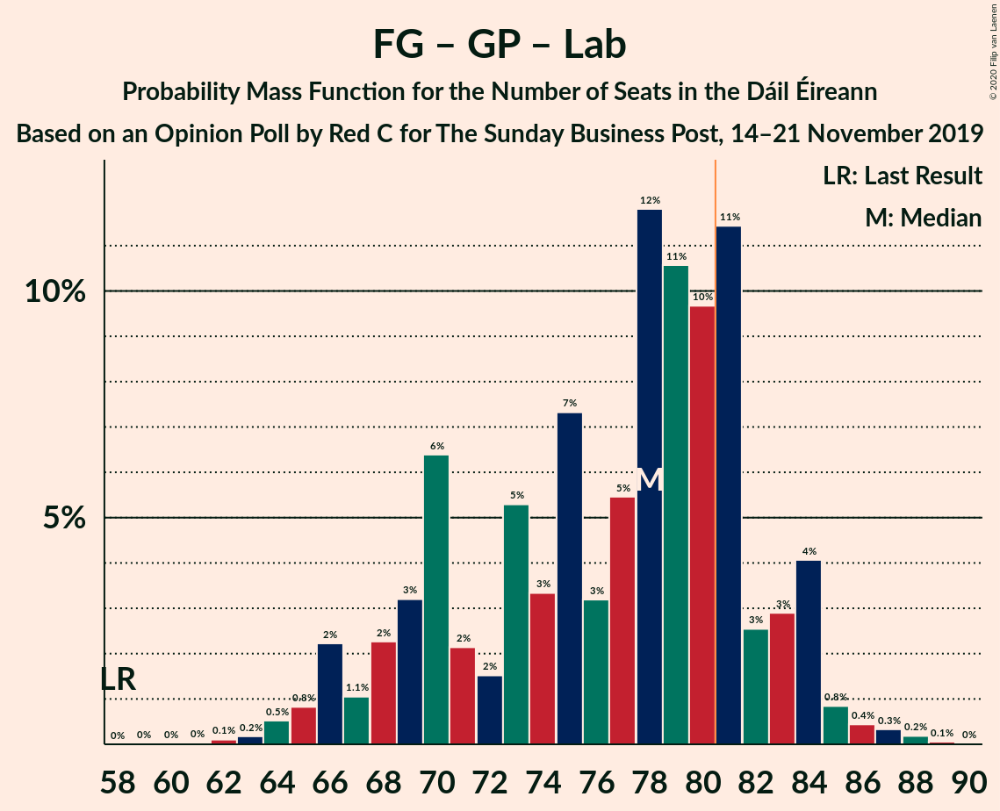
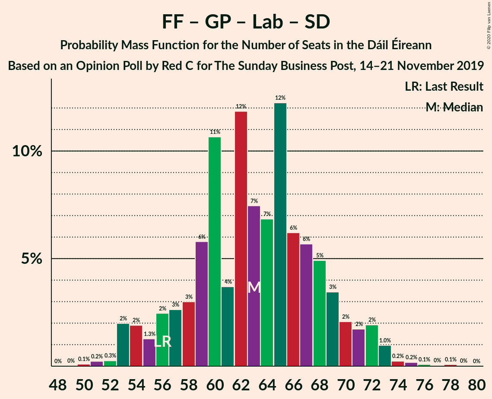

# Opinion Poll by Red C for The Sunday Business Post, 14–21 November 2019

<a href="#voting-intentions">Voting Intentions</a> | <a href="#seats">Seats</a> | <a href="#coalitions">Coalitions</a> | <a href="#technical-information">Technical Information</a>

## Voting Intentions

### Confidence Intervals

| Party | Last Result | Poll Result | 80% Confidence Interval | 90% Confidence Interval | 95% Confidence Interval | 99% Confidence Interval |
|:-----:|:-----------:|:-----------:|:-----------------------:|:-----------------------:|:-----------------------:|:-----------------------:|
| Fine Gael | 25.5% | 30.0% | 28.2–31.9% |27.7–32.4% |27.2–32.9% |26.4–33.9% |
| Fianna Fáil | 24.3% | 24.0% | 22.3–25.8% |21.9–26.3% |21.4–26.7% |20.7–27.6% |
| Independent | 15.9% | 12.4% | 11.1–13.8% |10.8–14.2% |10.5–14.6% |9.9–15.3% |
| Sinn Féin | 13.8% | 11.0% | 9.8–12.4% |9.5–12.8% |9.2–13.1% |8.7–13.8% |
| Green Party/Comhaontas Glas | 2.7% | 7.0% | 6.1–8.2% |5.8–8.5% |5.6–8.8% |5.2–9.3% |
| Labour Party | 6.6% | 6.0% | 5.1–7.1% |4.9–7.4% |4.7–7.7% |4.3–8.2% |
| Solidarity–People Before Profit | 3.9% | 2.0% | 1.5–2.7% |1.4–2.9% |1.3–3.1% |1.1–3.4% |
| Social Democrats | 3.0% | 2.0% | 1.5–2.7% |1.4–2.9% |1.3–3.1% |1.1–3.4% |
| Independents 4 Change | 1.5% | 1.6% | 1.2–2.2% |1.1–2.4% |1.0–2.6% |0.8–2.9% |

*Note:* The poll result column reflects the actual value used in the calculations. Published results may vary slightly, and in addition be rounded to fewer digits.

## Seats

### Confidence Intervals

| Party | Last Result | Median | 80% Confidence Interval | 90% Confidence Interval | 95% Confidence Interval | 99% Confidence Interval |
|:-----:|:-----------:|:------:|:-----------------------:|:-----------------------:|:-----------------------:|:-----------------------:|
| <a href="#fine-gael">Fine Gael</a> | 49 | 63 | 58–67 |55–69 |54–69 |51–71 |
| <a href="#fianna-fáil">Fianna Fáil</a> | 44 | 46 | 41–50 |40–51 |39–53 |37–54 |
| <a href="#independent">Independent</a> | 19 | 14 | 10–16 |8–16 |8–16 |7–16 |
| <a href="#sinn-féin">Sinn Féin</a> | 23 | 16 | 13–21 |13–22 |12–23 |9–26 |
| <a href="#green-party/comhaontas-glas">Green Party/Comhaontas Glas</a> | 2 | 7 | 5–10 |5–10 |5–12 |4–15 |
| <a href="#labour-party">Labour Party</a> | 7 | 5 | 4–8 |3–10 |2–12 |1–14 |
| <a href="#solidarity–people-before-profit">Solidarity–People Before Profit</a> | 6 | 0 | 0–2 |0–2 |0–4 |0–4 |
| <a href="#social-democrats">Social Democrats</a> | 3 | 3 | 3 |3 |3–4 |0–4 |
| <a href="#independents-4-change">Independents 4 Change</a> | 4 | 4 | 3–5 |3–5 |1–5 |0–5 |

### Fine Gael

*For a full overview of the results for this party, see the [Fine Gael](party-finegael.html) page.*

| Number of Seats | Probability | Accumulated | Special Marks |
|:---------------:|:-----------:|:-----------:|:-------------:|
| 47 | 0% | 100% |  |
| 48 | 0% | 99.9% |  |
| 49 | 0.1% | 99.9% | Last Result |
| 50 | 0.1% | 99.8% |  |
| 51 | 0.4% | 99.7% |  |
| 52 | 0.3% | 99.3% |  |
| 53 | 0.7% | 99.0% |  |
| 54 | 1.1% | 98% |  |
| 55 | 2% | 97% |  |
| 56 | 2% | 95% |  |
| 57 | 1.2% | 93% |  |
| 58 | 7% | 92% |  |
| 59 | 11% | 84% |  |
| 60 | 7% | 73% |  |
| 61 | 12% | 66% |  |
| 62 | 3% | 54% |  |
| 63 | 12% | 51% | Median |
| 64 | 6% | 39% |  |
| 65 | 7% | 33% |  |
| 66 | 10% | 26% |  |
| 67 | 7% | 16% |  |
| 68 | 2% | 9% |  |
| 69 | 6% | 7% |  |
| 70 | 1.1% | 2% |  |
| 71 | 0.5% | 0.6% |  |
| 72 | 0% | 0% |  |

### Fianna Fáil

*For a full overview of the results for this party, see the [Fianna Fáil](party-fiannafáil.html) page.*

| Number of Seats | Probability | Accumulated | Special Marks |
|:---------------:|:-----------:|:-----------:|:-------------:|
| 36 | 0.1% | 100% |  |
| 37 | 0.5% | 99.9% |  |
| 38 | 0.5% | 99.4% |  |
| 39 | 4% | 98.9% |  |
| 40 | 4% | 95% |  |
| 41 | 2% | 91% |  |
| 42 | 3% | 89% |  |
| 43 | 5% | 87% |  |
| 44 | 14% | 82% | Last Result |
| 45 | 13% | 68% |  |
| 46 | 7% | 55% | Median |
| 47 | 4% | 49% |  |
| 48 | 12% | 45% |  |
| 49 | 20% | 32% |  |
| 50 | 3% | 12% |  |
| 51 | 4% | 9% |  |
| 52 | 1.4% | 5% |  |
| 53 | 2% | 3% |  |
| 54 | 1.0% | 1.2% |  |
| 55 | 0.2% | 0.2% |  |
| 56 | 0% | 0% |  |

### Independent

*For a full overview of the results for this party, see the [Independent](party-independent.html) page.*

| Number of Seats | Probability | Accumulated | Special Marks |
|:---------------:|:-----------:|:-----------:|:-------------:|
| 6 | 0.3% | 100% |  |
| 7 | 1.1% | 99.7% |  |
| 8 | 5% | 98.6% |  |
| 9 | 4% | 94% |  |
| 10 | 8% | 90% |  |
| 11 | 13% | 82% |  |
| 12 | 4% | 69% |  |
| 13 | 5% | 65% |  |
| 14 | 10% | 60% | Median |
| 15 | 27% | 49% |  |
| 16 | 22% | 22% |  |
| 17 | 0.2% | 0.2% |  |
| 18 | 0% | 0% |  |
| 19 | 0% | 0% | Last Result |

### Sinn Féin

*For a full overview of the results for this party, see the [Sinn Féin](party-sinnféin.html) page.*

| Number of Seats | Probability | Accumulated | Special Marks |
|:---------------:|:-----------:|:-----------:|:-------------:|
| 8 | 0.4% | 100% |  |
| 9 | 0.2% | 99.6% |  |
| 10 | 0.2% | 99.4% |  |
| 11 | 0.8% | 99.1% |  |
| 12 | 1.3% | 98% |  |
| 13 | 10% | 97% |  |
| 14 | 14% | 87% |  |
| 15 | 14% | 73% |  |
| 16 | 10% | 58% | Median |
| 17 | 11% | 48% |  |
| 18 | 8% | 37% |  |
| 19 | 5% | 29% |  |
| 20 | 11% | 25% |  |
| 21 | 6% | 14% |  |
| 22 | 2% | 7% |  |
| 23 | 3% | 5% | Last Result |
| 24 | 0.8% | 2% |  |
| 25 | 0.7% | 1.5% |  |
| 26 | 0.3% | 0.8% |  |
| 27 | 0.2% | 0.5% |  |
| 28 | 0.1% | 0.3% |  |
| 29 | 0.1% | 0.2% |  |
| 30 | 0% | 0% |  |

### Green Party/Comhaontas Glas

*For a full overview of the results for this party, see the [Green Party/Comhaontas Glas](party-greenpartycomhaontasglas.html) page.*

| Number of Seats | Probability | Accumulated | Special Marks |
|:---------------:|:-----------:|:-----------:|:-------------:|
| 2 | 0% | 100% | Last Result |
| 3 | 0.1% | 100% |  |
| 4 | 0.4% | 99.9% |  |
| 5 | 28% | 99.4% |  |
| 6 | 14% | 71% |  |
| 7 | 13% | 57% | Median |
| 8 | 7% | 44% |  |
| 9 | 7% | 37% |  |
| 10 | 26% | 30% |  |
| 11 | 1.1% | 4% |  |
| 12 | 0.6% | 3% |  |
| 13 | 1.2% | 2% |  |
| 14 | 0.3% | 1.1% |  |
| 15 | 0.7% | 0.8% |  |
| 16 | 0.1% | 0.1% |  |
| 17 | 0% | 0% |  |

### Labour Party

*For a full overview of the results for this party, see the [Labour Party](party-labourparty.html) page.*

| Number of Seats | Probability | Accumulated | Special Marks |
|:---------------:|:-----------:|:-----------:|:-------------:|
| 0 | 0.1% | 100% |  |
| 1 | 0.9% | 99.9% |  |
| 2 | 2% | 99.0% |  |
| 3 | 6% | 97% |  |
| 4 | 21% | 91% |  |
| 5 | 22% | 70% | Median |
| 6 | 18% | 48% |  |
| 7 | 15% | 30% | Last Result |
| 8 | 5% | 15% |  |
| 9 | 3% | 10% |  |
| 10 | 2% | 7% |  |
| 11 | 2% | 5% |  |
| 12 | 2% | 3% |  |
| 13 | 0.6% | 1.3% |  |
| 14 | 0.3% | 0.7% |  |
| 15 | 0.3% | 0.4% |  |
| 16 | 0% | 0.1% |  |
| 17 | 0% | 0.1% |  |
| 18 | 0% | 0% |  |

### Solidarity–People Before Profit

*For a full overview of the results for this party, see the [Solidarity–People Before Profit](party-solidarity–peoplebeforeprofit.html) page.*

| Number of Seats | Probability | Accumulated | Special Marks |
|:---------------:|:-----------:|:-----------:|:-------------:|
| 0 | 57% | 100% | Median |
| 1 | 18% | 43% |  |
| 2 | 20% | 25% |  |
| 3 | 2% | 5% |  |
| 4 | 2% | 3% |  |
| 5 | 0.1% | 0.1% |  |
| 6 | 0% | 0% | Last Result |

### Social Democrats

*For a full overview of the results for this party, see the [Social Democrats](party-socialdemocrats.html) page.*

| Number of Seats | Probability | Accumulated | Special Marks |
|:---------------:|:-----------:|:-----------:|:-------------:|
| 0 | 0.8% | 100% |  |
| 1 | 0.9% | 99.2% |  |
| 2 | 0.5% | 98% |  |
| 3 | 94% | 98% | Last Result, Median |
| 4 | 4% | 4% |  |
| 5 | 0% | 0% |  |

### Independents 4 Change

*For a full overview of the results for this party, see the [Independents 4 Change](party-independents4change.html) page.*

| Number of Seats | Probability | Accumulated | Special Marks |
|:---------------:|:-----------:|:-----------:|:-------------:|
| 0 | 0.7% | 100% |  |
| 1 | 2% | 99.3% |  |
| 2 | 1.3% | 97% |  |
| 3 | 15% | 96% |  |
| 4 | 48% | 81% | Last Result, Median |
| 5 | 33% | 33% |  |
| 6 | 0% | 0% |  |

## Coalitions

### Confidence Intervals

| Coalition | Last Result | Median | Majority? | 80% Confidence Interval | 90% Confidence Interval | 95% Confidence Interval | 99% Confidence Interval |
|:---------:|:-----------:|:------:|:---------:|:-----------------------:|:-----------------------:|:-----------------------:|:-----------------------:|
| Fine Gael – Fianna Fáil | 93 | 109 | 100% | 103–114 | 101–117 | 99–117 | 96–118 |
| Fine Gael – Green Party/Comhaontas Glas – Labour Party – Social Democrats | 61 | 78 | 42% | 72–83 | 72–85 | 70–87 | 67–89 |
| Fine Gael – Green Party/Comhaontas Glas – Labour Party | 58 | 75 | 9% | 69–80 | 69–81 | 67–84 | 64–86 |
| Fine Gael – Green Party/Comhaontas Glas | 51 | 70 | 0% | 65–75 | 63–75 | 62–77 | 58–79 |
| Fine Gael – Labour Party | 56 | 69 | 0.1% | 63–74 | 62–74 | 60–76 | 55–77 |
| Fianna Fáil – Sinn Féin | 67 | 63 | 0% | 59–69 | 57–70 | 56–71 | 52–74 |
| Fianna Fáil – Green Party/Comhaontas Glas – Labour Party – Social Democrats | 56 | 62 | 0% | 56–68 | 55–69 | 54–71 | 51–73 |
| Fine Gael | 49 | 63 | 0% | 58–67 | 55–69 | 54–69 | 51–71 |
| Fianna Fáil – Green Party/Comhaontas Glas – Labour Party | 53 | 59 | 0% | 53–65 | 52–66 | 51–68 | 48–70 |
| Fianna Fáil – Green Party/Comhaontas Glas | 46 | 54 | 0% | 48–59 | 46–60 | 45–61 | 42–63 |
| Fianna Fáil – Labour Party | 51 | 52 | 0% | 47–57 | 45–57 | 44–58 | 43–61 |

### Fine Gael – Fianna Fáil

| Number of Seats | Probability | Accumulated | Special Marks |
|:---------------:|:-----------:|:-----------:|:-------------:|
| 93 | 0.1% | 100% | Last Result |
| 94 | 0.1% | 99.9% |  |
| 95 | 0.2% | 99.8% |  |
| 96 | 0.4% | 99.5% |  |
| 97 | 0.1% | 99.1% |  |
| 98 | 0.6% | 99.0% |  |
| 99 | 1.3% | 98% |  |
| 100 | 1.2% | 97% |  |
| 101 | 2% | 96% |  |
| 102 | 3% | 94% |  |
| 103 | 9% | 91% |  |
| 104 | 2% | 82% |  |
| 105 | 4% | 80% |  |
| 106 | 8% | 76% |  |
| 107 | 7% | 68% |  |
| 108 | 6% | 61% |  |
| 109 | 9% | 55% | Median |
| 110 | 13% | 46% |  |
| 111 | 6% | 33% |  |
| 112 | 12% | 28% |  |
| 113 | 2% | 16% |  |
| 114 | 4% | 13% |  |
| 115 | 3% | 9% |  |
| 116 | 0.5% | 7% |  |
| 117 | 6% | 6% |  |
| 118 | 0.4% | 0.6% |  |
| 119 | 0.1% | 0.2% |  |
| 120 | 0.1% | 0.1% |  |
| 121 | 0% | 0% |  |

### Fine Gael – Green Party/Comhaontas Glas – Labour Party – Social Democrats

| Number of Seats | Probability | Accumulated | Special Marks |
|:---------------:|:-----------:|:-----------:|:-------------:|
| 61 | 0% | 100% | Last Result |
| 62 | 0% | 100% |  |
| 63 | 0% | 100% |  |
| 64 | 0% | 99.9% |  |
| 65 | 0.1% | 99.9% |  |
| 66 | 0.2% | 99.9% |  |
| 67 | 0.5% | 99.7% |  |
| 68 | 0.5% | 99.2% |  |
| 69 | 0.8% | 98.7% |  |
| 70 | 1.2% | 98% |  |
| 71 | 1.4% | 97% |  |
| 72 | 6% | 95% |  |
| 73 | 1.1% | 89% |  |
| 74 | 6% | 88% |  |
| 75 | 3% | 82% |  |
| 76 | 8% | 79% |  |
| 77 | 17% | 71% |  |
| 78 | 7% | 54% | Median |
| 79 | 2% | 47% |  |
| 80 | 3% | 45% |  |
| 81 | 9% | 42% | Majority |
| 82 | 18% | 33% |  |
| 83 | 5% | 15% |  |
| 84 | 4% | 9% |  |
| 85 | 2% | 5% |  |
| 86 | 0.8% | 4% |  |
| 87 | 1.1% | 3% |  |
| 88 | 0.9% | 2% |  |
| 89 | 0.5% | 0.8% |  |
| 90 | 0.1% | 0.3% |  |
| 91 | 0% | 0.2% |  |
| 92 | 0.2% | 0.2% |  |
| 93 | 0% | 0% |  |

### Fine Gael – Green Party/Comhaontas Glas – Labour Party

| Number of Seats | Probability | Accumulated | Special Marks |
|:---------------:|:-----------:|:-----------:|:-------------:|
| 58 | 0% | 100% | Last Result |
| 59 | 0% | 100% |  |
| 60 | 0% | 100% |  |
| 61 | 0% | 99.9% |  |
| 62 | 0% | 99.9% |  |
| 63 | 0.2% | 99.9% |  |
| 64 | 0.5% | 99.7% |  |
| 65 | 0.5% | 99.2% |  |
| 66 | 0.8% | 98.7% |  |
| 67 | 1.1% | 98% |  |
| 68 | 1.3% | 97% |  |
| 69 | 6% | 95% |  |
| 70 | 1.0% | 89% |  |
| 71 | 6% | 88% |  |
| 72 | 3% | 82% |  |
| 73 | 8% | 79% |  |
| 74 | 17% | 71% |  |
| 75 | 7% | 54% | Median |
| 76 | 2% | 47% |  |
| 77 | 4% | 45% |  |
| 78 | 8% | 41% |  |
| 79 | 18% | 33% |  |
| 80 | 6% | 15% |  |
| 81 | 4% | 9% | Majority |
| 82 | 2% | 5% |  |
| 83 | 0.7% | 3% |  |
| 84 | 1.4% | 3% |  |
| 85 | 0.5% | 1.3% |  |
| 86 | 0.5% | 0.8% |  |
| 87 | 0.1% | 0.3% |  |
| 88 | 0% | 0.3% |  |
| 89 | 0.2% | 0.2% |  |
| 90 | 0% | 0% |  |

### Fine Gael – Green Party/Comhaontas Glas

| Number of Seats | Probability | Accumulated | Special Marks |
|:---------------:|:-----------:|:-----------:|:-------------:|
| 51 | 0% | 100% | Last Result |
| 52 | 0% | 100% |  |
| 53 | 0% | 100% |  |
| 54 | 0% | 100% |  |
| 55 | 0.1% | 99.9% |  |
| 56 | 0.2% | 99.9% |  |
| 57 | 0.2% | 99.7% |  |
| 58 | 0.7% | 99.5% |  |
| 59 | 0.2% | 98.8% |  |
| 60 | 0.4% | 98.7% |  |
| 61 | 0.6% | 98% |  |
| 62 | 2% | 98% |  |
| 63 | 1.0% | 95% |  |
| 64 | 2% | 94% |  |
| 65 | 6% | 93% |  |
| 66 | 9% | 87% |  |
| 67 | 6% | 78% |  |
| 68 | 3% | 72% |  |
| 69 | 13% | 69% |  |
| 70 | 9% | 55% | Median |
| 71 | 8% | 46% |  |
| 72 | 12% | 38% |  |
| 73 | 11% | 26% |  |
| 74 | 3% | 15% |  |
| 75 | 8% | 12% |  |
| 76 | 1.5% | 4% |  |
| 77 | 1.1% | 3% |  |
| 78 | 0.6% | 2% |  |
| 79 | 0.8% | 1.0% |  |
| 80 | 0.1% | 0.2% |  |
| 81 | 0% | 0% | Majority |

### Fine Gael – Labour Party

| Number of Seats | Probability | Accumulated | Special Marks |
|:---------------:|:-----------:|:-----------:|:-------------:|
| 53 | 0% | 100% |  |
| 54 | 0.1% | 99.9% |  |
| 55 | 0.5% | 99.9% |  |
| 56 | 0.1% | 99.4% | Last Result |
| 57 | 0.3% | 99.3% |  |
| 58 | 0.5% | 99.0% |  |
| 59 | 0.5% | 98% |  |
| 60 | 1.3% | 98% |  |
| 61 | 1.1% | 97% |  |
| 62 | 5% | 96% |  |
| 63 | 6% | 90% |  |
| 64 | 14% | 85% |  |
| 65 | 4% | 71% |  |
| 66 | 6% | 66% |  |
| 67 | 3% | 61% |  |
| 68 | 5% | 58% | Median |
| 69 | 15% | 53% |  |
| 70 | 6% | 38% |  |
| 71 | 5% | 32% |  |
| 72 | 6% | 27% |  |
| 73 | 8% | 20% |  |
| 74 | 8% | 12% |  |
| 75 | 2% | 5% |  |
| 76 | 2% | 3% |  |
| 77 | 0.5% | 1.0% |  |
| 78 | 0.3% | 0.5% |  |
| 79 | 0.1% | 0.2% |  |
| 80 | 0% | 0.1% |  |
| 81 | 0.1% | 0.1% | Majority |
| 82 | 0% | 0% |  |

### Fianna Fáil – Sinn Féin

| Number of Seats | Probability | Accumulated | Special Marks |
|:---------------:|:-----------:|:-----------:|:-------------:|
| 49 | 0.1% | 100% |  |
| 50 | 0.1% | 99.9% |  |
| 51 | 0.2% | 99.7% |  |
| 52 | 0.2% | 99.6% |  |
| 53 | 0.5% | 99.3% |  |
| 54 | 0.2% | 98.8% |  |
| 55 | 1.0% | 98.6% |  |
| 56 | 0.6% | 98% |  |
| 57 | 2% | 97% |  |
| 58 | 3% | 95% |  |
| 59 | 7% | 91% |  |
| 60 | 10% | 85% |  |
| 61 | 9% | 74% |  |
| 62 | 5% | 65% | Median |
| 63 | 13% | 60% |  |
| 64 | 22% | 47% |  |
| 65 | 3% | 25% |  |
| 66 | 7% | 22% |  |
| 67 | 2% | 14% | Last Result |
| 68 | 2% | 12% |  |
| 69 | 5% | 10% |  |
| 70 | 2% | 6% |  |
| 71 | 2% | 4% |  |
| 72 | 0.3% | 1.5% |  |
| 73 | 0.7% | 1.2% |  |
| 74 | 0.3% | 0.5% |  |
| 75 | 0.1% | 0.2% |  |
| 76 | 0.1% | 0.2% |  |
| 77 | 0% | 0.1% |  |
| 78 | 0% | 0% |  |

### Fianna Fáil – Green Party/Comhaontas Glas – Labour Party – Social Democrats

| Number of Seats | Probability | Accumulated | Special Marks |
|:---------------:|:-----------:|:-----------:|:-------------:|
| 49 | 0.1% | 100% |  |
| 50 | 0.1% | 99.9% |  |
| 51 | 1.0% | 99.8% |  |
| 52 | 1.1% | 98.9% |  |
| 53 | 0.2% | 98% |  |
| 54 | 0.9% | 98% |  |
| 55 | 4% | 97% |  |
| 56 | 4% | 92% | Last Result |
| 57 | 4% | 88% |  |
| 58 | 0.8% | 84% |  |
| 59 | 6% | 83% |  |
| 60 | 2% | 78% |  |
| 61 | 5% | 75% | Median |
| 62 | 29% | 70% |  |
| 63 | 8% | 41% |  |
| 64 | 5% | 33% |  |
| 65 | 2% | 28% |  |
| 66 | 3% | 26% |  |
| 67 | 4% | 22% |  |
| 68 | 12% | 18% |  |
| 69 | 3% | 6% |  |
| 70 | 0.3% | 3% |  |
| 71 | 1.0% | 3% |  |
| 72 | 0.4% | 2% |  |
| 73 | 0.9% | 1.3% |  |
| 74 | 0.2% | 0.3% |  |
| 75 | 0.1% | 0.1% |  |
| 76 | 0.1% | 0.1% |  |
| 77 | 0% | 0% |  |

### Fine Gael

| Number of Seats | Probability | Accumulated | Special Marks |
|:---------------:|:-----------:|:-----------:|:-------------:|
| 47 | 0% | 100% |  |
| 48 | 0% | 99.9% |  |
| 49 | 0.1% | 99.9% | Last Result |
| 50 | 0.1% | 99.8% |  |
| 51 | 0.4% | 99.7% |  |
| 52 | 0.3% | 99.3% |  |
| 53 | 0.7% | 99.0% |  |
| 54 | 1.1% | 98% |  |
| 55 | 2% | 97% |  |
| 56 | 2% | 95% |  |
| 57 | 1.2% | 93% |  |
| 58 | 7% | 92% |  |
| 59 | 11% | 84% |  |
| 60 | 7% | 73% |  |
| 61 | 12% | 66% |  |
| 62 | 3% | 54% |  |
| 63 | 12% | 51% | Median |
| 64 | 6% | 39% |  |
| 65 | 7% | 33% |  |
| 66 | 10% | 26% |  |
| 67 | 7% | 16% |  |
| 68 | 2% | 9% |  |
| 69 | 6% | 7% |  |
| 70 | 1.1% | 2% |  |
| 71 | 0.5% | 0.6% |  |
| 72 | 0% | 0% |  |

### Fianna Fáil – Green Party/Comhaontas Glas – Labour Party

| Number of Seats | Probability | Accumulated | Special Marks |
|:---------------:|:-----------:|:-----------:|:-------------:|
| 46 | 0.1% | 100% |  |
| 47 | 0.1% | 99.9% |  |
| 48 | 1.0% | 99.8% |  |
| 49 | 1.1% | 98.9% |  |
| 50 | 0.2% | 98% |  |
| 51 | 0.9% | 98% |  |
| 52 | 4% | 97% |  |
| 53 | 4% | 92% | Last Result |
| 54 | 4% | 88% |  |
| 55 | 0.9% | 84% |  |
| 56 | 6% | 83% |  |
| 57 | 2% | 77% |  |
| 58 | 5% | 75% | Median |
| 59 | 29% | 70% |  |
| 60 | 7% | 41% |  |
| 61 | 5% | 34% |  |
| 62 | 4% | 29% |  |
| 63 | 3% | 25% |  |
| 64 | 4% | 22% |  |
| 65 | 12% | 19% |  |
| 66 | 3% | 6% |  |
| 67 | 0.6% | 3% |  |
| 68 | 1.1% | 3% |  |
| 69 | 0.3% | 2% |  |
| 70 | 1.0% | 1.3% |  |
| 71 | 0.2% | 0.3% |  |
| 72 | 0% | 0.1% |  |
| 73 | 0.1% | 0.1% |  |
| 74 | 0% | 0% |  |

### Fianna Fáil – Green Party/Comhaontas Glas

| Number of Seats | Probability | Accumulated | Special Marks |
|:---------------:|:-----------:|:-----------:|:-------------:|
| 41 | 0% | 100% |  |
| 42 | 0.5% | 99.9% |  |
| 43 | 0.2% | 99.5% |  |
| 44 | 1.2% | 99.3% |  |
| 45 | 3% | 98% |  |
| 46 | 0.7% | 95% | Last Result |
| 47 | 2% | 95% |  |
| 48 | 4% | 93% |  |
| 49 | 10% | 89% |  |
| 50 | 5% | 79% |  |
| 51 | 2% | 74% |  |
| 52 | 7% | 72% |  |
| 53 | 6% | 65% | Median |
| 54 | 21% | 59% |  |
| 55 | 4% | 38% |  |
| 56 | 10% | 34% |  |
| 57 | 2% | 24% |  |
| 58 | 4% | 22% |  |
| 59 | 10% | 18% |  |
| 60 | 3% | 7% |  |
| 61 | 2% | 4% |  |
| 62 | 0.6% | 2% |  |
| 63 | 1.4% | 2% |  |
| 64 | 0.2% | 0.3% |  |
| 65 | 0.1% | 0.1% |  |
| 66 | 0% | 0% |  |

### Fianna Fáil – Labour Party

| Number of Seats | Probability | Accumulated | Special Marks |
|:---------------:|:-----------:|:-----------:|:-------------:|
| 41 | 0.2% | 100% |  |
| 42 | 0.2% | 99.8% |  |
| 43 | 1.2% | 99.6% |  |
| 44 | 1.3% | 98% |  |
| 45 | 3% | 97% |  |
| 46 | 2% | 94% |  |
| 47 | 3% | 92% |  |
| 48 | 4% | 89% |  |
| 49 | 16% | 85% |  |
| 50 | 5% | 69% |  |
| 51 | 5% | 64% | Last Result, Median |
| 52 | 11% | 59% |  |
| 53 | 12% | 48% |  |
| 54 | 8% | 36% |  |
| 55 | 11% | 28% |  |
| 56 | 6% | 17% |  |
| 57 | 7% | 11% |  |
| 58 | 2% | 4% |  |
| 59 | 0.3% | 2% |  |
| 60 | 1.0% | 2% |  |
| 61 | 0.5% | 0.9% |  |
| 62 | 0.2% | 0.4% |  |
| 63 | 0% | 0.2% |  |
| 64 | 0% | 0.2% |  |
| 65 | 0% | 0.1% |  |
| 66 | 0.1% | 0.1% |  |
| 67 | 0% | 0% |  |

## Technical Information

### Opinion Poll

+ **Polling firm:** Red C
+ **Commissioner(s):** The Sunday Business Post
+ **Fieldwork period:** 14–21 November 2019

### Calculations

+ **Sample size:** 1000
+ **Simulations done:** 262,144
+ **Error estimate:** 3.72%

