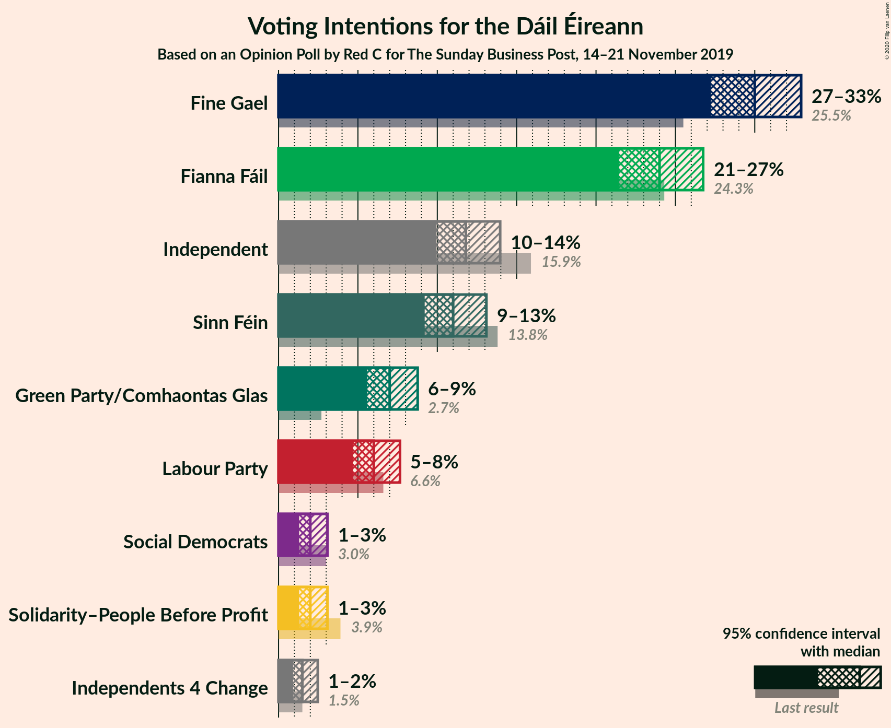
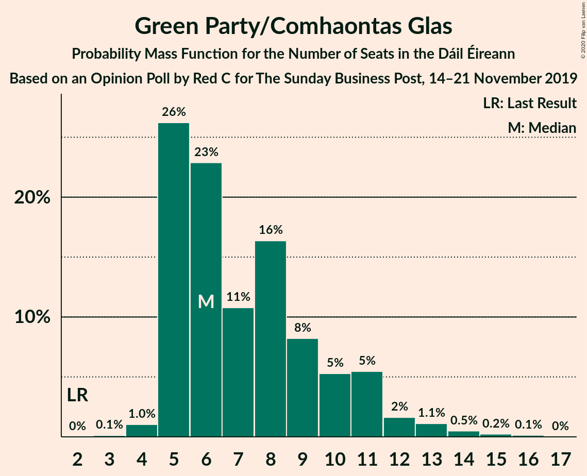
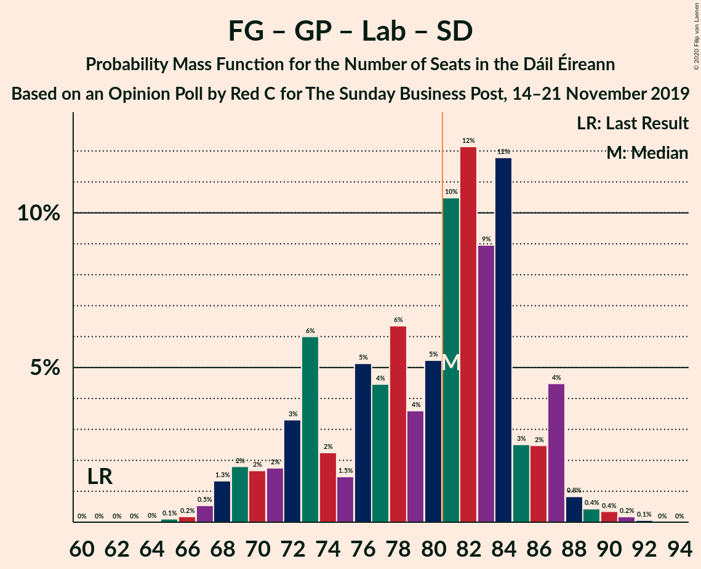

# Opinion Poll by Red C for The Sunday Business Post, 14–21 November 2019

<a href="#voting-intentions">Voting Intentions</a> | <a href="#seats">Seats</a> | <a href="#coalitions">Coalitions</a> | <a href="#technical-information">Technical Information</a>

## Voting Intentions

### Confidence Intervals

| Party | Last Result | Poll Result | 80% Confidence Interval | 90% Confidence Interval | 95% Confidence Interval | 99% Confidence Interval |
|:-----:|:-----------:|:-----------:|:-----------------------:|:-----------------------:|:-----------------------:|:-----------------------:|
| Fine Gael | 25.5% | 30.0% | 28.2–31.9% |27.7–32.4% |27.2–32.9% |26.4–33.9% |
| Fianna Fáil | 24.3% | 24.0% | 22.3–25.8% |21.9–26.3% |21.4–26.7% |20.7–27.6% |
| Independent | 15.9% | 12.4% | 11.1–13.8% |10.8–14.2% |10.5–14.6% |9.9–15.3% |
| Sinn Féin | 13.8% | 11.0% | 9.8–12.4% |9.5–12.8% |9.2–13.1% |8.7–13.8% |
| Green Party/Comhaontas Glas | 2.7% | 7.0% | 6.1–8.2% |5.8–8.5% |5.6–8.8% |5.2–9.3% |
| Labour Party | 6.6% | 6.0% | 5.1–7.1% |4.9–7.4% |4.7–7.7% |4.3–8.2% |
| Solidarity–People Before Profit | 3.9% | 2.0% | 1.5–2.7% |1.4–2.9% |1.3–3.1% |1.1–3.4% |
| Social Democrats | 3.0% | 2.0% | 1.5–2.7% |1.4–2.9% |1.3–3.1% |1.1–3.4% |
| Independents 4 Change | 1.5% | 1.6% | 1.2–2.2% |1.1–2.4% |1.0–2.6% |0.8–2.9% |

*Note:* The poll result column reflects the actual value used in the calculations. Published results may vary slightly, and in addition be rounded to fewer digits.

## Seats

### Confidence Intervals

| Party | Last Result | Median | 80% Confidence Interval | 90% Confidence Interval | 95% Confidence Interval | 99% Confidence Interval |
|:-----:|:-----------:|:------:|:-----------------------:|:-----------------------:|:-----------------------:|:-----------------------:|
| <a href="#fine-gael">Fine Gael</a> | 49 | 63 | 58–66 |56–67 |55–69 |51–70 |
| <a href="#fianna-fáil">Fianna Fáil</a> | 44 | 46 | 41–51 |39–52 |39–53 |38–54 |
| <a href="#independent">Independent</a> | 19 | 15 | 11–16 |10–16 |9–16 |7–16 |
| <a href="#sinn-féin">Sinn Féin</a> | 23 | 16 | 13–20 |13–22 |13–23 |10–26 |
| <a href="#green-party/comhaontas-glas">Green Party/Comhaontas Glas</a> | 2 | 7 | 5–10 |5–10 |5–11 |5–14 |
| <a href="#labour-party">Labour Party</a> | 7 | 5 | 4–7 |4–9 |3–10 |1–14 |
| <a href="#solidarity–people-before-profit">Solidarity–People Before Profit</a> | 6 | 0 | 0–2 |0–2 |0–3 |0–4 |
| <a href="#social-democrats">Social Democrats</a> | 3 | 3 | 3 |3 |2–4 |0–4 |
| <a href="#independents-4-change">Independents 4 Change</a> | 4 | 4 | 3–5 |3–5 |1–5 |1–5 |

### Fine Gael

*For a full overview of the results for this party, see the [Fine Gael](party-finegael.html) page.*

| Number of Seats | Probability | Accumulated | Special Marks |
|:---------------:|:-----------:|:-----------:|:-------------:|
| 48 | 0% | 100% |  |
| 49 | 0.1% | 99.9% | Last Result |
| 50 | 0.1% | 99.9% |  |
| 51 | 0.3% | 99.8% |  |
| 52 | 0.3% | 99.4% |  |
| 53 | 0.3% | 99.2% |  |
| 54 | 1.1% | 98.9% |  |
| 55 | 1.2% | 98% |  |
| 56 | 2% | 97% |  |
| 57 | 1.3% | 95% |  |
| 58 | 8% | 93% |  |
| 59 | 17% | 85% |  |
| 60 | 2% | 68% |  |
| 61 | 10% | 66% |  |
| 62 | 2% | 56% |  |
| 63 | 19% | 54% | Median |
| 64 | 6% | 35% |  |
| 65 | 10% | 29% |  |
| 66 | 10% | 19% |  |
| 67 | 6% | 10% |  |
| 68 | 0.7% | 3% |  |
| 69 | 2% | 3% |  |
| 70 | 0.6% | 0.7% |  |
| 71 | 0% | 0% |  |

### Fianna Fáil

*For a full overview of the results for this party, see the [Fianna Fáil](party-fiannafáil.html) page.*

| Number of Seats | Probability | Accumulated | Special Marks |
|:---------------:|:-----------:|:-----------:|:-------------:|
| 36 | 0.1% | 100% |  |
| 37 | 0.4% | 99.9% |  |
| 38 | 0.4% | 99.6% |  |
| 39 | 4% | 99.2% |  |
| 40 | 4% | 95% |  |
| 41 | 0.8% | 91% |  |
| 42 | 1.4% | 90% |  |
| 43 | 6% | 89% |  |
| 44 | 23% | 83% | Last Result |
| 45 | 10% | 60% |  |
| 46 | 1.2% | 50% | Median |
| 47 | 2% | 49% |  |
| 48 | 1.1% | 47% |  |
| 49 | 30% | 46% |  |
| 50 | 3% | 16% |  |
| 51 | 6% | 13% |  |
| 52 | 2% | 7% |  |
| 53 | 3% | 5% |  |
| 54 | 1.3% | 2% |  |
| 55 | 0.2% | 0.2% |  |
| 56 | 0% | 0% |  |

### Independent

*For a full overview of the results for this party, see the [Independent](party-independent.html) page.*

| Number of Seats | Probability | Accumulated | Special Marks |
|:---------------:|:-----------:|:-----------:|:-------------:|
| 6 | 0.3% | 100% |  |
| 7 | 0.3% | 99.6% |  |
| 8 | 1.3% | 99.4% |  |
| 9 | 3% | 98% |  |
| 10 | 5% | 96% |  |
| 11 | 18% | 91% |  |
| 12 | 3% | 73% |  |
| 13 | 3% | 69% |  |
| 14 | 13% | 66% |  |
| 15 | 31% | 53% | Median |
| 16 | 21% | 22% |  |
| 17 | 0.1% | 0.1% |  |
| 18 | 0% | 0% |  |
| 19 | 0% | 0% | Last Result |

### Sinn Féin

*For a full overview of the results for this party, see the [Sinn Féin](party-sinnféin.html) page.*

| Number of Seats | Probability | Accumulated | Special Marks |
|:---------------:|:-----------:|:-----------:|:-------------:|
| 8 | 0.3% | 100% |  |
| 9 | 0.1% | 99.7% |  |
| 10 | 0.3% | 99.6% |  |
| 11 | 0.3% | 99.4% |  |
| 12 | 1.4% | 99.1% |  |
| 13 | 8% | 98% |  |
| 14 | 17% | 90% |  |
| 15 | 19% | 73% |  |
| 16 | 8% | 54% | Median |
| 17 | 13% | 45% |  |
| 18 | 4% | 32% |  |
| 19 | 4% | 28% |  |
| 20 | 17% | 24% |  |
| 21 | 2% | 8% |  |
| 22 | 1.2% | 6% |  |
| 23 | 3% | 4% | Last Result |
| 24 | 0.3% | 2% |  |
| 25 | 0.9% | 1.4% |  |
| 26 | 0.1% | 0.6% |  |
| 27 | 0.2% | 0.5% |  |
| 28 | 0.1% | 0.2% |  |
| 29 | 0.2% | 0.2% |  |
| 30 | 0% | 0% |  |

### Green Party/Comhaontas Glas

*For a full overview of the results for this party, see the [Green Party/Comhaontas Glas](party-greenpartycomhaontasglas.html) page.*

| Number of Seats | Probability | Accumulated | Special Marks |
|:---------------:|:-----------:|:-----------:|:-------------:|
| 2 | 0% | 100% | Last Result |
| 3 | 0.1% | 100% |  |
| 4 | 0.3% | 99.9% |  |
| 5 | 24% | 99.6% |  |
| 6 | 12% | 76% |  |
| 7 | 17% | 63% | Median |
| 8 | 3% | 46% |  |
| 9 | 7% | 43% |  |
| 10 | 33% | 36% |  |
| 11 | 0.5% | 3% |  |
| 12 | 0.9% | 2% |  |
| 13 | 0.7% | 1.3% |  |
| 14 | 0.2% | 0.5% |  |
| 15 | 0.3% | 0.3% |  |
| 16 | 0.1% | 0.1% |  |
| 17 | 0% | 0% |  |

### Labour Party

*For a full overview of the results for this party, see the [Labour Party](party-labourparty.html) page.*

| Number of Seats | Probability | Accumulated | Special Marks |
|:---------------:|:-----------:|:-----------:|:-------------:|
| 1 | 0.9% | 100% |  |
| 2 | 0.7% | 99.1% |  |
| 3 | 2% | 98% |  |
| 4 | 22% | 97% |  |
| 5 | 26% | 75% | Median |
| 6 | 21% | 49% |  |
| 7 | 21% | 28% | Last Result |
| 8 | 0.7% | 7% |  |
| 9 | 4% | 7% |  |
| 10 | 0.9% | 3% |  |
| 11 | 0.5% | 2% |  |
| 12 | 0.2% | 1.3% |  |
| 13 | 0.5% | 1.1% |  |
| 14 | 0.3% | 0.5% |  |
| 15 | 0.2% | 0.3% |  |
| 16 | 0% | 0.1% |  |
| 17 | 0% | 0% |  |

### Solidarity–People Before Profit

*For a full overview of the results for this party, see the [Solidarity–People Before Profit](party-solidarity–peoplebeforeprofit.html) page.*

| Number of Seats | Probability | Accumulated | Special Marks |
|:---------------:|:-----------:|:-----------:|:-------------:|
| 0 | 64% | 100% | Median |
| 1 | 21% | 36% |  |
| 2 | 11% | 15% |  |
| 3 | 3% | 5% |  |
| 4 | 2% | 2% |  |
| 5 | 0.1% | 0.1% |  |
| 6 | 0% | 0% | Last Result |

### Social Democrats

*For a full overview of the results for this party, see the [Social Democrats](party-socialdemocrats.html) page.*

| Number of Seats | Probability | Accumulated | Special Marks |
|:---------------:|:-----------:|:-----------:|:-------------:|
| 0 | 1.1% | 100% |  |
| 1 | 0.9% | 98.9% |  |
| 2 | 0.7% | 98% |  |
| 3 | 95% | 97% | Last Result, Median |
| 4 | 3% | 3% |  |
| 5 | 0% | 0% |  |

### Independents 4 Change

*For a full overview of the results for this party, see the [Independents 4 Change](party-independents4change.html) page.*

| Number of Seats | Probability | Accumulated | Special Marks |
|:---------------:|:-----------:|:-----------:|:-------------:|
| 0 | 0.4% | 100% |  |
| 1 | 3% | 99.6% |  |
| 2 | 0.9% | 97% |  |
| 3 | 17% | 96% |  |
| 4 | 51% | 79% | Last Result, Median |
| 5 | 28% | 28% |  |
| 6 | 0% | 0% |  |

## Coalitions

### Confidence Intervals

| Coalition | Last Result | Median | Majority? | 80% Confidence Interval | 90% Confidence Interval | 95% Confidence Interval | 99% Confidence Interval |
|:---------:|:-----------:|:------:|:---------:|:-----------------------:|:-----------------------:|:-----------------------:|:-----------------------:|
| Fine Gael – Fianna Fáil | 93 | 109 | 100% | 103–114 | 102–115 | 100–117 | 96–118 |
| Fine Gael – Green Party/Comhaontas Glas – Labour Party – Social Democrats | 61 | 78 | 45% | 72–82 | 72–83 | 70–85 | 67–88 |
| Fine Gael – Green Party/Comhaontas Glas – Labour Party | 58 | 76 | 5% | 69–79 | 69–80 | 67–82 | 64–84 |
| Fine Gael – Green Party/Comhaontas Glas | 51 | 70 | 0% | 65–73 | 64–74 | 62–75 | 58–78 |
| Fine Gael – Labour Party | 56 | 69 | 0% | 62–73 | 62–74 | 60–75 | 55–77 |
| Fianna Fáil – Green Party/Comhaontas Glas – Labour Party – Social Democrats | 56 | 62 | 0% | 56–68 | 55–69 | 52–71 | 51–73 |
| Fianna Fáil – Sinn Féin | 67 | 63 | 0% | 59–66 | 58–69 | 57–70 | 53–73 |
| Fine Gael | 49 | 63 | 0% | 58–66 | 56–67 | 55–69 | 51–70 |
| Fianna Fáil – Green Party/Comhaontas Glas – Labour Party | 53 | 59 | 0% | 53–65 | 52–66 | 49–68 | 48–70 |
| Fianna Fáil – Green Party/Comhaontas Glas | 46 | 54 | 0% | 49–59 | 45–61 | 45–63 | 43–63 |
| Fianna Fáil – Labour Party | 51 | 53 | 0% | 47–57 | 45–57 | 44–59 | 42–61 |

### Fine Gael – Fianna Fáil

| Number of Seats | Probability | Accumulated | Special Marks |
|:---------------:|:-----------:|:-----------:|:-------------:|
| 92 | 0% | 100% |  |
| 93 | 0.1% | 99.9% | Last Result |
| 94 | 0.1% | 99.8% |  |
| 95 | 0.2% | 99.8% |  |
| 96 | 0.5% | 99.5% |  |
| 97 | 0.2% | 99.0% |  |
| 98 | 0.2% | 98.8% |  |
| 99 | 0.1% | 98.6% |  |
| 100 | 2% | 98% |  |
| 101 | 1.4% | 97% |  |
| 102 | 0.6% | 95% |  |
| 103 | 15% | 95% |  |
| 104 | 1.4% | 79% |  |
| 105 | 2% | 78% |  |
| 106 | 4% | 76% |  |
| 107 | 10% | 72% |  |
| 108 | 6% | 62% |  |
| 109 | 7% | 56% | Median |
| 110 | 20% | 49% |  |
| 111 | 0.8% | 29% |  |
| 112 | 17% | 28% |  |
| 113 | 1.1% | 11% |  |
| 114 | 4% | 10% |  |
| 115 | 2% | 6% |  |
| 116 | 0.7% | 4% |  |
| 117 | 2% | 3% |  |
| 118 | 0.6% | 0.8% |  |
| 119 | 0% | 0.2% |  |
| 120 | 0.2% | 0.2% |  |
| 121 | 0% | 0% |  |

### Fine Gael – Green Party/Comhaontas Glas – Labour Party – Social Democrats

| Number of Seats | Probability | Accumulated | Special Marks |
|:---------------:|:-----------:|:-----------:|:-------------:|
| 61 | 0% | 100% | Last Result |
| 62 | 0% | 100% |  |
| 63 | 0% | 100% |  |
| 64 | 0% | 100% |  |
| 65 | 0.1% | 100% |  |
| 66 | 0.1% | 99.9% |  |
| 67 | 0.8% | 99.8% |  |
| 68 | 0.3% | 99.0% |  |
| 69 | 0.6% | 98.7% |  |
| 70 | 1.0% | 98% |  |
| 71 | 2% | 97% |  |
| 72 | 7% | 95% |  |
| 73 | 1.0% | 88% |  |
| 74 | 8% | 87% |  |
| 75 | 2% | 79% |  |
| 76 | 4% | 77% |  |
| 77 | 19% | 73% |  |
| 78 | 5% | 54% | Median |
| 79 | 2% | 49% |  |
| 80 | 2% | 47% |  |
| 81 | 10% | 45% | Majority |
| 82 | 29% | 35% |  |
| 83 | 2% | 7% |  |
| 84 | 1.0% | 5% |  |
| 85 | 2% | 4% |  |
| 86 | 0.7% | 2% |  |
| 87 | 0.2% | 1.1% |  |
| 88 | 0.4% | 0.8% |  |
| 89 | 0.1% | 0.5% |  |
| 90 | 0% | 0.4% |  |
| 91 | 0% | 0.3% |  |
| 92 | 0.3% | 0.3% |  |
| 93 | 0% | 0% |  |

### Fine Gael – Green Party/Comhaontas Glas – Labour Party

| Number of Seats | Probability | Accumulated | Special Marks |
|:---------------:|:-----------:|:-----------:|:-------------:|
| 58 | 0% | 100% | Last Result |
| 59 | 0% | 100% |  |
| 60 | 0% | 100% |  |
| 61 | 0% | 100% |  |
| 62 | 0.1% | 100% |  |
| 63 | 0.1% | 99.9% |  |
| 64 | 0.8% | 99.8% |  |
| 65 | 0.3% | 99.0% |  |
| 66 | 0.6% | 98.7% |  |
| 67 | 0.9% | 98% |  |
| 68 | 1.4% | 97% |  |
| 69 | 8% | 96% |  |
| 70 | 1.1% | 88% |  |
| 71 | 8% | 87% |  |
| 72 | 2% | 79% |  |
| 73 | 3% | 77% |  |
| 74 | 19% | 74% |  |
| 75 | 5% | 55% | Median |
| 76 | 3% | 50% |  |
| 77 | 2% | 48% |  |
| 78 | 10% | 45% |  |
| 79 | 29% | 36% |  |
| 80 | 2% | 7% |  |
| 81 | 1.0% | 5% | Majority |
| 82 | 2% | 4% |  |
| 83 | 0.8% | 2% |  |
| 84 | 0.5% | 1.0% |  |
| 85 | 0% | 0.5% |  |
| 86 | 0.1% | 0.5% |  |
| 87 | 0% | 0.4% |  |
| 88 | 0% | 0.3% |  |
| 89 | 0.3% | 0.3% |  |
| 90 | 0% | 0% |  |

### Fine Gael – Green Party/Comhaontas Glas

| Number of Seats | Probability | Accumulated | Special Marks |
|:---------------:|:-----------:|:-----------:|:-------------:|
| 51 | 0% | 100% | Last Result |
| 52 | 0% | 100% |  |
| 53 | 0% | 100% |  |
| 54 | 0% | 100% |  |
| 55 | 0.1% | 100% |  |
| 56 | 0.2% | 99.9% |  |
| 57 | 0.1% | 99.7% |  |
| 58 | 0.2% | 99.6% |  |
| 59 | 0.1% | 99.4% |  |
| 60 | 0.2% | 99.2% |  |
| 61 | 0.3% | 99.0% |  |
| 62 | 1.3% | 98.7% |  |
| 63 | 1.1% | 97% |  |
| 64 | 2% | 96% |  |
| 65 | 9% | 94% |  |
| 66 | 9% | 86% |  |
| 67 | 2% | 77% |  |
| 68 | 1.1% | 76% |  |
| 69 | 22% | 75% |  |
| 70 | 3% | 53% | Median |
| 71 | 6% | 50% |  |
| 72 | 20% | 44% |  |
| 73 | 18% | 24% |  |
| 74 | 3% | 6% |  |
| 75 | 2% | 3% |  |
| 76 | 0.7% | 1.4% |  |
| 77 | 0.1% | 0.7% |  |
| 78 | 0.3% | 0.6% |  |
| 79 | 0.1% | 0.3% |  |
| 80 | 0.1% | 0.2% |  |
| 81 | 0% | 0% | Majority |

### Fine Gael – Labour Party

| Number of Seats | Probability | Accumulated | Special Marks |
|:---------------:|:-----------:|:-----------:|:-------------:|
| 54 | 0.1% | 100% |  |
| 55 | 0.6% | 99.9% |  |
| 56 | 0.1% | 99.3% | Last Result |
| 57 | 0.1% | 99.2% |  |
| 58 | 0.3% | 99.1% |  |
| 59 | 0.5% | 98.8% |  |
| 60 | 1.5% | 98% |  |
| 61 | 0.9% | 97% |  |
| 62 | 8% | 96% |  |
| 63 | 3% | 88% |  |
| 64 | 16% | 85% |  |
| 65 | 2% | 69% |  |
| 66 | 8% | 67% |  |
| 67 | 2% | 58% |  |
| 68 | 4% | 56% | Median |
| 69 | 19% | 52% |  |
| 70 | 4% | 33% |  |
| 71 | 4% | 29% |  |
| 72 | 10% | 25% |  |
| 73 | 10% | 16% |  |
| 74 | 3% | 6% |  |
| 75 | 0.6% | 3% |  |
| 76 | 0.8% | 2% |  |
| 77 | 0.8% | 1.1% |  |
| 78 | 0.2% | 0.3% |  |
| 79 | 0% | 0.1% |  |
| 80 | 0% | 0.1% |  |
| 81 | 0% | 0% | Majority |

### Fianna Fáil – Green Party/Comhaontas Glas – Labour Party – Social Democrats

| Number of Seats | Probability | Accumulated | Special Marks |
|:---------------:|:-----------:|:-----------:|:-------------:|
| 49 | 0.1% | 100% |  |
| 50 | 0.1% | 99.8% |  |
| 51 | 1.4% | 99.8% |  |
| 52 | 2% | 98% |  |
| 53 | 0.2% | 97% |  |
| 54 | 0.2% | 96% |  |
| 55 | 3% | 96% |  |
| 56 | 6% | 94% | Last Result |
| 57 | 3% | 88% |  |
| 58 | 0.5% | 85% |  |
| 59 | 5% | 84% |  |
| 60 | 2% | 79% |  |
| 61 | 4% | 77% | Median |
| 62 | 33% | 73% |  |
| 63 | 8% | 41% |  |
| 64 | 2% | 33% |  |
| 65 | 1.4% | 31% |  |
| 66 | 2% | 30% |  |
| 67 | 2% | 27% |  |
| 68 | 17% | 25% |  |
| 69 | 4% | 8% |  |
| 70 | 0.2% | 3% |  |
| 71 | 1.0% | 3% |  |
| 72 | 0.2% | 2% |  |
| 73 | 2% | 2% |  |
| 74 | 0.3% | 0.4% |  |
| 75 | 0% | 0.2% |  |
| 76 | 0.1% | 0.1% |  |
| 77 | 0% | 0% |  |

### Fianna Fáil – Sinn Féin

| Number of Seats | Probability | Accumulated | Special Marks |
|:---------------:|:-----------:|:-----------:|:-------------:|
| 50 | 0.2% | 100% |  |
| 51 | 0.1% | 99.8% |  |
| 52 | 0.1% | 99.6% |  |
| 53 | 0.2% | 99.5% |  |
| 54 | 0.1% | 99.3% |  |
| 55 | 0.7% | 99.2% |  |
| 56 | 0.3% | 98.5% |  |
| 57 | 3% | 98% |  |
| 58 | 2% | 95% |  |
| 59 | 6% | 93% |  |
| 60 | 12% | 87% |  |
| 61 | 6% | 75% |  |
| 62 | 3% | 69% | Median |
| 63 | 17% | 66% |  |
| 64 | 26% | 49% |  |
| 65 | 3% | 23% |  |
| 66 | 12% | 20% |  |
| 67 | 0.9% | 8% | Last Result |
| 68 | 2% | 8% |  |
| 69 | 2% | 5% |  |
| 70 | 1.1% | 3% |  |
| 71 | 0.7% | 2% |  |
| 72 | 0.3% | 1.4% |  |
| 73 | 0.8% | 1.1% |  |
| 74 | 0.1% | 0.3% |  |
| 75 | 0.1% | 0.2% |  |
| 76 | 0.1% | 0.1% |  |
| 77 | 0.1% | 0.1% |  |
| 78 | 0% | 0% |  |

### Fine Gael

| Number of Seats | Probability | Accumulated | Special Marks |
|:---------------:|:-----------:|:-----------:|:-------------:|
| 48 | 0% | 100% |  |
| 49 | 0.1% | 99.9% | Last Result |
| 50 | 0.1% | 99.9% |  |
| 51 | 0.3% | 99.8% |  |
| 52 | 0.3% | 99.4% |  |
| 53 | 0.3% | 99.2% |  |
| 54 | 1.1% | 98.9% |  |
| 55 | 1.2% | 98% |  |
| 56 | 2% | 97% |  |
| 57 | 1.3% | 95% |  |
| 58 | 8% | 93% |  |
| 59 | 17% | 85% |  |
| 60 | 2% | 68% |  |
| 61 | 10% | 66% |  |
| 62 | 2% | 56% |  |
| 63 | 19% | 54% | Median |
| 64 | 6% | 35% |  |
| 65 | 10% | 29% |  |
| 66 | 10% | 19% |  |
| 67 | 6% | 10% |  |
| 68 | 0.7% | 3% |  |
| 69 | 2% | 3% |  |
| 70 | 0.6% | 0.7% |  |
| 71 | 0% | 0% |  |

### Fianna Fáil – Green Party/Comhaontas Glas – Labour Party

| Number of Seats | Probability | Accumulated | Special Marks |
|:---------------:|:-----------:|:-----------:|:-------------:|
| 46 | 0.1% | 100% |  |
| 47 | 0.1% | 99.8% |  |
| 48 | 1.3% | 99.8% |  |
| 49 | 2% | 98% |  |
| 50 | 0.2% | 97% |  |
| 51 | 0.3% | 96% |  |
| 52 | 3% | 96% |  |
| 53 | 6% | 94% | Last Result |
| 54 | 3% | 88% |  |
| 55 | 0.6% | 85% |  |
| 56 | 6% | 84% |  |
| 57 | 1.3% | 79% |  |
| 58 | 4% | 77% | Median |
| 59 | 32% | 73% |  |
| 60 | 8% | 42% |  |
| 61 | 2% | 34% |  |
| 62 | 2% | 32% |  |
| 63 | 2% | 30% |  |
| 64 | 2% | 28% |  |
| 65 | 18% | 26% |  |
| 66 | 4% | 8% |  |
| 67 | 0.7% | 4% |  |
| 68 | 0.9% | 3% |  |
| 69 | 0.2% | 2% |  |
| 70 | 2% | 2% |  |
| 71 | 0.3% | 0.4% |  |
| 72 | 0% | 0.1% |  |
| 73 | 0.1% | 0.1% |  |
| 74 | 0% | 0% |  |

### Fianna Fáil – Green Party/Comhaontas Glas

| Number of Seats | Probability | Accumulated | Special Marks |
|:---------------:|:-----------:|:-----------:|:-------------:|
| 41 | 0% | 100% |  |
| 42 | 0.3% | 99.9% |  |
| 43 | 0.2% | 99.7% |  |
| 44 | 2% | 99.5% |  |
| 45 | 4% | 98% |  |
| 46 | 0.8% | 94% | Last Result |
| 47 | 1.1% | 94% |  |
| 48 | 0.3% | 92% |  |
| 49 | 15% | 92% |  |
| 50 | 2% | 77% |  |
| 51 | 1.1% | 75% |  |
| 52 | 11% | 74% |  |
| 53 | 1.2% | 64% | Median |
| 54 | 22% | 63% |  |
| 55 | 0.6% | 41% |  |
| 56 | 9% | 40% |  |
| 57 | 2% | 31% |  |
| 58 | 4% | 29% |  |
| 59 | 16% | 25% |  |
| 60 | 4% | 9% |  |
| 61 | 2% | 6% |  |
| 62 | 0.6% | 3% |  |
| 63 | 2% | 3% |  |
| 64 | 0.2% | 0.3% |  |
| 65 | 0.1% | 0.2% |  |
| 66 | 0% | 0% |  |

### Fianna Fáil – Labour Party

| Number of Seats | Probability | Accumulated | Special Marks |
|:---------------:|:-----------:|:-----------:|:-------------:|
| 41 | 0.2% | 100% |  |
| 42 | 0.3% | 99.8% |  |
| 43 | 1.5% | 99.4% |  |
| 44 | 2% | 98% |  |
| 45 | 2% | 96% |  |
| 46 | 2% | 94% |  |
| 47 | 3% | 92% |  |
| 48 | 5% | 89% |  |
| 49 | 16% | 84% |  |
| 50 | 6% | 68% |  |
| 51 | 0.6% | 63% | Last Result, Median |
| 52 | 9% | 62% |  |
| 53 | 12% | 53% |  |
| 54 | 9% | 40% |  |
| 55 | 18% | 31% |  |
| 56 | 0.9% | 13% |  |
| 57 | 8% | 12% |  |
| 58 | 2% | 5% |  |
| 59 | 0.3% | 3% |  |
| 60 | 2% | 2% |  |
| 61 | 0.4% | 0.8% |  |
| 62 | 0.1% | 0.3% |  |
| 63 | 0% | 0.2% |  |
| 64 | 0% | 0.2% |  |
| 65 | 0% | 0.2% |  |
| 66 | 0.2% | 0.2% |  |
| 67 | 0% | 0% |  |

## Technical Information

### Opinion Poll

+ **Polling firm:** Red C
+ **Commissioner(s):** The Sunday Business Post
+ **Fieldwork period:** 14–21 November 2019

### Calculations

+ **Sample size:** 1000
+ **Simulations done:** 131,072
+ **Error estimate:** 2.09%

