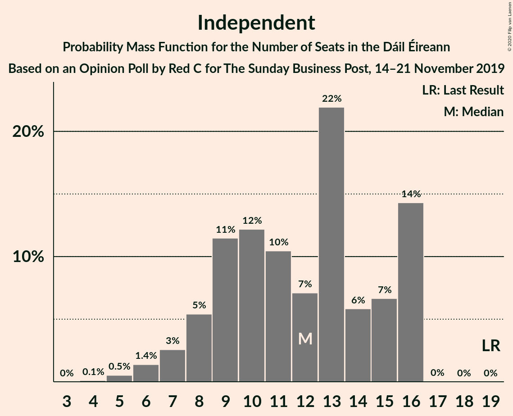

# Opinion Poll by Red C for The Sunday Business Post, 14–21 November 2019

<a href="#voting-intentions">Voting Intentions</a> | <a href="#seats">Seats</a> | <a href="#coalitions">Coalitions</a> | <a href="#technical-information">Technical Information</a>

## Voting Intentions

### Confidence Intervals

| Party | Last Result | Poll Result | 80% Confidence Interval | 90% Confidence Interval | 95% Confidence Interval | 99% Confidence Interval |
|:-----:|:-----------:|:-----------:|:-----------------------:|:-----------------------:|:-----------------------:|:-----------------------:|
| Fine Gael | 25.5% | 34.5% | 32.6–36.5% |32.1–37.0% |31.6–37.5% |30.7–38.5% |
| Fianna Fáil | 24.3% | 27.6% | 25.8–29.5% |25.3–30.0% |24.9–30.5% |24.1–31.4% |
| Sinn Féin | 13.8% | 12.6% | 11.3–14.0% |11.0–14.4% |10.7–14.8% |10.1–15.5% |
| Green Party/Comhaontas Glas | 2.7% | 8.0% | 7.0–9.2% |6.7–9.6% |6.5–9.9% |6.0–10.5% |
| Labour Party | 6.6% | 6.9% | 6.0–8.0% |5.7–8.4% |5.5–8.7% |5.1–9.2% |
| Solidarity–People Before Profit | 3.9% | 2.3% | 1.8–3.0% |1.6–3.2% |1.5–3.4% |1.3–3.8% |
| Social Democrats | 3.0% | 2.3% | 1.8–3.0% |1.6–3.2% |1.5–3.4% |1.3–3.8% |
| Independent | 15.9% | 1.0% | 0.7–1.5% |0.6–1.7% |0.5–1.8% |0.4–2.1% |
| Independents 4 Change | 1.5% | 0.1% | 0.0–0.4% |0.0–0.5% |0.0–0.6% |0.0–0.7% |

*Note:* The poll result column reflects the actual value used in the calculations. Published results may vary slightly, and in addition be rounded to fewer digits.

## Seats

### Confidence Intervals

| Party | Last Result | Median | 80% Confidence Interval | 90% Confidence Interval | 95% Confidence Interval | 99% Confidence Interval |
|:-----:|:-----------:|:------:|:-----------------------:|:-----------------------:|:-----------------------:|:-----------------------:|
| <a href="#fine-gael">Fine Gael</a> | 49 | 75 | 68–78 |68–79 |68–80 |66–80 |
| <a href="#fianna-fáil">Fianna Fáil</a> | 44 | 57 | 51–60 |50–60 |49–61 |49–61 |
| <a href="#sinn-féin">Sinn Féin</a> | 23 | 18 | 14–20 |14–20 |11–21 |11–21 |
| <a href="#green-party/comhaontas-glas">Green Party/Comhaontas Glas</a> | 2 | 5 | 5–7 |4–7 |4–7 |3–8 |
| <a href="#labour-party">Labour Party</a> | 7 | 4 | 2–7 |1–8 |1–9 |1–10 |
| <a href="#solidarity–people-before-profit">Solidarity–People Before Profit</a> | 6 | 1 | 0–2 |0–2 |0–2 |0–6 |
| <a href="#social-democrats">Social Democrats</a> | 3 | 3 | 2–4 |1–4 |1–4 |0–4 |
| <a href="#independent">Independent</a> | 19 | 0 | 0 |0 |0 |0 |
| <a href="#independents-4-change">Independents 4 Change</a> | 4 | 0 | 0 |0 |0 |0 |

### Fine Gael

*For a full overview of the results for this party, see the [Fine Gael](party-finegael.html) page.*

| Number of Seats | Probability | Accumulated | Special Marks |
|:---------------:|:-----------:|:-----------:|:-------------:|
| 49 | 0% | 100% | Last Result |
| 50 | 0% | 100% |  |
| 51 | 0% | 100% |  |
| 52 | 0% | 100% |  |
| 53 | 0% | 100% |  |
| 54 | 0% | 100% |  |
| 55 | 0% | 100% |  |
| 56 | 0% | 100% |  |
| 57 | 0% | 100% |  |
| 58 | 0% | 100% |  |
| 59 | 0% | 100% |  |
| 60 | 0% | 100% |  |
| 61 | 0% | 100% |  |
| 62 | 0% | 100% |  |
| 63 | 0% | 100% |  |
| 64 | 0% | 99.9% |  |
| 65 | 0.1% | 99.9% |  |
| 66 | 0.4% | 99.8% |  |
| 67 | 0.1% | 99.4% |  |
| 68 | 11% | 99.3% |  |
| 69 | 4% | 88% |  |
| 70 | 2% | 84% |  |
| 71 | 0.3% | 82% |  |
| 72 | 0.2% | 82% |  |
| 73 | 24% | 81% |  |
| 74 | 7% | 57% |  |
| 75 | 23% | 51% | Median |
| 76 | 8% | 28% |  |
| 77 | 5% | 20% |  |
| 78 | 9% | 15% |  |
| 79 | 1.2% | 5% |  |
| 80 | 4% | 4% |  |
| 81 | 0.1% | 0.2% | Majority |
| 82 | 0% | 0% |  |

### Fianna Fáil

*For a full overview of the results for this party, see the [Fianna Fáil](party-fiannafáil.html) page.*

| Number of Seats | Probability | Accumulated | Special Marks |
|:---------------:|:-----------:|:-----------:|:-------------:|
| 44 | 0% | 100% | Last Result |
| 45 | 0% | 100% |  |
| 46 | 0% | 100% |  |
| 47 | 0.1% | 100% |  |
| 48 | 0.1% | 99.9% |  |
| 49 | 3% | 99.8% |  |
| 50 | 1.5% | 96% |  |
| 51 | 9% | 95% |  |
| 52 | 10% | 86% |  |
| 53 | 2% | 76% |  |
| 54 | 3% | 74% |  |
| 55 | 10% | 71% |  |
| 56 | 5% | 61% |  |
| 57 | 23% | 56% | Median |
| 58 | 4% | 33% |  |
| 59 | 14% | 28% |  |
| 60 | 11% | 14% |  |
| 61 | 3% | 3% |  |
| 62 | 0% | 0% |  |

### Sinn Féin

*For a full overview of the results for this party, see the [Sinn Féin](party-sinnféin.html) page.*

| Number of Seats | Probability | Accumulated | Special Marks |
|:---------------:|:-----------:|:-----------:|:-------------:|
| 9 | 0.1% | 100% |  |
| 10 | 0.3% | 99.9% |  |
| 11 | 3% | 99.6% |  |
| 12 | 0.7% | 96% |  |
| 13 | 0.4% | 96% |  |
| 14 | 25% | 95% |  |
| 15 | 2% | 70% |  |
| 16 | 6% | 68% |  |
| 17 | 11% | 62% |  |
| 18 | 24% | 51% | Median |
| 19 | 17% | 27% |  |
| 20 | 7% | 11% |  |
| 21 | 3% | 3% |  |
| 22 | 0.1% | 0.4% |  |
| 23 | 0.1% | 0.2% | Last Result |
| 24 | 0.2% | 0.2% |  |
| 25 | 0% | 0% |  |

### Green Party/Comhaontas Glas

*For a full overview of the results for this party, see the [Green Party/Comhaontas Glas](party-greenpartycomhaontasglas.html) page.*

| Number of Seats | Probability | Accumulated | Special Marks |
|:---------------:|:-----------:|:-----------:|:-------------:|
| 2 | 0% | 100% | Last Result |
| 3 | 0.5% | 100% |  |
| 4 | 6% | 99.5% |  |
| 5 | 53% | 93% | Median |
| 6 | 16% | 40% |  |
| 7 | 22% | 24% |  |
| 8 | 2% | 2% |  |
| 9 | 0.1% | 0.4% |  |
| 10 | 0.2% | 0.4% |  |
| 11 | 0.1% | 0.1% |  |
| 12 | 0% | 0% |  |

### Labour Party

*For a full overview of the results for this party, see the [Labour Party](party-labourparty.html) page.*

| Number of Seats | Probability | Accumulated | Special Marks |
|:---------------:|:-----------:|:-----------:|:-------------:|
| 0 | 0.2% | 100% |  |
| 1 | 6% | 99.8% |  |
| 2 | 9% | 94% |  |
| 3 | 17% | 85% |  |
| 4 | 35% | 68% | Median |
| 5 | 11% | 33% |  |
| 6 | 8% | 21% |  |
| 7 | 7% | 13% | Last Result |
| 8 | 4% | 6% |  |
| 9 | 2% | 3% |  |
| 10 | 0.4% | 0.8% |  |
| 11 | 0.3% | 0.4% |  |
| 12 | 0.1% | 0.1% |  |
| 13 | 0% | 0% |  |

### Solidarity–People Before Profit

*For a full overview of the results for this party, see the [Solidarity–People Before Profit](party-solidarity–peoplebeforeprofit.html) page.*

| Number of Seats | Probability | Accumulated | Special Marks |
|:---------------:|:-----------:|:-----------:|:-------------:|
| 0 | 49% | 100% |  |
| 1 | 36% | 51% | Median |
| 2 | 13% | 15% |  |
| 3 | 0.6% | 2% |  |
| 4 | 0.1% | 0.9% |  |
| 5 | 0% | 0.8% |  |
| 6 | 0.8% | 0.8% | Last Result |
| 7 | 0% | 0% |  |

### Social Democrats

*For a full overview of the results for this party, see the [Social Democrats](party-socialdemocrats.html) page.*

| Number of Seats | Probability | Accumulated | Special Marks |
|:---------------:|:-----------:|:-----------:|:-------------:|
| 0 | 2% | 100% |  |
| 1 | 4% | 98% |  |
| 2 | 25% | 95% |  |
| 3 | 53% | 70% | Last Result, Median |
| 4 | 17% | 17% |  |
| 5 | 0% | 0% |  |

### Independent

*For a full overview of the results for this party, see the [Independent](party-independent.html) page.*

| Number of Seats | Probability | Accumulated | Special Marks |
|:---------------:|:-----------:|:-----------:|:-------------:|
| 0 | 100% | 100% | Median |
| 1 | 0% | 0% |  |
| 2 | 0% | 0% |  |
| 3 | 0% | 0% |  |
| 4 | 0% | 0% |  |
| 5 | 0% | 0% |  |
| 6 | 0% | 0% |  |
| 7 | 0% | 0% |  |
| 8 | 0% | 0% |  |
| 9 | 0% | 0% |  |
| 10 | 0% | 0% |  |
| 11 | 0% | 0% |  |
| 12 | 0% | 0% |  |
| 13 | 0% | 0% |  |
| 14 | 0% | 0% |  |
| 15 | 0% | 0% |  |
| 16 | 0% | 0% |  |
| 17 | 0% | 0% |  |
| 18 | 0% | 0% |  |
| 19 | 0% | 0% | Last Result |

### Independents 4 Change

*For a full overview of the results for this party, see the [Independents 4 Change](party-independents4change.html) page.*

| Number of Seats | Probability | Accumulated | Special Marks |
|:---------------:|:-----------:|:-----------:|:-------------:|
| 0 | 99.9% | 100% | Median |
| 1 | 0.1% | 0.1% |  |
| 2 | 0% | 0% |  |
| 3 | 0% | 0% |  |
| 4 | 0% | 0% | Last Result |

## Coalitions

### Confidence Intervals

| Coalition | Last Result | Median | Majority? | 80% Confidence Interval | 90% Confidence Interval | 95% Confidence Interval | 99% Confidence Interval |
|:---------:|:-----------:|:------:|:---------:|:-----------------------:|:-----------------------:|:-----------------------:|:-----------------------:|
| Fine Gael – Fianna Fáil | 93 | 130 | 100% | 126–133 | 124–133 | 124–136 | 123–136 |
| Fine Gael – Labour Party | 56 | 79 | 25% | 72–83 | 72–85 | 71–85 | 70–89 |
| Fine Gael | 49 | 75 | 0.2% | 68–78 | 68–79 | 68–80 | 66–80 |
| Fianna Fáil – Sinn Féin | 67 | 71 | 1.0% | 69–79 | 67–79 | 66–79 | 63–81 |
| Fianna Fáil – Green Party/Comhaontas Glas | 46 | 63 | 0% | 56–65 | 55–65 | 54–67 | 54–67 |

### Fine Gael – Fianna Fáil

| Number of Seats | Probability | Accumulated | Special Marks |
|:---------------:|:-----------:|:-----------:|:-------------:|
| 93 | 0% | 100% | Last Result |
| 94 | 0% | 100% |  |
| 95 | 0% | 100% |  |
| 96 | 0% | 100% |  |
| 97 | 0% | 100% |  |
| 98 | 0% | 100% |  |
| 99 | 0% | 100% |  |
| 100 | 0% | 100% |  |
| 101 | 0% | 100% |  |
| 102 | 0% | 100% |  |
| 103 | 0% | 100% |  |
| 104 | 0% | 100% |  |
| 105 | 0% | 100% |  |
| 106 | 0% | 100% |  |
| 107 | 0% | 100% |  |
| 108 | 0% | 100% |  |
| 109 | 0% | 100% |  |
| 110 | 0% | 100% |  |
| 111 | 0% | 100% |  |
| 112 | 0% | 100% |  |
| 113 | 0% | 100% |  |
| 114 | 0% | 100% |  |
| 115 | 0% | 100% |  |
| 116 | 0% | 100% |  |
| 117 | 0% | 100% |  |
| 118 | 0% | 100% |  |
| 119 | 0% | 100% |  |
| 120 | 0.1% | 100% |  |
| 121 | 0.1% | 99.9% |  |
| 122 | 0.1% | 99.8% |  |
| 123 | 1.0% | 99.7% |  |
| 124 | 6% | 98.7% |  |
| 125 | 1.3% | 93% |  |
| 126 | 3% | 91% |  |
| 127 | 7% | 89% |  |
| 128 | 15% | 82% |  |
| 129 | 12% | 67% |  |
| 130 | 9% | 55% |  |
| 131 | 3% | 46% |  |
| 132 | 33% | 43% | Median |
| 133 | 7% | 11% |  |
| 134 | 0.9% | 4% |  |
| 135 | 0.3% | 3% |  |
| 136 | 3% | 3% |  |
| 137 | 0% | 0.1% |  |
| 138 | 0.1% | 0.1% |  |
| 139 | 0% | 0% |  |

### Fine Gael – Labour Party

| Number of Seats | Probability | Accumulated | Special Marks |
|:---------------:|:-----------:|:-----------:|:-------------:|
| 56 | 0% | 100% | Last Result |
| 57 | 0% | 100% |  |
| 58 | 0% | 100% |  |
| 59 | 0% | 100% |  |
| 60 | 0% | 100% |  |
| 61 | 0% | 100% |  |
| 62 | 0% | 100% |  |
| 63 | 0% | 100% |  |
| 64 | 0% | 100% |  |
| 65 | 0% | 100% |  |
| 66 | 0% | 100% |  |
| 67 | 0% | 100% |  |
| 68 | 0% | 100% |  |
| 69 | 0.3% | 100% |  |
| 70 | 0.2% | 99.7% |  |
| 71 | 4% | 99.5% |  |
| 72 | 11% | 95% |  |
| 73 | 1.0% | 84% |  |
| 74 | 1.1% | 83% |  |
| 75 | 0.8% | 82% |  |
| 76 | 14% | 81% |  |
| 77 | 5% | 68% |  |
| 78 | 3% | 62% |  |
| 79 | 26% | 59% | Median |
| 80 | 8% | 33% |  |
| 81 | 9% | 25% | Majority |
| 82 | 1.4% | 16% |  |
| 83 | 9% | 15% |  |
| 84 | 0.8% | 6% |  |
| 85 | 3% | 5% |  |
| 86 | 0.7% | 2% |  |
| 87 | 0.3% | 1.3% |  |
| 88 | 0.2% | 1.0% |  |
| 89 | 0.5% | 0.8% |  |
| 90 | 0.3% | 0.3% |  |
| 91 | 0% | 0% |  |

### Fine Gael

| Number of Seats | Probability | Accumulated | Special Marks |
|:---------------:|:-----------:|:-----------:|:-------------:|
| 49 | 0% | 100% | Last Result |
| 50 | 0% | 100% |  |
| 51 | 0% | 100% |  |
| 52 | 0% | 100% |  |
| 53 | 0% | 100% |  |
| 54 | 0% | 100% |  |
| 55 | 0% | 100% |  |
| 56 | 0% | 100% |  |
| 57 | 0% | 100% |  |
| 58 | 0% | 100% |  |
| 59 | 0% | 100% |  |
| 60 | 0% | 100% |  |
| 61 | 0% | 100% |  |
| 62 | 0% | 100% |  |
| 63 | 0% | 100% |  |
| 64 | 0% | 99.9% |  |
| 65 | 0.1% | 99.9% |  |
| 66 | 0.4% | 99.8% |  |
| 67 | 0.1% | 99.4% |  |
| 68 | 11% | 99.3% |  |
| 69 | 4% | 88% |  |
| 70 | 2% | 84% |  |
| 71 | 0.3% | 82% |  |
| 72 | 0.2% | 82% |  |
| 73 | 24% | 81% |  |
| 74 | 7% | 57% |  |
| 75 | 23% | 51% | Median |
| 76 | 8% | 28% |  |
| 77 | 5% | 20% |  |
| 78 | 9% | 15% |  |
| 79 | 1.2% | 5% |  |
| 80 | 4% | 4% |  |
| 81 | 0.1% | 0.2% | Majority |
| 82 | 0% | 0% |  |

### Fianna Fáil – Sinn Féin

| Number of Seats | Probability | Accumulated | Special Marks |
|:---------------:|:-----------:|:-----------:|:-------------:|
| 62 | 0.3% | 100% |  |
| 63 | 0.7% | 99.7% |  |
| 64 | 0.1% | 99.0% |  |
| 65 | 0.3% | 98.9% |  |
| 66 | 3% | 98.6% |  |
| 67 | 3% | 95% | Last Result |
| 68 | 0.7% | 92% |  |
| 69 | 15% | 92% |  |
| 70 | 6% | 77% |  |
| 71 | 25% | 71% |  |
| 72 | 2% | 47% |  |
| 73 | 9% | 44% |  |
| 74 | 3% | 35% |  |
| 75 | 0.9% | 32% | Median |
| 76 | 3% | 31% |  |
| 77 | 13% | 28% |  |
| 78 | 0.7% | 15% |  |
| 79 | 13% | 14% |  |
| 80 | 0.2% | 1.2% |  |
| 81 | 0.9% | 1.0% | Majority |
| 82 | 0.1% | 0.1% |  |
| 83 | 0% | 0% |  |

### Fianna Fáil – Green Party/Comhaontas Glas

| Number of Seats | Probability | Accumulated | Special Marks |
|:---------------:|:-----------:|:-----------:|:-------------:|
| 46 | 0% | 100% | Last Result |
| 47 | 0% | 100% |  |
| 48 | 0% | 100% |  |
| 49 | 0% | 100% |  |
| 50 | 0% | 100% |  |
| 51 | 0% | 100% |  |
| 52 | 0.1% | 100% |  |
| 53 | 0.1% | 99.9% |  |
| 54 | 4% | 99.8% |  |
| 55 | 3% | 96% |  |
| 56 | 11% | 93% |  |
| 57 | 4% | 82% |  |
| 58 | 2% | 78% |  |
| 59 | 5% | 76% |  |
| 60 | 4% | 71% |  |
| 61 | 8% | 67% |  |
| 62 | 5% | 59% | Median |
| 63 | 5% | 54% |  |
| 64 | 33% | 49% |  |
| 65 | 11% | 16% |  |
| 66 | 0.7% | 5% |  |
| 67 | 4% | 4% |  |
| 68 | 0.1% | 0.1% |  |
| 69 | 0% | 0% |  |

## Technical Information

### Opinion Poll

+ **Polling firm:** Red C
+ **Commissioner(s):** The Sunday Business Post
+ **Fieldwork period:** 14–21 November 2019

### Calculations

+ **Sample size:** 1000
+ **Simulations done:** 131,072
+ **Error estimate:** 1.55%

