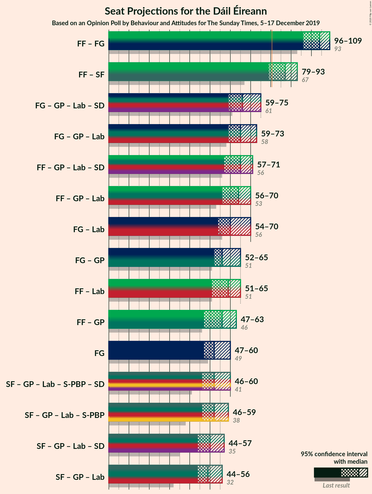
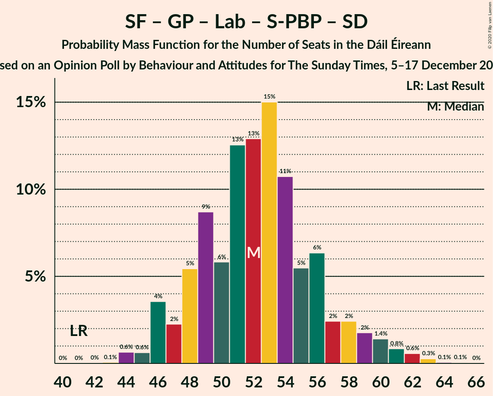

# Opinion Poll by Behaviour and Attitudes for The Sunday Times, 5–17 December 2019

<a href="#voting-intentions">Voting Intentions</a> | <a href="#seats">Seats</a> | <a href="#coalitions">Coalitions</a> | <a href="#technical-information">Technical Information</a>

## Voting Intentions

### Confidence Intervals

| Party | Last Result | Poll Result | 80% Confidence Interval | 90% Confidence Interval | 95% Confidence Interval | 99% Confidence Interval |
|:-----:|:-----------:|:-----------:|:-----------------------:|:-----------------------:|:-----------------------:|:-----------------------:|
| Fine Gael | 25.5% | 27.0% | 25.2–29.0% |24.7–29.5% |24.3–30.0% |23.4–30.9% |
| Fianna Fáil | 24.3% | 27.0% | 25.2–29.0% |24.7–29.5% |24.3–30.0% |23.4–30.9% |
| Sinn Féin | 13.8% | 20.0% | 18.4–21.7% |17.9–22.2% |17.5–22.7% |16.8–23.5% |
| Independent | 15.9% | 6.7% | 5.8–7.9% |5.5–8.2% |5.3–8.5% |4.9–9.1% |
| Labour Party | 6.6% | 6.0% | 5.1–7.1% |4.8–7.4% |4.6–7.7% |4.2–8.3% |
| Green Party/Comhaontas Glas | 2.7% | 6.0% | 5.1–7.1% |4.8–7.4% |4.6–7.7% |4.2–8.3% |
| Solidarity–People Before Profit | 3.9% | 3.0% | 2.4–3.8% |2.2–4.1% |2.1–4.3% |1.8–4.7% |
| Social Democrats | 3.0% | 1.0% | 0.7–1.5% |0.6–1.7% |0.5–1.8% |0.4–2.1% |
| Independents 4 Change | 1.5% | 0.9% | 0.6–1.4% |0.5–1.5% |0.4–1.7% |0.3–2.0% |

*Note:* The poll result column reflects the actual value used in the calculations. Published results may vary slightly, and in addition be rounded to fewer digits.

## Seats

### Confidence Intervals

| Party | Last Result | Median | 80% Confidence Interval | 90% Confidence Interval | 95% Confidence Interval | 99% Confidence Interval |
|:-----:|:-----------:|:------:|:-----------------------:|:-----------------------:|:-----------------------:|:-----------------------:|
| <a href="#fine-gael">Fine Gael</a> | 49 | 52 | 48–58 |48–59 |47–60 |45–62 |
| <a href="#fianna-fáil">Fianna Fáil</a> | 44 | 51 | 46–55 |45–56 |44–56 |41–58 |
| <a href="#sinn-féin">Sinn Féin</a> | 23 | 37 | 35–37 |34–38 |34–38 |32–39 |
| <a href="#independent">Independent</a> | 19 | 3 | 2–3 |2–3 |1–3 |1–6 |
| <a href="#labour-party">Labour Party</a> | 7 | 7 | 4–13 |4–15 |3–17 |1–19 |
| <a href="#green-party/comhaontas-glas">Green Party/Comhaontas Glas</a> | 2 | 5 | 3–7 |2–8 |2–9 |2–10 |
| <a href="#solidarity–people-before-profit">Solidarity–People Before Profit</a> | 6 | 2 | 1–4 |1–4 |1–5 |1–6 |
| <a href="#social-democrats">Social Democrats</a> | 3 | 1 | 0–1 |0–2 |0–3 |0–3 |
| <a href="#independents-4-change">Independents 4 Change</a> | 4 | 2 | 0–3 |0–3 |0–3 |0–3 |

### Fine Gael

*For a full overview of the results for this party, see the [Fine Gael](party-finegael.html) page.*

| Number of Seats | Probability | Accumulated | Special Marks |
|:---------------:|:-----------:|:-----------:|:-------------:|
| 42 | 0.1% | 100% |  |
| 43 | 0.1% | 99.9% |  |
| 44 | 0.2% | 99.8% |  |
| 45 | 0.3% | 99.6% |  |
| 46 | 1.3% | 99.4% |  |
| 47 | 2% | 98% |  |
| 48 | 8% | 96% |  |
| 49 | 10% | 87% | Last Result |
| 50 | 8% | 77% |  |
| 51 | 18% | 69% |  |
| 52 | 9% | 51% | Median |
| 53 | 9% | 42% |  |
| 54 | 6% | 32% |  |
| 55 | 5% | 26% |  |
| 56 | 5% | 21% |  |
| 57 | 6% | 16% |  |
| 58 | 4% | 10% |  |
| 59 | 2% | 6% |  |
| 60 | 2% | 4% |  |
| 61 | 1.3% | 2% |  |
| 62 | 0.6% | 0.8% |  |
| 63 | 0.1% | 0.2% |  |
| 64 | 0.1% | 0.1% |  |
| 65 | 0% | 0% |  |

### Fianna Fáil

*For a full overview of the results for this party, see the [Fianna Fáil](party-fiannafáil.html) page.*

| Number of Seats | Probability | Accumulated | Special Marks |
|:---------------:|:-----------:|:-----------:|:-------------:|
| 38 | 0% | 100% |  |
| 39 | 0.2% | 99.9% |  |
| 40 | 0.1% | 99.7% |  |
| 41 | 0.3% | 99.6% |  |
| 42 | 0.7% | 99.4% |  |
| 43 | 0.4% | 98.7% |  |
| 44 | 3% | 98% | Last Result |
| 45 | 3% | 96% |  |
| 46 | 3% | 93% |  |
| 47 | 3% | 90% |  |
| 48 | 7% | 86% |  |
| 49 | 9% | 79% |  |
| 50 | 14% | 70% |  |
| 51 | 12% | 57% | Median |
| 52 | 13% | 44% |  |
| 53 | 11% | 32% |  |
| 54 | 7% | 20% |  |
| 55 | 8% | 13% |  |
| 56 | 3% | 5% |  |
| 57 | 2% | 2% |  |
| 58 | 0.5% | 0.6% |  |
| 59 | 0.1% | 0.1% |  |
| 60 | 0% | 0.1% |  |
| 61 | 0% | 0% |  |

### Sinn Féin

*For a full overview of the results for this party, see the [Sinn Féin](party-sinnféin.html) page.*

| Number of Seats | Probability | Accumulated | Special Marks |
|:---------------:|:-----------:|:-----------:|:-------------:|
| 23 | 0% | 100% | Last Result |
| 24 | 0% | 100% |  |
| 25 | 0% | 100% |  |
| 26 | 0% | 100% |  |
| 27 | 0% | 100% |  |
| 28 | 0% | 100% |  |
| 29 | 0% | 100% |  |
| 30 | 0% | 100% |  |
| 31 | 0.2% | 100% |  |
| 32 | 0.8% | 99.8% |  |
| 33 | 1.0% | 99.0% |  |
| 34 | 4% | 98% |  |
| 35 | 22% | 94% |  |
| 36 | 18% | 72% |  |
| 37 | 46% | 55% | Median |
| 38 | 7% | 8% |  |
| 39 | 1.1% | 1.3% |  |
| 40 | 0.3% | 0.3% |  |
| 41 | 0% | 0% |  |

### Independent

*For a full overview of the results for this party, see the [Independent](party-independent.html) page.*

| Number of Seats | Probability | Accumulated | Special Marks |
|:---------------:|:-----------:|:-----------:|:-------------:|
| 1 | 3% | 100% |  |
| 2 | 14% | 97% |  |
| 3 | 81% | 82% | Median |
| 4 | 0.9% | 2% |  |
| 5 | 0.2% | 0.7% |  |
| 6 | 0.4% | 0.5% |  |
| 7 | 0.1% | 0.2% |  |
| 8 | 0% | 0% |  |
| 9 | 0% | 0% |  |
| 10 | 0% | 0% |  |
| 11 | 0% | 0% |  |
| 12 | 0% | 0% |  |
| 13 | 0% | 0% |  |
| 14 | 0% | 0% |  |
| 15 | 0% | 0% |  |
| 16 | 0% | 0% |  |
| 17 | 0% | 0% |  |
| 18 | 0% | 0% |  |
| 19 | 0% | 0% | Last Result |

### Labour Party

*For a full overview of the results for this party, see the [Labour Party](party-labourparty.html) page.*

| Number of Seats | Probability | Accumulated | Special Marks |
|:---------------:|:-----------:|:-----------:|:-------------:|
| 1 | 0.9% | 100% |  |
| 2 | 1.4% | 99.1% |  |
| 3 | 2% | 98% |  |
| 4 | 6% | 95% |  |
| 5 | 7% | 89% |  |
| 6 | 22% | 82% |  |
| 7 | 18% | 60% | Last Result, Median |
| 8 | 11% | 42% |  |
| 9 | 6% | 31% |  |
| 10 | 6% | 25% |  |
| 11 | 2% | 18% |  |
| 12 | 2% | 16% |  |
| 13 | 4% | 14% |  |
| 14 | 4% | 10% |  |
| 15 | 2% | 6% |  |
| 16 | 1.1% | 4% |  |
| 17 | 1.5% | 3% |  |
| 18 | 0.7% | 1.3% |  |
| 19 | 0.4% | 0.6% |  |
| 20 | 0.2% | 0.3% |  |
| 21 | 0% | 0% |  |

### Green Party/Comhaontas Glas

*For a full overview of the results for this party, see the [Green Party/Comhaontas Glas](party-greenpartycomhaontasglas.html) page.*

| Number of Seats | Probability | Accumulated | Special Marks |
|:---------------:|:-----------:|:-----------:|:-------------:|
| 2 | 9% | 100% | Last Result |
| 3 | 14% | 91% |  |
| 4 | 17% | 77% |  |
| 5 | 26% | 60% | Median |
| 6 | 9% | 34% |  |
| 7 | 17% | 25% |  |
| 8 | 4% | 8% |  |
| 9 | 3% | 4% |  |
| 10 | 0.5% | 0.7% |  |
| 11 | 0.1% | 0.3% |  |
| 12 | 0.1% | 0.2% |  |
| 13 | 0.1% | 0.1% |  |
| 14 | 0% | 0% |  |

### Solidarity–People Before Profit

*For a full overview of the results for this party, see the [Solidarity–People Before Profit](party-solidarity–peoplebeforeprofit.html) page.*

| Number of Seats | Probability | Accumulated | Special Marks |
|:---------------:|:-----------:|:-----------:|:-------------:|
| 0 | 0.2% | 100% |  |
| 1 | 32% | 99.8% |  |
| 2 | 22% | 68% | Median |
| 3 | 29% | 46% |  |
| 4 | 12% | 16% |  |
| 5 | 3% | 4% |  |
| 6 | 0.6% | 1.1% | Last Result |
| 7 | 0.4% | 0.5% |  |
| 8 | 0% | 0.1% |  |
| 9 | 0% | 0% |  |

### Social Democrats

*For a full overview of the results for this party, see the [Social Democrats](party-socialdemocrats.html) page.*

| Number of Seats | Probability | Accumulated | Special Marks |
|:---------------:|:-----------:|:-----------:|:-------------:|
| 0 | 37% | 100% |  |
| 1 | 55% | 63% | Median |
| 2 | 4% | 8% |  |
| 3 | 4% | 4% | Last Result |
| 4 | 0% | 0% |  |

### Independents 4 Change

*For a full overview of the results for this party, see the [Independents 4 Change](party-independents4change.html) page.*

| Number of Seats | Probability | Accumulated | Special Marks |
|:---------------:|:-----------:|:-----------:|:-------------:|
| 0 | 21% | 100% |  |
| 1 | 17% | 79% |  |
| 2 | 39% | 62% | Median |
| 3 | 23% | 23% |  |
| 4 | 0.1% | 0.1% | Last Result |
| 5 | 0% | 0% |  |

## Coalitions

### Confidence Intervals

| Coalition | Last Result | Median | Majority? | 80% Confidence Interval | 90% Confidence Interval | 95% Confidence Interval | 99% Confidence Interval |
|:---------:|:-----------:|:------:|:---------:|:-----------------------:|:-----------------------:|:-----------------------:|:-----------------------:|
| Fianna Fáil – Fine Gael | 93 | 104 | 100% | 99–108 | 97–109 | 96–109 | 94–111 |
| Fianna Fáil – Sinn Féin | 67 | 87 | 94% | 82–92 | 80–93 | 79–93 | 77–95 |
| Fine Gael – Green Party/Comhaontas Glas – Labour Party – Social Democrats | 61 | 66 | 0% | 62–71 | 61–73 | 59–75 | 58–76 |
| Fine Gael – Green Party/Comhaontas Glas – Labour Party | 58 | 65 | 0% | 61–70 | 60–72 | 59–73 | 57–76 |
| Fianna Fáil – Green Party/Comhaontas Glas – Labour Party – Social Democrats | 56 | 65 | 0% | 60–69 | 58–70 | 57–71 | 55–73 |
| Fianna Fáil – Green Party/Comhaontas Glas – Labour Party | 53 | 64 | 0% | 59–68 | 58–69 | 56–70 | 54–72 |
| Fine Gael – Labour Party | 56 | 60 | 0% | 55–66 | 54–68 | 54–70 | 51–71 |
| Fine Gael – Green Party/Comhaontas Glas | 51 | 56 | 0% | 53–63 | 52–64 | 52–65 | 50–67 |
| Fianna Fáil – Labour Party | 51 | 59 | 0% | 54–63 | 53–64 | 51–65 | 49–67 |
| Fianna Fáil – Green Party/Comhaontas Glas | 46 | 56 | 0% | 51–60 | 49–62 | 47–63 | 45–64 |
| Fine Gael | 49 | 52 | 0% | 48–58 | 48–59 | 47–60 | 45–62 |
| Sinn Féin – Green Party/Comhaontas Glas – Labour Party – Solidarity–People Before Profit – Social Democrats | 41 | 52 | 0% | 48–56 | 47–58 | 46–60 | 44–62 |
| Sinn Féin – Green Party/Comhaontas Glas – Labour Party – Solidarity–People Before Profit | 38 | 52 | 0% | 47–56 | 46–58 | 46–59 | 44–61 |
| Sinn Féin – Green Party/Comhaontas Glas – Labour Party – Social Democrats | 35 | 50 | 0% | 45–54 | 44–56 | 44–57 | 42–60 |
| Sinn Féin – Green Party/Comhaontas Glas – Labour Party | 32 | 49 | 0% | 45–54 | 44–55 | 44–56 | 42–59 |

### Fianna Fáil – Fine Gael

| Number of Seats | Probability | Accumulated | Special Marks |
|:---------------:|:-----------:|:-----------:|:-------------:|
| 91 | 0% | 100% |  |
| 92 | 0.1% | 99.9% |  |
| 93 | 0.2% | 99.9% | Last Result |
| 94 | 0.6% | 99.6% |  |
| 95 | 1.1% | 99.1% |  |
| 96 | 1.5% | 98% |  |
| 97 | 2% | 96% |  |
| 98 | 2% | 94% |  |
| 99 | 3% | 92% |  |
| 100 | 6% | 88% |  |
| 101 | 11% | 82% |  |
| 102 | 8% | 71% |  |
| 103 | 11% | 63% | Median |
| 104 | 22% | 52% |  |
| 105 | 7% | 30% |  |
| 106 | 9% | 23% |  |
| 107 | 4% | 14% |  |
| 108 | 5% | 10% |  |
| 109 | 4% | 6% |  |
| 110 | 0.7% | 2% |  |
| 111 | 0.7% | 0.8% |  |
| 112 | 0.1% | 0.1% |  |
| 113 | 0% | 0% |  |

### Fianna Fáil – Sinn Féin

| Number of Seats | Probability | Accumulated | Special Marks |
|:---------------:|:-----------:|:-----------:|:-------------:|
| 67 | 0% | 100% | Last Result |
| 68 | 0% | 100% |  |
| 69 | 0% | 100% |  |
| 70 | 0% | 100% |  |
| 71 | 0% | 100% |  |
| 72 | 0% | 100% |  |
| 73 | 0% | 100% |  |
| 74 | 0.1% | 100% |  |
| 75 | 0% | 99.9% |  |
| 76 | 0.2% | 99.9% |  |
| 77 | 0.5% | 99.7% |  |
| 78 | 0.7% | 99.1% |  |
| 79 | 2% | 98% |  |
| 80 | 2% | 96% |  |
| 81 | 3% | 94% | Majority |
| 82 | 3% | 91% |  |
| 83 | 4% | 88% |  |
| 84 | 4% | 84% |  |
| 85 | 12% | 80% |  |
| 86 | 8% | 68% |  |
| 87 | 14% | 60% |  |
| 88 | 9% | 46% | Median |
| 89 | 7% | 36% |  |
| 90 | 10% | 29% |  |
| 91 | 6% | 19% |  |
| 92 | 8% | 13% |  |
| 93 | 4% | 6% |  |
| 94 | 1.4% | 2% |  |
| 95 | 0.3% | 0.7% |  |
| 96 | 0.3% | 0.4% |  |
| 97 | 0.1% | 0.1% |  |
| 98 | 0% | 0% |  |

### Fine Gael – Green Party/Comhaontas Glas – Labour Party – Social Democrats

| Number of Seats | Probability | Accumulated | Special Marks |
|:---------------:|:-----------:|:-----------:|:-------------:|
| 56 | 0.2% | 100% |  |
| 57 | 0.1% | 99.8% |  |
| 58 | 1.2% | 99.7% |  |
| 59 | 1.2% | 98.6% |  |
| 60 | 2% | 97% |  |
| 61 | 5% | 95% | Last Result |
| 62 | 11% | 91% |  |
| 63 | 9% | 79% |  |
| 64 | 6% | 71% |  |
| 65 | 11% | 65% | Median |
| 66 | 11% | 54% |  |
| 67 | 10% | 43% |  |
| 68 | 5% | 33% |  |
| 69 | 10% | 28% |  |
| 70 | 6% | 18% |  |
| 71 | 3% | 12% |  |
| 72 | 3% | 9% |  |
| 73 | 2% | 7% |  |
| 74 | 1.3% | 4% |  |
| 75 | 2% | 3% |  |
| 76 | 0.5% | 1.0% |  |
| 77 | 0.2% | 0.5% |  |
| 78 | 0.2% | 0.3% |  |
| 79 | 0.1% | 0.1% |  |
| 80 | 0% | 0.1% |  |
| 81 | 0% | 0% | Majority |

### Fine Gael – Green Party/Comhaontas Glas – Labour Party

| Number of Seats | Probability | Accumulated | Special Marks |
|:---------------:|:-----------:|:-----------:|:-------------:|
| 55 | 0% | 100% |  |
| 56 | 0.2% | 99.9% |  |
| 57 | 0.3% | 99.7% |  |
| 58 | 1.5% | 99.4% | Last Result |
| 59 | 1.2% | 98% |  |
| 60 | 5% | 97% |  |
| 61 | 9% | 92% |  |
| 62 | 9% | 83% |  |
| 63 | 9% | 74% |  |
| 64 | 7% | 65% | Median |
| 65 | 14% | 58% |  |
| 66 | 11% | 44% |  |
| 67 | 4% | 33% |  |
| 68 | 10% | 29% |  |
| 69 | 5% | 19% |  |
| 70 | 4% | 14% |  |
| 71 | 2% | 10% |  |
| 72 | 3% | 7% |  |
| 73 | 2% | 5% |  |
| 74 | 1.2% | 2% |  |
| 75 | 0.7% | 1.3% |  |
| 76 | 0.3% | 0.6% |  |
| 77 | 0.1% | 0.3% |  |
| 78 | 0.1% | 0.2% |  |
| 79 | 0.1% | 0.1% |  |
| 80 | 0% | 0% |  |

### Fianna Fáil – Green Party/Comhaontas Glas – Labour Party – Social Democrats

| Number of Seats | Probability | Accumulated | Special Marks |
|:---------------:|:-----------:|:-----------:|:-------------:|
| 53 | 0.1% | 100% |  |
| 54 | 0.3% | 99.8% |  |
| 55 | 0.5% | 99.6% |  |
| 56 | 0.7% | 99.0% | Last Result |
| 57 | 2% | 98% |  |
| 58 | 2% | 96% |  |
| 59 | 3% | 95% |  |
| 60 | 6% | 92% |  |
| 61 | 7% | 86% |  |
| 62 | 6% | 78% |  |
| 63 | 8% | 73% |  |
| 64 | 12% | 65% | Median |
| 65 | 8% | 53% |  |
| 66 | 13% | 45% |  |
| 67 | 12% | 32% |  |
| 68 | 10% | 20% |  |
| 69 | 5% | 10% |  |
| 70 | 2% | 5% |  |
| 71 | 1.1% | 3% |  |
| 72 | 0.9% | 2% |  |
| 73 | 0.4% | 0.7% |  |
| 74 | 0.2% | 0.3% |  |
| 75 | 0.1% | 0.2% |  |
| 76 | 0.1% | 0.1% |  |
| 77 | 0% | 0% |  |

### Fianna Fáil – Green Party/Comhaontas Glas – Labour Party

| Number of Seats | Probability | Accumulated | Special Marks |
|:---------------:|:-----------:|:-----------:|:-------------:|
| 52 | 0.1% | 100% |  |
| 53 | 0.2% | 99.9% | Last Result |
| 54 | 0.4% | 99.6% |  |
| 55 | 0.8% | 99.2% |  |
| 56 | 2% | 98% |  |
| 57 | 1.5% | 97% |  |
| 58 | 2% | 95% |  |
| 59 | 4% | 93% |  |
| 60 | 12% | 90% |  |
| 61 | 5% | 78% |  |
| 62 | 6% | 73% |  |
| 63 | 9% | 68% | Median |
| 64 | 13% | 58% |  |
| 65 | 13% | 46% |  |
| 66 | 11% | 33% |  |
| 67 | 8% | 22% |  |
| 68 | 8% | 14% |  |
| 69 | 3% | 6% |  |
| 70 | 2% | 4% |  |
| 71 | 0.9% | 2% |  |
| 72 | 0.2% | 0.7% |  |
| 73 | 0.2% | 0.5% |  |
| 74 | 0.1% | 0.3% |  |
| 75 | 0.1% | 0.1% |  |
| 76 | 0.1% | 0.1% |  |
| 77 | 0% | 0% |  |

### Fine Gael – Labour Party

| Number of Seats | Probability | Accumulated | Special Marks |
|:---------------:|:-----------:|:-----------:|:-------------:|
| 48 | 0% | 100% |  |
| 49 | 0.1% | 99.9% |  |
| 50 | 0.1% | 99.8% |  |
| 51 | 0.4% | 99.7% |  |
| 52 | 0.5% | 99.3% |  |
| 53 | 1.1% | 98.8% |  |
| 54 | 4% | 98% |  |
| 55 | 6% | 93% |  |
| 56 | 8% | 87% | Last Result |
| 57 | 13% | 79% |  |
| 58 | 5% | 66% |  |
| 59 | 7% | 61% | Median |
| 60 | 10% | 54% |  |
| 61 | 6% | 44% |  |
| 62 | 3% | 37% |  |
| 63 | 11% | 34% |  |
| 64 | 5% | 23% |  |
| 65 | 4% | 18% |  |
| 66 | 5% | 14% |  |
| 67 | 2% | 9% |  |
| 68 | 3% | 7% |  |
| 69 | 1.1% | 4% |  |
| 70 | 2% | 3% |  |
| 71 | 0.9% | 1.3% |  |
| 72 | 0.2% | 0.4% |  |
| 73 | 0.1% | 0.2% |  |
| 74 | 0.1% | 0.1% |  |
| 75 | 0% | 0.1% |  |
| 76 | 0% | 0% |  |

### Fine Gael – Green Party/Comhaontas Glas

| Number of Seats | Probability | Accumulated | Special Marks |
|:---------------:|:-----------:|:-----------:|:-------------:|
| 47 | 0.1% | 100% |  |
| 48 | 0.1% | 99.9% |  |
| 49 | 0.2% | 99.8% |  |
| 50 | 0.4% | 99.7% |  |
| 51 | 1.1% | 99.3% | Last Result |
| 52 | 3% | 98% |  |
| 53 | 6% | 95% |  |
| 54 | 9% | 89% |  |
| 55 | 15% | 80% |  |
| 56 | 15% | 65% |  |
| 57 | 7% | 50% | Median |
| 58 | 9% | 42% |  |
| 59 | 5% | 33% |  |
| 60 | 6% | 29% |  |
| 61 | 9% | 23% |  |
| 62 | 4% | 14% |  |
| 63 | 4% | 10% |  |
| 64 | 3% | 6% |  |
| 65 | 0.9% | 3% |  |
| 66 | 2% | 2% |  |
| 67 | 0.3% | 0.7% |  |
| 68 | 0.2% | 0.4% |  |
| 69 | 0.1% | 0.2% |  |
| 70 | 0.1% | 0.1% |  |
| 71 | 0% | 0% |  |

### Fianna Fáil – Labour Party

| Number of Seats | Probability | Accumulated | Special Marks |
|:---------------:|:-----------:|:-----------:|:-------------:|
| 47 | 0.1% | 100% |  |
| 48 | 0.2% | 99.9% |  |
| 49 | 0.5% | 99.7% |  |
| 50 | 0.6% | 99.2% |  |
| 51 | 1.2% | 98.6% | Last Result |
| 52 | 1.4% | 97% |  |
| 53 | 2% | 96% |  |
| 54 | 5% | 94% |  |
| 55 | 8% | 89% |  |
| 56 | 8% | 81% |  |
| 57 | 9% | 73% |  |
| 58 | 7% | 64% | Median |
| 59 | 11% | 57% |  |
| 60 | 13% | 46% |  |
| 61 | 14% | 33% |  |
| 62 | 6% | 19% |  |
| 63 | 4% | 13% |  |
| 64 | 4% | 9% |  |
| 65 | 2% | 5% |  |
| 66 | 0.4% | 2% |  |
| 67 | 1.2% | 2% |  |
| 68 | 0.3% | 0.5% |  |
| 69 | 0.1% | 0.2% |  |
| 70 | 0.1% | 0.1% |  |
| 71 | 0% | 0% |  |

### Fianna Fáil – Green Party/Comhaontas Glas

| Number of Seats | Probability | Accumulated | Special Marks |
|:---------------:|:-----------:|:-----------:|:-------------:|
| 42 | 0.1% | 100% |  |
| 43 | 0.1% | 99.9% |  |
| 44 | 0.3% | 99.8% |  |
| 45 | 0.3% | 99.5% |  |
| 46 | 1.0% | 99.2% | Last Result |
| 47 | 0.9% | 98% |  |
| 48 | 2% | 97% |  |
| 49 | 2% | 95% |  |
| 50 | 3% | 94% |  |
| 51 | 3% | 91% |  |
| 52 | 5% | 87% |  |
| 53 | 11% | 83% |  |
| 54 | 7% | 72% |  |
| 55 | 9% | 64% |  |
| 56 | 9% | 56% | Median |
| 57 | 5% | 47% |  |
| 58 | 16% | 41% |  |
| 59 | 10% | 25% |  |
| 60 | 6% | 16% |  |
| 61 | 5% | 10% |  |
| 62 | 2% | 5% |  |
| 63 | 2% | 3% |  |
| 64 | 0.8% | 1.2% |  |
| 65 | 0.2% | 0.4% |  |
| 66 | 0.1% | 0.2% |  |
| 67 | 0% | 0.1% |  |
| 68 | 0% | 0% |  |

### Fine Gael

| Number of Seats | Probability | Accumulated | Special Marks |
|:---------------:|:-----------:|:-----------:|:-------------:|
| 42 | 0.1% | 100% |  |
| 43 | 0.1% | 99.9% |  |
| 44 | 0.2% | 99.8% |  |
| 45 | 0.3% | 99.6% |  |
| 46 | 1.3% | 99.4% |  |
| 47 | 2% | 98% |  |
| 48 | 8% | 96% |  |
| 49 | 10% | 87% | Last Result |
| 50 | 8% | 77% |  |
| 51 | 18% | 69% |  |
| 52 | 9% | 51% | Median |
| 53 | 9% | 42% |  |
| 54 | 6% | 32% |  |
| 55 | 5% | 26% |  |
| 56 | 5% | 21% |  |
| 57 | 6% | 16% |  |
| 58 | 4% | 10% |  |
| 59 | 2% | 6% |  |
| 60 | 2% | 4% |  |
| 61 | 1.3% | 2% |  |
| 62 | 0.6% | 0.8% |  |
| 63 | 0.1% | 0.2% |  |
| 64 | 0.1% | 0.1% |  |
| 65 | 0% | 0% |  |

### Sinn Féin – Green Party/Comhaontas Glas – Labour Party – Solidarity–People Before Profit – Social Democrats

| Number of Seats | Probability | Accumulated | Special Marks |
|:---------------:|:-----------:|:-----------:|:-------------:|
| 41 | 0% | 100% | Last Result |
| 42 | 0% | 100% |  |
| 43 | 0.1% | 100% |  |
| 44 | 0.6% | 99.9% |  |
| 45 | 0.6% | 99.3% |  |
| 46 | 4% | 98.6% |  |
| 47 | 2% | 95% |  |
| 48 | 5% | 93% |  |
| 49 | 9% | 87% |  |
| 50 | 6% | 79% |  |
| 51 | 13% | 73% |  |
| 52 | 13% | 60% | Median |
| 53 | 15% | 47% |  |
| 54 | 11% | 32% |  |
| 55 | 5% | 22% |  |
| 56 | 6% | 16% |  |
| 57 | 2% | 10% |  |
| 58 | 2% | 7% |  |
| 59 | 2% | 5% |  |
| 60 | 1.4% | 3% |  |
| 61 | 0.8% | 2% |  |
| 62 | 0.6% | 1.0% |  |
| 63 | 0.3% | 0.4% |  |
| 64 | 0.1% | 0.1% |  |
| 65 | 0.1% | 0.1% |  |
| 66 | 0% | 0% |  |

### Sinn Féin – Green Party/Comhaontas Glas – Labour Party – Solidarity–People Before Profit

| Number of Seats | Probability | Accumulated | Special Marks |
|:---------------:|:-----------:|:-----------:|:-------------:|
| 38 | 0% | 100% | Last Result |
| 39 | 0% | 100% |  |
| 40 | 0% | 100% |  |
| 41 | 0% | 100% |  |
| 42 | 0% | 100% |  |
| 43 | 0.1% | 99.9% |  |
| 44 | 0.7% | 99.8% |  |
| 45 | 0.8% | 99.1% |  |
| 46 | 4% | 98% |  |
| 47 | 4% | 94% |  |
| 48 | 9% | 90% |  |
| 49 | 8% | 81% |  |
| 50 | 10% | 73% |  |
| 51 | 11% | 63% | Median |
| 52 | 17% | 52% |  |
| 53 | 11% | 34% |  |
| 54 | 7% | 23% |  |
| 55 | 4% | 16% |  |
| 56 | 4% | 12% |  |
| 57 | 3% | 8% |  |
| 58 | 2% | 5% |  |
| 59 | 2% | 4% |  |
| 60 | 0.6% | 2% |  |
| 61 | 0.7% | 1.2% |  |
| 62 | 0.3% | 0.5% |  |
| 63 | 0.2% | 0.2% |  |
| 64 | 0% | 0.1% |  |
| 65 | 0% | 0% |  |

### Sinn Féin – Green Party/Comhaontas Glas – Labour Party – Social Democrats

| Number of Seats | Probability | Accumulated | Special Marks |
|:---------------:|:-----------:|:-----------:|:-------------:|
| 35 | 0% | 100% | Last Result |
| 36 | 0% | 100% |  |
| 37 | 0% | 100% |  |
| 38 | 0% | 100% |  |
| 39 | 0% | 100% |  |
| 40 | 0% | 100% |  |
| 41 | 0.1% | 99.9% |  |
| 42 | 0.4% | 99.8% |  |
| 43 | 1.2% | 99.4% |  |
| 44 | 4% | 98% |  |
| 45 | 5% | 94% |  |
| 46 | 3% | 89% |  |
| 47 | 9% | 87% |  |
| 48 | 14% | 78% |  |
| 49 | 6% | 64% |  |
| 50 | 15% | 58% | Median |
| 51 | 12% | 43% |  |
| 52 | 16% | 31% |  |
| 53 | 3% | 16% |  |
| 54 | 4% | 13% |  |
| 55 | 4% | 9% |  |
| 56 | 2% | 6% |  |
| 57 | 1.4% | 4% |  |
| 58 | 0.9% | 2% |  |
| 59 | 0.8% | 2% |  |
| 60 | 0.4% | 0.7% |  |
| 61 | 0.2% | 0.4% |  |
| 62 | 0.2% | 0.2% |  |
| 63 | 0% | 0% |  |

### Sinn Féin – Green Party/Comhaontas Glas – Labour Party

| Number of Seats | Probability | Accumulated | Special Marks |
|:---------------:|:-----------:|:-----------:|:-------------:|
| 32 | 0% | 100% | Last Result |
| 33 | 0% | 100% |  |
| 34 | 0% | 100% |  |
| 35 | 0% | 100% |  |
| 36 | 0% | 100% |  |
| 37 | 0% | 100% |  |
| 38 | 0% | 100% |  |
| 39 | 0% | 100% |  |
| 40 | 0.1% | 99.9% |  |
| 41 | 0.2% | 99.8% |  |
| 42 | 0.5% | 99.7% |  |
| 43 | 1.3% | 99.2% |  |
| 44 | 5% | 98% |  |
| 45 | 5% | 93% |  |
| 46 | 8% | 88% |  |
| 47 | 12% | 80% |  |
| 48 | 9% | 67% |  |
| 49 | 13% | 59% | Median |
| 50 | 13% | 46% |  |
| 51 | 12% | 33% |  |
| 52 | 8% | 20% |  |
| 53 | 2% | 12% |  |
| 54 | 4% | 10% |  |
| 55 | 2% | 6% |  |
| 56 | 2% | 4% |  |
| 57 | 0.5% | 2% |  |
| 58 | 1.1% | 2% |  |
| 59 | 0.4% | 0.9% |  |
| 60 | 0.2% | 0.4% |  |
| 61 | 0% | 0.2% |  |
| 62 | 0.1% | 0.2% |  |
| 63 | 0% | 0% |  |

## Technical Information

### Opinion Poll

+ **Polling firm:** Behaviour and Attitudes
+ **Commissioner(s):** The Sunday Times
+ **Fieldwork period:** 5–17 December 2019

### Calculations

+ **Sample size:** 936
+ **Simulations done:** 1,048,576
+ **Error estimate:** 3.67%

