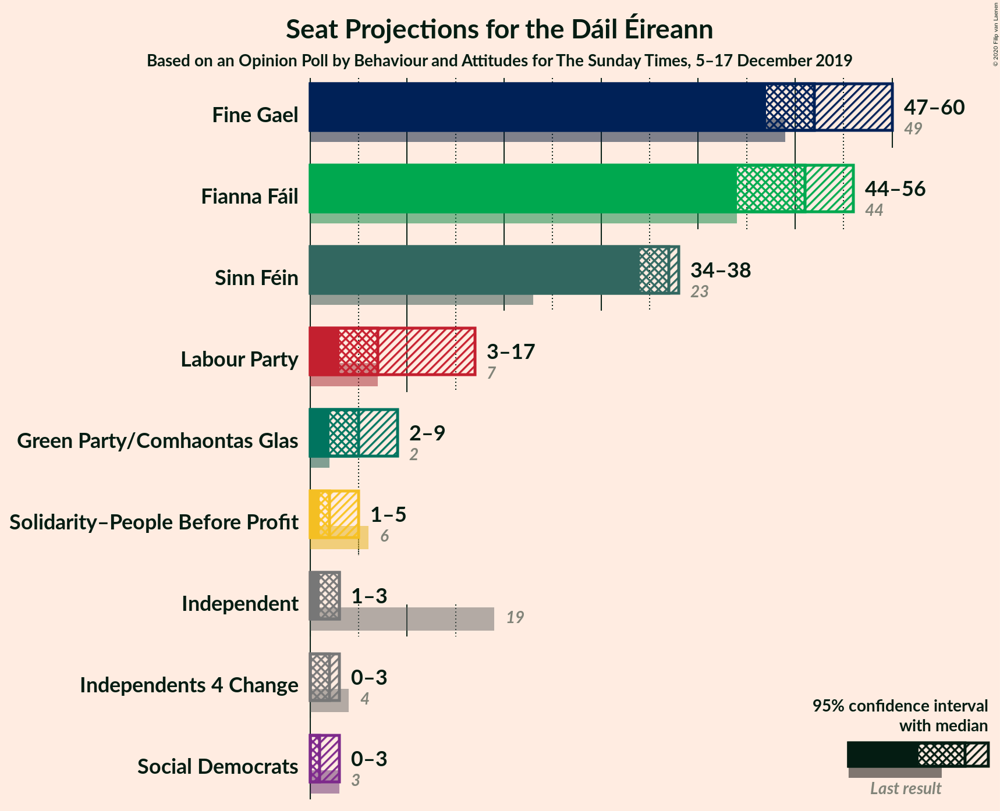
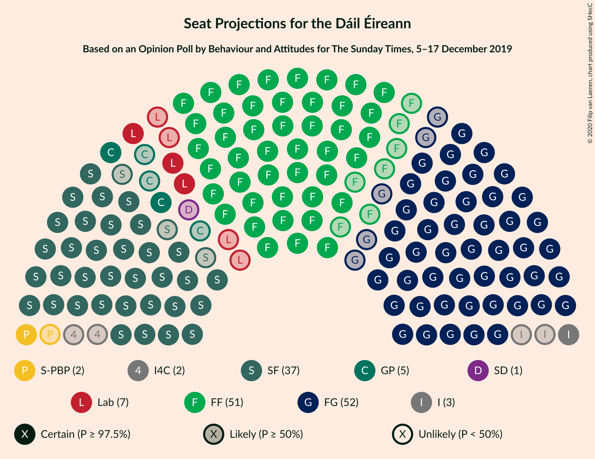
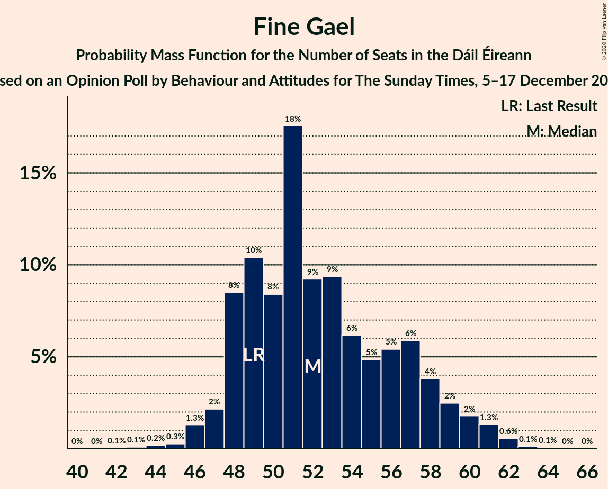
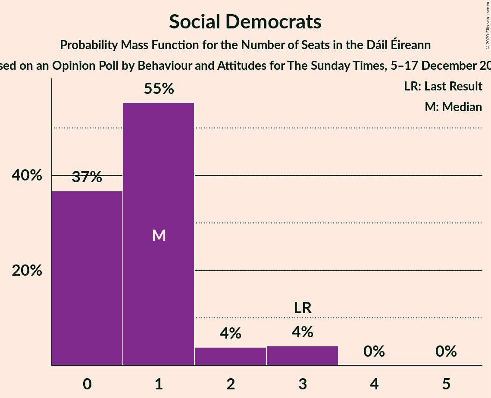

# Opinion Poll by Behaviour and Attitudes for The Sunday Times, 5–17 December 2019

<a href="#voting-intentions">Voting Intentions</a> | <a href="#seats">Seats</a> | <a href="#coalitions">Coalitions</a> | <a href="#technical-information">Technical Information</a>

## Voting Intentions

### Confidence Intervals

| Party | Last Result | Poll Result | 80% Confidence Interval | 90% Confidence Interval | 95% Confidence Interval | 99% Confidence Interval |
|:-----:|:-----------:|:-----------:|:-----------------------:|:-----------------------:|:-----------------------:|:-----------------------:|
| Fine Gael | 25.5% | 27.0% | 25.2–29.0% |24.7–29.5% |24.3–30.0% |23.4–30.9% |
| Fianna Fáil | 24.3% | 27.0% | 25.2–29.0% |24.7–29.5% |24.3–30.0% |23.4–30.9% |
| Sinn Féin | 13.8% | 20.0% | 18.4–21.7% |17.9–22.2% |17.5–22.7% |16.8–23.5% |
| Independent | 15.9% | 7.2% | 6.2–8.4% |5.9–8.7% |5.7–9.0% |5.2–9.6% |
| Labour Party | 6.6% | 6.0% | 5.1–7.1% |4.8–7.4% |4.6–7.7% |4.2–8.3% |
| Green Party/Comhaontas Glas | 2.7% | 6.0% | 5.1–7.1% |4.8–7.4% |4.6–7.7% |4.2–8.3% |
| Solidarity–People Before Profit | 3.9% | 3.0% | 2.4–3.8% |2.2–4.1% |2.1–4.3% |1.8–4.7% |
| Social Democrats | 3.0% | 1.0% | 0.7–1.5% |0.6–1.7% |0.5–1.8% |0.4–2.1% |
| Independents 4 Change | 1.5% | 0.9% | 0.6–1.4% |0.5–1.5% |0.4–1.7% |0.3–2.0% |

*Note:* The poll result column reflects the actual value used in the calculations. Published results may vary slightly, and in addition be rounded to fewer digits.

## Seats

### Confidence Intervals

| Party | Last Result | Median | 80% Confidence Interval | 90% Confidence Interval | 95% Confidence Interval | 99% Confidence Interval |
|:-----:|:-----------:|:------:|:-----------------------:|:-----------------------:|:-----------------------:|:-----------------------:|
| <a href="#fine-gael">Fine Gael</a> | 49 | 59 | 55–67 |53–68 |52–70 |48–71 |
| <a href="#fianna-fáil">Fianna Fáil</a> | 44 | 53 | 48–59 |47–60 |46–60 |44–62 |
| <a href="#sinn-féin">Sinn Féin</a> | 23 | 34 | 27–36 |25–36 |24–37 |23–40 |
| <a href="#independent">Independent</a> | 19 | 5 | 4–8 |3–11 |3–13 |3–15 |
| <a href="#labour-party">Labour Party</a> | 7 | 2 | 1–3 |0–3 |0–5 |0–8 |
| <a href="#green-party/comhaontas-glas">Green Party/Comhaontas Glas</a> | 2 | 3 | 2–5 |2–5 |2–5 |2–6 |
| <a href="#solidarity–people-before-profit">Solidarity–People Before Profit</a> | 6 | 1 | 0–5 |0–5 |0–5 |0–7 |
| <a href="#social-democrats">Social Democrats</a> | 3 | 0 | 0–2 |0–3 |0–3 |0–3 |
| <a href="#independents-4-change">Independents 4 Change</a> | 4 | 1 | 0–2 |0–2 |0–2 |0–5 |

### Fine Gael

*For a full overview of the results for this party, see the [Fine Gael](party-finegael.html) page.*

| Number of Seats | Probability | Accumulated | Special Marks |
|:---------------:|:-----------:|:-----------:|:-------------:|
| 44 | 0.1% | 100% |  |
| 45 | 0.1% | 99.9% |  |
| 46 | 0.1% | 99.8% |  |
| 47 | 0.1% | 99.7% |  |
| 48 | 0.8% | 99.6% |  |
| 49 | 0.4% | 98.8% | Last Result |
| 50 | 0.2% | 98% |  |
| 51 | 0.6% | 98% |  |
| 52 | 2% | 98% |  |
| 53 | 0.7% | 95% |  |
| 54 | 2% | 95% |  |
| 55 | 12% | 92% |  |
| 56 | 15% | 81% |  |
| 57 | 8% | 66% |  |
| 58 | 4% | 58% |  |
| 59 | 8% | 54% | Median |
| 60 | 7% | 45% |  |
| 61 | 6% | 38% |  |
| 62 | 6% | 32% |  |
| 63 | 5% | 27% |  |
| 64 | 4% | 21% |  |
| 65 | 5% | 18% |  |
| 66 | 2% | 13% |  |
| 67 | 6% | 11% |  |
| 68 | 2% | 5% |  |
| 69 | 1.0% | 4% |  |
| 70 | 0.9% | 3% |  |
| 71 | 2% | 2% |  |
| 72 | 0.1% | 0.1% |  |
| 73 | 0% | 0% |  |

### Fianna Fáil

*For a full overview of the results for this party, see the [Fianna Fáil](party-fiannafáil.html) page.*

| Number of Seats | Probability | Accumulated | Special Marks |
|:---------------:|:-----------:|:-----------:|:-------------:|
| 42 | 0.2% | 100% |  |
| 43 | 0.1% | 99.7% |  |
| 44 | 0.9% | 99.7% | Last Result |
| 45 | 1.0% | 98.8% |  |
| 46 | 1.0% | 98% |  |
| 47 | 3% | 97% |  |
| 48 | 8% | 94% |  |
| 49 | 3% | 86% |  |
| 50 | 4% | 82% |  |
| 51 | 2% | 78% |  |
| 52 | 9% | 76% |  |
| 53 | 22% | 67% | Median |
| 54 | 5% | 45% |  |
| 55 | 9% | 40% |  |
| 56 | 4% | 31% |  |
| 57 | 5% | 27% |  |
| 58 | 4% | 21% |  |
| 59 | 12% | 18% |  |
| 60 | 4% | 6% |  |
| 61 | 0.4% | 2% |  |
| 62 | 0.9% | 1.2% |  |
| 63 | 0.1% | 0.3% |  |
| 64 | 0.1% | 0.1% |  |
| 65 | 0.1% | 0.1% |  |
| 66 | 0% | 0% |  |

### Sinn Féin

*For a full overview of the results for this party, see the [Sinn Féin](party-sinnféin.html) page.*

| Number of Seats | Probability | Accumulated | Special Marks |
|:---------------:|:-----------:|:-----------:|:-------------:|
| 23 | 2% | 100% | Last Result |
| 24 | 0.7% | 98% |  |
| 25 | 3% | 97% |  |
| 26 | 1.4% | 94% |  |
| 27 | 11% | 93% |  |
| 28 | 2% | 82% |  |
| 29 | 3% | 80% |  |
| 30 | 6% | 77% |  |
| 31 | 2% | 71% |  |
| 32 | 4% | 69% |  |
| 33 | 12% | 65% |  |
| 34 | 7% | 53% | Median |
| 35 | 26% | 46% |  |
| 36 | 16% | 20% |  |
| 37 | 3% | 4% |  |
| 38 | 0.5% | 1.4% |  |
| 39 | 0.3% | 0.9% |  |
| 40 | 0.4% | 0.6% |  |
| 41 | 0% | 0.2% |  |
| 42 | 0.1% | 0.1% |  |
| 43 | 0.1% | 0.1% |  |
| 44 | 0% | 0% |  |

### Independent

*For a full overview of the results for this party, see the [Independent](party-independent.html) page.*

| Number of Seats | Probability | Accumulated | Special Marks |
|:---------------:|:-----------:|:-----------:|:-------------:|
| 3 | 5% | 100% |  |
| 4 | 36% | 95% |  |
| 5 | 15% | 58% | Median |
| 6 | 9% | 43% |  |
| 7 | 8% | 34% |  |
| 8 | 16% | 25% |  |
| 9 | 2% | 9% |  |
| 10 | 1.0% | 8% |  |
| 11 | 2% | 7% |  |
| 12 | 1.1% | 4% |  |
| 13 | 2% | 3% |  |
| 14 | 0.1% | 1.0% |  |
| 15 | 0.5% | 0.9% |  |
| 16 | 0.4% | 0.4% |  |
| 17 | 0% | 0% |  |
| 18 | 0% | 0% |  |
| 19 | 0% | 0% | Last Result |

### Labour Party

*For a full overview of the results for this party, see the [Labour Party](party-labourparty.html) page.*

| Number of Seats | Probability | Accumulated | Special Marks |
|:---------------:|:-----------:|:-----------:|:-------------:|
| 0 | 8% | 100% |  |
| 1 | 7% | 92% |  |
| 2 | 69% | 85% | Median |
| 3 | 12% | 16% |  |
| 4 | 1.0% | 4% |  |
| 5 | 2% | 3% |  |
| 6 | 0.1% | 1.0% |  |
| 7 | 0.2% | 1.0% | Last Result |
| 8 | 0.4% | 0.8% |  |
| 9 | 0.2% | 0.3% |  |
| 10 | 0.1% | 0.1% |  |
| 11 | 0.1% | 0.1% |  |
| 12 | 0% | 0% |  |

### Green Party/Comhaontas Glas

*For a full overview of the results for this party, see the [Green Party/Comhaontas Glas](party-greenpartycomhaontasglas.html) page.*

| Number of Seats | Probability | Accumulated | Special Marks |
|:---------------:|:-----------:|:-----------:|:-------------:|
| 1 | 0.3% | 100% |  |
| 2 | 31% | 99.7% | Last Result |
| 3 | 21% | 69% | Median |
| 4 | 18% | 48% |  |
| 5 | 29% | 30% |  |
| 6 | 1.2% | 1.3% |  |
| 7 | 0.1% | 0.1% |  |
| 8 | 0% | 0% |  |

### Solidarity–People Before Profit

*For a full overview of the results for this party, see the [Solidarity–People Before Profit](party-solidarity–peoplebeforeprofit.html) page.*

| Number of Seats | Probability | Accumulated | Special Marks |
|:---------------:|:-----------:|:-----------:|:-------------:|
| 0 | 13% | 100% |  |
| 1 | 49% | 87% | Median |
| 2 | 15% | 38% |  |
| 3 | 9% | 23% |  |
| 4 | 1.3% | 13% |  |
| 5 | 11% | 12% |  |
| 6 | 0.3% | 0.8% | Last Result |
| 7 | 0.3% | 0.5% |  |
| 8 | 0.2% | 0.2% |  |
| 9 | 0% | 0% |  |

### Social Democrats

*For a full overview of the results for this party, see the [Social Democrats](party-socialdemocrats.html) page.*

| Number of Seats | Probability | Accumulated | Special Marks |
|:---------------:|:-----------:|:-----------:|:-------------:|
| 0 | 76% | 100% | Median |
| 1 | 12% | 24% |  |
| 2 | 6% | 13% |  |
| 3 | 6% | 6% | Last Result |
| 4 | 0% | 0% |  |

### Independents 4 Change

*For a full overview of the results for this party, see the [Independents 4 Change](party-independents4change.html) page.*

| Number of Seats | Probability | Accumulated | Special Marks |
|:---------------:|:-----------:|:-----------:|:-------------:|
| 0 | 48% | 100% |  |
| 1 | 37% | 52% | Median |
| 2 | 13% | 15% |  |
| 3 | 0.5% | 2% |  |
| 4 | 0.3% | 1.4% | Last Result |
| 5 | 1.2% | 1.2% |  |
| 6 | 0% | 0% |  |

## Coalitions

### Confidence Intervals

| Coalition | Last Result | Median | Majority? | 80% Confidence Interval | 90% Confidence Interval | 95% Confidence Interval | 99% Confidence Interval |
|:---------:|:-----------:|:------:|:---------:|:-----------------------:|:-----------------------:|:-----------------------:|:-----------------------:|
| Fianna Fáil – Fine Gael | 93 | 113 | 100% | 109–119 | 107–119 | 105–123 | 102–123 |
| Fianna Fáil – Sinn Féin | 67 | 87 | 81% | 79–95 | 78–95 | 77–95 | 75–98 |
| Fine Gael – Green Party/Comhaontas Glas – Labour Party – Social Democrats | 61 | 65 | 0% | 60–72 | 59–73 | 58–76 | 53–78 |
| Fine Gael – Green Party/Comhaontas Glas – Labour Party | 58 | 65 | 0% | 59–72 | 58–73 | 56–75 | 52–78 |
| Fine Gael – Green Party/Comhaontas Glas | 51 | 63 | 0% | 57–70 | 56–71 | 54–73 | 51–75 |
| Fine Gael – Labour Party | 56 | 61 | 0% | 57–69 | 55–71 | 53–71 | 50–73 |
| Fine Gael | 49 | 59 | 0% | 55–67 | 53–68 | 52–70 | 48–71 |
| Fianna Fáil – Green Party/Comhaontas Glas – Labour Party – Social Democrats | 56 | 60 | 0% | 54–64 | 51–65 | 51–65 | 48–68 |
| Fianna Fáil – Green Party/Comhaontas Glas – Labour Party | 53 | 60 | 0% | 54–64 | 51–64 | 50–65 | 48–67 |
| Fianna Fáil – Green Party/Comhaontas Glas | 46 | 58 | 0% | 52–62 | 49–62 | 49–63 | 46–65 |
| Fianna Fáil – Labour Party | 51 | 55 | 0% | 50–61 | 49–62 | 47–62 | 46–64 |

### Fianna Fáil – Fine Gael

| Number of Seats | Probability | Accumulated | Special Marks |
|:---------------:|:-----------:|:-----------:|:-------------:|
| 93 | 0% | 100% | Last Result |
| 94 | 0% | 100% |  |
| 95 | 0% | 100% |  |
| 96 | 0% | 100% |  |
| 97 | 0% | 100% |  |
| 98 | 0% | 100% |  |
| 99 | 0.1% | 100% |  |
| 100 | 0.1% | 99.9% |  |
| 101 | 0.1% | 99.8% |  |
| 102 | 0.3% | 99.7% |  |
| 103 | 0.3% | 99.3% |  |
| 104 | 1.3% | 99.0% |  |
| 105 | 0.4% | 98% |  |
| 106 | 1.2% | 97% |  |
| 107 | 3% | 96% |  |
| 108 | 0.9% | 93% |  |
| 109 | 14% | 92% |  |
| 110 | 6% | 79% |  |
| 111 | 5% | 73% |  |
| 112 | 12% | 68% | Median |
| 113 | 10% | 56% |  |
| 114 | 15% | 46% |  |
| 115 | 5% | 31% |  |
| 116 | 3% | 26% |  |
| 117 | 6% | 23% |  |
| 118 | 6% | 17% |  |
| 119 | 6% | 11% |  |
| 120 | 0.7% | 5% |  |
| 121 | 0.8% | 4% |  |
| 122 | 0.2% | 3% |  |
| 123 | 3% | 3% |  |
| 124 | 0% | 0.1% |  |
| 125 | 0% | 0.1% |  |
| 126 | 0% | 0.1% |  |
| 127 | 0.1% | 0.1% |  |
| 128 | 0% | 0% |  |

### Fianna Fáil – Sinn Féin

| Number of Seats | Probability | Accumulated | Special Marks |
|:---------------:|:-----------:|:-----------:|:-------------:|
| 67 | 0% | 100% | Last Result |
| 68 | 0% | 100% |  |
| 69 | 0% | 100% |  |
| 70 | 0% | 100% |  |
| 71 | 0% | 100% |  |
| 72 | 0% | 100% |  |
| 73 | 0.2% | 100% |  |
| 74 | 0.2% | 99.8% |  |
| 75 | 0.3% | 99.6% |  |
| 76 | 1.3% | 99.3% |  |
| 77 | 2% | 98% |  |
| 78 | 4% | 96% |  |
| 79 | 8% | 92% |  |
| 80 | 2% | 84% |  |
| 81 | 6% | 81% | Majority |
| 82 | 7% | 75% |  |
| 83 | 5% | 69% |  |
| 84 | 4% | 64% |  |
| 85 | 3% | 60% |  |
| 86 | 6% | 57% |  |
| 87 | 1.3% | 50% | Median |
| 88 | 21% | 49% |  |
| 89 | 3% | 28% |  |
| 90 | 0.7% | 26% |  |
| 91 | 3% | 25% |  |
| 92 | 5% | 22% |  |
| 93 | 4% | 18% |  |
| 94 | 2% | 13% |  |
| 95 | 10% | 12% |  |
| 96 | 0.2% | 1.3% |  |
| 97 | 0.6% | 1.1% |  |
| 98 | 0.3% | 0.5% |  |
| 99 | 0.1% | 0.2% |  |
| 100 | 0% | 0.1% |  |
| 101 | 0% | 0.1% |  |
| 102 | 0% | 0% |  |

### Fine Gael – Green Party/Comhaontas Glas – Labour Party – Social Democrats

| Number of Seats | Probability | Accumulated | Special Marks |
|:---------------:|:-----------:|:-----------:|:-------------:|
| 49 | 0% | 100% |  |
| 50 | 0.1% | 99.9% |  |
| 51 | 0% | 99.8% |  |
| 52 | 0.2% | 99.8% |  |
| 53 | 0.3% | 99.6% |  |
| 54 | 0.7% | 99.4% |  |
| 55 | 0.4% | 98.7% |  |
| 56 | 0.4% | 98% |  |
| 57 | 0.3% | 98% |  |
| 58 | 2% | 98% |  |
| 59 | 3% | 96% |  |
| 60 | 10% | 93% |  |
| 61 | 7% | 82% | Last Result |
| 62 | 4% | 75% |  |
| 63 | 14% | 71% |  |
| 64 | 2% | 57% | Median |
| 65 | 12% | 55% |  |
| 66 | 5% | 43% |  |
| 67 | 3% | 38% |  |
| 68 | 1.2% | 34% |  |
| 69 | 6% | 33% |  |
| 70 | 9% | 27% |  |
| 71 | 4% | 19% |  |
| 72 | 7% | 15% |  |
| 73 | 3% | 7% |  |
| 74 | 1.4% | 4% |  |
| 75 | 0.3% | 3% |  |
| 76 | 2% | 3% |  |
| 77 | 0.2% | 0.9% |  |
| 78 | 0.5% | 0.7% |  |
| 79 | 0.1% | 0.2% |  |
| 80 | 0% | 0% |  |

### Fine Gael – Green Party/Comhaontas Glas – Labour Party

| Number of Seats | Probability | Accumulated | Special Marks |
|:---------------:|:-----------:|:-----------:|:-------------:|
| 48 | 0% | 100% |  |
| 49 | 0% | 99.9% |  |
| 50 | 0.1% | 99.9% |  |
| 51 | 0.2% | 99.8% |  |
| 52 | 0.2% | 99.6% |  |
| 53 | 0.7% | 99.5% |  |
| 54 | 0.2% | 98.8% |  |
| 55 | 0.4% | 98.5% |  |
| 56 | 1.4% | 98% |  |
| 57 | 1.0% | 97% |  |
| 58 | 1.3% | 96% | Last Result |
| 59 | 12% | 94% |  |
| 60 | 0.8% | 82% |  |
| 61 | 8% | 82% |  |
| 62 | 4% | 73% |  |
| 63 | 13% | 69% |  |
| 64 | 2% | 56% | Median |
| 65 | 12% | 53% |  |
| 66 | 5% | 41% |  |
| 67 | 2% | 36% |  |
| 68 | 5% | 33% |  |
| 69 | 6% | 29% |  |
| 70 | 7% | 23% |  |
| 71 | 4% | 16% |  |
| 72 | 7% | 12% |  |
| 73 | 2% | 6% |  |
| 74 | 1.3% | 4% |  |
| 75 | 0.3% | 3% |  |
| 76 | 1.5% | 2% |  |
| 77 | 0.2% | 0.8% |  |
| 78 | 0.5% | 0.7% |  |
| 79 | 0.2% | 0.2% |  |
| 80 | 0% | 0% |  |

### Fine Gael – Green Party/Comhaontas Glas

| Number of Seats | Probability | Accumulated | Special Marks |
|:---------------:|:-----------:|:-----------:|:-------------:|
| 46 | 0.1% | 100% |  |
| 47 | 0% | 99.9% |  |
| 48 | 0.1% | 99.9% |  |
| 49 | 0.1% | 99.8% |  |
| 50 | 0.1% | 99.7% |  |
| 51 | 0.8% | 99.6% | Last Result |
| 52 | 0.1% | 98.7% |  |
| 53 | 0.4% | 98.6% |  |
| 54 | 2% | 98% |  |
| 55 | 0.3% | 96% |  |
| 56 | 1.3% | 96% |  |
| 57 | 12% | 95% |  |
| 58 | 2% | 83% |  |
| 59 | 8% | 81% |  |
| 60 | 2% | 72% |  |
| 61 | 14% | 70% |  |
| 62 | 3% | 56% | Median |
| 63 | 14% | 53% |  |
| 64 | 4% | 39% |  |
| 65 | 1.3% | 35% |  |
| 66 | 6% | 34% |  |
| 67 | 6% | 28% |  |
| 68 | 5% | 21% |  |
| 69 | 4% | 17% |  |
| 70 | 7% | 13% |  |
| 71 | 2% | 6% |  |
| 72 | 1.1% | 4% |  |
| 73 | 0.9% | 3% |  |
| 74 | 1.1% | 2% |  |
| 75 | 0% | 0.5% |  |
| 76 | 0.5% | 0.5% |  |
| 77 | 0% | 0% |  |

### Fine Gael – Labour Party

| Number of Seats | Probability | Accumulated | Special Marks |
|:---------------:|:-----------:|:-----------:|:-------------:|
| 45 | 0% | 100% |  |
| 46 | 0.1% | 99.9% |  |
| 47 | 0% | 99.9% |  |
| 48 | 0.2% | 99.8% |  |
| 49 | 0.1% | 99.6% |  |
| 50 | 0.7% | 99.5% |  |
| 51 | 0.5% | 98.8% |  |
| 52 | 0.2% | 98% |  |
| 53 | 0.9% | 98% |  |
| 54 | 2% | 97% |  |
| 55 | 1.0% | 96% |  |
| 56 | 1.3% | 95% | Last Result |
| 57 | 13% | 93% |  |
| 58 | 14% | 80% |  |
| 59 | 9% | 66% |  |
| 60 | 3% | 57% |  |
| 61 | 7% | 54% | Median |
| 62 | 9% | 47% |  |
| 63 | 2% | 37% |  |
| 64 | 8% | 36% |  |
| 65 | 5% | 27% |  |
| 66 | 6% | 23% |  |
| 67 | 4% | 16% |  |
| 68 | 2% | 13% |  |
| 69 | 5% | 11% |  |
| 70 | 0.9% | 6% |  |
| 71 | 4% | 5% |  |
| 72 | 0.4% | 1.2% |  |
| 73 | 0.6% | 0.8% |  |
| 74 | 0.1% | 0.3% |  |
| 75 | 0% | 0.2% |  |
| 76 | 0% | 0.2% |  |
| 77 | 0.1% | 0.1% |  |
| 78 | 0% | 0% |  |

### Fine Gael

| Number of Seats | Probability | Accumulated | Special Marks |
|:---------------:|:-----------:|:-----------:|:-------------:|
| 44 | 0.1% | 100% |  |
| 45 | 0.1% | 99.9% |  |
| 46 | 0.1% | 99.8% |  |
| 47 | 0.1% | 99.7% |  |
| 48 | 0.8% | 99.6% |  |
| 49 | 0.4% | 98.8% | Last Result |
| 50 | 0.2% | 98% |  |
| 51 | 0.6% | 98% |  |
| 52 | 2% | 98% |  |
| 53 | 0.7% | 95% |  |
| 54 | 2% | 95% |  |
| 55 | 12% | 92% |  |
| 56 | 15% | 81% |  |
| 57 | 8% | 66% |  |
| 58 | 4% | 58% |  |
| 59 | 8% | 54% | Median |
| 60 | 7% | 45% |  |
| 61 | 6% | 38% |  |
| 62 | 6% | 32% |  |
| 63 | 5% | 27% |  |
| 64 | 4% | 21% |  |
| 65 | 5% | 18% |  |
| 66 | 2% | 13% |  |
| 67 | 6% | 11% |  |
| 68 | 2% | 5% |  |
| 69 | 1.0% | 4% |  |
| 70 | 0.9% | 3% |  |
| 71 | 2% | 2% |  |
| 72 | 0.1% | 0.1% |  |
| 73 | 0% | 0% |  |

### Fianna Fáil – Green Party/Comhaontas Glas – Labour Party – Social Democrats

| Number of Seats | Probability | Accumulated | Special Marks |
|:---------------:|:-----------:|:-----------:|:-------------:|
| 47 | 0.2% | 100% |  |
| 48 | 0.9% | 99.8% |  |
| 49 | 0.9% | 98.9% |  |
| 50 | 0.4% | 98% |  |
| 51 | 3% | 98% |  |
| 52 | 0.3% | 95% |  |
| 53 | 0.9% | 94% |  |
| 54 | 4% | 93% |  |
| 55 | 3% | 90% |  |
| 56 | 6% | 86% | Last Result |
| 57 | 6% | 81% |  |
| 58 | 12% | 75% | Median |
| 59 | 7% | 63% |  |
| 60 | 14% | 56% |  |
| 61 | 7% | 42% |  |
| 62 | 8% | 35% |  |
| 63 | 3% | 26% |  |
| 64 | 18% | 23% |  |
| 65 | 3% | 6% |  |
| 66 | 0.9% | 2% |  |
| 67 | 0.4% | 1.4% |  |
| 68 | 0.7% | 0.9% |  |
| 69 | 0.1% | 0.2% |  |
| 70 | 0.1% | 0.1% |  |
| 71 | 0% | 0% |  |

### Fianna Fáil – Green Party/Comhaontas Glas – Labour Party

| Number of Seats | Probability | Accumulated | Special Marks |
|:---------------:|:-----------:|:-----------:|:-------------:|
| 46 | 0.1% | 100% |  |
| 47 | 0.2% | 99.9% |  |
| 48 | 0.8% | 99.7% |  |
| 49 | 0.9% | 98.8% |  |
| 50 | 0.4% | 98% |  |
| 51 | 3% | 97% |  |
| 52 | 1.5% | 94% |  |
| 53 | 1.0% | 93% | Last Result |
| 54 | 7% | 92% |  |
| 55 | 5% | 85% |  |
| 56 | 3% | 80% |  |
| 57 | 6% | 77% |  |
| 58 | 10% | 70% | Median |
| 59 | 6% | 60% |  |
| 60 | 14% | 54% |  |
| 61 | 7% | 40% |  |
| 62 | 8% | 34% |  |
| 63 | 13% | 26% |  |
| 64 | 9% | 13% |  |
| 65 | 3% | 5% |  |
| 66 | 0.9% | 2% |  |
| 67 | 0.8% | 1.1% |  |
| 68 | 0.1% | 0.2% |  |
| 69 | 0.1% | 0.2% |  |
| 70 | 0.1% | 0.1% |  |
| 71 | 0% | 0% |  |

### Fianna Fáil – Green Party/Comhaontas Glas

| Number of Seats | Probability | Accumulated | Special Marks |
|:---------------:|:-----------:|:-----------:|:-------------:|
| 45 | 0.2% | 100% |  |
| 46 | 0.8% | 99.8% | Last Result |
| 47 | 0.1% | 98.9% |  |
| 48 | 0.9% | 98.8% |  |
| 49 | 3% | 98% |  |
| 50 | 1.1% | 95% |  |
| 51 | 1.2% | 94% |  |
| 52 | 9% | 93% |  |
| 53 | 3% | 84% |  |
| 54 | 2% | 81% |  |
| 55 | 9% | 79% |  |
| 56 | 11% | 70% | Median |
| 57 | 5% | 59% |  |
| 58 | 14% | 54% |  |
| 59 | 7% | 39% |  |
| 60 | 7% | 32% |  |
| 61 | 12% | 24% |  |
| 62 | 8% | 12% |  |
| 63 | 3% | 4% |  |
| 64 | 0.6% | 1.3% |  |
| 65 | 0.6% | 0.8% |  |
| 66 | 0.1% | 0.2% |  |
| 67 | 0.1% | 0.1% |  |
| 68 | 0% | 0% |  |

### Fianna Fáil – Labour Party

| Number of Seats | Probability | Accumulated | Special Marks |
|:---------------:|:-----------:|:-----------:|:-------------:|
| 44 | 0.3% | 100% |  |
| 45 | 0.1% | 99.6% |  |
| 46 | 0.9% | 99.5% |  |
| 47 | 2% | 98.6% |  |
| 48 | 0.9% | 97% |  |
| 49 | 3% | 96% |  |
| 50 | 6% | 93% |  |
| 51 | 5% | 87% | Last Result |
| 52 | 4% | 82% |  |
| 53 | 2% | 78% |  |
| 54 | 8% | 76% |  |
| 55 | 25% | 68% | Median |
| 56 | 3% | 44% |  |
| 57 | 7% | 41% |  |
| 58 | 6% | 34% |  |
| 59 | 6% | 28% |  |
| 60 | 4% | 22% |  |
| 61 | 12% | 18% |  |
| 62 | 5% | 7% |  |
| 63 | 0.4% | 2% |  |
| 64 | 1.0% | 1.4% |  |
| 65 | 0.2% | 0.3% |  |
| 66 | 0% | 0.2% |  |
| 67 | 0.1% | 0.1% |  |
| 68 | 0% | 0% |  |

## Technical Information

### Opinion Poll

+ **Polling firm:** Behaviour and Attitudes
+ **Commissioner(s):** The Sunday Times
+ **Fieldwork period:** 5–17 December 2019

### Calculations

+ **Sample size:** 936
+ **Simulations done:** 131,072
+ **Error estimate:** 3.02%

