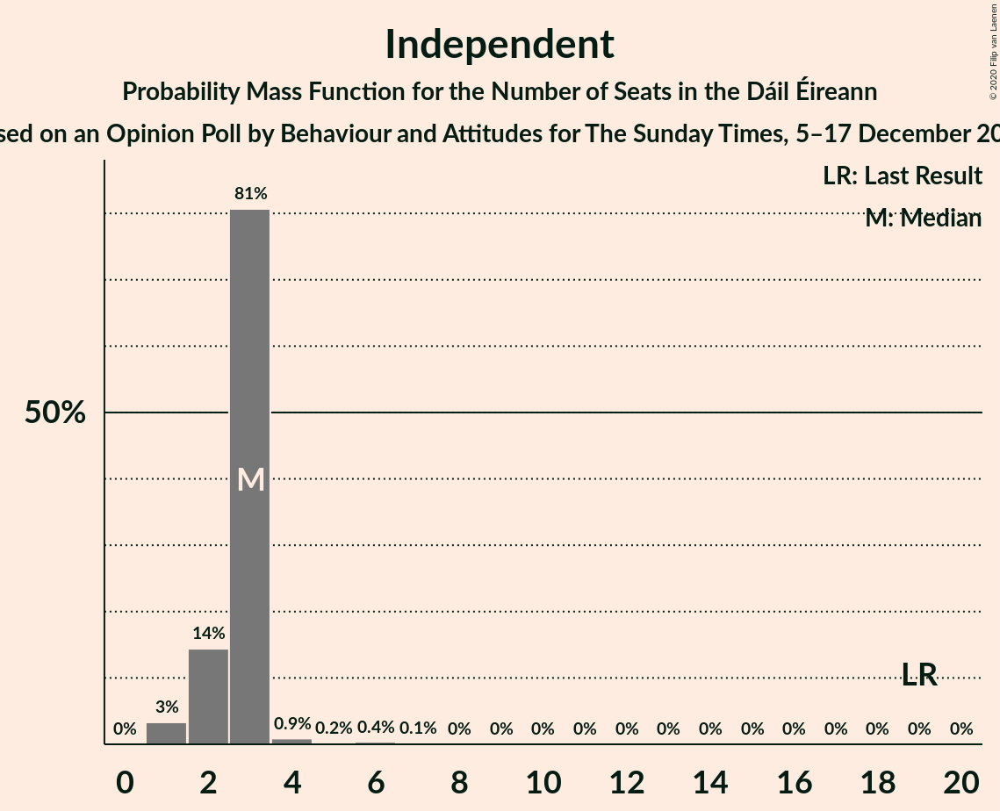
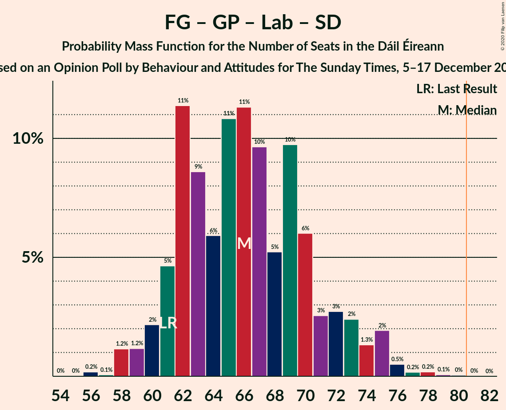

# Opinion Poll by Behaviour and Attitudes for The Sunday Times, 5–17 December 2019

<a href="#voting-intentions">Voting Intentions</a> | <a href="#seats">Seats</a> | <a href="#coalitions">Coalitions</a> | <a href="#technical-information">Technical Information</a>

## Voting Intentions

### Confidence Intervals

| Party | Last Result | Poll Result | 80% Confidence Interval | 90% Confidence Interval | 95% Confidence Interval | 99% Confidence Interval |
|:-----:|:-----------:|:-----------:|:-----------------------:|:-----------------------:|:-----------------------:|:-----------------------:|
| Fine Gael | 25.5% | 27.0% | 25.2–29.0% |24.7–29.5% |24.3–30.0% |23.4–30.9% |
| Fianna Fáil | 24.3% | 27.0% | 25.2–29.0% |24.7–29.5% |24.3–30.0% |23.4–30.9% |
| Sinn Féin | 13.8% | 20.0% | 18.4–21.7% |17.9–22.2% |17.5–22.7% |16.8–23.5% |
| Independent | 15.9% | 6.7% | 5.8–7.9% |5.5–8.2% |5.3–8.5% |4.9–9.1% |
| Labour Party | 6.6% | 6.0% | 5.1–7.1% |4.8–7.4% |4.6–7.7% |4.2–8.3% |
| Green Party/Comhaontas Glas | 2.7% | 6.0% | 5.1–7.1% |4.8–7.4% |4.6–7.7% |4.2–8.3% |
| Solidarity–People Before Profit | 3.9% | 3.0% | 2.4–3.8% |2.2–4.1% |2.1–4.3% |1.8–4.7% |
| Social Democrats | 3.0% | 1.0% | 0.7–1.5% |0.6–1.7% |0.5–1.8% |0.4–2.1% |
| Independents 4 Change | 1.5% | 0.9% | 0.6–1.4% |0.5–1.5% |0.4–1.7% |0.3–2.0% |

*Note:* The poll result column reflects the actual value used in the calculations. Published results may vary slightly, and in addition be rounded to fewer digits.

## Seats

### Confidence Intervals

| Party | Last Result | Median | 80% Confidence Interval | 90% Confidence Interval | 95% Confidence Interval | 99% Confidence Interval |
|:-----:|:-----------:|:------:|:-----------------------:|:-----------------------:|:-----------------------:|:-----------------------:|
| <a href="#fine-gael">Fine Gael</a> | 49 | 52 | 46–57 |45–58 |42–59 |41–62 |
| <a href="#fianna-fáil">Fianna Fáil</a> | 44 | 51 | 48–55 |46–56 |46–57 |42–58 |
| <a href="#sinn-féin">Sinn Féin</a> | 23 | 38 | 35–41 |34–42 |34–42 |32–44 |
| <a href="#independent">Independent</a> | 19 | 3 | 2–3 |2–3 |1–4 |1–5 |
| <a href="#labour-party">Labour Party</a> | 7 | 6 | 2–8 |2–9 |1–11 |1–15 |
| <a href="#green-party/comhaontas-glas">Green Party/Comhaontas Glas</a> | 2 | 5 | 3–7 |3–8 |3–8 |2–9 |
| <a href="#solidarity–people-before-profit">Solidarity–People Before Profit</a> | 6 | 3 | 0–5 |0–5 |0–6 |0–9 |
| <a href="#social-democrats">Social Democrats</a> | 3 | 0 | 0–3 |0–3 |0–3 |0–3 |
| <a href="#independents-4-change">Independents 4 Change</a> | 4 | 0 | 0–4 |0–4 |0–4 |0–4 |

### Fine Gael

*For a full overview of the results for this party, see the [Fine Gael](party-finegael.html) page.*

| Number of Seats | Probability | Accumulated | Special Marks |
|:---------------:|:-----------:|:-----------:|:-------------:|
| 38 | 0.1% | 100% |  |
| 39 | 0.1% | 99.9% |  |
| 40 | 0.2% | 99.8% |  |
| 41 | 0.2% | 99.6% |  |
| 42 | 2% | 99.4% |  |
| 43 | 1.3% | 97% |  |
| 44 | 1.1% | 96% |  |
| 45 | 5% | 95% |  |
| 46 | 4% | 90% |  |
| 47 | 6% | 87% |  |
| 48 | 8% | 81% |  |
| 49 | 10% | 72% | Last Result |
| 50 | 5% | 62% |  |
| 51 | 7% | 57% |  |
| 52 | 5% | 50% | Median |
| 53 | 7% | 45% |  |
| 54 | 6% | 38% |  |
| 55 | 12% | 32% |  |
| 56 | 5% | 19% |  |
| 57 | 6% | 15% |  |
| 58 | 5% | 9% |  |
| 59 | 2% | 4% |  |
| 60 | 0.8% | 2% |  |
| 61 | 0.3% | 1.0% |  |
| 62 | 0.4% | 0.7% |  |
| 63 | 0.1% | 0.3% |  |
| 64 | 0.1% | 0.2% |  |
| 65 | 0.1% | 0.1% |  |
| 66 | 0% | 0% |  |

### Fianna Fáil

*For a full overview of the results for this party, see the [Fianna Fáil](party-fiannafáil.html) page.*

| Number of Seats | Probability | Accumulated | Special Marks |
|:---------------:|:-----------:|:-----------:|:-------------:|
| 40 | 0.1% | 100% |  |
| 41 | 0.2% | 99.9% |  |
| 42 | 0.2% | 99.7% |  |
| 43 | 0.5% | 99.5% |  |
| 44 | 0.4% | 99.0% | Last Result |
| 45 | 0.7% | 98.6% |  |
| 46 | 3% | 98% |  |
| 47 | 5% | 95% |  |
| 48 | 4% | 90% |  |
| 49 | 10% | 86% |  |
| 50 | 15% | 77% |  |
| 51 | 16% | 62% | Median |
| 52 | 11% | 45% |  |
| 53 | 7% | 35% |  |
| 54 | 14% | 28% |  |
| 55 | 6% | 14% |  |
| 56 | 5% | 8% |  |
| 57 | 2% | 3% |  |
| 58 | 1.2% | 1.2% |  |
| 59 | 0.1% | 0.1% |  |
| 60 | 0% | 0% |  |

### Sinn Féin

*For a full overview of the results for this party, see the [Sinn Féin](party-sinnféin.html) page.*

| Number of Seats | Probability | Accumulated | Special Marks |
|:---------------:|:-----------:|:-----------:|:-------------:|
| 23 | 0% | 100% | Last Result |
| 24 | 0% | 100% |  |
| 25 | 0% | 100% |  |
| 26 | 0% | 100% |  |
| 27 | 0% | 100% |  |
| 28 | 0% | 100% |  |
| 29 | 0% | 100% |  |
| 30 | 0% | 100% |  |
| 31 | 0.1% | 99.9% |  |
| 32 | 0.4% | 99.8% |  |
| 33 | 1.1% | 99.4% |  |
| 34 | 6% | 98% |  |
| 35 | 18% | 93% |  |
| 36 | 8% | 75% |  |
| 37 | 6% | 67% |  |
| 38 | 12% | 61% | Median |
| 39 | 17% | 49% |  |
| 40 | 15% | 32% |  |
| 41 | 9% | 16% |  |
| 42 | 5% | 7% |  |
| 43 | 2% | 2% |  |
| 44 | 0.4% | 0.8% |  |
| 45 | 0.3% | 0.3% |  |
| 46 | 0% | 0.1% |  |
| 47 | 0% | 0% |  |

### Independent

*For a full overview of the results for this party, see the [Independent](party-independent.html) page.*

| Number of Seats | Probability | Accumulated | Special Marks |
|:---------------:|:-----------:|:-----------:|:-------------:|
| 0 | 0.2% | 100% |  |
| 1 | 3% | 99.8% |  |
| 2 | 8% | 97% |  |
| 3 | 86% | 89% | Median |
| 4 | 3% | 4% |  |
| 5 | 0.8% | 0.9% |  |
| 6 | 0.1% | 0.1% |  |
| 7 | 0% | 0% |  |
| 8 | 0% | 0% |  |
| 9 | 0% | 0% |  |
| 10 | 0% | 0% |  |
| 11 | 0% | 0% |  |
| 12 | 0% | 0% |  |
| 13 | 0% | 0% |  |
| 14 | 0% | 0% |  |
| 15 | 0% | 0% |  |
| 16 | 0% | 0% |  |
| 17 | 0% | 0% |  |
| 18 | 0% | 0% |  |
| 19 | 0% | 0% | Last Result |

### Labour Party

*For a full overview of the results for this party, see the [Labour Party](party-labourparty.html) page.*

| Number of Seats | Probability | Accumulated | Special Marks |
|:---------------:|:-----------:|:-----------:|:-------------:|
| 0 | 0.1% | 100% |  |
| 1 | 3% | 99.9% |  |
| 2 | 8% | 97% |  |
| 3 | 5% | 89% |  |
| 4 | 7% | 84% |  |
| 5 | 16% | 76% |  |
| 6 | 15% | 60% | Median |
| 7 | 20% | 45% | Last Result |
| 8 | 18% | 25% |  |
| 9 | 3% | 7% |  |
| 10 | 2% | 5% |  |
| 11 | 0.5% | 3% |  |
| 12 | 0.5% | 2% |  |
| 13 | 0.3% | 2% |  |
| 14 | 0.6% | 1.3% |  |
| 15 | 0.5% | 0.8% |  |
| 16 | 0.2% | 0.3% |  |
| 17 | 0% | 0.1% |  |
| 18 | 0% | 0% |  |

### Green Party/Comhaontas Glas

*For a full overview of the results for this party, see the [Green Party/Comhaontas Glas](party-greenpartycomhaontasglas.html) page.*

| Number of Seats | Probability | Accumulated | Special Marks |
|:---------------:|:-----------:|:-----------:|:-------------:|
| 2 | 1.4% | 100% | Last Result |
| 3 | 16% | 98.6% |  |
| 4 | 21% | 82% |  |
| 5 | 31% | 61% | Median |
| 6 | 6% | 30% |  |
| 7 | 18% | 24% |  |
| 8 | 4% | 5% |  |
| 9 | 0.8% | 1.0% |  |
| 10 | 0.1% | 0.2% |  |
| 11 | 0.1% | 0.1% |  |
| 12 | 0% | 0% |  |

### Solidarity–People Before Profit

*For a full overview of the results for this party, see the [Solidarity–People Before Profit](party-solidarity–peoplebeforeprofit.html) page.*

| Number of Seats | Probability | Accumulated | Special Marks |
|:---------------:|:-----------:|:-----------:|:-------------:|
| 0 | 11% | 100% |  |
| 1 | 6% | 89% |  |
| 2 | 25% | 84% |  |
| 3 | 26% | 59% | Median |
| 4 | 15% | 33% |  |
| 5 | 14% | 18% |  |
| 6 | 2% | 4% | Last Result |
| 7 | 0.8% | 2% |  |
| 8 | 0.4% | 0.9% |  |
| 9 | 0.6% | 0.6% |  |
| 10 | 0% | 0% |  |

### Social Democrats

*For a full overview of the results for this party, see the [Social Democrats](party-socialdemocrats.html) page.*

| Number of Seats | Probability | Accumulated | Special Marks |
|:---------------:|:-----------:|:-----------:|:-------------:|
| 0 | 60% | 100% | Median |
| 1 | 12% | 40% |  |
| 2 | 16% | 28% |  |
| 3 | 12% | 12% | Last Result |
| 4 | 0.2% | 0.2% |  |
| 5 | 0% | 0% |  |

### Independents 4 Change

*For a full overview of the results for this party, see the [Independents 4 Change](party-independents4change.html) page.*

| Number of Seats | Probability | Accumulated | Special Marks |
|:---------------:|:-----------:|:-----------:|:-------------:|
| 0 | 68% | 100% | Median |
| 1 | 11% | 32% |  |
| 2 | 2% | 22% |  |
| 3 | 6% | 19% |  |
| 4 | 13% | 13% | Last Result |
| 5 | 0.2% | 0.2% |  |
| 6 | 0% | 0% |  |

## Coalitions

### Confidence Intervals

| Coalition | Last Result | Median | Majority? | 80% Confidence Interval | 90% Confidence Interval | 95% Confidence Interval | 99% Confidence Interval |
|:---------:|:-----------:|:------:|:---------:|:-----------------------:|:-----------------------:|:-----------------------:|:-----------------------:|
| Fianna Fáil – Fine Gael | 93 | 103 | 100% | 98–108 | 96–109 | 96–110 | 92–111 |
| Fianna Fáil – Sinn Féin | 67 | 89 | 98% | 84–95 | 82–96 | 81–97 | 79–99 |
| Fine Gael – Green Party/Comhaontas Glas – Labour Party – Social Democrats | 61 | 63 | 0% | 57–69 | 56–70 | 54–72 | 53–74 |
| Fianna Fáil – Green Party/Comhaontas Glas – Labour Party – Social Democrats | 56 | 62 | 0% | 59–68 | 57–69 | 56–70 | 54–73 |
| Fine Gael – Green Party/Comhaontas Glas – Labour Party | 58 | 63 | 0% | 57–68 | 56–70 | 54–70 | 52–74 |
| Fianna Fáil – Green Party/Comhaontas Glas – Labour Party | 53 | 62 | 0% | 58–67 | 57–68 | 56–69 | 53–71 |
| Fine Gael – Labour Party | 56 | 57 | 0% | 51–63 | 50–65 | 49–66 | 46–69 |
| Fine Gael – Green Party/Comhaontas Glas | 51 | 57 | 0% | 51–62 | 50–63 | 49–64 | 47–67 |
| Fianna Fáil – Labour Party | 51 | 57 | 0% | 53–61 | 52–62 | 51–63 | 48–65 |
| Fianna Fáil – Green Party/Comhaontas Glas | 46 | 56 | 0% | 52–61 | 51–62 | 50–63 | 47–65 |
| Fine Gael | 49 | 52 | 0% | 46–57 | 45–58 | 42–59 | 41–62 |

### Fianna Fáil – Fine Gael

| Number of Seats | Probability | Accumulated | Special Marks |
|:---------------:|:-----------:|:-----------:|:-------------:|
| 88 | 0% | 100% |  |
| 89 | 0.1% | 99.9% |  |
| 90 | 0.2% | 99.9% |  |
| 91 | 0.1% | 99.7% |  |
| 92 | 0.3% | 99.6% |  |
| 93 | 0.6% | 99.4% | Last Result |
| 94 | 0.3% | 98.7% |  |
| 95 | 0.9% | 98% |  |
| 96 | 3% | 98% |  |
| 97 | 4% | 94% |  |
| 98 | 3% | 90% |  |
| 99 | 6% | 87% |  |
| 100 | 6% | 81% |  |
| 101 | 7% | 75% |  |
| 102 | 7% | 67% |  |
| 103 | 17% | 60% | Median |
| 104 | 6% | 42% |  |
| 105 | 10% | 36% |  |
| 106 | 11% | 26% |  |
| 107 | 4% | 15% |  |
| 108 | 4% | 11% |  |
| 109 | 3% | 7% |  |
| 110 | 3% | 5% |  |
| 111 | 2% | 2% |  |
| 112 | 0.1% | 0.1% |  |
| 113 | 0% | 0% |  |

### Fianna Fáil – Sinn Féin

| Number of Seats | Probability | Accumulated | Special Marks |
|:---------------:|:-----------:|:-----------:|:-------------:|
| 67 | 0% | 100% | Last Result |
| 68 | 0% | 100% |  |
| 69 | 0% | 100% |  |
| 70 | 0% | 100% |  |
| 71 | 0% | 100% |  |
| 72 | 0% | 100% |  |
| 73 | 0% | 100% |  |
| 74 | 0% | 100% |  |
| 75 | 0% | 100% |  |
| 76 | 0.1% | 100% |  |
| 77 | 0.1% | 99.9% |  |
| 78 | 0.2% | 99.8% |  |
| 79 | 0.6% | 99.6% |  |
| 80 | 1.1% | 99.0% |  |
| 81 | 1.5% | 98% | Majority |
| 82 | 3% | 96% |  |
| 83 | 2% | 94% |  |
| 84 | 3% | 92% |  |
| 85 | 4% | 89% |  |
| 86 | 9% | 84% |  |
| 87 | 9% | 75% |  |
| 88 | 10% | 66% |  |
| 89 | 9% | 56% | Median |
| 90 | 6% | 47% |  |
| 91 | 5% | 41% |  |
| 92 | 10% | 36% |  |
| 93 | 9% | 26% |  |
| 94 | 4% | 17% |  |
| 95 | 7% | 13% |  |
| 96 | 3% | 6% |  |
| 97 | 1.5% | 3% |  |
| 98 | 0.5% | 2% |  |
| 99 | 0.7% | 1.1% |  |
| 100 | 0.3% | 0.4% |  |
| 101 | 0% | 0% |  |

### Fine Gael – Green Party/Comhaontas Glas – Labour Party – Social Democrats

| Number of Seats | Probability | Accumulated | Special Marks |
|:---------------:|:-----------:|:-----------:|:-------------:|
| 51 | 0.1% | 100% |  |
| 52 | 0.2% | 99.9% |  |
| 53 | 1.0% | 99.6% |  |
| 54 | 1.2% | 98.6% |  |
| 55 | 0.8% | 97% |  |
| 56 | 3% | 97% |  |
| 57 | 5% | 94% |  |
| 58 | 6% | 89% |  |
| 59 | 5% | 83% |  |
| 60 | 10% | 78% |  |
| 61 | 5% | 68% | Last Result |
| 62 | 4% | 63% |  |
| 63 | 9% | 59% | Median |
| 64 | 7% | 50% |  |
| 65 | 7% | 43% |  |
| 66 | 7% | 36% |  |
| 67 | 10% | 29% |  |
| 68 | 9% | 19% |  |
| 69 | 3% | 11% |  |
| 70 | 3% | 7% |  |
| 71 | 1.1% | 5% |  |
| 72 | 2% | 3% |  |
| 73 | 1.0% | 2% |  |
| 74 | 0.4% | 0.7% |  |
| 75 | 0.2% | 0.4% |  |
| 76 | 0.1% | 0.2% |  |
| 77 | 0% | 0% |  |

### Fianna Fáil – Green Party/Comhaontas Glas – Labour Party – Social Democrats

| Number of Seats | Probability | Accumulated | Special Marks |
|:---------------:|:-----------:|:-----------:|:-------------:|
| 51 | 0.1% | 100% |  |
| 52 | 0.1% | 99.9% |  |
| 53 | 0.2% | 99.8% |  |
| 54 | 0.4% | 99.6% |  |
| 55 | 0.9% | 99.3% |  |
| 56 | 0.9% | 98% | Last Result |
| 57 | 3% | 97% |  |
| 58 | 3% | 95% |  |
| 59 | 7% | 92% |  |
| 60 | 5% | 85% |  |
| 61 | 10% | 80% |  |
| 62 | 21% | 71% | Median |
| 63 | 6% | 50% |  |
| 64 | 9% | 44% |  |
| 65 | 8% | 34% |  |
| 66 | 5% | 26% |  |
| 67 | 7% | 21% |  |
| 68 | 7% | 14% |  |
| 69 | 3% | 7% |  |
| 70 | 3% | 4% |  |
| 71 | 0.4% | 1.3% |  |
| 72 | 0.3% | 0.9% |  |
| 73 | 0.2% | 0.6% |  |
| 74 | 0.3% | 0.4% |  |
| 75 | 0% | 0% |  |

### Fine Gael – Green Party/Comhaontas Glas – Labour Party

| Number of Seats | Probability | Accumulated | Special Marks |
|:---------------:|:-----------:|:-----------:|:-------------:|
| 50 | 0.1% | 100% |  |
| 51 | 0.2% | 99.9% |  |
| 52 | 0.5% | 99.7% |  |
| 53 | 0.8% | 99.3% |  |
| 54 | 1.3% | 98% |  |
| 55 | 2% | 97% |  |
| 56 | 4% | 95% |  |
| 57 | 6% | 91% |  |
| 58 | 9% | 86% | Last Result |
| 59 | 5% | 77% |  |
| 60 | 7% | 72% |  |
| 61 | 7% | 65% |  |
| 62 | 7% | 58% |  |
| 63 | 8% | 51% | Median |
| 64 | 8% | 44% |  |
| 65 | 6% | 35% |  |
| 66 | 10% | 30% |  |
| 67 | 6% | 20% |  |
| 68 | 7% | 15% |  |
| 69 | 2% | 7% |  |
| 70 | 3% | 5% |  |
| 71 | 0.8% | 2% |  |
| 72 | 0.5% | 1.3% |  |
| 73 | 0.2% | 0.7% |  |
| 74 | 0.4% | 0.5% |  |
| 75 | 0.1% | 0.2% |  |
| 76 | 0% | 0% |  |

### Fianna Fáil – Green Party/Comhaontas Glas – Labour Party

| Number of Seats | Probability | Accumulated | Special Marks |
|:---------------:|:-----------:|:-----------:|:-------------:|
| 50 | 0% | 100% |  |
| 51 | 0.1% | 99.9% |  |
| 52 | 0.1% | 99.8% |  |
| 53 | 0.3% | 99.7% | Last Result |
| 54 | 0.4% | 99.4% |  |
| 55 | 1.1% | 99.1% |  |
| 56 | 1.5% | 98% |  |
| 57 | 4% | 97% |  |
| 58 | 3% | 92% |  |
| 59 | 8% | 89% |  |
| 60 | 6% | 81% |  |
| 61 | 15% | 75% |  |
| 62 | 18% | 60% | Median |
| 63 | 7% | 42% |  |
| 64 | 9% | 35% |  |
| 65 | 6% | 26% |  |
| 66 | 6% | 20% |  |
| 67 | 7% | 14% |  |
| 68 | 4% | 7% |  |
| 69 | 2% | 3% |  |
| 70 | 0.8% | 2% |  |
| 71 | 0.6% | 0.7% |  |
| 72 | 0.1% | 0.2% |  |
| 73 | 0.1% | 0.1% |  |
| 74 | 0% | 0% |  |

### Fine Gael – Labour Party

| Number of Seats | Probability | Accumulated | Special Marks |
|:---------------:|:-----------:|:-----------:|:-------------:|
| 44 | 0.1% | 100% |  |
| 45 | 0.4% | 99.9% |  |
| 46 | 0.3% | 99.5% |  |
| 47 | 0.3% | 99.2% |  |
| 48 | 0.6% | 98.9% |  |
| 49 | 3% | 98% |  |
| 50 | 2% | 96% |  |
| 51 | 4% | 94% |  |
| 52 | 7% | 90% |  |
| 53 | 6% | 83% |  |
| 54 | 6% | 77% |  |
| 55 | 5% | 70% |  |
| 56 | 9% | 65% | Last Result |
| 57 | 7% | 56% |  |
| 58 | 6% | 49% | Median |
| 59 | 8% | 43% |  |
| 60 | 4% | 35% |  |
| 61 | 8% | 31% |  |
| 62 | 4% | 22% |  |
| 63 | 10% | 19% |  |
| 64 | 3% | 9% |  |
| 65 | 3% | 6% |  |
| 66 | 1.4% | 3% |  |
| 67 | 0.8% | 2% |  |
| 68 | 0.3% | 0.8% |  |
| 69 | 0.4% | 0.6% |  |
| 70 | 0.1% | 0.2% |  |
| 71 | 0% | 0% |  |

### Fine Gael – Green Party/Comhaontas Glas

| Number of Seats | Probability | Accumulated | Special Marks |
|:---------------:|:-----------:|:-----------:|:-------------:|
| 44 | 0% | 100% |  |
| 45 | 0.1% | 99.9% |  |
| 46 | 0.2% | 99.8% |  |
| 47 | 0.5% | 99.6% |  |
| 48 | 0.7% | 99.1% |  |
| 49 | 3% | 98% |  |
| 50 | 2% | 96% |  |
| 51 | 7% | 94% | Last Result |
| 52 | 10% | 87% |  |
| 53 | 5% | 77% |  |
| 54 | 10% | 73% |  |
| 55 | 6% | 63% |  |
| 56 | 6% | 57% |  |
| 57 | 6% | 51% | Median |
| 58 | 8% | 44% |  |
| 59 | 5% | 37% |  |
| 60 | 13% | 32% |  |
| 61 | 6% | 19% |  |
| 62 | 5% | 13% |  |
| 63 | 4% | 8% |  |
| 64 | 2% | 4% |  |
| 65 | 0.9% | 2% |  |
| 66 | 0.2% | 0.9% |  |
| 67 | 0.4% | 0.7% |  |
| 68 | 0.1% | 0.3% |  |
| 69 | 0.1% | 0.2% |  |
| 70 | 0% | 0.1% |  |
| 71 | 0% | 0% |  |

### Fianna Fáil – Labour Party

| Number of Seats | Probability | Accumulated | Special Marks |
|:---------------:|:-----------:|:-----------:|:-------------:|
| 45 | 0% | 100% |  |
| 46 | 0.1% | 99.9% |  |
| 47 | 0.2% | 99.9% |  |
| 48 | 0.3% | 99.7% |  |
| 49 | 0.4% | 99.4% |  |
| 50 | 0.9% | 99.0% |  |
| 51 | 1.4% | 98% | Last Result |
| 52 | 4% | 97% |  |
| 53 | 4% | 93% |  |
| 54 | 6% | 89% |  |
| 55 | 8% | 83% |  |
| 56 | 14% | 75% |  |
| 57 | 13% | 61% | Median |
| 58 | 11% | 48% |  |
| 59 | 13% | 37% |  |
| 60 | 7% | 24% |  |
| 61 | 9% | 17% |  |
| 62 | 4% | 8% |  |
| 63 | 3% | 5% |  |
| 64 | 2% | 2% |  |
| 65 | 0.4% | 0.6% |  |
| 66 | 0.1% | 0.2% |  |
| 67 | 0% | 0.1% |  |
| 68 | 0% | 0% |  |

### Fianna Fáil – Green Party/Comhaontas Glas

| Number of Seats | Probability | Accumulated | Special Marks |
|:---------------:|:-----------:|:-----------:|:-------------:|
| 44 | 0% | 100% |  |
| 45 | 0.2% | 99.9% |  |
| 46 | 0.2% | 99.8% | Last Result |
| 47 | 0.2% | 99.6% |  |
| 48 | 0.5% | 99.4% |  |
| 49 | 0.6% | 98.9% |  |
| 50 | 2% | 98% |  |
| 51 | 3% | 96% |  |
| 52 | 3% | 93% |  |
| 53 | 4% | 90% |  |
| 54 | 15% | 85% |  |
| 55 | 10% | 71% |  |
| 56 | 13% | 60% | Median |
| 57 | 15% | 47% |  |
| 58 | 5% | 32% |  |
| 59 | 9% | 27% |  |
| 60 | 4% | 18% |  |
| 61 | 8% | 14% |  |
| 62 | 4% | 7% |  |
| 63 | 1.3% | 3% |  |
| 64 | 0.8% | 2% |  |
| 65 | 0.7% | 0.8% |  |
| 66 | 0.1% | 0.1% |  |
| 67 | 0% | 0.1% |  |
| 68 | 0% | 0% |  |

### Fine Gael

| Number of Seats | Probability | Accumulated | Special Marks |
|:---------------:|:-----------:|:-----------:|:-------------:|
| 38 | 0.1% | 100% |  |
| 39 | 0.1% | 99.9% |  |
| 40 | 0.2% | 99.8% |  |
| 41 | 0.2% | 99.6% |  |
| 42 | 2% | 99.4% |  |
| 43 | 1.3% | 97% |  |
| 44 | 1.1% | 96% |  |
| 45 | 5% | 95% |  |
| 46 | 4% | 90% |  |
| 47 | 6% | 87% |  |
| 48 | 8% | 81% |  |
| 49 | 10% | 72% | Last Result |
| 50 | 5% | 62% |  |
| 51 | 7% | 57% |  |
| 52 | 5% | 50% | Median |
| 53 | 7% | 45% |  |
| 54 | 6% | 38% |  |
| 55 | 12% | 32% |  |
| 56 | 5% | 19% |  |
| 57 | 6% | 15% |  |
| 58 | 5% | 9% |  |
| 59 | 2% | 4% |  |
| 60 | 0.8% | 2% |  |
| 61 | 0.3% | 1.0% |  |
| 62 | 0.4% | 0.7% |  |
| 63 | 0.1% | 0.3% |  |
| 64 | 0.1% | 0.2% |  |
| 65 | 0.1% | 0.1% |  |
| 66 | 0% | 0% |  |

## Technical Information

### Opinion Poll

+ **Polling firm:** Behaviour and Attitudes
+ **Commissioner(s):** The Sunday Times
+ **Fieldwork period:** 5–17 December 2019

### Calculations

+ **Sample size:** 936
+ **Simulations done:** 1,048,576
+ **Error estimate:** 3.67%

