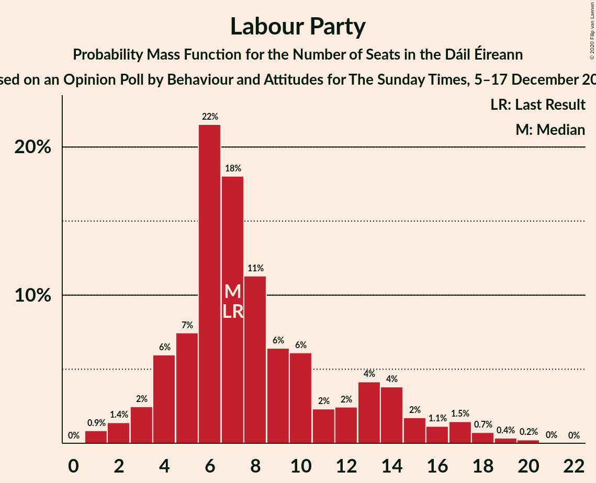
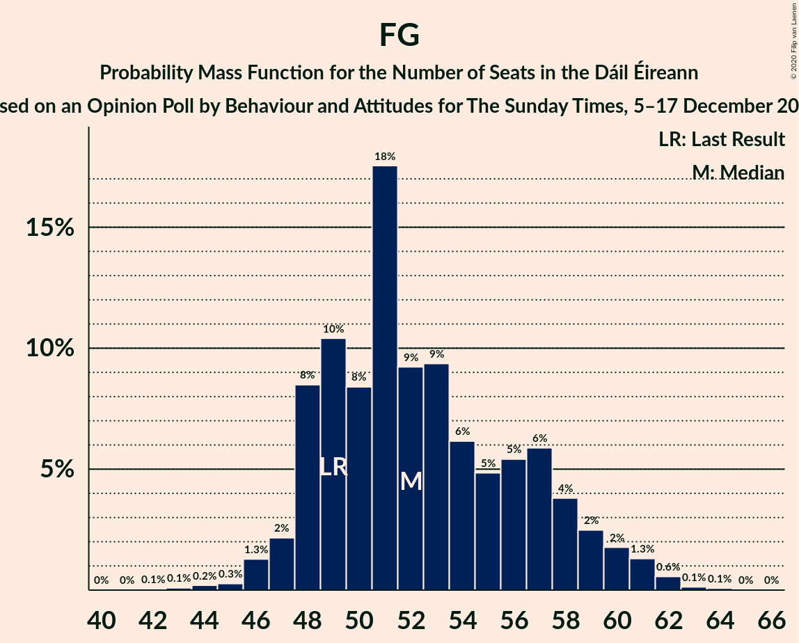

# Opinion Poll by Behaviour and Attitudes for The Sunday Times, 5–17 December 2019

<a href="#voting-intentions">Voting Intentions</a> | <a href="#seats">Seats</a> | <a href="#coalitions">Coalitions</a> | <a href="#technical-information">Technical Information</a>

## Voting Intentions

### Confidence Intervals

| Party | Last Result | Poll Result | 80% Confidence Interval | 90% Confidence Interval | 95% Confidence Interval | 99% Confidence Interval |
|:-----:|:-----------:|:-----------:|:-----------------------:|:-----------------------:|:-----------------------:|:-----------------------:|
| Fine Gael | 25.5% | 27.0% | 25.2–29.0% |24.6–29.5% |24.2–30.0% |23.3–31.0% |
| Fianna Fáil | 24.3% | 27.0% | 25.2–29.0% |24.6–29.5% |24.2–30.0% |23.3–31.0% |
| Sinn Féin | 13.8% | 20.0% | 18.4–21.8% |17.9–22.3% |17.5–22.7% |16.8–23.6% |
| Independent | 15.9% | 7.1% | 6.1–8.3% |5.8–8.7% |5.6–9.0% |5.2–9.6% |
| Labour Party | 6.6% | 6.0% | 5.1–7.1% |4.8–7.5% |4.6–7.8% |4.2–8.3% |
| Green Party/Comhaontas Glas | 2.7% | 6.0% | 5.1–7.1% |4.8–7.5% |4.6–7.8% |4.2–8.3% |
| Solidarity–People Before Profit | 3.9% | 3.0% | 2.4–3.9% |2.2–4.1% |2.1–4.3% |1.8–4.8% |
| Social Democrats | 3.0% | 1.0% | 0.7–1.6% |0.6–1.7% |0.5–1.9% |0.4–2.2% |
| Independents 4 Change | 1.5% | 0.9% | 0.6–1.4% |0.5–1.6% |0.5–1.8% |0.3–2.1% |

*Note:* The poll result column reflects the actual value used in the calculations. Published results may vary slightly, and in addition be rounded to fewer digits.

## Seats

### Confidence Intervals

| Party | Last Result | Median | 80% Confidence Interval | 90% Confidence Interval | 95% Confidence Interval | 99% Confidence Interval |
|:-----:|:-----------:|:------:|:-----------------------:|:-----------------------:|:-----------------------:|:-----------------------:|
| <a href="#fine-gael">Fine Gael</a> | 49 | 62 | 54–65 |51–67 |49–69 |47–70 |
| <a href="#fianna-fáil">Fianna Fáil</a> | 44 | 51 | 49–58 |49–59 |48–60 |44–63 |
| <a href="#sinn-féin">Sinn Féin</a> | 23 | 34 | 29–37 |28–37 |27–37 |24–39 |
| <a href="#independent">Independent</a> | 19 | 5 | 4–8 |4–10 |3–12 |3–15 |
| <a href="#labour-party">Labour Party</a> | 7 | 2 | 0–3 |0–5 |0–6 |0–8 |
| <a href="#green-party/comhaontas-glas">Green Party/Comhaontas Glas</a> | 2 | 3 | 2–4 |2–5 |2–5 |1–5 |
| <a href="#solidarity–people-before-profit">Solidarity–People Before Profit</a> | 6 | 3 | 0–4 |0–5 |0–5 |0–7 |
| <a href="#social-democrats">Social Democrats</a> | 3 | 0 | 0–1 |0–3 |0–3 |0–3 |
| <a href="#independents-4-change">Independents 4 Change</a> | 4 | 1 | 0–2 |0–4 |0–5 |0–5 |

### Fine Gael

*For a full overview of the results for this party, see the [Fine Gael](party-finegael.html) page.*

| Number of Seats | Probability | Accumulated | Special Marks |
|:---------------:|:-----------:|:-----------:|:-------------:|
| 44 | 0.2% | 100% |  |
| 45 | 0% | 99.8% |  |
| 46 | 0.2% | 99.7% |  |
| 47 | 0.2% | 99.5% |  |
| 48 | 1.1% | 99.3% |  |
| 49 | 1.2% | 98% | Last Result |
| 50 | 0.7% | 97% |  |
| 51 | 2% | 96% |  |
| 52 | 2% | 94% |  |
| 53 | 0.6% | 92% |  |
| 54 | 2% | 92% |  |
| 55 | 15% | 89% |  |
| 56 | 2% | 74% |  |
| 57 | 8% | 73% |  |
| 58 | 5% | 65% |  |
| 59 | 4% | 60% |  |
| 60 | 4% | 56% |  |
| 61 | 1.3% | 52% |  |
| 62 | 21% | 51% | Median |
| 63 | 1.1% | 30% |  |
| 64 | 12% | 29% |  |
| 65 | 8% | 17% |  |
| 66 | 3% | 8% |  |
| 67 | 0.8% | 5% |  |
| 68 | 1.5% | 5% |  |
| 69 | 0.7% | 3% |  |
| 70 | 2% | 2% |  |
| 71 | 0% | 0.1% |  |
| 72 | 0% | 0% |  |

### Fianna Fáil

*For a full overview of the results for this party, see the [Fianna Fáil](party-fiannafáil.html) page.*

| Number of Seats | Probability | Accumulated | Special Marks |
|:---------------:|:-----------:|:-----------:|:-------------:|
| 43 | 0.1% | 100% |  |
| 44 | 0.4% | 99.9% | Last Result |
| 45 | 0.1% | 99.5% |  |
| 46 | 0.7% | 99.3% |  |
| 47 | 0.9% | 98.6% |  |
| 48 | 3% | 98% |  |
| 49 | 14% | 95% |  |
| 50 | 30% | 81% |  |
| 51 | 1.4% | 51% | Median |
| 52 | 4% | 50% |  |
| 53 | 10% | 46% |  |
| 54 | 17% | 36% |  |
| 55 | 2% | 19% |  |
| 56 | 1.1% | 17% |  |
| 57 | 3% | 16% |  |
| 58 | 3% | 13% |  |
| 59 | 5% | 10% |  |
| 60 | 3% | 5% |  |
| 61 | 0.8% | 2% |  |
| 62 | 0.7% | 1.3% |  |
| 63 | 0.3% | 0.6% |  |
| 64 | 0.2% | 0.3% |  |
| 65 | 0% | 0% |  |

### Sinn Féin

*For a full overview of the results for this party, see the [Sinn Féin](party-sinnféin.html) page.*

| Number of Seats | Probability | Accumulated | Special Marks |
|:---------------:|:-----------:|:-----------:|:-------------:|
| 22 | 0.1% | 100% |  |
| 23 | 0.2% | 99.9% | Last Result |
| 24 | 0.3% | 99.7% |  |
| 25 | 0.4% | 99.4% |  |
| 26 | 1.0% | 99.0% |  |
| 27 | 1.2% | 98% |  |
| 28 | 6% | 97% |  |
| 29 | 7% | 91% |  |
| 30 | 2% | 84% |  |
| 31 | 1.3% | 82% |  |
| 32 | 4% | 80% |  |
| 33 | 6% | 77% |  |
| 34 | 31% | 71% | Median |
| 35 | 9% | 39% |  |
| 36 | 14% | 30% |  |
| 37 | 15% | 17% |  |
| 38 | 1.2% | 2% |  |
| 39 | 0.2% | 0.7% |  |
| 40 | 0.1% | 0.5% |  |
| 41 | 0.2% | 0.4% |  |
| 42 | 0.1% | 0.2% |  |
| 43 | 0.1% | 0.1% |  |
| 44 | 0% | 0% |  |

### Independent

*For a full overview of the results for this party, see the [Independent](party-independent.html) page.*

| Number of Seats | Probability | Accumulated | Special Marks |
|:---------------:|:-----------:|:-----------:|:-------------:|
| 3 | 3% | 100% |  |
| 4 | 37% | 97% |  |
| 5 | 31% | 60% | Median |
| 6 | 6% | 29% |  |
| 7 | 2% | 23% |  |
| 8 | 14% | 21% |  |
| 9 | 0.8% | 7% |  |
| 10 | 2% | 6% |  |
| 11 | 0.5% | 4% |  |
| 12 | 1.3% | 3% |  |
| 13 | 1.2% | 2% |  |
| 14 | 0.2% | 1.0% |  |
| 15 | 0.5% | 0.8% |  |
| 16 | 0.3% | 0.3% |  |
| 17 | 0% | 0% |  |
| 18 | 0% | 0% |  |
| 19 | 0% | 0% | Last Result |

### Labour Party

*For a full overview of the results for this party, see the [Labour Party](party-labourparty.html) page.*

| Number of Seats | Probability | Accumulated | Special Marks |
|:---------------:|:-----------:|:-----------:|:-------------:|
| 0 | 13% | 100% |  |
| 1 | 35% | 87% |  |
| 2 | 41% | 51% | Median |
| 3 | 3% | 11% |  |
| 4 | 2% | 8% |  |
| 5 | 1.2% | 6% |  |
| 6 | 4% | 5% |  |
| 7 | 0.8% | 1.3% | Last Result |
| 8 | 0.1% | 0.5% |  |
| 9 | 0.2% | 0.4% |  |
| 10 | 0.1% | 0.2% |  |
| 11 | 0.1% | 0.1% |  |
| 12 | 0% | 0% |  |

### Green Party/Comhaontas Glas

*For a full overview of the results for this party, see the [Green Party/Comhaontas Glas](party-greenpartycomhaontasglas.html) page.*

| Number of Seats | Probability | Accumulated | Special Marks |
|:---------------:|:-----------:|:-----------:|:-------------:|
| 1 | 0.5% | 100% |  |
| 2 | 23% | 99.5% | Last Result |
| 3 | 40% | 77% | Median |
| 4 | 27% | 37% |  |
| 5 | 9% | 10% |  |
| 6 | 0.2% | 0.2% |  |
| 7 | 0% | 0% |  |

### Solidarity–People Before Profit

*For a full overview of the results for this party, see the [Solidarity–People Before Profit](party-solidarity–peoplebeforeprofit.html) page.*

| Number of Seats | Probability | Accumulated | Special Marks |
|:---------------:|:-----------:|:-----------:|:-------------:|
| 0 | 12% | 100% |  |
| 1 | 24% | 88% |  |
| 2 | 13% | 64% |  |
| 3 | 22% | 52% | Median |
| 4 | 24% | 29% |  |
| 5 | 4% | 6% |  |
| 6 | 0.8% | 1.4% | Last Result |
| 7 | 0.5% | 0.6% |  |
| 8 | 0% | 0% |  |

### Social Democrats

*For a full overview of the results for this party, see the [Social Democrats](party-socialdemocrats.html) page.*

| Number of Seats | Probability | Accumulated | Special Marks |
|:---------------:|:-----------:|:-----------:|:-------------:|
| 0 | 85% | 100% | Median |
| 1 | 6% | 15% |  |
| 2 | 1.2% | 9% |  |
| 3 | 8% | 8% | Last Result |
| 4 | 0% | 0% |  |

### Independents 4 Change

*For a full overview of the results for this party, see the [Independents 4 Change](party-independents4change.html) page.*

| Number of Seats | Probability | Accumulated | Special Marks |
|:---------------:|:-----------:|:-----------:|:-------------:|
| 0 | 42% | 100% |  |
| 1 | 45% | 58% | Median |
| 2 | 7% | 14% |  |
| 3 | 2% | 7% |  |
| 4 | 0.9% | 5% | Last Result |
| 5 | 4% | 4% |  |
| 6 | 0% | 0% |  |

## Coalitions

### Confidence Intervals

| Coalition | Last Result | Median | Majority? | 80% Confidence Interval | 90% Confidence Interval | 95% Confidence Interval | 99% Confidence Interval |
|:---------:|:-----------:|:------:|:---------:|:-----------------------:|:-----------------------:|:-----------------------:|:-----------------------:|
| Fianna Fáil – Fine Gael | 93 | 112 | 100% | 109–117 | 108–119 | 106–119 | 102–122 |
| Fianna Fáil – Sinn Féin | 67 | 86 | 93% | 81–90 | 79–93 | 77–94 | 76–99 |
| Fine Gael – Labour Party | 56 | 64 | 0% | 56–68 | 53–70 | 51–70 | 49–73 |
| Fine Gael | 49 | 62 | 0% | 54–65 | 51–67 | 49–69 | 47–70 |
| Fianna Fáil – Green Party/Comhaontas Glas | 46 | 54 | 0% | 52–61 | 51–63 | 51–65 | 48–65 |

### Fianna Fáil – Fine Gael

| Number of Seats | Probability | Accumulated | Special Marks |
|:---------------:|:-----------:|:-----------:|:-------------:|
| 93 | 0% | 100% | Last Result |
| 94 | 0% | 100% |  |
| 95 | 0% | 100% |  |
| 96 | 0% | 100% |  |
| 97 | 0% | 100% |  |
| 98 | 0% | 100% |  |
| 99 | 0% | 100% |  |
| 100 | 0.1% | 99.9% |  |
| 101 | 0.2% | 99.8% |  |
| 102 | 0.3% | 99.6% |  |
| 103 | 0.6% | 99.2% |  |
| 104 | 0.5% | 98.6% |  |
| 105 | 0.3% | 98% |  |
| 106 | 2% | 98% |  |
| 107 | 0.9% | 96% |  |
| 108 | 1.4% | 95% |  |
| 109 | 16% | 94% |  |
| 110 | 9% | 78% |  |
| 111 | 9% | 68% |  |
| 112 | 20% | 59% |  |
| 113 | 4% | 39% | Median |
| 114 | 14% | 35% |  |
| 115 | 4% | 21% |  |
| 116 | 4% | 17% |  |
| 117 | 6% | 13% |  |
| 118 | 0.6% | 7% |  |
| 119 | 4% | 6% |  |
| 120 | 0.7% | 2% |  |
| 121 | 0.4% | 1.4% |  |
| 122 | 0.6% | 1.0% |  |
| 123 | 0.1% | 0.4% |  |
| 124 | 0.3% | 0.3% |  |
| 125 | 0% | 0% |  |

### Fianna Fáil – Sinn Féin

| Number of Seats | Probability | Accumulated | Special Marks |
|:---------------:|:-----------:|:-----------:|:-------------:|
| 67 | 0% | 100% | Last Result |
| 68 | 0% | 100% |  |
| 69 | 0% | 100% |  |
| 70 | 0% | 100% |  |
| 71 | 0% | 100% |  |
| 72 | 0% | 100% |  |
| 73 | 0.1% | 100% |  |
| 74 | 0% | 99.9% |  |
| 75 | 0.3% | 99.9% |  |
| 76 | 0.4% | 99.5% |  |
| 77 | 2% | 99.1% |  |
| 78 | 2% | 97% |  |
| 79 | 1.2% | 95% |  |
| 80 | 0.9% | 94% |  |
| 81 | 6% | 93% | Majority |
| 82 | 2% | 87% |  |
| 83 | 2% | 86% |  |
| 84 | 21% | 83% |  |
| 85 | 8% | 63% | Median |
| 86 | 5% | 55% |  |
| 87 | 14% | 50% |  |
| 88 | 17% | 35% |  |
| 89 | 2% | 18% |  |
| 90 | 7% | 16% |  |
| 91 | 1.3% | 9% |  |
| 92 | 2% | 8% |  |
| 93 | 2% | 6% |  |
| 94 | 2% | 4% |  |
| 95 | 0.8% | 2% |  |
| 96 | 0.5% | 2% |  |
| 97 | 0.3% | 1.1% |  |
| 98 | 0.1% | 0.8% |  |
| 99 | 0.7% | 0.8% |  |
| 100 | 0% | 0.1% |  |
| 101 | 0% | 0% |  |

### Fine Gael – Labour Party

| Number of Seats | Probability | Accumulated | Special Marks |
|:---------------:|:-----------:|:-----------:|:-------------:|
| 45 | 0.2% | 100% |  |
| 46 | 0% | 99.8% |  |
| 47 | 0.1% | 99.7% |  |
| 48 | 0.2% | 99.7% |  |
| 49 | 0.4% | 99.5% |  |
| 50 | 1.0% | 99.1% |  |
| 51 | 1.2% | 98% |  |
| 52 | 0.6% | 97% |  |
| 53 | 2% | 96% |  |
| 54 | 2% | 94% |  |
| 55 | 1.2% | 92% |  |
| 56 | 16% | 91% | Last Result |
| 57 | 2% | 76% |  |
| 58 | 7% | 74% |  |
| 59 | 5% | 66% |  |
| 60 | 4% | 61% |  |
| 61 | 2% | 57% |  |
| 62 | 3% | 55% |  |
| 63 | 2% | 52% |  |
| 64 | 20% | 50% | Median |
| 65 | 4% | 30% |  |
| 66 | 14% | 26% |  |
| 67 | 0.9% | 12% |  |
| 68 | 3% | 11% |  |
| 69 | 1.5% | 8% |  |
| 70 | 5% | 7% |  |
| 71 | 0.4% | 2% |  |
| 72 | 0.1% | 1.1% |  |
| 73 | 0.6% | 1.0% |  |
| 74 | 0.2% | 0.4% |  |
| 75 | 0.1% | 0.2% |  |
| 76 | 0.1% | 0.1% |  |
| 77 | 0% | 0% |  |

### Fine Gael

| Number of Seats | Probability | Accumulated | Special Marks |
|:---------------:|:-----------:|:-----------:|:-------------:|
| 44 | 0.2% | 100% |  |
| 45 | 0% | 99.8% |  |
| 46 | 0.2% | 99.7% |  |
| 47 | 0.2% | 99.5% |  |
| 48 | 1.1% | 99.3% |  |
| 49 | 1.2% | 98% | Last Result |
| 50 | 0.7% | 97% |  |
| 51 | 2% | 96% |  |
| 52 | 2% | 94% |  |
| 53 | 0.6% | 92% |  |
| 54 | 2% | 92% |  |
| 55 | 15% | 89% |  |
| 56 | 2% | 74% |  |
| 57 | 8% | 73% |  |
| 58 | 5% | 65% |  |
| 59 | 4% | 60% |  |
| 60 | 4% | 56% |  |
| 61 | 1.3% | 52% |  |
| 62 | 21% | 51% | Median |
| 63 | 1.1% | 30% |  |
| 64 | 12% | 29% |  |
| 65 | 8% | 17% |  |
| 66 | 3% | 8% |  |
| 67 | 0.8% | 5% |  |
| 68 | 1.5% | 5% |  |
| 69 | 0.7% | 3% |  |
| 70 | 2% | 2% |  |
| 71 | 0% | 0.1% |  |
| 72 | 0% | 0% |  |

### Fianna Fáil – Green Party/Comhaontas Glas

| Number of Seats | Probability | Accumulated | Special Marks |
|:---------------:|:-----------:|:-----------:|:-------------:|
| 45 | 0.1% | 100% |  |
| 46 | 0.1% | 99.9% | Last Result |
| 47 | 0% | 99.8% |  |
| 48 | 0.5% | 99.8% |  |
| 49 | 1.0% | 99.3% |  |
| 50 | 0.3% | 98% |  |
| 51 | 4% | 98% |  |
| 52 | 7% | 94% |  |
| 53 | 33% | 87% |  |
| 54 | 4% | 54% | Median |
| 55 | 2% | 49% |  |
| 56 | 10% | 47% |  |
| 57 | 3% | 37% |  |
| 58 | 17% | 34% |  |
| 59 | 2% | 17% |  |
| 60 | 3% | 15% |  |
| 61 | 5% | 12% |  |
| 62 | 2% | 7% |  |
| 63 | 1.3% | 5% |  |
| 64 | 0.5% | 4% |  |
| 65 | 3% | 3% |  |
| 66 | 0.2% | 0.4% |  |
| 67 | 0% | 0.2% |  |
| 68 | 0.2% | 0.2% |  |
| 69 | 0% | 0% |  |

## Technical Information

### Opinion Poll

+ **Polling firm:** Behaviour and Attitudes
+ **Commissioner(s):** The Sunday Times
+ **Fieldwork period:** 5–17 December 2019

### Calculations

+ **Sample size:** 900
+ **Simulations done:** 131,072
+ **Error estimate:** 2.65%

