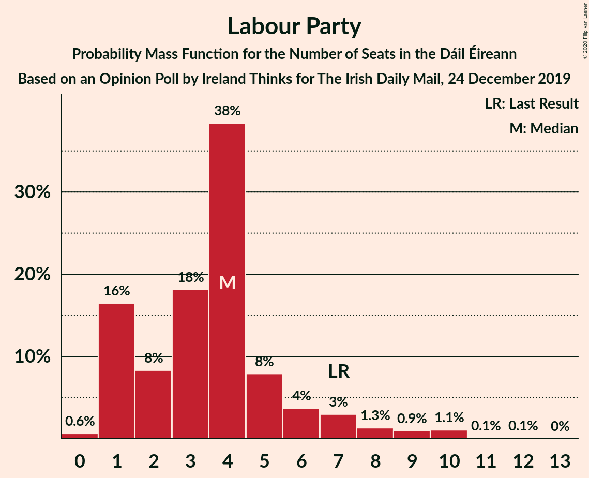
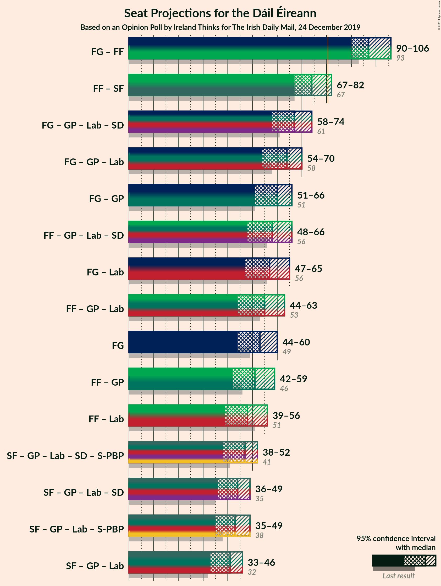
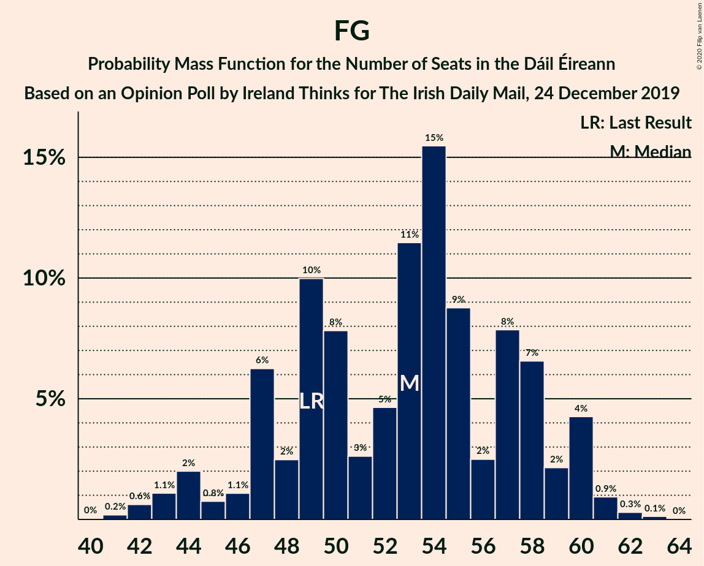

# Opinion Poll by Ireland Thinks for The Irish Daily Mail, 24 December 2019

<a href="#voting-intentions">Voting Intentions</a> | <a href="#seats">Seats</a> | <a href="#coalitions">Coalitions</a> | <a href="#technical-information">Technical Information</a>

## Voting Intentions

### Confidence Intervals

| Party | Last Result | Poll Result | 80% Confidence Interval | 90% Confidence Interval | 95% Confidence Interval | 99% Confidence Interval |
|:-----:|:-----------:|:-----------:|:-----------------------:|:-----------------------:|:-----------------------:|:-----------------------:|
| Fine Gael | 25.5% | 28.0% | 26.6–29.5% |26.2–29.9% |25.8–30.3% |25.2–31.0% |
| Fianna Fáil | 24.3% | 25.0% | 23.6–26.4% |23.2–26.8% |22.9–27.2% |22.3–27.9% |
| Sinn Féin | 13.8% | 15.0% | 13.9–16.2% |13.6–16.6% |13.3–16.9% |12.8–17.5% |
| Independent | 15.9% | 11.9% | 10.9–13.0% |10.6–13.3% |10.3–13.5% |9.9–14.1% |
| Green Party/Comhaontas Glas | 2.7% | 7.0% | 6.2–7.9% |6.0–8.2% |5.8–8.4% |5.5–8.8% |
| Labour Party | 6.6% | 5.0% | 4.3–5.8% |4.2–6.0% |4.0–6.2% |3.7–6.6% |
| Solidarity–People Before Profit | 3.9% | 3.0% | 2.5–3.7% |2.4–3.8% |2.3–4.0% |2.1–4.3% |
| Social Democrats | 3.0% | 3.0% | 2.5–3.7% |2.4–3.8% |2.3–4.0% |2.1–4.3% |
| Independents 4 Change | 1.5% | 1.5% | 1.2–2.0% |1.1–2.1% |1.0–2.3% |0.9–2.5% |

*Note:* The poll result column reflects the actual value used in the calculations. Published results may vary slightly, and in addition be rounded to fewer digits.

## Seats

### Confidence Intervals

| Party | Last Result | Median | 80% Confidence Interval | 90% Confidence Interval | 95% Confidence Interval | 99% Confidence Interval |
|:-----:|:-----------:|:------:|:-----------------------:|:-----------------------:|:-----------------------:|:-----------------------:|
| <a href="#fine-gael">Fine Gael</a> | 49 | 53 | 48–57 |46–59 |44–60 |42–61 |
| <a href="#fianna-fáil">Fianna Fáil</a> | 44 | 45 | 40–48 |38–51 |36–52 |35–53 |
| <a href="#sinn-féin">Sinn Féin</a> | 23 | 31 | 27–32 |24–33 |23–34 |22–35 |
| <a href="#independent">Independent</a> | 19 | 15 | 12–17 |10–17 |9–17 |6–17 |
| <a href="#green-party/comhaontas-glas">Green Party/Comhaontas Glas</a> | 2 | 7 | 5–8 |5–8 |5–9 |5–10 |
| <a href="#labour-party">Labour Party</a> | 7 | 4 | 1–6 |1–7 |1–8 |0–10 |
| <a href="#solidarity–people-before-profit">Solidarity–People Before Profit</a> | 6 | 2 | 1–4 |1–4 |1–4 |1–5 |
| <a href="#social-democrats">Social Democrats</a> | 3 | 3 | 3–4 |3–5 |3–5 |3–5 |
| <a href="#independents-4-change">Independents 4 Change</a> | 4 | 3 | 2–3 |2–3 |2–3 |2–3 |

### Fine Gael

*For a full overview of the results for this party, see the [Fine Gael](party-finegael.html) page.*

| Number of Seats | Probability | Accumulated | Special Marks |
|:---------------:|:-----------:|:-----------:|:-------------:|
| 41 | 0.2% | 100% |  |
| 42 | 0.5% | 99.8% |  |
| 43 | 1.2% | 99.3% |  |
| 44 | 1.0% | 98% |  |
| 45 | 2% | 97% |  |
| 46 | 0.7% | 95% |  |
| 47 | 1.3% | 94% |  |
| 48 | 7% | 93% |  |
| 49 | 6% | 86% | Last Result |
| 50 | 12% | 80% |  |
| 51 | 5% | 68% |  |
| 52 | 13% | 63% |  |
| 53 | 14% | 50% | Median |
| 54 | 8% | 36% |  |
| 55 | 5% | 28% |  |
| 56 | 6% | 23% |  |
| 57 | 7% | 16% |  |
| 58 | 2% | 9% |  |
| 59 | 2% | 7% |  |
| 60 | 3% | 5% |  |
| 61 | 1.0% | 1.4% |  |
| 62 | 0.4% | 0.5% |  |
| 63 | 0.1% | 0.1% |  |
| 64 | 0% | 0% |  |

### Fianna Fáil

*For a full overview of the results for this party, see the [Fianna Fáil](party-fiannafáil.html) page.*

| Number of Seats | Probability | Accumulated | Special Marks |
|:---------------:|:-----------:|:-----------:|:-------------:|
| 32 | 0.1% | 100% |  |
| 33 | 0.2% | 99.9% |  |
| 34 | 0.1% | 99.7% |  |
| 35 | 0.5% | 99.6% |  |
| 36 | 2% | 99.1% |  |
| 37 | 1.4% | 97% |  |
| 38 | 3% | 96% |  |
| 39 | 2% | 93% |  |
| 40 | 9% | 90% |  |
| 41 | 3% | 81% |  |
| 42 | 13% | 78% |  |
| 43 | 5% | 65% |  |
| 44 | 10% | 60% | Last Result |
| 45 | 4% | 50% | Median |
| 46 | 20% | 46% |  |
| 47 | 9% | 26% |  |
| 48 | 7% | 16% |  |
| 49 | 1.1% | 9% |  |
| 50 | 2% | 8% |  |
| 51 | 2% | 6% |  |
| 52 | 2% | 4% |  |
| 53 | 1.4% | 2% |  |
| 54 | 0.1% | 0.2% |  |
| 55 | 0.1% | 0.1% |  |
| 56 | 0% | 0% |  |

### Sinn Féin

*For a full overview of the results for this party, see the [Sinn Féin](party-sinnféin.html) page.*

| Number of Seats | Probability | Accumulated | Special Marks |
|:---------------:|:-----------:|:-----------:|:-------------:|
| 21 | 0.2% | 100% |  |
| 22 | 0.5% | 99.8% |  |
| 23 | 3% | 99.3% | Last Result |
| 24 | 3% | 96% |  |
| 25 | 2% | 94% |  |
| 26 | 2% | 92% |  |
| 27 | 4% | 91% |  |
| 28 | 7% | 87% |  |
| 29 | 12% | 80% |  |
| 30 | 12% | 68% |  |
| 31 | 32% | 55% | Median |
| 32 | 16% | 23% |  |
| 33 | 4% | 7% |  |
| 34 | 2% | 3% |  |
| 35 | 0.7% | 0.8% |  |
| 36 | 0.1% | 0.1% |  |
| 37 | 0% | 0% |  |

### Independent

*For a full overview of the results for this party, see the [Independent](party-independent.html) page.*

| Number of Seats | Probability | Accumulated | Special Marks |
|:---------------:|:-----------:|:-----------:|:-------------:|
| 4 | 0.2% | 100% |  |
| 5 | 0.1% | 99.8% |  |
| 6 | 0.2% | 99.6% |  |
| 7 | 0.3% | 99.4% |  |
| 8 | 0.8% | 99.1% |  |
| 9 | 2% | 98% |  |
| 10 | 2% | 97% |  |
| 11 | 2% | 94% |  |
| 12 | 9% | 92% |  |
| 13 | 12% | 83% |  |
| 14 | 19% | 71% |  |
| 15 | 12% | 52% | Median |
| 16 | 7% | 40% |  |
| 17 | 33% | 33% |  |
| 18 | 0.1% | 0.1% |  |
| 19 | 0% | 0% | Last Result |

### Green Party/Comhaontas Glas

*For a full overview of the results for this party, see the [Green Party/Comhaontas Glas](party-greenpartycomhaontasglas.html) page.*

| Number of Seats | Probability | Accumulated | Special Marks |
|:---------------:|:-----------:|:-----------:|:-------------:|
| 2 | 0% | 100% | Last Result |
| 3 | 0% | 100% |  |
| 4 | 0.3% | 100% |  |
| 5 | 33% | 99.7% |  |
| 6 | 3% | 67% |  |
| 7 | 49% | 64% | Median |
| 8 | 11% | 15% |  |
| 9 | 3% | 4% |  |
| 10 | 0.8% | 1.0% |  |
| 11 | 0.2% | 0.2% |  |
| 12 | 0% | 0.1% |  |
| 13 | 0% | 0% |  |

### Labour Party

*For a full overview of the results for this party, see the [Labour Party](party-labourparty.html) page.*

| Number of Seats | Probability | Accumulated | Special Marks |
|:---------------:|:-----------:|:-----------:|:-------------:|
| 0 | 0.7% | 100% |  |
| 1 | 16% | 99.3% |  |
| 2 | 7% | 83% |  |
| 3 | 19% | 76% |  |
| 4 | 14% | 57% | Median |
| 5 | 30% | 43% |  |
| 6 | 5% | 13% |  |
| 7 | 4% | 8% | Last Result |
| 8 | 1.5% | 4% |  |
| 9 | 0.9% | 2% |  |
| 10 | 1.0% | 1.2% |  |
| 11 | 0.1% | 0.2% |  |
| 12 | 0.1% | 0.1% |  |
| 13 | 0% | 0% |  |

### Solidarity–People Before Profit

*For a full overview of the results for this party, see the [Solidarity–People Before Profit](party-solidarity–peoplebeforeprofit.html) page.*

| Number of Seats | Probability | Accumulated | Special Marks |
|:---------------:|:-----------:|:-----------:|:-------------:|
| 1 | 27% | 100% |  |
| 2 | 34% | 73% | Median |
| 3 | 25% | 39% |  |
| 4 | 11% | 14% |  |
| 5 | 2% | 2% |  |
| 6 | 0.2% | 0.3% | Last Result |
| 7 | 0% | 0% |  |

### Social Democrats

*For a full overview of the results for this party, see the [Social Democrats](party-socialdemocrats.html) page.*

| Number of Seats | Probability | Accumulated | Special Marks |
|:---------------:|:-----------:|:-----------:|:-------------:|
| 3 | 88% | 100% | Last Result, Median |
| 4 | 5% | 12% |  |
| 5 | 7% | 8% |  |
| 6 | 0.4% | 0.5% |  |
| 7 | 0.1% | 0.1% |  |
| 8 | 0% | 0% |  |

### Independents 4 Change

*For a full overview of the results for this party, see the [Independents 4 Change](party-independents4change.html) page.*

| Number of Seats | Probability | Accumulated | Special Marks |
|:---------------:|:-----------:|:-----------:|:-------------:|
| 2 | 20% | 100% |  |
| 3 | 80% | 80% | Median |
| 4 | 0% | 0% | Last Result |

## Coalitions

### Confidence Intervals

| Coalition | Last Result | Median | Majority? | 80% Confidence Interval | 90% Confidence Interval | 95% Confidence Interval | 99% Confidence Interval |
|:---------:|:-----------:|:------:|:---------:|:-----------------------:|:-----------------------:|:-----------------------:|:-----------------------:|
| Fine Gael – Fianna Fáil | 93 | 96 | 100% | 92–102 | 91–104 | 90–107 | 88–108 |
| Fianna Fáil – Sinn Féin | 67 | 74 | 4% | 69–80 | 68–80 | 67–81 | 65–84 |
| Fine Gael – Green Party/Comhaontas Glas – Labour Party – Social Democrats | 61 | 66 | 0% | 61–71 | 60–73 | 58–73 | 56–76 |
| Fine Gael – Green Party/Comhaontas Glas – Labour Party | 58 | 63 | 0% | 58–67 | 57–70 | 54–70 | 53–72 |
| Fianna Fáil – Green Party/Comhaontas Glas – Labour Party – Social Democrats | 56 | 59 | 0% | 52–63 | 51–65 | 49–66 | 47–69 |
| Fine Gael – Green Party/Comhaontas Glas | 51 | 59 | 0% | 55–64 | 52–65 | 51–65 | 49–67 |
| Fine Gael – Labour Party | 56 | 56 | 0% | 51–61 | 50–64 | 48–65 | 45–66 |
| Fianna Fáil – Green Party/Comhaontas Glas – Labour Party | 53 | 55 | 0% | 48–60 | 48–61 | 46–62 | 44–65 |
| Fine Gael | 49 | 53 | 0% | 48–57 | 46–59 | 44–60 | 42–61 |
| Fianna Fáil – Green Party/Comhaontas Glas | 46 | 51 | 0% | 45–55 | 44–58 | 43–59 | 40–61 |
| Fianna Fáil – Labour Party | 51 | 48 | 0% | 43–53 | 41–55 | 39–56 | 37–58 |

### Fine Gael – Fianna Fáil

| Number of Seats | Probability | Accumulated | Special Marks |
|:---------------:|:-----------:|:-----------:|:-------------:|
| 85 | 0% | 100% |  |
| 86 | 0.1% | 99.9% |  |
| 87 | 0.2% | 99.9% |  |
| 88 | 1.0% | 99.7% |  |
| 89 | 0.9% | 98.7% |  |
| 90 | 1.4% | 98% |  |
| 91 | 2% | 96% |  |
| 92 | 6% | 95% |  |
| 93 | 4% | 89% | Last Result |
| 94 | 19% | 85% |  |
| 95 | 8% | 65% |  |
| 96 | 10% | 58% |  |
| 97 | 8% | 48% |  |
| 98 | 8% | 39% | Median |
| 99 | 11% | 31% |  |
| 100 | 5% | 20% |  |
| 101 | 4% | 15% |  |
| 102 | 3% | 11% |  |
| 103 | 2% | 8% |  |
| 104 | 1.1% | 6% |  |
| 105 | 0.8% | 5% |  |
| 106 | 0.3% | 4% |  |
| 107 | 3% | 4% |  |
| 108 | 0.7% | 1.0% |  |
| 109 | 0.2% | 0.3% |  |
| 110 | 0.1% | 0.1% |  |
| 111 | 0% | 0.1% |  |
| 112 | 0% | 0% |  |

### Fianna Fáil – Sinn Féin

| Number of Seats | Probability | Accumulated | Special Marks |
|:---------------:|:-----------:|:-----------:|:-------------:|
| 63 | 0.1% | 100% |  |
| 64 | 0.3% | 99.8% |  |
| 65 | 0.7% | 99.6% |  |
| 66 | 0.7% | 98.8% |  |
| 67 | 2% | 98% | Last Result |
| 68 | 2% | 96% |  |
| 69 | 7% | 95% |  |
| 70 | 6% | 88% |  |
| 71 | 7% | 82% |  |
| 72 | 8% | 75% |  |
| 73 | 11% | 67% |  |
| 74 | 13% | 56% |  |
| 75 | 6% | 44% |  |
| 76 | 6% | 38% | Median |
| 77 | 12% | 32% |  |
| 78 | 8% | 20% |  |
| 79 | 2% | 12% |  |
| 80 | 6% | 10% |  |
| 81 | 2% | 4% | Majority |
| 82 | 0.8% | 2% |  |
| 83 | 0.4% | 2% |  |
| 84 | 0.9% | 1.3% |  |
| 85 | 0.1% | 0.3% |  |
| 86 | 0.2% | 0.3% |  |
| 87 | 0.1% | 0.1% |  |
| 88 | 0% | 0% |  |

### Fine Gael – Green Party/Comhaontas Glas – Labour Party – Social Democrats

| Number of Seats | Probability | Accumulated | Special Marks |
|:---------------:|:-----------:|:-----------:|:-------------:|
| 55 | 0.2% | 100% |  |
| 56 | 1.4% | 99.8% |  |
| 57 | 0.7% | 98% |  |
| 58 | 0.5% | 98% |  |
| 59 | 0.8% | 97% |  |
| 60 | 3% | 96% |  |
| 61 | 7% | 94% | Last Result |
| 62 | 4% | 87% |  |
| 63 | 9% | 83% |  |
| 64 | 6% | 75% |  |
| 65 | 7% | 69% |  |
| 66 | 12% | 61% |  |
| 67 | 16% | 49% | Median |
| 68 | 10% | 33% |  |
| 69 | 9% | 23% |  |
| 70 | 2% | 14% |  |
| 71 | 3% | 11% |  |
| 72 | 2% | 8% |  |
| 73 | 4% | 6% |  |
| 74 | 1.0% | 2% |  |
| 75 | 0.6% | 1.2% |  |
| 76 | 0.4% | 0.6% |  |
| 77 | 0.1% | 0.1% |  |
| 78 | 0% | 0.1% |  |
| 79 | 0% | 0% |  |

### Fine Gael – Green Party/Comhaontas Glas – Labour Party

| Number of Seats | Probability | Accumulated | Special Marks |
|:---------------:|:-----------:|:-----------:|:-------------:|
| 51 | 0.1% | 100% |  |
| 52 | 0.1% | 99.9% |  |
| 53 | 2% | 99.8% |  |
| 54 | 0.7% | 98% |  |
| 55 | 0.5% | 97% |  |
| 56 | 1.0% | 97% |  |
| 57 | 3% | 96% |  |
| 58 | 6% | 93% | Last Result |
| 59 | 5% | 87% |  |
| 60 | 9% | 82% |  |
| 61 | 6% | 73% |  |
| 62 | 8% | 68% |  |
| 63 | 12% | 60% |  |
| 64 | 17% | 47% | Median |
| 65 | 10% | 30% |  |
| 66 | 8% | 20% |  |
| 67 | 3% | 13% |  |
| 68 | 2% | 10% |  |
| 69 | 2% | 7% |  |
| 70 | 4% | 5% |  |
| 71 | 1.1% | 2% |  |
| 72 | 0.4% | 0.6% |  |
| 73 | 0.1% | 0.2% |  |
| 74 | 0.1% | 0.1% |  |
| 75 | 0% | 0% |  |

### Fianna Fáil – Green Party/Comhaontas Glas – Labour Party – Social Democrats

| Number of Seats | Probability | Accumulated | Special Marks |
|:---------------:|:-----------:|:-----------:|:-------------:|
| 44 | 0% | 100% |  |
| 45 | 0.2% | 99.9% |  |
| 46 | 0.1% | 99.8% |  |
| 47 | 0.8% | 99.7% |  |
| 48 | 0.6% | 98.8% |  |
| 49 | 2% | 98% |  |
| 50 | 0.8% | 96% |  |
| 51 | 5% | 96% |  |
| 52 | 2% | 90% |  |
| 53 | 5% | 89% |  |
| 54 | 4% | 83% |  |
| 55 | 3% | 80% |  |
| 56 | 3% | 76% | Last Result |
| 57 | 17% | 73% |  |
| 58 | 5% | 56% |  |
| 59 | 21% | 51% | Median |
| 60 | 7% | 30% |  |
| 61 | 9% | 23% |  |
| 62 | 1.5% | 14% |  |
| 63 | 5% | 13% |  |
| 64 | 2% | 7% |  |
| 65 | 2% | 5% |  |
| 66 | 1.0% | 3% |  |
| 67 | 0.5% | 1.5% |  |
| 68 | 0.4% | 0.9% |  |
| 69 | 0.3% | 0.5% |  |
| 70 | 0.1% | 0.2% |  |
| 71 | 0.1% | 0.1% |  |
| 72 | 0% | 0.1% |  |
| 73 | 0% | 0% |  |

### Fine Gael – Green Party/Comhaontas Glas

| Number of Seats | Probability | Accumulated | Special Marks |
|:---------------:|:-----------:|:-----------:|:-------------:|
| 47 | 0.1% | 100% |  |
| 48 | 0.1% | 99.9% |  |
| 49 | 0.5% | 99.9% |  |
| 50 | 0.9% | 99.3% |  |
| 51 | 1.4% | 98% | Last Result |
| 52 | 2% | 97% |  |
| 53 | 1.0% | 95% |  |
| 54 | 1.1% | 94% |  |
| 55 | 7% | 93% |  |
| 56 | 7% | 85% |  |
| 57 | 9% | 79% |  |
| 58 | 9% | 70% |  |
| 59 | 17% | 61% |  |
| 60 | 15% | 44% | Median |
| 61 | 9% | 29% |  |
| 62 | 7% | 20% |  |
| 63 | 3% | 14% |  |
| 64 | 2% | 10% |  |
| 65 | 6% | 9% |  |
| 66 | 1.4% | 2% |  |
| 67 | 0.7% | 0.9% |  |
| 68 | 0.1% | 0.3% |  |
| 69 | 0.1% | 0.1% |  |
| 70 | 0% | 0% |  |

### Fine Gael – Labour Party

| Number of Seats | Probability | Accumulated | Special Marks |
|:---------------:|:-----------:|:-----------:|:-------------:|
| 44 | 0.1% | 100% |  |
| 45 | 0.6% | 99.9% |  |
| 46 | 1.1% | 99.3% |  |
| 47 | 0.6% | 98% |  |
| 48 | 0.6% | 98% |  |
| 49 | 0.9% | 97% |  |
| 50 | 3% | 96% |  |
| 51 | 5% | 93% |  |
| 52 | 4% | 88% |  |
| 53 | 9% | 84% |  |
| 54 | 8% | 74% |  |
| 55 | 4% | 66% |  |
| 56 | 13% | 62% | Last Result |
| 57 | 13% | 49% | Median |
| 58 | 8% | 37% |  |
| 59 | 6% | 28% |  |
| 60 | 7% | 22% |  |
| 61 | 5% | 15% |  |
| 62 | 3% | 10% |  |
| 63 | 2% | 7% |  |
| 64 | 1.5% | 6% |  |
| 65 | 3% | 4% |  |
| 66 | 0.7% | 1.0% |  |
| 67 | 0.2% | 0.3% |  |
| 68 | 0.1% | 0.1% |  |
| 69 | 0% | 0.1% |  |
| 70 | 0% | 0% |  |

### Fianna Fáil – Green Party/Comhaontas Glas – Labour Party

| Number of Seats | Probability | Accumulated | Special Marks |
|:---------------:|:-----------:|:-----------:|:-------------:|
| 41 | 0% | 100% |  |
| 42 | 0.2% | 99.9% |  |
| 43 | 0.1% | 99.7% |  |
| 44 | 1.0% | 99.6% |  |
| 45 | 0.4% | 98.5% |  |
| 46 | 2% | 98% |  |
| 47 | 0.8% | 96% |  |
| 48 | 6% | 95% |  |
| 49 | 2% | 90% |  |
| 50 | 6% | 88% |  |
| 51 | 4% | 82% |  |
| 52 | 4% | 78% |  |
| 53 | 4% | 74% | Last Result |
| 54 | 15% | 70% |  |
| 55 | 5% | 55% |  |
| 56 | 20% | 50% | Median |
| 57 | 8% | 30% |  |
| 58 | 9% | 22% |  |
| 59 | 2% | 13% |  |
| 60 | 5% | 12% |  |
| 61 | 2% | 7% |  |
| 62 | 2% | 5% |  |
| 63 | 1.0% | 2% |  |
| 64 | 0.5% | 1.2% |  |
| 65 | 0.4% | 0.7% |  |
| 66 | 0.1% | 0.3% |  |
| 67 | 0.1% | 0.2% |  |
| 68 | 0.1% | 0.1% |  |
| 69 | 0% | 0% |  |

### Fine Gael

| Number of Seats | Probability | Accumulated | Special Marks |
|:---------------:|:-----------:|:-----------:|:-------------:|
| 41 | 0.2% | 100% |  |
| 42 | 0.5% | 99.8% |  |
| 43 | 1.2% | 99.3% |  |
| 44 | 1.0% | 98% |  |
| 45 | 2% | 97% |  |
| 46 | 0.7% | 95% |  |
| 47 | 1.3% | 94% |  |
| 48 | 7% | 93% |  |
| 49 | 6% | 86% | Last Result |
| 50 | 12% | 80% |  |
| 51 | 5% | 68% |  |
| 52 | 13% | 63% |  |
| 53 | 14% | 50% | Median |
| 54 | 8% | 36% |  |
| 55 | 5% | 28% |  |
| 56 | 6% | 23% |  |
| 57 | 7% | 16% |  |
| 58 | 2% | 9% |  |
| 59 | 2% | 7% |  |
| 60 | 3% | 5% |  |
| 61 | 1.0% | 1.4% |  |
| 62 | 0.4% | 0.5% |  |
| 63 | 0.1% | 0.1% |  |
| 64 | 0% | 0% |  |

### Fianna Fáil – Green Party/Comhaontas Glas

| Number of Seats | Probability | Accumulated | Special Marks |
|:---------------:|:-----------:|:-----------:|:-------------:|
| 38 | 0.1% | 100% |  |
| 39 | 0.1% | 99.8% |  |
| 40 | 0.3% | 99.7% |  |
| 41 | 0.8% | 99.4% |  |
| 42 | 0.6% | 98.6% |  |
| 43 | 2% | 98% |  |
| 44 | 1.0% | 96% |  |
| 45 | 9% | 95% |  |
| 46 | 3% | 86% | Last Result |
| 47 | 5% | 83% |  |
| 48 | 3% | 78% |  |
| 49 | 12% | 74% |  |
| 50 | 7% | 63% |  |
| 51 | 7% | 56% |  |
| 52 | 10% | 49% | Median |
| 53 | 18% | 39% |  |
| 54 | 6% | 21% |  |
| 55 | 7% | 16% |  |
| 56 | 2% | 9% |  |
| 57 | 1.3% | 7% |  |
| 58 | 2% | 5% |  |
| 59 | 3% | 4% |  |
| 60 | 0.5% | 1.2% |  |
| 61 | 0.5% | 0.7% |  |
| 62 | 0.2% | 0.2% |  |
| 63 | 0% | 0.1% |  |
| 64 | 0% | 0% |  |

### Fianna Fáil – Labour Party

| Number of Seats | Probability | Accumulated | Special Marks |
|:---------------:|:-----------:|:-----------:|:-------------:|
| 35 | 0.1% | 100% |  |
| 36 | 0.1% | 99.9% |  |
| 37 | 0.4% | 99.8% |  |
| 38 | 1.0% | 99.4% |  |
| 39 | 1.1% | 98% |  |
| 40 | 0.6% | 97% |  |
| 41 | 3% | 97% |  |
| 42 | 2% | 94% |  |
| 43 | 6% | 92% |  |
| 44 | 3% | 87% |  |
| 45 | 8% | 84% |  |
| 46 | 4% | 76% |  |
| 47 | 14% | 72% |  |
| 48 | 9% | 58% |  |
| 49 | 17% | 49% | Median |
| 50 | 5% | 32% |  |
| 51 | 10% | 27% | Last Result |
| 52 | 6% | 17% |  |
| 53 | 3% | 12% |  |
| 54 | 3% | 9% |  |
| 55 | 3% | 6% |  |
| 56 | 0.9% | 3% |  |
| 57 | 1.0% | 2% |  |
| 58 | 0.6% | 0.9% |  |
| 59 | 0.1% | 0.3% |  |
| 60 | 0.1% | 0.2% |  |
| 61 | 0.1% | 0.1% |  |
| 62 | 0% | 0.1% |  |
| 63 | 0% | 0% |  |

## Technical Information

### Opinion Poll

+ **Polling firm:** Ireland Thinks
+ **Commissioner(s):** The Irish Daily Mail
+ **Fieldwork period:** 24 December 2019

### Calculations

+ **Sample size:** 1585
+ **Simulations done:** 1,048,576
+ **Error estimate:** 1.74%

