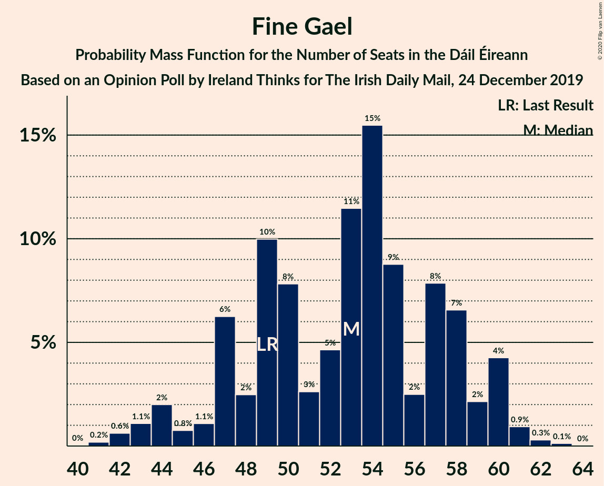
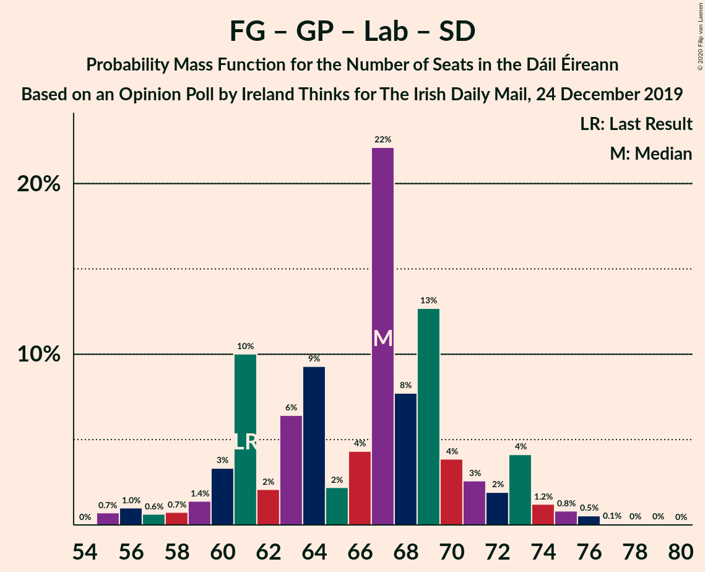

# Opinion Poll by Ireland Thinks for The Irish Daily Mail, 24 December 2019

<a href="#voting-intentions">Voting Intentions</a> | <a href="#seats">Seats</a> | <a href="#coalitions">Coalitions</a> | <a href="#technical-information">Technical Information</a>

## Voting Intentions

### Confidence Intervals

| Party | Last Result | Poll Result | 80% Confidence Interval | 90% Confidence Interval | 95% Confidence Interval | 99% Confidence Interval |
|:-----:|:-----------:|:-----------:|:-----------------------:|:-----------------------:|:-----------------------:|:-----------------------:|
| Fine Gael | 25.5% | 28.0% | 26.6–29.5% |26.2–29.9% |25.8–30.3% |25.2–31.0% |
| Fianna Fáil | 24.3% | 25.0% | 23.6–26.4% |23.2–26.8% |22.9–27.2% |22.3–27.9% |
| Sinn Féin | 13.8% | 15.0% | 13.9–16.2% |13.6–16.6% |13.3–16.9% |12.8–17.5% |
| Independent | 15.9% | 11.9% | 10.9–13.0% |10.6–13.3% |10.3–13.5% |9.9–14.1% |
| Green Party/Comhaontas Glas | 2.7% | 7.0% | 6.2–7.9% |6.0–8.2% |5.8–8.4% |5.5–8.8% |
| Labour Party | 6.6% | 5.0% | 4.3–5.8% |4.2–6.0% |4.0–6.2% |3.7–6.6% |
| Solidarity–People Before Profit | 3.9% | 3.0% | 2.5–3.7% |2.4–3.8% |2.3–4.0% |2.1–4.3% |
| Social Democrats | 3.0% | 3.0% | 2.5–3.7% |2.4–3.8% |2.3–4.0% |2.1–4.3% |
| Independents 4 Change | 1.5% | 1.5% | 1.2–2.0% |1.1–2.1% |1.0–2.3% |0.9–2.5% |

*Note:* The poll result column reflects the actual value used in the calculations. Published results may vary slightly, and in addition be rounded to fewer digits.

## Seats

### Confidence Intervals

| Party | Last Result | Median | 80% Confidence Interval | 90% Confidence Interval | 95% Confidence Interval | 99% Confidence Interval |
|:-----:|:-----------:|:------:|:-----------------------:|:-----------------------:|:-----------------------:|:-----------------------:|
| <a href="#fine-gael">Fine Gael</a> | 49 | 53 | 47–58 |46–60 |44–60 |42–61 |
| <a href="#fianna-fáil">Fianna Fáil</a> | 44 | 44 | 39–48 |37–51 |36–53 |34–54 |
| <a href="#sinn-féin">Sinn Féin</a> | 23 | 32 | 26–33 |24–33 |23–34 |22–35 |
| <a href="#independent">Independent</a> | 19 | 14 | 11–17 |10–17 |9–17 |6–17 |
| <a href="#green-party/comhaontas-glas">Green Party/Comhaontas Glas</a> | 2 | 7 | 5–8 |5–8 |5–9 |5–10 |
| <a href="#labour-party">Labour Party</a> | 7 | 4 | 1–6 |1–7 |1–8 |0–10 |
| <a href="#solidarity–people-before-profit">Solidarity–People Before Profit</a> | 6 | 2 | 1–4 |1–4 |1–4 |1–5 |
| <a href="#social-democrats">Social Democrats</a> | 3 | 3 | 3–4 |3–5 |3–5 |3–5 |
| <a href="#independents-4-change">Independents 4 Change</a> | 4 | 3 | 2–3 |2–3 |2–3 |1–4 |

### Fine Gael

*For a full overview of the results for this party, see the [Fine Gael](party-finegael.html) page.*

| Number of Seats | Probability | Accumulated | Special Marks |
|:---------------:|:-----------:|:-----------:|:-------------:|
| 41 | 0.2% | 100% |  |
| 42 | 0.6% | 99.8% |  |
| 43 | 1.1% | 99.1% |  |
| 44 | 2% | 98% |  |
| 45 | 0.8% | 96% |  |
| 46 | 1.1% | 95% |  |
| 47 | 6% | 94% |  |
| 48 | 2% | 88% |  |
| 49 | 10% | 85% | Last Result |
| 50 | 8% | 76% |  |
| 51 | 3% | 68% |  |
| 52 | 5% | 65% |  |
| 53 | 11% | 60% | Median |
| 54 | 15% | 49% |  |
| 55 | 9% | 33% |  |
| 56 | 2% | 25% |  |
| 57 | 8% | 22% |  |
| 58 | 7% | 14% |  |
| 59 | 2% | 8% |  |
| 60 | 4% | 6% |  |
| 61 | 0.9% | 1.4% |  |
| 62 | 0.3% | 0.4% |  |
| 63 | 0.1% | 0.2% |  |
| 64 | 0% | 0% |  |

### Fianna Fáil

*For a full overview of the results for this party, see the [Fianna Fáil](party-fiannafáil.html) page.*

| Number of Seats | Probability | Accumulated | Special Marks |
|:---------------:|:-----------:|:-----------:|:-------------:|
| 32 | 0.1% | 100% |  |
| 33 | 0.2% | 99.9% |  |
| 34 | 0.4% | 99.7% |  |
| 35 | 0.9% | 99.3% |  |
| 36 | 1.3% | 98% |  |
| 37 | 3% | 97% |  |
| 38 | 2% | 94% |  |
| 39 | 5% | 93% |  |
| 40 | 6% | 87% |  |
| 41 | 5% | 81% |  |
| 42 | 12% | 76% |  |
| 43 | 6% | 64% |  |
| 44 | 9% | 58% | Last Result, Median |
| 45 | 14% | 49% |  |
| 46 | 9% | 35% |  |
| 47 | 10% | 26% |  |
| 48 | 6% | 16% |  |
| 49 | 2% | 10% |  |
| 50 | 1.3% | 8% |  |
| 51 | 3% | 7% |  |
| 52 | 2% | 4% |  |
| 53 | 2% | 3% |  |
| 54 | 0.6% | 0.8% |  |
| 55 | 0.1% | 0.1% |  |
| 56 | 0% | 0.1% |  |
| 57 | 0% | 0% |  |

### Sinn Féin

*For a full overview of the results for this party, see the [Sinn Féin](party-sinnféin.html) page.*

| Number of Seats | Probability | Accumulated | Special Marks |
|:---------------:|:-----------:|:-----------:|:-------------:|
| 21 | 0.1% | 100% |  |
| 22 | 0.5% | 99.8% |  |
| 23 | 4% | 99.3% | Last Result |
| 24 | 2% | 95% |  |
| 25 | 1.4% | 93% |  |
| 26 | 2% | 91% |  |
| 27 | 3% | 89% |  |
| 28 | 6% | 86% |  |
| 29 | 9% | 80% |  |
| 30 | 6% | 71% |  |
| 31 | 14% | 65% |  |
| 32 | 36% | 51% | Median |
| 33 | 11% | 14% |  |
| 34 | 2% | 3% |  |
| 35 | 0.8% | 0.8% |  |
| 36 | 0% | 0% |  |

### Independent

*For a full overview of the results for this party, see the [Independent](party-independent.html) page.*

| Number of Seats | Probability | Accumulated | Special Marks |
|:---------------:|:-----------:|:-----------:|:-------------:|
| 4 | 0.2% | 100% |  |
| 5 | 0.1% | 99.7% |  |
| 6 | 0.2% | 99.6% |  |
| 7 | 0.6% | 99.4% |  |
| 8 | 0.9% | 98.8% |  |
| 9 | 2% | 98% |  |
| 10 | 3% | 96% |  |
| 11 | 4% | 93% |  |
| 12 | 16% | 90% |  |
| 13 | 19% | 74% |  |
| 14 | 8% | 55% | Median |
| 15 | 7% | 46% |  |
| 16 | 7% | 39% |  |
| 17 | 32% | 32% |  |
| 18 | 0.1% | 0.1% |  |
| 19 | 0% | 0% | Last Result |

### Green Party/Comhaontas Glas

*For a full overview of the results for this party, see the [Green Party/Comhaontas Glas](party-greenpartycomhaontasglas.html) page.*

| Number of Seats | Probability | Accumulated | Special Marks |
|:---------------:|:-----------:|:-----------:|:-------------:|
| 2 | 0% | 100% | Last Result |
| 3 | 0.1% | 100% |  |
| 4 | 0.4% | 99.9% |  |
| 5 | 33% | 99.5% |  |
| 6 | 3% | 67% |  |
| 7 | 49% | 64% | Median |
| 8 | 11% | 15% |  |
| 9 | 3% | 4% |  |
| 10 | 0.7% | 1.0% |  |
| 11 | 0.2% | 0.3% |  |
| 12 | 0% | 0.1% |  |
| 13 | 0% | 0% |  |

### Labour Party

*For a full overview of the results for this party, see the [Labour Party](party-labourparty.html) page.*

| Number of Seats | Probability | Accumulated | Special Marks |
|:---------------:|:-----------:|:-----------:|:-------------:|
| 0 | 0.6% | 100% |  |
| 1 | 16% | 99.4% |  |
| 2 | 8% | 83% |  |
| 3 | 18% | 75% |  |
| 4 | 38% | 56% | Median |
| 5 | 8% | 18% |  |
| 6 | 4% | 10% |  |
| 7 | 3% | 6% | Last Result |
| 8 | 1.3% | 4% |  |
| 9 | 0.9% | 2% |  |
| 10 | 1.1% | 1.2% |  |
| 11 | 0.1% | 0.2% |  |
| 12 | 0.1% | 0.1% |  |
| 13 | 0% | 0% |  |

### Solidarity–People Before Profit

*For a full overview of the results for this party, see the [Solidarity–People Before Profit](party-solidarity–peoplebeforeprofit.html) page.*

| Number of Seats | Probability | Accumulated | Special Marks |
|:---------------:|:-----------:|:-----------:|:-------------:|
| 1 | 27% | 100% |  |
| 2 | 34% | 73% | Median |
| 3 | 25% | 39% |  |
| 4 | 11% | 14% |  |
| 5 | 2% | 2% |  |
| 6 | 0.3% | 0.3% | Last Result |
| 7 | 0% | 0% |  |

### Social Democrats

*For a full overview of the results for this party, see the [Social Democrats](party-socialdemocrats.html) page.*

| Number of Seats | Probability | Accumulated | Special Marks |
|:---------------:|:-----------:|:-----------:|:-------------:|
| 3 | 88% | 100% | Last Result, Median |
| 4 | 5% | 12% |  |
| 5 | 7% | 8% |  |
| 6 | 0.4% | 0.5% |  |
| 7 | 0.1% | 0.1% |  |
| 8 | 0% | 0% |  |

### Independents 4 Change

*For a full overview of the results for this party, see the [Independents 4 Change](party-independents4change.html) page.*

| Number of Seats | Probability | Accumulated | Special Marks |
|:---------------:|:-----------:|:-----------:|:-------------:|
| 1 | 0.5% | 100% |  |
| 2 | 10% | 99.5% |  |
| 3 | 87% | 90% | Median |
| 4 | 2% | 2% | Last Result |
| 5 | 0% | 0% |  |

## Coalitions

### Confidence Intervals

| Coalition | Last Result | Median | Majority? | 80% Confidence Interval | 90% Confidence Interval | 95% Confidence Interval | 99% Confidence Interval |
|:---------:|:-----------:|:------:|:---------:|:-----------------------:|:-----------------------:|:-----------------------:|:-----------------------:|
| Fine Gael – Fianna Fáil | 93 | 97 | 100% | 93–102 | 91–105 | 90–106 | 88–109 |
| Fianna Fáil – Sinn Féin | 67 | 74 | 5% | 69–80 | 68–81 | 67–82 | 64–84 |
| Fine Gael – Green Party/Comhaontas Glas – Labour Party – Social Democrats | 61 | 67 | 0% | 61–71 | 60–73 | 58–74 | 55–76 |
| Fine Gael – Green Party/Comhaontas Glas – Labour Party | 58 | 64 | 0% | 58–68 | 57–70 | 54–70 | 52–73 |
| Fine Gael – Green Party/Comhaontas Glas | 51 | 60 | 0% | 54–64 | 52–65 | 51–66 | 49–67 |
| Fianna Fáil – Green Party/Comhaontas Glas – Labour Party – Social Democrats | 56 | 58 | 0% | 51–63 | 50–64 | 48–66 | 46–69 |
| Fine Gael – Labour Party | 56 | 57 | 0% | 51–62 | 50–64 | 47–65 | 45–67 |
| Fianna Fáil – Green Party/Comhaontas Glas – Labour Party | 53 | 55 | 0% | 47–60 | 46–61 | 44–63 | 43–65 |
| Fine Gael | 49 | 53 | 0% | 47–58 | 46–60 | 44–60 | 42–61 |
| Fianna Fáil – Green Party/Comhaontas Glas | 46 | 51 | 0% | 45–55 | 44–58 | 42–59 | 40–61 |
| Fianna Fáil – Labour Party | 51 | 48 | 0% | 42–53 | 40–55 | 39–56 | 36–58 |
| Sinn Féin – Green Party/Comhaontas Glas – Labour Party – Social Democrats – Solidarity–People Before Profit | 41 | 47 | 0% | 41–49 | 38–51 | 38–52 | 37–54 |
| Sinn Féin – Green Party/Comhaontas Glas – Labour Party – Social Democrats | 35 | 44 | 0% | 39–47 | 36–48 | 36–49 | 35–51 |
| Sinn Féin – Green Party/Comhaontas Glas – Labour Party – Solidarity–People Before Profit | 38 | 43 | 0% | 38–46 | 35–47 | 35–49 | 34–51 |
| Sinn Féin – Green Party/Comhaontas Glas – Labour Party | 32 | 41 | 0% | 36–44 | 33–45 | 33–46 | 32–48 |

### Fine Gael – Fianna Fáil

| Number of Seats | Probability | Accumulated | Special Marks |
|:---------------:|:-----------:|:-----------:|:-------------:|
| 86 | 0% | 100% |  |
| 87 | 0.2% | 99.9% |  |
| 88 | 0.4% | 99.8% |  |
| 89 | 1.2% | 99.3% |  |
| 90 | 1.1% | 98% |  |
| 91 | 2% | 97% |  |
| 92 | 4% | 95% |  |
| 93 | 10% | 91% | Last Result |
| 94 | 10% | 81% |  |
| 95 | 13% | 71% |  |
| 96 | 6% | 58% |  |
| 97 | 12% | 52% | Median |
| 98 | 8% | 40% |  |
| 99 | 13% | 33% |  |
| 100 | 3% | 20% |  |
| 101 | 6% | 16% |  |
| 102 | 3% | 11% |  |
| 103 | 1.3% | 8% |  |
| 104 | 1.1% | 7% |  |
| 105 | 0.9% | 5% |  |
| 106 | 3% | 5% |  |
| 107 | 0.4% | 1.4% |  |
| 108 | 0.1% | 1.0% |  |
| 109 | 0.8% | 1.0% |  |
| 110 | 0.1% | 0.1% |  |
| 111 | 0% | 0.1% |  |
| 112 | 0% | 0.1% |  |
| 113 | 0% | 0% |  |

### Fianna Fáil – Sinn Féin

| Number of Seats | Probability | Accumulated | Special Marks |
|:---------------:|:-----------:|:-----------:|:-------------:|
| 62 | 0.1% | 100% |  |
| 63 | 0.1% | 99.9% |  |
| 64 | 0.6% | 99.8% |  |
| 65 | 0.5% | 99.2% |  |
| 66 | 1.1% | 98.7% |  |
| 67 | 1.2% | 98% | Last Result |
| 68 | 2% | 96% |  |
| 69 | 9% | 94% |  |
| 70 | 3% | 85% |  |
| 71 | 8% | 82% |  |
| 72 | 7% | 74% |  |
| 73 | 4% | 67% |  |
| 74 | 14% | 63% |  |
| 75 | 11% | 49% |  |
| 76 | 4% | 38% | Median |
| 77 | 13% | 34% |  |
| 78 | 2% | 21% |  |
| 79 | 4% | 19% |  |
| 80 | 10% | 15% |  |
| 81 | 2% | 5% | Majority |
| 82 | 1.5% | 3% |  |
| 83 | 0.8% | 2% |  |
| 84 | 0.7% | 1.1% |  |
| 85 | 0.2% | 0.3% |  |
| 86 | 0.1% | 0.1% |  |
| 87 | 0% | 0% |  |

### Fine Gael – Green Party/Comhaontas Glas – Labour Party – Social Democrats

| Number of Seats | Probability | Accumulated | Special Marks |
|:---------------:|:-----------:|:-----------:|:-------------:|
| 55 | 0.7% | 100% |  |
| 56 | 1.0% | 99.3% |  |
| 57 | 0.6% | 98% |  |
| 58 | 0.7% | 98% |  |
| 59 | 1.4% | 97% |  |
| 60 | 3% | 95% |  |
| 61 | 10% | 92% | Last Result |
| 62 | 2% | 82% |  |
| 63 | 6% | 80% |  |
| 64 | 9% | 74% |  |
| 65 | 2% | 64% |  |
| 66 | 4% | 62% |  |
| 67 | 22% | 58% | Median |
| 68 | 8% | 36% |  |
| 69 | 13% | 28% |  |
| 70 | 4% | 15% |  |
| 71 | 3% | 11% |  |
| 72 | 2% | 9% |  |
| 73 | 4% | 7% |  |
| 74 | 1.2% | 3% |  |
| 75 | 0.8% | 2% |  |
| 76 | 0.5% | 0.7% |  |
| 77 | 0.1% | 0.2% |  |
| 78 | 0% | 0.1% |  |
| 79 | 0% | 0.1% |  |
| 80 | 0% | 0% |  |

### Fine Gael – Green Party/Comhaontas Glas – Labour Party

| Number of Seats | Probability | Accumulated | Special Marks |
|:---------------:|:-----------:|:-----------:|:-------------:|
| 51 | 0.1% | 100% |  |
| 52 | 0.8% | 99.9% |  |
| 53 | 1.1% | 99.1% |  |
| 54 | 0.8% | 98% |  |
| 55 | 0.9% | 97% |  |
| 56 | 1.2% | 96% |  |
| 57 | 3% | 95% |  |
| 58 | 10% | 92% | Last Result |
| 59 | 2% | 81% |  |
| 60 | 6% | 79% |  |
| 61 | 10% | 73% |  |
| 62 | 2% | 63% |  |
| 63 | 4% | 61% |  |
| 64 | 24% | 57% | Median |
| 65 | 7% | 33% |  |
| 66 | 11% | 25% |  |
| 67 | 4% | 14% |  |
| 68 | 3% | 10% |  |
| 69 | 2% | 8% |  |
| 70 | 4% | 6% |  |
| 71 | 1.3% | 2% |  |
| 72 | 0.3% | 0.8% |  |
| 73 | 0.4% | 0.6% |  |
| 74 | 0.1% | 0.1% |  |
| 75 | 0% | 0.1% |  |
| 76 | 0% | 0% |  |

### Fine Gael – Green Party/Comhaontas Glas

| Number of Seats | Probability | Accumulated | Special Marks |
|:---------------:|:-----------:|:-----------:|:-------------:|
| 47 | 0.1% | 100% |  |
| 48 | 0.2% | 99.9% |  |
| 49 | 0.6% | 99.8% |  |
| 50 | 0.9% | 99.2% |  |
| 51 | 2% | 98% | Last Result |
| 52 | 0.9% | 96% |  |
| 53 | 1.2% | 95% |  |
| 54 | 6% | 94% |  |
| 55 | 3% | 88% |  |
| 56 | 6% | 84% |  |
| 57 | 12% | 78% |  |
| 58 | 2% | 66% |  |
| 59 | 6% | 64% |  |
| 60 | 18% | 58% | Median |
| 61 | 14% | 41% |  |
| 62 | 7% | 27% |  |
| 63 | 7% | 20% |  |
| 64 | 4% | 13% |  |
| 65 | 6% | 10% |  |
| 66 | 2% | 3% |  |
| 67 | 0.7% | 1.0% |  |
| 68 | 0.2% | 0.3% |  |
| 69 | 0.1% | 0.1% |  |
| 70 | 0% | 0% |  |

### Fianna Fáil – Green Party/Comhaontas Glas – Labour Party – Social Democrats

| Number of Seats | Probability | Accumulated | Special Marks |
|:---------------:|:-----------:|:-----------:|:-------------:|
| 44 | 0.1% | 100% |  |
| 45 | 0.2% | 99.9% |  |
| 46 | 0.4% | 99.7% |  |
| 47 | 2% | 99.3% |  |
| 48 | 0.3% | 98% |  |
| 49 | 2% | 97% |  |
| 50 | 5% | 95% |  |
| 51 | 1.2% | 90% |  |
| 52 | 5% | 89% |  |
| 53 | 2% | 84% |  |
| 54 | 4% | 82% |  |
| 55 | 3% | 77% |  |
| 56 | 16% | 74% | Last Result |
| 57 | 5% | 58% |  |
| 58 | 11% | 52% | Median |
| 59 | 14% | 41% |  |
| 60 | 4% | 28% |  |
| 61 | 10% | 24% |  |
| 62 | 1.5% | 13% |  |
| 63 | 4% | 12% |  |
| 64 | 3% | 8% |  |
| 65 | 1.2% | 5% |  |
| 66 | 2% | 4% |  |
| 67 | 1.1% | 2% |  |
| 68 | 0.3% | 0.8% |  |
| 69 | 0.3% | 0.5% |  |
| 70 | 0.1% | 0.2% |  |
| 71 | 0.1% | 0.1% |  |
| 72 | 0% | 0.1% |  |
| 73 | 0% | 0% |  |

### Fine Gael – Labour Party

| Number of Seats | Probability | Accumulated | Special Marks |
|:---------------:|:-----------:|:-----------:|:-------------:|
| 44 | 0.1% | 100% |  |
| 45 | 1.0% | 99.9% |  |
| 46 | 0.8% | 98.8% |  |
| 47 | 0.9% | 98% |  |
| 48 | 0.8% | 97% |  |
| 49 | 1.0% | 96% |  |
| 50 | 3% | 95% |  |
| 51 | 10% | 93% |  |
| 52 | 4% | 83% |  |
| 53 | 10% | 79% |  |
| 54 | 2% | 69% |  |
| 55 | 4% | 67% |  |
| 56 | 5% | 63% | Last Result |
| 57 | 20% | 58% | Median |
| 58 | 8% | 38% |  |
| 59 | 6% | 30% |  |
| 60 | 4% | 24% |  |
| 61 | 9% | 20% |  |
| 62 | 3% | 11% |  |
| 63 | 3% | 8% |  |
| 64 | 1.1% | 5% |  |
| 65 | 3% | 4% |  |
| 66 | 0.9% | 2% |  |
| 67 | 0.4% | 0.6% |  |
| 68 | 0.2% | 0.2% |  |
| 69 | 0.1% | 0.1% |  |
| 70 | 0% | 0% |  |

### Fianna Fáil – Green Party/Comhaontas Glas – Labour Party

| Number of Seats | Probability | Accumulated | Special Marks |
|:---------------:|:-----------:|:-----------:|:-------------:|
| 40 | 0% | 100% |  |
| 41 | 0.1% | 99.9% |  |
| 42 | 0.3% | 99.8% |  |
| 43 | 0.3% | 99.5% |  |
| 44 | 2% | 99.2% |  |
| 45 | 0.4% | 97% |  |
| 46 | 2% | 97% |  |
| 47 | 5% | 95% |  |
| 48 | 1.5% | 90% |  |
| 49 | 6% | 88% |  |
| 50 | 3% | 82% |  |
| 51 | 5% | 80% |  |
| 52 | 4% | 74% |  |
| 53 | 14% | 71% | Last Result |
| 54 | 5% | 56% |  |
| 55 | 11% | 51% | Median |
| 56 | 14% | 40% |  |
| 57 | 4% | 27% |  |
| 58 | 9% | 22% |  |
| 59 | 2% | 13% |  |
| 60 | 3% | 11% |  |
| 61 | 3% | 8% |  |
| 62 | 0.9% | 4% |  |
| 63 | 2% | 4% |  |
| 64 | 0.9% | 2% |  |
| 65 | 0.3% | 0.7% |  |
| 66 | 0.2% | 0.3% |  |
| 67 | 0.1% | 0.2% |  |
| 68 | 0.1% | 0.1% |  |
| 69 | 0% | 0% |  |

### Fine Gael

| Number of Seats | Probability | Accumulated | Special Marks |
|:---------------:|:-----------:|:-----------:|:-------------:|
| 41 | 0.2% | 100% |  |
| 42 | 0.6% | 99.8% |  |
| 43 | 1.1% | 99.1% |  |
| 44 | 2% | 98% |  |
| 45 | 0.8% | 96% |  |
| 46 | 1.1% | 95% |  |
| 47 | 6% | 94% |  |
| 48 | 2% | 88% |  |
| 49 | 10% | 85% | Last Result |
| 50 | 8% | 76% |  |
| 51 | 3% | 68% |  |
| 52 | 5% | 65% |  |
| 53 | 11% | 60% | Median |
| 54 | 15% | 49% |  |
| 55 | 9% | 33% |  |
| 56 | 2% | 25% |  |
| 57 | 8% | 22% |  |
| 58 | 7% | 14% |  |
| 59 | 2% | 8% |  |
| 60 | 4% | 6% |  |
| 61 | 0.9% | 1.4% |  |
| 62 | 0.3% | 0.4% |  |
| 63 | 0.1% | 0.2% |  |
| 64 | 0% | 0% |  |

### Fianna Fáil – Green Party/Comhaontas Glas

| Number of Seats | Probability | Accumulated | Special Marks |
|:---------------:|:-----------:|:-----------:|:-------------:|
| 38 | 0.2% | 100% |  |
| 39 | 0.2% | 99.8% |  |
| 40 | 0.3% | 99.5% |  |
| 41 | 0.8% | 99.2% |  |
| 42 | 2% | 98% |  |
| 43 | 1.3% | 97% |  |
| 44 | 4% | 95% |  |
| 45 | 6% | 91% |  |
| 46 | 4% | 85% | Last Result |
| 47 | 5% | 81% |  |
| 48 | 3% | 77% |  |
| 49 | 13% | 74% |  |
| 50 | 8% | 61% |  |
| 51 | 7% | 53% | Median |
| 52 | 17% | 46% |  |
| 53 | 3% | 29% |  |
| 54 | 10% | 26% |  |
| 55 | 6% | 16% |  |
| 56 | 3% | 10% |  |
| 57 | 2% | 7% |  |
| 58 | 2% | 5% |  |
| 59 | 1.0% | 3% |  |
| 60 | 1.5% | 2% |  |
| 61 | 0.4% | 0.9% |  |
| 62 | 0.4% | 0.5% |  |
| 63 | 0.1% | 0.1% |  |
| 64 | 0% | 0% |  |

### Fianna Fáil – Labour Party

| Number of Seats | Probability | Accumulated | Special Marks |
|:---------------:|:-----------:|:-----------:|:-------------:|
| 34 | 0.1% | 100% |  |
| 35 | 0.1% | 99.9% |  |
| 36 | 0.3% | 99.8% |  |
| 37 | 0.4% | 99.5% |  |
| 38 | 1.2% | 99.1% |  |
| 39 | 2% | 98% |  |
| 40 | 1.2% | 95% |  |
| 41 | 1.3% | 94% |  |
| 42 | 6% | 93% |  |
| 43 | 3% | 87% |  |
| 44 | 8% | 85% |  |
| 45 | 3% | 77% |  |
| 46 | 13% | 74% |  |
| 47 | 5% | 61% |  |
| 48 | 18% | 55% | Median |
| 49 | 7% | 37% |  |
| 50 | 4% | 31% |  |
| 51 | 12% | 27% | Last Result |
| 52 | 3% | 15% |  |
| 53 | 2% | 12% |  |
| 54 | 4% | 10% |  |
| 55 | 3% | 6% |  |
| 56 | 0.9% | 3% |  |
| 57 | 0.9% | 2% |  |
| 58 | 0.9% | 1.3% |  |
| 59 | 0.2% | 0.4% |  |
| 60 | 0.1% | 0.2% |  |
| 61 | 0.1% | 0.1% |  |
| 62 | 0% | 0% |  |

### Sinn Féin – Green Party/Comhaontas Glas – Labour Party – Social Democrats – Solidarity–People Before Profit

| Number of Seats | Probability | Accumulated | Special Marks |
|:---------------:|:-----------:|:-----------:|:-------------:|
| 36 | 0.3% | 100% |  |
| 37 | 0.9% | 99.7% |  |
| 38 | 4% | 98.8% |  |
| 39 | 1.0% | 95% |  |
| 40 | 2% | 94% |  |
| 41 | 4% | 92% | Last Result |
| 42 | 2% | 88% |  |
| 43 | 8% | 86% |  |
| 44 | 5% | 78% |  |
| 45 | 7% | 74% |  |
| 46 | 16% | 67% |  |
| 47 | 17% | 51% |  |
| 48 | 15% | 34% | Median |
| 49 | 12% | 19% |  |
| 50 | 2% | 7% |  |
| 51 | 2% | 5% |  |
| 52 | 2% | 3% |  |
| 53 | 0.5% | 1.3% |  |
| 54 | 0.6% | 0.8% |  |
| 55 | 0.2% | 0.2% |  |
| 56 | 0% | 0.1% |  |
| 57 | 0% | 0% |  |

### Sinn Féin – Green Party/Comhaontas Glas – Labour Party – Social Democrats

| Number of Seats | Probability | Accumulated | Special Marks |
|:---------------:|:-----------:|:-----------:|:-------------:|
| 33 | 0% | 100% |  |
| 34 | 0.3% | 99.9% |  |
| 35 | 1.1% | 99.6% | Last Result |
| 36 | 4% | 98.6% |  |
| 37 | 2% | 95% |  |
| 38 | 2% | 93% |  |
| 39 | 3% | 91% |  |
| 40 | 4% | 88% |  |
| 41 | 6% | 84% |  |
| 42 | 6% | 78% |  |
| 43 | 16% | 71% |  |
| 44 | 5% | 55% |  |
| 45 | 14% | 50% |  |
| 46 | 21% | 35% | Median |
| 47 | 7% | 14% |  |
| 48 | 3% | 7% |  |
| 49 | 2% | 4% |  |
| 50 | 1.2% | 2% |  |
| 51 | 0.7% | 1.1% |  |
| 52 | 0.2% | 0.4% |  |
| 53 | 0.1% | 0.2% |  |
| 54 | 0% | 0.1% |  |
| 55 | 0% | 0% |  |

### Sinn Féin – Green Party/Comhaontas Glas – Labour Party – Solidarity–People Before Profit

| Number of Seats | Probability | Accumulated | Special Marks |
|:---------------:|:-----------:|:-----------:|:-------------:|
| 32 | 0.1% | 100% |  |
| 33 | 0.4% | 99.9% |  |
| 34 | 0.9% | 99.6% |  |
| 35 | 4% | 98.6% |  |
| 36 | 1.0% | 95% |  |
| 37 | 2% | 94% |  |
| 38 | 4% | 91% | Last Result |
| 39 | 2% | 87% |  |
| 40 | 8% | 86% |  |
| 41 | 5% | 78% |  |
| 42 | 11% | 73% |  |
| 43 | 16% | 62% |  |
| 44 | 15% | 47% |  |
| 45 | 15% | 32% | Median |
| 46 | 12% | 17% |  |
| 47 | 2% | 6% |  |
| 48 | 1.2% | 4% |  |
| 49 | 2% | 3% |  |
| 50 | 0.3% | 1.0% |  |
| 51 | 0.5% | 0.7% |  |
| 52 | 0.1% | 0.2% |  |
| 53 | 0% | 0% |  |

### Sinn Féin – Green Party/Comhaontas Glas – Labour Party

| Number of Seats | Probability | Accumulated | Special Marks |
|:---------------:|:-----------:|:-----------:|:-------------:|
| 30 | 0.1% | 100% |  |
| 31 | 0.4% | 99.9% |  |
| 32 | 1.0% | 99.5% | Last Result |
| 33 | 4% | 98% |  |
| 34 | 2% | 95% |  |
| 35 | 2% | 92% |  |
| 36 | 3% | 91% |  |
| 37 | 4% | 88% |  |
| 38 | 7% | 83% |  |
| 39 | 6% | 76% |  |
| 40 | 20% | 70% |  |
| 41 | 4% | 50% |  |
| 42 | 12% | 46% |  |
| 43 | 22% | 34% | Median |
| 44 | 6% | 12% |  |
| 45 | 2% | 5% |  |
| 46 | 2% | 3% |  |
| 47 | 0.5% | 1.5% |  |
| 48 | 0.7% | 1.0% |  |
| 49 | 0.1% | 0.3% |  |
| 50 | 0.1% | 0.1% |  |
| 51 | 0% | 0% |  |

## Technical Information

### Opinion Poll

+ **Polling firm:** Ireland Thinks
+ **Commissioner(s):** The Irish Daily Mail
+ **Fieldwork period:** 24 December 2019

### Calculations

+ **Sample size:** 1585
+ **Simulations done:** 1,048,576
+ **Error estimate:** 1.74%

