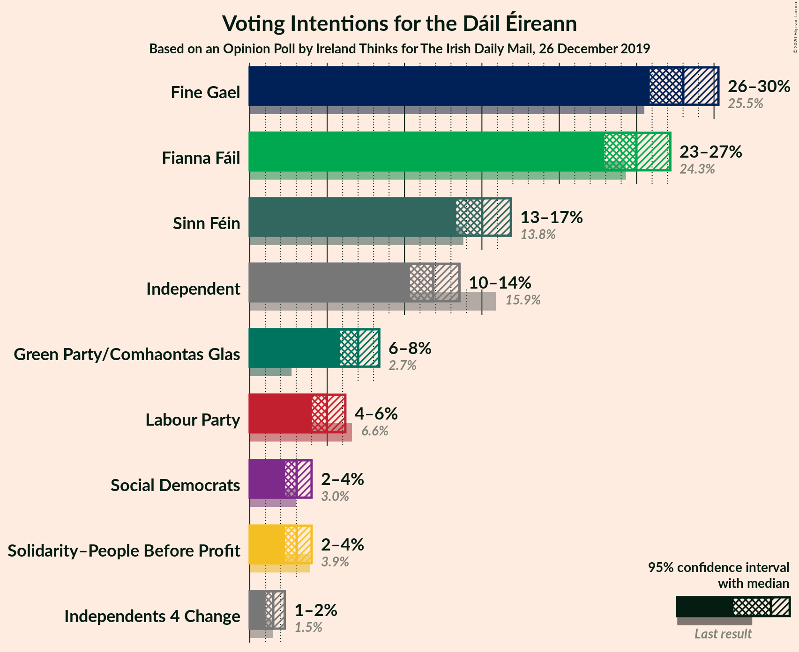
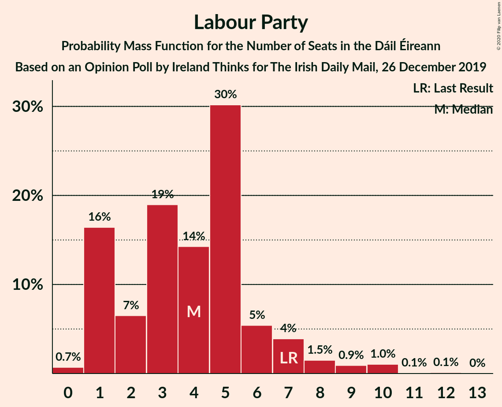

# Opinion Poll by Ireland Thinks for The Irish Daily Mail, 26 December 2019

<a href="#voting-intentions">Voting Intentions</a> | <a href="#seats">Seats</a> | <a href="#coalitions">Coalitions</a> | <a href="#technical-information">Technical Information</a>

## Voting Intentions

### Confidence Intervals

| Party | Last Result | Poll Result | 80% Confidence Interval | 90% Confidence Interval | 95% Confidence Interval | 99% Confidence Interval |
|:-----:|:-----------:|:-----------:|:-----------------------:|:-----------------------:|:-----------------------:|:-----------------------:|
| Fine Gael | 25.5% | 28.0% | 26.6–29.5% |26.2–29.9% |25.8–30.3% |25.2–31.0% |
| Fianna Fáil | 24.3% | 25.0% | 23.6–26.4% |23.2–26.8% |22.9–27.2% |22.3–27.9% |
| Sinn Féin | 13.8% | 15.0% | 13.9–16.2% |13.6–16.6% |13.3–16.9% |12.8–17.5% |
| Independent | 15.9% | 12.4% | 11.4–13.5% |11.1–13.9% |10.9–14.1% |10.4–14.7% |
| Green Party/Comhaontas Glas | 2.7% | 7.0% | 6.2–7.9% |6.0–8.1% |5.8–8.4% |5.5–8.8% |
| Labour Party | 6.6% | 5.0% | 4.3–5.8% |4.2–6.0% |4.0–6.2% |3.7–6.6% |
| Solidarity–People Before Profit | 3.9% | 3.0% | 2.5–3.7% |2.4–3.8% |2.3–4.0% |2.1–4.3% |
| Social Democrats | 3.0% | 3.0% | 2.5–3.7% |2.4–3.8% |2.3–4.0% |2.1–4.3% |
| Independents 4 Change | 1.5% | 1.6% | 1.2–2.1% |1.1–2.2% |1.1–2.3% |0.9–2.6% |

*Note:* The poll result column reflects the actual value used in the calculations. Published results may vary slightly, and in addition be rounded to fewer digits.

## Seats

### Confidence Intervals

| Party | Last Result | Median | 80% Confidence Interval | 90% Confidence Interval | 95% Confidence Interval | 99% Confidence Interval |
|:-----:|:-----------:|:------:|:-----------------------:|:-----------------------:|:-----------------------:|:-----------------------:|
| <a href="#fine-gael">Fine Gael</a> | 49 | 56 | 54–61 |54–63 |53–63 |51–65 |
| <a href="#fianna-fáil">Fianna Fáil</a> | 44 | 54 | 52–55 |51–55 |42–55 |41–56 |
| <a href="#sinn-féin">Sinn Féin</a> | 23 | 21 | 18–22 |18–23 |18–26 |18–28 |
| <a href="#independent">Independent</a> | 19 | 16 | 16–17 |16–17 |15–17 |15–20 |
| <a href="#green-party/comhaontas-glas">Green Party/Comhaontas Glas</a> | 2 | 5 | 3–5 |3–5 |2–5 |2–6 |
| <a href="#labour-party">Labour Party</a> | 7 | 0 | 0–1 |0–1 |0–3 |0–3 |
| <a href="#solidarity–people-before-profit">Solidarity–People Before Profit</a> | 6 | 2 | 1–3 |1–3 |0–4 |0–4 |
| <a href="#social-democrats">Social Democrats</a> | 3 | 3 | 3–4 |3–4 |3–4 |3–4 |
| <a href="#independents-4-change">Independents 4 Change</a> | 4 | 3 | 2–4 |2–4 |1–5 |1–5 |

### Fine Gael

*For a full overview of the results for this party, see the [Fine Gael](party-finegael.html) page.*

| Number of Seats | Probability | Accumulated | Special Marks |
|:---------------:|:-----------:|:-----------:|:-------------:|
| 49 | 0.1% | 100% | Last Result |
| 50 | 0% | 99.9% |  |
| 51 | 1.3% | 99.9% |  |
| 52 | 0.4% | 98.6% |  |
| 53 | 2% | 98% |  |
| 54 | 33% | 97% |  |
| 55 | 6% | 63% |  |
| 56 | 35% | 57% | Median |
| 57 | 0.8% | 22% |  |
| 58 | 3% | 21% |  |
| 59 | 4% | 18% |  |
| 60 | 1.1% | 14% |  |
| 61 | 4% | 13% |  |
| 62 | 2% | 9% |  |
| 63 | 6% | 7% |  |
| 64 | 0.6% | 1.3% |  |
| 65 | 0.3% | 0.7% |  |
| 66 | 0.2% | 0.4% |  |
| 67 | 0.1% | 0.2% |  |
| 68 | 0% | 0.1% |  |
| 69 | 0.1% | 0.1% |  |
| 70 | 0% | 0% |  |

### Fianna Fáil

*For a full overview of the results for this party, see the [Fianna Fáil](party-fiannafáil.html) page.*

| Number of Seats | Probability | Accumulated | Special Marks |
|:---------------:|:-----------:|:-----------:|:-------------:|
| 38 | 0.1% | 100% |  |
| 39 | 0.2% | 99.9% |  |
| 40 | 0.2% | 99.8% |  |
| 41 | 0.2% | 99.6% |  |
| 42 | 2% | 99.4% |  |
| 43 | 0.4% | 97% |  |
| 44 | 0.1% | 97% | Last Result |
| 45 | 0.5% | 97% |  |
| 46 | 0.3% | 96% |  |
| 47 | 0.1% | 96% |  |
| 48 | 0% | 96% |  |
| 49 | 0.1% | 96% |  |
| 50 | 0.1% | 96% |  |
| 51 | 4% | 96% |  |
| 52 | 7% | 92% |  |
| 53 | 13% | 84% |  |
| 54 | 32% | 72% | Median |
| 55 | 40% | 40% |  |
| 56 | 0.5% | 0.6% |  |
| 57 | 0% | 0% |  |

### Sinn Féin

*For a full overview of the results for this party, see the [Sinn Féin](party-sinnféin.html) page.*

| Number of Seats | Probability | Accumulated | Special Marks |
|:---------------:|:-----------:|:-----------:|:-------------:|
| 17 | 0% | 100% |  |
| 18 | 14% | 99.9% |  |
| 19 | 3% | 86% |  |
| 20 | 32% | 83% |  |
| 21 | 35% | 51% | Median |
| 22 | 9% | 16% |  |
| 23 | 3% | 6% | Last Result |
| 24 | 0.5% | 4% |  |
| 25 | 0.5% | 3% |  |
| 26 | 1.0% | 3% |  |
| 27 | 0.7% | 2% |  |
| 28 | 0.8% | 1.0% |  |
| 29 | 0.1% | 0.2% |  |
| 30 | 0.1% | 0.1% |  |
| 31 | 0% | 0% |  |

### Independent

*For a full overview of the results for this party, see the [Independent](party-independent.html) page.*

| Number of Seats | Probability | Accumulated | Special Marks |
|:---------------:|:-----------:|:-----------:|:-------------:|
| 12 | 0% | 100% |  |
| 13 | 0% | 99.9% |  |
| 14 | 0.2% | 99.9% |  |
| 15 | 4% | 99.7% |  |
| 16 | 53% | 96% | Median |
| 17 | 40% | 42% |  |
| 18 | 1.0% | 2% |  |
| 19 | 0.3% | 0.9% | Last Result |
| 20 | 0.3% | 0.6% |  |
| 21 | 0.1% | 0.3% |  |
| 22 | 0.1% | 0.2% |  |
| 23 | 0% | 0% |  |

### Green Party/Comhaontas Glas

*For a full overview of the results for this party, see the [Green Party/Comhaontas Glas](party-greenpartycomhaontasglas.html) page.*

| Number of Seats | Probability | Accumulated | Special Marks |
|:---------------:|:-----------:|:-----------:|:-------------:|
| 2 | 3% | 100% | Last Result |
| 3 | 8% | 97% |  |
| 4 | 7% | 89% |  |
| 5 | 79% | 82% | Median |
| 6 | 2% | 2% |  |
| 7 | 0.4% | 0.4% |  |
| 8 | 0% | 0% |  |

### Labour Party

*For a full overview of the results for this party, see the [Labour Party](party-labourparty.html) page.*

| Number of Seats | Probability | Accumulated | Special Marks |
|:---------------:|:-----------:|:-----------:|:-------------:|
| 0 | 62% | 100% | Median |
| 1 | 35% | 38% |  |
| 2 | 1.1% | 4% |  |
| 3 | 3% | 3% |  |
| 4 | 0% | 0% |  |
| 5 | 0% | 0% |  |
| 6 | 0% | 0% |  |
| 7 | 0% | 0% | Last Result |

### Solidarity–People Before Profit

*For a full overview of the results for this party, see the [Solidarity–People Before Profit](party-solidarity–peoplebeforeprofit.html) page.*

| Number of Seats | Probability | Accumulated | Special Marks |
|:---------------:|:-----------:|:-----------:|:-------------:|
| 0 | 4% | 100% |  |
| 1 | 7% | 96% |  |
| 2 | 54% | 89% | Median |
| 3 | 32% | 35% |  |
| 4 | 4% | 4% |  |
| 5 | 0% | 0% |  |
| 6 | 0% | 0% | Last Result |

### Social Democrats

*For a full overview of the results for this party, see the [Social Democrats](party-socialdemocrats.html) page.*

| Number of Seats | Probability | Accumulated | Special Marks |
|:---------------:|:-----------:|:-----------:|:-------------:|
| 3 | 75% | 100% | Last Result, Median |
| 4 | 25% | 25% |  |
| 5 | 0% | 0% |  |

### Independents 4 Change

*For a full overview of the results for this party, see the [Independents 4 Change](party-independents4change.html) page.*

| Number of Seats | Probability | Accumulated | Special Marks |
|:---------------:|:-----------:|:-----------:|:-------------:|
| 0 | 0.1% | 100% |  |
| 1 | 3% | 99.9% |  |
| 2 | 45% | 97% |  |
| 3 | 36% | 52% | Median |
| 4 | 13% | 16% | Last Result |
| 5 | 3% | 3% |  |
| 6 | 0% | 0% |  |

## Coalitions

### Confidence Intervals

| Coalition | Last Result | Median | Majority? | 80% Confidence Interval | 90% Confidence Interval | 95% Confidence Interval | 99% Confidence Interval |
|:---------:|:-----------:|:------:|:---------:|:-----------------------:|:-----------------------:|:-----------------------:|:-----------------------:|
| Fine Gael – Fianna Fáil | 93 | 110 | 100% | 109–113 | 105–115 | 104–115 | 102–115 |
| Fianna Fáil – Sinn Féin | 67 | 75 | 0.7% | 70–76 | 69–76 | 65–77 | 64–82 |
| Fine Gael – Labour Party | 56 | 56 | 0% | 54–61 | 54–64 | 53–65 | 51–65 |
| Fine Gael | 49 | 56 | 0% | 54–61 | 54–63 | 53–63 | 51–65 |
| Fianna Fáil – Green Party/Comhaontas Glas | 46 | 59 | 0% | 55–60 | 55–60 | 47–60 | 46–61 |

### Fine Gael – Fianna Fáil

| Number of Seats | Probability | Accumulated | Special Marks |
|:---------------:|:-----------:|:-----------:|:-------------:|
| 93 | 0% | 100% | Last Result |
| 94 | 0% | 100% |  |
| 95 | 0% | 100% |  |
| 96 | 0% | 100% |  |
| 97 | 0% | 100% |  |
| 98 | 0% | 100% |  |
| 99 | 0.1% | 99.9% |  |
| 100 | 0.1% | 99.8% |  |
| 101 | 0.2% | 99.7% |  |
| 102 | 0.3% | 99.5% |  |
| 103 | 0.4% | 99.2% |  |
| 104 | 2% | 98.8% |  |
| 105 | 2% | 96% |  |
| 106 | 0.4% | 94% |  |
| 107 | 1.1% | 94% |  |
| 108 | 0.9% | 93% |  |
| 109 | 42% | 92% |  |
| 110 | 32% | 50% | Median |
| 111 | 2% | 18% |  |
| 112 | 5% | 16% |  |
| 113 | 4% | 11% |  |
| 114 | 0.1% | 6% |  |
| 115 | 6% | 6% |  |
| 116 | 0.3% | 0.4% |  |
| 117 | 0% | 0.1% |  |
| 118 | 0% | 0.1% |  |
| 119 | 0% | 0% |  |

### Fianna Fáil – Sinn Féin

| Number of Seats | Probability | Accumulated | Special Marks |
|:---------------:|:-----------:|:-----------:|:-------------:|
| 61 | 0.1% | 100% |  |
| 62 | 0.1% | 99.9% |  |
| 63 | 0.3% | 99.8% |  |
| 64 | 0.1% | 99.5% |  |
| 65 | 2% | 99.4% |  |
| 66 | 0.3% | 97% |  |
| 67 | 0.2% | 97% | Last Result |
| 68 | 0.1% | 97% |  |
| 69 | 4% | 97% |  |
| 70 | 6% | 93% |  |
| 71 | 0.5% | 87% |  |
| 72 | 6% | 86% |  |
| 73 | 3% | 80% |  |
| 74 | 27% | 78% |  |
| 75 | 14% | 50% | Median |
| 76 | 34% | 37% |  |
| 77 | 0.8% | 3% |  |
| 78 | 0.7% | 2% |  |
| 79 | 0.6% | 1.4% |  |
| 80 | 0.1% | 0.8% |  |
| 81 | 0.1% | 0.7% | Majority |
| 82 | 0.6% | 0.6% |  |
| 83 | 0% | 0% |  |

### Fine Gael – Labour Party

| Number of Seats | Probability | Accumulated | Special Marks |
|:---------------:|:-----------:|:-----------:|:-------------:|
| 50 | 0% | 100% |  |
| 51 | 1.2% | 99.9% |  |
| 52 | 0.3% | 98.7% |  |
| 53 | 1.1% | 98% |  |
| 54 | 34% | 97% |  |
| 55 | 6% | 64% |  |
| 56 | 10% | 58% | Last Result, Median |
| 57 | 26% | 48% |  |
| 58 | 4% | 22% |  |
| 59 | 4% | 19% |  |
| 60 | 1.1% | 15% |  |
| 61 | 4% | 14% |  |
| 62 | 1.1% | 10% |  |
| 63 | 0.1% | 9% |  |
| 64 | 6% | 9% |  |
| 65 | 2% | 3% |  |
| 66 | 0.2% | 0.4% |  |
| 67 | 0% | 0.3% |  |
| 68 | 0.1% | 0.2% |  |
| 69 | 0% | 0.1% |  |
| 70 | 0.1% | 0.1% |  |
| 71 | 0% | 0% |  |

### Fine Gael

| Number of Seats | Probability | Accumulated | Special Marks |
|:---------------:|:-----------:|:-----------:|:-------------:|
| 49 | 0.1% | 100% | Last Result |
| 50 | 0% | 99.9% |  |
| 51 | 1.3% | 99.9% |  |
| 52 | 0.4% | 98.6% |  |
| 53 | 2% | 98% |  |
| 54 | 33% | 97% |  |
| 55 | 6% | 63% |  |
| 56 | 35% | 57% | Median |
| 57 | 0.8% | 22% |  |
| 58 | 3% | 21% |  |
| 59 | 4% | 18% |  |
| 60 | 1.1% | 14% |  |
| 61 | 4% | 13% |  |
| 62 | 2% | 9% |  |
| 63 | 6% | 7% |  |
| 64 | 0.6% | 1.3% |  |
| 65 | 0.3% | 0.7% |  |
| 66 | 0.2% | 0.4% |  |
| 67 | 0.1% | 0.2% |  |
| 68 | 0% | 0.1% |  |
| 69 | 0.1% | 0.1% |  |
| 70 | 0% | 0% |  |

### Fianna Fáil – Green Party/Comhaontas Glas

| Number of Seats | Probability | Accumulated | Special Marks |
|:---------------:|:-----------:|:-----------:|:-------------:|
| 42 | 0.1% | 100% |  |
| 43 | 0.1% | 99.9% |  |
| 44 | 0.1% | 99.8% |  |
| 45 | 0.2% | 99.7% |  |
| 46 | 0.3% | 99.6% | Last Result |
| 47 | 2% | 99.2% |  |
| 48 | 0.4% | 97% |  |
| 49 | 0.1% | 97% |  |
| 50 | 0.5% | 97% |  |
| 51 | 0.3% | 96% |  |
| 52 | 0.1% | 96% |  |
| 53 | 0% | 96% |  |
| 54 | 0.2% | 96% |  |
| 55 | 6% | 96% |  |
| 56 | 8% | 89% |  |
| 57 | 3% | 82% |  |
| 58 | 10% | 78% |  |
| 59 | 32% | 69% | Median |
| 60 | 35% | 37% |  |
| 61 | 1.3% | 1.3% |  |
| 62 | 0% | 0% |  |

## Technical Information

### Opinion Poll

+ **Polling firm:** Ireland Thinks
+ **Commissioner(s):** The Irish Daily Mail
+ **Fieldwork period:** 26 December 2019

### Calculations

+ **Sample size:** 1586
+ **Simulations done:** 524,288
+ **Error estimate:** 1.51%

