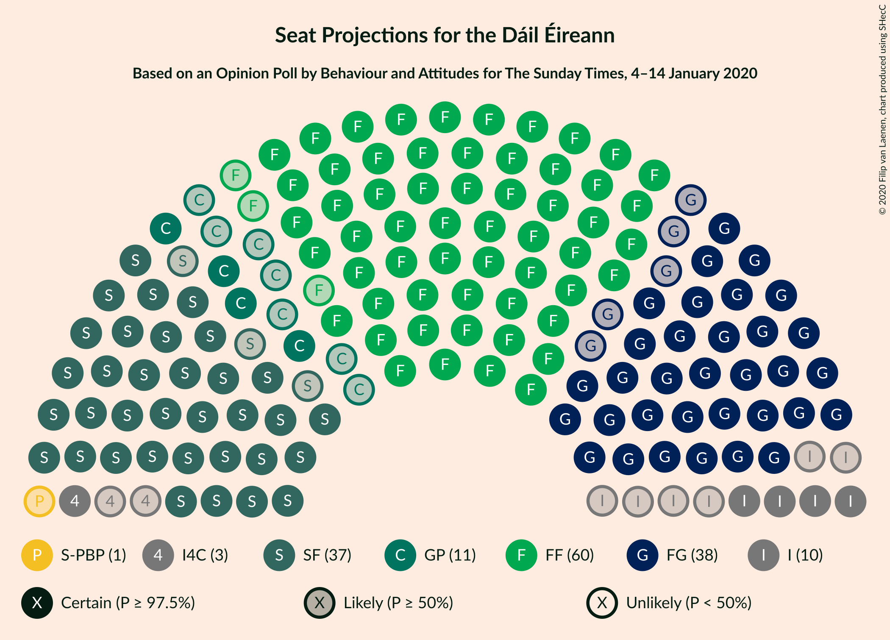
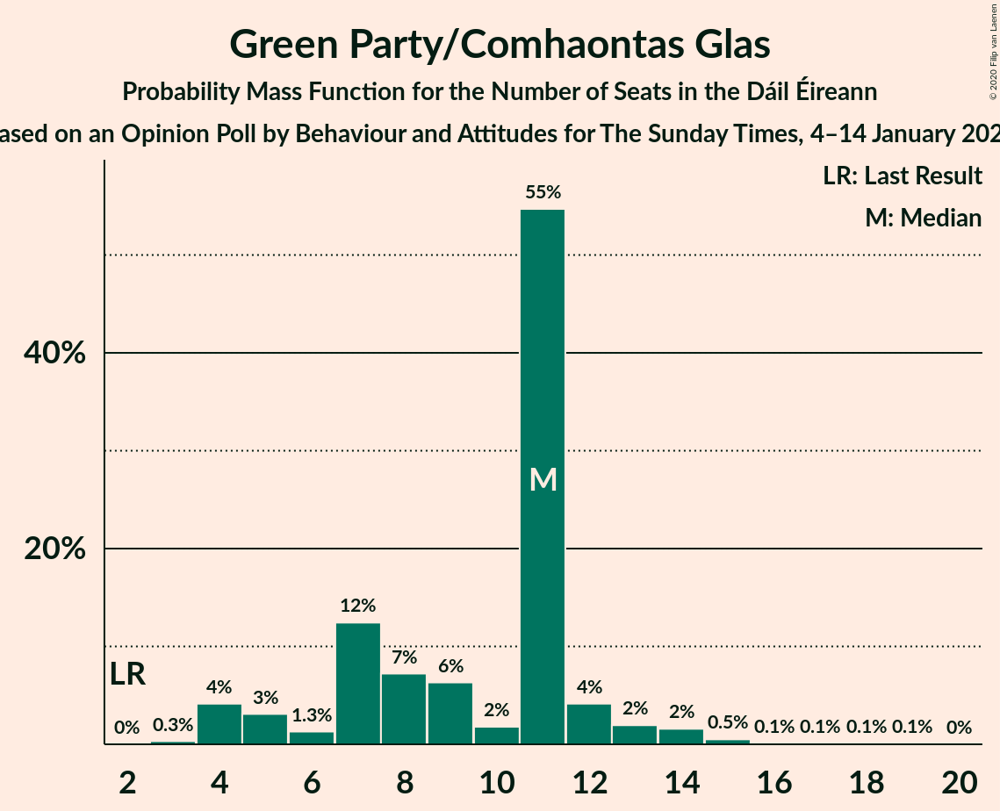

# Opinion Poll by Behaviour and Attitudes, 4–14 January 2020

<a href="#voting-intentions">Voting Intentions</a> | <a href="#seats">Seats</a> | <a href="#coalitions">Coalitions</a> | <a href="#technical-information">Technical Information</a>

## Voting Intentions

### Confidence Intervals

| Party | Last Result | Poll Result | 80% Confidence Interval | 90% Confidence Interval | 95% Confidence Interval | 99% Confidence Interval |
|:-----:|:-----------:|:-----------:|:-----------------------:|:-----------------------:|:-----------------------:|:-----------------------:|
| Fianna Fáil | 24.3% | 32.0% | 30.1–34.0% |29.6–34.6% |29.1–35.1% |28.2–36.1% |
| Fine Gael | 25.5% | 20.0% | 18.4–21.8% |17.9–22.3% |17.5–22.7% |16.8–23.6% |
| Sinn Féin | 13.8% | 19.0% | 17.5–20.8% |17.0–21.3% |16.6–21.7% |15.9–22.5% |
| Independent | 15.9% | 9.2% | 8.1–10.6% |7.8–11.0% |7.5–11.3% |7.0–11.9% |
| Green Party/Comhaontas Glas | 2.7% | 7.0% | 6.0–8.2% |5.7–8.5% |5.5–8.8% |5.1–9.4% |
| Labour Party | 6.6% | 4.0% | 3.3–4.9% |3.1–5.2% |2.9–5.4% |2.6–5.9% |
| Solidarity–People Before Profit | 3.9% | 2.0% | 1.6–2.8% |1.4–3.0% |1.3–3.2% |1.1–3.6% |
| Independents 4 Change | 1.5% | 1.2% | 0.8–1.8% |0.7–2.0% |0.7–2.1% |0.5–2.4% |
| Social Democrats | 3.0% | 1.0% | 0.7–1.5% |0.6–1.7% |0.5–1.8% |0.4–2.1% |
| Renua Ireland | 2.2% | 1.0% | 0.7–1.5% |0.6–1.7% |0.5–1.8% |0.4–2.1% |

*Note:* The poll result column reflects the actual value used in the calculations. Published results may vary slightly, and in addition be rounded to fewer digits.

## Seats

### Confidence Intervals

| Party | Last Result | Median | 80% Confidence Interval | 90% Confidence Interval | 95% Confidence Interval | 99% Confidence Interval |
|:-----:|:-----------:|:------:|:-----------------------:|:-----------------------:|:-----------------------:|:-----------------------:|
| <a href="#fianna-fáil">Fianna Fáil</a> | 44 | 59 | 58–61 |57–62 |57–62 |55–63 |
| <a href="#fine-gael">Fine Gael</a> | 49 | 38 | 34–43 |32–45 |31–45 |29–46 |
| <a href="#sinn-féin">Sinn Féin</a> | 23 | 40 | 38–42 |36–42 |35–43 |33–43 |
| <a href="#independent">Independent</a> | 19 | 8 | 4–9 |4–11 |3–13 |3–14 |
| <a href="#green-party/comhaontas-glas">Green Party/Comhaontas Glas</a> | 2 | 8 | 7–11 |6–11 |6–13 |4–17 |
| <a href="#labour-party">Labour Party</a> | 7 | 1 | 0–4 |0–5 |0–5 |0–7 |
| <a href="#solidarity–people-before-profit">Solidarity–People Before Profit</a> | 6 | 1 | 0–4 |0–5 |0–6 |0–6 |
| <a href="#independents-4-change">Independents 4 Change</a> | 4 | 4 | 0–4 |0–4 |0–4 |0–5 |
| <a href="#social-democrats">Social Democrats</a> | 3 | 0 | 0–3 |0–3 |0–3 |0–3 |
| <a href="#renua-ireland">Renua Ireland</a> | 0 | 0 | 0 |0–1 |0–1 |0–1 |

### Fianna Fáil

*For a full overview of the results for this party, see the [Fianna Fáil](party-fiannafáil.html) page.*

| Number of Seats | Probability | Accumulated | Special Marks |
|:---------------:|:-----------:|:-----------:|:-------------:|
| 44 | 0% | 100% | Last Result |
| 45 | 0% | 100% |  |
| 46 | 0% | 100% |  |
| 47 | 0% | 100% |  |
| 48 | 0% | 100% |  |
| 49 | 0% | 100% |  |
| 50 | 0% | 100% |  |
| 51 | 0% | 100% |  |
| 52 | 0.1% | 100% |  |
| 53 | 0.1% | 99.9% |  |
| 54 | 0.2% | 99.9% |  |
| 55 | 0.7% | 99.7% |  |
| 56 | 0.9% | 99.0% |  |
| 57 | 6% | 98% |  |
| 58 | 12% | 92% |  |
| 59 | 32% | 79% | Median |
| 60 | 28% | 48% |  |
| 61 | 12% | 20% |  |
| 62 | 5% | 7% |  |
| 63 | 2% | 2% |  |
| 64 | 0.1% | 0.1% |  |
| 65 | 0% | 0% |  |

### Fine Gael

*For a full overview of the results for this party, see the [Fine Gael](party-finegael.html) page.*

| Number of Seats | Probability | Accumulated | Special Marks |
|:---------------:|:-----------:|:-----------:|:-------------:|
| 26 | 0.1% | 100% |  |
| 27 | 0% | 99.9% |  |
| 28 | 0.2% | 99.8% |  |
| 29 | 0.5% | 99.7% |  |
| 30 | 1.1% | 99.2% |  |
| 31 | 0.7% | 98% |  |
| 32 | 3% | 97% |  |
| 33 | 3% | 95% |  |
| 34 | 4% | 92% |  |
| 35 | 3% | 89% |  |
| 36 | 7% | 86% |  |
| 37 | 6% | 79% |  |
| 38 | 24% | 73% | Median |
| 39 | 4% | 49% |  |
| 40 | 6% | 45% |  |
| 41 | 11% | 39% |  |
| 42 | 14% | 28% |  |
| 43 | 4% | 14% |  |
| 44 | 5% | 10% |  |
| 45 | 5% | 5% |  |
| 46 | 0.5% | 0.6% |  |
| 47 | 0.1% | 0.2% |  |
| 48 | 0% | 0.1% |  |
| 49 | 0% | 0% | Last Result |

### Sinn Féin

*For a full overview of the results for this party, see the [Sinn Féin](party-sinnféin.html) page.*

| Number of Seats | Probability | Accumulated | Special Marks |
|:---------------:|:-----------:|:-----------:|:-------------:|
| 23 | 0% | 100% | Last Result |
| 24 | 0% | 100% |  |
| 25 | 0% | 100% |  |
| 26 | 0% | 100% |  |
| 27 | 0% | 100% |  |
| 28 | 0% | 100% |  |
| 29 | 0% | 100% |  |
| 30 | 0% | 100% |  |
| 31 | 0.1% | 100% |  |
| 32 | 0.2% | 99.9% |  |
| 33 | 0.2% | 99.7% |  |
| 34 | 0.6% | 99.4% |  |
| 35 | 2% | 98.8% |  |
| 36 | 2% | 97% |  |
| 37 | 4% | 94% |  |
| 38 | 9% | 90% |  |
| 39 | 4% | 82% |  |
| 40 | 28% | 78% | Median |
| 41 | 7% | 50% |  |
| 42 | 38% | 43% |  |
| 43 | 4% | 5% |  |
| 44 | 0.2% | 0.5% |  |
| 45 | 0.1% | 0.2% |  |
| 46 | 0.1% | 0.1% |  |
| 47 | 0% | 0% |  |

### Independent

*For a full overview of the results for this party, see the [Independent](party-independent.html) page.*

| Number of Seats | Probability | Accumulated | Special Marks |
|:---------------:|:-----------:|:-----------:|:-------------:|
| 3 | 4% | 100% |  |
| 4 | 8% | 96% |  |
| 5 | 13% | 88% |  |
| 6 | 16% | 75% |  |
| 7 | 7% | 59% |  |
| 8 | 38% | 52% | Median |
| 9 | 4% | 14% |  |
| 10 | 3% | 10% |  |
| 11 | 2% | 6% |  |
| 12 | 0.9% | 5% |  |
| 13 | 1.5% | 4% |  |
| 14 | 2% | 2% |  |
| 15 | 0.3% | 0.3% |  |
| 16 | 0% | 0% |  |
| 17 | 0% | 0% |  |
| 18 | 0% | 0% |  |
| 19 | 0% | 0% | Last Result |

### Green Party/Comhaontas Glas

*For a full overview of the results for this party, see the [Green Party/Comhaontas Glas](party-greenpartycomhaontasglas.html) page.*

| Number of Seats | Probability | Accumulated | Special Marks |
|:---------------:|:-----------:|:-----------:|:-------------:|
| 2 | 0% | 100% | Last Result |
| 3 | 0.1% | 100% |  |
| 4 | 0.4% | 99.8% |  |
| 5 | 1.4% | 99.4% |  |
| 6 | 6% | 98% |  |
| 7 | 16% | 92% |  |
| 8 | 37% | 76% | Median |
| 9 | 20% | 39% |  |
| 10 | 8% | 18% |  |
| 11 | 6% | 11% |  |
| 12 | 2% | 5% |  |
| 13 | 0.9% | 3% |  |
| 14 | 0.5% | 2% |  |
| 15 | 0.2% | 1.4% |  |
| 16 | 0.5% | 1.1% |  |
| 17 | 0.5% | 0.6% |  |
| 18 | 0.1% | 0.1% |  |
| 19 | 0% | 0% |  |

### Labour Party

*For a full overview of the results for this party, see the [Labour Party](party-labourparty.html) page.*

| Number of Seats | Probability | Accumulated | Special Marks |
|:---------------:|:-----------:|:-----------:|:-------------:|
| 0 | 48% | 100% |  |
| 1 | 26% | 52% | Median |
| 2 | 8% | 26% |  |
| 3 | 3% | 18% |  |
| 4 | 8% | 14% |  |
| 5 | 4% | 6% |  |
| 6 | 1.2% | 2% |  |
| 7 | 0.6% | 0.7% | Last Result |
| 8 | 0% | 0% |  |

### Solidarity–People Before Profit

*For a full overview of the results for this party, see the [Solidarity–People Before Profit](party-solidarity–peoplebeforeprofit.html) page.*

| Number of Seats | Probability | Accumulated | Special Marks |
|:---------------:|:-----------:|:-----------:|:-------------:|
| 0 | 46% | 100% |  |
| 1 | 26% | 54% | Median |
| 2 | 6% | 29% |  |
| 3 | 10% | 22% |  |
| 4 | 5% | 12% |  |
| 5 | 4% | 7% |  |
| 6 | 3% | 3% | Last Result |
| 7 | 0% | 0.1% |  |
| 8 | 0% | 0% |  |

### Independents 4 Change

*For a full overview of the results for this party, see the [Independents 4 Change](party-independents4change.html) page.*

| Number of Seats | Probability | Accumulated | Special Marks |
|:---------------:|:-----------:|:-----------:|:-------------:|
| 0 | 28% | 100% |  |
| 1 | 4% | 72% |  |
| 2 | 3% | 67% |  |
| 3 | 8% | 64% |  |
| 4 | 56% | 56% | Last Result, Median |
| 5 | 0.7% | 0.7% |  |
| 6 | 0% | 0% |  |

### Social Democrats

*For a full overview of the results for this party, see the [Social Democrats](party-socialdemocrats.html) page.*

| Number of Seats | Probability | Accumulated | Special Marks |
|:---------------:|:-----------:|:-----------:|:-------------:|
| 0 | 78% | 100% | Median |
| 1 | 3% | 22% |  |
| 2 | 4% | 19% |  |
| 3 | 15% | 15% | Last Result |
| 4 | 0.1% | 0.1% |  |
| 5 | 0% | 0% |  |

### Renua Ireland

*For a full overview of the results for this party, see the [Renua Ireland](party-renuaireland.html) page.*

| Number of Seats | Probability | Accumulated | Special Marks |
|:---------------:|:-----------:|:-----------:|:-------------:|
| 0 | 95% | 100% | Last Result, Median |
| 1 | 5% | 5% |  |
| 2 | 0% | 0% |  |

## Coalitions

### Confidence Intervals

| Coalition | Last Result | Median | Majority? | 80% Confidence Interval | 90% Confidence Interval | 95% Confidence Interval | 99% Confidence Interval |
|:---------:|:-----------:|:------:|:---------:|:-----------------------:|:-----------------------:|:-----------------------:|:-----------------------:|
| Fianna Fáil – Sinn Féin | 67 | 100 | 100% | 96–102 | 95–103 | 95–104 | 91–105 |
| Fianna Fáil – Fine Gael | 93 | 98 | 100% | 94–102 | 92–103 | 91–104 | 90–106 |
| Fianna Fáil – Green Party/Comhaontas Glas – Labour Party – Social Democrats | 56 | 69 | 0.5% | 67–74 | 66–75 | 66–76 | 65–79 |
| Fianna Fáil – Green Party/Comhaontas Glas – Labour Party | 53 | 68 | 0.4% | 66–73 | 66–75 | 65–75 | 63–79 |
| Fianna Fáil – Green Party/Comhaontas Glas | 46 | 68 | 0% | 65–70 | 65–73 | 64–73 | 63–77 |
| Fianna Fáil – Labour Party | 51 | 60 | 0% | 58–64 | 58–65 | 57–66 | 55–67 |
| Fine Gael – Green Party/Comhaontas Glas – Labour Party – Social Democrats | 61 | 49 | 0% | 45–54 | 43–56 | 42–57 | 40–59 |
| Fine Gael – Green Party/Comhaontas Glas – Labour Party | 58 | 48 | 0% | 45–53 | 43–54 | 41–56 | 39–59 |
| Fine Gael – Green Party/Comhaontas Glas | 51 | 47 | 0% | 42–52 | 41–53 | 40–55 | 38–57 |
| Fine Gael – Labour Party | 56 | 40 | 0% | 36–45 | 34–46 | 33–47 | 31–48 |
| Fine Gael | 49 | 38 | 0% | 34–43 | 32–45 | 31–45 | 29–46 |

### Fianna Fáil – Sinn Féin

| Number of Seats | Probability | Accumulated | Special Marks |
|:---------------:|:-----------:|:-----------:|:-------------:|
| 67 | 0% | 100% | Last Result |
| 68 | 0% | 100% |  |
| 69 | 0% | 100% |  |
| 70 | 0% | 100% |  |
| 71 | 0% | 100% |  |
| 72 | 0% | 100% |  |
| 73 | 0% | 100% |  |
| 74 | 0% | 100% |  |
| 75 | 0% | 100% |  |
| 76 | 0% | 100% |  |
| 77 | 0% | 100% |  |
| 78 | 0% | 100% |  |
| 79 | 0% | 100% |  |
| 80 | 0% | 100% |  |
| 81 | 0% | 100% | Majority |
| 82 | 0% | 100% |  |
| 83 | 0% | 100% |  |
| 84 | 0% | 100% |  |
| 85 | 0% | 100% |  |
| 86 | 0% | 100% |  |
| 87 | 0% | 100% |  |
| 88 | 0% | 100% |  |
| 89 | 0% | 99.9% |  |
| 90 | 0.2% | 99.9% |  |
| 91 | 0.2% | 99.7% |  |
| 92 | 0.3% | 99.5% |  |
| 93 | 0.6% | 99.2% |  |
| 94 | 0.7% | 98.6% |  |
| 95 | 4% | 98% |  |
| 96 | 7% | 94% |  |
| 97 | 6% | 88% |  |
| 98 | 9% | 82% |  |
| 99 | 18% | 73% | Median |
| 100 | 8% | 55% |  |
| 101 | 10% | 47% |  |
| 102 | 29% | 37% |  |
| 103 | 5% | 8% |  |
| 104 | 2% | 3% |  |
| 105 | 0.5% | 0.7% |  |
| 106 | 0.2% | 0.2% |  |
| 107 | 0.1% | 0.1% |  |
| 108 | 0% | 0% |  |

### Fianna Fáil – Fine Gael

| Number of Seats | Probability | Accumulated | Special Marks |
|:---------------:|:-----------:|:-----------:|:-------------:|
| 86 | 0% | 100% |  |
| 87 | 0.1% | 99.9% |  |
| 88 | 0.1% | 99.8% |  |
| 89 | 0.2% | 99.7% |  |
| 90 | 0.8% | 99.5% |  |
| 91 | 2% | 98.7% |  |
| 92 | 2% | 97% |  |
| 93 | 4% | 95% | Last Result |
| 94 | 4% | 91% |  |
| 95 | 5% | 88% |  |
| 96 | 4% | 82% |  |
| 97 | 7% | 78% | Median |
| 98 | 26% | 71% |  |
| 99 | 8% | 44% |  |
| 100 | 7% | 37% |  |
| 101 | 13% | 30% |  |
| 102 | 9% | 17% |  |
| 103 | 5% | 8% |  |
| 104 | 2% | 4% |  |
| 105 | 0.6% | 1.4% |  |
| 106 | 0.6% | 0.8% |  |
| 107 | 0.1% | 0.1% |  |
| 108 | 0% | 0.1% |  |
| 109 | 0% | 0% |  |

### Fianna Fáil – Green Party/Comhaontas Glas – Labour Party – Social Democrats

| Number of Seats | Probability | Accumulated | Special Marks |
|:---------------:|:-----------:|:-----------:|:-------------:|
| 56 | 0% | 100% | Last Result |
| 57 | 0% | 100% |  |
| 58 | 0% | 100% |  |
| 59 | 0% | 100% |  |
| 60 | 0% | 100% |  |
| 61 | 0% | 100% |  |
| 62 | 0% | 100% |  |
| 63 | 0.1% | 100% |  |
| 64 | 0.2% | 99.8% |  |
| 65 | 1.0% | 99.7% |  |
| 66 | 7% | 98.6% |  |
| 67 | 8% | 91% |  |
| 68 | 26% | 83% | Median |
| 69 | 21% | 57% |  |
| 70 | 7% | 37% |  |
| 71 | 8% | 30% |  |
| 72 | 5% | 21% |  |
| 73 | 6% | 17% |  |
| 74 | 4% | 11% |  |
| 75 | 3% | 7% |  |
| 76 | 2% | 4% |  |
| 77 | 0.6% | 2% |  |
| 78 | 0.2% | 1.0% |  |
| 79 | 0.3% | 0.8% |  |
| 80 | 0% | 0.5% |  |
| 81 | 0.1% | 0.5% | Majority |
| 82 | 0.1% | 0.4% |  |
| 83 | 0% | 0.3% |  |
| 84 | 0.2% | 0.2% |  |
| 85 | 0% | 0% |  |

### Fianna Fáil – Green Party/Comhaontas Glas – Labour Party

| Number of Seats | Probability | Accumulated | Special Marks |
|:---------------:|:-----------:|:-----------:|:-------------:|
| 53 | 0% | 100% | Last Result |
| 54 | 0% | 100% |  |
| 55 | 0% | 100% |  |
| 56 | 0% | 100% |  |
| 57 | 0% | 100% |  |
| 58 | 0% | 100% |  |
| 59 | 0% | 100% |  |
| 60 | 0% | 100% |  |
| 61 | 0% | 100% |  |
| 62 | 0.1% | 100% |  |
| 63 | 0.5% | 99.9% |  |
| 64 | 0.9% | 99.4% |  |
| 65 | 2% | 98.5% |  |
| 66 | 11% | 97% |  |
| 67 | 11% | 86% |  |
| 68 | 25% | 75% | Median |
| 69 | 19% | 50% |  |
| 70 | 7% | 30% |  |
| 71 | 9% | 23% |  |
| 72 | 3% | 15% |  |
| 73 | 3% | 12% |  |
| 74 | 4% | 9% |  |
| 75 | 3% | 5% |  |
| 76 | 1.3% | 2% |  |
| 77 | 0.4% | 1.1% |  |
| 78 | 0.1% | 0.6% |  |
| 79 | 0.2% | 0.6% |  |
| 80 | 0% | 0.4% |  |
| 81 | 0% | 0.4% | Majority |
| 82 | 0.1% | 0.3% |  |
| 83 | 0% | 0.2% |  |
| 84 | 0.2% | 0.2% |  |
| 85 | 0% | 0% |  |

### Fianna Fáil – Green Party/Comhaontas Glas

| Number of Seats | Probability | Accumulated | Special Marks |
|:---------------:|:-----------:|:-----------:|:-------------:|
| 46 | 0% | 100% | Last Result |
| 47 | 0% | 100% |  |
| 48 | 0% | 100% |  |
| 49 | 0% | 100% |  |
| 50 | 0% | 100% |  |
| 51 | 0% | 100% |  |
| 52 | 0% | 100% |  |
| 53 | 0% | 100% |  |
| 54 | 0% | 100% |  |
| 55 | 0% | 100% |  |
| 56 | 0% | 100% |  |
| 57 | 0% | 100% |  |
| 58 | 0% | 100% |  |
| 59 | 0.1% | 100% |  |
| 60 | 0.1% | 99.9% |  |
| 61 | 0.1% | 99.8% |  |
| 62 | 0.2% | 99.8% |  |
| 63 | 0.8% | 99.6% |  |
| 64 | 4% | 98.7% |  |
| 65 | 6% | 95% |  |
| 66 | 12% | 89% |  |
| 67 | 15% | 77% | Median |
| 68 | 40% | 62% |  |
| 69 | 4% | 22% |  |
| 70 | 7% | 17% |  |
| 71 | 3% | 10% |  |
| 72 | 2% | 7% |  |
| 73 | 4% | 6% |  |
| 74 | 0.6% | 2% |  |
| 75 | 0.4% | 1.2% |  |
| 76 | 0.4% | 0.9% |  |
| 77 | 0.1% | 0.5% |  |
| 78 | 0.1% | 0.4% |  |
| 79 | 0.3% | 0.3% |  |
| 80 | 0% | 0% |  |

### Fianna Fáil – Labour Party

| Number of Seats | Probability | Accumulated | Special Marks |
|:---------------:|:-----------:|:-----------:|:-------------:|
| 51 | 0% | 100% | Last Result |
| 52 | 0% | 100% |  |
| 53 | 0% | 100% |  |
| 54 | 0.1% | 100% |  |
| 55 | 0.5% | 99.9% |  |
| 56 | 0.3% | 99.4% |  |
| 57 | 3% | 99.2% |  |
| 58 | 9% | 96% |  |
| 59 | 16% | 87% |  |
| 60 | 37% | 71% | Median |
| 61 | 8% | 34% |  |
| 62 | 5% | 26% |  |
| 63 | 6% | 21% |  |
| 64 | 6% | 15% |  |
| 65 | 5% | 9% |  |
| 66 | 2% | 3% |  |
| 67 | 0.7% | 0.8% |  |
| 68 | 0.1% | 0.1% |  |
| 69 | 0% | 0% |  |

### Fine Gael – Green Party/Comhaontas Glas – Labour Party – Social Democrats

| Number of Seats | Probability | Accumulated | Special Marks |
|:---------------:|:-----------:|:-----------:|:-------------:|
| 37 | 0.1% | 100% |  |
| 38 | 0.1% | 99.9% |  |
| 39 | 0.1% | 99.8% |  |
| 40 | 1.2% | 99.7% |  |
| 41 | 0.2% | 98% |  |
| 42 | 1.4% | 98% |  |
| 43 | 2% | 97% |  |
| 44 | 3% | 95% |  |
| 45 | 6% | 92% |  |
| 46 | 23% | 86% |  |
| 47 | 5% | 64% | Median |
| 48 | 4% | 59% |  |
| 49 | 7% | 54% |  |
| 50 | 5% | 48% |  |
| 51 | 8% | 42% |  |
| 52 | 17% | 35% |  |
| 53 | 6% | 17% |  |
| 54 | 3% | 12% |  |
| 55 | 3% | 8% |  |
| 56 | 2% | 5% |  |
| 57 | 2% | 3% |  |
| 58 | 0.3% | 1.2% |  |
| 59 | 0.4% | 0.8% |  |
| 60 | 0.3% | 0.4% |  |
| 61 | 0% | 0.1% | Last Result |
| 62 | 0.1% | 0.1% |  |
| 63 | 0% | 0% |  |

### Fine Gael – Green Party/Comhaontas Glas – Labour Party

| Number of Seats | Probability | Accumulated | Special Marks |
|:---------------:|:-----------:|:-----------:|:-------------:|
| 36 | 0% | 100% |  |
| 37 | 0.1% | 99.9% |  |
| 38 | 0.1% | 99.9% |  |
| 39 | 0.3% | 99.8% |  |
| 40 | 1.4% | 99.4% |  |
| 41 | 0.6% | 98% |  |
| 42 | 2% | 97% |  |
| 43 | 3% | 96% |  |
| 44 | 3% | 93% |  |
| 45 | 6% | 90% |  |
| 46 | 23% | 84% |  |
| 47 | 6% | 61% | Median |
| 48 | 6% | 56% |  |
| 49 | 8% | 49% |  |
| 50 | 5% | 41% |  |
| 51 | 7% | 36% |  |
| 52 | 17% | 29% |  |
| 53 | 5% | 12% |  |
| 54 | 3% | 7% |  |
| 55 | 0.6% | 4% |  |
| 56 | 1.3% | 4% |  |
| 57 | 1.5% | 2% |  |
| 58 | 0.2% | 0.8% | Last Result |
| 59 | 0.3% | 0.5% |  |
| 60 | 0.2% | 0.3% |  |
| 61 | 0% | 0% |  |

### Fine Gael – Green Party/Comhaontas Glas

| Number of Seats | Probability | Accumulated | Special Marks |
|:---------------:|:-----------:|:-----------:|:-------------:|
| 35 | 0.1% | 100% |  |
| 36 | 0.2% | 99.8% |  |
| 37 | 0.1% | 99.6% |  |
| 38 | 0.2% | 99.5% |  |
| 39 | 0.6% | 99.3% |  |
| 40 | 2% | 98.6% |  |
| 41 | 3% | 96% |  |
| 42 | 5% | 93% |  |
| 43 | 2% | 88% |  |
| 44 | 3% | 86% |  |
| 45 | 5% | 83% |  |
| 46 | 24% | 78% | Median |
| 47 | 10% | 54% |  |
| 48 | 8% | 44% |  |
| 49 | 5% | 36% |  |
| 50 | 5% | 32% |  |
| 51 | 15% | 27% | Last Result |
| 52 | 6% | 12% |  |
| 53 | 1.4% | 5% |  |
| 54 | 1.3% | 4% |  |
| 55 | 0.4% | 3% |  |
| 56 | 0.3% | 2% |  |
| 57 | 1.5% | 2% |  |
| 58 | 0.1% | 0.5% |  |
| 59 | 0.4% | 0.4% |  |
| 60 | 0% | 0% |  |

### Fine Gael – Labour Party

| Number of Seats | Probability | Accumulated | Special Marks |
|:---------------:|:-----------:|:-----------:|:-------------:|
| 28 | 0% | 100% |  |
| 29 | 0.1% | 99.9% |  |
| 30 | 0.2% | 99.9% |  |
| 31 | 0.4% | 99.7% |  |
| 32 | 0.7% | 99.2% |  |
| 33 | 2% | 98.6% |  |
| 34 | 2% | 97% |  |
| 35 | 3% | 95% |  |
| 36 | 5% | 91% |  |
| 37 | 4% | 86% |  |
| 38 | 27% | 82% |  |
| 39 | 3% | 55% | Median |
| 40 | 6% | 52% |  |
| 41 | 7% | 46% |  |
| 42 | 6% | 39% |  |
| 43 | 15% | 33% |  |
| 44 | 6% | 18% |  |
| 45 | 5% | 12% |  |
| 46 | 3% | 7% |  |
| 47 | 2% | 3% |  |
| 48 | 1.2% | 1.4% |  |
| 49 | 0.1% | 0.2% |  |
| 50 | 0% | 0.1% |  |
| 51 | 0% | 0% |  |
| 52 | 0% | 0% |  |
| 53 | 0% | 0% |  |
| 54 | 0% | 0% |  |
| 55 | 0% | 0% |  |
| 56 | 0% | 0% | Last Result |

### Fine Gael

| Number of Seats | Probability | Accumulated | Special Marks |
|:---------------:|:-----------:|:-----------:|:-------------:|
| 26 | 0.1% | 100% |  |
| 27 | 0% | 99.9% |  |
| 28 | 0.2% | 99.8% |  |
| 29 | 0.5% | 99.7% |  |
| 30 | 1.1% | 99.2% |  |
| 31 | 0.7% | 98% |  |
| 32 | 3% | 97% |  |
| 33 | 3% | 95% |  |
| 34 | 4% | 92% |  |
| 35 | 3% | 89% |  |
| 36 | 7% | 86% |  |
| 37 | 6% | 79% |  |
| 38 | 24% | 73% | Median |
| 39 | 4% | 49% |  |
| 40 | 6% | 45% |  |
| 41 | 11% | 39% |  |
| 42 | 14% | 28% |  |
| 43 | 4% | 14% |  |
| 44 | 5% | 10% |  |
| 45 | 5% | 5% |  |
| 46 | 0.5% | 0.6% |  |
| 47 | 0.1% | 0.2% |  |
| 48 | 0% | 0.1% |  |
| 49 | 0% | 0% | Last Result |

## Technical Information

### Opinion Poll

+ **Polling firm:** Behaviour and Attitudes
+ **Commissioner(s):** —
+ **Fieldwork period:** 4–14 January 2020

### Calculations

+ **Sample size:** 930
+ **Simulations done:** 1,048,576
+ **Error estimate:** 2.42%

