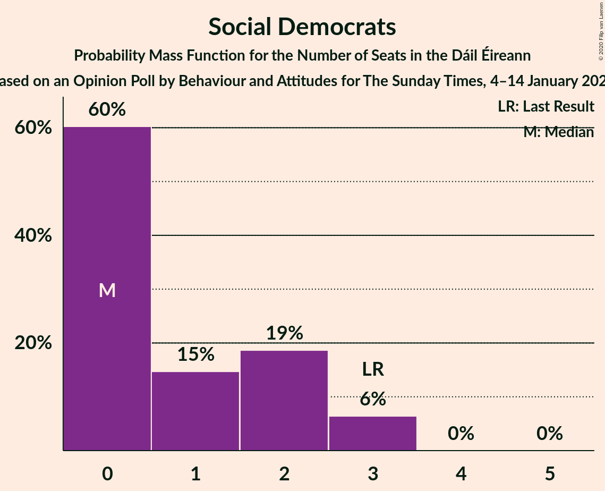

# Opinion Poll by Behaviour and Attitudes, 4–14 January 2020

<a href="#voting-intentions">Voting Intentions</a> | <a href="#seats">Seats</a> | <a href="#coalitions">Coalitions</a> | <a href="#technical-information">Technical Information</a>

## Voting Intentions

### Confidence Intervals

| Party | Last Result | Poll Result | 80% Confidence Interval | 90% Confidence Interval | 95% Confidence Interval | 99% Confidence Interval |
|:-----:|:-----------:|:-----------:|:-----------------------:|:-----------------------:|:-----------------------:|:-----------------------:|
| Fianna Fáil | 24.3% | 32.0% | 30.1–34.0% |29.6–34.6% |29.1–35.1% |28.2–36.1% |
| Fine Gael | 25.5% | 20.0% | 18.4–21.8% |17.9–22.3% |17.5–22.7% |16.8–23.6% |
| Sinn Féin | 13.8% | 19.0% | 17.5–20.8% |17.0–21.3% |16.6–21.7% |15.9–22.5% |
| Independent | 15.9% | 9.2% | 8.6–11.1% |8.3–11.5% |8.0–11.9% |7.5–12.6% |
| Green Party/Comhaontas Glas | 2.7% | 7.0% | 6.0–8.2% |5.7–8.5% |5.5–8.8% |5.1–9.4% |
| Labour Party | 6.6% | 4.0% | 3.3–4.9% |3.1–5.2% |2.9–5.4% |2.6–5.9% |
| Solidarity–People Before Profit | 3.9% | 2.0% | 1.6–2.8% |1.4–3.0% |1.3–3.2% |1.1–3.6% |
| Independents 4 Change | 1.5% | 1.2% | 0.8–1.8% |0.7–2.0% |0.7–2.1% |0.5–2.4% |
| Social Democrats | 3.0% | 1.0% | 0.7–1.5% |0.6–1.7% |0.5–1.8% |0.4–2.1% |
| Renua Ireland | 2.2% | 1.0% | 0.7–1.5% |0.6–1.7% |0.5–1.8% |0.4–2.1% |

*Note:* The poll result column reflects the actual value used in the calculations. Published results may vary slightly, and in addition be rounded to fewer digits.

## Seats

### Confidence Intervals

| Party | Last Result | Median | 80% Confidence Interval | 90% Confidence Interval | 95% Confidence Interval | 99% Confidence Interval |
|:-----:|:-----------:|:------:|:-----------------------:|:-----------------------:|:-----------------------:|:-----------------------:|
| <a href="#fianna-fáil">Fianna Fáil</a> | 44 | 60 | 58–61 |56–61 |55–62 |53–62 |
| <a href="#fine-gael">Fine Gael</a> | 49 | 40 | 36–43 |34–43 |31–44 |29–45 |
| <a href="#sinn-féin">Sinn Féin</a> | 23 | 41 | 35–42 |35–42 |35–43 |33–43 |
| <a href="#independent">Independent</a> | 19 | 8 | 5–10 |4–11 |4–11 |3–15 |
| <a href="#green-party/comhaontas-glas">Green Party/Comhaontas Glas</a> | 2 | 7 | 7–10 |6–10 |5–12 |4–15 |
| <a href="#labour-party">Labour Party</a> | 7 | 1 | 0–3 |0–4 |0–4 |0–5 |
| <a href="#solidarity–people-before-profit">Solidarity–People Before Profit</a> | 6 | 3 | 0–5 |0–5 |0–5 |0–6 |
| <a href="#independents-4-change">Independents 4 Change</a> | 4 | 1 | 0–4 |0–4 |0–4 |0–5 |
| <a href="#social-democrats">Social Democrats</a> | 3 | 0 | 0–3 |0–3 |0–3 |0–3 |
| <a href="#renua-ireland">Renua Ireland</a> | 0 | 0 | 0 |0 |0–1 |0–1 |

### Fianna Fáil

*For a full overview of the results for this party, see the [Fianna Fáil](party-fiannafáil.html) page.*

| Number of Seats | Probability | Accumulated | Special Marks |
|:---------------:|:-----------:|:-----------:|:-------------:|
| 44 | 0% | 100% | Last Result |
| 45 | 0% | 100% |  |
| 46 | 0% | 100% |  |
| 47 | 0% | 100% |  |
| 48 | 0% | 100% |  |
| 49 | 0% | 100% |  |
| 50 | 0% | 100% |  |
| 51 | 0% | 100% |  |
| 52 | 0.1% | 100% |  |
| 53 | 1.2% | 99.9% |  |
| 54 | 0.6% | 98.7% |  |
| 55 | 0.7% | 98% |  |
| 56 | 4% | 97% |  |
| 57 | 3% | 93% |  |
| 58 | 7% | 90% |  |
| 59 | 20% | 83% |  |
| 60 | 42% | 63% | Median |
| 61 | 19% | 21% |  |
| 62 | 2% | 3% |  |
| 63 | 0.3% | 0.4% |  |
| 64 | 0.1% | 0.1% |  |
| 65 | 0% | 0% |  |

### Fine Gael

*For a full overview of the results for this party, see the [Fine Gael](party-finegael.html) page.*

| Number of Seats | Probability | Accumulated | Special Marks |
|:---------------:|:-----------:|:-----------:|:-------------:|
| 25 | 0% | 100% |  |
| 26 | 0.2% | 99.9% |  |
| 27 | 0% | 99.7% |  |
| 28 | 0.1% | 99.7% |  |
| 29 | 0.1% | 99.6% |  |
| 30 | 0.4% | 99.5% |  |
| 31 | 2% | 99.0% |  |
| 32 | 0.7% | 97% |  |
| 33 | 0.6% | 97% |  |
| 34 | 3% | 96% |  |
| 35 | 0.9% | 93% |  |
| 36 | 25% | 92% |  |
| 37 | 8% | 68% |  |
| 38 | 4% | 60% |  |
| 39 | 4% | 56% |  |
| 40 | 19% | 52% | Median |
| 41 | 15% | 34% |  |
| 42 | 8% | 18% |  |
| 43 | 6% | 10% |  |
| 44 | 3% | 4% |  |
| 45 | 1.4% | 2% |  |
| 46 | 0.2% | 0.2% |  |
| 47 | 0% | 0% |  |
| 48 | 0% | 0% |  |
| 49 | 0% | 0% | Last Result |

### Sinn Féin

*For a full overview of the results for this party, see the [Sinn Féin](party-sinnféin.html) page.*

| Number of Seats | Probability | Accumulated | Special Marks |
|:---------------:|:-----------:|:-----------:|:-------------:|
| 23 | 0% | 100% | Last Result |
| 24 | 0% | 100% |  |
| 25 | 0% | 100% |  |
| 26 | 0% | 100% |  |
| 27 | 0% | 100% |  |
| 28 | 0% | 100% |  |
| 29 | 0% | 100% |  |
| 30 | 0% | 100% |  |
| 31 | 0.1% | 100% |  |
| 32 | 0.2% | 99.9% |  |
| 33 | 1.0% | 99.7% |  |
| 34 | 0.6% | 98.6% |  |
| 35 | 9% | 98% |  |
| 36 | 4% | 89% |  |
| 37 | 3% | 85% |  |
| 38 | 19% | 82% |  |
| 39 | 5% | 63% |  |
| 40 | 5% | 58% |  |
| 41 | 21% | 53% | Median |
| 42 | 29% | 32% |  |
| 43 | 3% | 3% |  |
| 44 | 0.1% | 0.3% |  |
| 45 | 0.1% | 0.2% |  |
| 46 | 0.1% | 0.1% |  |
| 47 | 0% | 0% |  |

### Independent

*For a full overview of the results for this party, see the [Independent](party-independent.html) page.*

| Number of Seats | Probability | Accumulated | Special Marks |
|:---------------:|:-----------:|:-----------:|:-------------:|
| 3 | 2% | 100% |  |
| 4 | 5% | 98% |  |
| 5 | 13% | 94% |  |
| 6 | 7% | 80% |  |
| 7 | 20% | 74% |  |
| 8 | 31% | 53% | Median |
| 9 | 5% | 23% |  |
| 10 | 11% | 17% |  |
| 11 | 4% | 6% |  |
| 12 | 0.7% | 2% |  |
| 13 | 0.5% | 2% |  |
| 14 | 0.5% | 1.2% |  |
| 15 | 0.5% | 0.7% |  |
| 16 | 0.2% | 0.2% |  |
| 17 | 0% | 0% |  |
| 18 | 0% | 0% |  |
| 19 | 0% | 0% | Last Result |

### Green Party/Comhaontas Glas

*For a full overview of the results for this party, see the [Green Party/Comhaontas Glas](party-greenpartycomhaontasglas.html) page.*

| Number of Seats | Probability | Accumulated | Special Marks |
|:---------------:|:-----------:|:-----------:|:-------------:|
| 2 | 0% | 100% | Last Result |
| 3 | 0.1% | 100% |  |
| 4 | 0.6% | 99.9% |  |
| 5 | 4% | 99.2% |  |
| 6 | 2% | 96% |  |
| 7 | 62% | 93% | Median |
| 8 | 7% | 31% |  |
| 9 | 6% | 24% |  |
| 10 | 13% | 17% |  |
| 11 | 2% | 5% |  |
| 12 | 0.4% | 3% |  |
| 13 | 1.3% | 2% |  |
| 14 | 0.5% | 1.1% |  |
| 15 | 0.3% | 0.6% |  |
| 16 | 0.1% | 0.3% |  |
| 17 | 0.2% | 0.2% |  |
| 18 | 0% | 0% |  |

### Labour Party

*For a full overview of the results for this party, see the [Labour Party](party-labourparty.html) page.*

| Number of Seats | Probability | Accumulated | Special Marks |
|:---------------:|:-----------:|:-----------:|:-------------:|
| 0 | 19% | 100% |  |
| 1 | 59% | 81% | Median |
| 2 | 9% | 21% |  |
| 3 | 5% | 12% |  |
| 4 | 7% | 8% |  |
| 5 | 0.6% | 1.0% |  |
| 6 | 0.3% | 0.4% |  |
| 7 | 0.1% | 0.2% | Last Result |
| 8 | 0.1% | 0.1% |  |
| 9 | 0% | 0% |  |

### Solidarity–People Before Profit

*For a full overview of the results for this party, see the [Solidarity–People Before Profit](party-solidarity–peoplebeforeprofit.html) page.*

| Number of Seats | Probability | Accumulated | Special Marks |
|:---------------:|:-----------:|:-----------:|:-------------:|
| 0 | 28% | 100% |  |
| 1 | 3% | 72% |  |
| 2 | 16% | 69% |  |
| 3 | 9% | 53% | Median |
| 4 | 10% | 44% |  |
| 5 | 33% | 34% |  |
| 6 | 1.0% | 1.1% | Last Result |
| 7 | 0% | 0% |  |

### Independents 4 Change

*For a full overview of the results for this party, see the [Independents 4 Change](party-independents4change.html) page.*

| Number of Seats | Probability | Accumulated | Special Marks |
|:---------------:|:-----------:|:-----------:|:-------------:|
| 0 | 30% | 100% |  |
| 1 | 23% | 70% | Median |
| 2 | 2% | 47% |  |
| 3 | 2% | 45% |  |
| 4 | 41% | 43% | Last Result |
| 5 | 2% | 2% |  |
| 6 | 0% | 0% |  |

### Social Democrats

*For a full overview of the results for this party, see the [Social Democrats](party-socialdemocrats.html) page.*

| Number of Seats | Probability | Accumulated | Special Marks |
|:---------------:|:-----------:|:-----------:|:-------------:|
| 0 | 61% | 100% | Median |
| 1 | 8% | 39% |  |
| 2 | 19% | 31% |  |
| 3 | 12% | 12% | Last Result |
| 4 | 0.1% | 0.1% |  |
| 5 | 0% | 0% |  |

### Renua Ireland

*For a full overview of the results for this party, see the [Renua Ireland](party-renuaireland.html) page.*

| Number of Seats | Probability | Accumulated | Special Marks |
|:---------------:|:-----------:|:-----------:|:-------------:|
| 0 | 96% | 100% | Last Result, Median |
| 1 | 4% | 4% |  |
| 2 | 0% | 0% |  |

## Coalitions

### Confidence Intervals

| Coalition | Last Result | Median | Majority? | 80% Confidence Interval | 90% Confidence Interval | 95% Confidence Interval | 99% Confidence Interval |
|:---------:|:-----------:|:------:|:---------:|:-----------------------:|:-----------------------:|:-----------------------:|:-----------------------:|
| Fianna Fáil – Fine Gael | 93 | 97 | 100% | 95–102 | 93–102 | 91–103 | 88–106 |
| Fianna Fáil – Sinn Féin | 67 | 99 | 100% | 95–102 | 94–102 | 93–102 | 91–104 |
| Fianna Fáil – Green Party/Comhaontas Glas – Labour Party – Social Democrats | 56 | 69 | 0.1% | 67–73 | 66–75 | 65–77 | 63–78 |
| Fianna Fáil – Green Party/Comhaontas Glas – Labour Party | 53 | 68 | 0.1% | 66–71 | 66–73 | 64–74 | 62–77 |
| Fianna Fáil – Green Party/Comhaontas Glas | 46 | 67 | 0% | 65–70 | 64–70 | 62–72 | 60–75 |
| Fianna Fáil – Labour Party | 51 | 61 | 0% | 59–62 | 57–63 | 57–65 | 54–66 |
| Fine Gael – Green Party/Comhaontas Glas – Labour Party – Social Democrats | 61 | 48 | 0% | 44–53 | 44–57 | 43–59 | 40–59 |
| Fine Gael – Green Party/Comhaontas Glas – Labour Party | 58 | 48 | 0% | 44–52 | 44–55 | 42–57 | 39–57 |
| Fine Gael – Green Party/Comhaontas Glas | 51 | 47 | 0% | 43–51 | 42–53 | 40–53 | 38–56 |
| Fine Gael – Labour Party | 56 | 41 | 0% | 37–44 | 36–45 | 33–47 | 30–47 |
| Fine Gael | 49 | 40 | 0% | 36–43 | 34–43 | 31–44 | 29–45 |

### Fianna Fáil – Fine Gael

| Number of Seats | Probability | Accumulated | Special Marks |
|:---------------:|:-----------:|:-----------:|:-------------:|
| 84 | 0% | 100% |  |
| 85 | 0% | 99.9% |  |
| 86 | 0.1% | 99.9% |  |
| 87 | 0.3% | 99.9% |  |
| 88 | 0.4% | 99.6% |  |
| 89 | 0.1% | 99.2% |  |
| 90 | 0.6% | 99.1% |  |
| 91 | 1.0% | 98% |  |
| 92 | 2% | 97% |  |
| 93 | 2% | 96% | Last Result |
| 94 | 1.5% | 94% |  |
| 95 | 8% | 92% |  |
| 96 | 22% | 84% |  |
| 97 | 13% | 62% |  |
| 98 | 2% | 49% |  |
| 99 | 3% | 47% |  |
| 100 | 1.5% | 45% | Median |
| 101 | 32% | 43% |  |
| 102 | 6% | 11% |  |
| 103 | 3% | 5% |  |
| 104 | 1.2% | 2% |  |
| 105 | 0.3% | 0.9% |  |
| 106 | 0.5% | 0.6% |  |
| 107 | 0% | 0.1% |  |
| 108 | 0% | 0% |  |

### Fianna Fáil – Sinn Féin

| Number of Seats | Probability | Accumulated | Special Marks |
|:---------------:|:-----------:|:-----------:|:-------------:|
| 67 | 0% | 100% | Last Result |
| 68 | 0% | 100% |  |
| 69 | 0% | 100% |  |
| 70 | 0% | 100% |  |
| 71 | 0% | 100% |  |
| 72 | 0% | 100% |  |
| 73 | 0% | 100% |  |
| 74 | 0% | 100% |  |
| 75 | 0% | 100% |  |
| 76 | 0% | 100% |  |
| 77 | 0% | 100% |  |
| 78 | 0% | 100% |  |
| 79 | 0% | 100% |  |
| 80 | 0% | 100% |  |
| 81 | 0% | 100% | Majority |
| 82 | 0% | 100% |  |
| 83 | 0% | 100% |  |
| 84 | 0% | 100% |  |
| 85 | 0% | 100% |  |
| 86 | 0% | 100% |  |
| 87 | 0% | 100% |  |
| 88 | 0% | 100% |  |
| 89 | 0.2% | 100% |  |
| 90 | 0.2% | 99.8% |  |
| 91 | 0.3% | 99.6% |  |
| 92 | 0.2% | 99.3% |  |
| 93 | 2% | 99.1% |  |
| 94 | 3% | 97% |  |
| 95 | 10% | 94% |  |
| 96 | 3% | 84% |  |
| 97 | 10% | 81% |  |
| 98 | 1.0% | 71% |  |
| 99 | 21% | 70% |  |
| 100 | 12% | 49% |  |
| 101 | 13% | 37% | Median |
| 102 | 22% | 25% |  |
| 103 | 2% | 2% |  |
| 104 | 0.5% | 0.8% |  |
| 105 | 0.1% | 0.3% |  |
| 106 | 0.1% | 0.1% |  |
| 107 | 0% | 0.1% |  |
| 108 | 0% | 0% |  |

### Fianna Fáil – Green Party/Comhaontas Glas – Labour Party – Social Democrats

| Number of Seats | Probability | Accumulated | Special Marks |
|:---------------:|:-----------:|:-----------:|:-------------:|
| 56 | 0% | 100% | Last Result |
| 57 | 0% | 100% |  |
| 58 | 0% | 100% |  |
| 59 | 0% | 100% |  |
| 60 | 0% | 100% |  |
| 61 | 0.1% | 100% |  |
| 62 | 0.3% | 99.9% |  |
| 63 | 0.3% | 99.7% |  |
| 64 | 0.7% | 99.3% |  |
| 65 | 1.5% | 98.6% |  |
| 66 | 4% | 97% |  |
| 67 | 10% | 94% |  |
| 68 | 29% | 83% | Median |
| 69 | 20% | 55% |  |
| 70 | 19% | 35% |  |
| 71 | 2% | 16% |  |
| 72 | 2% | 13% |  |
| 73 | 2% | 11% |  |
| 74 | 1.1% | 9% |  |
| 75 | 4% | 8% |  |
| 76 | 0.6% | 4% |  |
| 77 | 2% | 3% |  |
| 78 | 0.3% | 0.8% |  |
| 79 | 0.2% | 0.4% |  |
| 80 | 0.1% | 0.2% |  |
| 81 | 0.1% | 0.1% | Majority |
| 82 | 0% | 0.1% |  |
| 83 | 0% | 0.1% |  |
| 84 | 0.1% | 0.1% |  |
| 85 | 0% | 0% |  |

### Fianna Fáil – Green Party/Comhaontas Glas – Labour Party

| Number of Seats | Probability | Accumulated | Special Marks |
|:---------------:|:-----------:|:-----------:|:-------------:|
| 53 | 0% | 100% | Last Result |
| 54 | 0% | 100% |  |
| 55 | 0% | 100% |  |
| 56 | 0% | 100% |  |
| 57 | 0% | 100% |  |
| 58 | 0% | 100% |  |
| 59 | 0% | 100% |  |
| 60 | 0% | 100% |  |
| 61 | 0.4% | 100% |  |
| 62 | 1.4% | 99.6% |  |
| 63 | 0.4% | 98% |  |
| 64 | 0.6% | 98% |  |
| 65 | 1.4% | 97% |  |
| 66 | 11% | 96% |  |
| 67 | 11% | 85% |  |
| 68 | 35% | 73% | Median |
| 69 | 17% | 39% |  |
| 70 | 11% | 22% |  |
| 71 | 2% | 11% |  |
| 72 | 0.7% | 9% |  |
| 73 | 5% | 8% |  |
| 74 | 2% | 4% |  |
| 75 | 0.4% | 2% |  |
| 76 | 0.6% | 1.2% |  |
| 77 | 0.3% | 0.6% |  |
| 78 | 0.1% | 0.3% |  |
| 79 | 0% | 0.2% |  |
| 80 | 0.1% | 0.2% |  |
| 81 | 0% | 0.1% | Majority |
| 82 | 0% | 0.1% |  |
| 83 | 0% | 0.1% |  |
| 84 | 0.1% | 0.1% |  |
| 85 | 0% | 0% |  |

### Fianna Fáil – Green Party/Comhaontas Glas

| Number of Seats | Probability | Accumulated | Special Marks |
|:---------------:|:-----------:|:-----------:|:-------------:|
| 46 | 0% | 100% | Last Result |
| 47 | 0% | 100% |  |
| 48 | 0% | 100% |  |
| 49 | 0% | 100% |  |
| 50 | 0% | 100% |  |
| 51 | 0% | 100% |  |
| 52 | 0% | 100% |  |
| 53 | 0% | 100% |  |
| 54 | 0% | 100% |  |
| 55 | 0% | 100% |  |
| 56 | 0% | 100% |  |
| 57 | 0% | 100% |  |
| 58 | 0% | 100% |  |
| 59 | 0% | 100% |  |
| 60 | 1.4% | 100% |  |
| 61 | 0.4% | 98.6% |  |
| 62 | 0.8% | 98% |  |
| 63 | 2% | 97% |  |
| 64 | 3% | 95% |  |
| 65 | 6% | 93% |  |
| 66 | 19% | 87% |  |
| 67 | 32% | 68% | Median |
| 68 | 16% | 37% |  |
| 69 | 6% | 21% |  |
| 70 | 11% | 15% |  |
| 71 | 1.4% | 4% |  |
| 72 | 0.3% | 3% |  |
| 73 | 0.9% | 2% |  |
| 74 | 0.3% | 1.3% |  |
| 75 | 0.7% | 1.0% |  |
| 76 | 0.2% | 0.3% |  |
| 77 | 0% | 0.1% |  |
| 78 | 0% | 0.1% |  |
| 79 | 0.1% | 0.1% |  |
| 80 | 0% | 0% |  |

### Fianna Fáil – Labour Party

| Number of Seats | Probability | Accumulated | Special Marks |
|:---------------:|:-----------:|:-----------:|:-------------:|
| 51 | 0% | 100% | Last Result |
| 52 | 0% | 100% |  |
| 53 | 0% | 100% |  |
| 54 | 0.5% | 100% |  |
| 55 | 1.4% | 99.5% |  |
| 56 | 0.3% | 98% |  |
| 57 | 3% | 98% |  |
| 58 | 5% | 95% |  |
| 59 | 8% | 90% |  |
| 60 | 19% | 83% |  |
| 61 | 36% | 64% | Median |
| 62 | 19% | 28% |  |
| 63 | 6% | 9% |  |
| 64 | 0.8% | 4% |  |
| 65 | 2% | 3% |  |
| 66 | 0.2% | 0.6% |  |
| 67 | 0.2% | 0.4% |  |
| 68 | 0.1% | 0.2% |  |
| 69 | 0% | 0.1% |  |
| 70 | 0% | 0% |  |

### Fine Gael – Green Party/Comhaontas Glas – Labour Party – Social Democrats

| Number of Seats | Probability | Accumulated | Special Marks |
|:---------------:|:-----------:|:-----------:|:-------------:|
| 36 | 0.2% | 100% |  |
| 37 | 0% | 99.8% |  |
| 38 | 0% | 99.7% |  |
| 39 | 0% | 99.7% |  |
| 40 | 0.7% | 99.7% |  |
| 41 | 0.3% | 99.0% |  |
| 42 | 0.4% | 98.7% |  |
| 43 | 0.9% | 98% |  |
| 44 | 21% | 97% |  |
| 45 | 4% | 76% |  |
| 46 | 0.7% | 72% |  |
| 47 | 12% | 72% |  |
| 48 | 14% | 60% | Median |
| 49 | 7% | 46% |  |
| 50 | 9% | 39% |  |
| 51 | 13% | 30% |  |
| 52 | 5% | 17% |  |
| 53 | 2% | 12% |  |
| 54 | 2% | 10% |  |
| 55 | 1.1% | 7% |  |
| 56 | 0.3% | 6% |  |
| 57 | 0.9% | 6% |  |
| 58 | 1.0% | 5% |  |
| 59 | 4% | 4% |  |
| 60 | 0% | 0.2% |  |
| 61 | 0% | 0.1% | Last Result |
| 62 | 0.1% | 0.1% |  |
| 63 | 0% | 0% |  |

### Fine Gael – Green Party/Comhaontas Glas – Labour Party

| Number of Seats | Probability | Accumulated | Special Marks |
|:---------------:|:-----------:|:-----------:|:-------------:|
| 36 | 0.2% | 100% |  |
| 37 | 0% | 99.7% |  |
| 38 | 0.1% | 99.7% |  |
| 39 | 0.7% | 99.7% |  |
| 40 | 0.1% | 98.9% |  |
| 41 | 1.2% | 98.9% |  |
| 42 | 0.4% | 98% |  |
| 43 | 0.8% | 97% |  |
| 44 | 22% | 96% |  |
| 45 | 5% | 75% |  |
| 46 | 0.8% | 70% |  |
| 47 | 16% | 69% |  |
| 48 | 17% | 53% | Median |
| 49 | 11% | 36% |  |
| 50 | 10% | 25% |  |
| 51 | 4% | 15% |  |
| 52 | 3% | 11% |  |
| 53 | 0.8% | 8% |  |
| 54 | 2% | 7% |  |
| 55 | 0.9% | 6% |  |
| 56 | 0.4% | 5% |  |
| 57 | 4% | 4% |  |
| 58 | 0.3% | 0.5% | Last Result |
| 59 | 0.1% | 0.2% |  |
| 60 | 0% | 0% |  |

### Fine Gael – Green Party/Comhaontas Glas

| Number of Seats | Probability | Accumulated | Special Marks |
|:---------------:|:-----------:|:-----------:|:-------------:|
| 34 | 0.2% | 100% |  |
| 35 | 0.1% | 99.8% |  |
| 36 | 0.1% | 99.7% |  |
| 37 | 0.1% | 99.6% |  |
| 38 | 0.1% | 99.5% |  |
| 39 | 2% | 99.4% |  |
| 40 | 0.8% | 98% |  |
| 41 | 1.2% | 97% |  |
| 42 | 1.2% | 96% |  |
| 43 | 26% | 95% |  |
| 44 | 0.7% | 69% |  |
| 45 | 3% | 68% |  |
| 46 | 4% | 65% |  |
| 47 | 28% | 61% | Median |
| 48 | 10% | 33% |  |
| 49 | 10% | 23% |  |
| 50 | 2% | 13% |  |
| 51 | 3% | 11% | Last Result |
| 52 | 0.9% | 8% |  |
| 53 | 5% | 7% |  |
| 54 | 0.8% | 2% |  |
| 55 | 0.8% | 2% |  |
| 56 | 0.4% | 0.9% |  |
| 57 | 0.3% | 0.5% |  |
| 58 | 0.1% | 0.1% |  |
| 59 | 0% | 0% |  |

### Fine Gael – Labour Party

| Number of Seats | Probability | Accumulated | Special Marks |
|:---------------:|:-----------:|:-----------:|:-------------:|
| 26 | 0% | 100% |  |
| 27 | 0% | 99.9% |  |
| 28 | 0.2% | 99.9% |  |
| 29 | 0% | 99.7% |  |
| 30 | 0.3% | 99.7% |  |
| 31 | 0.8% | 99.4% |  |
| 32 | 0.3% | 98.6% |  |
| 33 | 1.0% | 98% |  |
| 34 | 0.5% | 97% |  |
| 35 | 0.6% | 97% |  |
| 36 | 1.3% | 96% |  |
| 37 | 29% | 95% |  |
| 38 | 6% | 66% |  |
| 39 | 4% | 60% |  |
| 40 | 4% | 56% |  |
| 41 | 16% | 52% | Median |
| 42 | 15% | 36% |  |
| 43 | 11% | 21% |  |
| 44 | 3% | 11% |  |
| 45 | 3% | 8% |  |
| 46 | 0.8% | 5% |  |
| 47 | 4% | 4% |  |
| 48 | 0% | 0.1% |  |
| 49 | 0% | 0% |  |
| 50 | 0% | 0% |  |
| 51 | 0% | 0% |  |
| 52 | 0% | 0% |  |
| 53 | 0% | 0% |  |
| 54 | 0% | 0% |  |
| 55 | 0% | 0% |  |
| 56 | 0% | 0% | Last Result |

### Fine Gael

| Number of Seats | Probability | Accumulated | Special Marks |
|:---------------:|:-----------:|:-----------:|:-------------:|
| 25 | 0% | 100% |  |
| 26 | 0.2% | 99.9% |  |
| 27 | 0% | 99.7% |  |
| 28 | 0.1% | 99.7% |  |
| 29 | 0.1% | 99.6% |  |
| 30 | 0.4% | 99.5% |  |
| 31 | 2% | 99.0% |  |
| 32 | 0.7% | 97% |  |
| 33 | 0.6% | 97% |  |
| 34 | 3% | 96% |  |
| 35 | 0.9% | 93% |  |
| 36 | 25% | 92% |  |
| 37 | 8% | 68% |  |
| 38 | 4% | 60% |  |
| 39 | 4% | 56% |  |
| 40 | 19% | 52% | Median |
| 41 | 15% | 34% |  |
| 42 | 8% | 18% |  |
| 43 | 6% | 10% |  |
| 44 | 3% | 4% |  |
| 45 | 1.4% | 2% |  |
| 46 | 0.2% | 0.2% |  |
| 47 | 0% | 0% |  |
| 48 | 0% | 0% |  |
| 49 | 0% | 0% | Last Result |

## Technical Information

### Opinion Poll

+ **Polling firm:** Behaviour and Attitudes
+ **Commissioner(s):** —
+ **Fieldwork period:** 4–14 January 2020

### Calculations

+ **Sample size:** 930
+ **Simulations done:** 262,144
+ **Error estimate:** 2.09%

