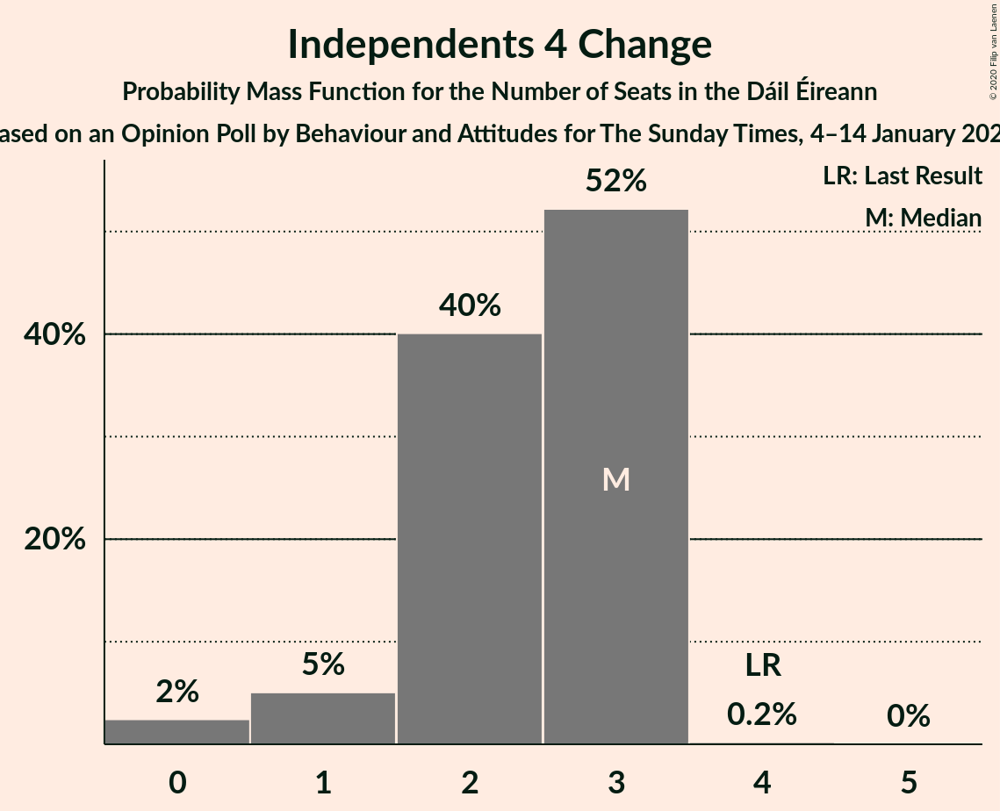
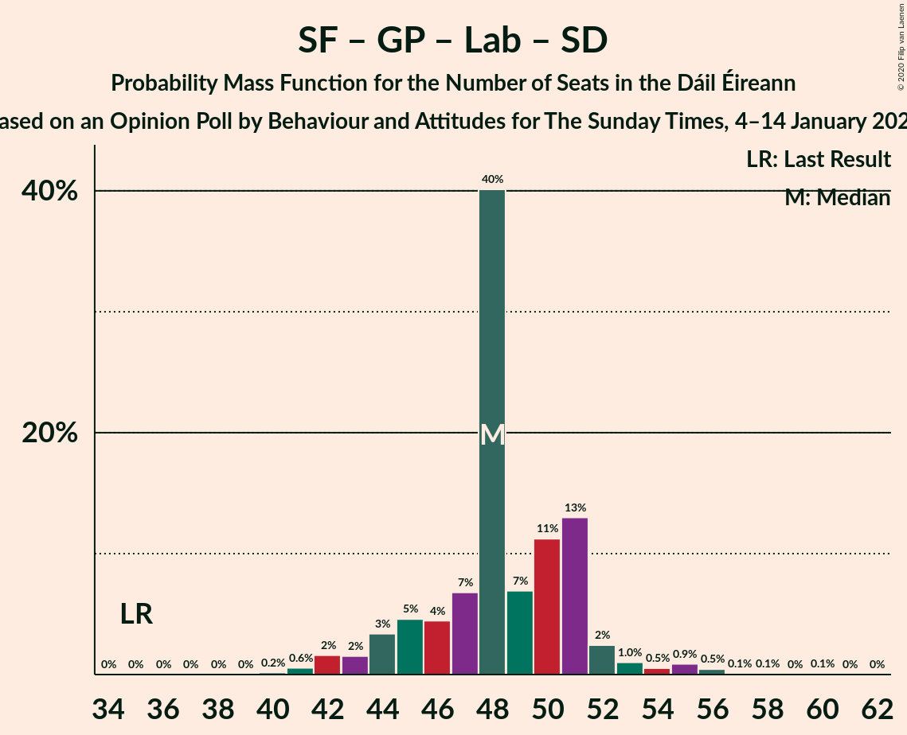

# Opinion Poll by Behaviour and Attitudes for The Sunday Times, 4–14 January 2020

<a href="#voting-intentions">Voting Intentions</a> | <a href="#seats">Seats</a> | <a href="#coalitions">Coalitions</a> | <a href="#technical-information">Technical Information</a>

## Voting Intentions

### Confidence Intervals

| Party | Last Result | Poll Result | 80% Confidence Interval | 90% Confidence Interval | 95% Confidence Interval | 99% Confidence Interval |
|:-----:|:-----------:|:-----------:|:-----------------------:|:-----------------------:|:-----------------------:|:-----------------------:|
| Fianna Fáil | 24.3% | 32.3% | 30.3–34.3% |29.8–34.8% |29.3–35.3% |28.4–36.3% |
| Fine Gael | 25.5% | 20.1% | 18.5–21.9% |18.1–22.4% |17.7–22.8% |16.9–23.7% |
| Sinn Féin | 13.8% | 19.2% | 17.6–20.9% |17.1–21.4% |16.7–21.8% |16.0–22.7% |
| Independent | 15.9% | 9.3% | 8.2–10.7% |7.9–11.0% |7.6–11.4% |7.1–12.0% |
| Green Party/Comhaontas Glas | 2.7% | 7.0% | 6.1–8.2% |5.8–8.6% |5.5–8.9% |5.1–9.5% |
| Labour Party | 6.6% | 4.0% | 3.3–5.0% |3.1–5.2% |2.9–5.5% |2.6–6.0% |
| Solidarity–People Before Profit | 3.9% | 2.1% | 1.6–2.8% |1.4–3.0% |1.3–3.2% |1.1–3.6% |
| Independents 4 Change | 1.5% | 1.2% | 0.8–1.8% |0.7–2.0% |0.7–2.1% |0.5–2.5% |
| Social Democrats | 3.0% | 1.0% | 0.7–1.5% |0.6–1.7% |0.5–1.8% |0.4–2.1% |
| Renua Ireland | 2.2% | 0.3% | 0.2–0.7% |0.1–0.8% |0.1–0.9% |0.1–1.2% |

*Note:* The poll result column reflects the actual value used in the calculations. Published results may vary slightly, and in addition be rounded to fewer digits.

## Seats

### Confidence Intervals

| Party | Last Result | Median | 80% Confidence Interval | 90% Confidence Interval | 95% Confidence Interval | 99% Confidence Interval |
|:-----:|:-----------:|:------:|:-----------------------:|:-----------------------:|:-----------------------:|:-----------------------:|
| <a href="#fianna-fáil">Fianna Fáil</a> | 44 | 60 | 59–63 |58–63 |57–65 |56–66 |
| <a href="#fine-gael">Fine Gael</a> | 49 | 38 | 35–42 |34–44 |33–44 |29–46 |
| <a href="#sinn-féin">Sinn Féin</a> | 23 | 37 | 36–37 |35–38 |34–38 |33–38 |
| <a href="#independent">Independent</a> | 19 | 10 | 7–11 |5–13 |4–13 |3–15 |
| <a href="#green-party/comhaontas-glas">Green Party/Comhaontas Glas</a> | 2 | 11 | 7–11 |5–12 |4–14 |4–15 |
| <a href="#labour-party">Labour Party</a> | 7 | 1 | 0–4 |0–5 |0–6 |0–6 |
| <a href="#solidarity–people-before-profit">Solidarity–People Before Profit</a> | 6 | 1 | 1–3 |0–3 |0–3 |0–4 |
| <a href="#independents-4-change">Independents 4 Change</a> | 4 | 3 | 2–3 |1–3 |1–3 |0–3 |
| <a href="#social-democrats">Social Democrats</a> | 3 | 0 | 0–2 |0–3 |0–3 |0–3 |
| <a href="#renua-ireland">Renua Ireland</a> | 0 | 0 | 0 |0 |0 |0 |

### Fianna Fáil

*For a full overview of the results for this party, see the [Fianna Fáil](party-fiannafáil.html) page.*

| Number of Seats | Probability | Accumulated | Special Marks |
|:---------------:|:-----------:|:-----------:|:-------------:|
| 44 | 0% | 100% | Last Result |
| 45 | 0% | 100% |  |
| 46 | 0% | 100% |  |
| 47 | 0% | 100% |  |
| 48 | 0% | 100% |  |
| 49 | 0% | 100% |  |
| 50 | 0% | 100% |  |
| 51 | 0% | 100% |  |
| 52 | 0% | 100% |  |
| 53 | 0.1% | 100% |  |
| 54 | 0.1% | 99.9% |  |
| 55 | 0.1% | 99.9% |  |
| 56 | 0.7% | 99.8% |  |
| 57 | 2% | 99.1% |  |
| 58 | 5% | 97% |  |
| 59 | 16% | 93% |  |
| 60 | 35% | 77% | Median |
| 61 | 21% | 43% |  |
| 62 | 11% | 22% |  |
| 63 | 7% | 11% |  |
| 64 | 2% | 4% |  |
| 65 | 2% | 3% |  |
| 66 | 0.5% | 0.8% |  |
| 67 | 0.2% | 0.3% |  |
| 68 | 0.1% | 0.1% |  |
| 69 | 0% | 0% |  |

### Fine Gael

*For a full overview of the results for this party, see the [Fine Gael](party-finegael.html) page.*

| Number of Seats | Probability | Accumulated | Special Marks |
|:---------------:|:-----------:|:-----------:|:-------------:|
| 25 | 0% | 100% |  |
| 26 | 0% | 99.9% |  |
| 27 | 0.1% | 99.9% |  |
| 28 | 0.1% | 99.8% |  |
| 29 | 0.6% | 99.7% |  |
| 30 | 0.3% | 99.2% |  |
| 31 | 0.3% | 98.9% |  |
| 32 | 0.6% | 98.6% |  |
| 33 | 2% | 98% |  |
| 34 | 3% | 96% |  |
| 35 | 13% | 93% |  |
| 36 | 4% | 80% |  |
| 37 | 15% | 76% |  |
| 38 | 34% | 60% | Median |
| 39 | 10% | 27% |  |
| 40 | 3% | 17% |  |
| 41 | 2% | 14% |  |
| 42 | 2% | 11% |  |
| 43 | 3% | 10% |  |
| 44 | 5% | 6% |  |
| 45 | 0.9% | 1.5% |  |
| 46 | 0.2% | 0.5% |  |
| 47 | 0.2% | 0.3% |  |
| 48 | 0.1% | 0.1% |  |
| 49 | 0% | 0% | Last Result |

### Sinn Féin

*For a full overview of the results for this party, see the [Sinn Féin](party-sinnféin.html) page.*

| Number of Seats | Probability | Accumulated | Special Marks |
|:---------------:|:-----------:|:-----------:|:-------------:|
| 23 | 0% | 100% | Last Result |
| 24 | 0% | 100% |  |
| 25 | 0% | 100% |  |
| 26 | 0% | 100% |  |
| 27 | 0% | 100% |  |
| 28 | 0% | 100% |  |
| 29 | 0% | 100% |  |
| 30 | 0% | 100% |  |
| 31 | 0.1% | 100% |  |
| 32 | 0.1% | 99.9% |  |
| 33 | 0.4% | 99.8% |  |
| 34 | 4% | 99.4% |  |
| 35 | 5% | 95% |  |
| 36 | 25% | 90% |  |
| 37 | 60% | 65% | Median |
| 38 | 5% | 5% |  |
| 39 | 0.3% | 0.4% |  |
| 40 | 0% | 0.1% |  |
| 41 | 0% | 0% |  |

### Independent

*For a full overview of the results for this party, see the [Independent](party-independent.html) page.*

| Number of Seats | Probability | Accumulated | Special Marks |
|:---------------:|:-----------:|:-----------:|:-------------:|
| 3 | 2% | 100% |  |
| 4 | 1.5% | 98% |  |
| 5 | 2% | 97% |  |
| 6 | 3% | 94% |  |
| 7 | 2% | 91% |  |
| 8 | 9% | 90% |  |
| 9 | 7% | 80% |  |
| 10 | 51% | 74% | Median |
| 11 | 15% | 23% |  |
| 12 | 1.5% | 8% |  |
| 13 | 6% | 7% |  |
| 14 | 0.2% | 0.9% |  |
| 15 | 0.5% | 0.8% |  |
| 16 | 0.2% | 0.2% |  |
| 17 | 0% | 0.1% |  |
| 18 | 0% | 0% |  |
| 19 | 0% | 0% | Last Result |

### Green Party/Comhaontas Glas

*For a full overview of the results for this party, see the [Green Party/Comhaontas Glas](party-greenpartycomhaontasglas.html) page.*

| Number of Seats | Probability | Accumulated | Special Marks |
|:---------------:|:-----------:|:-----------:|:-------------:|
| 2 | 0% | 100% | Last Result |
| 3 | 0.3% | 100% |  |
| 4 | 4% | 99.7% |  |
| 5 | 3% | 96% |  |
| 6 | 1.3% | 92% |  |
| 7 | 12% | 91% |  |
| 8 | 7% | 79% |  |
| 9 | 6% | 71% |  |
| 10 | 2% | 65% |  |
| 11 | 55% | 63% | Median |
| 12 | 4% | 9% |  |
| 13 | 2% | 4% |  |
| 14 | 2% | 3% |  |
| 15 | 0.5% | 0.9% |  |
| 16 | 0.1% | 0.4% |  |
| 17 | 0.1% | 0.3% |  |
| 18 | 0.1% | 0.2% |  |
| 19 | 0.1% | 0.1% |  |
| 20 | 0% | 0% |  |

### Labour Party

*For a full overview of the results for this party, see the [Labour Party](party-labourparty.html) page.*

| Number of Seats | Probability | Accumulated | Special Marks |
|:---------------:|:-----------:|:-----------:|:-------------:|
| 0 | 45% | 100% |  |
| 1 | 17% | 55% | Median |
| 2 | 21% | 38% |  |
| 3 | 7% | 18% |  |
| 4 | 4% | 11% |  |
| 5 | 4% | 6% |  |
| 6 | 2% | 3% |  |
| 7 | 0.2% | 0.5% | Last Result |
| 8 | 0.1% | 0.3% |  |
| 9 | 0.1% | 0.2% |  |
| 10 | 0% | 0.1% |  |
| 11 | 0% | 0.1% |  |
| 12 | 0% | 0.1% |  |
| 13 | 0% | 0% |  |

### Solidarity–People Before Profit

*For a full overview of the results for this party, see the [Solidarity–People Before Profit](party-solidarity–peoplebeforeprofit.html) page.*

| Number of Seats | Probability | Accumulated | Special Marks |
|:---------------:|:-----------:|:-----------:|:-------------:|
| 0 | 6% | 100% |  |
| 1 | 80% | 94% | Median |
| 2 | 2% | 14% |  |
| 3 | 10% | 12% |  |
| 4 | 2% | 2% |  |
| 5 | 0% | 0% |  |
| 6 | 0% | 0% | Last Result |

### Independents 4 Change

*For a full overview of the results for this party, see the [Independents 4 Change](party-independents4change.html) page.*

| Number of Seats | Probability | Accumulated | Special Marks |
|:---------------:|:-----------:|:-----------:|:-------------:|
| 0 | 2% | 100% |  |
| 1 | 5% | 98% |  |
| 2 | 40% | 92% |  |
| 3 | 52% | 52% | Median |
| 4 | 0.2% | 0.2% | Last Result |
| 5 | 0% | 0% |  |

### Social Democrats

*For a full overview of the results for this party, see the [Social Democrats](party-socialdemocrats.html) page.*

| Number of Seats | Probability | Accumulated | Special Marks |
|:---------------:|:-----------:|:-----------:|:-------------:|
| 0 | 60% | 100% | Median |
| 1 | 15% | 40% |  |
| 2 | 19% | 25% |  |
| 3 | 6% | 6% | Last Result |
| 4 | 0% | 0% |  |

### Renua Ireland

*For a full overview of the results for this party, see the [Renua Ireland](party-renuaireland.html) page.*

| Number of Seats | Probability | Accumulated | Special Marks |
|:---------------:|:-----------:|:-----------:|:-------------:|
| 0 | 99.7% | 100% | Last Result, Median |
| 1 | 0.1% | 0.3% |  |
| 2 | 0.2% | 0.2% |  |
| 3 | 0% | 0% |  |

## Coalitions

### Confidence Intervals

| Coalition | Last Result | Median | Majority? | 80% Confidence Interval | 90% Confidence Interval | 95% Confidence Interval | 99% Confidence Interval |
|:---------:|:-----------:|:------:|:---------:|:-----------------------:|:-----------------------:|:-----------------------:|:-----------------------:|
| Fianna Fáil – Fine Gael | 93 | 98 | 100% | 96–103 | 95–104 | 94–106 | 91–107 |
| Fianna Fáil – Sinn Féin | 67 | 97 | 100% | 95–100 | 94–100 | 94–101 | 91–103 |
| Fianna Fáil – Green Party/Comhaontas Glas – Labour Party – Social Democrats | 56 | 72 | 0.9% | 69–75 | 68–77 | 68–78 | 66–81 |
| Fianna Fáil – Green Party/Comhaontas Glas – Labour Party | 53 | 71 | 0.3% | 68–75 | 67–76 | 66–77 | 66–79 |
| Fianna Fáil – Green Party/Comhaontas Glas | 46 | 71 | 0.1% | 67–73 | 65–74 | 65–76 | 63–77 |
| Fianna Fáil – Labour Party | 51 | 61 | 0% | 59–65 | 59–67 | 59–68 | 58–69 |
| Fine Gael – Green Party/Comhaontas Glas – Labour Party – Social Democrats | 61 | 49 | 0% | 47–53 | 46–54 | 45–55 | 44–58 |
| Sinn Féin – Green Party/Comhaontas Glas – Labour Party – Solidarity–People Before Profit – Social Democrats | 41 | 49 | 0% | 46–52 | 45–53 | 44–55 | 43–57 |
| Fine Gael – Green Party/Comhaontas Glas – Labour Party | 58 | 49 | 0% | 46–52 | 46–53 | 44–54 | 42–57 |
| Sinn Féin – Green Party/Comhaontas Glas – Labour Party – Solidarity–People Before Profit | 38 | 49 | 0% | 45–51 | 44–52 | 43–54 | 41–56 |
| Sinn Féin – Green Party/Comhaontas Glas – Labour Party – Social Democrats | 35 | 48 | 0% | 45–51 | 44–52 | 43–53 | 41–56 |
| Fine Gael – Green Party/Comhaontas Glas | 51 | 48 | 0% | 44–51 | 42–52 | 41–53 | 40–55 |
| Sinn Féin – Green Party/Comhaontas Glas – Labour Party | 32 | 48 | 0% | 44–50 | 43–51 | 42–52 | 40–54 |
| Fine Gael – Labour Party | 56 | 38 | 0% | 37–44 | 36–45 | 34–46 | 32–49 |
| Fine Gael | 49 | 38 | 0% | 35–42 | 34–44 | 33–44 | 29–46 |

### Fianna Fáil – Fine Gael

| Number of Seats | Probability | Accumulated | Special Marks |
|:---------------:|:-----------:|:-----------:|:-------------:|
| 87 | 0% | 100% |  |
| 88 | 0.1% | 99.9% |  |
| 89 | 0.1% | 99.8% |  |
| 90 | 0.2% | 99.7% |  |
| 91 | 0.3% | 99.5% |  |
| 92 | 1.0% | 99.2% |  |
| 93 | 0.5% | 98% | Last Result |
| 94 | 0.9% | 98% |  |
| 95 | 3% | 97% |  |
| 96 | 23% | 94% |  |
| 97 | 4% | 71% |  |
| 98 | 35% | 67% | Median |
| 99 | 8% | 33% |  |
| 100 | 9% | 25% |  |
| 101 | 2% | 16% |  |
| 102 | 4% | 14% |  |
| 103 | 4% | 10% |  |
| 104 | 3% | 7% |  |
| 105 | 0.6% | 4% |  |
| 106 | 2% | 3% |  |
| 107 | 0.9% | 1.2% |  |
| 108 | 0.1% | 0.3% |  |
| 109 | 0.1% | 0.2% |  |
| 110 | 0.1% | 0.1% |  |
| 111 | 0% | 0% |  |

### Fianna Fáil – Sinn Féin

| Number of Seats | Probability | Accumulated | Special Marks |
|:---------------:|:-----------:|:-----------:|:-------------:|
| 67 | 0% | 100% | Last Result |
| 68 | 0% | 100% |  |
| 69 | 0% | 100% |  |
| 70 | 0% | 100% |  |
| 71 | 0% | 100% |  |
| 72 | 0% | 100% |  |
| 73 | 0% | 100% |  |
| 74 | 0% | 100% |  |
| 75 | 0% | 100% |  |
| 76 | 0% | 100% |  |
| 77 | 0% | 100% |  |
| 78 | 0% | 100% |  |
| 79 | 0% | 100% |  |
| 80 | 0% | 100% |  |
| 81 | 0% | 100% | Majority |
| 82 | 0% | 100% |  |
| 83 | 0% | 100% |  |
| 84 | 0% | 100% |  |
| 85 | 0% | 100% |  |
| 86 | 0% | 100% |  |
| 87 | 0% | 100% |  |
| 88 | 0% | 100% |  |
| 89 | 0.1% | 100% |  |
| 90 | 0.2% | 99.9% |  |
| 91 | 0.5% | 99.7% |  |
| 92 | 0.7% | 99.3% |  |
| 93 | 0.9% | 98.6% |  |
| 94 | 5% | 98% |  |
| 95 | 8% | 93% |  |
| 96 | 23% | 85% |  |
| 97 | 26% | 63% | Median |
| 98 | 21% | 37% |  |
| 99 | 6% | 16% |  |
| 100 | 6% | 10% |  |
| 101 | 2% | 4% |  |
| 102 | 1.4% | 2% |  |
| 103 | 0.7% | 0.9% |  |
| 104 | 0.1% | 0.2% |  |
| 105 | 0.1% | 0.1% |  |
| 106 | 0% | 0% |  |

### Fianna Fáil – Green Party/Comhaontas Glas – Labour Party – Social Democrats

| Number of Seats | Probability | Accumulated | Special Marks |
|:---------------:|:-----------:|:-----------:|:-------------:|
| 56 | 0% | 100% | Last Result |
| 57 | 0% | 100% |  |
| 58 | 0% | 100% |  |
| 59 | 0% | 100% |  |
| 60 | 0% | 100% |  |
| 61 | 0% | 100% |  |
| 62 | 0% | 100% |  |
| 63 | 0% | 100% |  |
| 64 | 0% | 100% |  |
| 65 | 0% | 100% |  |
| 66 | 0.8% | 99.9% |  |
| 67 | 2% | 99.2% |  |
| 68 | 5% | 98% |  |
| 69 | 3% | 93% |  |
| 70 | 3% | 90% |  |
| 71 | 31% | 86% |  |
| 72 | 21% | 55% | Median |
| 73 | 6% | 34% |  |
| 74 | 5% | 29% |  |
| 75 | 14% | 23% |  |
| 76 | 3% | 9% |  |
| 77 | 3% | 6% |  |
| 78 | 0.8% | 3% |  |
| 79 | 1.0% | 2% |  |
| 80 | 0.3% | 1.2% |  |
| 81 | 0.6% | 0.9% | Majority |
| 82 | 0.1% | 0.3% |  |
| 83 | 0.1% | 0.2% |  |
| 84 | 0.1% | 0.1% |  |
| 85 | 0% | 0% |  |

### Fianna Fáil – Green Party/Comhaontas Glas – Labour Party

| Number of Seats | Probability | Accumulated | Special Marks |
|:---------------:|:-----------:|:-----------:|:-------------:|
| 53 | 0% | 100% | Last Result |
| 54 | 0% | 100% |  |
| 55 | 0% | 100% |  |
| 56 | 0% | 100% |  |
| 57 | 0% | 100% |  |
| 58 | 0% | 100% |  |
| 59 | 0% | 100% |  |
| 60 | 0% | 100% |  |
| 61 | 0% | 100% |  |
| 62 | 0% | 100% |  |
| 63 | 0% | 100% |  |
| 64 | 0% | 100% |  |
| 65 | 0.3% | 99.9% |  |
| 66 | 3% | 99.7% |  |
| 67 | 4% | 97% |  |
| 68 | 4% | 93% |  |
| 69 | 4% | 89% |  |
| 70 | 12% | 85% |  |
| 71 | 30% | 73% |  |
| 72 | 12% | 42% | Median |
| 73 | 7% | 31% |  |
| 74 | 13% | 23% |  |
| 75 | 4% | 10% |  |
| 76 | 2% | 6% |  |
| 77 | 2% | 4% |  |
| 78 | 0.8% | 2% |  |
| 79 | 0.7% | 1.1% |  |
| 80 | 0.2% | 0.4% |  |
| 81 | 0.1% | 0.3% | Majority |
| 82 | 0.1% | 0.2% |  |
| 83 | 0.1% | 0.1% |  |
| 84 | 0% | 0.1% |  |
| 85 | 0% | 0% |  |

### Fianna Fáil – Green Party/Comhaontas Glas

| Number of Seats | Probability | Accumulated | Special Marks |
|:---------------:|:-----------:|:-----------:|:-------------:|
| 46 | 0% | 100% | Last Result |
| 47 | 0% | 100% |  |
| 48 | 0% | 100% |  |
| 49 | 0% | 100% |  |
| 50 | 0% | 100% |  |
| 51 | 0% | 100% |  |
| 52 | 0% | 100% |  |
| 53 | 0% | 100% |  |
| 54 | 0% | 100% |  |
| 55 | 0% | 100% |  |
| 56 | 0% | 100% |  |
| 57 | 0% | 100% |  |
| 58 | 0% | 100% |  |
| 59 | 0% | 100% |  |
| 60 | 0% | 100% |  |
| 61 | 0% | 100% |  |
| 62 | 0.1% | 100% |  |
| 63 | 0.5% | 99.9% |  |
| 64 | 1.4% | 99.4% |  |
| 65 | 3% | 98% |  |
| 66 | 5% | 95% |  |
| 67 | 4% | 90% |  |
| 68 | 9% | 86% |  |
| 69 | 3% | 77% |  |
| 70 | 15% | 74% |  |
| 71 | 36% | 59% | Median |
| 72 | 12% | 22% |  |
| 73 | 3% | 10% |  |
| 74 | 2% | 7% |  |
| 75 | 2% | 5% |  |
| 76 | 2% | 3% |  |
| 77 | 0.2% | 0.5% |  |
| 78 | 0.2% | 0.3% |  |
| 79 | 0.1% | 0.2% |  |
| 80 | 0% | 0.1% |  |
| 81 | 0% | 0.1% | Majority |
| 82 | 0% | 0% |  |

### Fianna Fáil – Labour Party

| Number of Seats | Probability | Accumulated | Special Marks |
|:---------------:|:-----------:|:-----------:|:-------------:|
| 51 | 0% | 100% | Last Result |
| 52 | 0% | 100% |  |
| 53 | 0% | 100% |  |
| 54 | 0% | 100% |  |
| 55 | 0% | 100% |  |
| 56 | 0% | 100% |  |
| 57 | 0.3% | 99.9% |  |
| 58 | 2% | 99.6% |  |
| 59 | 12% | 98% |  |
| 60 | 27% | 85% |  |
| 61 | 12% | 58% | Median |
| 62 | 6% | 46% |  |
| 63 | 15% | 39% |  |
| 64 | 10% | 24% |  |
| 65 | 5% | 14% |  |
| 66 | 3% | 9% |  |
| 67 | 2% | 6% |  |
| 68 | 3% | 4% |  |
| 69 | 0.4% | 0.7% |  |
| 70 | 0.1% | 0.3% |  |
| 71 | 0.1% | 0.2% |  |
| 72 | 0.1% | 0.1% |  |
| 73 | 0% | 0% |  |

### Fine Gael – Green Party/Comhaontas Glas – Labour Party – Social Democrats

| Number of Seats | Probability | Accumulated | Special Marks |
|:---------------:|:-----------:|:-----------:|:-------------:|
| 40 | 0% | 100% |  |
| 41 | 0% | 99.9% |  |
| 42 | 0.2% | 99.9% |  |
| 43 | 0.1% | 99.7% |  |
| 44 | 1.3% | 99.6% |  |
| 45 | 0.9% | 98% |  |
| 46 | 5% | 97% |  |
| 47 | 3% | 92% |  |
| 48 | 9% | 90% |  |
| 49 | 40% | 81% |  |
| 50 | 19% | 40% | Median |
| 51 | 4% | 21% |  |
| 52 | 6% | 17% |  |
| 53 | 4% | 11% |  |
| 54 | 3% | 8% |  |
| 55 | 2% | 5% |  |
| 56 | 0.9% | 2% |  |
| 57 | 0.6% | 1.3% |  |
| 58 | 0.4% | 0.7% |  |
| 59 | 0.2% | 0.3% |  |
| 60 | 0.1% | 0.2% |  |
| 61 | 0% | 0% | Last Result |

### Sinn Féin – Green Party/Comhaontas Glas – Labour Party – Solidarity–People Before Profit – Social Democrats

| Number of Seats | Probability | Accumulated | Special Marks |
|:---------------:|:-----------:|:-----------:|:-------------:|
| 41 | 0.1% | 100% | Last Result |
| 42 | 0.3% | 99.8% |  |
| 43 | 1.0% | 99.5% |  |
| 44 | 2% | 98.5% |  |
| 45 | 3% | 96% |  |
| 46 | 4% | 93% |  |
| 47 | 3% | 89% |  |
| 48 | 3% | 86% |  |
| 49 | 41% | 83% |  |
| 50 | 10% | 42% | Median |
| 51 | 12% | 33% |  |
| 52 | 14% | 20% |  |
| 53 | 2% | 6% |  |
| 54 | 1.4% | 4% |  |
| 55 | 0.8% | 3% |  |
| 56 | 1.0% | 2% |  |
| 57 | 0.5% | 0.9% |  |
| 58 | 0.1% | 0.4% |  |
| 59 | 0.1% | 0.3% |  |
| 60 | 0% | 0.2% |  |
| 61 | 0.1% | 0.1% |  |
| 62 | 0% | 0.1% |  |
| 63 | 0% | 0% |  |

### Fine Gael – Green Party/Comhaontas Glas – Labour Party

| Number of Seats | Probability | Accumulated | Special Marks |
|:---------------:|:-----------:|:-----------:|:-------------:|
| 39 | 0.1% | 100% |  |
| 40 | 0% | 99.9% |  |
| 41 | 0.1% | 99.9% |  |
| 42 | 0.8% | 99.8% |  |
| 43 | 0.4% | 99.0% |  |
| 44 | 2% | 98.7% |  |
| 45 | 2% | 97% |  |
| 46 | 8% | 95% |  |
| 47 | 2% | 88% |  |
| 48 | 28% | 85% |  |
| 49 | 33% | 58% |  |
| 50 | 10% | 25% | Median |
| 51 | 2% | 16% |  |
| 52 | 4% | 13% |  |
| 53 | 5% | 9% |  |
| 54 | 2% | 4% |  |
| 55 | 0.7% | 2% |  |
| 56 | 1.0% | 2% |  |
| 57 | 0.2% | 0.6% |  |
| 58 | 0.2% | 0.4% | Last Result |
| 59 | 0.1% | 0.2% |  |
| 60 | 0.1% | 0.1% |  |
| 61 | 0% | 0% |  |

### Sinn Féin – Green Party/Comhaontas Glas – Labour Party – Solidarity–People Before Profit

| Number of Seats | Probability | Accumulated | Special Marks |
|:---------------:|:-----------:|:-----------:|:-------------:|
| 38 | 0% | 100% | Last Result |
| 39 | 0% | 100% |  |
| 40 | 0% | 100% |  |
| 41 | 0.8% | 100% |  |
| 42 | 0.5% | 99.1% |  |
| 43 | 2% | 98.7% |  |
| 44 | 3% | 97% |  |
| 45 | 4% | 94% |  |
| 46 | 5% | 90% |  |
| 47 | 2% | 85% |  |
| 48 | 5% | 83% |  |
| 49 | 51% | 77% |  |
| 50 | 8% | 26% | Median |
| 51 | 12% | 19% |  |
| 52 | 2% | 7% |  |
| 53 | 2% | 5% |  |
| 54 | 2% | 3% |  |
| 55 | 0.8% | 1.4% |  |
| 56 | 0.1% | 0.6% |  |
| 57 | 0.1% | 0.4% |  |
| 58 | 0.1% | 0.3% |  |
| 59 | 0.1% | 0.2% |  |
| 60 | 0% | 0.1% |  |
| 61 | 0% | 0% |  |

### Sinn Féin – Green Party/Comhaontas Glas – Labour Party – Social Democrats

| Number of Seats | Probability | Accumulated | Special Marks |
|:---------------:|:-----------:|:-----------:|:-------------:|
| 35 | 0% | 100% | Last Result |
| 36 | 0% | 100% |  |
| 37 | 0% | 100% |  |
| 38 | 0% | 100% |  |
| 39 | 0% | 100% |  |
| 40 | 0.2% | 100% |  |
| 41 | 0.6% | 99.8% |  |
| 42 | 2% | 99.3% |  |
| 43 | 2% | 98% |  |
| 44 | 3% | 96% |  |
| 45 | 5% | 93% |  |
| 46 | 4% | 88% |  |
| 47 | 7% | 84% |  |
| 48 | 40% | 77% |  |
| 49 | 7% | 37% | Median |
| 50 | 11% | 30% |  |
| 51 | 13% | 19% |  |
| 52 | 2% | 6% |  |
| 53 | 1.0% | 3% |  |
| 54 | 0.5% | 2% |  |
| 55 | 0.9% | 2% |  |
| 56 | 0.5% | 0.8% |  |
| 57 | 0.1% | 0.3% |  |
| 58 | 0.1% | 0.2% |  |
| 59 | 0% | 0.2% |  |
| 60 | 0.1% | 0.1% |  |
| 61 | 0% | 0% |  |

### Fine Gael – Green Party/Comhaontas Glas

| Number of Seats | Probability | Accumulated | Special Marks |
|:---------------:|:-----------:|:-----------:|:-------------:|
| 36 | 0% | 100% |  |
| 37 | 0.1% | 99.9% |  |
| 38 | 0.1% | 99.9% |  |
| 39 | 0.2% | 99.8% |  |
| 40 | 0.7% | 99.6% |  |
| 41 | 3% | 98.9% |  |
| 42 | 3% | 96% |  |
| 43 | 2% | 93% |  |
| 44 | 2% | 91% |  |
| 45 | 3% | 90% |  |
| 46 | 23% | 87% |  |
| 47 | 6% | 64% |  |
| 48 | 12% | 58% |  |
| 49 | 33% | 46% | Median |
| 50 | 1.5% | 13% |  |
| 51 | 5% | 11% | Last Result |
| 52 | 2% | 6% |  |
| 53 | 2% | 4% |  |
| 54 | 1.0% | 2% |  |
| 55 | 0.4% | 0.8% |  |
| 56 | 0.2% | 0.4% |  |
| 57 | 0.1% | 0.2% |  |
| 58 | 0.1% | 0.1% |  |
| 59 | 0.1% | 0.1% |  |
| 60 | 0% | 0% |  |

### Sinn Féin – Green Party/Comhaontas Glas – Labour Party

| Number of Seats | Probability | Accumulated | Special Marks |
|:---------------:|:-----------:|:-----------:|:-------------:|
| 32 | 0% | 100% | Last Result |
| 33 | 0% | 100% |  |
| 34 | 0% | 100% |  |
| 35 | 0% | 100% |  |
| 36 | 0% | 100% |  |
| 37 | 0% | 100% |  |
| 38 | 0% | 100% |  |
| 39 | 0% | 100% |  |
| 40 | 0.9% | 100% |  |
| 41 | 0.8% | 99.1% |  |
| 42 | 2% | 98% |  |
| 43 | 3% | 96% |  |
| 44 | 5% | 94% |  |
| 45 | 4% | 88% |  |
| 46 | 5% | 84% |  |
| 47 | 9% | 79% |  |
| 48 | 48% | 70% |  |
| 49 | 4% | 22% | Median |
| 50 | 12% | 17% |  |
| 51 | 1.4% | 6% |  |
| 52 | 2% | 4% |  |
| 53 | 1.3% | 2% |  |
| 54 | 0.7% | 1.1% |  |
| 55 | 0.2% | 0.5% |  |
| 56 | 0.1% | 0.3% |  |
| 57 | 0% | 0.2% |  |
| 58 | 0.1% | 0.2% |  |
| 59 | 0% | 0.1% |  |
| 60 | 0% | 0% |  |

### Fine Gael – Labour Party

| Number of Seats | Probability | Accumulated | Special Marks |
|:---------------:|:-----------:|:-----------:|:-------------:|
| 27 | 0% | 100% |  |
| 28 | 0% | 99.9% |  |
| 29 | 0.1% | 99.9% |  |
| 30 | 0.1% | 99.8% |  |
| 31 | 0.2% | 99.7% |  |
| 32 | 0.3% | 99.6% |  |
| 33 | 1.2% | 99.3% |  |
| 34 | 1.3% | 98% |  |
| 35 | 2% | 97% |  |
| 36 | 2% | 95% |  |
| 37 | 22% | 94% |  |
| 38 | 28% | 71% |  |
| 39 | 13% | 44% | Median |
| 40 | 2% | 30% |  |
| 41 | 5% | 28% |  |
| 42 | 9% | 23% |  |
| 43 | 4% | 14% |  |
| 44 | 4% | 10% |  |
| 45 | 2% | 6% |  |
| 46 | 3% | 4% |  |
| 47 | 0.4% | 2% |  |
| 48 | 0.3% | 1.2% |  |
| 49 | 0.7% | 0.8% |  |
| 50 | 0.1% | 0.2% |  |
| 51 | 0% | 0% |  |
| 52 | 0% | 0% |  |
| 53 | 0% | 0% |  |
| 54 | 0% | 0% |  |
| 55 | 0% | 0% |  |
| 56 | 0% | 0% | Last Result |

### Fine Gael

| Number of Seats | Probability | Accumulated | Special Marks |
|:---------------:|:-----------:|:-----------:|:-------------:|
| 25 | 0% | 100% |  |
| 26 | 0% | 99.9% |  |
| 27 | 0.1% | 99.9% |  |
| 28 | 0.1% | 99.8% |  |
| 29 | 0.6% | 99.7% |  |
| 30 | 0.3% | 99.2% |  |
| 31 | 0.3% | 98.9% |  |
| 32 | 0.6% | 98.6% |  |
| 33 | 2% | 98% |  |
| 34 | 3% | 96% |  |
| 35 | 13% | 93% |  |
| 36 | 4% | 80% |  |
| 37 | 15% | 76% |  |
| 38 | 34% | 60% | Median |
| 39 | 10% | 27% |  |
| 40 | 3% | 17% |  |
| 41 | 2% | 14% |  |
| 42 | 2% | 11% |  |
| 43 | 3% | 10% |  |
| 44 | 5% | 6% |  |
| 45 | 0.9% | 1.5% |  |
| 46 | 0.2% | 0.5% |  |
| 47 | 0.2% | 0.3% |  |
| 48 | 0.1% | 0.1% |  |
| 49 | 0% | 0% | Last Result |

## Technical Information

### Opinion Poll

+ **Polling firm:** Behaviour and Attitudes
+ **Commissioner(s):** The Sunday Times
+ **Fieldwork period:** 4–14 January 2020

### Calculations

+ **Sample size:** 924
+ **Simulations done:** 1,048,576
+ **Error estimate:** 0.91%

