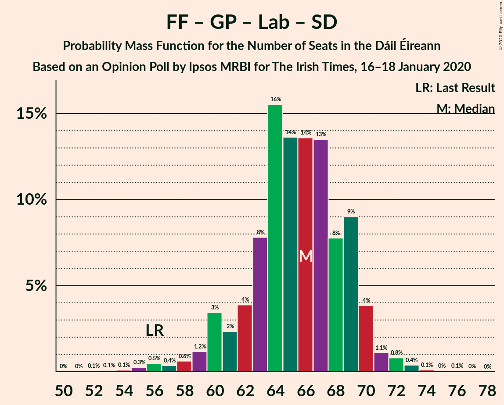
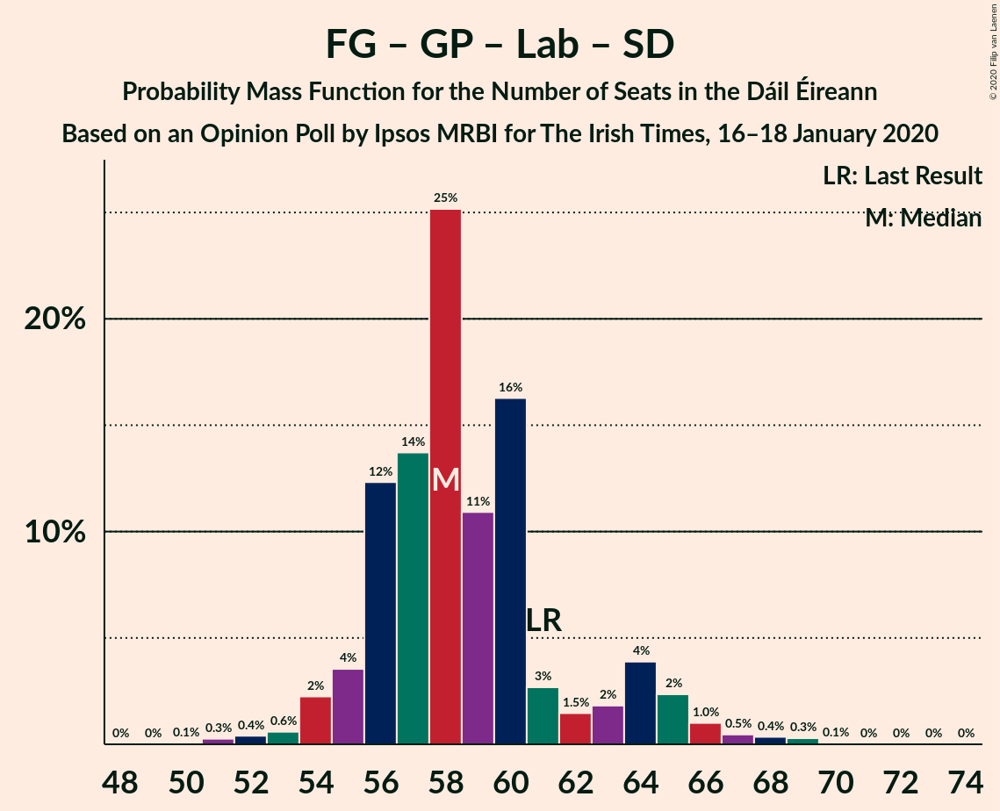
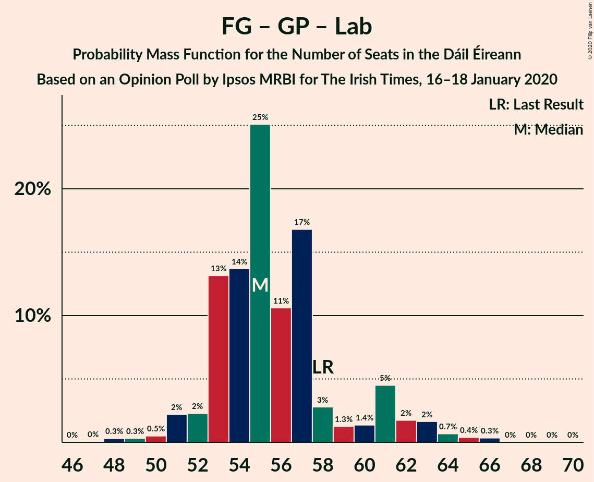
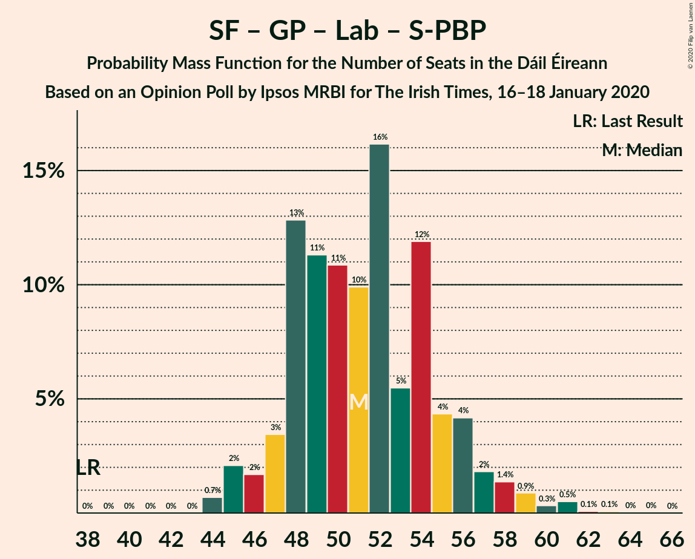

# Opinion Poll by Ipsos MRBI for The Irish Times, 16–18 January 2020

<a href="#voting-intentions">Voting Intentions</a> | <a href="#seats">Seats</a> | <a href="#coalitions">Coalitions</a> | <a href="#technical-information">Technical Information</a>

## Voting Intentions

### Confidence Intervals

| Party | Last Result | Poll Result | 80% Confidence Interval | 90% Confidence Interval | 95% Confidence Interval | 99% Confidence Interval |
|:-----:|:-----------:|:-----------:|:-----------------------:|:-----------------------:|:-----------------------:|:-----------------------:|
| Fianna Fáil | 24.3% | 25.0% | 23.4–26.7% |23.0–27.1% |22.6–27.5% |21.9–28.3% |
| Fine Gael | 25.5% | 23.0% | 21.5–24.6% |21.1–25.1% |20.7–25.5% |20.0–26.3% |
| Sinn Féin | 13.8% | 21.0% | 19.5–22.6% |19.1–23.0% |18.8–23.4% |18.1–24.2% |
| Independent | 15.9% | 11.0% | 9.9–12.2% |9.6–12.6% |9.3–12.9% |8.9–13.5% |
| Green Party/Comhaontas Glas | 2.7% | 8.0% | 7.1–9.1% |6.8–9.4% |6.6–9.7% |6.2–10.2% |
| Labour Party | 6.6% | 5.0% | 4.3–5.9% |4.1–6.2% |3.9–6.4% |3.6–6.8% |
| Solidarity–People Before Profit | 3.9% | 2.0% | 1.6–2.6% |1.4–2.8% |1.3–3.0% |1.2–3.3% |
| Social Democrats | 3.0% | 2.0% | 1.6–2.6% |1.4–2.8% |1.3–3.0% |1.2–3.3% |
| Independents 4 Change | 1.5% | 1.4% | 1.1–2.0% |1.0–2.1% |0.9–2.3% |0.7–2.6% |

*Note:* The poll result column reflects the actual value used in the calculations. Published results may vary slightly, and in addition be rounded to fewer digits.

## Seats

### Confidence Intervals

| Party | Last Result | Median | 80% Confidence Interval | 90% Confidence Interval | 95% Confidence Interval | 99% Confidence Interval |
|:-----:|:-----------:|:------:|:-----------------------:|:-----------------------:|:-----------------------:|:-----------------------:|
| <a href="#fianna-fáil">Fianna Fáil</a> | 44 | 49 | 44–51 |43–53 |41–54 |37–55 |
| <a href="#fine-gael">Fine Gael</a> | 49 | 41 | 37–44 |37–46 |36–47 |34–50 |
| <a href="#sinn-féin">Sinn Féin</a> | 23 | 38 | 35–40 |35–40 |35–40 |34–41 |
| <a href="#independent">Independent</a> | 19 | 13 | 9–16 |8–16 |7–17 |6–17 |
| <a href="#green-party/comhaontas-glas">Green Party/Comhaontas Glas</a> | 2 | 8 | 7–12 |7–13 |7–14 |7–17 |
| <a href="#labour-party">Labour Party</a> | 7 | 5 | 2–7 |1–8 |1–8 |1–10 |
| <a href="#solidarity–people-before-profit">Solidarity–People Before Profit</a> | 6 | 1 | 0–1 |0–2 |0–3 |0–3 |
| <a href="#social-democrats">Social Democrats</a> | 3 | 3 | 3 |2–3 |2–3 |1–3 |
| <a href="#independents-4-change">Independents 4 Change</a> | 4 | 3 | 3 |2–3 |1–4 |1–4 |

### Fianna Fáil

*For a full overview of the results for this party, see the [Fianna Fáil](party-fiannafáil.html) page.*

| Number of Seats | Probability | Accumulated | Special Marks |
|:---------------:|:-----------:|:-----------:|:-------------:|
| 35 | 0% | 100% |  |
| 36 | 0% | 99.9% |  |
| 37 | 0.5% | 99.9% |  |
| 38 | 0.1% | 99.5% |  |
| 39 | 0.5% | 99.3% |  |
| 40 | 0.7% | 98.8% |  |
| 41 | 1.1% | 98% |  |
| 42 | 2% | 97% |  |
| 43 | 3% | 95% |  |
| 44 | 4% | 92% | Last Result |
| 45 | 6% | 89% |  |
| 46 | 8% | 82% |  |
| 47 | 14% | 74% |  |
| 48 | 8% | 60% |  |
| 49 | 18% | 52% | Median |
| 50 | 16% | 34% |  |
| 51 | 8% | 18% |  |
| 52 | 3% | 10% |  |
| 53 | 2% | 6% |  |
| 54 | 4% | 4% |  |
| 55 | 0.5% | 0.7% |  |
| 56 | 0.1% | 0.2% |  |
| 57 | 0.1% | 0.1% |  |
| 58 | 0% | 0% |  |

### Fine Gael

*For a full overview of the results for this party, see the [Fine Gael](party-finegael.html) page.*

| Number of Seats | Probability | Accumulated | Special Marks |
|:---------------:|:-----------:|:-----------:|:-------------:|
| 32 | 0% | 100% |  |
| 33 | 0.2% | 99.9% |  |
| 34 | 0.5% | 99.7% |  |
| 35 | 0.8% | 99.2% |  |
| 36 | 2% | 98% |  |
| 37 | 10% | 97% |  |
| 38 | 6% | 87% |  |
| 39 | 17% | 81% |  |
| 40 | 10% | 65% |  |
| 41 | 19% | 54% | Median |
| 42 | 15% | 35% |  |
| 43 | 7% | 21% |  |
| 44 | 5% | 14% |  |
| 45 | 3% | 9% |  |
| 46 | 3% | 6% |  |
| 47 | 1.3% | 3% |  |
| 48 | 0.4% | 2% |  |
| 49 | 0.8% | 1.4% | Last Result |
| 50 | 0.2% | 0.5% |  |
| 51 | 0.2% | 0.3% |  |
| 52 | 0.1% | 0.1% |  |
| 53 | 0% | 0.1% |  |
| 54 | 0% | 0% |  |

### Sinn Féin

*For a full overview of the results for this party, see the [Sinn Féin](party-sinnféin.html) page.*

| Number of Seats | Probability | Accumulated | Special Marks |
|:---------------:|:-----------:|:-----------:|:-------------:|
| 23 | 0% | 100% | Last Result |
| 24 | 0% | 100% |  |
| 25 | 0% | 100% |  |
| 26 | 0% | 100% |  |
| 27 | 0% | 100% |  |
| 28 | 0% | 100% |  |
| 29 | 0% | 100% |  |
| 30 | 0% | 100% |  |
| 31 | 0% | 100% |  |
| 32 | 0% | 100% |  |
| 33 | 0% | 100% |  |
| 34 | 0.9% | 100% |  |
| 35 | 9% | 99.1% |  |
| 36 | 6% | 90% |  |
| 37 | 27% | 84% |  |
| 38 | 19% | 57% | Median |
| 39 | 21% | 38% |  |
| 40 | 16% | 17% |  |
| 41 | 0.9% | 1.3% |  |
| 42 | 0.3% | 0.4% |  |
| 43 | 0.1% | 0.1% |  |
| 44 | 0% | 0% |  |

### Independent

*For a full overview of the results for this party, see the [Independent](party-independent.html) page.*

| Number of Seats | Probability | Accumulated | Special Marks |
|:---------------:|:-----------:|:-----------:|:-------------:|
| 3 | 0.2% | 100% |  |
| 4 | 0.1% | 99.8% |  |
| 5 | 0.2% | 99.7% |  |
| 6 | 1.2% | 99.5% |  |
| 7 | 1.3% | 98% |  |
| 8 | 6% | 97% |  |
| 9 | 2% | 91% |  |
| 10 | 2% | 89% |  |
| 11 | 4% | 86% |  |
| 12 | 11% | 83% |  |
| 13 | 23% | 72% | Median |
| 14 | 22% | 49% |  |
| 15 | 15% | 27% |  |
| 16 | 8% | 11% |  |
| 17 | 4% | 4% |  |
| 18 | 0% | 0% |  |
| 19 | 0% | 0% | Last Result |

### Green Party/Comhaontas Glas

*For a full overview of the results for this party, see the [Green Party/Comhaontas Glas](party-greenpartycomhaontasglas.html) page.*

| Number of Seats | Probability | Accumulated | Special Marks |
|:---------------:|:-----------:|:-----------:|:-------------:|
| 2 | 0% | 100% | Last Result |
| 3 | 0% | 100% |  |
| 4 | 0% | 100% |  |
| 5 | 0.1% | 100% |  |
| 6 | 0.1% | 99.9% |  |
| 7 | 38% | 99.8% |  |
| 8 | 16% | 62% | Median |
| 9 | 10% | 46% |  |
| 10 | 15% | 36% |  |
| 11 | 11% | 21% |  |
| 12 | 2% | 10% |  |
| 13 | 5% | 9% |  |
| 14 | 2% | 4% |  |
| 15 | 1.0% | 2% |  |
| 16 | 0.4% | 1.0% |  |
| 17 | 0.4% | 0.6% |  |
| 18 | 0.2% | 0.2% |  |
| 19 | 0% | 0% |  |

### Labour Party

*For a full overview of the results for this party, see the [Labour Party](party-labourparty.html) page.*

| Number of Seats | Probability | Accumulated | Special Marks |
|:---------------:|:-----------:|:-----------:|:-------------:|
| 0 | 0.1% | 100% |  |
| 1 | 5% | 99.9% |  |
| 2 | 9% | 95% |  |
| 3 | 21% | 86% |  |
| 4 | 10% | 64% |  |
| 5 | 18% | 55% | Median |
| 6 | 22% | 37% |  |
| 7 | 9% | 15% | Last Result |
| 8 | 3% | 6% |  |
| 9 | 1.4% | 2% |  |
| 10 | 0.5% | 1.0% |  |
| 11 | 0.1% | 0.5% |  |
| 12 | 0.2% | 0.4% |  |
| 13 | 0.1% | 0.2% |  |
| 14 | 0% | 0.1% |  |
| 15 | 0% | 0.1% |  |
| 16 | 0% | 0% |  |

### Solidarity–People Before Profit

*For a full overview of the results for this party, see the [Solidarity–People Before Profit](party-solidarity–peoplebeforeprofit.html) page.*

| Number of Seats | Probability | Accumulated | Special Marks |
|:---------------:|:-----------:|:-----------:|:-------------:|
| 0 | 24% | 100% |  |
| 1 | 70% | 76% | Median |
| 2 | 3% | 6% |  |
| 3 | 3% | 3% |  |
| 4 | 0.2% | 0.2% |  |
| 5 | 0% | 0% |  |
| 6 | 0% | 0% | Last Result |

### Social Democrats

*For a full overview of the results for this party, see the [Social Democrats](party-socialdemocrats.html) page.*

| Number of Seats | Probability | Accumulated | Special Marks |
|:---------------:|:-----------:|:-----------:|:-------------:|
| 0 | 0.2% | 100% |  |
| 1 | 2% | 99.8% |  |
| 2 | 4% | 98% |  |
| 3 | 93% | 93% | Last Result, Median |
| 4 | 0.3% | 0.4% |  |
| 5 | 0.1% | 0.1% |  |
| 6 | 0% | 0% |  |

### Independents 4 Change

*For a full overview of the results for this party, see the [Independents 4 Change](party-independents4change.html) page.*

| Number of Seats | Probability | Accumulated | Special Marks |
|:---------------:|:-----------:|:-----------:|:-------------:|
| 0 | 0.1% | 100% |  |
| 1 | 5% | 99.9% |  |
| 2 | 5% | 95% |  |
| 3 | 85% | 90% | Median |
| 4 | 5% | 5% | Last Result |
| 5 | 0% | 0% |  |

## Coalitions

### Confidence Intervals

| Coalition | Last Result | Median | Majority? | 80% Confidence Interval | 90% Confidence Interval | 95% Confidence Interval | 99% Confidence Interval |
|:---------:|:-----------:|:------:|:---------:|:-----------------------:|:-----------------------:|:-----------------------:|:-----------------------:|
| Fianna Fáil – Fine Gael | 93 | 88 | 98% | 84–94 | 83–96 | 81–97 | 78–98 |
| Fianna Fáil – Sinn Féin | 67 | 86 | 96% | 82–90 | 81–91 | 79–92 | 76–93 |
| Fianna Fáil – Green Party/Comhaontas Glas – Labour Party – Social Democrats | 56 | 65 | 0% | 61–68 | 59–69 | 58–70 | 54–72 |
| Fianna Fáil – Green Party/Comhaontas Glas – Labour Party | 53 | 62 | 0% | 58–65 | 57–66 | 55–67 | 52–69 |
| Fine Gael – Green Party/Comhaontas Glas – Labour Party – Social Democrats | 61 | 57 | 0% | 54–61 | 54–63 | 53–64 | 51–68 |
| Fianna Fáil – Green Party/Comhaontas Glas | 46 | 57 | 0% | 54–61 | 51–62 | 50–64 | 46–65 |
| Fine Gael – Green Party/Comhaontas Glas – Labour Party | 58 | 54 | 0% | 51–59 | 51–61 | 50–62 | 48–65 |
| Sinn Féin – Green Party/Comhaontas Glas – Labour Party – Social Democrats – Solidarity–People Before Profit | 41 | 55 | 0% | 52–59 | 51–60 | 50–62 | 49–65 |
| Sinn Féin – Green Party/Comhaontas Glas – Labour Party – Social Democrats | 35 | 54 | 0% | 51–58 | 50–59 | 50–61 | 48–64 |
| Sinn Féin – Green Party/Comhaontas Glas – Labour Party – Solidarity–People Before Profit | 38 | 52 | 0% | 49–56 | 48–57 | 47–59 | 46–62 |
| Fianna Fáil – Labour Party | 51 | 53 | 0% | 48–56 | 47–57 | 47–58 | 43–59 |
| Sinn Féin – Green Party/Comhaontas Glas – Labour Party | 32 | 51 | 0% | 48–55 | 47–56 | 47–58 | 46–61 |
| Fine Gael – Green Party/Comhaontas Glas | 51 | 50 | 0% | 46–53 | 46–55 | 45–56 | 44–60 |
| Fine Gael – Labour Party | 56 | 45 | 0% | 42–49 | 41–52 | 40–53 | 38–55 |
| Fine Gael | 49 | 41 | 0% | 37–44 | 37–46 | 36–47 | 34–50 |

### Fianna Fáil – Fine Gael

| Number of Seats | Probability | Accumulated | Special Marks |
|:---------------:|:-----------:|:-----------:|:-------------:|
| 76 | 0% | 100% |  |
| 77 | 0.2% | 99.9% |  |
| 78 | 0.3% | 99.7% |  |
| 79 | 0.7% | 99.4% |  |
| 80 | 0.7% | 98.7% |  |
| 81 | 1.2% | 98% | Majority |
| 82 | 2% | 97% |  |
| 83 | 3% | 95% |  |
| 84 | 4% | 92% |  |
| 85 | 6% | 88% |  |
| 86 | 10% | 82% |  |
| 87 | 8% | 72% |  |
| 88 | 14% | 64% |  |
| 89 | 8% | 50% |  |
| 90 | 6% | 41% | Median |
| 91 | 14% | 36% |  |
| 92 | 4% | 22% |  |
| 93 | 6% | 18% | Last Result |
| 94 | 4% | 12% |  |
| 95 | 3% | 8% |  |
| 96 | 2% | 5% |  |
| 97 | 0.8% | 3% |  |
| 98 | 2% | 2% |  |
| 99 | 0.2% | 0.3% |  |
| 100 | 0% | 0.1% |  |
| 101 | 0% | 0.1% |  |
| 102 | 0% | 0% |  |

### Fianna Fáil – Sinn Féin

| Number of Seats | Probability | Accumulated | Special Marks |
|:---------------:|:-----------:|:-----------:|:-------------:|
| 67 | 0% | 100% | Last Result |
| 68 | 0% | 100% |  |
| 69 | 0% | 100% |  |
| 70 | 0% | 100% |  |
| 71 | 0% | 100% |  |
| 72 | 0% | 100% |  |
| 73 | 0.1% | 100% |  |
| 74 | 0.1% | 99.9% |  |
| 75 | 0.2% | 99.8% |  |
| 76 | 0.4% | 99.7% |  |
| 77 | 0.6% | 99.3% |  |
| 78 | 0.4% | 98.6% |  |
| 79 | 1.5% | 98% |  |
| 80 | 0.7% | 97% |  |
| 81 | 5% | 96% | Majority |
| 82 | 7% | 91% |  |
| 83 | 3% | 85% |  |
| 84 | 7% | 81% |  |
| 85 | 12% | 74% |  |
| 86 | 16% | 62% |  |
| 87 | 18% | 47% | Median |
| 88 | 12% | 29% |  |
| 89 | 5% | 17% |  |
| 90 | 5% | 11% |  |
| 91 | 2% | 6% |  |
| 92 | 3% | 4% |  |
| 93 | 0.5% | 0.9% |  |
| 94 | 0.3% | 0.4% |  |
| 95 | 0% | 0.1% |  |
| 96 | 0% | 0% |  |

### Fianna Fáil – Green Party/Comhaontas Glas – Labour Party – Social Democrats

| Number of Seats | Probability | Accumulated | Special Marks |
|:---------------:|:-----------:|:-----------:|:-------------:|
| 50 | 0% | 100% |  |
| 51 | 0% | 99.9% |  |
| 52 | 0.1% | 99.9% |  |
| 53 | 0.1% | 99.8% |  |
| 54 | 0.2% | 99.7% |  |
| 55 | 0.4% | 99.5% |  |
| 56 | 0.4% | 99.1% | Last Result |
| 57 | 0.4% | 98.7% |  |
| 58 | 1.3% | 98% |  |
| 59 | 3% | 97% |  |
| 60 | 4% | 94% |  |
| 61 | 3% | 90% |  |
| 62 | 6% | 87% |  |
| 63 | 19% | 81% |  |
| 64 | 10% | 63% |  |
| 65 | 16% | 53% | Median |
| 66 | 10% | 37% |  |
| 67 | 9% | 27% |  |
| 68 | 10% | 18% |  |
| 69 | 4% | 7% |  |
| 70 | 1.3% | 3% |  |
| 71 | 1.0% | 2% |  |
| 72 | 0.6% | 0.9% |  |
| 73 | 0.2% | 0.3% |  |
| 74 | 0.1% | 0.1% |  |
| 75 | 0% | 0.1% |  |
| 76 | 0% | 0% |  |

### Fianna Fáil – Green Party/Comhaontas Glas – Labour Party

| Number of Seats | Probability | Accumulated | Special Marks |
|:---------------:|:-----------:|:-----------:|:-------------:|
| 48 | 0% | 100% |  |
| 49 | 0.1% | 99.9% |  |
| 50 | 0.1% | 99.8% |  |
| 51 | 0.1% | 99.8% |  |
| 52 | 0.3% | 99.7% |  |
| 53 | 0.3% | 99.3% | Last Result |
| 54 | 0.5% | 99.0% |  |
| 55 | 1.1% | 98.6% |  |
| 56 | 2% | 97% |  |
| 57 | 3% | 95% |  |
| 58 | 4% | 92% |  |
| 59 | 6% | 88% |  |
| 60 | 19% | 82% |  |
| 61 | 10% | 63% |  |
| 62 | 15% | 53% | Median |
| 63 | 11% | 38% |  |
| 64 | 10% | 27% |  |
| 65 | 10% | 18% |  |
| 66 | 4% | 8% |  |
| 67 | 1.3% | 3% |  |
| 68 | 0.9% | 2% |  |
| 69 | 0.7% | 1.0% |  |
| 70 | 0.2% | 0.4% |  |
| 71 | 0.1% | 0.2% |  |
| 72 | 0% | 0.1% |  |
| 73 | 0% | 0.1% |  |
| 74 | 0% | 0% |  |

### Fine Gael – Green Party/Comhaontas Glas – Labour Party – Social Democrats

| Number of Seats | Probability | Accumulated | Special Marks |
|:---------------:|:-----------:|:-----------:|:-------------:|
| 49 | 0.2% | 100% |  |
| 50 | 0.2% | 99.8% |  |
| 51 | 0.5% | 99.6% |  |
| 52 | 1.3% | 99.1% |  |
| 53 | 2% | 98% |  |
| 54 | 7% | 95% |  |
| 55 | 14% | 89% |  |
| 56 | 24% | 75% |  |
| 57 | 16% | 51% | Median |
| 58 | 13% | 35% |  |
| 59 | 5% | 22% |  |
| 60 | 6% | 17% |  |
| 61 | 2% | 12% | Last Result |
| 62 | 4% | 10% |  |
| 63 | 2% | 6% |  |
| 64 | 2% | 4% |  |
| 65 | 1.2% | 2% |  |
| 66 | 0.4% | 1.3% |  |
| 67 | 0.3% | 0.9% |  |
| 68 | 0.4% | 0.6% |  |
| 69 | 0% | 0.2% |  |
| 70 | 0.1% | 0.1% |  |
| 71 | 0% | 0.1% |  |
| 72 | 0% | 0% |  |

### Fianna Fáil – Green Party/Comhaontas Glas

| Number of Seats | Probability | Accumulated | Special Marks |
|:---------------:|:-----------:|:-----------:|:-------------:|
| 44 | 0.3% | 100% |  |
| 45 | 0.1% | 99.7% |  |
| 46 | 0.2% | 99.6% | Last Result |
| 47 | 0.3% | 99.4% |  |
| 48 | 0.6% | 99.0% |  |
| 49 | 0.5% | 98% |  |
| 50 | 2% | 98% |  |
| 51 | 2% | 96% |  |
| 52 | 2% | 94% |  |
| 53 | 1.2% | 92% |  |
| 54 | 12% | 91% |  |
| 55 | 6% | 79% |  |
| 56 | 14% | 72% |  |
| 57 | 17% | 59% | Median |
| 58 | 8% | 42% |  |
| 59 | 11% | 34% |  |
| 60 | 8% | 22% |  |
| 61 | 7% | 14% |  |
| 62 | 4% | 7% |  |
| 63 | 0.8% | 4% |  |
| 64 | 2% | 3% |  |
| 65 | 0.6% | 1.1% |  |
| 66 | 0.3% | 0.5% |  |
| 67 | 0.1% | 0.2% |  |
| 68 | 0.1% | 0.1% |  |
| 69 | 0% | 0% |  |

### Fine Gael – Green Party/Comhaontas Glas – Labour Party

| Number of Seats | Probability | Accumulated | Special Marks |
|:---------------:|:-----------:|:-----------:|:-------------:|
| 46 | 0.2% | 100% |  |
| 47 | 0.2% | 99.7% |  |
| 48 | 0.4% | 99.6% |  |
| 49 | 1.3% | 99.2% |  |
| 50 | 2% | 98% |  |
| 51 | 6% | 96% |  |
| 52 | 14% | 90% |  |
| 53 | 24% | 75% |  |
| 54 | 15% | 51% | Median |
| 55 | 13% | 36% |  |
| 56 | 5% | 23% |  |
| 57 | 6% | 18% |  |
| 58 | 1.3% | 12% | Last Result |
| 59 | 4% | 11% |  |
| 60 | 1.3% | 6% |  |
| 61 | 2% | 5% |  |
| 62 | 1.0% | 3% |  |
| 63 | 0.7% | 2% |  |
| 64 | 0.4% | 1.1% |  |
| 65 | 0.5% | 0.6% |  |
| 66 | 0% | 0.2% |  |
| 67 | 0% | 0.1% |  |
| 68 | 0% | 0.1% |  |
| 69 | 0% | 0% |  |

### Sinn Féin – Green Party/Comhaontas Glas – Labour Party – Social Democrats – Solidarity–People Before Profit

| Number of Seats | Probability | Accumulated | Special Marks |
|:---------------:|:-----------:|:-----------:|:-------------:|
| 41 | 0% | 100% | Last Result |
| 42 | 0% | 100% |  |
| 43 | 0% | 100% |  |
| 44 | 0% | 100% |  |
| 45 | 0% | 100% |  |
| 46 | 0% | 100% |  |
| 47 | 0.1% | 100% |  |
| 48 | 0.2% | 99.9% |  |
| 49 | 1.1% | 99.7% |  |
| 50 | 3% | 98.6% |  |
| 51 | 3% | 95% |  |
| 52 | 13% | 93% |  |
| 53 | 10% | 79% |  |
| 54 | 10% | 69% |  |
| 55 | 14% | 59% | Median |
| 56 | 18% | 45% |  |
| 57 | 8% | 27% |  |
| 58 | 6% | 20% |  |
| 59 | 4% | 13% |  |
| 60 | 5% | 9% |  |
| 61 | 1.4% | 4% |  |
| 62 | 1.0% | 3% |  |
| 63 | 0.6% | 2% |  |
| 64 | 0.3% | 0.9% |  |
| 65 | 0.4% | 0.6% |  |
| 66 | 0.1% | 0.2% |  |
| 67 | 0.1% | 0.1% |  |
| 68 | 0% | 0% |  |

### Sinn Féin – Green Party/Comhaontas Glas – Labour Party – Social Democrats

| Number of Seats | Probability | Accumulated | Special Marks |
|:---------------:|:-----------:|:-----------:|:-------------:|
| 35 | 0% | 100% | Last Result |
| 36 | 0% | 100% |  |
| 37 | 0% | 100% |  |
| 38 | 0% | 100% |  |
| 39 | 0% | 100% |  |
| 40 | 0% | 100% |  |
| 41 | 0% | 100% |  |
| 42 | 0% | 100% |  |
| 43 | 0% | 100% |  |
| 44 | 0% | 100% |  |
| 45 | 0% | 100% |  |
| 46 | 0% | 100% |  |
| 47 | 0.1% | 100% |  |
| 48 | 0.4% | 99.8% |  |
| 49 | 1.5% | 99.5% |  |
| 50 | 5% | 98% |  |
| 51 | 12% | 93% |  |
| 52 | 12% | 81% |  |
| 53 | 10% | 69% |  |
| 54 | 14% | 59% | Median |
| 55 | 10% | 45% |  |
| 56 | 15% | 35% |  |
| 57 | 7% | 20% |  |
| 58 | 4% | 13% |  |
| 59 | 5% | 9% |  |
| 60 | 1.3% | 4% |  |
| 61 | 1.2% | 3% |  |
| 62 | 0.7% | 2% |  |
| 63 | 0.3% | 0.9% |  |
| 64 | 0.3% | 0.5% |  |
| 65 | 0.1% | 0.2% |  |
| 66 | 0.1% | 0.1% |  |
| 67 | 0% | 0.1% |  |
| 68 | 0% | 0% |  |

### Sinn Féin – Green Party/Comhaontas Glas – Labour Party – Solidarity–People Before Profit

| Number of Seats | Probability | Accumulated | Special Marks |
|:---------------:|:-----------:|:-----------:|:-------------:|
| 38 | 0% | 100% | Last Result |
| 39 | 0% | 100% |  |
| 40 | 0% | 100% |  |
| 41 | 0% | 100% |  |
| 42 | 0% | 100% |  |
| 43 | 0% | 100% |  |
| 44 | 0% | 100% |  |
| 45 | 0.2% | 100% |  |
| 46 | 1.0% | 99.8% |  |
| 47 | 3% | 98.7% |  |
| 48 | 2% | 96% |  |
| 49 | 14% | 94% |  |
| 50 | 9% | 80% |  |
| 51 | 11% | 71% |  |
| 52 | 14% | 60% | Median |
| 53 | 17% | 45% |  |
| 54 | 8% | 29% |  |
| 55 | 7% | 20% |  |
| 56 | 4% | 14% |  |
| 57 | 5% | 9% |  |
| 58 | 1.5% | 4% |  |
| 59 | 1.1% | 3% |  |
| 60 | 0.7% | 2% |  |
| 61 | 0.3% | 1.0% |  |
| 62 | 0.4% | 0.6% |  |
| 63 | 0.1% | 0.2% |  |
| 64 | 0.1% | 0.1% |  |
| 65 | 0% | 0.1% |  |
| 66 | 0% | 0% |  |

### Fianna Fáil – Labour Party

| Number of Seats | Probability | Accumulated | Special Marks |
|:---------------:|:-----------:|:-----------:|:-------------:|
| 39 | 0% | 100% |  |
| 40 | 0.1% | 99.9% |  |
| 41 | 0.1% | 99.8% |  |
| 42 | 0.2% | 99.8% |  |
| 43 | 0.2% | 99.6% |  |
| 44 | 0.3% | 99.4% |  |
| 45 | 0.8% | 99.1% |  |
| 46 | 0.7% | 98% |  |
| 47 | 3% | 98% |  |
| 48 | 5% | 95% |  |
| 49 | 4% | 90% |  |
| 50 | 5% | 86% |  |
| 51 | 9% | 81% | Last Result |
| 52 | 13% | 72% |  |
| 53 | 15% | 59% |  |
| 54 | 17% | 44% | Median |
| 55 | 14% | 27% |  |
| 56 | 6% | 13% |  |
| 57 | 3% | 7% |  |
| 58 | 3% | 4% |  |
| 59 | 0.4% | 0.7% |  |
| 60 | 0.1% | 0.3% |  |
| 61 | 0.1% | 0.2% |  |
| 62 | 0% | 0.1% |  |
| 63 | 0% | 0% |  |

### Sinn Féin – Green Party/Comhaontas Glas – Labour Party

| Number of Seats | Probability | Accumulated | Special Marks |
|:---------------:|:-----------:|:-----------:|:-------------:|
| 32 | 0% | 100% | Last Result |
| 33 | 0% | 100% |  |
| 34 | 0% | 100% |  |
| 35 | 0% | 100% |  |
| 36 | 0% | 100% |  |
| 37 | 0% | 100% |  |
| 38 | 0% | 100% |  |
| 39 | 0% | 100% |  |
| 40 | 0% | 100% |  |
| 41 | 0% | 100% |  |
| 42 | 0% | 100% |  |
| 43 | 0% | 100% |  |
| 44 | 0.1% | 100% |  |
| 45 | 0.3% | 99.9% |  |
| 46 | 1.2% | 99.6% |  |
| 47 | 4% | 98% |  |
| 48 | 12% | 94% |  |
| 49 | 12% | 82% |  |
| 50 | 10% | 70% |  |
| 51 | 15% | 60% | Median |
| 52 | 9% | 45% |  |
| 53 | 16% | 36% |  |
| 54 | 8% | 21% |  |
| 55 | 4% | 13% |  |
| 56 | 5% | 9% |  |
| 57 | 1.4% | 4% |  |
| 58 | 1.2% | 3% |  |
| 59 | 0.8% | 2% |  |
| 60 | 0.4% | 0.9% |  |
| 61 | 0.3% | 0.5% |  |
| 62 | 0.1% | 0.3% |  |
| 63 | 0.1% | 0.1% |  |
| 64 | 0% | 0.1% |  |
| 65 | 0% | 0% |  |

### Fine Gael – Green Party/Comhaontas Glas

| Number of Seats | Probability | Accumulated | Special Marks |
|:---------------:|:-----------:|:-----------:|:-------------:|
| 42 | 0.1% | 100% |  |
| 43 | 0.2% | 99.8% |  |
| 44 | 0.6% | 99.6% |  |
| 45 | 2% | 99.0% |  |
| 46 | 9% | 97% |  |
| 47 | 11% | 88% |  |
| 48 | 15% | 77% |  |
| 49 | 11% | 62% | Median |
| 50 | 20% | 51% |  |
| 51 | 7% | 31% | Last Result |
| 52 | 10% | 23% |  |
| 53 | 4% | 13% |  |
| 54 | 3% | 9% |  |
| 55 | 2% | 6% |  |
| 56 | 2% | 4% |  |
| 57 | 0.5% | 2% |  |
| 58 | 0.4% | 2% |  |
| 59 | 0.4% | 1.3% |  |
| 60 | 0.4% | 0.9% |  |
| 61 | 0.3% | 0.5% |  |
| 62 | 0.1% | 0.2% |  |
| 63 | 0.1% | 0.1% |  |
| 64 | 0% | 0% |  |

### Fine Gael – Labour Party

| Number of Seats | Probability | Accumulated | Special Marks |
|:---------------:|:-----------:|:-----------:|:-------------:|
| 36 | 0.1% | 100% |  |
| 37 | 0.3% | 99.9% |  |
| 38 | 0.3% | 99.6% |  |
| 39 | 0.8% | 99.3% |  |
| 40 | 2% | 98% |  |
| 41 | 3% | 97% |  |
| 42 | 9% | 94% |  |
| 43 | 10% | 84% |  |
| 44 | 16% | 74% |  |
| 45 | 15% | 58% |  |
| 46 | 11% | 43% | Median |
| 47 | 14% | 32% |  |
| 48 | 7% | 18% |  |
| 49 | 3% | 11% |  |
| 50 | 1.1% | 8% |  |
| 51 | 0.7% | 7% |  |
| 52 | 4% | 7% |  |
| 53 | 2% | 3% |  |
| 54 | 0.9% | 1.5% |  |
| 55 | 0.4% | 0.6% |  |
| 56 | 0.1% | 0.2% | Last Result |
| 57 | 0% | 0.1% |  |
| 58 | 0% | 0.1% |  |
| 59 | 0% | 0.1% |  |
| 60 | 0% | 0% |  |

### Fine Gael

| Number of Seats | Probability | Accumulated | Special Marks |
|:---------------:|:-----------:|:-----------:|:-------------:|
| 32 | 0% | 100% |  |
| 33 | 0.2% | 99.9% |  |
| 34 | 0.5% | 99.7% |  |
| 35 | 0.8% | 99.2% |  |
| 36 | 2% | 98% |  |
| 37 | 10% | 97% |  |
| 38 | 6% | 87% |  |
| 39 | 17% | 81% |  |
| 40 | 10% | 65% |  |
| 41 | 19% | 54% | Median |
| 42 | 15% | 35% |  |
| 43 | 7% | 21% |  |
| 44 | 5% | 14% |  |
| 45 | 3% | 9% |  |
| 46 | 3% | 6% |  |
| 47 | 1.3% | 3% |  |
| 48 | 0.4% | 2% |  |
| 49 | 0.8% | 1.4% | Last Result |
| 50 | 0.2% | 0.5% |  |
| 51 | 0.2% | 0.3% |  |
| 52 | 0.1% | 0.1% |  |
| 53 | 0% | 0.1% |  |
| 54 | 0% | 0% |  |

## Technical Information

### Opinion Poll

+ **Polling firm:** Ipsos MRBI
+ **Commissioner(s):** The Irish Times
+ **Fieldwork period:** 16–18 January 2020

### Calculations

+ **Sample size:** 1200
+ **Simulations done:** 1,048,576
+ **Error estimate:** 1.57%

