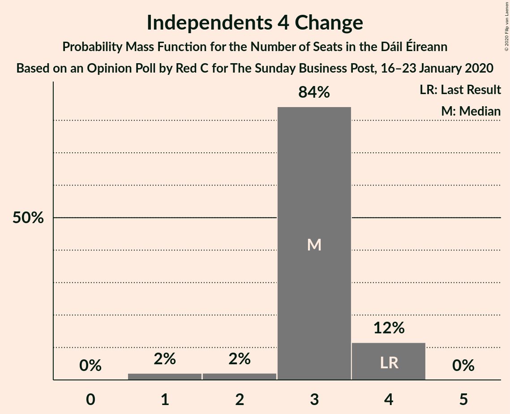
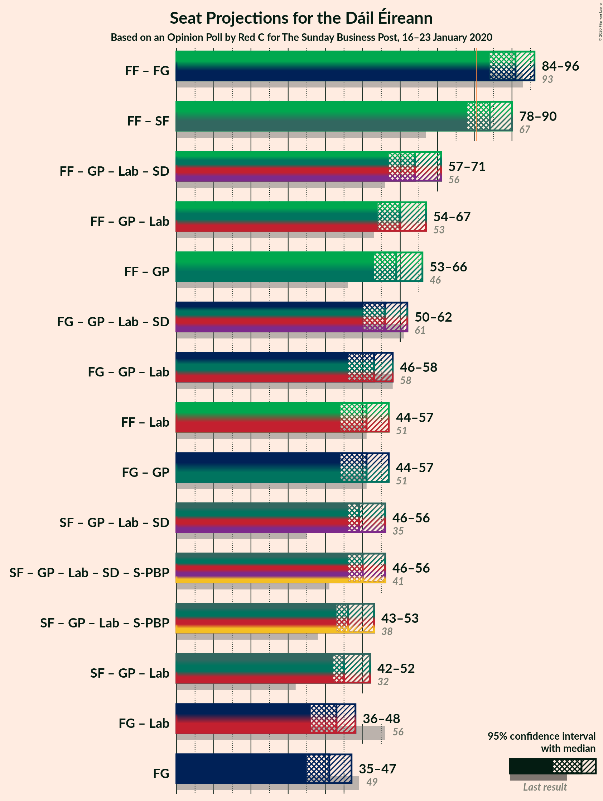
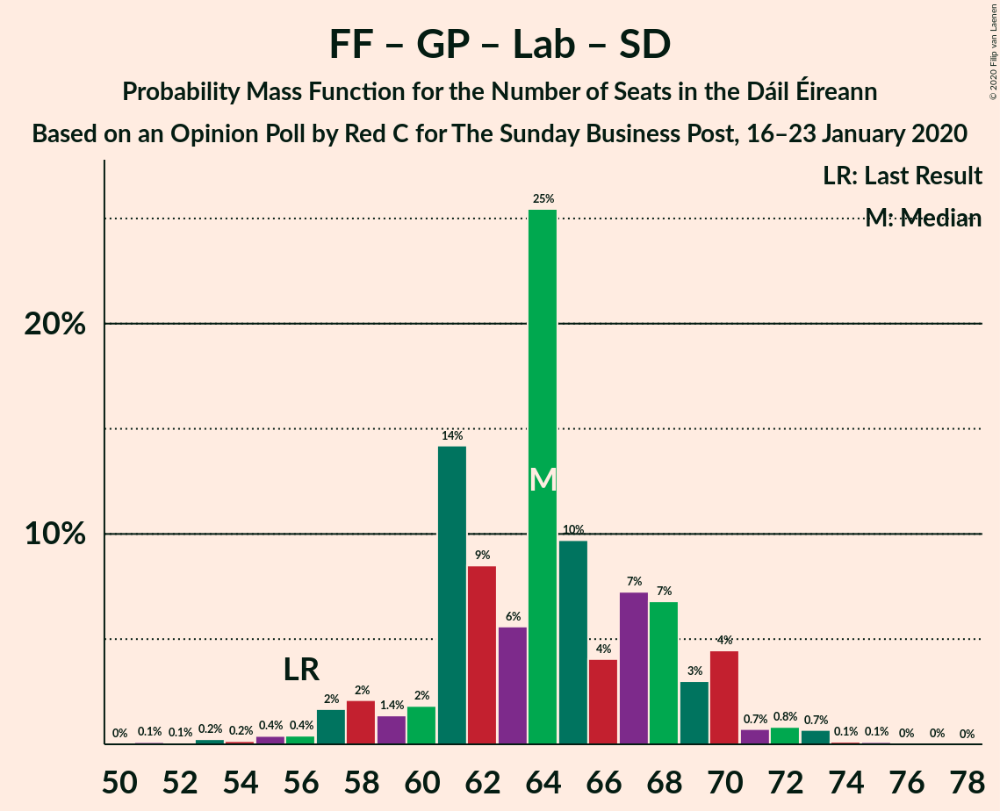
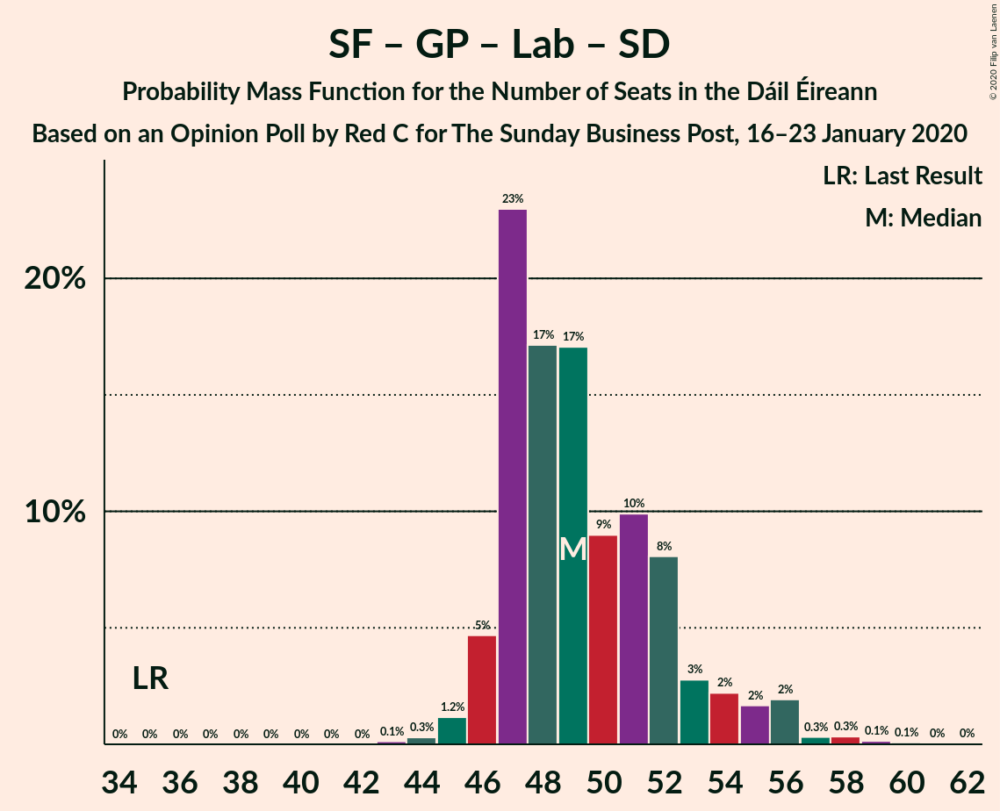
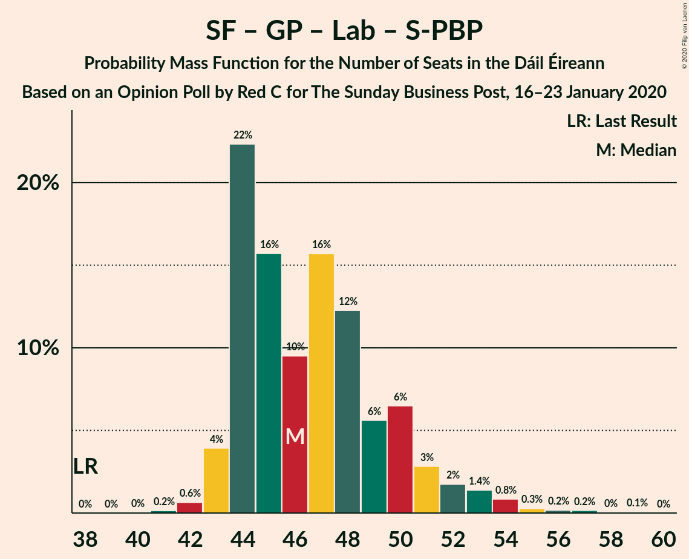

# Opinion Poll by Red C for The Sunday Business Post, 16–23 January 2020

<a href="#voting-intentions">Voting Intentions</a> | <a href="#seats">Seats</a> | <a href="#coalitions">Coalitions</a> | <a href="#technical-information">Technical Information</a>

## Voting Intentions

### Confidence Intervals

| Party | Last Result | Poll Result | 80% Confidence Interval | 90% Confidence Interval | 95% Confidence Interval | 99% Confidence Interval |
|:-----:|:-----------:|:-----------:|:-----------------------:|:-----------------------:|:-----------------------:|:-----------------------:|
| Fianna Fáil | 24.3% | 26.0% | 24.3–27.8% |23.8–28.4% |23.4–28.8% |22.6–29.7% |
| Fine Gael | 25.5% | 23.0% | 21.4–24.8% |20.9–25.3% |20.5–25.7% |19.7–26.6% |
| Sinn Féin | 13.8% | 19.0% | 17.5–20.7% |17.1–21.1% |16.7–21.6% |16.0–22.4% |
| Independent | 15.9% | 12.7% | 11.4–14.1% |11.1–14.6% |10.8–14.9% |10.2–15.6% |
| Green Party/Comhaontas Glas | 2.7% | 8.0% | 7.0–9.2% |6.7–9.6% |6.5–9.9% |6.0–10.5% |
| Labour Party | 6.6% | 4.0% | 3.3–4.9% |3.1–5.2% |2.9–5.4% |2.7–5.9% |
| Social Democrats | 3.0% | 3.0% | 2.4–3.8% |2.2–4.1% |2.1–4.3% |1.9–4.7% |
| Solidarity–People Before Profit | 3.9% | 2.0% | 1.5–2.7% |1.4–2.9% |1.3–3.1% |1.1–3.4% |
| Independents 4 Change | 1.5% | 1.6% | 1.2–2.2% |1.1–2.4% |1.0–2.6% |0.8–2.9% |

*Note:* The poll result column reflects the actual value used in the calculations. Published results may vary slightly, and in addition be rounded to fewer digits.

## Seats

### Confidence Intervals

| Party | Last Result | Median | 80% Confidence Interval | 90% Confidence Interval | 95% Confidence Interval | 99% Confidence Interval |
|:-----:|:-----------:|:------:|:-----------------------:|:-----------------------:|:-----------------------:|:-----------------------:|
| <a href="#fianna-fáil">Fianna Fáil</a> | 44 | 50 | 45–54 |44–55 |42–55 |39–57 |
| <a href="#fine-gael">Fine Gael</a> | 49 | 41 | 37–44 |36–45 |35–47 |33–50 |
| <a href="#sinn-féin">Sinn Féin</a> | 23 | 34 | 34–36 |34–36 |34–37 |33–38 |
| <a href="#independent">Independent</a> | 19 | 17 | 13–17 |13–18 |12–18 |10–19 |
| <a href="#green-party/comhaontas-glas">Green Party/Comhaontas Glas</a> | 2 | 9 | 7–12 |7–13 |7–14 |6–17 |
| <a href="#labour-party">Labour Party</a> | 7 | 1 | 0–3 |0–4 |0–5 |0–7 |
| <a href="#social-democrats">Social Democrats</a> | 3 | 3 | 3–4 |3–5 |3–6 |3–8 |
| <a href="#solidarity–people-before-profit">Solidarity–People Before Profit</a> | 6 | 1 | 0–1 |0–2 |0–3 |0–4 |
| <a href="#independents-4-change">Independents 4 Change</a> | 4 | 3 | 3–4 |3–4 |2–4 |1–4 |

### Fianna Fáil

*For a full overview of the results for this party, see the [Fianna Fáil](party-fiannafáil.html) page.*

| Number of Seats | Probability | Accumulated | Special Marks |
|:---------------:|:-----------:|:-----------:|:-------------:|
| 35 | 0% | 100% |  |
| 36 | 0% | 99.9% |  |
| 37 | 0.1% | 99.9% |  |
| 38 | 0.2% | 99.8% |  |
| 39 | 0.3% | 99.6% |  |
| 40 | 0.2% | 99.3% |  |
| 41 | 0.8% | 99.1% |  |
| 42 | 0.9% | 98% |  |
| 43 | 0.7% | 97% |  |
| 44 | 4% | 97% | Last Result |
| 45 | 3% | 93% |  |
| 46 | 4% | 90% |  |
| 47 | 15% | 85% |  |
| 48 | 8% | 71% |  |
| 49 | 10% | 63% |  |
| 50 | 9% | 53% | Median |
| 51 | 20% | 44% |  |
| 52 | 7% | 24% |  |
| 53 | 6% | 17% |  |
| 54 | 4% | 10% |  |
| 55 | 5% | 7% |  |
| 56 | 1.4% | 2% |  |
| 57 | 0.4% | 0.7% |  |
| 58 | 0.2% | 0.3% |  |
| 59 | 0% | 0% |  |

### Fine Gael

*For a full overview of the results for this party, see the [Fine Gael](party-finegael.html) page.*

| Number of Seats | Probability | Accumulated | Special Marks |
|:---------------:|:-----------:|:-----------:|:-------------:|
| 30 | 0.1% | 100% |  |
| 31 | 0.1% | 99.9% |  |
| 32 | 0.1% | 99.8% |  |
| 33 | 0.3% | 99.7% |  |
| 34 | 0.7% | 99.4% |  |
| 35 | 3% | 98.7% |  |
| 36 | 3% | 95% |  |
| 37 | 3% | 92% |  |
| 38 | 3% | 89% |  |
| 39 | 7% | 86% |  |
| 40 | 8% | 79% |  |
| 41 | 22% | 71% | Median |
| 42 | 17% | 48% |  |
| 43 | 6% | 31% |  |
| 44 | 18% | 26% |  |
| 45 | 3% | 8% |  |
| 46 | 2% | 5% |  |
| 47 | 2% | 3% |  |
| 48 | 0.7% | 2% |  |
| 49 | 0.3% | 0.9% | Last Result |
| 50 | 0.1% | 0.6% |  |
| 51 | 0.3% | 0.5% |  |
| 52 | 0% | 0.2% |  |
| 53 | 0% | 0.1% |  |
| 54 | 0% | 0.1% |  |
| 55 | 0% | 0.1% |  |
| 56 | 0% | 0% |  |

### Sinn Féin

*For a full overview of the results for this party, see the [Sinn Féin](party-sinnféin.html) page.*

| Number of Seats | Probability | Accumulated | Special Marks |
|:---------------:|:-----------:|:-----------:|:-------------:|
| 23 | 0% | 100% | Last Result |
| 24 | 0% | 100% |  |
| 25 | 0% | 100% |  |
| 26 | 0% | 100% |  |
| 27 | 0% | 100% |  |
| 28 | 0% | 100% |  |
| 29 | 0% | 100% |  |
| 30 | 0% | 100% |  |
| 31 | 0.1% | 99.9% |  |
| 32 | 0.1% | 99.8% |  |
| 33 | 0.5% | 99.7% |  |
| 34 | 54% | 99.2% | Median |
| 35 | 34% | 45% |  |
| 36 | 7% | 12% |  |
| 37 | 3% | 4% |  |
| 38 | 1.1% | 1.1% |  |
| 39 | 0% | 0% |  |

### Independent

*For a full overview of the results for this party, see the [Independent](party-independent.html) page.*

| Number of Seats | Probability | Accumulated | Special Marks |
|:---------------:|:-----------:|:-----------:|:-------------:|
| 8 | 0.1% | 100% |  |
| 9 | 0.2% | 99.9% |  |
| 10 | 0.8% | 99.6% |  |
| 11 | 1.3% | 98.8% |  |
| 12 | 2% | 98% |  |
| 13 | 13% | 95% |  |
| 14 | 4% | 83% |  |
| 15 | 6% | 79% |  |
| 16 | 14% | 73% |  |
| 17 | 50% | 59% | Median |
| 18 | 6% | 8% |  |
| 19 | 2% | 2% | Last Result |
| 20 | 0.4% | 0.4% |  |
| 21 | 0.1% | 0.1% |  |
| 22 | 0% | 0% |  |

### Green Party/Comhaontas Glas

*For a full overview of the results for this party, see the [Green Party/Comhaontas Glas](party-greenpartycomhaontasglas.html) page.*

| Number of Seats | Probability | Accumulated | Special Marks |
|:---------------:|:-----------:|:-----------:|:-------------:|
| 2 | 0% | 100% | Last Result |
| 3 | 0% | 100% |  |
| 4 | 0% | 100% |  |
| 5 | 0.2% | 100% |  |
| 6 | 1.4% | 99.8% |  |
| 7 | 8% | 98% |  |
| 8 | 31% | 90% |  |
| 9 | 17% | 59% | Median |
| 10 | 10% | 41% |  |
| 11 | 17% | 31% |  |
| 12 | 7% | 14% |  |
| 13 | 4% | 8% |  |
| 14 | 2% | 4% |  |
| 15 | 0.4% | 1.4% |  |
| 16 | 0.3% | 1.0% |  |
| 17 | 0.2% | 0.7% |  |
| 18 | 0.4% | 0.4% |  |
| 19 | 0.1% | 0.1% |  |
| 20 | 0% | 0% |  |

### Labour Party

*For a full overview of the results for this party, see the [Labour Party](party-labourparty.html) page.*

| Number of Seats | Probability | Accumulated | Special Marks |
|:---------------:|:-----------:|:-----------:|:-------------:|
| 0 | 18% | 100% |  |
| 1 | 47% | 82% | Median |
| 2 | 14% | 35% |  |
| 3 | 12% | 21% |  |
| 4 | 4% | 9% |  |
| 5 | 3% | 5% |  |
| 6 | 1.4% | 2% |  |
| 7 | 0.3% | 0.6% | Last Result |
| 8 | 0.2% | 0.2% |  |
| 9 | 0% | 0.1% |  |
| 10 | 0% | 0% |  |

### Social Democrats

*For a full overview of the results for this party, see the [Social Democrats](party-socialdemocrats.html) page.*

| Number of Seats | Probability | Accumulated | Special Marks |
|:---------------:|:-----------:|:-----------:|:-------------:|
| 2 | 0% | 100% |  |
| 3 | 57% | 99.9% | Last Result, Median |
| 4 | 35% | 43% |  |
| 5 | 4% | 8% |  |
| 6 | 2% | 4% |  |
| 7 | 1.0% | 2% |  |
| 8 | 0.4% | 0.7% |  |
| 9 | 0.3% | 0.3% |  |
| 10 | 0% | 0% |  |

### Solidarity–People Before Profit

*For a full overview of the results for this party, see the [Solidarity–People Before Profit](party-solidarity–peoplebeforeprofit.html) page.*

| Number of Seats | Probability | Accumulated | Special Marks |
|:---------------:|:-----------:|:-----------:|:-------------:|
| 0 | 23% | 100% |  |
| 1 | 68% | 77% | Median |
| 2 | 4% | 8% |  |
| 3 | 4% | 5% |  |
| 4 | 0.7% | 0.7% |  |
| 5 | 0% | 0% |  |
| 6 | 0% | 0% | Last Result |

### Independents 4 Change

*For a full overview of the results for this party, see the [Independents 4 Change](party-independents4change.html) page.*

| Number of Seats | Probability | Accumulated | Special Marks |
|:---------------:|:-----------:|:-----------:|:-------------:|
| 1 | 2% | 100% |  |
| 2 | 2% | 98% |  |
| 3 | 84% | 96% | Median |
| 4 | 12% | 12% | Last Result |
| 5 | 0% | 0% |  |

## Coalitions

### Confidence Intervals

| Coalition | Last Result | Median | Majority? | 80% Confidence Interval | 90% Confidence Interval | 95% Confidence Interval | 99% Confidence Interval |
|:---------:|:-----------:|:------:|:---------:|:-----------------------:|:-----------------------:|:-----------------------:|:-----------------------:|
| Fianna Fáil – Fine Gael | 93 | 91 | 99.7% | 87–94 | 85–96 | 84–96 | 81–99 |
| Fianna Fáil – Sinn Féin | 67 | 84 | 90% | 80–89 | 79–89 | 78–90 | 74–92 |
| Fianna Fáil – Green Party/Comhaontas Glas – Labour Party – Social Democrats | 56 | 64 | 0% | 61–68 | 58–70 | 57–71 | 53–73 |
| Fianna Fáil – Green Party/Comhaontas Glas – Labour Party | 53 | 60 | 0% | 57–65 | 55–66 | 54–67 | 50–70 |
| Fianna Fáil – Green Party/Comhaontas Glas | 46 | 59 | 0% | 55–63 | 53–66 | 53–66 | 49–68 |
| Fine Gael – Green Party/Comhaontas Glas – Labour Party – Social Democrats | 61 | 56 | 0% | 52–59 | 51–60 | 50–62 | 49–65 |
| Fine Gael – Green Party/Comhaontas Glas – Labour Party | 58 | 53 | 0% | 49–56 | 47–57 | 46–58 | 45–61 |
| Fianna Fáil – Labour Party | 51 | 51 | 0% | 47–55 | 45–56 | 44–57 | 41–58 |
| Fine Gael – Green Party/Comhaontas Glas | 51 | 51 | 0% | 48–54 | 46–56 | 44–57 | 43–60 |
| Sinn Féin – Green Party/Comhaontas Glas – Labour Party – Social Democrats | 35 | 49 | 0% | 47–52 | 46–54 | 46–56 | 45–58 |
| Sinn Féin – Green Party/Comhaontas Glas – Labour Party – Social Democrats – Solidarity–People Before Profit | 41 | 50 | 0% | 47–54 | 47–55 | 46–56 | 46–59 |
| Sinn Féin – Green Party/Comhaontas Glas – Labour Party – Solidarity–People Before Profit | 38 | 46 | 0% | 44–50 | 44–51 | 43–53 | 42–55 |
| Sinn Féin – Green Party/Comhaontas Glas – Labour Party | 32 | 45 | 0% | 43–49 | 43–50 | 42–52 | 41–54 |
| Fine Gael – Labour Party | 56 | 43 | 0% | 39–47 | 37–47 | 36–48 | 34–52 |
| Fine Gael | 49 | 41 | 0% | 37–44 | 36–45 | 35–47 | 33–50 |

### Fianna Fáil – Fine Gael

| Number of Seats | Probability | Accumulated | Special Marks |
|:---------------:|:-----------:|:-----------:|:-------------:|
| 78 | 0.1% | 100% |  |
| 79 | 0.1% | 99.9% |  |
| 80 | 0.1% | 99.8% |  |
| 81 | 0.2% | 99.7% | Majority |
| 82 | 0.4% | 99.5% |  |
| 83 | 0.5% | 99.1% |  |
| 84 | 2% | 98.6% |  |
| 85 | 1.4% | 96% |  |
| 86 | 4% | 95% |  |
| 87 | 6% | 91% |  |
| 88 | 6% | 85% |  |
| 89 | 5% | 79% |  |
| 90 | 8% | 74% |  |
| 91 | 18% | 66% | Median |
| 92 | 26% | 48% |  |
| 93 | 8% | 22% | Last Result |
| 94 | 5% | 14% |  |
| 95 | 4% | 9% |  |
| 96 | 3% | 5% |  |
| 97 | 1.0% | 2% |  |
| 98 | 0.6% | 1.2% |  |
| 99 | 0.4% | 0.7% |  |
| 100 | 0.1% | 0.2% |  |
| 101 | 0.1% | 0.1% |  |
| 102 | 0% | 0% |  |

### Fianna Fáil – Sinn Féin

| Number of Seats | Probability | Accumulated | Special Marks |
|:---------------:|:-----------:|:-----------:|:-------------:|
| 67 | 0% | 100% | Last Result |
| 68 | 0% | 100% |  |
| 69 | 0% | 100% |  |
| 70 | 0% | 100% |  |
| 71 | 0% | 99.9% |  |
| 72 | 0% | 99.9% |  |
| 73 | 0.1% | 99.9% |  |
| 74 | 0.3% | 99.8% |  |
| 75 | 0.4% | 99.5% |  |
| 76 | 0.7% | 99.1% |  |
| 77 | 0.5% | 98% |  |
| 78 | 1.2% | 98% |  |
| 79 | 3% | 97% |  |
| 80 | 4% | 94% |  |
| 81 | 7% | 90% | Majority |
| 82 | 14% | 82% |  |
| 83 | 11% | 68% |  |
| 84 | 9% | 56% | Median |
| 85 | 20% | 47% |  |
| 86 | 4% | 27% |  |
| 87 | 8% | 23% |  |
| 88 | 5% | 15% |  |
| 89 | 6% | 10% |  |
| 90 | 3% | 5% |  |
| 91 | 0.6% | 1.3% |  |
| 92 | 0.5% | 0.7% |  |
| 93 | 0.2% | 0.2% |  |
| 94 | 0% | 0% |  |

### Fianna Fáil – Green Party/Comhaontas Glas – Labour Party – Social Democrats

| Number of Seats | Probability | Accumulated | Special Marks |
|:---------------:|:-----------:|:-----------:|:-------------:|
| 50 | 0% | 100% |  |
| 51 | 0.1% | 99.9% |  |
| 52 | 0.1% | 99.8% |  |
| 53 | 0.2% | 99.7% |  |
| 54 | 0.2% | 99.5% |  |
| 55 | 0.4% | 99.3% |  |
| 56 | 0.4% | 98.9% | Last Result |
| 57 | 2% | 98.5% |  |
| 58 | 2% | 97% |  |
| 59 | 1.4% | 95% |  |
| 60 | 2% | 93% |  |
| 61 | 14% | 92% |  |
| 62 | 9% | 77% |  |
| 63 | 6% | 69% | Median |
| 64 | 25% | 63% |  |
| 65 | 10% | 38% |  |
| 66 | 4% | 28% |  |
| 67 | 7% | 24% |  |
| 68 | 7% | 17% |  |
| 69 | 3% | 10% |  |
| 70 | 4% | 7% |  |
| 71 | 0.7% | 3% |  |
| 72 | 0.8% | 2% |  |
| 73 | 0.7% | 1.0% |  |
| 74 | 0.1% | 0.3% |  |
| 75 | 0.1% | 0.2% |  |
| 76 | 0% | 0.1% |  |
| 77 | 0% | 0% |  |

### Fianna Fáil – Green Party/Comhaontas Glas – Labour Party

| Number of Seats | Probability | Accumulated | Special Marks |
|:---------------:|:-----------:|:-----------:|:-------------:|
| 45 | 0.1% | 100% |  |
| 46 | 0% | 99.9% |  |
| 47 | 0.1% | 99.9% |  |
| 48 | 0.2% | 99.9% |  |
| 49 | 0.1% | 99.7% |  |
| 50 | 0.2% | 99.6% |  |
| 51 | 0.1% | 99.4% |  |
| 52 | 0.4% | 99.2% |  |
| 53 | 0.5% | 98.8% | Last Result |
| 54 | 3% | 98% |  |
| 55 | 1.2% | 95% |  |
| 56 | 2% | 94% |  |
| 57 | 6% | 92% |  |
| 58 | 12% | 86% |  |
| 59 | 10% | 74% |  |
| 60 | 18% | 64% | Median |
| 61 | 12% | 46% |  |
| 62 | 9% | 34% |  |
| 63 | 4% | 25% |  |
| 64 | 8% | 21% |  |
| 65 | 4% | 12% |  |
| 66 | 3% | 8% |  |
| 67 | 3% | 5% |  |
| 68 | 0.8% | 2% |  |
| 69 | 0.6% | 1.3% |  |
| 70 | 0.5% | 0.7% |  |
| 71 | 0.1% | 0.2% |  |
| 72 | 0.1% | 0.1% |  |
| 73 | 0% | 0% |  |

### Fianna Fáil – Green Party/Comhaontas Glas

| Number of Seats | Probability | Accumulated | Special Marks |
|:---------------:|:-----------:|:-----------:|:-------------:|
| 45 | 0.1% | 100% |  |
| 46 | 0.1% | 99.9% | Last Result |
| 47 | 0.2% | 99.8% |  |
| 48 | 0.1% | 99.6% |  |
| 49 | 0.3% | 99.5% |  |
| 50 | 0.4% | 99.2% |  |
| 51 | 0.3% | 98.9% |  |
| 52 | 0.9% | 98.5% |  |
| 53 | 4% | 98% |  |
| 54 | 2% | 94% |  |
| 55 | 9% | 92% |  |
| 56 | 9% | 83% |  |
| 57 | 6% | 74% |  |
| 58 | 10% | 68% |  |
| 59 | 21% | 58% | Median |
| 60 | 6% | 37% |  |
| 61 | 9% | 31% |  |
| 62 | 4% | 22% |  |
| 63 | 8% | 18% |  |
| 64 | 2% | 10% |  |
| 65 | 2% | 7% |  |
| 66 | 4% | 5% |  |
| 67 | 0.8% | 2% |  |
| 68 | 0.3% | 0.7% |  |
| 69 | 0.3% | 0.5% |  |
| 70 | 0.1% | 0.2% |  |
| 71 | 0.1% | 0.1% |  |
| 72 | 0% | 0% |  |

### Fine Gael – Green Party/Comhaontas Glas – Labour Party – Social Democrats

| Number of Seats | Probability | Accumulated | Special Marks |
|:---------------:|:-----------:|:-----------:|:-------------:|
| 46 | 0% | 100% |  |
| 47 | 0.1% | 99.9% |  |
| 48 | 0.2% | 99.8% |  |
| 49 | 1.3% | 99.6% |  |
| 50 | 2% | 98% |  |
| 51 | 3% | 96% |  |
| 52 | 4% | 93% |  |
| 53 | 4% | 89% |  |
| 54 | 20% | 85% | Median |
| 55 | 7% | 65% |  |
| 56 | 10% | 58% |  |
| 57 | 17% | 48% |  |
| 58 | 18% | 32% |  |
| 59 | 5% | 14% |  |
| 60 | 4% | 8% |  |
| 61 | 1.2% | 4% | Last Result |
| 62 | 1.1% | 3% |  |
| 63 | 0.9% | 2% |  |
| 64 | 0.6% | 1.2% |  |
| 65 | 0.2% | 0.5% |  |
| 66 | 0.2% | 0.4% |  |
| 67 | 0.1% | 0.2% |  |
| 68 | 0.1% | 0.1% |  |
| 69 | 0% | 0.1% |  |
| 70 | 0% | 0% |  |

### Fine Gael – Green Party/Comhaontas Glas – Labour Party

| Number of Seats | Probability | Accumulated | Special Marks |
|:---------------:|:-----------:|:-----------:|:-------------:|
| 42 | 0% | 100% |  |
| 43 | 0.1% | 99.9% |  |
| 44 | 0.1% | 99.8% |  |
| 45 | 0.9% | 99.7% |  |
| 46 | 2% | 98.8% |  |
| 47 | 3% | 97% |  |
| 48 | 4% | 94% |  |
| 49 | 4% | 90% |  |
| 50 | 20% | 87% |  |
| 51 | 5% | 67% | Median |
| 52 | 8% | 61% |  |
| 53 | 12% | 53% |  |
| 54 | 16% | 41% |  |
| 55 | 14% | 25% |  |
| 56 | 5% | 11% |  |
| 57 | 3% | 6% |  |
| 58 | 1.0% | 3% | Last Result |
| 59 | 0.7% | 2% |  |
| 60 | 0.8% | 2% |  |
| 61 | 0.6% | 0.9% |  |
| 62 | 0.1% | 0.3% |  |
| 63 | 0.1% | 0.2% |  |
| 64 | 0% | 0.2% |  |
| 65 | 0.1% | 0.1% |  |
| 66 | 0% | 0% |  |

### Fianna Fáil – Labour Party

| Number of Seats | Probability | Accumulated | Special Marks |
|:---------------:|:-----------:|:-----------:|:-------------:|
| 35 | 0.1% | 100% |  |
| 36 | 0% | 99.9% |  |
| 37 | 0% | 99.9% |  |
| 38 | 0.1% | 99.9% |  |
| 39 | 0.1% | 99.8% |  |
| 40 | 0.2% | 99.7% |  |
| 41 | 0.4% | 99.5% |  |
| 42 | 0.6% | 99.1% |  |
| 43 | 0.7% | 98.5% |  |
| 44 | 0.5% | 98% |  |
| 45 | 3% | 97% |  |
| 46 | 2% | 94% |  |
| 47 | 2% | 92% |  |
| 48 | 8% | 90% |  |
| 49 | 6% | 81% |  |
| 50 | 21% | 75% |  |
| 51 | 6% | 55% | Last Result, Median |
| 52 | 20% | 49% |  |
| 53 | 7% | 29% |  |
| 54 | 9% | 23% |  |
| 55 | 6% | 14% |  |
| 56 | 4% | 7% |  |
| 57 | 2% | 3% |  |
| 58 | 0.9% | 1.2% |  |
| 59 | 0.2% | 0.2% |  |
| 60 | 0% | 0.1% |  |
| 61 | 0% | 0% |  |

### Fine Gael – Green Party/Comhaontas Glas

| Number of Seats | Probability | Accumulated | Special Marks |
|:---------------:|:-----------:|:-----------:|:-------------:|
| 41 | 0.1% | 100% |  |
| 42 | 0.1% | 99.9% |  |
| 43 | 0.4% | 99.8% |  |
| 44 | 2% | 99.4% |  |
| 45 | 2% | 97% |  |
| 46 | 3% | 95% |  |
| 47 | 2% | 92% |  |
| 48 | 6% | 90% |  |
| 49 | 22% | 84% |  |
| 50 | 8% | 62% | Median |
| 51 | 11% | 54% | Last Result |
| 52 | 12% | 43% |  |
| 53 | 17% | 32% |  |
| 54 | 7% | 15% |  |
| 55 | 3% | 8% |  |
| 56 | 2% | 5% |  |
| 57 | 0.9% | 3% |  |
| 58 | 0.7% | 2% |  |
| 59 | 0.8% | 1.3% |  |
| 60 | 0.3% | 0.6% |  |
| 61 | 0.1% | 0.3% |  |
| 62 | 0.1% | 0.2% |  |
| 63 | 0% | 0.1% |  |
| 64 | 0.1% | 0.1% |  |
| 65 | 0% | 0% |  |

### Sinn Féin – Green Party/Comhaontas Glas – Labour Party – Social Democrats

| Number of Seats | Probability | Accumulated | Special Marks |
|:---------------:|:-----------:|:-----------:|:-------------:|
| 35 | 0% | 100% | Last Result |
| 36 | 0% | 100% |  |
| 37 | 0% | 100% |  |
| 38 | 0% | 100% |  |
| 39 | 0% | 100% |  |
| 40 | 0% | 100% |  |
| 41 | 0% | 100% |  |
| 42 | 0% | 100% |  |
| 43 | 0.1% | 100% |  |
| 44 | 0.3% | 99.8% |  |
| 45 | 1.2% | 99.5% |  |
| 46 | 5% | 98% |  |
| 47 | 23% | 94% | Median |
| 48 | 17% | 71% |  |
| 49 | 17% | 54% |  |
| 50 | 9% | 37% |  |
| 51 | 10% | 28% |  |
| 52 | 8% | 18% |  |
| 53 | 3% | 10% |  |
| 54 | 2% | 7% |  |
| 55 | 2% | 5% |  |
| 56 | 2% | 3% |  |
| 57 | 0.3% | 1.0% |  |
| 58 | 0.3% | 0.7% |  |
| 59 | 0.1% | 0.3% |  |
| 60 | 0.1% | 0.2% |  |
| 61 | 0% | 0.1% |  |
| 62 | 0% | 0% |  |

### Sinn Féin – Green Party/Comhaontas Glas – Labour Party – Social Democrats – Solidarity–People Before Profit

| Number of Seats | Probability | Accumulated | Special Marks |
|:---------------:|:-----------:|:-----------:|:-------------:|
| 41 | 0% | 100% | Last Result |
| 42 | 0% | 100% |  |
| 43 | 0% | 100% |  |
| 44 | 0.1% | 100% |  |
| 45 | 0.2% | 99.8% |  |
| 46 | 3% | 99.7% |  |
| 47 | 8% | 97% |  |
| 48 | 24% | 89% | Median |
| 49 | 11% | 65% |  |
| 50 | 17% | 54% |  |
| 51 | 10% | 37% |  |
| 52 | 10% | 27% |  |
| 53 | 7% | 18% |  |
| 54 | 3% | 10% |  |
| 55 | 2% | 7% |  |
| 56 | 3% | 5% |  |
| 57 | 1.2% | 2% |  |
| 58 | 0.3% | 1.0% |  |
| 59 | 0.3% | 0.7% |  |
| 60 | 0.2% | 0.4% |  |
| 61 | 0.1% | 0.2% |  |
| 62 | 0.1% | 0.1% |  |
| 63 | 0% | 0.1% |  |
| 64 | 0% | 0% |  |

### Sinn Féin – Green Party/Comhaontas Glas – Labour Party – Solidarity–People Before Profit

| Number of Seats | Probability | Accumulated | Special Marks |
|:---------------:|:-----------:|:-----------:|:-------------:|
| 38 | 0% | 100% | Last Result |
| 39 | 0% | 100% |  |
| 40 | 0% | 100% |  |
| 41 | 0.2% | 99.9% |  |
| 42 | 0.6% | 99.8% |  |
| 43 | 4% | 99.1% |  |
| 44 | 22% | 95% |  |
| 45 | 16% | 73% | Median |
| 46 | 10% | 57% |  |
| 47 | 16% | 48% |  |
| 48 | 12% | 32% |  |
| 49 | 6% | 20% |  |
| 50 | 6% | 14% |  |
| 51 | 3% | 8% |  |
| 52 | 2% | 5% |  |
| 53 | 1.4% | 3% |  |
| 54 | 0.8% | 2% |  |
| 55 | 0.3% | 0.7% |  |
| 56 | 0.2% | 0.5% |  |
| 57 | 0.2% | 0.3% |  |
| 58 | 0% | 0.1% |  |
| 59 | 0.1% | 0.1% |  |
| 60 | 0% | 0% |  |

### Sinn Féin – Green Party/Comhaontas Glas – Labour Party

| Number of Seats | Probability | Accumulated | Special Marks |
|:---------------:|:-----------:|:-----------:|:-------------:|
| 32 | 0% | 100% | Last Result |
| 33 | 0% | 100% |  |
| 34 | 0% | 100% |  |
| 35 | 0% | 100% |  |
| 36 | 0% | 100% |  |
| 37 | 0% | 100% |  |
| 38 | 0% | 100% |  |
| 39 | 0% | 100% |  |
| 40 | 0.1% | 100% |  |
| 41 | 0.4% | 99.8% |  |
| 42 | 3% | 99.4% |  |
| 43 | 19% | 96% |  |
| 44 | 14% | 78% | Median |
| 45 | 16% | 63% |  |
| 46 | 16% | 47% |  |
| 47 | 12% | 31% |  |
| 48 | 6% | 19% |  |
| 49 | 6% | 14% |  |
| 50 | 3% | 8% |  |
| 51 | 2% | 5% |  |
| 52 | 1.3% | 3% |  |
| 53 | 0.9% | 2% |  |
| 54 | 0.3% | 0.7% |  |
| 55 | 0.2% | 0.4% |  |
| 56 | 0.1% | 0.2% |  |
| 57 | 0% | 0.1% |  |
| 58 | 0% | 0.1% |  |
| 59 | 0% | 0% |  |

### Fine Gael – Labour Party

| Number of Seats | Probability | Accumulated | Special Marks |
|:---------------:|:-----------:|:-----------:|:-------------:|
| 31 | 0% | 100% |  |
| 32 | 0% | 99.9% |  |
| 33 | 0.1% | 99.9% |  |
| 34 | 0.4% | 99.8% |  |
| 35 | 0.7% | 99.5% |  |
| 36 | 2% | 98.7% |  |
| 37 | 3% | 97% |  |
| 38 | 3% | 94% |  |
| 39 | 3% | 91% |  |
| 40 | 7% | 88% |  |
| 41 | 7% | 81% |  |
| 42 | 23% | 74% | Median |
| 43 | 11% | 51% |  |
| 44 | 9% | 40% |  |
| 45 | 11% | 32% |  |
| 46 | 6% | 21% |  |
| 47 | 11% | 15% |  |
| 48 | 3% | 4% |  |
| 49 | 0.5% | 2% |  |
| 50 | 0.5% | 1.2% |  |
| 51 | 0.2% | 0.7% |  |
| 52 | 0.2% | 0.6% |  |
| 53 | 0.1% | 0.3% |  |
| 54 | 0.1% | 0.2% |  |
| 55 | 0% | 0.1% |  |
| 56 | 0.1% | 0.1% | Last Result |
| 57 | 0% | 0% |  |

### Fine Gael

| Number of Seats | Probability | Accumulated | Special Marks |
|:---------------:|:-----------:|:-----------:|:-------------:|
| 30 | 0.1% | 100% |  |
| 31 | 0.1% | 99.9% |  |
| 32 | 0.1% | 99.8% |  |
| 33 | 0.3% | 99.7% |  |
| 34 | 0.7% | 99.4% |  |
| 35 | 3% | 98.7% |  |
| 36 | 3% | 95% |  |
| 37 | 3% | 92% |  |
| 38 | 3% | 89% |  |
| 39 | 7% | 86% |  |
| 40 | 8% | 79% |  |
| 41 | 22% | 71% | Median |
| 42 | 17% | 48% |  |
| 43 | 6% | 31% |  |
| 44 | 18% | 26% |  |
| 45 | 3% | 8% |  |
| 46 | 2% | 5% |  |
| 47 | 2% | 3% |  |
| 48 | 0.7% | 2% |  |
| 49 | 0.3% | 0.9% | Last Result |
| 50 | 0.1% | 0.6% |  |
| 51 | 0.3% | 0.5% |  |
| 52 | 0% | 0.2% |  |
| 53 | 0% | 0.1% |  |
| 54 | 0% | 0.1% |  |
| 55 | 0% | 0.1% |  |
| 56 | 0% | 0% |  |

## Technical Information

### Opinion Poll

+ **Polling firm:** Red C
+ **Commissioner(s):** The Sunday Business Post
+ **Fieldwork period:** 16–23 January 2020

### Calculations

+ **Sample size:** 1000
+ **Simulations done:** 1,048,576
+ **Error estimate:** 2.07%

