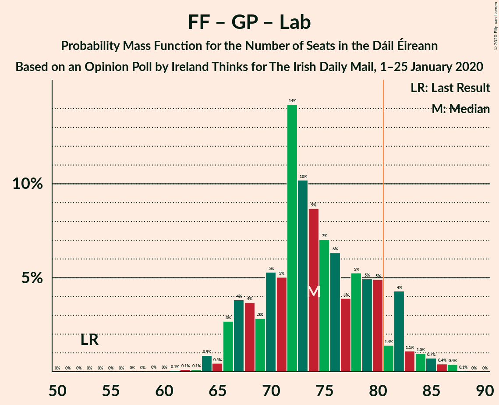
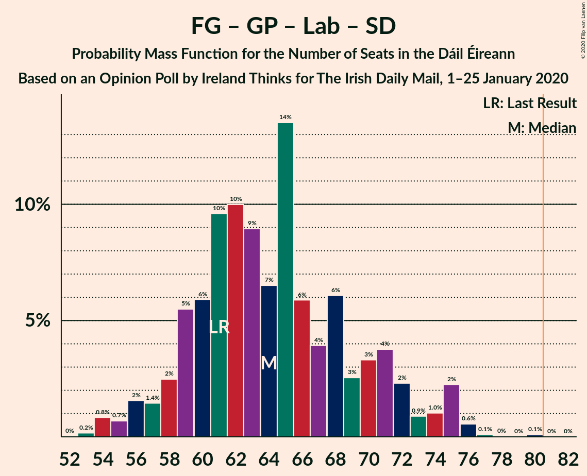
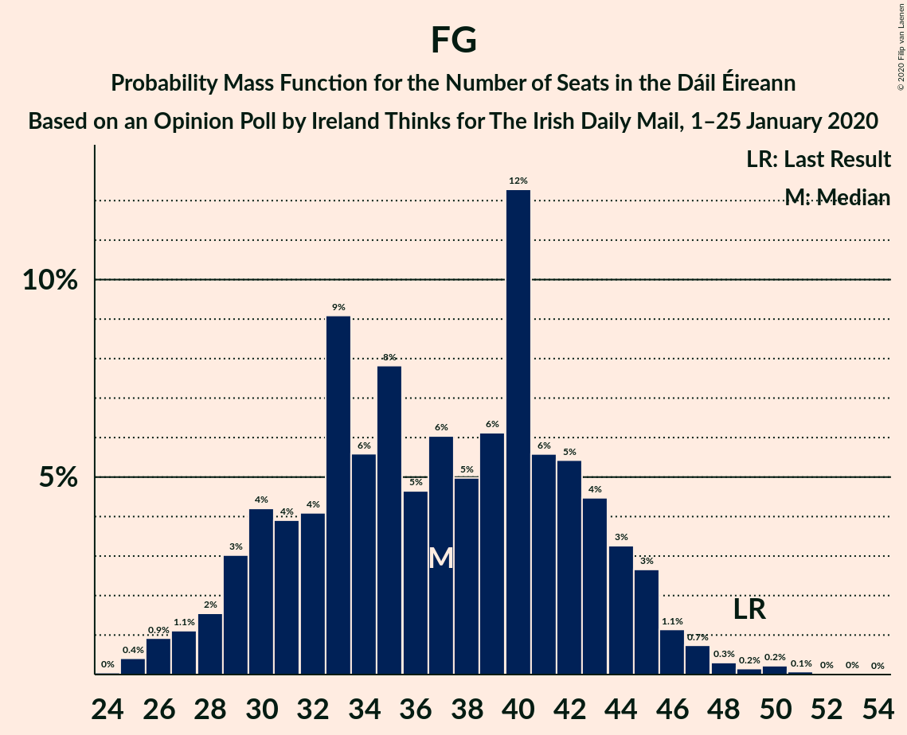

# Opinion Poll by Ireland Thinks for The Irish Daily Mail, 1–25 January 2020

<a href="#voting-intentions">Voting Intentions</a> | <a href="#seats">Seats</a> | <a href="#coalitions">Coalitions</a> | <a href="#technical-information">Technical Information</a>

## Voting Intentions

### Confidence Intervals

| Party | Last Result | Poll Result | 80% Confidence Interval | 90% Confidence Interval | 95% Confidence Interval | 99% Confidence Interval |
|:-----:|:-----------:|:-----------:|:-----------------------:|:-----------------------:|:-----------------------:|:-----------------------:|
| Fianna Fáil | 24.3% | 27.0% | 25.2–28.9% |24.7–29.4% |24.2–29.9% |23.4–30.8% |
| Fine Gael | 25.5% | 22.0% | 20.3–23.8% |19.8–24.3% |19.4–24.7% |18.7–25.6% |
| Sinn Féin | 13.8% | 20.0% | 18.4–21.7% |17.9–22.2% |17.5–22.6% |16.8–23.5% |
| Green Party/Comhaontas Glas | 2.7% | 10.0% | 8.8–11.3% |8.5–11.7% |8.2–12.1% |7.7–12.7% |
| Independent | 15.9% | 9.3% | 8.2–10.7% |7.9–11.1% |7.6–11.4% |7.1–12.0% |
| Labour Party | 6.6% | 6.1% | 5.2–7.2% |4.9–7.5% |4.7–7.8% |4.3–8.3% |
| Social Democrats | 3.0% | 3.0% | 2.4–3.8% |2.2–4.1% |2.1–4.3% |1.8–4.7% |
| Independents 4 Change | 1.5% | 1.2% | 0.8–1.8% |0.7–1.9% |0.7–2.1% |0.5–2.4% |
| Solidarity–People Before Profit | 3.9% | 1.0% | 0.7–1.5% |0.6–1.7% |0.5–1.8% |0.4–2.1% |

*Note:* The poll result column reflects the actual value used in the calculations. Published results may vary slightly, and in addition be rounded to fewer digits.

## Seats

### Confidence Intervals

| Party | Last Result | Median | 80% Confidence Interval | 90% Confidence Interval | 95% Confidence Interval | 99% Confidence Interval |
|:-----:|:-----------:|:------:|:-----------------------:|:-----------------------:|:-----------------------:|:-----------------------:|
| <a href="#fianna-fáil">Fianna Fáil</a> | 44 | 49 | 45–55 |44–56 |44–57 |40–58 |
| <a href="#fine-gael">Fine Gael</a> | 49 | 37 | 31–43 |30–44 |28–45 |26–48 |
| <a href="#sinn-féin">Sinn Féin</a> | 23 | 36 | 34–39 |34–40 |34–40 |33–42 |
| <a href="#green-party/comhaontas-glas">Green Party/Comhaontas Glas</a> | 2 | 15 | 9–19 |8–20 |7–21 |7–23 |
| <a href="#independent">Independent</a> | 19 | 7 | 3–13 |3–14 |3–15 |3–15 |
| <a href="#labour-party">Labour Party</a> | 7 | 8 | 4–15 |3–16 |2–17 |1–18 |
| <a href="#social-democrats">Social Democrats</a> | 3 | 3 | 3–4 |3–5 |3–7 |3–9 |
| <a href="#independents-4-change">Independents 4 Change</a> | 4 | 2 | 2–3 |2–3 |1–3 |0–3 |
| <a href="#solidarity–people-before-profit">Solidarity–People Before Profit</a> | 6 | 0 | 0 |0–1 |0–1 |0–1 |

### Fianna Fáil

*For a full overview of the results for this party, see the [Fianna Fáil](party-fiannafáil.html) page.*

| Number of Seats | Probability | Accumulated | Special Marks |
|:---------------:|:-----------:|:-----------:|:-------------:|
| 36 | 0% | 100% |  |
| 37 | 0.1% | 99.9% |  |
| 38 | 0.2% | 99.9% |  |
| 39 | 0.1% | 99.7% |  |
| 40 | 0.3% | 99.6% |  |
| 41 | 0.3% | 99.4% |  |
| 42 | 0.9% | 99.1% |  |
| 43 | 0.5% | 98% |  |
| 44 | 4% | 98% | Last Result |
| 45 | 7% | 94% |  |
| 46 | 9% | 87% |  |
| 47 | 11% | 78% |  |
| 48 | 9% | 67% |  |
| 49 | 17% | 58% | Median |
| 50 | 7% | 41% |  |
| 51 | 5% | 34% |  |
| 52 | 6% | 29% |  |
| 53 | 8% | 23% |  |
| 54 | 3% | 16% |  |
| 55 | 4% | 12% |  |
| 56 | 6% | 9% |  |
| 57 | 2% | 3% |  |
| 58 | 0.8% | 1.0% |  |
| 59 | 0.2% | 0.3% |  |
| 60 | 0% | 0% |  |

### Fine Gael

*For a full overview of the results for this party, see the [Fine Gael](party-finegael.html) page.*

| Number of Seats | Probability | Accumulated | Special Marks |
|:---------------:|:-----------:|:-----------:|:-------------:|
| 24 | 0% | 100% |  |
| 25 | 0.3% | 99.9% |  |
| 26 | 0.6% | 99.7% |  |
| 27 | 1.1% | 99.1% |  |
| 28 | 1.0% | 98% |  |
| 29 | 2% | 97% |  |
| 30 | 4% | 95% |  |
| 31 | 4% | 91% |  |
| 32 | 6% | 87% |  |
| 33 | 11% | 81% |  |
| 34 | 7% | 70% |  |
| 35 | 6% | 63% |  |
| 36 | 6% | 57% |  |
| 37 | 6% | 51% | Median |
| 38 | 4% | 45% |  |
| 39 | 13% | 41% |  |
| 40 | 8% | 28% |  |
| 41 | 4% | 20% |  |
| 42 | 5% | 16% |  |
| 43 | 3% | 11% |  |
| 44 | 4% | 8% |  |
| 45 | 2% | 4% |  |
| 46 | 1.0% | 2% |  |
| 47 | 0.4% | 1.1% |  |
| 48 | 0.3% | 0.7% |  |
| 49 | 0.3% | 0.5% | Last Result |
| 50 | 0.1% | 0.2% |  |
| 51 | 0% | 0.1% |  |
| 52 | 0% | 0% |  |

### Sinn Féin

*For a full overview of the results for this party, see the [Sinn Féin](party-sinnféin.html) page.*

| Number of Seats | Probability | Accumulated | Special Marks |
|:---------------:|:-----------:|:-----------:|:-------------:|
| 23 | 0% | 100% | Last Result |
| 24 | 0% | 100% |  |
| 25 | 0% | 100% |  |
| 26 | 0% | 100% |  |
| 27 | 0% | 100% |  |
| 28 | 0% | 100% |  |
| 29 | 0% | 100% |  |
| 30 | 0% | 100% |  |
| 31 | 0% | 100% |  |
| 32 | 0.1% | 99.9% |  |
| 33 | 1.2% | 99.8% |  |
| 34 | 19% | 98.6% |  |
| 35 | 14% | 79% |  |
| 36 | 16% | 66% | Median |
| 37 | 10% | 50% |  |
| 38 | 17% | 40% |  |
| 39 | 15% | 23% |  |
| 40 | 6% | 7% |  |
| 41 | 0.9% | 1.5% |  |
| 42 | 0.5% | 0.6% |  |
| 43 | 0% | 0.1% |  |
| 44 | 0% | 0% |  |

### Green Party/Comhaontas Glas

*For a full overview of the results for this party, see the [Green Party/Comhaontas Glas](party-greenpartycomhaontasglas.html) page.*

| Number of Seats | Probability | Accumulated | Special Marks |
|:---------------:|:-----------:|:-----------:|:-------------:|
| 2 | 0% | 100% | Last Result |
| 3 | 0% | 100% |  |
| 4 | 0% | 100% |  |
| 5 | 0% | 100% |  |
| 6 | 0% | 100% |  |
| 7 | 3% | 100% |  |
| 8 | 3% | 97% |  |
| 9 | 5% | 94% |  |
| 10 | 10% | 89% |  |
| 11 | 6% | 79% |  |
| 12 | 7% | 73% |  |
| 13 | 6% | 66% |  |
| 14 | 3% | 60% |  |
| 15 | 8% | 57% | Median |
| 16 | 5% | 49% |  |
| 17 | 3% | 44% |  |
| 18 | 6% | 41% |  |
| 19 | 28% | 35% |  |
| 20 | 4% | 7% |  |
| 21 | 2% | 4% |  |
| 22 | 0.7% | 1.2% |  |
| 23 | 0.2% | 0.5% |  |
| 24 | 0.2% | 0.3% |  |
| 25 | 0% | 0% |  |

### Independent

*For a full overview of the results for this party, see the [Independent](party-independent.html) page.*

| Number of Seats | Probability | Accumulated | Special Marks |
|:---------------:|:-----------:|:-----------:|:-------------:|
| 3 | 21% | 100% |  |
| 4 | 6% | 79% |  |
| 5 | 7% | 74% |  |
| 6 | 6% | 67% |  |
| 7 | 18% | 61% | Median |
| 8 | 11% | 42% |  |
| 9 | 5% | 31% |  |
| 10 | 5% | 26% |  |
| 11 | 6% | 21% |  |
| 12 | 2% | 15% |  |
| 13 | 7% | 14% |  |
| 14 | 3% | 7% |  |
| 15 | 3% | 4% |  |
| 16 | 0.3% | 0.5% |  |
| 17 | 0.1% | 0.1% |  |
| 18 | 0% | 0% |  |
| 19 | 0% | 0% | Last Result |

### Labour Party

*For a full overview of the results for this party, see the [Labour Party](party-labourparty.html) page.*

| Number of Seats | Probability | Accumulated | Special Marks |
|:---------------:|:-----------:|:-----------:|:-------------:|
| 0 | 0.1% | 100% |  |
| 1 | 1.0% | 99.9% |  |
| 2 | 3% | 98.9% |  |
| 3 | 1.4% | 96% |  |
| 4 | 5% | 94% |  |
| 5 | 8% | 90% |  |
| 6 | 7% | 81% |  |
| 7 | 13% | 74% | Last Result |
| 8 | 13% | 61% | Median |
| 9 | 10% | 48% |  |
| 10 | 5% | 38% |  |
| 11 | 9% | 33% |  |
| 12 | 3% | 23% |  |
| 13 | 5% | 21% |  |
| 14 | 4% | 16% |  |
| 15 | 3% | 12% |  |
| 16 | 5% | 9% |  |
| 17 | 3% | 4% |  |
| 18 | 1.1% | 1.1% |  |
| 19 | 0.1% | 0.1% |  |
| 20 | 0% | 0% |  |

### Social Democrats

*For a full overview of the results for this party, see the [Social Democrats](party-socialdemocrats.html) page.*

| Number of Seats | Probability | Accumulated | Special Marks |
|:---------------:|:-----------:|:-----------:|:-------------:|
| 2 | 0.4% | 100% |  |
| 3 | 75% | 99.6% | Last Result, Median |
| 4 | 19% | 25% |  |
| 5 | 2% | 6% |  |
| 6 | 1.2% | 4% |  |
| 7 | 0.8% | 3% |  |
| 8 | 1.3% | 2% |  |
| 9 | 0.8% | 0.8% |  |
| 10 | 0% | 0% |  |

### Independents 4 Change

*For a full overview of the results for this party, see the [Independents 4 Change](party-independents4change.html) page.*

| Number of Seats | Probability | Accumulated | Special Marks |
|:---------------:|:-----------:|:-----------:|:-------------:|
| 0 | 2% | 100% |  |
| 1 | 3% | 98% |  |
| 2 | 54% | 95% | Median |
| 3 | 41% | 41% |  |
| 4 | 0% | 0% | Last Result |

### Solidarity–People Before Profit

*For a full overview of the results for this party, see the [Solidarity–People Before Profit](party-solidarity–peoplebeforeprofit.html) page.*

| Number of Seats | Probability | Accumulated | Special Marks |
|:---------------:|:-----------:|:-----------:|:-------------:|
| 0 | 93% | 100% | Median |
| 1 | 7% | 7% |  |
| 2 | 0% | 0.1% |  |
| 3 | 0% | 0% |  |
| 4 | 0% | 0% |  |
| 5 | 0% | 0% |  |
| 6 | 0% | 0% | Last Result |

## Coalitions

### Confidence Intervals

| Coalition | Last Result | Median | Majority? | 80% Confidence Interval | 90% Confidence Interval | 95% Confidence Interval | 99% Confidence Interval |
|:---------:|:-----------:|:------:|:---------:|:-----------------------:|:-----------------------:|:-----------------------:|:-----------------------:|
| Fianna Fáil – Fine Gael | 93 | 86 | 84% | 80–93 | 76–95 | 76–96 | 73–99 |
| Fianna Fáil – Sinn Féin | 67 | 87 | 91% | 81–91 | 80–92 | 79–93 | 76–95 |
| Fianna Fáil – Green Party/Comhaontas Glas – Labour Party – Social Democrats | 56 | 76 | 22% | 71–83 | 70–84 | 69–86 | 66–89 |
| Fianna Fáil – Green Party/Comhaontas Glas – Labour Party | 53 | 73 | 7% | 68–80 | 67–81 | 66–83 | 63–86 |
| Fianna Fáil – Green Party/Comhaontas Glas | 46 | 64 | 0% | 58–72 | 56–75 | 55–75 | 53–77 |
| Fine Gael – Green Party/Comhaontas Glas – Labour Party – Social Democrats | 61 | 63 | 0% | 59–71 | 57–72 | 56–74 | 54–76 |
| Fine Gael – Green Party/Comhaontas Glas – Labour Party | 58 | 60 | 0% | 55–67 | 54–69 | 52–71 | 50–73 |
| Fianna Fáil – Labour Party | 51 | 59 | 0% | 53–63 | 53–64 | 51–66 | 48–68 |
| Fine Gael – Green Party/Comhaontas Glas | 51 | 52 | 0% | 47–56 | 46–57 | 44–59 | 42–62 |
| Fine Gael – Labour Party | 56 | 46 | 0% | 38–54 | 37–56 | 35–57 | 33–59 |
| Fine Gael | 49 | 37 | 0% | 31–43 | 30–44 | 28–45 | 26–48 |

### Fianna Fáil – Fine Gael

| Number of Seats | Probability | Accumulated | Special Marks |
|:---------------:|:-----------:|:-----------:|:-------------:|
| 70 | 0% | 100% |  |
| 71 | 0% | 99.9% |  |
| 72 | 0.1% | 99.9% |  |
| 73 | 0.5% | 99.8% |  |
| 74 | 0.5% | 99.3% |  |
| 75 | 0.5% | 98.8% |  |
| 76 | 4% | 98% |  |
| 77 | 0.7% | 95% |  |
| 78 | 2% | 94% |  |
| 79 | 2% | 92% |  |
| 80 | 6% | 90% |  |
| 81 | 4% | 84% | Majority |
| 82 | 6% | 80% |  |
| 83 | 3% | 75% |  |
| 84 | 8% | 72% |  |
| 85 | 9% | 63% |  |
| 86 | 6% | 55% | Median |
| 87 | 5% | 48% |  |
| 88 | 11% | 43% |  |
| 89 | 7% | 32% |  |
| 90 | 6% | 25% |  |
| 91 | 4% | 19% |  |
| 92 | 3% | 15% |  |
| 93 | 5% | 12% | Last Result |
| 94 | 2% | 7% |  |
| 95 | 2% | 5% |  |
| 96 | 1.5% | 3% |  |
| 97 | 0.8% | 2% |  |
| 98 | 0.2% | 0.9% |  |
| 99 | 0.3% | 0.7% |  |
| 100 | 0.3% | 0.4% |  |
| 101 | 0% | 0.1% |  |
| 102 | 0% | 0.1% |  |
| 103 | 0% | 0% |  |

### Fianna Fáil – Sinn Féin

| Number of Seats | Probability | Accumulated | Special Marks |
|:---------------:|:-----------:|:-----------:|:-------------:|
| 67 | 0% | 100% | Last Result |
| 68 | 0% | 100% |  |
| 69 | 0% | 100% |  |
| 70 | 0% | 100% |  |
| 71 | 0% | 100% |  |
| 72 | 0% | 100% |  |
| 73 | 0% | 99.9% |  |
| 74 | 0.2% | 99.9% |  |
| 75 | 0.2% | 99.8% |  |
| 76 | 0.3% | 99.5% |  |
| 77 | 0.3% | 99.2% |  |
| 78 | 0.9% | 99.0% |  |
| 79 | 1.2% | 98% |  |
| 80 | 6% | 97% |  |
| 81 | 5% | 91% | Majority |
| 82 | 4% | 86% |  |
| 83 | 8% | 82% |  |
| 84 | 7% | 74% |  |
| 85 | 11% | 67% | Median |
| 86 | 6% | 56% |  |
| 87 | 8% | 50% |  |
| 88 | 17% | 42% |  |
| 89 | 7% | 25% |  |
| 90 | 6% | 18% |  |
| 91 | 3% | 11% |  |
| 92 | 4% | 8% |  |
| 93 | 2% | 4% |  |
| 94 | 0.7% | 2% |  |
| 95 | 0.6% | 1.0% |  |
| 96 | 0.4% | 0.5% |  |
| 97 | 0% | 0.1% |  |
| 98 | 0% | 0% |  |

### Fianna Fáil – Green Party/Comhaontas Glas – Labour Party – Social Democrats

| Number of Seats | Probability | Accumulated | Special Marks |
|:---------------:|:-----------:|:-----------:|:-------------:|
| 56 | 0% | 100% | Last Result |
| 57 | 0% | 100% |  |
| 58 | 0% | 100% |  |
| 59 | 0% | 100% |  |
| 60 | 0% | 100% |  |
| 61 | 0% | 100% |  |
| 62 | 0% | 100% |  |
| 63 | 0% | 99.9% |  |
| 64 | 0% | 99.9% |  |
| 65 | 0.1% | 99.9% |  |
| 66 | 0.4% | 99.8% |  |
| 67 | 0.4% | 99.4% |  |
| 68 | 0.4% | 99.0% |  |
| 69 | 3% | 98.6% |  |
| 70 | 4% | 96% |  |
| 71 | 4% | 92% |  |
| 72 | 4% | 88% |  |
| 73 | 10% | 84% |  |
| 74 | 4% | 74% |  |
| 75 | 9% | 70% | Median |
| 76 | 13% | 60% |  |
| 77 | 7% | 48% |  |
| 78 | 9% | 41% |  |
| 79 | 6% | 32% |  |
| 80 | 4% | 26% |  |
| 81 | 3% | 22% | Majority |
| 82 | 3% | 20% |  |
| 83 | 7% | 16% |  |
| 84 | 4% | 9% |  |
| 85 | 2% | 5% |  |
| 86 | 0.8% | 3% |  |
| 87 | 0.9% | 2% |  |
| 88 | 0.6% | 1.4% |  |
| 89 | 0.4% | 0.7% |  |
| 90 | 0.2% | 0.3% |  |
| 91 | 0.1% | 0.1% |  |
| 92 | 0% | 0% |  |

### Fianna Fáil – Green Party/Comhaontas Glas – Labour Party

| Number of Seats | Probability | Accumulated | Special Marks |
|:---------------:|:-----------:|:-----------:|:-------------:|
| 53 | 0% | 100% | Last Result |
| 54 | 0% | 100% |  |
| 55 | 0% | 100% |  |
| 56 | 0% | 100% |  |
| 57 | 0% | 100% |  |
| 58 | 0% | 100% |  |
| 59 | 0% | 100% |  |
| 60 | 0.1% | 99.9% |  |
| 61 | 0.1% | 99.9% |  |
| 62 | 0.1% | 99.8% |  |
| 63 | 0.8% | 99.7% |  |
| 64 | 0.2% | 98.9% |  |
| 65 | 1.0% | 98.7% |  |
| 66 | 3% | 98% |  |
| 67 | 5% | 95% |  |
| 68 | 5% | 90% |  |
| 69 | 3% | 86% |  |
| 70 | 11% | 82% |  |
| 71 | 5% | 71% |  |
| 72 | 11% | 66% | Median |
| 73 | 12% | 56% |  |
| 74 | 7% | 44% |  |
| 75 | 7% | 37% |  |
| 76 | 6% | 30% |  |
| 77 | 4% | 24% |  |
| 78 | 2% | 21% |  |
| 79 | 6% | 18% |  |
| 80 | 6% | 13% |  |
| 81 | 4% | 7% | Majority |
| 82 | 1.1% | 4% |  |
| 83 | 0.7% | 3% |  |
| 84 | 0.8% | 2% |  |
| 85 | 0.5% | 1.2% |  |
| 86 | 0.4% | 0.7% |  |
| 87 | 0.2% | 0.3% |  |
| 88 | 0.1% | 0.1% |  |
| 89 | 0% | 0% |  |

### Fianna Fáil – Green Party/Comhaontas Glas

| Number of Seats | Probability | Accumulated | Special Marks |
|:---------------:|:-----------:|:-----------:|:-------------:|
| 46 | 0% | 100% | Last Result |
| 47 | 0% | 100% |  |
| 48 | 0% | 100% |  |
| 49 | 0% | 100% |  |
| 50 | 0% | 100% |  |
| 51 | 0.1% | 100% |  |
| 52 | 0.4% | 99.9% |  |
| 53 | 0.3% | 99.5% |  |
| 54 | 1.0% | 99.2% |  |
| 55 | 3% | 98% |  |
| 56 | 3% | 96% |  |
| 57 | 2% | 93% |  |
| 58 | 5% | 91% |  |
| 59 | 12% | 86% |  |
| 60 | 6% | 74% |  |
| 61 | 4% | 69% |  |
| 62 | 5% | 65% |  |
| 63 | 8% | 60% |  |
| 64 | 5% | 52% | Median |
| 65 | 6% | 47% |  |
| 66 | 6% | 41% |  |
| 67 | 7% | 35% |  |
| 68 | 3% | 28% |  |
| 69 | 3% | 25% |  |
| 70 | 2% | 22% |  |
| 71 | 2% | 20% |  |
| 72 | 8% | 17% |  |
| 73 | 2% | 10% |  |
| 74 | 2% | 8% |  |
| 75 | 4% | 5% |  |
| 76 | 0.8% | 2% |  |
| 77 | 0.7% | 0.8% |  |
| 78 | 0.1% | 0.1% |  |
| 79 | 0% | 0% |  |

### Fine Gael – Green Party/Comhaontas Glas – Labour Party – Social Democrats

| Number of Seats | Probability | Accumulated | Special Marks |
|:---------------:|:-----------:|:-----------:|:-------------:|
| 52 | 0.1% | 100% |  |
| 53 | 0.1% | 99.9% |  |
| 54 | 0.7% | 99.8% |  |
| 55 | 1.0% | 99.1% |  |
| 56 | 1.0% | 98% |  |
| 57 | 2% | 97% |  |
| 58 | 1.4% | 95% |  |
| 59 | 6% | 93% |  |
| 60 | 6% | 87% |  |
| 61 | 6% | 81% | Last Result |
| 62 | 12% | 75% |  |
| 63 | 16% | 63% | Median |
| 64 | 11% | 47% |  |
| 65 | 5% | 36% |  |
| 66 | 5% | 31% |  |
| 67 | 6% | 25% |  |
| 68 | 4% | 20% |  |
| 69 | 3% | 16% |  |
| 70 | 3% | 13% |  |
| 71 | 2% | 10% |  |
| 72 | 3% | 8% |  |
| 73 | 1.4% | 5% |  |
| 74 | 2% | 3% |  |
| 75 | 0.3% | 1.1% |  |
| 76 | 0.6% | 0.8% |  |
| 77 | 0.1% | 0.2% |  |
| 78 | 0% | 0.2% |  |
| 79 | 0.1% | 0.1% |  |
| 80 | 0% | 0% |  |

### Fine Gael – Green Party/Comhaontas Glas – Labour Party

| Number of Seats | Probability | Accumulated | Special Marks |
|:---------------:|:-----------:|:-----------:|:-------------:|
| 47 | 0% | 100% |  |
| 48 | 0.1% | 99.9% |  |
| 49 | 0.3% | 99.9% |  |
| 50 | 0.4% | 99.5% |  |
| 51 | 0.5% | 99.2% |  |
| 52 | 1.4% | 98.6% |  |
| 53 | 1.1% | 97% |  |
| 54 | 3% | 96% |  |
| 55 | 4% | 93% |  |
| 56 | 6% | 89% |  |
| 57 | 6% | 83% |  |
| 58 | 6% | 78% | Last Result |
| 59 | 12% | 72% |  |
| 60 | 19% | 60% | Median |
| 61 | 8% | 41% |  |
| 62 | 6% | 33% |  |
| 63 | 5% | 28% |  |
| 64 | 5% | 23% |  |
| 65 | 3% | 18% |  |
| 66 | 3% | 15% |  |
| 67 | 3% | 12% |  |
| 68 | 2% | 9% |  |
| 69 | 3% | 8% |  |
| 70 | 1.4% | 5% |  |
| 71 | 2% | 3% |  |
| 72 | 0.3% | 1.1% |  |
| 73 | 0.5% | 0.7% |  |
| 74 | 0% | 0.2% |  |
| 75 | 0% | 0.1% |  |
| 76 | 0.1% | 0.1% |  |
| 77 | 0% | 0% |  |

### Fianna Fáil – Labour Party

| Number of Seats | Probability | Accumulated | Special Marks |
|:---------------:|:-----------:|:-----------:|:-------------:|
| 46 | 0.1% | 100% |  |
| 47 | 0.1% | 99.9% |  |
| 48 | 0.4% | 99.8% |  |
| 49 | 0.7% | 99.4% |  |
| 50 | 0.4% | 98.7% |  |
| 51 | 1.1% | 98% | Last Result |
| 52 | 2% | 97% |  |
| 53 | 7% | 95% |  |
| 54 | 9% | 89% |  |
| 55 | 5% | 80% |  |
| 56 | 4% | 75% |  |
| 57 | 8% | 70% | Median |
| 58 | 6% | 62% |  |
| 59 | 10% | 56% |  |
| 60 | 14% | 46% |  |
| 61 | 12% | 32% |  |
| 62 | 7% | 19% |  |
| 63 | 5% | 12% |  |
| 64 | 3% | 7% |  |
| 65 | 1.4% | 4% |  |
| 66 | 2% | 3% |  |
| 67 | 0.5% | 1.2% |  |
| 68 | 0.3% | 0.7% |  |
| 69 | 0.2% | 0.4% |  |
| 70 | 0.1% | 0.1% |  |
| 71 | 0% | 0% |  |

### Fine Gael – Green Party/Comhaontas Glas

| Number of Seats | Probability | Accumulated | Special Marks |
|:---------------:|:-----------:|:-----------:|:-------------:|
| 41 | 0.2% | 100% |  |
| 42 | 0.3% | 99.8% |  |
| 43 | 1.0% | 99.5% |  |
| 44 | 2% | 98% |  |
| 45 | 2% | 97% |  |
| 46 | 3% | 95% |  |
| 47 | 3% | 92% |  |
| 48 | 4% | 89% |  |
| 49 | 14% | 85% |  |
| 50 | 8% | 71% |  |
| 51 | 11% | 62% | Last Result |
| 52 | 11% | 51% | Median |
| 53 | 10% | 41% |  |
| 54 | 11% | 31% |  |
| 55 | 7% | 20% |  |
| 56 | 6% | 13% |  |
| 57 | 2% | 7% |  |
| 58 | 2% | 5% |  |
| 59 | 2% | 3% |  |
| 60 | 0.6% | 1.4% |  |
| 61 | 0.2% | 0.8% |  |
| 62 | 0.1% | 0.6% |  |
| 63 | 0.1% | 0.5% |  |
| 64 | 0.2% | 0.3% |  |
| 65 | 0.1% | 0.2% |  |
| 66 | 0% | 0.1% |  |
| 67 | 0% | 0% |  |

### Fine Gael – Labour Party

| Number of Seats | Probability | Accumulated | Special Marks |
|:---------------:|:-----------:|:-----------:|:-------------:|
| 31 | 0% | 100% |  |
| 32 | 0.3% | 99.9% |  |
| 33 | 0.3% | 99.6% |  |
| 34 | 0.6% | 99.3% |  |
| 35 | 2% | 98.7% |  |
| 36 | 2% | 97% |  |
| 37 | 5% | 95% |  |
| 38 | 5% | 90% |  |
| 39 | 4% | 85% |  |
| 40 | 10% | 81% |  |
| 41 | 8% | 71% |  |
| 42 | 3% | 63% |  |
| 43 | 3% | 60% |  |
| 44 | 4% | 57% |  |
| 45 | 2% | 53% | Median |
| 46 | 4% | 51% |  |
| 47 | 2% | 47% |  |
| 48 | 6% | 45% |  |
| 49 | 5% | 39% |  |
| 50 | 11% | 34% |  |
| 51 | 5% | 24% |  |
| 52 | 3% | 19% |  |
| 53 | 3% | 16% |  |
| 54 | 4% | 13% |  |
| 55 | 2% | 9% |  |
| 56 | 3% | 8% | Last Result |
| 57 | 3% | 5% |  |
| 58 | 1.1% | 2% |  |
| 59 | 0.8% | 1.1% |  |
| 60 | 0.1% | 0.3% |  |
| 61 | 0% | 0.2% |  |
| 62 | 0.1% | 0.2% |  |
| 63 | 0.1% | 0.1% |  |
| 64 | 0% | 0% |  |

### Fine Gael

| Number of Seats | Probability | Accumulated | Special Marks |
|:---------------:|:-----------:|:-----------:|:-------------:|
| 24 | 0% | 100% |  |
| 25 | 0.3% | 99.9% |  |
| 26 | 0.6% | 99.7% |  |
| 27 | 1.1% | 99.1% |  |
| 28 | 1.0% | 98% |  |
| 29 | 2% | 97% |  |
| 30 | 4% | 95% |  |
| 31 | 4% | 91% |  |
| 32 | 6% | 87% |  |
| 33 | 11% | 81% |  |
| 34 | 7% | 70% |  |
| 35 | 6% | 63% |  |
| 36 | 6% | 57% |  |
| 37 | 6% | 51% | Median |
| 38 | 4% | 45% |  |
| 39 | 13% | 41% |  |
| 40 | 8% | 28% |  |
| 41 | 4% | 20% |  |
| 42 | 5% | 16% |  |
| 43 | 3% | 11% |  |
| 44 | 4% | 8% |  |
| 45 | 2% | 4% |  |
| 46 | 1.0% | 2% |  |
| 47 | 0.4% | 1.1% |  |
| 48 | 0.3% | 0.7% |  |
| 49 | 0.3% | 0.5% | Last Result |
| 50 | 0.1% | 0.2% |  |
| 51 | 0% | 0.1% |  |
| 52 | 0% | 0% |  |

## Technical Information

### Opinion Poll

+ **Polling firm:** Ireland Thinks
+ **Commissioner(s):** The Irish Daily Mail
+ **Fieldwork period:** 1–25 January 2020

### Calculations

+ **Sample size:** 942
+ **Simulations done:** 1,048,575
+ **Error estimate:** 2.83%

