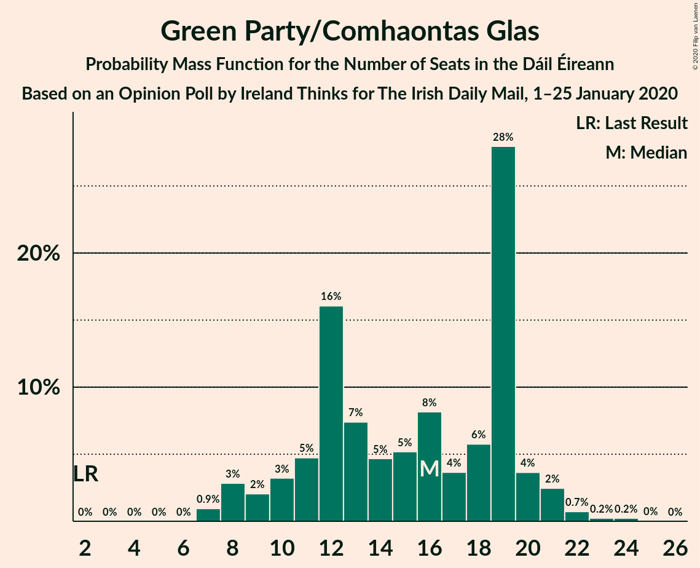
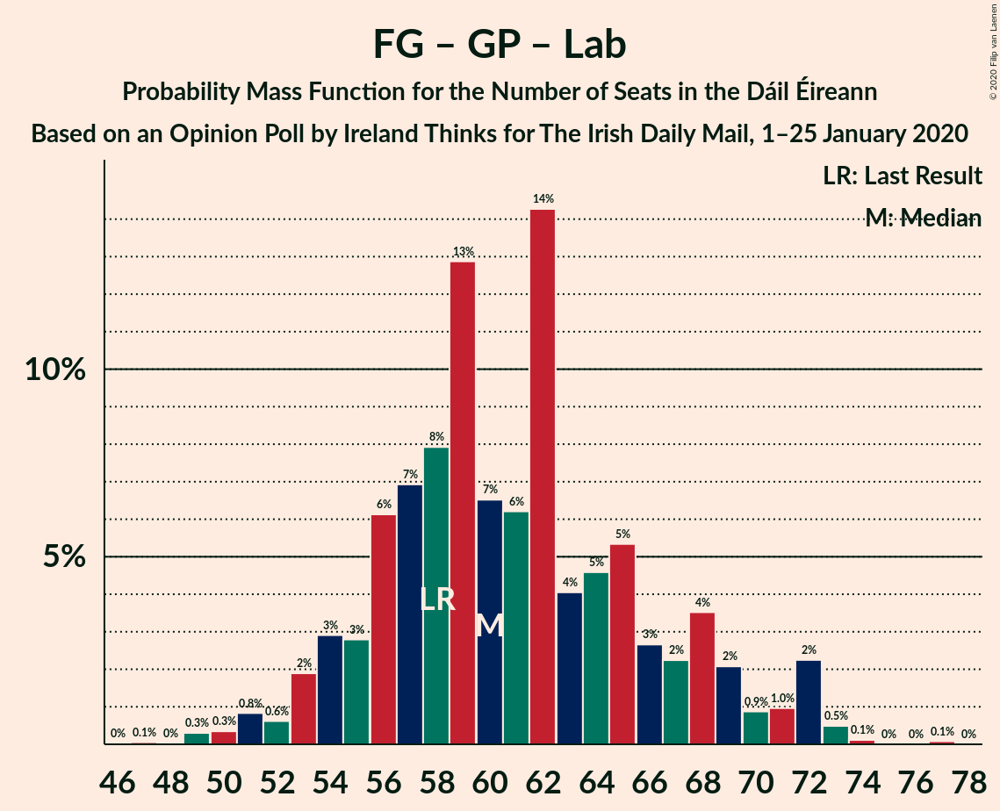

# Opinion Poll by Ireland Thinks for The Irish Daily Mail, 1–25 January 2020

<a href="#voting-intentions">Voting Intentions</a> | <a href="#seats">Seats</a> | <a href="#coalitions">Coalitions</a> | <a href="#technical-information">Technical Information</a>

## Voting Intentions

### Confidence Intervals

| Party | Last Result | Poll Result | 80% Confidence Interval | 90% Confidence Interval | 95% Confidence Interval | 99% Confidence Interval |
|:-----:|:-----------:|:-----------:|:-----------------------:|:-----------------------:|:-----------------------:|:-----------------------:|
| Fianna Fáil | 24.3% | 27.0% | 25.2–28.9% |24.7–29.4% |24.2–29.9% |23.4–30.8% |
| Fine Gael | 25.5% | 22.0% | 20.3–23.8% |19.8–24.3% |19.4–24.7% |18.7–25.6% |
| Sinn Féin | 13.8% | 20.0% | 18.4–21.7% |17.9–22.2% |17.5–22.6% |16.8–23.5% |
| Green Party/Comhaontas Glas | 2.7% | 10.0% | 8.8–11.3% |8.5–11.7% |8.2–12.1% |7.7–12.7% |
| Independent | 15.9% | 9.3% | 8.2–10.7% |7.9–11.1% |7.6–11.4% |7.1–12.0% |
| Labour Party | 6.6% | 6.1% | 5.2–7.2% |4.9–7.5% |4.7–7.8% |4.3–8.3% |
| Social Democrats | 3.0% | 3.0% | 2.4–3.8% |2.2–4.1% |2.1–4.3% |1.8–4.7% |
| Independents 4 Change | 1.5% | 1.2% | 0.8–1.8% |0.7–1.9% |0.7–2.1% |0.5–2.4% |
| Solidarity–People Before Profit | 3.9% | 1.0% | 0.7–1.5% |0.6–1.7% |0.5–1.8% |0.4–2.1% |

*Note:* The poll result column reflects the actual value used in the calculations. Published results may vary slightly, and in addition be rounded to fewer digits.

## Seats

### Confidence Intervals

| Party | Last Result | Median | 80% Confidence Interval | 90% Confidence Interval | 95% Confidence Interval | 99% Confidence Interval |
|:-----:|:-----------:|:------:|:-----------------------:|:-----------------------:|:-----------------------:|:-----------------------:|
| <a href="#fianna-fáil">Fianna Fáil</a> | 44 | 51 | 47–56 |46–57 |44–58 |41–59 |
| <a href="#fine-gael">Fine Gael</a> | 49 | 38 | 33–44 |33–46 |31–47 |28–49 |
| <a href="#sinn-féin">Sinn Féin</a> | 23 | 39 | 36–42 |34–43 |34–43 |33–45 |
| <a href="#green-party/comhaontas-glas">Green Party/Comhaontas Glas</a> | 2 | 14 | 9–17 |7–18 |7–20 |7–23 |
| <a href="#independent">Independent</a> | 19 | 5 | 3–11 |3–12 |3–12 |3–14 |
| <a href="#labour-party">Labour Party</a> | 7 | 6 | 2–10 |1–11 |1–12 |1–16 |
| <a href="#social-democrats">Social Democrats</a> | 3 | 3 | 3–5 |3–6 |3–6 |3–7 |
| <a href="#independents-4-change">Independents 4 Change</a> | 4 | 3 | 0–4 |0–4 |0–4 |0–5 |
| <a href="#solidarity–people-before-profit">Solidarity–People Before Profit</a> | 6 | 0 | 0 |0 |0 |0–1 |

### Fianna Fáil

*For a full overview of the results for this party, see the [Fianna Fáil](party-fiannafáil.html) page.*

| Number of Seats | Probability | Accumulated | Special Marks |
|:---------------:|:-----------:|:-----------:|:-------------:|
| 38 | 0.1% | 100% |  |
| 39 | 0.1% | 99.9% |  |
| 40 | 0.3% | 99.8% |  |
| 41 | 0.2% | 99.6% |  |
| 42 | 0.5% | 99.4% |  |
| 43 | 0.8% | 98.8% |  |
| 44 | 0.7% | 98% | Last Result |
| 45 | 1.4% | 97% |  |
| 46 | 4% | 96% |  |
| 47 | 6% | 92% |  |
| 48 | 15% | 86% |  |
| 49 | 8% | 70% |  |
| 50 | 12% | 63% |  |
| 51 | 16% | 51% | Median |
| 52 | 9% | 35% |  |
| 53 | 7% | 26% |  |
| 54 | 4% | 19% |  |
| 55 | 3% | 15% |  |
| 56 | 5% | 12% |  |
| 57 | 4% | 7% |  |
| 58 | 2% | 3% |  |
| 59 | 0.5% | 0.6% |  |
| 60 | 0% | 0% |  |

### Fine Gael

*For a full overview of the results for this party, see the [Fine Gael](party-finegael.html) page.*

| Number of Seats | Probability | Accumulated | Special Marks |
|:---------------:|:-----------:|:-----------:|:-------------:|
| 26 | 0.1% | 100% |  |
| 27 | 0.2% | 99.9% |  |
| 28 | 0.4% | 99.7% |  |
| 29 | 0.6% | 99.4% |  |
| 30 | 0.8% | 98.8% |  |
| 31 | 2% | 98% |  |
| 32 | 0.9% | 96% |  |
| 33 | 5% | 95% |  |
| 34 | 3% | 90% |  |
| 35 | 9% | 87% |  |
| 36 | 10% | 78% |  |
| 37 | 10% | 68% |  |
| 38 | 11% | 58% | Median |
| 39 | 9% | 47% |  |
| 40 | 8% | 38% |  |
| 41 | 12% | 30% |  |
| 42 | 4% | 18% |  |
| 43 | 4% | 14% |  |
| 44 | 2% | 11% |  |
| 45 | 2% | 9% |  |
| 46 | 3% | 7% |  |
| 47 | 2% | 4% |  |
| 48 | 0.7% | 2% |  |
| 49 | 0.7% | 1.2% | Last Result |
| 50 | 0.1% | 0.5% |  |
| 51 | 0.2% | 0.3% |  |
| 52 | 0% | 0.1% |  |
| 53 | 0.1% | 0.1% |  |
| 54 | 0% | 0% |  |

### Sinn Féin

*For a full overview of the results for this party, see the [Sinn Féin](party-sinnféin.html) page.*

| Number of Seats | Probability | Accumulated | Special Marks |
|:---------------:|:-----------:|:-----------:|:-------------:|
| 23 | 0% | 100% | Last Result |
| 24 | 0% | 100% |  |
| 25 | 0% | 100% |  |
| 26 | 0% | 100% |  |
| 27 | 0% | 100% |  |
| 28 | 0% | 100% |  |
| 29 | 0% | 100% |  |
| 30 | 0.1% | 100% |  |
| 31 | 0.1% | 99.9% |  |
| 32 | 0.3% | 99.8% |  |
| 33 | 0.8% | 99.6% |  |
| 34 | 5% | 98.8% |  |
| 35 | 3% | 94% |  |
| 36 | 13% | 91% |  |
| 37 | 10% | 78% |  |
| 38 | 12% | 68% |  |
| 39 | 13% | 56% | Median |
| 40 | 12% | 43% |  |
| 41 | 18% | 31% |  |
| 42 | 6% | 13% |  |
| 43 | 5% | 7% |  |
| 44 | 1.2% | 2% |  |
| 45 | 0.4% | 0.8% |  |
| 46 | 0.3% | 0.4% |  |
| 47 | 0.1% | 0.1% |  |
| 48 | 0% | 0% |  |

### Green Party/Comhaontas Glas

*For a full overview of the results for this party, see the [Green Party/Comhaontas Glas](party-greenpartycomhaontasglas.html) page.*

| Number of Seats | Probability | Accumulated | Special Marks |
|:---------------:|:-----------:|:-----------:|:-------------:|
| 2 | 0% | 100% | Last Result |
| 3 | 0% | 100% |  |
| 4 | 0% | 100% |  |
| 5 | 0% | 100% |  |
| 6 | 0% | 100% |  |
| 7 | 5% | 100% |  |
| 8 | 2% | 95% |  |
| 9 | 12% | 93% |  |
| 10 | 4% | 81% |  |
| 11 | 9% | 77% |  |
| 12 | 10% | 68% |  |
| 13 | 7% | 58% |  |
| 14 | 10% | 51% | Median |
| 15 | 8% | 42% |  |
| 16 | 9% | 34% |  |
| 17 | 15% | 24% |  |
| 18 | 5% | 9% |  |
| 19 | 2% | 5% |  |
| 20 | 0.8% | 3% |  |
| 21 | 1.3% | 2% |  |
| 22 | 0.5% | 1.1% |  |
| 23 | 0.1% | 0.5% |  |
| 24 | 0.3% | 0.4% |  |
| 25 | 0.1% | 0.1% |  |
| 26 | 0% | 0% |  |

### Independent

*For a full overview of the results for this party, see the [Independent](party-independent.html) page.*

| Number of Seats | Probability | Accumulated | Special Marks |
|:---------------:|:-----------:|:-----------:|:-------------:|
| 3 | 33% | 100% |  |
| 4 | 9% | 67% |  |
| 5 | 14% | 58% | Median |
| 6 | 15% | 44% |  |
| 7 | 9% | 30% |  |
| 8 | 2% | 21% |  |
| 9 | 5% | 19% |  |
| 10 | 3% | 13% |  |
| 11 | 4% | 10% |  |
| 12 | 5% | 6% |  |
| 13 | 0.7% | 2% |  |
| 14 | 0.7% | 1.1% |  |
| 15 | 0.3% | 0.4% |  |
| 16 | 0.1% | 0.1% |  |
| 17 | 0% | 0% |  |
| 18 | 0% | 0% |  |
| 19 | 0% | 0% | Last Result |

### Labour Party

*For a full overview of the results for this party, see the [Labour Party](party-labourparty.html) page.*

| Number of Seats | Probability | Accumulated | Special Marks |
|:---------------:|:-----------:|:-----------:|:-------------:|
| 0 | 0.4% | 100% |  |
| 1 | 5% | 99.6% |  |
| 2 | 5% | 95% |  |
| 3 | 3% | 89% |  |
| 4 | 7% | 86% |  |
| 5 | 6% | 79% |  |
| 6 | 39% | 74% | Median |
| 7 | 14% | 35% | Last Result |
| 8 | 5% | 20% |  |
| 9 | 6% | 16% |  |
| 10 | 4% | 10% |  |
| 11 | 3% | 6% |  |
| 12 | 1.0% | 3% |  |
| 13 | 0.3% | 2% |  |
| 14 | 0.7% | 2% |  |
| 15 | 0.4% | 1.1% |  |
| 16 | 0.5% | 0.7% |  |
| 17 | 0.1% | 0.2% |  |
| 18 | 0.1% | 0.1% |  |
| 19 | 0% | 0% |  |

### Social Democrats

*For a full overview of the results for this party, see the [Social Democrats](party-socialdemocrats.html) page.*

| Number of Seats | Probability | Accumulated | Special Marks |
|:---------------:|:-----------:|:-----------:|:-------------:|
| 3 | 50% | 100% | Last Result, Median |
| 4 | 36% | 50% |  |
| 5 | 7% | 13% |  |
| 6 | 5% | 6% |  |
| 7 | 0.8% | 1.1% |  |
| 8 | 0.3% | 0.4% |  |
| 9 | 0.1% | 0.1% |  |
| 10 | 0% | 0% |  |

### Independents 4 Change

*For a full overview of the results for this party, see the [Independents 4 Change](party-independents4change.html) page.*

| Number of Seats | Probability | Accumulated | Special Marks |
|:---------------:|:-----------:|:-----------:|:-------------:|
| 0 | 35% | 100% |  |
| 1 | 7% | 65% |  |
| 2 | 6% | 58% |  |
| 3 | 5% | 52% | Median |
| 4 | 45% | 47% | Last Result |
| 5 | 2% | 2% |  |
| 6 | 0% | 0% |  |

### Solidarity–People Before Profit

*For a full overview of the results for this party, see the [Solidarity–People Before Profit](party-solidarity–peoplebeforeprofit.html) page.*

| Number of Seats | Probability | Accumulated | Special Marks |
|:---------------:|:-----------:|:-----------:|:-------------:|
| 0 | 99.1% | 100% | Median |
| 1 | 0.7% | 0.9% |  |
| 2 | 0.1% | 0.1% |  |
| 3 | 0.1% | 0.1% |  |
| 4 | 0% | 0% |  |
| 5 | 0% | 0% |  |
| 6 | 0% | 0% | Last Result |

## Coalitions

### Confidence Intervals

| Coalition | Last Result | Median | Majority? | 80% Confidence Interval | 90% Confidence Interval | 95% Confidence Interval | 99% Confidence Interval |
|:---------:|:-----------:|:------:|:---------:|:-----------------------:|:-----------------------:|:-----------------------:|:-----------------------:|
| Fianna Fáil – Fine Gael | 93 | 90 | 96% | 83–96 | 81–97 | 80–98 | 78–101 |
| Fianna Fáil – Sinn Féin | 67 | 90 | 98.6% | 85–95 | 82–95 | 81–97 | 78–99 |
| Fianna Fáil – Green Party/Comhaontas Glas – Labour Party – Social Democrats | 56 | 74 | 7% | 68–80 | 67–81 | 66–83 | 65–85 |
| Fianna Fáil – Green Party/Comhaontas Glas – Labour Party | 53 | 71 | 0.7% | 65–76 | 63–77 | 62–79 | 61–81 |
| Fianna Fáil – Green Party/Comhaontas Glas | 46 | 64 | 0% | 59–71 | 57–73 | 55–74 | 54–77 |
| Fine Gael – Green Party/Comhaontas Glas – Labour Party – Social Democrats | 61 | 61 | 0% | 58–67 | 56–69 | 54–70 | 52–73 |
| Fine Gael – Green Party/Comhaontas Glas – Labour Party | 58 | 58 | 0% | 54–63 | 52–65 | 50–67 | 48–70 |
| Fianna Fáil – Labour Party | 51 | 57 | 0% | 52–61 | 51–63 | 50–63 | 46–64 |
| Fine Gael – Green Party/Comhaontas Glas | 51 | 52 | 0% | 48–57 | 47–59 | 45–60 | 43–64 |
| Fine Gael – Labour Party | 56 | 44 | 0% | 39–52 | 37–53 | 35–55 | 34–57 |
| Fine Gael | 49 | 38 | 0% | 33–44 | 33–46 | 31–47 | 28–49 |

### Fianna Fáil – Fine Gael

| Number of Seats | Probability | Accumulated | Special Marks |
|:---------------:|:-----------:|:-----------:|:-------------:|
| 74 | 0% | 100% |  |
| 75 | 0.1% | 99.9% |  |
| 76 | 0.1% | 99.9% |  |
| 77 | 0.2% | 99.8% |  |
| 78 | 0.6% | 99.6% |  |
| 79 | 1.4% | 99.1% |  |
| 80 | 2% | 98% |  |
| 81 | 0.7% | 96% | Majority |
| 82 | 2% | 95% |  |
| 83 | 5% | 93% |  |
| 84 | 6% | 88% |  |
| 85 | 4% | 82% |  |
| 86 | 6% | 78% |  |
| 87 | 10% | 72% |  |
| 88 | 4% | 62% |  |
| 89 | 7% | 58% | Median |
| 90 | 14% | 52% |  |
| 91 | 4% | 37% |  |
| 92 | 11% | 33% |  |
| 93 | 5% | 22% | Last Result |
| 94 | 2% | 17% |  |
| 95 | 4% | 15% |  |
| 96 | 5% | 11% |  |
| 97 | 3% | 6% |  |
| 98 | 1.2% | 3% |  |
| 99 | 0.8% | 2% |  |
| 100 | 0.6% | 1.2% |  |
| 101 | 0.3% | 0.6% |  |
| 102 | 0.1% | 0.3% |  |
| 103 | 0.2% | 0.2% |  |
| 104 | 0% | 0% |  |

### Fianna Fáil – Sinn Féin

| Number of Seats | Probability | Accumulated | Special Marks |
|:---------------:|:-----------:|:-----------:|:-------------:|
| 67 | 0% | 100% | Last Result |
| 68 | 0% | 100% |  |
| 69 | 0% | 100% |  |
| 70 | 0% | 100% |  |
| 71 | 0% | 100% |  |
| 72 | 0% | 100% |  |
| 73 | 0% | 100% |  |
| 74 | 0% | 100% |  |
| 75 | 0% | 100% |  |
| 76 | 0.2% | 100% |  |
| 77 | 0.1% | 99.8% |  |
| 78 | 0.2% | 99.7% |  |
| 79 | 0.2% | 99.5% |  |
| 80 | 0.7% | 99.2% |  |
| 81 | 1.2% | 98.6% | Majority |
| 82 | 3% | 97% |  |
| 83 | 2% | 95% |  |
| 84 | 2% | 93% |  |
| 85 | 6% | 90% |  |
| 86 | 8% | 85% |  |
| 87 | 7% | 77% |  |
| 88 | 11% | 69% |  |
| 89 | 6% | 58% |  |
| 90 | 10% | 52% | Median |
| 91 | 7% | 42% |  |
| 92 | 13% | 35% |  |
| 93 | 3% | 22% |  |
| 94 | 7% | 18% |  |
| 95 | 7% | 11% |  |
| 96 | 2% | 5% |  |
| 97 | 0.8% | 3% |  |
| 98 | 1.3% | 2% |  |
| 99 | 0.8% | 0.8% |  |
| 100 | 0% | 0% |  |

### Fianna Fáil – Green Party/Comhaontas Glas – Labour Party – Social Democrats

| Number of Seats | Probability | Accumulated | Special Marks |
|:---------------:|:-----------:|:-----------:|:-------------:|
| 56 | 0% | 100% | Last Result |
| 57 | 0% | 100% |  |
| 58 | 0% | 100% |  |
| 59 | 0% | 100% |  |
| 60 | 0% | 100% |  |
| 61 | 0.1% | 100% |  |
| 62 | 0.1% | 99.9% |  |
| 63 | 0.1% | 99.8% |  |
| 64 | 0.1% | 99.7% |  |
| 65 | 2% | 99.6% |  |
| 66 | 1.3% | 98% |  |
| 67 | 2% | 97% |  |
| 68 | 6% | 95% |  |
| 69 | 2% | 89% |  |
| 70 | 5% | 87% |  |
| 71 | 12% | 82% |  |
| 72 | 4% | 71% |  |
| 73 | 10% | 67% |  |
| 74 | 14% | 57% | Median |
| 75 | 11% | 43% |  |
| 76 | 6% | 32% |  |
| 77 | 6% | 26% |  |
| 78 | 7% | 21% |  |
| 79 | 4% | 14% |  |
| 80 | 3% | 10% |  |
| 81 | 3% | 7% | Majority |
| 82 | 0.9% | 4% |  |
| 83 | 2% | 3% |  |
| 84 | 0.5% | 1.4% |  |
| 85 | 0.5% | 1.0% |  |
| 86 | 0.4% | 0.5% |  |
| 87 | 0% | 0.1% |  |
| 88 | 0% | 0% |  |

### Fianna Fáil – Green Party/Comhaontas Glas – Labour Party

| Number of Seats | Probability | Accumulated | Special Marks |
|:---------------:|:-----------:|:-----------:|:-------------:|
| 53 | 0% | 100% | Last Result |
| 54 | 0% | 100% |  |
| 55 | 0% | 100% |  |
| 56 | 0% | 100% |  |
| 57 | 0.1% | 100% |  |
| 58 | 0.1% | 99.9% |  |
| 59 | 0.1% | 99.8% |  |
| 60 | 0.2% | 99.7% |  |
| 61 | 2% | 99.5% |  |
| 62 | 0.7% | 98% |  |
| 63 | 3% | 97% |  |
| 64 | 2% | 95% |  |
| 65 | 6% | 93% |  |
| 66 | 3% | 87% |  |
| 67 | 11% | 84% |  |
| 68 | 5% | 72% |  |
| 69 | 10% | 67% |  |
| 70 | 5% | 57% |  |
| 71 | 13% | 52% | Median |
| 72 | 13% | 40% |  |
| 73 | 4% | 26% |  |
| 74 | 4% | 22% |  |
| 75 | 8% | 18% |  |
| 76 | 4% | 10% |  |
| 77 | 2% | 6% |  |
| 78 | 1.5% | 4% |  |
| 79 | 1.2% | 3% |  |
| 80 | 1.1% | 2% |  |
| 81 | 0.4% | 0.7% | Majority |
| 82 | 0.2% | 0.3% |  |
| 83 | 0% | 0.1% |  |
| 84 | 0% | 0% |  |

### Fianna Fáil – Green Party/Comhaontas Glas

| Number of Seats | Probability | Accumulated | Special Marks |
|:---------------:|:-----------:|:-----------:|:-------------:|
| 46 | 0% | 100% | Last Result |
| 47 | 0% | 100% |  |
| 48 | 0% | 100% |  |
| 49 | 0% | 100% |  |
| 50 | 0% | 100% |  |
| 51 | 0% | 100% |  |
| 52 | 0% | 99.9% |  |
| 53 | 0.2% | 99.9% |  |
| 54 | 1.1% | 99.7% |  |
| 55 | 2% | 98.6% |  |
| 56 | 1.3% | 96% |  |
| 57 | 2% | 95% |  |
| 58 | 3% | 93% |  |
| 59 | 4% | 90% |  |
| 60 | 11% | 86% |  |
| 61 | 8% | 75% |  |
| 62 | 7% | 67% |  |
| 63 | 8% | 59% |  |
| 64 | 4% | 52% |  |
| 65 | 10% | 48% | Median |
| 66 | 9% | 37% |  |
| 67 | 3% | 29% |  |
| 68 | 7% | 26% |  |
| 69 | 6% | 19% |  |
| 70 | 2% | 12% |  |
| 71 | 2% | 10% |  |
| 72 | 2% | 9% |  |
| 73 | 3% | 6% |  |
| 74 | 1.2% | 3% |  |
| 75 | 0.9% | 2% |  |
| 76 | 0.2% | 0.9% |  |
| 77 | 0.6% | 0.7% |  |
| 78 | 0% | 0.1% |  |
| 79 | 0% | 0% |  |

### Fine Gael – Green Party/Comhaontas Glas – Labour Party – Social Democrats

| Number of Seats | Probability | Accumulated | Special Marks |
|:---------------:|:-----------:|:-----------:|:-------------:|
| 49 | 0% | 100% |  |
| 50 | 0.1% | 99.9% |  |
| 51 | 0.1% | 99.8% |  |
| 52 | 0.6% | 99.7% |  |
| 53 | 0.7% | 99.2% |  |
| 54 | 1.2% | 98.5% |  |
| 55 | 1.2% | 97% |  |
| 56 | 2% | 96% |  |
| 57 | 3% | 94% |  |
| 58 | 8% | 91% |  |
| 59 | 5% | 83% |  |
| 60 | 10% | 78% |  |
| 61 | 22% | 68% | Last Result, Median |
| 62 | 9% | 46% |  |
| 63 | 6% | 37% |  |
| 64 | 12% | 32% |  |
| 65 | 4% | 20% |  |
| 66 | 4% | 15% |  |
| 67 | 4% | 12% |  |
| 68 | 3% | 8% |  |
| 69 | 2% | 6% |  |
| 70 | 0.9% | 3% |  |
| 71 | 0.7% | 2% |  |
| 72 | 0.9% | 2% |  |
| 73 | 0.2% | 0.7% |  |
| 74 | 0.1% | 0.4% |  |
| 75 | 0.1% | 0.3% |  |
| 76 | 0.1% | 0.2% |  |
| 77 | 0.1% | 0.1% |  |
| 78 | 0% | 0% |  |

### Fine Gael – Green Party/Comhaontas Glas – Labour Party

| Number of Seats | Probability | Accumulated | Special Marks |
|:---------------:|:-----------:|:-----------:|:-------------:|
| 44 | 0% | 100% |  |
| 45 | 0% | 99.9% |  |
| 46 | 0% | 99.9% |  |
| 47 | 0.1% | 99.9% |  |
| 48 | 0.3% | 99.7% |  |
| 49 | 0.8% | 99.4% |  |
| 50 | 1.3% | 98.7% |  |
| 51 | 2% | 97% |  |
| 52 | 4% | 96% |  |
| 53 | 2% | 92% |  |
| 54 | 4% | 90% |  |
| 55 | 7% | 86% |  |
| 56 | 6% | 78% |  |
| 57 | 17% | 72% |  |
| 58 | 12% | 55% | Last Result, Median |
| 59 | 10% | 43% |  |
| 60 | 9% | 33% |  |
| 61 | 8% | 24% |  |
| 62 | 3% | 15% |  |
| 63 | 2% | 12% |  |
| 64 | 4% | 10% |  |
| 65 | 2% | 6% |  |
| 66 | 2% | 4% |  |
| 67 | 1.0% | 3% |  |
| 68 | 0.8% | 2% |  |
| 69 | 0.2% | 0.8% |  |
| 70 | 0.2% | 0.5% |  |
| 71 | 0.1% | 0.3% |  |
| 72 | 0.1% | 0.2% |  |
| 73 | 0% | 0.1% |  |
| 74 | 0% | 0.1% |  |
| 75 | 0% | 0% |  |

### Fianna Fáil – Labour Party

| Number of Seats | Probability | Accumulated | Special Marks |
|:---------------:|:-----------:|:-----------:|:-------------:|
| 44 | 0.1% | 100% |  |
| 45 | 0.3% | 99.9% |  |
| 46 | 0.3% | 99.6% |  |
| 47 | 0.2% | 99.4% |  |
| 48 | 0.5% | 99.2% |  |
| 49 | 1.1% | 98.6% |  |
| 50 | 1.1% | 98% |  |
| 51 | 4% | 96% | Last Result |
| 52 | 3% | 93% |  |
| 53 | 6% | 89% |  |
| 54 | 12% | 84% |  |
| 55 | 5% | 72% |  |
| 56 | 9% | 67% |  |
| 57 | 8% | 58% | Median |
| 58 | 19% | 50% |  |
| 59 | 9% | 31% |  |
| 60 | 8% | 22% |  |
| 61 | 4% | 14% |  |
| 62 | 4% | 10% |  |
| 63 | 4% | 5% |  |
| 64 | 1.0% | 1.5% |  |
| 65 | 0.2% | 0.4% |  |
| 66 | 0.1% | 0.2% |  |
| 67 | 0.1% | 0.1% |  |
| 68 | 0% | 0% |  |

### Fine Gael – Green Party/Comhaontas Glas

| Number of Seats | Probability | Accumulated | Special Marks |
|:---------------:|:-----------:|:-----------:|:-------------:|
| 40 | 0% | 100% |  |
| 41 | 0% | 99.9% |  |
| 42 | 0.1% | 99.9% |  |
| 43 | 0.6% | 99.8% |  |
| 44 | 0.6% | 99.1% |  |
| 45 | 1.1% | 98.5% |  |
| 46 | 2% | 97% |  |
| 47 | 3% | 95% |  |
| 48 | 7% | 92% |  |
| 49 | 7% | 85% |  |
| 50 | 13% | 78% |  |
| 51 | 9% | 65% | Last Result |
| 52 | 17% | 56% | Median |
| 53 | 11% | 38% |  |
| 54 | 8% | 28% |  |
| 55 | 6% | 20% |  |
| 56 | 3% | 14% |  |
| 57 | 4% | 11% |  |
| 58 | 1.3% | 7% |  |
| 59 | 2% | 6% |  |
| 60 | 2% | 4% |  |
| 61 | 1.0% | 2% |  |
| 62 | 0.2% | 1.0% |  |
| 63 | 0.2% | 0.7% |  |
| 64 | 0.2% | 0.5% |  |
| 65 | 0.1% | 0.3% |  |
| 66 | 0.1% | 0.1% |  |
| 67 | 0% | 0% |  |

### Fine Gael – Labour Party

| Number of Seats | Probability | Accumulated | Special Marks |
|:---------------:|:-----------:|:-----------:|:-------------:|
| 31 | 0.1% | 100% |  |
| 32 | 0.1% | 99.9% |  |
| 33 | 0.3% | 99.8% |  |
| 34 | 1.2% | 99.5% |  |
| 35 | 2% | 98% |  |
| 36 | 0.8% | 96% |  |
| 37 | 2% | 95% |  |
| 38 | 3% | 94% |  |
| 39 | 4% | 90% |  |
| 40 | 2% | 87% |  |
| 41 | 9% | 84% |  |
| 42 | 11% | 76% |  |
| 43 | 10% | 65% |  |
| 44 | 9% | 55% | Median |
| 45 | 7% | 46% |  |
| 46 | 4% | 39% |  |
| 47 | 4% | 35% |  |
| 48 | 10% | 30% |  |
| 49 | 3% | 20% |  |
| 50 | 4% | 17% |  |
| 51 | 2% | 13% |  |
| 52 | 2% | 11% |  |
| 53 | 5% | 9% |  |
| 54 | 1.4% | 5% |  |
| 55 | 1.0% | 3% |  |
| 56 | 2% | 2% | Last Result |
| 57 | 0.2% | 0.5% |  |
| 58 | 0.1% | 0.3% |  |
| 59 | 0% | 0.2% |  |
| 60 | 0.1% | 0.2% |  |
| 61 | 0.1% | 0.1% |  |
| 62 | 0% | 0% |  |

### Fine Gael

| Number of Seats | Probability | Accumulated | Special Marks |
|:---------------:|:-----------:|:-----------:|:-------------:|
| 26 | 0.1% | 100% |  |
| 27 | 0.2% | 99.9% |  |
| 28 | 0.4% | 99.7% |  |
| 29 | 0.6% | 99.4% |  |
| 30 | 0.8% | 98.8% |  |
| 31 | 2% | 98% |  |
| 32 | 0.9% | 96% |  |
| 33 | 5% | 95% |  |
| 34 | 3% | 90% |  |
| 35 | 9% | 87% |  |
| 36 | 10% | 78% |  |
| 37 | 10% | 68% |  |
| 38 | 11% | 58% | Median |
| 39 | 9% | 47% |  |
| 40 | 8% | 38% |  |
| 41 | 12% | 30% |  |
| 42 | 4% | 18% |  |
| 43 | 4% | 14% |  |
| 44 | 2% | 11% |  |
| 45 | 2% | 9% |  |
| 46 | 3% | 7% |  |
| 47 | 2% | 4% |  |
| 48 | 0.7% | 2% |  |
| 49 | 0.7% | 1.2% | Last Result |
| 50 | 0.1% | 0.5% |  |
| 51 | 0.2% | 0.3% |  |
| 52 | 0% | 0.1% |  |
| 53 | 0.1% | 0.1% |  |
| 54 | 0% | 0% |  |

## Technical Information

### Opinion Poll

+ **Polling firm:** Ireland Thinks
+ **Commissioner(s):** The Irish Daily Mail
+ **Fieldwork period:** 1–25 January 2020

### Calculations

+ **Sample size:** 942
+ **Simulations done:** 1,048,576
+ **Error estimate:** 2.83%

