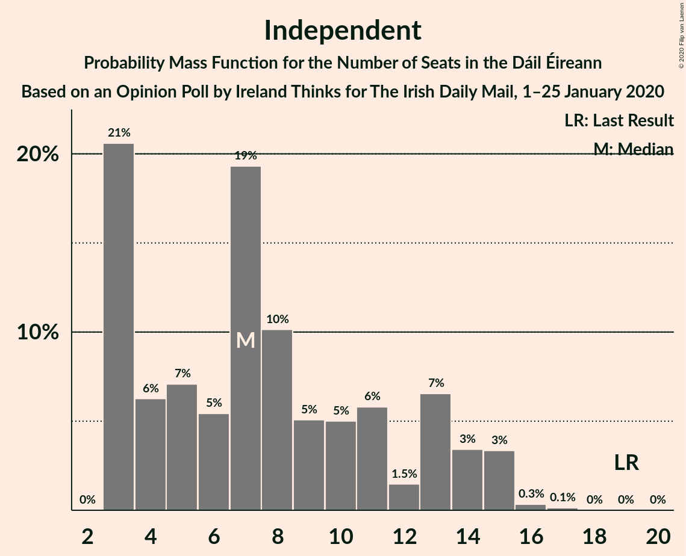
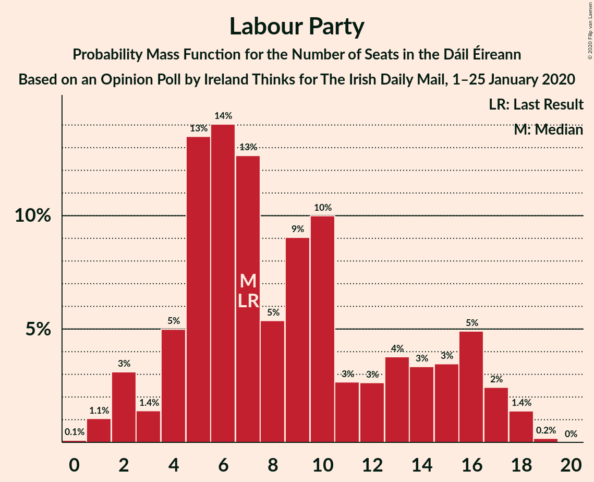

# Opinion Poll by Ireland Thinks for The Irish Daily Mail, 1–25 January 2020

<a href="#voting-intentions">Voting Intentions</a> | <a href="#seats">Seats</a> | <a href="#coalitions">Coalitions</a> | <a href="#technical-information">Technical Information</a>

## Voting Intentions

### Confidence Intervals

| Party | Last Result | Poll Result | 80% Confidence Interval | 90% Confidence Interval | 95% Confidence Interval | 99% Confidence Interval |
|:-----:|:-----------:|:-----------:|:-----------------------:|:-----------------------:|:-----------------------:|:-----------------------:|
| Fianna Fáil | 24.3% | 27.0% | 25.2–28.9% |24.7–29.4% |24.2–29.9% |23.4–30.8% |
| Fine Gael | 25.5% | 22.0% | 20.3–23.8% |19.8–24.3% |19.4–24.7% |18.7–25.6% |
| Sinn Féin | 13.8% | 20.0% | 18.4–21.7% |17.9–22.2% |17.5–22.6% |16.8–23.5% |
| Green Party/Comhaontas Glas | 2.7% | 10.0% | 8.8–11.3% |8.5–11.7% |8.2–12.1% |7.7–12.7% |
| Independent | 15.9% | 9.3% | 8.2–10.7% |7.9–11.1% |7.6–11.4% |7.1–12.0% |
| Labour Party | 6.6% | 6.1% | 5.2–7.2% |4.9–7.5% |4.7–7.8% |4.3–8.3% |
| Social Democrats | 3.0% | 3.0% | 2.4–3.8% |2.2–4.1% |2.1–4.3% |1.8–4.7% |
| Independents 4 Change | 1.5% | 1.2% | 0.8–1.8% |0.7–1.9% |0.7–2.1% |0.5–2.4% |
| Solidarity–People Before Profit | 3.9% | 1.0% | 0.7–1.5% |0.6–1.7% |0.5–1.8% |0.4–2.1% |

*Note:* The poll result column reflects the actual value used in the calculations. Published results may vary slightly, and in addition be rounded to fewer digits.

## Seats

### Confidence Intervals

| Party | Last Result | Median | 80% Confidence Interval | 90% Confidence Interval | 95% Confidence Interval | 99% Confidence Interval |
|:-----:|:-----------:|:------:|:-----------------------:|:-----------------------:|:-----------------------:|:-----------------------:|
| <a href="#fianna-fáil">Fianna Fáil</a> | 44 | 50 | 46–57 |45–58 |43–58 |40–59 |
| <a href="#fine-gael">Fine Gael</a> | 49 | 38 | 33–43 |32–45 |31–47 |28–49 |
| <a href="#sinn-féin">Sinn Féin</a> | 23 | 39 | 36–42 |34–43 |34–43 |32–46 |
| <a href="#green-party/comhaontas-glas">Green Party/Comhaontas Glas</a> | 2 | 15 | 9–17 |8–19 |7–21 |7–22 |
| <a href="#independent">Independent</a> | 19 | 5 | 3–11 |3–12 |3–12 |3–15 |
| <a href="#labour-party">Labour Party</a> | 7 | 6 | 2–9 |1–11 |1–12 |1–16 |
| <a href="#social-democrats">Social Democrats</a> | 3 | 3 | 3–5 |3–6 |3–6 |3–7 |
| <a href="#independents-4-change">Independents 4 Change</a> | 4 | 4 | 0–4 |0–4 |0–4 |0–5 |
| <a href="#solidarity–people-before-profit">Solidarity–People Before Profit</a> | 6 | 0 | 0 |0 |0 |0–1 |

### Fianna Fáil

*For a full overview of the results for this party, see the [Fianna Fáil](party-fiannafáil.html) page.*

| Number of Seats | Probability | Accumulated | Special Marks |
|:---------------:|:-----------:|:-----------:|:-------------:|
| 38 | 0.1% | 100% |  |
| 39 | 0.1% | 99.9% |  |
| 40 | 0.4% | 99.8% |  |
| 41 | 0.1% | 99.4% |  |
| 42 | 0.4% | 99.3% |  |
| 43 | 1.4% | 98.9% |  |
| 44 | 1.0% | 97% | Last Result |
| 45 | 2% | 96% |  |
| 46 | 6% | 94% |  |
| 47 | 9% | 88% |  |
| 48 | 21% | 80% |  |
| 49 | 6% | 59% |  |
| 50 | 9% | 53% | Median |
| 51 | 7% | 44% |  |
| 52 | 6% | 36% |  |
| 53 | 5% | 31% |  |
| 54 | 2% | 26% |  |
| 55 | 5% | 24% |  |
| 56 | 9% | 19% |  |
| 57 | 5% | 10% |  |
| 58 | 4% | 5% |  |
| 59 | 0.7% | 0.8% |  |
| 60 | 0% | 0% |  |

### Fine Gael

*For a full overview of the results for this party, see the [Fine Gael](party-finegael.html) page.*

| Number of Seats | Probability | Accumulated | Special Marks |
|:---------------:|:-----------:|:-----------:|:-------------:|
| 26 | 0.1% | 100% |  |
| 27 | 0.2% | 99.9% |  |
| 28 | 0.2% | 99.7% |  |
| 29 | 0.5% | 99.5% |  |
| 30 | 0.5% | 99.0% |  |
| 31 | 3% | 98% |  |
| 32 | 0.8% | 96% |  |
| 33 | 10% | 95% |  |
| 34 | 4% | 85% |  |
| 35 | 12% | 80% |  |
| 36 | 7% | 68% |  |
| 37 | 9% | 61% |  |
| 38 | 12% | 53% | Median |
| 39 | 10% | 41% |  |
| 40 | 10% | 31% |  |
| 41 | 5% | 21% |  |
| 42 | 5% | 16% |  |
| 43 | 4% | 11% |  |
| 44 | 2% | 8% |  |
| 45 | 2% | 6% |  |
| 46 | 0.5% | 3% |  |
| 47 | 0.7% | 3% |  |
| 48 | 0.5% | 2% |  |
| 49 | 1.3% | 2% | Last Result |
| 50 | 0.1% | 0.4% |  |
| 51 | 0.1% | 0.3% |  |
| 52 | 0.1% | 0.2% |  |
| 53 | 0.1% | 0.2% |  |
| 54 | 0% | 0% |  |

### Sinn Féin

*For a full overview of the results for this party, see the [Sinn Féin](party-sinnféin.html) page.*

| Number of Seats | Probability | Accumulated | Special Marks |
|:---------------:|:-----------:|:-----------:|:-------------:|
| 23 | 0% | 100% | Last Result |
| 24 | 0% | 100% |  |
| 25 | 0% | 100% |  |
| 26 | 0% | 100% |  |
| 27 | 0% | 100% |  |
| 28 | 0% | 100% |  |
| 29 | 0% | 100% |  |
| 30 | 0.1% | 100% |  |
| 31 | 0.1% | 99.9% |  |
| 32 | 0.4% | 99.8% |  |
| 33 | 0.9% | 99.4% |  |
| 34 | 5% | 98.5% |  |
| 35 | 3% | 94% |  |
| 36 | 17% | 91% |  |
| 37 | 9% | 73% |  |
| 38 | 11% | 65% |  |
| 39 | 16% | 54% | Median |
| 40 | 15% | 39% |  |
| 41 | 9% | 23% |  |
| 42 | 7% | 14% |  |
| 43 | 5% | 7% |  |
| 44 | 2% | 2% |  |
| 45 | 0.2% | 0.8% |  |
| 46 | 0.5% | 0.6% |  |
| 47 | 0.1% | 0.1% |  |
| 48 | 0% | 0% |  |

### Green Party/Comhaontas Glas

*For a full overview of the results for this party, see the [Green Party/Comhaontas Glas](party-greenpartycomhaontasglas.html) page.*

| Number of Seats | Probability | Accumulated | Special Marks |
|:---------------:|:-----------:|:-----------:|:-------------:|
| 2 | 0% | 100% | Last Result |
| 3 | 0% | 100% |  |
| 4 | 0% | 100% |  |
| 5 | 0% | 100% |  |
| 6 | 0% | 100% |  |
| 7 | 5% | 100% |  |
| 8 | 3% | 95% |  |
| 9 | 4% | 93% |  |
| 10 | 3% | 88% |  |
| 11 | 7% | 85% |  |
| 12 | 8% | 78% |  |
| 13 | 10% | 70% |  |
| 14 | 9% | 59% |  |
| 15 | 8% | 50% | Median |
| 16 | 13% | 43% |  |
| 17 | 21% | 30% |  |
| 18 | 4% | 10% |  |
| 19 | 2% | 5% |  |
| 20 | 0.6% | 3% |  |
| 21 | 1.5% | 3% |  |
| 22 | 0.7% | 1.2% |  |
| 23 | 0.1% | 0.5% |  |
| 24 | 0.2% | 0.3% |  |
| 25 | 0.1% | 0.1% |  |
| 26 | 0% | 0% |  |

### Independent

*For a full overview of the results for this party, see the [Independent](party-independent.html) page.*

| Number of Seats | Probability | Accumulated | Special Marks |
|:---------------:|:-----------:|:-----------:|:-------------:|
| 3 | 29% | 100% |  |
| 4 | 9% | 71% |  |
| 5 | 16% | 62% | Median |
| 6 | 8% | 45% |  |
| 7 | 17% | 37% |  |
| 8 | 2% | 21% |  |
| 9 | 3% | 19% |  |
| 10 | 2% | 16% |  |
| 11 | 5% | 14% |  |
| 12 | 7% | 9% |  |
| 13 | 1.2% | 2% |  |
| 14 | 0.6% | 1.2% |  |
| 15 | 0.3% | 0.5% |  |
| 16 | 0.2% | 0.2% |  |
| 17 | 0% | 0% |  |
| 18 | 0% | 0% |  |
| 19 | 0% | 0% | Last Result |

### Labour Party

*For a full overview of the results for this party, see the [Labour Party](party-labourparty.html) page.*

| Number of Seats | Probability | Accumulated | Special Marks |
|:---------------:|:-----------:|:-----------:|:-------------:|
| 0 | 0.4% | 100% |  |
| 1 | 6% | 99.6% |  |
| 2 | 6% | 93% |  |
| 3 | 4% | 87% |  |
| 4 | 7% | 83% |  |
| 5 | 7% | 76% |  |
| 6 | 41% | 69% | Median |
| 7 | 7% | 28% | Last Result |
| 8 | 5% | 21% |  |
| 9 | 7% | 16% |  |
| 10 | 2% | 9% |  |
| 11 | 4% | 7% |  |
| 12 | 0.6% | 3% |  |
| 13 | 0.4% | 2% |  |
| 14 | 0.6% | 2% |  |
| 15 | 0.3% | 1.3% |  |
| 16 | 0.9% | 1.0% |  |
| 17 | 0.1% | 0.2% |  |
| 18 | 0.1% | 0.1% |  |
| 19 | 0% | 0% |  |

### Social Democrats

*For a full overview of the results for this party, see the [Social Democrats](party-socialdemocrats.html) page.*

| Number of Seats | Probability | Accumulated | Special Marks |
|:---------------:|:-----------:|:-----------:|:-------------:|
| 3 | 54% | 100% | Last Result, Median |
| 4 | 32% | 46% |  |
| 5 | 6% | 14% |  |
| 6 | 7% | 8% |  |
| 7 | 0.9% | 1.2% |  |
| 8 | 0.3% | 0.4% |  |
| 9 | 0.1% | 0.1% |  |
| 10 | 0% | 0% |  |

### Independents 4 Change

*For a full overview of the results for this party, see the [Independents 4 Change](party-independents4change.html) page.*

| Number of Seats | Probability | Accumulated | Special Marks |
|:---------------:|:-----------:|:-----------:|:-------------:|
| 0 | 25% | 100% |  |
| 1 | 7% | 75% |  |
| 2 | 9% | 68% |  |
| 3 | 6% | 58% |  |
| 4 | 51% | 52% | Last Result, Median |
| 5 | 2% | 2% |  |
| 6 | 0% | 0% |  |

### Solidarity–People Before Profit

*For a full overview of the results for this party, see the [Solidarity–People Before Profit](party-solidarity–peoplebeforeprofit.html) page.*

| Number of Seats | Probability | Accumulated | Special Marks |
|:---------------:|:-----------:|:-----------:|:-------------:|
| 0 | 99.2% | 100% | Median |
| 1 | 0.7% | 0.8% |  |
| 2 | 0% | 0.1% |  |
| 3 | 0.1% | 0.1% |  |
| 4 | 0% | 0% |  |
| 5 | 0% | 0% |  |
| 6 | 0% | 0% | Last Result |

## Coalitions

### Confidence Intervals

| Coalition | Last Result | Median | Majority? | 80% Confidence Interval | 90% Confidence Interval | 95% Confidence Interval | 99% Confidence Interval |
|:---------:|:-----------:|:------:|:---------:|:-----------------------:|:-----------------------:|:-----------------------:|:-----------------------:|
| Fianna Fáil – Fine Gael | 93 | 88 | 93% | 82–96 | 80–97 | 79–99 | 78–102 |
| Fianna Fáil – Sinn Féin | 67 | 89 | 98% | 84–95 | 82–96 | 81–98 | 77–99 |
| Fianna Fáil – Green Party/Comhaontas Glas – Labour Party – Social Democrats | 56 | 74 | 9% | 68–80 | 68–81 | 66–83 | 64–85 |
| Fianna Fáil – Green Party/Comhaontas Glas – Labour Party | 53 | 71 | 0.9% | 65–76 | 64–77 | 63–79 | 60–81 |
| Fianna Fáil – Green Party/Comhaontas Glas | 46 | 65 | 0% | 58–72 | 56–73 | 55–74 | 54–76 |
| Fine Gael – Green Party/Comhaontas Glas – Labour Party – Social Democrats | 61 | 61 | 0% | 57–66 | 55–69 | 54–70 | 52–73 |
| Fine Gael – Green Party/Comhaontas Glas – Labour Party | 58 | 58 | 0% | 52–62 | 51–65 | 50–66 | 48–70 |
| Fianna Fáil – Labour Party | 51 | 56 | 0% | 52–62 | 51–63 | 49–63 | 45–64 |
| Fine Gael – Green Party/Comhaontas Glas | 51 | 52 | 0% | 48–57 | 47–58 | 45–60 | 43–64 |
| Fine Gael – Labour Party | 56 | 43 | 0% | 38–51 | 35–53 | 35–55 | 34–57 |
| Fine Gael | 49 | 38 | 0% | 33–43 | 32–45 | 31–47 | 28–49 |

### Fianna Fáil – Fine Gael

| Number of Seats | Probability | Accumulated | Special Marks |
|:---------------:|:-----------:|:-----------:|:-------------:|
| 74 | 0% | 100% |  |
| 75 | 0.1% | 99.9% |  |
| 76 | 0.1% | 99.9% |  |
| 77 | 0.2% | 99.8% |  |
| 78 | 0.7% | 99.6% |  |
| 79 | 2% | 98.9% |  |
| 80 | 3% | 97% |  |
| 81 | 0.7% | 93% | Majority |
| 82 | 3% | 93% |  |
| 83 | 9% | 90% |  |
| 84 | 6% | 80% |  |
| 85 | 4% | 74% |  |
| 86 | 7% | 71% |  |
| 87 | 9% | 63% |  |
| 88 | 6% | 54% | Median |
| 89 | 9% | 48% |  |
| 90 | 10% | 39% |  |
| 91 | 4% | 29% |  |
| 92 | 5% | 25% |  |
| 93 | 2% | 20% | Last Result |
| 94 | 1.4% | 17% |  |
| 95 | 3% | 16% |  |
| 96 | 6% | 13% |  |
| 97 | 3% | 8% |  |
| 98 | 2% | 4% |  |
| 99 | 1.1% | 3% |  |
| 100 | 0.7% | 2% |  |
| 101 | 0.4% | 1.0% |  |
| 102 | 0.2% | 0.5% |  |
| 103 | 0.3% | 0.4% |  |
| 104 | 0% | 0% |  |

### Fianna Fáil – Sinn Féin

| Number of Seats | Probability | Accumulated | Special Marks |
|:---------------:|:-----------:|:-----------:|:-------------:|
| 67 | 0% | 100% | Last Result |
| 68 | 0% | 100% |  |
| 69 | 0% | 100% |  |
| 70 | 0% | 100% |  |
| 71 | 0% | 100% |  |
| 72 | 0% | 100% |  |
| 73 | 0% | 100% |  |
| 74 | 0% | 100% |  |
| 75 | 0% | 100% |  |
| 76 | 0.4% | 100% |  |
| 77 | 0.1% | 99.6% |  |
| 78 | 0.2% | 99.4% |  |
| 79 | 0.1% | 99.3% |  |
| 80 | 1.1% | 99.1% |  |
| 81 | 2% | 98% | Majority |
| 82 | 3% | 96% |  |
| 83 | 0.9% | 93% |  |
| 84 | 3% | 92% |  |
| 85 | 4% | 89% |  |
| 86 | 12% | 85% |  |
| 87 | 8% | 73% |  |
| 88 | 12% | 64% |  |
| 89 | 6% | 52% | Median |
| 90 | 5% | 46% |  |
| 91 | 10% | 41% |  |
| 92 | 9% | 31% |  |
| 93 | 4% | 22% |  |
| 94 | 7% | 18% |  |
| 95 | 5% | 11% |  |
| 96 | 2% | 6% |  |
| 97 | 0.9% | 4% |  |
| 98 | 2% | 3% |  |
| 99 | 1.4% | 1.4% |  |
| 100 | 0% | 0% |  |

### Fianna Fáil – Green Party/Comhaontas Glas – Labour Party – Social Democrats

| Number of Seats | Probability | Accumulated | Special Marks |
|:---------------:|:-----------:|:-----------:|:-------------:|
| 56 | 0% | 100% | Last Result |
| 57 | 0% | 100% |  |
| 58 | 0% | 100% |  |
| 59 | 0% | 100% |  |
| 60 | 0% | 100% |  |
| 61 | 0.2% | 100% |  |
| 62 | 0.1% | 99.8% |  |
| 63 | 0.1% | 99.7% |  |
| 64 | 0.1% | 99.6% |  |
| 65 | 1.3% | 99.5% |  |
| 66 | 0.7% | 98% |  |
| 67 | 2% | 97% |  |
| 68 | 6% | 96% |  |
| 69 | 1.3% | 89% |  |
| 70 | 9% | 88% |  |
| 71 | 4% | 79% |  |
| 72 | 4% | 75% |  |
| 73 | 9% | 71% |  |
| 74 | 17% | 63% | Median |
| 75 | 11% | 45% |  |
| 76 | 5% | 34% |  |
| 77 | 4% | 29% |  |
| 78 | 7% | 25% |  |
| 79 | 5% | 19% |  |
| 80 | 4% | 14% |  |
| 81 | 5% | 9% | Majority |
| 82 | 0.5% | 4% |  |
| 83 | 2% | 3% |  |
| 84 | 0.5% | 2% |  |
| 85 | 0.7% | 1.2% |  |
| 86 | 0.4% | 0.5% |  |
| 87 | 0.1% | 0.1% |  |
| 88 | 0% | 0% |  |

### Fianna Fáil – Green Party/Comhaontas Glas – Labour Party

| Number of Seats | Probability | Accumulated | Special Marks |
|:---------------:|:-----------:|:-----------:|:-------------:|
| 53 | 0% | 100% | Last Result |
| 54 | 0% | 100% |  |
| 55 | 0% | 100% |  |
| 56 | 0% | 100% |  |
| 57 | 0.1% | 100% |  |
| 58 | 0.1% | 99.9% |  |
| 59 | 0.1% | 99.7% |  |
| 60 | 0.2% | 99.6% |  |
| 61 | 1.2% | 99.5% |  |
| 62 | 0.4% | 98% |  |
| 63 | 2% | 98% |  |
| 64 | 2% | 95% |  |
| 65 | 6% | 94% |  |
| 66 | 6% | 87% |  |
| 67 | 6% | 81% |  |
| 68 | 4% | 75% |  |
| 69 | 8% | 71% |  |
| 70 | 4% | 64% |  |
| 71 | 16% | 59% | Median |
| 72 | 13% | 43% |  |
| 73 | 5% | 30% |  |
| 74 | 3% | 25% |  |
| 75 | 10% | 22% |  |
| 76 | 4% | 12% |  |
| 77 | 3% | 8% |  |
| 78 | 1.1% | 5% |  |
| 79 | 2% | 4% |  |
| 80 | 0.9% | 2% |  |
| 81 | 0.4% | 0.9% | Majority |
| 82 | 0.4% | 0.4% |  |
| 83 | 0% | 0.1% |  |
| 84 | 0% | 0% |  |

### Fianna Fáil – Green Party/Comhaontas Glas

| Number of Seats | Probability | Accumulated | Special Marks |
|:---------------:|:-----------:|:-----------:|:-------------:|
| 46 | 0% | 100% | Last Result |
| 47 | 0% | 100% |  |
| 48 | 0% | 100% |  |
| 49 | 0% | 100% |  |
| 50 | 0% | 100% |  |
| 51 | 0% | 100% |  |
| 52 | 0% | 100% |  |
| 53 | 0.2% | 99.9% |  |
| 54 | 2% | 99.7% |  |
| 55 | 2% | 98% |  |
| 56 | 1.4% | 95% |  |
| 57 | 0.9% | 94% |  |
| 58 | 4% | 93% |  |
| 59 | 4% | 89% |  |
| 60 | 4% | 85% |  |
| 61 | 9% | 81% |  |
| 62 | 8% | 72% |  |
| 63 | 4% | 64% |  |
| 64 | 3% | 60% |  |
| 65 | 14% | 57% | Median |
| 66 | 8% | 43% |  |
| 67 | 5% | 35% |  |
| 68 | 8% | 30% |  |
| 69 | 7% | 23% |  |
| 70 | 2% | 16% |  |
| 71 | 1.5% | 14% |  |
| 72 | 3% | 12% |  |
| 73 | 6% | 9% |  |
| 74 | 2% | 3% |  |
| 75 | 0.7% | 1.5% |  |
| 76 | 0.3% | 0.8% |  |
| 77 | 0.4% | 0.5% |  |
| 78 | 0.1% | 0.1% |  |
| 79 | 0% | 0% |  |

### Fine Gael – Green Party/Comhaontas Glas – Labour Party – Social Democrats

| Number of Seats | Probability | Accumulated | Special Marks |
|:---------------:|:-----------:|:-----------:|:-------------:|
| 49 | 0% | 100% |  |
| 50 | 0.1% | 99.9% |  |
| 51 | 0.1% | 99.8% |  |
| 52 | 0.8% | 99.7% |  |
| 53 | 0.8% | 98.9% |  |
| 54 | 2% | 98% |  |
| 55 | 1.3% | 96% |  |
| 56 | 4% | 95% |  |
| 57 | 4% | 91% |  |
| 58 | 6% | 87% |  |
| 59 | 6% | 81% |  |
| 60 | 9% | 74% |  |
| 61 | 16% | 66% | Last Result |
| 62 | 11% | 49% | Median |
| 63 | 7% | 39% |  |
| 64 | 16% | 31% |  |
| 65 | 5% | 15% |  |
| 66 | 1.0% | 11% |  |
| 67 | 2% | 10% |  |
| 68 | 2% | 8% |  |
| 69 | 2% | 5% |  |
| 70 | 1.0% | 3% |  |
| 71 | 1.2% | 2% |  |
| 72 | 0.2% | 1.0% |  |
| 73 | 0.3% | 0.8% |  |
| 74 | 0.1% | 0.4% |  |
| 75 | 0.1% | 0.4% |  |
| 76 | 0.2% | 0.2% |  |
| 77 | 0% | 0.1% |  |
| 78 | 0% | 0% |  |

### Fine Gael – Green Party/Comhaontas Glas – Labour Party

| Number of Seats | Probability | Accumulated | Special Marks |
|:---------------:|:-----------:|:-----------:|:-------------:|
| 44 | 0.1% | 100% |  |
| 45 | 0% | 99.9% |  |
| 46 | 0% | 99.9% |  |
| 47 | 0.1% | 99.9% |  |
| 48 | 0.5% | 99.7% |  |
| 49 | 0.9% | 99.2% |  |
| 50 | 2% | 98% |  |
| 51 | 2% | 96% |  |
| 52 | 6% | 94% |  |
| 53 | 2% | 88% |  |
| 54 | 5% | 86% |  |
| 55 | 6% | 81% |  |
| 56 | 6% | 75% |  |
| 57 | 9% | 69% |  |
| 58 | 14% | 59% | Last Result |
| 59 | 12% | 46% | Median |
| 60 | 11% | 33% |  |
| 61 | 10% | 22% |  |
| 62 | 2% | 12% |  |
| 63 | 2% | 10% |  |
| 64 | 2% | 8% |  |
| 65 | 1.3% | 6% |  |
| 66 | 2% | 5% |  |
| 67 | 0.4% | 2% |  |
| 68 | 1.3% | 2% |  |
| 69 | 0.1% | 0.8% |  |
| 70 | 0.4% | 0.7% |  |
| 71 | 0% | 0.3% |  |
| 72 | 0.2% | 0.2% |  |
| 73 | 0% | 0.1% |  |
| 74 | 0% | 0% |  |

### Fianna Fáil – Labour Party

| Number of Seats | Probability | Accumulated | Special Marks |
|:---------------:|:-----------:|:-----------:|:-------------:|
| 44 | 0.1% | 100% |  |
| 45 | 0.5% | 99.9% |  |
| 46 | 0.4% | 99.4% |  |
| 47 | 0.3% | 99.1% |  |
| 48 | 0.7% | 98.8% |  |
| 49 | 2% | 98% |  |
| 50 | 0.8% | 96% |  |
| 51 | 2% | 96% | Last Result |
| 52 | 4% | 94% |  |
| 53 | 8% | 89% |  |
| 54 | 17% | 81% |  |
| 55 | 5% | 64% |  |
| 56 | 11% | 60% | Median |
| 57 | 7% | 48% |  |
| 58 | 10% | 41% |  |
| 59 | 10% | 31% |  |
| 60 | 3% | 22% |  |
| 61 | 6% | 18% |  |
| 62 | 5% | 13% |  |
| 63 | 5% | 7% |  |
| 64 | 1.4% | 2% |  |
| 65 | 0.1% | 0.4% |  |
| 66 | 0.1% | 0.3% |  |
| 67 | 0.1% | 0.2% |  |
| 68 | 0% | 0.1% |  |
| 69 | 0% | 0% |  |

### Fine Gael – Green Party/Comhaontas Glas

| Number of Seats | Probability | Accumulated | Special Marks |
|:---------------:|:-----------:|:-----------:|:-------------:|
| 39 | 0.1% | 100% |  |
| 40 | 0.1% | 99.9% |  |
| 41 | 0.1% | 99.9% |  |
| 42 | 0.1% | 99.8% |  |
| 43 | 0.5% | 99.7% |  |
| 44 | 0.4% | 99.2% |  |
| 45 | 1.4% | 98.8% |  |
| 46 | 2% | 97% |  |
| 47 | 4% | 95% |  |
| 48 | 8% | 91% |  |
| 49 | 5% | 83% |  |
| 50 | 10% | 77% |  |
| 51 | 7% | 67% | Last Result |
| 52 | 18% | 59% |  |
| 53 | 13% | 41% | Median |
| 54 | 10% | 28% |  |
| 55 | 4% | 17% |  |
| 56 | 2% | 13% |  |
| 57 | 6% | 11% |  |
| 58 | 1.1% | 5% |  |
| 59 | 1.3% | 4% |  |
| 60 | 0.8% | 3% |  |
| 61 | 1.1% | 2% |  |
| 62 | 0.3% | 1.0% |  |
| 63 | 0.2% | 0.7% |  |
| 64 | 0.1% | 0.5% |  |
| 65 | 0.2% | 0.5% |  |
| 66 | 0.2% | 0.2% |  |
| 67 | 0% | 0% |  |

### Fine Gael – Labour Party

| Number of Seats | Probability | Accumulated | Special Marks |
|:---------------:|:-----------:|:-----------:|:-------------:|
| 31 | 0.1% | 100% |  |
| 32 | 0.1% | 99.9% |  |
| 33 | 0.1% | 99.8% |  |
| 34 | 2% | 99.7% |  |
| 35 | 4% | 98% |  |
| 36 | 1.1% | 94% |  |
| 37 | 1.3% | 93% |  |
| 38 | 4% | 91% |  |
| 39 | 6% | 87% |  |
| 40 | 3% | 81% |  |
| 41 | 11% | 79% |  |
| 42 | 11% | 68% |  |
| 43 | 8% | 57% |  |
| 44 | 10% | 49% | Median |
| 45 | 8% | 39% |  |
| 46 | 6% | 31% |  |
| 47 | 6% | 24% |  |
| 48 | 2% | 19% |  |
| 49 | 3% | 16% |  |
| 50 | 2% | 13% |  |
| 51 | 2% | 12% |  |
| 52 | 3% | 10% |  |
| 53 | 3% | 7% |  |
| 54 | 0.7% | 4% |  |
| 55 | 2% | 3% |  |
| 56 | 1.0% | 2% | Last Result |
| 57 | 0.2% | 0.7% |  |
| 58 | 0.1% | 0.5% |  |
| 59 | 0% | 0.4% |  |
| 60 | 0.1% | 0.3% |  |
| 61 | 0.2% | 0.2% |  |
| 62 | 0% | 0% |  |

### Fine Gael

| Number of Seats | Probability | Accumulated | Special Marks |
|:---------------:|:-----------:|:-----------:|:-------------:|
| 26 | 0.1% | 100% |  |
| 27 | 0.2% | 99.9% |  |
| 28 | 0.2% | 99.7% |  |
| 29 | 0.5% | 99.5% |  |
| 30 | 0.5% | 99.0% |  |
| 31 | 3% | 98% |  |
| 32 | 0.8% | 96% |  |
| 33 | 10% | 95% |  |
| 34 | 4% | 85% |  |
| 35 | 12% | 80% |  |
| 36 | 7% | 68% |  |
| 37 | 9% | 61% |  |
| 38 | 12% | 53% | Median |
| 39 | 10% | 41% |  |
| 40 | 10% | 31% |  |
| 41 | 5% | 21% |  |
| 42 | 5% | 16% |  |
| 43 | 4% | 11% |  |
| 44 | 2% | 8% |  |
| 45 | 2% | 6% |  |
| 46 | 0.5% | 3% |  |
| 47 | 0.7% | 3% |  |
| 48 | 0.5% | 2% |  |
| 49 | 1.3% | 2% | Last Result |
| 50 | 0.1% | 0.4% |  |
| 51 | 0.1% | 0.3% |  |
| 52 | 0.1% | 0.2% |  |
| 53 | 0.1% | 0.2% |  |
| 54 | 0% | 0% |  |

## Technical Information

### Opinion Poll

+ **Polling firm:** Ireland Thinks
+ **Commissioner(s):** The Irish Daily Mail
+ **Fieldwork period:** 1–25 January 2020

### Calculations

+ **Sample size:** 942
+ **Simulations done:** 524,288
+ **Error estimate:** 1.05%

