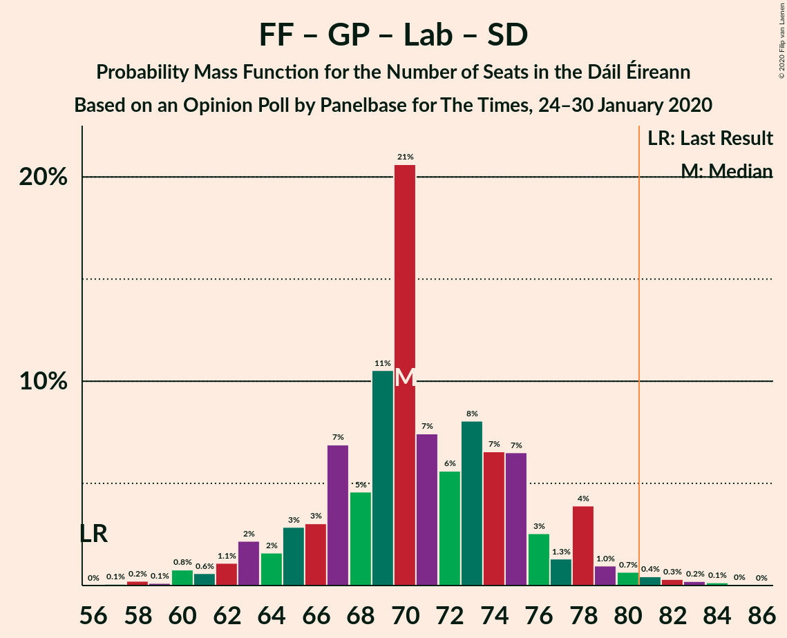
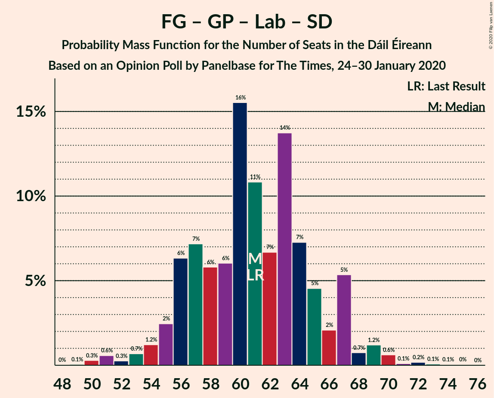
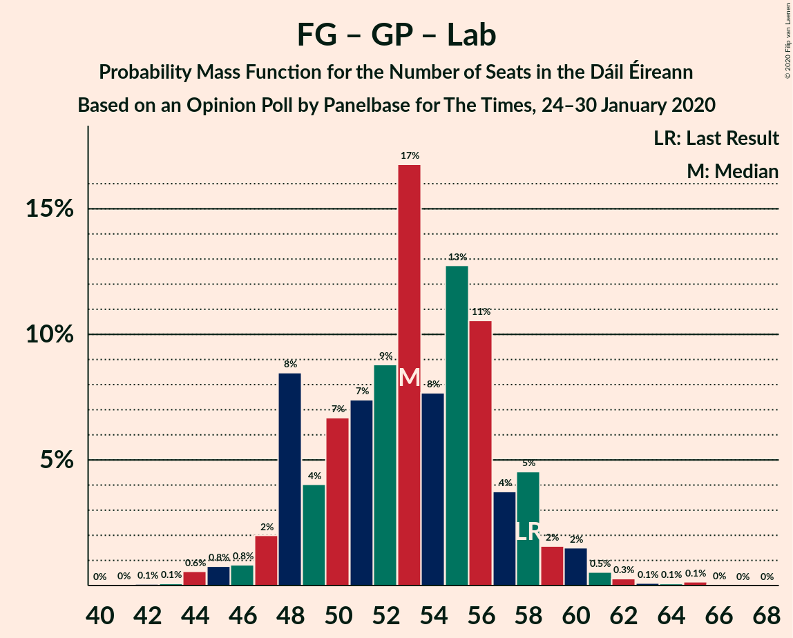

# Opinion Poll by Panelbase for The Times, 24–30 January 2020

<a href="#voting-intentions">Voting Intentions</a> | <a href="#seats">Seats</a> | <a href="#coalitions">Coalitions</a> | <a href="#technical-information">Technical Information</a>

## Voting Intentions

### Confidence Intervals

| Party | Last Result | Poll Result | 80% Confidence Interval | 90% Confidence Interval | 95% Confidence Interval | 99% Confidence Interval |
|:-----:|:-----------:|:-----------:|:-----------------------:|:-----------------------:|:-----------------------:|:-----------------------:|
| Fianna Fáil | 24.3% | 23.0% | 21.4–24.8% |20.9–25.3% |20.5–25.7% |19.7–26.6% |
| Sinn Féin | 13.8% | 21.0% | 19.4–22.7% |19.0–23.2% |18.6–23.6% |17.8–24.5% |
| Fine Gael | 25.5% | 19.0% | 17.5–20.7% |17.1–21.1% |16.7–21.6% |16.0–22.4% |
| Independent | 15.9% | 10.1% | 9.0–11.4% |8.6–11.8% |8.4–12.1% |7.9–12.8% |
| Green Party/Comhaontas Glas | 2.7% | 10.0% | 8.9–11.3% |8.6–11.7% |8.3–12.0% |7.8–12.7% |
| Labour Party | 6.6% | 5.0% | 4.2–6.0% |4.0–6.3% |3.8–6.5% |3.5–7.1% |
| Solidarity–People Before Profit | 3.9% | 5.0% | 4.2–6.0% |4.0–6.3% |3.8–6.5% |3.5–7.1% |
| Social Democrats | 3.0% | 5.0% | 4.2–6.0% |4.0–6.3% |3.8–6.5% |3.5–7.1% |
| Independents 4 Change | 1.5% | 1.3% | 0.9–1.9% |0.8–2.1% |0.8–2.2% |0.6–2.5% |

*Note:* The poll result column reflects the actual value used in the calculations. Published results may vary slightly, and in addition be rounded to fewer digits.

## Seats

### Confidence Intervals

| Party | Last Result | Median | 80% Confidence Interval | 90% Confidence Interval | 95% Confidence Interval | 99% Confidence Interval |
|:-----:|:-----------:|:------:|:-----------------------:|:-----------------------:|:-----------------------:|:-----------------------:|
| <a href="#fianna-fáil">Fianna Fáil</a> | 44 | 40 | 36–46 |33–47 |32–49 |31–51 |
| <a href="#sinn-féin">Sinn Féin</a> | 23 | 37 | 36–40 |36–41 |35–41 |34–42 |
| <a href="#fine-gael">Fine Gael</a> | 49 | 31 | 28–35 |27–36 |26–37 |25–39 |
| <a href="#independent">Independent</a> | 19 | 11 | 6–15 |6–15 |5–16 |4–17 |
| <a href="#green-party/comhaontas-glas">Green Party/Comhaontas Glas</a> | 2 | 18 | 10–20 |8–21 |8–22 |7–25 |
| <a href="#labour-party">Labour Party</a> | 7 | 5 | 2–6 |2–7 |1–11 |1–13 |
| <a href="#solidarity–people-before-profit">Solidarity–People Before Profit</a> | 6 | 7 | 4–9 |4–10 |4–10 |3–10 |
| <a href="#social-democrats">Social Democrats</a> | 3 | 8 | 6–10 |5–11 |4–12 |3–12 |
| <a href="#independents-4-change">Independents 4 Change</a> | 4 | 3 | 2–3 |2–3 |2–3 |1–3 |

### Fianna Fáil

*For a full overview of the results for this party, see the [Fianna Fáil](party-fiannafáil.html) page.*

| Number of Seats | Probability | Accumulated | Special Marks |
|:---------------:|:-----------:|:-----------:|:-------------:|
| 29 | 0% | 100% |  |
| 30 | 0.2% | 99.9% |  |
| 31 | 1.2% | 99.7% |  |
| 32 | 3% | 98% |  |
| 33 | 1.0% | 96% |  |
| 34 | 1.3% | 95% |  |
| 35 | 2% | 93% |  |
| 36 | 6% | 92% |  |
| 37 | 6% | 86% |  |
| 38 | 9% | 80% |  |
| 39 | 14% | 71% |  |
| 40 | 17% | 57% | Median |
| 41 | 5% | 40% |  |
| 42 | 5% | 36% |  |
| 43 | 8% | 30% |  |
| 44 | 6% | 23% | Last Result |
| 45 | 2% | 17% |  |
| 46 | 5% | 14% |  |
| 47 | 5% | 10% |  |
| 48 | 1.1% | 5% |  |
| 49 | 2% | 4% |  |
| 50 | 0.8% | 2% |  |
| 51 | 0.4% | 0.8% |  |
| 52 | 0.3% | 0.4% |  |
| 53 | 0.1% | 0.1% |  |
| 54 | 0% | 0.1% |  |
| 55 | 0% | 0% |  |

### Sinn Féin

*For a full overview of the results for this party, see the [Sinn Féin](party-sinnféin.html) page.*

| Number of Seats | Probability | Accumulated | Special Marks |
|:---------------:|:-----------:|:-----------:|:-------------:|
| 23 | 0% | 100% | Last Result |
| 24 | 0% | 100% |  |
| 25 | 0% | 100% |  |
| 26 | 0% | 100% |  |
| 27 | 0% | 100% |  |
| 28 | 0% | 100% |  |
| 29 | 0% | 100% |  |
| 30 | 0% | 100% |  |
| 31 | 0% | 100% |  |
| 32 | 0% | 100% |  |
| 33 | 0.4% | 100% |  |
| 34 | 2% | 99.6% |  |
| 35 | 2% | 98% |  |
| 36 | 10% | 97% |  |
| 37 | 51% | 86% | Median |
| 38 | 12% | 36% |  |
| 39 | 9% | 24% |  |
| 40 | 6% | 14% |  |
| 41 | 7% | 8% |  |
| 42 | 1.0% | 1.0% |  |
| 43 | 0% | 0% |  |

### Fine Gael

*For a full overview of the results for this party, see the [Fine Gael](party-finegael.html) page.*

| Number of Seats | Probability | Accumulated | Special Marks |
|:---------------:|:-----------:|:-----------:|:-------------:|
| 20 | 0% | 100% |  |
| 21 | 0.1% | 99.9% |  |
| 22 | 0.1% | 99.9% |  |
| 23 | 0% | 99.8% |  |
| 24 | 0.2% | 99.7% |  |
| 25 | 0.3% | 99.5% |  |
| 26 | 2% | 99.2% |  |
| 27 | 4% | 97% |  |
| 28 | 6% | 93% |  |
| 29 | 7% | 87% |  |
| 30 | 13% | 80% |  |
| 31 | 21% | 67% | Median |
| 32 | 16% | 46% |  |
| 33 | 13% | 30% |  |
| 34 | 5% | 17% |  |
| 35 | 4% | 12% |  |
| 36 | 5% | 9% |  |
| 37 | 2% | 4% |  |
| 38 | 1.1% | 2% |  |
| 39 | 0.9% | 1.0% |  |
| 40 | 0.1% | 0.1% |  |
| 41 | 0% | 0% |  |
| 42 | 0% | 0% |  |
| 43 | 0% | 0% |  |
| 44 | 0% | 0% |  |
| 45 | 0% | 0% |  |
| 46 | 0% | 0% |  |
| 47 | 0% | 0% |  |
| 48 | 0% | 0% |  |
| 49 | 0% | 0% | Last Result |

### Independent

*For a full overview of the results for this party, see the [Independent](party-independent.html) page.*

| Number of Seats | Probability | Accumulated | Special Marks |
|:---------------:|:-----------:|:-----------:|:-------------:|
| 3 | 0.2% | 100% |  |
| 4 | 2% | 99.8% |  |
| 5 | 3% | 98% |  |
| 6 | 7% | 95% |  |
| 7 | 8% | 89% |  |
| 8 | 6% | 80% |  |
| 9 | 8% | 74% |  |
| 10 | 12% | 67% |  |
| 11 | 8% | 54% | Median |
| 12 | 12% | 46% |  |
| 13 | 16% | 34% |  |
| 14 | 8% | 19% |  |
| 15 | 7% | 11% |  |
| 16 | 2% | 4% |  |
| 17 | 1.2% | 1.3% |  |
| 18 | 0% | 0% |  |
| 19 | 0% | 0% | Last Result |

### Green Party/Comhaontas Glas

*For a full overview of the results for this party, see the [Green Party/Comhaontas Glas](party-greenpartycomhaontasglas.html) page.*

| Number of Seats | Probability | Accumulated | Special Marks |
|:---------------:|:-----------:|:-----------:|:-------------:|
| 2 | 0% | 100% | Last Result |
| 3 | 0% | 100% |  |
| 4 | 0% | 100% |  |
| 5 | 0% | 100% |  |
| 6 | 0% | 100% |  |
| 7 | 2% | 100% |  |
| 8 | 5% | 98% |  |
| 9 | 2% | 94% |  |
| 10 | 2% | 91% |  |
| 11 | 0.9% | 89% |  |
| 12 | 4% | 88% |  |
| 13 | 1.3% | 84% |  |
| 14 | 3% | 83% |  |
| 15 | 3% | 80% |  |
| 16 | 5% | 77% |  |
| 17 | 8% | 72% |  |
| 18 | 24% | 64% | Median |
| 19 | 14% | 39% |  |
| 20 | 16% | 25% |  |
| 21 | 4% | 9% |  |
| 22 | 3% | 5% |  |
| 23 | 0.7% | 2% |  |
| 24 | 0.7% | 1.5% |  |
| 25 | 0.7% | 0.7% |  |
| 26 | 0.1% | 0.1% |  |
| 27 | 0% | 0% |  |

### Labour Party

*For a full overview of the results for this party, see the [Labour Party](party-labourparty.html) page.*

| Number of Seats | Probability | Accumulated | Special Marks |
|:---------------:|:-----------:|:-----------:|:-------------:|
| 1 | 4% | 100% |  |
| 2 | 13% | 96% |  |
| 3 | 3% | 83% |  |
| 4 | 3% | 79% |  |
| 5 | 45% | 76% | Median |
| 6 | 23% | 31% |  |
| 7 | 5% | 8% | Last Result |
| 8 | 0.4% | 3% |  |
| 9 | 0.1% | 3% |  |
| 10 | 0.1% | 3% |  |
| 11 | 0.8% | 3% |  |
| 12 | 1.3% | 2% |  |
| 13 | 0.5% | 0.6% |  |
| 14 | 0.2% | 0.2% |  |
| 15 | 0% | 0% |  |

### Solidarity–People Before Profit

*For a full overview of the results for this party, see the [Solidarity–People Before Profit](party-solidarity–peoplebeforeprofit.html) page.*

| Number of Seats | Probability | Accumulated | Special Marks |
|:---------------:|:-----------:|:-----------:|:-------------:|
| 2 | 0.1% | 100% |  |
| 3 | 2% | 99.9% |  |
| 4 | 10% | 98% |  |
| 5 | 10% | 87% |  |
| 6 | 21% | 78% | Last Result |
| 7 | 28% | 57% | Median |
| 8 | 11% | 29% |  |
| 9 | 11% | 18% |  |
| 10 | 7% | 7% |  |
| 11 | 0% | 0% |  |

### Social Democrats

*For a full overview of the results for this party, see the [Social Democrats](party-socialdemocrats.html) page.*

| Number of Seats | Probability | Accumulated | Special Marks |
|:---------------:|:-----------:|:-----------:|:-------------:|
| 3 | 0.5% | 100% | Last Result |
| 4 | 3% | 99.5% |  |
| 5 | 5% | 97% |  |
| 6 | 10% | 92% |  |
| 7 | 22% | 82% |  |
| 8 | 16% | 60% | Median |
| 9 | 33% | 44% |  |
| 10 | 6% | 11% |  |
| 11 | 3% | 5% |  |
| 12 | 3% | 3% |  |
| 13 | 0.2% | 0.2% |  |
| 14 | 0.1% | 0.1% |  |
| 15 | 0% | 0% |  |

### Independents 4 Change

*For a full overview of the results for this party, see the [Independents 4 Change](party-independents4change.html) page.*

| Number of Seats | Probability | Accumulated | Special Marks |
|:---------------:|:-----------:|:-----------:|:-------------:|
| 0 | 0.3% | 100% |  |
| 1 | 0.4% | 99.7% |  |
| 2 | 37% | 99.3% |  |
| 3 | 63% | 63% | Median |
| 4 | 0% | 0% | Last Result |

## Coalitions

### Confidence Intervals

| Coalition | Last Result | Median | Majority? | 80% Confidence Interval | 90% Confidence Interval | 95% Confidence Interval | 99% Confidence Interval |
|:---------:|:-----------:|:------:|:---------:|:-----------------------:|:-----------------------:|:-----------------------:|:-----------------------:|
| Fianna Fáil – Sinn Féin | 67 | 77 | 26% | 73–84 | 71–88 | 70–88 | 69–90 |
| Fianna Fáil – Fine Gael | 93 | 71 | 4% | 66–78 | 65–80 | 64–82 | 62–85 |
| Fianna Fáil – Green Party/Comhaontas Glas – Labour Party – Social Democrats | 56 | 70 | 0.9% | 65–75 | 63–78 | 62–79 | 58–82 |
| Fianna Fáil – Green Party/Comhaontas Glas – Labour Party | 53 | 63 | 0% | 57–68 | 55–69 | 53–71 | 50–74 |
| Fine Gael – Green Party/Comhaontas Glas – Labour Party – Social Democrats | 61 | 61 | 0% | 56–66 | 55–68 | 53–69 | 50–71 |
| Fianna Fáil – Green Party/Comhaontas Glas | 46 | 58 | 0% | 52–63 | 49–65 | 48–66 | 44–69 |
| Fine Gael – Green Party/Comhaontas Glas – Labour Party | 58 | 54 | 0% | 48–58 | 47–59 | 46–60 | 43–63 |
| Fine Gael – Green Party/Comhaontas Glas | 51 | 49 | 0% | 44–52 | 41–53 | 41–55 | 38–56 |
| Fianna Fáil – Labour Party | 51 | 45 | 0% | 40–51 | 38–53 | 38–54 | 36–57 |
| Fine Gael – Labour Party | 56 | 36 | 0% | 32–41 | 31–43 | 31–44 | 28–46 |
| Fine Gael | 49 | 31 | 0% | 28–35 | 27–36 | 26–37 | 25–39 |

### Fianna Fáil – Sinn Féin

| Number of Seats | Probability | Accumulated | Special Marks |
|:---------------:|:-----------:|:-----------:|:-------------:|
| 66 | 0% | 100% |  |
| 67 | 0.1% | 99.9% | Last Result |
| 68 | 0.3% | 99.9% |  |
| 69 | 1.2% | 99.6% |  |
| 70 | 1.4% | 98% |  |
| 71 | 4% | 97% |  |
| 72 | 2% | 93% |  |
| 73 | 6% | 91% |  |
| 74 | 4% | 85% |  |
| 75 | 8% | 82% |  |
| 76 | 11% | 73% |  |
| 77 | 15% | 62% | Median |
| 78 | 5% | 47% |  |
| 79 | 10% | 42% |  |
| 80 | 6% | 32% |  |
| 81 | 5% | 26% | Majority |
| 82 | 3% | 22% |  |
| 83 | 5% | 18% |  |
| 84 | 4% | 13% |  |
| 85 | 1.1% | 9% |  |
| 86 | 2% | 8% |  |
| 87 | 0.6% | 6% |  |
| 88 | 4% | 5% |  |
| 89 | 0.4% | 1.1% |  |
| 90 | 0.4% | 0.6% |  |
| 91 | 0.1% | 0.2% |  |
| 92 | 0.1% | 0.2% |  |
| 93 | 0.1% | 0.1% |  |
| 94 | 0% | 0% |  |

### Fianna Fáil – Fine Gael

| Number of Seats | Probability | Accumulated | Special Marks |
|:---------------:|:-----------:|:-----------:|:-------------:|
| 60 | 0.3% | 100% |  |
| 61 | 0.1% | 99.6% |  |
| 62 | 0.1% | 99.5% |  |
| 63 | 0.6% | 99.4% |  |
| 64 | 1.4% | 98.9% |  |
| 65 | 4% | 97% |  |
| 66 | 6% | 93% |  |
| 67 | 3% | 88% |  |
| 68 | 6% | 84% |  |
| 69 | 4% | 79% |  |
| 70 | 20% | 74% |  |
| 71 | 11% | 54% | Median |
| 72 | 7% | 43% |  |
| 73 | 4% | 36% |  |
| 74 | 3% | 32% |  |
| 75 | 6% | 29% |  |
| 76 | 5% | 22% |  |
| 77 | 5% | 18% |  |
| 78 | 4% | 13% |  |
| 79 | 2% | 10% |  |
| 80 | 4% | 7% |  |
| 81 | 1.0% | 4% | Majority |
| 82 | 0.5% | 3% |  |
| 83 | 0.5% | 2% |  |
| 84 | 0.4% | 1.5% |  |
| 85 | 0.7% | 1.1% |  |
| 86 | 0.2% | 0.3% |  |
| 87 | 0.1% | 0.1% |  |
| 88 | 0% | 0.1% |  |
| 89 | 0% | 0% |  |
| 90 | 0% | 0% |  |
| 91 | 0% | 0% |  |
| 92 | 0% | 0% |  |
| 93 | 0% | 0% | Last Result |

### Fianna Fáil – Green Party/Comhaontas Glas – Labour Party – Social Democrats

| Number of Seats | Probability | Accumulated | Special Marks |
|:---------------:|:-----------:|:-----------:|:-------------:|
| 55 | 0.1% | 100% |  |
| 56 | 0.1% | 99.9% | Last Result |
| 57 | 0.1% | 99.9% |  |
| 58 | 0.6% | 99.7% |  |
| 59 | 0.3% | 99.2% |  |
| 60 | 0.7% | 98.8% |  |
| 61 | 0.6% | 98% |  |
| 62 | 2% | 98% |  |
| 63 | 1.1% | 95% |  |
| 64 | 2% | 94% |  |
| 65 | 4% | 92% |  |
| 66 | 4% | 88% |  |
| 67 | 8% | 85% |  |
| 68 | 3% | 77% |  |
| 69 | 9% | 74% |  |
| 70 | 24% | 65% |  |
| 71 | 5% | 41% | Median |
| 72 | 7% | 35% |  |
| 73 | 7% | 29% |  |
| 74 | 8% | 21% |  |
| 75 | 4% | 14% |  |
| 76 | 2% | 10% |  |
| 77 | 1.1% | 8% |  |
| 78 | 3% | 7% |  |
| 79 | 2% | 3% |  |
| 80 | 0.7% | 2% |  |
| 81 | 0.4% | 0.9% | Majority |
| 82 | 0.2% | 0.5% |  |
| 83 | 0.2% | 0.3% |  |
| 84 | 0.1% | 0.2% |  |
| 85 | 0% | 0.1% |  |
| 86 | 0% | 0% |  |

### Fianna Fáil – Green Party/Comhaontas Glas – Labour Party

| Number of Seats | Probability | Accumulated | Special Marks |
|:---------------:|:-----------:|:-----------:|:-------------:|
| 47 | 0% | 100% |  |
| 48 | 0.2% | 99.9% |  |
| 49 | 0.1% | 99.8% |  |
| 50 | 0.6% | 99.7% |  |
| 51 | 0.3% | 99.1% |  |
| 52 | 0.4% | 98.8% |  |
| 53 | 1.2% | 98% | Last Result |
| 54 | 2% | 97% |  |
| 55 | 2% | 95% |  |
| 56 | 3% | 94% |  |
| 57 | 2% | 90% |  |
| 58 | 5% | 88% |  |
| 59 | 5% | 82% |  |
| 60 | 4% | 78% |  |
| 61 | 10% | 74% |  |
| 62 | 7% | 63% |  |
| 63 | 18% | 56% | Median |
| 64 | 13% | 38% |  |
| 65 | 5% | 25% |  |
| 66 | 5% | 20% |  |
| 67 | 5% | 15% |  |
| 68 | 2% | 10% |  |
| 69 | 4% | 8% |  |
| 70 | 1.0% | 4% |  |
| 71 | 0.7% | 3% |  |
| 72 | 0.6% | 2% |  |
| 73 | 0.7% | 1.3% |  |
| 74 | 0.3% | 0.6% |  |
| 75 | 0.2% | 0.3% |  |
| 76 | 0% | 0.2% |  |
| 77 | 0.1% | 0.1% |  |
| 78 | 0% | 0.1% |  |
| 79 | 0% | 0% |  |

### Fine Gael – Green Party/Comhaontas Glas – Labour Party – Social Democrats

| Number of Seats | Probability | Accumulated | Special Marks |
|:---------------:|:-----------:|:-----------:|:-------------:|
| 47 | 0.1% | 100% |  |
| 48 | 0.2% | 99.9% |  |
| 49 | 0.1% | 99.8% |  |
| 50 | 0.6% | 99.7% |  |
| 51 | 0.2% | 99.1% |  |
| 52 | 0.6% | 98.8% |  |
| 53 | 1.1% | 98% |  |
| 54 | 1.1% | 97% |  |
| 55 | 5% | 96% |  |
| 56 | 4% | 91% |  |
| 57 | 6% | 87% |  |
| 58 | 7% | 81% |  |
| 59 | 3% | 74% |  |
| 60 | 6% | 71% |  |
| 61 | 15% | 65% | Last Result |
| 62 | 11% | 50% | Median |
| 63 | 8% | 38% |  |
| 64 | 12% | 30% |  |
| 65 | 5% | 18% |  |
| 66 | 3% | 13% |  |
| 67 | 2% | 9% |  |
| 68 | 4% | 7% |  |
| 69 | 1.1% | 3% |  |
| 70 | 0.9% | 2% |  |
| 71 | 0.4% | 0.7% |  |
| 72 | 0.1% | 0.4% |  |
| 73 | 0.1% | 0.3% |  |
| 74 | 0.1% | 0.2% |  |
| 75 | 0% | 0.1% |  |
| 76 | 0% | 0% |  |

### Fianna Fáil – Green Party/Comhaontas Glas

| Number of Seats | Probability | Accumulated | Special Marks |
|:---------------:|:-----------:|:-----------:|:-------------:|
| 44 | 0.5% | 100% |  |
| 45 | 0.3% | 99.5% |  |
| 46 | 0.3% | 99.2% | Last Result |
| 47 | 0.5% | 98.9% |  |
| 48 | 2% | 98% |  |
| 49 | 2% | 97% |  |
| 50 | 2% | 95% |  |
| 51 | 2% | 93% |  |
| 52 | 4% | 91% |  |
| 53 | 4% | 87% |  |
| 54 | 5% | 82% |  |
| 55 | 8% | 77% |  |
| 56 | 4% | 70% |  |
| 57 | 6% | 66% |  |
| 58 | 20% | 60% | Median |
| 59 | 13% | 40% |  |
| 60 | 7% | 27% |  |
| 61 | 2% | 20% |  |
| 62 | 5% | 17% |  |
| 63 | 4% | 13% |  |
| 64 | 3% | 9% |  |
| 65 | 2% | 5% |  |
| 66 | 1.0% | 3% |  |
| 67 | 0.6% | 2% |  |
| 68 | 0.7% | 1.2% |  |
| 69 | 0.2% | 0.5% |  |
| 70 | 0.2% | 0.3% |  |
| 71 | 0.1% | 0.1% |  |
| 72 | 0% | 0.1% |  |
| 73 | 0% | 0% |  |

### Fine Gael – Green Party/Comhaontas Glas – Labour Party

| Number of Seats | Probability | Accumulated | Special Marks |
|:---------------:|:-----------:|:-----------:|:-------------:|
| 40 | 0% | 100% |  |
| 41 | 0.1% | 99.9% |  |
| 42 | 0.2% | 99.9% |  |
| 43 | 0.8% | 99.7% |  |
| 44 | 0.6% | 98.9% |  |
| 45 | 0.6% | 98% |  |
| 46 | 1.3% | 98% |  |
| 47 | 6% | 96% |  |
| 48 | 4% | 91% |  |
| 49 | 4% | 86% |  |
| 50 | 7% | 82% |  |
| 51 | 6% | 76% |  |
| 52 | 6% | 70% |  |
| 53 | 9% | 63% |  |
| 54 | 16% | 55% | Median |
| 55 | 6% | 38% |  |
| 56 | 12% | 32% |  |
| 57 | 9% | 21% |  |
| 58 | 4% | 12% | Last Result |
| 59 | 4% | 7% |  |
| 60 | 2% | 4% |  |
| 61 | 1.4% | 2% |  |
| 62 | 0.3% | 0.8% |  |
| 63 | 0.2% | 0.5% |  |
| 64 | 0.1% | 0.3% |  |
| 65 | 0.1% | 0.3% |  |
| 66 | 0.1% | 0.2% |  |
| 67 | 0% | 0% |  |

### Fine Gael – Green Party/Comhaontas Glas

| Number of Seats | Probability | Accumulated | Special Marks |
|:---------------:|:-----------:|:-----------:|:-------------:|
| 34 | 0% | 100% |  |
| 35 | 0% | 99.9% |  |
| 36 | 0.1% | 99.9% |  |
| 37 | 0.1% | 99.9% |  |
| 38 | 0.3% | 99.7% |  |
| 39 | 0.4% | 99.4% |  |
| 40 | 0.4% | 99.0% |  |
| 41 | 5% | 98.6% |  |
| 42 | 1.3% | 94% |  |
| 43 | 2% | 92% |  |
| 44 | 6% | 90% |  |
| 45 | 5% | 84% |  |
| 46 | 6% | 79% |  |
| 47 | 5% | 72% |  |
| 48 | 12% | 67% |  |
| 49 | 13% | 55% | Median |
| 50 | 9% | 42% |  |
| 51 | 10% | 33% | Last Result |
| 52 | 13% | 22% |  |
| 53 | 5% | 9% |  |
| 54 | 1.5% | 4% |  |
| 55 | 1.3% | 3% |  |
| 56 | 1.0% | 1.3% |  |
| 57 | 0.2% | 0.3% |  |
| 58 | 0% | 0.1% |  |
| 59 | 0% | 0.1% |  |
| 60 | 0% | 0% |  |

### Fianna Fáil – Labour Party

| Number of Seats | Probability | Accumulated | Special Marks |
|:---------------:|:-----------:|:-----------:|:-------------:|
| 34 | 0.1% | 100% |  |
| 35 | 0.1% | 99.9% |  |
| 36 | 0.7% | 99.8% |  |
| 37 | 2% | 99.1% |  |
| 38 | 4% | 98% |  |
| 39 | 1.0% | 93% |  |
| 40 | 2% | 92% |  |
| 41 | 6% | 90% |  |
| 42 | 7% | 84% |  |
| 43 | 8% | 77% |  |
| 44 | 13% | 69% |  |
| 45 | 15% | 56% | Median |
| 46 | 9% | 41% |  |
| 47 | 4% | 32% |  |
| 48 | 6% | 28% |  |
| 49 | 5% | 22% |  |
| 50 | 4% | 17% |  |
| 51 | 4% | 14% | Last Result |
| 52 | 1.4% | 9% |  |
| 53 | 5% | 8% |  |
| 54 | 0.9% | 3% |  |
| 55 | 1.4% | 2% |  |
| 56 | 0.5% | 1.0% |  |
| 57 | 0.2% | 0.6% |  |
| 58 | 0.1% | 0.4% |  |
| 59 | 0.1% | 0.2% |  |
| 60 | 0.1% | 0.1% |  |
| 61 | 0% | 0.1% |  |
| 62 | 0% | 0% |  |

### Fine Gael – Labour Party

| Number of Seats | Probability | Accumulated | Special Marks |
|:---------------:|:-----------:|:-----------:|:-------------:|
| 25 | 0% | 100% |  |
| 26 | 0.1% | 99.9% |  |
| 27 | 0.1% | 99.9% |  |
| 28 | 0.4% | 99.8% |  |
| 29 | 0.6% | 99.4% |  |
| 30 | 1.2% | 98.8% |  |
| 31 | 3% | 98% |  |
| 32 | 8% | 94% |  |
| 33 | 8% | 86% |  |
| 34 | 6% | 78% |  |
| 35 | 9% | 72% |  |
| 36 | 19% | 63% | Median |
| 37 | 15% | 44% |  |
| 38 | 6% | 29% |  |
| 39 | 9% | 23% |  |
| 40 | 3% | 14% |  |
| 41 | 2% | 11% |  |
| 42 | 3% | 9% |  |
| 43 | 3% | 5% |  |
| 44 | 1.4% | 3% |  |
| 45 | 0.7% | 1.5% |  |
| 46 | 0.4% | 0.8% |  |
| 47 | 0.2% | 0.4% |  |
| 48 | 0.1% | 0.3% |  |
| 49 | 0.1% | 0.2% |  |
| 50 | 0% | 0% |  |
| 51 | 0% | 0% |  |
| 52 | 0% | 0% |  |
| 53 | 0% | 0% |  |
| 54 | 0% | 0% |  |
| 55 | 0% | 0% |  |
| 56 | 0% | 0% | Last Result |

### Fine Gael

| Number of Seats | Probability | Accumulated | Special Marks |
|:---------------:|:-----------:|:-----------:|:-------------:|
| 20 | 0% | 100% |  |
| 21 | 0.1% | 99.9% |  |
| 22 | 0.1% | 99.9% |  |
| 23 | 0% | 99.8% |  |
| 24 | 0.2% | 99.7% |  |
| 25 | 0.3% | 99.5% |  |
| 26 | 2% | 99.2% |  |
| 27 | 4% | 97% |  |
| 28 | 6% | 93% |  |
| 29 | 7% | 87% |  |
| 30 | 13% | 80% |  |
| 31 | 21% | 67% | Median |
| 32 | 16% | 46% |  |
| 33 | 13% | 30% |  |
| 34 | 5% | 17% |  |
| 35 | 4% | 12% |  |
| 36 | 5% | 9% |  |
| 37 | 2% | 4% |  |
| 38 | 1.1% | 2% |  |
| 39 | 0.9% | 1.0% |  |
| 40 | 0.1% | 0.1% |  |
| 41 | 0% | 0% |  |
| 42 | 0% | 0% |  |
| 43 | 0% | 0% |  |
| 44 | 0% | 0% |  |
| 45 | 0% | 0% |  |
| 46 | 0% | 0% |  |
| 47 | 0% | 0% |  |
| 48 | 0% | 0% |  |
| 49 | 0% | 0% | Last Result |

## Technical Information

### Opinion Poll

+ **Polling firm:** Panelbase
+ **Commissioner(s):** The Times
+ **Fieldwork period:** 24–30 January 2020

### Calculations

+ **Sample size:** 1000
+ **Simulations done:** 1,048,576
+ **Error estimate:** 1.63%

