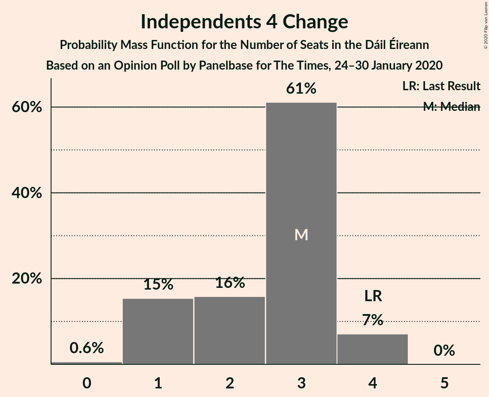
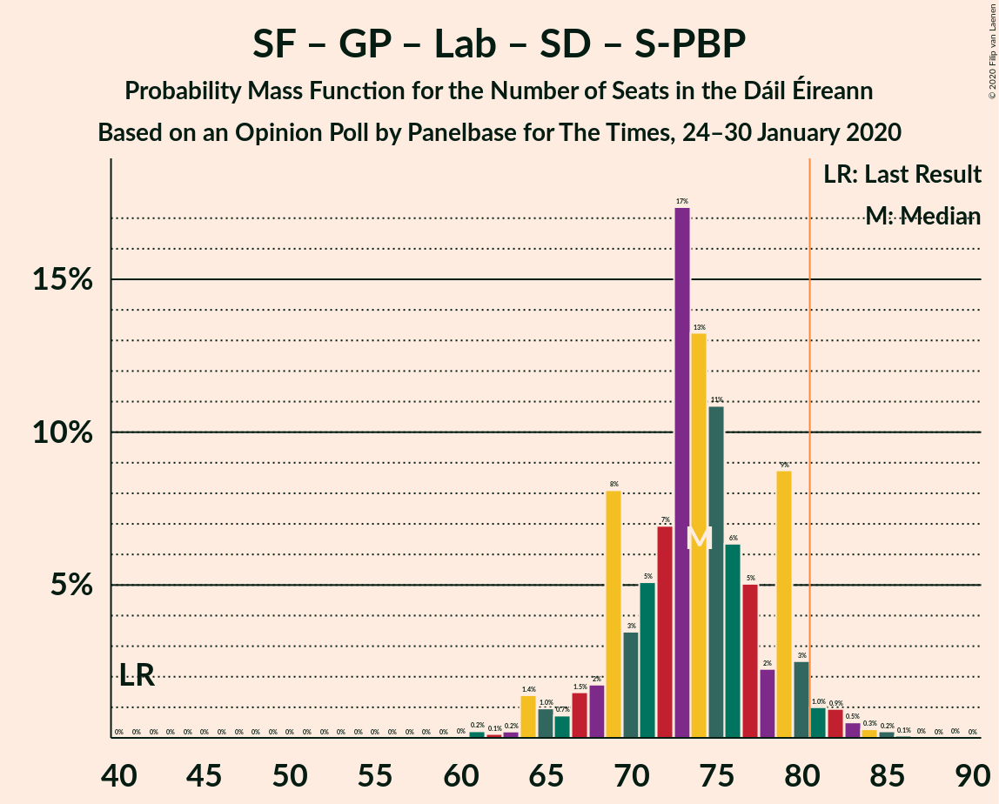
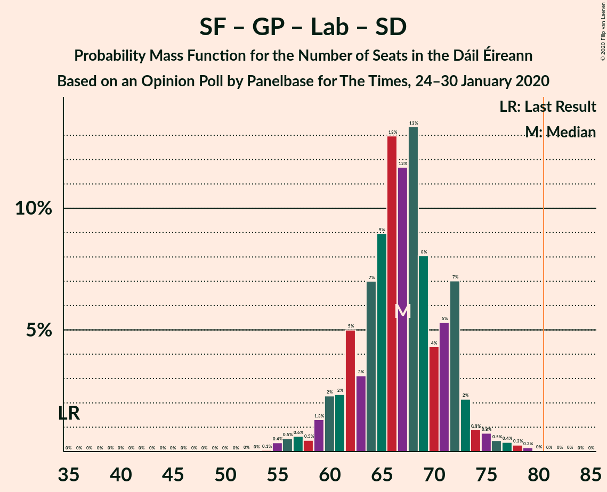
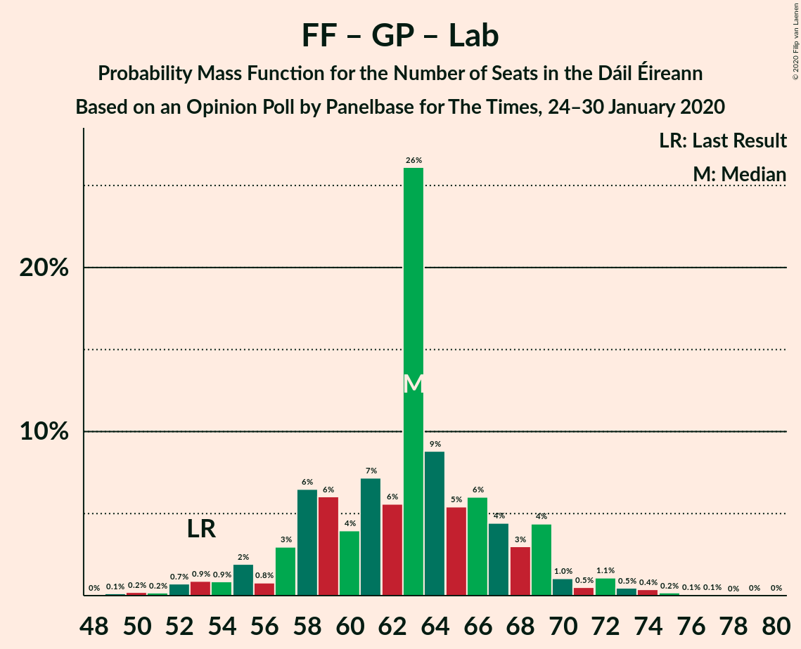
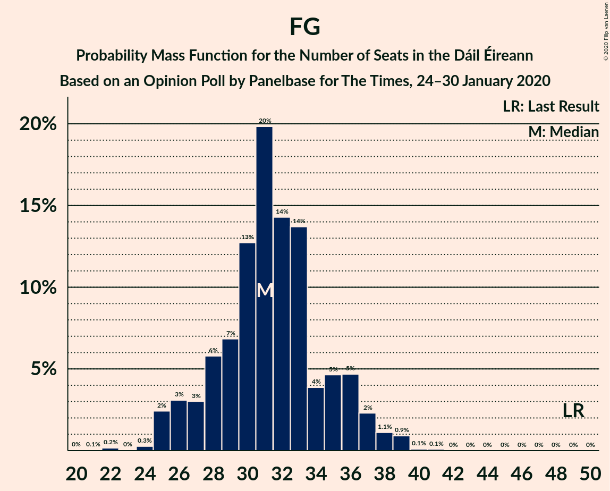

# Opinion Poll by Panelbase for The Times, 24–30 January 2020

<a href="#voting-intentions">Voting Intentions</a> | <a href="#seats">Seats</a> | <a href="#coalitions">Coalitions</a> | <a href="#technical-information">Technical Information</a>

## Voting Intentions

### Confidence Intervals

| Party | Last Result | Poll Result | 80% Confidence Interval | 90% Confidence Interval | 95% Confidence Interval | 99% Confidence Interval |
|:-----:|:-----------:|:-----------:|:-----------------------:|:-----------------------:|:-----------------------:|:-----------------------:|
| Fianna Fáil | 24.3% | 23.0% | 21.4–24.8% |20.9–25.3% |20.5–25.7% |19.7–26.6% |
| Sinn Féin | 13.8% | 21.0% | 19.4–22.7% |19.0–23.2% |18.6–23.6% |17.8–24.5% |
| Fine Gael | 25.5% | 19.0% | 17.5–20.7% |17.1–21.1% |16.7–21.6% |16.0–22.4% |
| Independent | 15.9% | 10.1% | 9.0–11.4% |8.6–11.8% |8.4–12.1% |7.9–12.8% |
| Green Party/Comhaontas Glas | 2.7% | 10.0% | 8.9–11.3% |8.6–11.7% |8.3–12.0% |7.8–12.7% |
| Labour Party | 6.6% | 5.0% | 4.2–6.0% |4.0–6.3% |3.8–6.5% |3.5–7.1% |
| Solidarity–People Before Profit | 3.9% | 5.0% | 4.2–6.0% |4.0–6.3% |3.8–6.5% |3.5–7.1% |
| Social Democrats | 3.0% | 5.0% | 4.2–6.0% |4.0–6.3% |3.8–6.5% |3.5–7.1% |
| Independents 4 Change | 1.5% | 1.3% | 0.9–1.9% |0.8–2.1% |0.8–2.2% |0.6–2.5% |

*Note:* The poll result column reflects the actual value used in the calculations. Published results may vary slightly, and in addition be rounded to fewer digits.

## Seats

### Confidence Intervals

| Party | Last Result | Median | 80% Confidence Interval | 90% Confidence Interval | 95% Confidence Interval | 99% Confidence Interval |
|:-----:|:-----------:|:------:|:-----------------------:|:-----------------------:|:-----------------------:|:-----------------------:|
| <a href="#fianna-fáil">Fianna Fáil</a> | 44 | 41 | 36–47 |34–48 |33–49 |32–51 |
| <a href="#sinn-féin">Sinn Féin</a> | 23 | 37 | 36–40 |36–41 |35–41 |34–42 |
| <a href="#fine-gael">Fine Gael</a> | 49 | 31 | 28–35 |26–36 |25–37 |24–39 |
| <a href="#independent">Independent</a> | 19 | 11 | 6–15 |5–15 |5–16 |4–17 |
| <a href="#green-party/comhaontas-glas">Green Party/Comhaontas Glas</a> | 2 | 18 | 10–20 |8–21 |8–22 |7–25 |
| <a href="#labour-party">Labour Party</a> | 7 | 4 | 2–6 |2–6 |1–11 |1–13 |
| <a href="#solidarity–people-before-profit">Solidarity–People Before Profit</a> | 6 | 7 | 4–9 |4–10 |4–10 |3–10 |
| <a href="#social-democrats">Social Democrats</a> | 3 | 8 | 6–10 |5–11 |4–12 |3–12 |
| <a href="#independents-4-change">Independents 4 Change</a> | 4 | 3 | 1–3 |1–4 |1–4 |0–4 |

### Fianna Fáil

*For a full overview of the results for this party, see the [Fianna Fáil](party-fiannafáil.html) page.*

| Number of Seats | Probability | Accumulated | Special Marks |
|:---------------:|:-----------:|:-----------:|:-------------:|
| 30 | 0.2% | 100% |  |
| 31 | 0.2% | 99.7% |  |
| 32 | 1.2% | 99.5% |  |
| 33 | 3% | 98% |  |
| 34 | 2% | 96% |  |
| 35 | 2% | 94% |  |
| 36 | 3% | 92% |  |
| 37 | 6% | 89% |  |
| 38 | 6% | 83% |  |
| 39 | 15% | 77% |  |
| 40 | 7% | 62% |  |
| 41 | 15% | 55% | Median |
| 42 | 9% | 40% |  |
| 43 | 4% | 31% |  |
| 44 | 8% | 27% | Last Result |
| 45 | 4% | 18% |  |
| 46 | 3% | 14% |  |
| 47 | 3% | 11% |  |
| 48 | 4% | 8% |  |
| 49 | 2% | 4% |  |
| 50 | 1.4% | 2% |  |
| 51 | 0.6% | 1.0% |  |
| 52 | 0.3% | 0.4% |  |
| 53 | 0.1% | 0.2% |  |
| 54 | 0.1% | 0.1% |  |
| 55 | 0% | 0% |  |

### Sinn Féin

*For a full overview of the results for this party, see the [Sinn Féin](party-sinnféin.html) page.*

| Number of Seats | Probability | Accumulated | Special Marks |
|:---------------:|:-----------:|:-----------:|:-------------:|
| 23 | 0% | 100% | Last Result |
| 24 | 0% | 100% |  |
| 25 | 0% | 100% |  |
| 26 | 0% | 100% |  |
| 27 | 0% | 100% |  |
| 28 | 0% | 100% |  |
| 29 | 0% | 100% |  |
| 30 | 0% | 100% |  |
| 31 | 0% | 100% |  |
| 32 | 0% | 100% |  |
| 33 | 0.4% | 100% |  |
| 34 | 2% | 99.6% |  |
| 35 | 2% | 98% |  |
| 36 | 10% | 97% |  |
| 37 | 51% | 86% | Median |
| 38 | 12% | 36% |  |
| 39 | 9% | 24% |  |
| 40 | 6% | 14% |  |
| 41 | 8% | 8% |  |
| 42 | 0.9% | 0.9% |  |
| 43 | 0% | 0% |  |

### Fine Gael

*For a full overview of the results for this party, see the [Fine Gael](party-finegael.html) page.*

| Number of Seats | Probability | Accumulated | Special Marks |
|:---------------:|:-----------:|:-----------:|:-------------:|
| 21 | 0.1% | 100% |  |
| 22 | 0.2% | 99.9% |  |
| 23 | 0.1% | 99.7% |  |
| 24 | 0.3% | 99.7% |  |
| 25 | 2% | 99.4% |  |
| 26 | 3% | 97% |  |
| 27 | 3% | 94% |  |
| 28 | 6% | 91% |  |
| 29 | 7% | 85% |  |
| 30 | 13% | 78% |  |
| 31 | 20% | 66% | Median |
| 32 | 14% | 46% |  |
| 33 | 14% | 31% |  |
| 34 | 4% | 18% |  |
| 35 | 5% | 14% |  |
| 36 | 5% | 9% |  |
| 37 | 2% | 4% |  |
| 38 | 1.1% | 2% |  |
| 39 | 0.9% | 1.1% |  |
| 40 | 0.1% | 0.2% |  |
| 41 | 0% | 0.1% |  |
| 42 | 0% | 0% |  |
| 43 | 0% | 0% |  |
| 44 | 0% | 0% |  |
| 45 | 0% | 0% |  |
| 46 | 0% | 0% |  |
| 47 | 0% | 0% |  |
| 48 | 0% | 0% |  |
| 49 | 0% | 0% | Last Result |

### Independent

*For a full overview of the results for this party, see the [Independent](party-independent.html) page.*

| Number of Seats | Probability | Accumulated | Special Marks |
|:---------------:|:-----------:|:-----------:|:-------------:|
| 3 | 0.2% | 100% |  |
| 4 | 2% | 99.8% |  |
| 5 | 3% | 98% |  |
| 6 | 7% | 95% |  |
| 7 | 9% | 88% |  |
| 8 | 5% | 79% |  |
| 9 | 7% | 74% |  |
| 10 | 12% | 67% |  |
| 11 | 8% | 54% | Median |
| 12 | 12% | 46% |  |
| 13 | 16% | 34% |  |
| 14 | 8% | 19% |  |
| 15 | 7% | 11% |  |
| 16 | 2% | 4% |  |
| 17 | 1.2% | 1.3% |  |
| 18 | 0% | 0% |  |
| 19 | 0% | 0% | Last Result |

### Green Party/Comhaontas Glas

*For a full overview of the results for this party, see the [Green Party/Comhaontas Glas](party-greenpartycomhaontasglas.html) page.*

| Number of Seats | Probability | Accumulated | Special Marks |
|:---------------:|:-----------:|:-----------:|:-------------:|
| 2 | 0% | 100% | Last Result |
| 3 | 0% | 100% |  |
| 4 | 0% | 100% |  |
| 5 | 0% | 100% |  |
| 6 | 0% | 100% |  |
| 7 | 2% | 100% |  |
| 8 | 5% | 98% |  |
| 9 | 2% | 94% |  |
| 10 | 3% | 92% |  |
| 11 | 0.9% | 89% |  |
| 12 | 3% | 88% |  |
| 13 | 2% | 85% |  |
| 14 | 3% | 83% |  |
| 15 | 3% | 81% |  |
| 16 | 6% | 78% |  |
| 17 | 8% | 72% |  |
| 18 | 25% | 65% | Median |
| 19 | 14% | 39% |  |
| 20 | 16% | 25% |  |
| 21 | 4% | 9% |  |
| 22 | 3% | 5% |  |
| 23 | 0.6% | 2% |  |
| 24 | 0.8% | 2% |  |
| 25 | 0.7% | 0.7% |  |
| 26 | 0.1% | 0.1% |  |
| 27 | 0% | 0% |  |

### Labour Party

*For a full overview of the results for this party, see the [Labour Party](party-labourparty.html) page.*

| Number of Seats | Probability | Accumulated | Special Marks |
|:---------------:|:-----------:|:-----------:|:-------------:|
| 1 | 4% | 100% |  |
| 2 | 13% | 96% |  |
| 3 | 4% | 82% |  |
| 4 | 42% | 79% | Median |
| 5 | 23% | 37% |  |
| 6 | 9% | 14% |  |
| 7 | 1.3% | 4% | Last Result |
| 8 | 0.3% | 3% |  |
| 9 | 0.1% | 3% |  |
| 10 | 0.1% | 3% |  |
| 11 | 0.8% | 3% |  |
| 12 | 1.3% | 2% |  |
| 13 | 0.5% | 0.6% |  |
| 14 | 0.2% | 0.2% |  |
| 15 | 0% | 0% |  |

### Solidarity–People Before Profit

*For a full overview of the results for this party, see the [Solidarity–People Before Profit](party-solidarity–peoplebeforeprofit.html) page.*

| Number of Seats | Probability | Accumulated | Special Marks |
|:---------------:|:-----------:|:-----------:|:-------------:|
| 2 | 0.1% | 100% |  |
| 3 | 2% | 99.9% |  |
| 4 | 10% | 98% |  |
| 5 | 9% | 87% |  |
| 6 | 9% | 79% | Last Result |
| 7 | 40% | 70% | Median |
| 8 | 12% | 30% |  |
| 9 | 12% | 18% |  |
| 10 | 7% | 7% |  |
| 11 | 0% | 0% |  |

### Social Democrats

*For a full overview of the results for this party, see the [Social Democrats](party-socialdemocrats.html) page.*

| Number of Seats | Probability | Accumulated | Special Marks |
|:---------------:|:-----------:|:-----------:|:-------------:|
| 3 | 0.5% | 100% | Last Result |
| 4 | 3% | 99.5% |  |
| 5 | 5% | 97% |  |
| 6 | 10% | 92% |  |
| 7 | 22% | 82% |  |
| 8 | 16% | 60% | Median |
| 9 | 33% | 44% |  |
| 10 | 6% | 11% |  |
| 11 | 3% | 5% |  |
| 12 | 3% | 3% |  |
| 13 | 0.2% | 0.3% |  |
| 14 | 0.1% | 0.1% |  |
| 15 | 0% | 0% |  |

### Independents 4 Change

*For a full overview of the results for this party, see the [Independents 4 Change](party-independents4change.html) page.*

| Number of Seats | Probability | Accumulated | Special Marks |
|:---------------:|:-----------:|:-----------:|:-------------:|
| 0 | 0.6% | 100% |  |
| 1 | 15% | 99.4% |  |
| 2 | 16% | 84% |  |
| 3 | 61% | 68% | Median |
| 4 | 7% | 7% | Last Result |
| 5 | 0% | 0% |  |

## Coalitions

### Confidence Intervals

| Coalition | Last Result | Median | Majority? | 80% Confidence Interval | 90% Confidence Interval | 95% Confidence Interval | 99% Confidence Interval |
|:---------:|:-----------:|:------:|:---------:|:-----------------------:|:-----------------------:|:-----------------------:|:-----------------------:|
| Fianna Fáil – Sinn Féin | 67 | 78 | 28% | 73–85 | 72–88 | 71–89 | 69–90 |
| Fianna Fáil – Fine Gael | 93 | 72 | 7% | 67–79 | 66–81 | 65–82 | 62–86 |
| Sinn Féin – Green Party/Comhaontas Glas – Labour Party – Social Democrats – Solidarity–People Before Profit | 41 | 74 | 3% | 69–79 | 67–80 | 65–81 | 63–84 |
| Fianna Fáil – Green Party/Comhaontas Glas – Labour Party – Social Democrats | 56 | 70 | 1.1% | 65–76 | 62–78 | 61–79 | 58–82 |
| Sinn Féin – Green Party/Comhaontas Glas – Labour Party – Social Democrats | 35 | 67 | 0% | 62–72 | 60–73 | 59–74 | 56–78 |
| Sinn Féin – Green Party/Comhaontas Glas – Labour Party – Solidarity–People Before Profit | 38 | 66 | 0% | 61–71 | 60–72 | 57–73 | 56–75 |
| Fianna Fáil – Green Party/Comhaontas Glas – Labour Party | 53 | 63 | 0% | 57–68 | 55–69 | 53–71 | 50–74 |
| Fine Gael – Green Party/Comhaontas Glas – Labour Party – Social Democrats | 61 | 61 | 0% | 55–66 | 54–67 | 53–68 | 50–70 |
| Sinn Féin – Green Party/Comhaontas Glas – Labour Party | 32 | 59 | 0% | 54–64 | 52–65 | 51–66 | 48–69 |
| Fianna Fáil – Green Party/Comhaontas Glas | 46 | 59 | 0% | 52–64 | 50–65 | 49–66 | 45–69 |
| Fine Gael – Green Party/Comhaontas Glas – Labour Party | 58 | 53 | 0% | 48–57 | 46–58 | 46–60 | 43–62 |
| Fine Gael – Green Party/Comhaontas Glas | 51 | 49 | 0% | 44–53 | 41–53 | 41–55 | 38–56 |
| Fianna Fáil – Labour Party | 51 | 45 | 0% | 40–51 | 38–53 | 37–55 | 36–57 |
| Fine Gael – Labour Party | 56 | 35 | 0% | 32–40 | 31–42 | 30–43 | 28–45 |
| Fine Gael | 49 | 31 | 0% | 28–35 | 26–36 | 25–37 | 24–39 |

### Fianna Fáil – Sinn Féin

| Number of Seats | Probability | Accumulated | Special Marks |
|:---------------:|:-----------:|:-----------:|:-------------:|
| 66 | 0% | 100% |  |
| 67 | 0% | 99.9% | Last Result |
| 68 | 0.3% | 99.9% |  |
| 69 | 0.2% | 99.6% |  |
| 70 | 1.3% | 99.4% |  |
| 71 | 2% | 98% |  |
| 72 | 4% | 96% |  |
| 73 | 4% | 92% |  |
| 74 | 5% | 88% |  |
| 75 | 4% | 84% |  |
| 76 | 15% | 79% |  |
| 77 | 5% | 64% |  |
| 78 | 15% | 60% | Median |
| 79 | 7% | 45% |  |
| 80 | 10% | 38% |  |
| 81 | 5% | 28% | Majority |
| 82 | 4% | 23% |  |
| 83 | 3% | 19% |  |
| 84 | 6% | 16% |  |
| 85 | 3% | 11% |  |
| 86 | 2% | 8% |  |
| 87 | 0.7% | 6% |  |
| 88 | 0.5% | 5% |  |
| 89 | 4% | 5% |  |
| 90 | 0.5% | 0.8% |  |
| 91 | 0.2% | 0.3% |  |
| 92 | 0.1% | 0.2% |  |
| 93 | 0.1% | 0.1% |  |
| 94 | 0% | 0% |  |

### Fianna Fáil – Fine Gael

| Number of Seats | Probability | Accumulated | Special Marks |
|:---------------:|:-----------:|:-----------:|:-------------:|
| 59 | 0% | 100% |  |
| 60 | 0.3% | 99.9% |  |
| 61 | 0.1% | 99.6% |  |
| 62 | 0.2% | 99.5% |  |
| 63 | 0.6% | 99.3% |  |
| 64 | 1.1% | 98.8% |  |
| 65 | 2% | 98% |  |
| 66 | 5% | 96% |  |
| 67 | 6% | 91% |  |
| 68 | 5% | 85% |  |
| 69 | 5% | 80% |  |
| 70 | 10% | 75% |  |
| 71 | 14% | 65% |  |
| 72 | 12% | 51% | Median |
| 73 | 5% | 39% |  |
| 74 | 5% | 34% |  |
| 75 | 3% | 29% |  |
| 76 | 5% | 26% |  |
| 77 | 5% | 21% |  |
| 78 | 4% | 16% |  |
| 79 | 4% | 12% |  |
| 80 | 2% | 9% |  |
| 81 | 4% | 7% | Majority |
| 82 | 0.9% | 3% |  |
| 83 | 0.3% | 2% |  |
| 84 | 0.7% | 2% |  |
| 85 | 0.3% | 1.2% |  |
| 86 | 0.7% | 0.9% |  |
| 87 | 0.2% | 0.2% |  |
| 88 | 0% | 0% |  |
| 89 | 0% | 0% |  |
| 90 | 0% | 0% |  |
| 91 | 0% | 0% |  |
| 92 | 0% | 0% |  |
| 93 | 0% | 0% | Last Result |

### Sinn Féin – Green Party/Comhaontas Glas – Labour Party – Social Democrats – Solidarity–People Before Profit

| Number of Seats | Probability | Accumulated | Special Marks |
|:---------------:|:-----------:|:-----------:|:-------------:|
| 41 | 0% | 100% | Last Result |
| 42 | 0% | 100% |  |
| 43 | 0% | 100% |  |
| 44 | 0% | 100% |  |
| 45 | 0% | 100% |  |
| 46 | 0% | 100% |  |
| 47 | 0% | 100% |  |
| 48 | 0% | 100% |  |
| 49 | 0% | 100% |  |
| 50 | 0% | 100% |  |
| 51 | 0% | 100% |  |
| 52 | 0% | 100% |  |
| 53 | 0% | 100% |  |
| 54 | 0% | 100% |  |
| 55 | 0% | 100% |  |
| 56 | 0% | 100% |  |
| 57 | 0% | 100% |  |
| 58 | 0% | 100% |  |
| 59 | 0% | 100% |  |
| 60 | 0% | 100% |  |
| 61 | 0.2% | 100% |  |
| 62 | 0.1% | 99.8% |  |
| 63 | 0.2% | 99.6% |  |
| 64 | 1.4% | 99.4% |  |
| 65 | 0.9% | 98% |  |
| 66 | 0.8% | 97% |  |
| 67 | 1.5% | 96% |  |
| 68 | 2% | 95% |  |
| 69 | 8% | 93% |  |
| 70 | 3% | 85% |  |
| 71 | 5% | 82% |  |
| 72 | 7% | 76% |  |
| 73 | 17% | 69% |  |
| 74 | 12% | 52% | Median |
| 75 | 11% | 40% |  |
| 76 | 7% | 28% |  |
| 77 | 5% | 22% |  |
| 78 | 2% | 17% |  |
| 79 | 6% | 14% |  |
| 80 | 5% | 8% |  |
| 81 | 1.2% | 3% | Majority |
| 82 | 0.9% | 2% |  |
| 83 | 0.4% | 1.3% |  |
| 84 | 0.5% | 0.8% |  |
| 85 | 0.3% | 0.4% |  |
| 86 | 0.1% | 0.1% |  |
| 87 | 0% | 0.1% |  |
| 88 | 0% | 0.1% |  |
| 89 | 0% | 0% |  |

### Fianna Fáil – Green Party/Comhaontas Glas – Labour Party – Social Democrats

| Number of Seats | Probability | Accumulated | Special Marks |
|:---------------:|:-----------:|:-----------:|:-------------:|
| 55 | 0.1% | 100% |  |
| 56 | 0.1% | 99.9% | Last Result |
| 57 | 0.1% | 99.8% |  |
| 58 | 0.5% | 99.7% |  |
| 59 | 0.3% | 99.2% |  |
| 60 | 0.8% | 98.9% |  |
| 61 | 0.7% | 98% |  |
| 62 | 2% | 97% |  |
| 63 | 0.9% | 95% |  |
| 64 | 2% | 94% |  |
| 65 | 5% | 92% |  |
| 66 | 2% | 87% |  |
| 67 | 9% | 85% |  |
| 68 | 2% | 76% |  |
| 69 | 13% | 74% |  |
| 70 | 20% | 60% |  |
| 71 | 5% | 40% | Median |
| 72 | 6% | 36% |  |
| 73 | 7% | 29% |  |
| 74 | 6% | 22% |  |
| 75 | 6% | 16% |  |
| 76 | 2% | 10% |  |
| 77 | 1.0% | 8% |  |
| 78 | 4% | 7% |  |
| 79 | 1.0% | 3% |  |
| 80 | 0.6% | 2% |  |
| 81 | 0.5% | 1.1% | Majority |
| 82 | 0.3% | 0.7% |  |
| 83 | 0.2% | 0.4% |  |
| 84 | 0.1% | 0.2% |  |
| 85 | 0% | 0.1% |  |
| 86 | 0% | 0% |  |

### Sinn Féin – Green Party/Comhaontas Glas – Labour Party – Social Democrats

| Number of Seats | Probability | Accumulated | Special Marks |
|:---------------:|:-----------:|:-----------:|:-------------:|
| 35 | 0% | 100% | Last Result |
| 36 | 0% | 100% |  |
| 37 | 0% | 100% |  |
| 38 | 0% | 100% |  |
| 39 | 0% | 100% |  |
| 40 | 0% | 100% |  |
| 41 | 0% | 100% |  |
| 42 | 0% | 100% |  |
| 43 | 0% | 100% |  |
| 44 | 0% | 100% |  |
| 45 | 0% | 100% |  |
| 46 | 0% | 100% |  |
| 47 | 0% | 100% |  |
| 48 | 0% | 100% |  |
| 49 | 0% | 100% |  |
| 50 | 0% | 100% |  |
| 51 | 0% | 100% |  |
| 52 | 0% | 100% |  |
| 53 | 0% | 100% |  |
| 54 | 0% | 99.9% |  |
| 55 | 0.3% | 99.9% |  |
| 56 | 0.5% | 99.6% |  |
| 57 | 0.7% | 99.0% |  |
| 58 | 0.4% | 98% |  |
| 59 | 1.3% | 98% |  |
| 60 | 2% | 97% |  |
| 61 | 2% | 94% |  |
| 62 | 5% | 92% |  |
| 63 | 3% | 87% |  |
| 64 | 7% | 84% |  |
| 65 | 9% | 77% |  |
| 66 | 13% | 68% |  |
| 67 | 11% | 55% | Median |
| 68 | 14% | 44% |  |
| 69 | 8% | 30% |  |
| 70 | 4% | 22% |  |
| 71 | 5% | 18% |  |
| 72 | 5% | 12% |  |
| 73 | 4% | 7% |  |
| 74 | 1.0% | 3% |  |
| 75 | 0.7% | 2% |  |
| 76 | 0.5% | 1.5% |  |
| 77 | 0.5% | 1.0% |  |
| 78 | 0.2% | 0.5% |  |
| 79 | 0.2% | 0.3% |  |
| 80 | 0% | 0.1% |  |
| 81 | 0% | 0% | Majority |

### Sinn Féin – Green Party/Comhaontas Glas – Labour Party – Solidarity–People Before Profit

| Number of Seats | Probability | Accumulated | Special Marks |
|:---------------:|:-----------:|:-----------:|:-------------:|
| 38 | 0% | 100% | Last Result |
| 39 | 0% | 100% |  |
| 40 | 0% | 100% |  |
| 41 | 0% | 100% |  |
| 42 | 0% | 100% |  |
| 43 | 0% | 100% |  |
| 44 | 0% | 100% |  |
| 45 | 0% | 100% |  |
| 46 | 0% | 100% |  |
| 47 | 0% | 100% |  |
| 48 | 0% | 100% |  |
| 49 | 0% | 100% |  |
| 50 | 0% | 100% |  |
| 51 | 0% | 100% |  |
| 52 | 0% | 100% |  |
| 53 | 0.1% | 99.9% |  |
| 54 | 0.1% | 99.9% |  |
| 55 | 0.3% | 99.8% |  |
| 56 | 1.5% | 99.5% |  |
| 57 | 0.6% | 98% |  |
| 58 | 0.9% | 97% |  |
| 59 | 1.0% | 96% |  |
| 60 | 2% | 95% |  |
| 61 | 8% | 93% |  |
| 62 | 3% | 85% |  |
| 63 | 9% | 82% |  |
| 64 | 9% | 73% |  |
| 65 | 6% | 65% |  |
| 66 | 14% | 59% | Median |
| 67 | 8% | 44% |  |
| 68 | 16% | 36% |  |
| 69 | 4% | 20% |  |
| 70 | 5% | 16% |  |
| 71 | 4% | 11% |  |
| 72 | 4% | 7% |  |
| 73 | 2% | 3% |  |
| 74 | 0.9% | 2% |  |
| 75 | 0.3% | 0.7% |  |
| 76 | 0.1% | 0.4% |  |
| 77 | 0.2% | 0.3% |  |
| 78 | 0.1% | 0.1% |  |
| 79 | 0% | 0.1% |  |
| 80 | 0% | 0% |  |

### Fianna Fáil – Green Party/Comhaontas Glas – Labour Party

| Number of Seats | Probability | Accumulated | Special Marks |
|:---------------:|:-----------:|:-----------:|:-------------:|
| 47 | 0.1% | 100% |  |
| 48 | 0.1% | 99.9% |  |
| 49 | 0.2% | 99.7% |  |
| 50 | 0.5% | 99.6% |  |
| 51 | 0.4% | 99.1% |  |
| 52 | 0.5% | 98.7% |  |
| 53 | 1.1% | 98% | Last Result |
| 54 | 2% | 97% |  |
| 55 | 1.4% | 95% |  |
| 56 | 4% | 94% |  |
| 57 | 3% | 90% |  |
| 58 | 5% | 87% |  |
| 59 | 5% | 82% |  |
| 60 | 4% | 77% |  |
| 61 | 10% | 73% |  |
| 62 | 6% | 63% |  |
| 63 | 24% | 57% | Median |
| 64 | 7% | 33% |  |
| 65 | 5% | 26% |  |
| 66 | 6% | 21% |  |
| 67 | 4% | 15% |  |
| 68 | 3% | 11% |  |
| 69 | 4% | 8% |  |
| 70 | 0.9% | 4% |  |
| 71 | 0.5% | 3% |  |
| 72 | 1.1% | 2% |  |
| 73 | 0.5% | 1.2% |  |
| 74 | 0.3% | 0.7% |  |
| 75 | 0.2% | 0.4% |  |
| 76 | 0.1% | 0.2% |  |
| 77 | 0.1% | 0.1% |  |
| 78 | 0% | 0.1% |  |
| 79 | 0% | 0% |  |

### Fine Gael – Green Party/Comhaontas Glas – Labour Party – Social Democrats

| Number of Seats | Probability | Accumulated | Special Marks |
|:---------------:|:-----------:|:-----------:|:-------------:|
| 47 | 0% | 100% |  |
| 48 | 0.2% | 99.9% |  |
| 49 | 0.2% | 99.8% |  |
| 50 | 0.5% | 99.6% |  |
| 51 | 0.4% | 99.0% |  |
| 52 | 0.8% | 98.6% |  |
| 53 | 1.0% | 98% |  |
| 54 | 4% | 97% |  |
| 55 | 4% | 93% |  |
| 56 | 4% | 89% |  |
| 57 | 8% | 85% |  |
| 58 | 5% | 77% |  |
| 59 | 5% | 73% |  |
| 60 | 17% | 68% |  |
| 61 | 12% | 51% | Last Result, Median |
| 62 | 6% | 40% |  |
| 63 | 12% | 33% |  |
| 64 | 6% | 21% |  |
| 65 | 4% | 14% |  |
| 66 | 2% | 10% |  |
| 67 | 5% | 8% |  |
| 68 | 0.7% | 3% |  |
| 69 | 1.2% | 2% |  |
| 70 | 0.6% | 1.1% |  |
| 71 | 0.1% | 0.5% |  |
| 72 | 0.2% | 0.4% |  |
| 73 | 0.1% | 0.2% |  |
| 74 | 0.1% | 0.1% |  |
| 75 | 0% | 0.1% |  |
| 76 | 0% | 0% |  |

### Sinn Féin – Green Party/Comhaontas Glas – Labour Party

| Number of Seats | Probability | Accumulated | Special Marks |
|:---------------:|:-----------:|:-----------:|:-------------:|
| 32 | 0% | 100% | Last Result |
| 33 | 0% | 100% |  |
| 34 | 0% | 100% |  |
| 35 | 0% | 100% |  |
| 36 | 0% | 100% |  |
| 37 | 0% | 100% |  |
| 38 | 0% | 100% |  |
| 39 | 0% | 100% |  |
| 40 | 0% | 100% |  |
| 41 | 0% | 100% |  |
| 42 | 0% | 100% |  |
| 43 | 0% | 100% |  |
| 44 | 0% | 100% |  |
| 45 | 0% | 100% |  |
| 46 | 0% | 100% |  |
| 47 | 0.1% | 100% |  |
| 48 | 0.4% | 99.9% |  |
| 49 | 0.5% | 99.5% |  |
| 50 | 0.6% | 99.0% |  |
| 51 | 1.3% | 98% |  |
| 52 | 2% | 97% |  |
| 53 | 2% | 95% |  |
| 54 | 6% | 93% |  |
| 55 | 2% | 87% |  |
| 56 | 7% | 84% |  |
| 57 | 8% | 77% |  |
| 58 | 5% | 69% |  |
| 59 | 21% | 64% | Median |
| 60 | 9% | 43% |  |
| 61 | 15% | 34% |  |
| 62 | 6% | 19% |  |
| 63 | 3% | 14% |  |
| 64 | 5% | 10% |  |
| 65 | 3% | 5% |  |
| 66 | 0.9% | 3% |  |
| 67 | 0.9% | 2% |  |
| 68 | 0.6% | 1.1% |  |
| 69 | 0.4% | 0.5% |  |
| 70 | 0% | 0.2% |  |
| 71 | 0% | 0.1% |  |
| 72 | 0% | 0.1% |  |
| 73 | 0% | 0% |  |

### Fianna Fáil – Green Party/Comhaontas Glas

| Number of Seats | Probability | Accumulated | Special Marks |
|:---------------:|:-----------:|:-----------:|:-------------:|
| 44 | 0% | 100% |  |
| 45 | 0.6% | 99.9% |  |
| 46 | 0.3% | 99.3% | Last Result |
| 47 | 0.4% | 99.0% |  |
| 48 | 0.4% | 98.6% |  |
| 49 | 2% | 98% |  |
| 50 | 3% | 97% |  |
| 51 | 2% | 94% |  |
| 52 | 2% | 92% |  |
| 53 | 5% | 90% |  |
| 54 | 5% | 85% |  |
| 55 | 5% | 80% |  |
| 56 | 8% | 76% |  |
| 57 | 5% | 68% |  |
| 58 | 6% | 63% |  |
| 59 | 26% | 57% | Median |
| 60 | 7% | 31% |  |
| 61 | 6% | 24% |  |
| 62 | 3% | 18% |  |
| 63 | 4% | 15% |  |
| 64 | 4% | 11% |  |
| 65 | 4% | 7% |  |
| 66 | 1.2% | 3% |  |
| 67 | 0.3% | 2% |  |
| 68 | 0.9% | 2% |  |
| 69 | 0.3% | 0.7% |  |
| 70 | 0.3% | 0.4% |  |
| 71 | 0.1% | 0.1% |  |
| 72 | 0% | 0.1% |  |
| 73 | 0% | 0% |  |

### Fine Gael – Green Party/Comhaontas Glas – Labour Party

| Number of Seats | Probability | Accumulated | Special Marks |
|:---------------:|:-----------:|:-----------:|:-------------:|
| 40 | 0% | 100% |  |
| 41 | 0% | 99.9% |  |
| 42 | 0.2% | 99.9% |  |
| 43 | 0.8% | 99.7% |  |
| 44 | 0.6% | 98.9% |  |
| 45 | 0.5% | 98% |  |
| 46 | 5% | 98% |  |
| 47 | 2% | 93% |  |
| 48 | 5% | 90% |  |
| 49 | 6% | 85% |  |
| 50 | 7% | 80% |  |
| 51 | 7% | 73% |  |
| 52 | 8% | 66% |  |
| 53 | 17% | 58% | Median |
| 54 | 6% | 41% |  |
| 55 | 12% | 35% |  |
| 56 | 10% | 23% |  |
| 57 | 4% | 12% |  |
| 58 | 4% | 9% | Last Result |
| 59 | 2% | 4% |  |
| 60 | 1.5% | 3% |  |
| 61 | 0.5% | 1.2% |  |
| 62 | 0.3% | 0.6% |  |
| 63 | 0.1% | 0.4% |  |
| 64 | 0.1% | 0.3% |  |
| 65 | 0.1% | 0.2% |  |
| 66 | 0% | 0% |  |

### Fine Gael – Green Party/Comhaontas Glas

| Number of Seats | Probability | Accumulated | Special Marks |
|:---------------:|:-----------:|:-----------:|:-------------:|
| 35 | 0.1% | 100% |  |
| 36 | 0.1% | 99.9% |  |
| 37 | 0.2% | 99.8% |  |
| 38 | 0.2% | 99.6% |  |
| 39 | 0.3% | 99.4% |  |
| 40 | 1.2% | 99.1% |  |
| 41 | 5% | 98% |  |
| 42 | 1.1% | 93% |  |
| 43 | 2% | 92% |  |
| 44 | 7% | 90% |  |
| 45 | 5% | 83% |  |
| 46 | 7% | 78% |  |
| 47 | 4% | 71% |  |
| 48 | 12% | 67% |  |
| 49 | 14% | 55% | Median |
| 50 | 8% | 41% |  |
| 51 | 10% | 33% | Last Result |
| 52 | 11% | 23% |  |
| 53 | 7% | 11% |  |
| 54 | 2% | 4% |  |
| 55 | 1.2% | 3% |  |
| 56 | 1.2% | 2% |  |
| 57 | 0.1% | 0.3% |  |
| 58 | 0.1% | 0.2% |  |
| 59 | 0.1% | 0.1% |  |
| 60 | 0% | 0% |  |

### Fianna Fáil – Labour Party

| Number of Seats | Probability | Accumulated | Special Marks |
|:---------------:|:-----------:|:-----------:|:-------------:|
| 33 | 0.1% | 100% |  |
| 34 | 0.1% | 99.9% |  |
| 35 | 0.3% | 99.8% |  |
| 36 | 0.9% | 99.5% |  |
| 37 | 2% | 98.6% |  |
| 38 | 4% | 97% |  |
| 39 | 1.0% | 93% |  |
| 40 | 3% | 92% |  |
| 41 | 5% | 89% |  |
| 42 | 6% | 83% |  |
| 43 | 13% | 77% |  |
| 44 | 9% | 64% |  |
| 45 | 13% | 55% | Median |
| 46 | 8% | 42% |  |
| 47 | 6% | 34% |  |
| 48 | 6% | 28% |  |
| 49 | 5% | 21% |  |
| 50 | 4% | 17% |  |
| 51 | 4% | 13% | Last Result |
| 52 | 1.1% | 9% |  |
| 53 | 5% | 8% |  |
| 54 | 0.9% | 3% |  |
| 55 | 1.3% | 3% |  |
| 56 | 0.6% | 1.3% |  |
| 57 | 0.2% | 0.6% |  |
| 58 | 0.1% | 0.4% |  |
| 59 | 0.1% | 0.2% |  |
| 60 | 0.1% | 0.1% |  |
| 61 | 0% | 0.1% |  |
| 62 | 0% | 0% |  |

### Fine Gael – Labour Party

| Number of Seats | Probability | Accumulated | Special Marks |
|:---------------:|:-----------:|:-----------:|:-------------:|
| 25 | 0% | 100% |  |
| 26 | 0.1% | 99.9% |  |
| 27 | 0.1% | 99.8% |  |
| 28 | 0.3% | 99.7% |  |
| 29 | 0.6% | 99.4% |  |
| 30 | 2% | 98.7% |  |
| 31 | 5% | 97% |  |
| 32 | 10% | 92% |  |
| 33 | 7% | 82% |  |
| 34 | 10% | 75% |  |
| 35 | 19% | 65% | Median |
| 36 | 13% | 47% |  |
| 37 | 8% | 33% |  |
| 38 | 10% | 25% |  |
| 39 | 3% | 15% |  |
| 40 | 3% | 12% |  |
| 41 | 3% | 9% |  |
| 42 | 3% | 6% |  |
| 43 | 1.4% | 3% |  |
| 44 | 0.3% | 2% |  |
| 45 | 0.8% | 1.2% |  |
| 46 | 0.2% | 0.5% |  |
| 47 | 0.1% | 0.3% |  |
| 48 | 0.1% | 0.2% |  |
| 49 | 0% | 0.1% |  |
| 50 | 0% | 0% |  |
| 51 | 0% | 0% |  |
| 52 | 0% | 0% |  |
| 53 | 0% | 0% |  |
| 54 | 0% | 0% |  |
| 55 | 0% | 0% |  |
| 56 | 0% | 0% | Last Result |

### Fine Gael

| Number of Seats | Probability | Accumulated | Special Marks |
|:---------------:|:-----------:|:-----------:|:-------------:|
| 21 | 0.1% | 100% |  |
| 22 | 0.2% | 99.9% |  |
| 23 | 0.1% | 99.7% |  |
| 24 | 0.3% | 99.7% |  |
| 25 | 2% | 99.4% |  |
| 26 | 3% | 97% |  |
| 27 | 3% | 94% |  |
| 28 | 6% | 91% |  |
| 29 | 7% | 85% |  |
| 30 | 13% | 78% |  |
| 31 | 20% | 66% | Median |
| 32 | 14% | 46% |  |
| 33 | 14% | 31% |  |
| 34 | 4% | 18% |  |
| 35 | 5% | 14% |  |
| 36 | 5% | 9% |  |
| 37 | 2% | 4% |  |
| 38 | 1.1% | 2% |  |
| 39 | 0.9% | 1.1% |  |
| 40 | 0.1% | 0.2% |  |
| 41 | 0% | 0.1% |  |
| 42 | 0% | 0% |  |
| 43 | 0% | 0% |  |
| 44 | 0% | 0% |  |
| 45 | 0% | 0% |  |
| 46 | 0% | 0% |  |
| 47 | 0% | 0% |  |
| 48 | 0% | 0% |  |
| 49 | 0% | 0% | Last Result |

## Technical Information

### Opinion Poll

+ **Polling firm:** Panelbase
+ **Commissioner(s):** The Times
+ **Fieldwork period:** 24–30 January 2020

### Calculations

+ **Sample size:** 1000
+ **Simulations done:** 1,048,576
+ **Error estimate:** 1.63%

