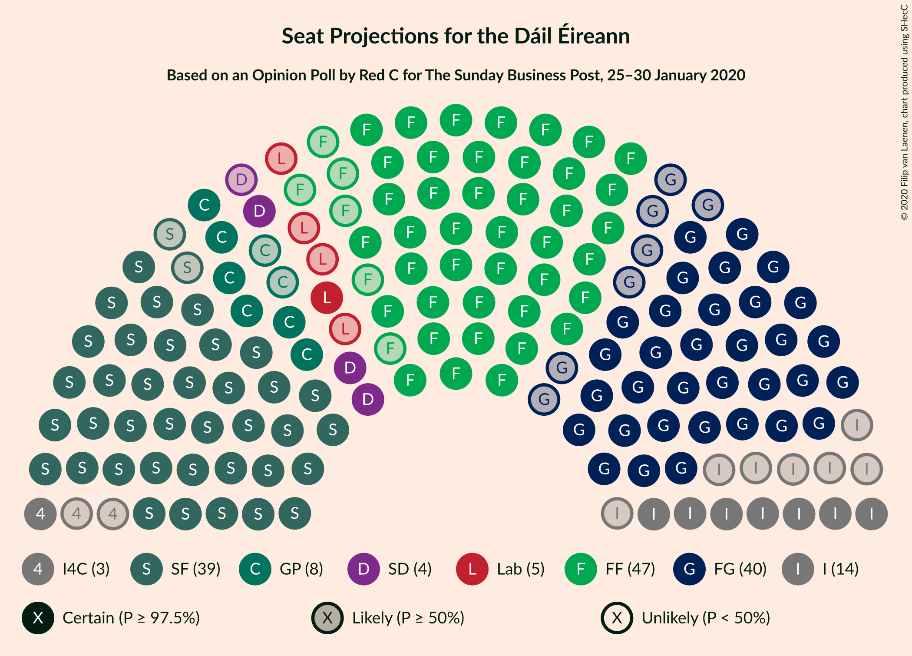
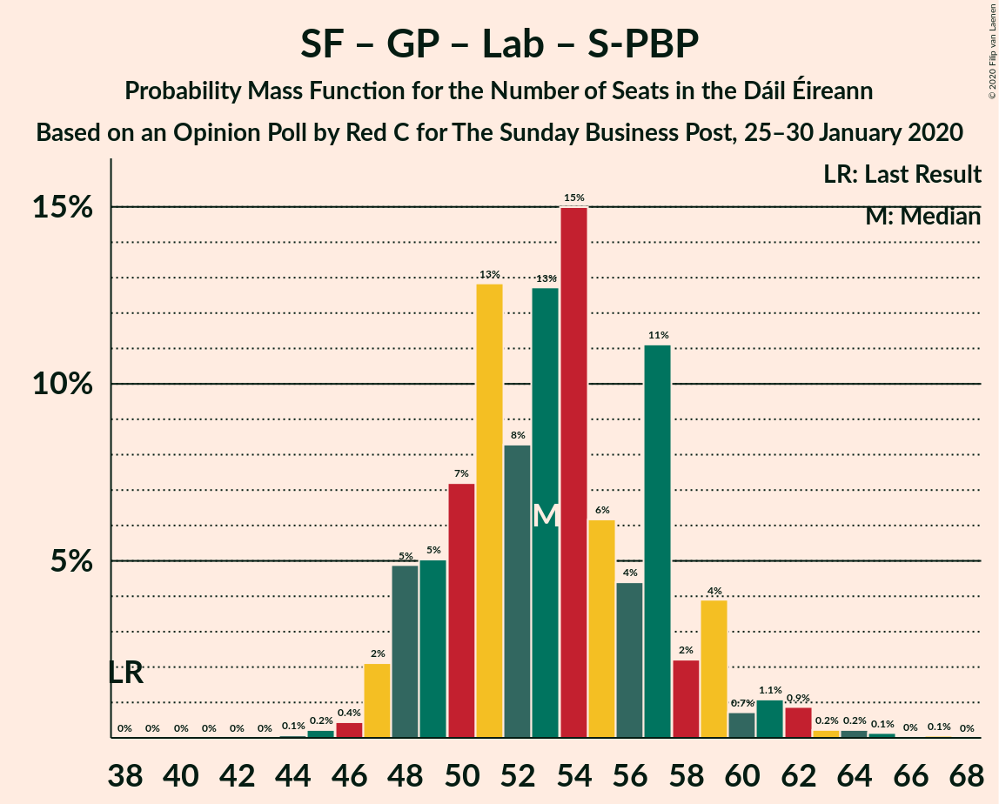

# Opinion Poll by Red C for The Sunday Business Post, 25–30 January 2020

<a href="#voting-intentions">Voting Intentions</a> | <a href="#seats">Seats</a> | <a href="#coalitions">Coalitions</a> | <a href="#technical-information">Technical Information</a>

## Voting Intentions

### Confidence Intervals

| Party | Last Result | Poll Result | 80% Confidence Interval | 90% Confidence Interval | 95% Confidence Interval | 99% Confidence Interval |
|:-----:|:-----------:|:-----------:|:-----------------------:|:-----------------------:|:-----------------------:|:-----------------------:|
| Fianna Fáil | 24.3% | 24.5% | 22.8–26.3% |22.3–26.8% |21.9–27.3% |21.1–28.2% |
| Sinn Féin | 13.8% | 24.5% | 22.8–26.3% |22.3–26.8% |21.9–27.3% |21.1–28.2% |
| Fine Gael | 25.5% | 21.4% | 19.8–23.1% |19.4–23.6% |19.0–24.1% |18.2–24.9% |
| Independent | 15.9% | 11.2% | 10.0–12.6% |9.7–13.0% |9.4–13.3% |8.8–14.0% |
| Green Party/Comhaontas Glas | 2.7% | 7.1% | 6.2–8.3% |5.9–8.6% |5.7–8.9% |5.2–9.4% |
| Labour Party | 6.6% | 5.1% | 4.3–6.1% |4.1–6.4% |3.9–6.6% |3.6–7.2% |
| Social Democrats | 3.0% | 3.1% | 2.5–3.9% |2.3–4.2% |2.2–4.4% |1.9–4.8% |
| Independents 4 Change | 1.5% | 1.4% | 1.0–2.0% |0.9–2.2% |0.8–2.3% |0.7–2.7% |
| Solidarity–People Before Profit | 3.9% | 1.0% | 0.7–1.5% |0.6–1.7% |0.5–1.8% |0.4–2.1% |

*Note:* The poll result column reflects the actual value used in the calculations. Published results may vary slightly, and in addition be rounded to fewer digits.

## Seats

### Confidence Intervals

| Party | Last Result | Median | 80% Confidence Interval | 90% Confidence Interval | 95% Confidence Interval | 99% Confidence Interval |
|:-----:|:-----------:|:------:|:-----------------------:|:-----------------------:|:-----------------------:|:-----------------------:|
| <a href="#fianna-fáil">Fianna Fáil</a> | 44 | 47 | 43–51 |42–52 |41–53 |38–55 |
| <a href="#sinn-féin">Sinn Féin</a> | 23 | 39 | 38–42 |37–42 |37–42 |36–42 |
| <a href="#fine-gael">Fine Gael</a> | 49 | 40 | 35–43 |34–43 |33–45 |31–48 |
| <a href="#independent">Independent</a> | 19 | 14 | 10–17 |8–17 |7–18 |6–19 |
| <a href="#green-party/comhaontas-glas">Green Party/Comhaontas Glas</a> | 2 | 8 | 7–11 |6–12 |6–12 |4–15 |
| <a href="#labour-party">Labour Party</a> | 7 | 5 | 2–8 |1–11 |1–12 |1–15 |
| <a href="#social-democrats">Social Democrats</a> | 3 | 4 | 3–6 |3–7 |3–8 |3–9 |
| <a href="#independents-4-change">Independents 4 Change</a> | 4 | 3 | 3 |2–4 |1–4 |1–4 |
| <a href="#solidarity–people-before-profit">Solidarity–People Before Profit</a> | 6 | 0 | 0 |0–1 |0–1 |0–1 |

### Fianna Fáil

*For a full overview of the results for this party, see the [Fianna Fáil](party-fiannafáil.html) page.*

| Number of Seats | Probability | Accumulated | Special Marks |
|:---------------:|:-----------:|:-----------:|:-------------:|
| 35 | 0.1% | 100% |  |
| 36 | 0.1% | 99.9% |  |
| 37 | 0.1% | 99.8% |  |
| 38 | 0.4% | 99.7% |  |
| 39 | 0.7% | 99.3% |  |
| 40 | 0.9% | 98.6% |  |
| 41 | 2% | 98% |  |
| 42 | 5% | 96% |  |
| 43 | 9% | 91% |  |
| 44 | 7% | 82% | Last Result |
| 45 | 12% | 75% |  |
| 46 | 10% | 63% |  |
| 47 | 14% | 53% | Median |
| 48 | 12% | 39% |  |
| 49 | 8% | 27% |  |
| 50 | 6% | 19% |  |
| 51 | 7% | 13% |  |
| 52 | 4% | 6% |  |
| 53 | 1.2% | 3% |  |
| 54 | 0.9% | 1.4% |  |
| 55 | 0.3% | 0.6% |  |
| 56 | 0.2% | 0.2% |  |
| 57 | 0.1% | 0.1% |  |
| 58 | 0% | 0% |  |

### Sinn Féin

*For a full overview of the results for this party, see the [Sinn Féin](party-sinnféin.html) page.*

| Number of Seats | Probability | Accumulated | Special Marks |
|:---------------:|:-----------:|:-----------:|:-------------:|
| 23 | 0% | 100% | Last Result |
| 24 | 0% | 100% |  |
| 25 | 0% | 100% |  |
| 26 | 0% | 100% |  |
| 27 | 0% | 100% |  |
| 28 | 0% | 100% |  |
| 29 | 0% | 100% |  |
| 30 | 0% | 100% |  |
| 31 | 0% | 100% |  |
| 32 | 0% | 100% |  |
| 33 | 0% | 100% |  |
| 34 | 0% | 100% |  |
| 35 | 0.4% | 100% |  |
| 36 | 2% | 99.6% |  |
| 37 | 3% | 98% |  |
| 38 | 44% | 95% |  |
| 39 | 18% | 51% | Median |
| 40 | 13% | 33% |  |
| 41 | 7% | 19% |  |
| 42 | 12% | 12% |  |
| 43 | 0% | 0% |  |

### Fine Gael

*For a full overview of the results for this party, see the [Fine Gael](party-finegael.html) page.*

| Number of Seats | Probability | Accumulated | Special Marks |
|:---------------:|:-----------:|:-----------:|:-------------:|
| 27 | 0% | 100% |  |
| 28 | 0% | 99.9% |  |
| 29 | 0.1% | 99.9% |  |
| 30 | 0.2% | 99.8% |  |
| 31 | 0.5% | 99.6% |  |
| 32 | 0.8% | 99.1% |  |
| 33 | 1.2% | 98% |  |
| 34 | 3% | 97% |  |
| 35 | 6% | 94% |  |
| 36 | 5% | 89% |  |
| 37 | 7% | 83% |  |
| 38 | 14% | 76% |  |
| 39 | 9% | 62% |  |
| 40 | 15% | 53% | Median |
| 41 | 15% | 37% |  |
| 42 | 11% | 22% |  |
| 43 | 7% | 11% |  |
| 44 | 1.4% | 4% |  |
| 45 | 0.6% | 3% |  |
| 46 | 0.9% | 2% |  |
| 47 | 0.4% | 1.0% |  |
| 48 | 0.3% | 0.6% |  |
| 49 | 0.2% | 0.3% | Last Result |
| 50 | 0% | 0.2% |  |
| 51 | 0.1% | 0.1% |  |
| 52 | 0% | 0.1% |  |
| 53 | 0% | 0% |  |

### Independent

*For a full overview of the results for this party, see the [Independent](party-independent.html) page.*

| Number of Seats | Probability | Accumulated | Special Marks |
|:---------------:|:-----------:|:-----------:|:-------------:|
| 4 | 0% | 100% |  |
| 5 | 0.3% | 99.9% |  |
| 6 | 0.7% | 99.7% |  |
| 7 | 2% | 99.0% |  |
| 8 | 4% | 97% |  |
| 9 | 3% | 93% |  |
| 10 | 5% | 90% |  |
| 11 | 4% | 85% |  |
| 12 | 13% | 81% |  |
| 13 | 14% | 68% |  |
| 14 | 7% | 53% | Median |
| 15 | 17% | 46% |  |
| 16 | 17% | 29% |  |
| 17 | 8% | 13% |  |
| 18 | 4% | 5% |  |
| 19 | 1.0% | 1.1% | Last Result |
| 20 | 0% | 0% |  |

### Green Party/Comhaontas Glas

*For a full overview of the results for this party, see the [Green Party/Comhaontas Glas](party-greenpartycomhaontasglas.html) page.*

| Number of Seats | Probability | Accumulated | Special Marks |
|:---------------:|:-----------:|:-----------:|:-------------:|
| 2 | 0% | 100% | Last Result |
| 3 | 0.2% | 100% |  |
| 4 | 0.5% | 99.8% |  |
| 5 | 0.9% | 99.4% |  |
| 6 | 4% | 98% |  |
| 7 | 30% | 95% |  |
| 8 | 28% | 64% | Median |
| 9 | 8% | 36% |  |
| 10 | 11% | 28% |  |
| 11 | 11% | 17% |  |
| 12 | 4% | 6% |  |
| 13 | 1.2% | 2% |  |
| 14 | 0.4% | 1.0% |  |
| 15 | 0.2% | 0.6% |  |
| 16 | 0.2% | 0.4% |  |
| 17 | 0.1% | 0.2% |  |
| 18 | 0.1% | 0.2% |  |
| 19 | 0% | 0% |  |

### Labour Party

*For a full overview of the results for this party, see the [Labour Party](party-labourparty.html) page.*

| Number of Seats | Probability | Accumulated | Special Marks |
|:---------------:|:-----------:|:-----------:|:-------------:|
| 0 | 0.1% | 100% |  |
| 1 | 6% | 99.9% |  |
| 2 | 5% | 94% |  |
| 3 | 7% | 89% |  |
| 4 | 7% | 81% |  |
| 5 | 25% | 74% | Median |
| 6 | 16% | 49% |  |
| 7 | 16% | 32% | Last Result |
| 8 | 8% | 17% |  |
| 9 | 1.1% | 9% |  |
| 10 | 3% | 8% |  |
| 11 | 0.8% | 5% |  |
| 12 | 2% | 4% |  |
| 13 | 1.0% | 2% |  |
| 14 | 0.5% | 1.3% |  |
| 15 | 0.4% | 0.8% |  |
| 16 | 0.3% | 0.4% |  |
| 17 | 0.1% | 0.1% |  |
| 18 | 0% | 0% |  |

### Social Democrats

*For a full overview of the results for this party, see the [Social Democrats](party-socialdemocrats.html) page.*

| Number of Seats | Probability | Accumulated | Special Marks |
|:---------------:|:-----------:|:-----------:|:-------------:|
| 2 | 0.1% | 100% |  |
| 3 | 45% | 99.9% | Last Result |
| 4 | 34% | 55% | Median |
| 5 | 7% | 21% |  |
| 6 | 6% | 14% |  |
| 7 | 3% | 8% |  |
| 8 | 3% | 5% |  |
| 9 | 2% | 2% |  |
| 10 | 0% | 0% |  |

### Independents 4 Change

*For a full overview of the results for this party, see the [Independents 4 Change](party-independents4change.html) page.*

| Number of Seats | Probability | Accumulated | Special Marks |
|:---------------:|:-----------:|:-----------:|:-------------:|
| 0 | 0.4% | 100% |  |
| 1 | 4% | 99.6% |  |
| 2 | 5% | 96% |  |
| 3 | 82% | 91% | Median |
| 4 | 9% | 9% | Last Result |
| 5 | 0% | 0% |  |

### Solidarity–People Before Profit

*For a full overview of the results for this party, see the [Solidarity–People Before Profit](party-solidarity–peoplebeforeprofit.html) page.*

| Number of Seats | Probability | Accumulated | Special Marks |
|:---------------:|:-----------:|:-----------:|:-------------:|
| 0 | 93% | 100% | Median |
| 1 | 7% | 7% |  |
| 2 | 0% | 0.1% |  |
| 3 | 0% | 0% |  |
| 4 | 0% | 0% |  |
| 5 | 0% | 0% |  |
| 6 | 0% | 0% | Last Result |

## Coalitions

### Confidence Intervals

| Coalition | Last Result | Median | Majority? | 80% Confidence Interval | 90% Confidence Interval | 95% Confidence Interval | 99% Confidence Interval |
|:---------:|:-----------:|:------:|:---------:|:-----------------------:|:-----------------------:|:-----------------------:|:-----------------------:|
| Fianna Fáil – Fine Gael | 93 | 85 | 93% | 81–91 | 80–93 | 79–94 | 76–97 |
| Fianna Fáil – Sinn Féin | 67 | 86 | 92% | 81–90 | 80–92 | 79–93 | 77–94 |
| Fianna Fáil – Green Party/Comhaontas Glas – Labour Party – Social Democrats | 56 | 65 | 0% | 61–69 | 60–71 | 58–72 | 55–75 |
| Fianna Fáil – Green Party/Comhaontas Glas – Labour Party | 53 | 61 | 0% | 56–65 | 55–66 | 54–68 | 50–71 |
| Sinn Féin – Green Party/Comhaontas Glas – Labour Party – Social Democrats | 35 | 57 | 0% | 53–61 | 52–62 | 51–64 | 50–67 |
| Sinn Féin – Green Party/Comhaontas Glas – Labour Party – Social Democrats – Solidarity–People Before Profit | 41 | 57 | 0% | 53–61 | 52–63 | 51–64 | 50–67 |
| Fine Gael – Green Party/Comhaontas Glas – Labour Party – Social Democrats | 61 | 57 | 0% | 54–61 | 53–62 | 52–63 | 50–66 |
| Fianna Fáil – Green Party/Comhaontas Glas | 46 | 55 | 0% | 51–60 | 50–61 | 49–63 | 46–65 |
| Sinn Féin – Green Party/Comhaontas Glas – Labour Party | 32 | 53 | 0% | 49–57 | 48–59 | 47–61 | 46–63 |
| Sinn Féin – Green Party/Comhaontas Glas – Labour Party – Solidarity–People Before Profit | 38 | 53 | 0% | 49–57 | 48–59 | 47–61 | 46–63 |
| Fine Gael – Green Party/Comhaontas Glas – Labour Party | 58 | 54 | 0% | 50–57 | 49–58 | 48–59 | 46–62 |
| Fianna Fáil – Labour Party | 51 | 52 | 0% | 48–57 | 47–58 | 46–59 | 42–62 |
| Fine Gael – Green Party/Comhaontas Glas | 51 | 48 | 0% | 44–51 | 42–51 | 42–54 | 41–56 |
| Fine Gael – Labour Party | 56 | 45 | 0% | 41–49 | 39–50 | 38–51 | 36–54 |
| Fine Gael | 49 | 40 | 0% | 35–43 | 34–43 | 33–45 | 31–48 |

### Fianna Fáil – Fine Gael

| Number of Seats | Probability | Accumulated | Special Marks |
|:---------------:|:-----------:|:-----------:|:-------------:|
| 73 | 0.1% | 100% |  |
| 74 | 0.1% | 99.9% |  |
| 75 | 0.1% | 99.8% |  |
| 76 | 0.3% | 99.6% |  |
| 77 | 1.0% | 99.3% |  |
| 78 | 0.7% | 98% |  |
| 79 | 1.4% | 98% |  |
| 80 | 3% | 96% |  |
| 81 | 4% | 93% | Majority |
| 82 | 5% | 89% |  |
| 83 | 6% | 84% |  |
| 84 | 8% | 77% |  |
| 85 | 22% | 70% |  |
| 86 | 6% | 48% |  |
| 87 | 10% | 41% | Median |
| 88 | 10% | 31% |  |
| 89 | 4% | 21% |  |
| 90 | 3% | 17% |  |
| 91 | 5% | 14% |  |
| 92 | 3% | 9% |  |
| 93 | 3% | 6% | Last Result |
| 94 | 0.7% | 3% |  |
| 95 | 1.2% | 2% |  |
| 96 | 0.2% | 0.9% |  |
| 97 | 0.4% | 0.7% |  |
| 98 | 0.2% | 0.2% |  |
| 99 | 0% | 0.1% |  |
| 100 | 0% | 0% |  |

### Fianna Fáil – Sinn Féin

| Number of Seats | Probability | Accumulated | Special Marks |
|:---------------:|:-----------:|:-----------:|:-------------:|
| 67 | 0% | 100% | Last Result |
| 68 | 0% | 100% |  |
| 69 | 0% | 100% |  |
| 70 | 0% | 100% |  |
| 71 | 0% | 100% |  |
| 72 | 0% | 100% |  |
| 73 | 0.1% | 100% |  |
| 74 | 0% | 99.9% |  |
| 75 | 0.1% | 99.9% |  |
| 76 | 0.2% | 99.7% |  |
| 77 | 0.6% | 99.6% |  |
| 78 | 0.8% | 99.0% |  |
| 79 | 1.0% | 98% |  |
| 80 | 5% | 97% |  |
| 81 | 7% | 92% | Majority |
| 82 | 4% | 85% |  |
| 83 | 9% | 82% |  |
| 84 | 9% | 73% |  |
| 85 | 12% | 64% |  |
| 86 | 10% | 52% | Median |
| 87 | 11% | 42% |  |
| 88 | 8% | 31% |  |
| 89 | 10% | 23% |  |
| 90 | 4% | 13% |  |
| 91 | 2% | 9% |  |
| 92 | 4% | 7% |  |
| 93 | 2% | 4% |  |
| 94 | 1.3% | 2% |  |
| 95 | 0.3% | 0.4% |  |
| 96 | 0.1% | 0.1% |  |
| 97 | 0% | 0% |  |

### Fianna Fáil – Green Party/Comhaontas Glas – Labour Party – Social Democrats

| Number of Seats | Probability | Accumulated | Special Marks |
|:---------------:|:-----------:|:-----------:|:-------------:|
| 50 | 0% | 100% |  |
| 51 | 0% | 99.9% |  |
| 52 | 0% | 99.9% |  |
| 53 | 0% | 99.9% |  |
| 54 | 0.1% | 99.9% |  |
| 55 | 0.6% | 99.8% |  |
| 56 | 0.2% | 99.2% | Last Result |
| 57 | 0.7% | 99.0% |  |
| 58 | 0.9% | 98% |  |
| 59 | 2% | 97% |  |
| 60 | 5% | 95% |  |
| 61 | 9% | 90% |  |
| 62 | 5% | 81% |  |
| 63 | 11% | 76% |  |
| 64 | 7% | 65% | Median |
| 65 | 15% | 58% |  |
| 66 | 17% | 44% |  |
| 67 | 6% | 27% |  |
| 68 | 9% | 21% |  |
| 69 | 4% | 13% |  |
| 70 | 3% | 8% |  |
| 71 | 2% | 5% |  |
| 72 | 1.0% | 3% |  |
| 73 | 1.1% | 2% |  |
| 74 | 0.3% | 1.1% |  |
| 75 | 0.4% | 0.8% |  |
| 76 | 0.3% | 0.5% |  |
| 77 | 0.1% | 0.2% |  |
| 78 | 0% | 0.1% |  |
| 79 | 0% | 0% |  |

### Fianna Fáil – Green Party/Comhaontas Glas – Labour Party

| Number of Seats | Probability | Accumulated | Special Marks |
|:---------------:|:-----------:|:-----------:|:-------------:|
| 47 | 0.1% | 100% |  |
| 48 | 0% | 99.9% |  |
| 49 | 0.1% | 99.9% |  |
| 50 | 0.3% | 99.8% |  |
| 51 | 0.1% | 99.5% |  |
| 52 | 0.4% | 99.3% |  |
| 53 | 0.8% | 98.9% | Last Result |
| 54 | 0.9% | 98% |  |
| 55 | 2% | 97% |  |
| 56 | 9% | 95% |  |
| 57 | 7% | 86% |  |
| 58 | 6% | 80% |  |
| 59 | 3% | 73% |  |
| 60 | 14% | 70% | Median |
| 61 | 14% | 56% |  |
| 62 | 12% | 43% |  |
| 63 | 11% | 31% |  |
| 64 | 6% | 19% |  |
| 65 | 5% | 14% |  |
| 66 | 4% | 9% |  |
| 67 | 1.4% | 5% |  |
| 68 | 2% | 3% |  |
| 69 | 0.4% | 2% |  |
| 70 | 0.5% | 1.2% |  |
| 71 | 0.2% | 0.7% |  |
| 72 | 0.2% | 0.5% |  |
| 73 | 0.2% | 0.3% |  |
| 74 | 0% | 0.1% |  |
| 75 | 0% | 0.1% |  |
| 76 | 0% | 0% |  |

### Sinn Féin – Green Party/Comhaontas Glas – Labour Party – Social Democrats

| Number of Seats | Probability | Accumulated | Special Marks |
|:---------------:|:-----------:|:-----------:|:-------------:|
| 35 | 0% | 100% | Last Result |
| 36 | 0% | 100% |  |
| 37 | 0% | 100% |  |
| 38 | 0% | 100% |  |
| 39 | 0% | 100% |  |
| 40 | 0% | 100% |  |
| 41 | 0% | 100% |  |
| 42 | 0% | 100% |  |
| 43 | 0% | 100% |  |
| 44 | 0% | 100% |  |
| 45 | 0% | 100% |  |
| 46 | 0% | 100% |  |
| 47 | 0% | 100% |  |
| 48 | 0.1% | 100% |  |
| 49 | 0.2% | 99.8% |  |
| 50 | 0.6% | 99.6% |  |
| 51 | 3% | 99.0% |  |
| 52 | 5% | 96% |  |
| 53 | 6% | 92% |  |
| 54 | 6% | 86% |  |
| 55 | 6% | 80% |  |
| 56 | 13% | 74% | Median |
| 57 | 20% | 61% |  |
| 58 | 7% | 40% |  |
| 59 | 6% | 33% |  |
| 60 | 9% | 27% |  |
| 61 | 10% | 19% |  |
| 62 | 4% | 9% |  |
| 63 | 1.0% | 5% |  |
| 64 | 1.5% | 4% |  |
| 65 | 1.2% | 2% |  |
| 66 | 0.3% | 1.0% |  |
| 67 | 0.3% | 0.7% |  |
| 68 | 0.3% | 0.5% |  |
| 69 | 0.1% | 0.2% |  |
| 70 | 0.1% | 0.2% |  |
| 71 | 0% | 0% |  |

### Sinn Féin – Green Party/Comhaontas Glas – Labour Party – Social Democrats – Solidarity–People Before Profit

| Number of Seats | Probability | Accumulated | Special Marks |
|:---------------:|:-----------:|:-----------:|:-------------:|
| 41 | 0% | 100% | Last Result |
| 42 | 0% | 100% |  |
| 43 | 0% | 100% |  |
| 44 | 0% | 100% |  |
| 45 | 0% | 100% |  |
| 46 | 0% | 100% |  |
| 47 | 0% | 100% |  |
| 48 | 0.1% | 100% |  |
| 49 | 0.3% | 99.9% |  |
| 50 | 0.6% | 99.6% |  |
| 51 | 2% | 99.0% |  |
| 52 | 5% | 97% |  |
| 53 | 6% | 92% |  |
| 54 | 6% | 86% |  |
| 55 | 6% | 80% |  |
| 56 | 13% | 74% | Median |
| 57 | 20% | 61% |  |
| 58 | 8% | 42% |  |
| 59 | 6% | 34% |  |
| 60 | 9% | 28% |  |
| 61 | 9% | 19% |  |
| 62 | 4% | 9% |  |
| 63 | 1.3% | 5% |  |
| 64 | 1.5% | 4% |  |
| 65 | 1.2% | 2% |  |
| 66 | 0.3% | 1.1% |  |
| 67 | 0.3% | 0.7% |  |
| 68 | 0.3% | 0.5% |  |
| 69 | 0.1% | 0.2% |  |
| 70 | 0.1% | 0.2% |  |
| 71 | 0% | 0% |  |

### Fine Gael – Green Party/Comhaontas Glas – Labour Party – Social Democrats

| Number of Seats | Probability | Accumulated | Special Marks |
|:---------------:|:-----------:|:-----------:|:-------------:|
| 48 | 0.1% | 100% |  |
| 49 | 0.2% | 99.9% |  |
| 50 | 0.3% | 99.7% |  |
| 51 | 0.9% | 99.4% |  |
| 52 | 3% | 98% |  |
| 53 | 4% | 96% |  |
| 54 | 8% | 92% |  |
| 55 | 5% | 83% |  |
| 56 | 9% | 79% |  |
| 57 | 22% | 69% | Median |
| 58 | 11% | 47% |  |
| 59 | 9% | 36% |  |
| 60 | 16% | 27% |  |
| 61 | 4% | 12% | Last Result |
| 62 | 3% | 7% |  |
| 63 | 2% | 4% |  |
| 64 | 0.5% | 2% |  |
| 65 | 0.5% | 1.2% |  |
| 66 | 0.3% | 0.7% |  |
| 67 | 0.1% | 0.3% |  |
| 68 | 0.1% | 0.3% |  |
| 69 | 0.1% | 0.1% |  |
| 70 | 0% | 0.1% |  |
| 71 | 0% | 0% |  |

### Fianna Fáil – Green Party/Comhaontas Glas

| Number of Seats | Probability | Accumulated | Special Marks |
|:---------------:|:-----------:|:-----------:|:-------------:|
| 42 | 0% | 100% |  |
| 43 | 0% | 99.9% |  |
| 44 | 0% | 99.9% |  |
| 45 | 0.2% | 99.9% |  |
| 46 | 0.4% | 99.7% | Last Result |
| 47 | 0.6% | 99.3% |  |
| 48 | 0.9% | 98.7% |  |
| 49 | 2% | 98% |  |
| 50 | 5% | 95% |  |
| 51 | 8% | 91% |  |
| 52 | 4% | 82% |  |
| 53 | 12% | 78% |  |
| 54 | 11% | 66% |  |
| 55 | 10% | 55% | Median |
| 56 | 10% | 45% |  |
| 57 | 7% | 35% |  |
| 58 | 12% | 28% |  |
| 59 | 5% | 15% |  |
| 60 | 2% | 10% |  |
| 61 | 5% | 9% |  |
| 62 | 0.8% | 4% |  |
| 63 | 1.4% | 3% |  |
| 64 | 0.4% | 1.3% |  |
| 65 | 0.6% | 0.8% |  |
| 66 | 0.1% | 0.2% |  |
| 67 | 0.1% | 0.1% |  |
| 68 | 0% | 0.1% |  |
| 69 | 0% | 0% |  |

### Sinn Féin – Green Party/Comhaontas Glas – Labour Party

| Number of Seats | Probability | Accumulated | Special Marks |
|:---------------:|:-----------:|:-----------:|:-------------:|
| 32 | 0% | 100% | Last Result |
| 33 | 0% | 100% |  |
| 34 | 0% | 100% |  |
| 35 | 0% | 100% |  |
| 36 | 0% | 100% |  |
| 37 | 0% | 100% |  |
| 38 | 0% | 100% |  |
| 39 | 0% | 100% |  |
| 40 | 0% | 100% |  |
| 41 | 0% | 100% |  |
| 42 | 0% | 100% |  |
| 43 | 0% | 100% |  |
| 44 | 0.1% | 100% |  |
| 45 | 0.3% | 99.9% |  |
| 46 | 0.4% | 99.7% |  |
| 47 | 2% | 99.2% |  |
| 48 | 5% | 97% |  |
| 49 | 5% | 92% |  |
| 50 | 7% | 87% |  |
| 51 | 13% | 80% |  |
| 52 | 9% | 67% | Median |
| 53 | 13% | 58% |  |
| 54 | 15% | 45% |  |
| 55 | 6% | 30% |  |
| 56 | 5% | 24% |  |
| 57 | 10% | 20% |  |
| 58 | 3% | 9% |  |
| 59 | 3% | 7% |  |
| 60 | 0.6% | 3% |  |
| 61 | 1.1% | 3% |  |
| 62 | 0.9% | 2% |  |
| 63 | 0.2% | 0.7% |  |
| 64 | 0.2% | 0.5% |  |
| 65 | 0.1% | 0.3% |  |
| 66 | 0% | 0.1% |  |
| 67 | 0.1% | 0.1% |  |
| 68 | 0% | 0% |  |

### Sinn Féin – Green Party/Comhaontas Glas – Labour Party – Solidarity–People Before Profit

| Number of Seats | Probability | Accumulated | Special Marks |
|:---------------:|:-----------:|:-----------:|:-------------:|
| 38 | 0% | 100% | Last Result |
| 39 | 0% | 100% |  |
| 40 | 0% | 100% |  |
| 41 | 0% | 100% |  |
| 42 | 0% | 100% |  |
| 43 | 0% | 100% |  |
| 44 | 0.1% | 100% |  |
| 45 | 0.2% | 99.9% |  |
| 46 | 0.4% | 99.7% |  |
| 47 | 2% | 99.3% |  |
| 48 | 5% | 97% |  |
| 49 | 5% | 92% |  |
| 50 | 7% | 87% |  |
| 51 | 13% | 80% |  |
| 52 | 8% | 67% | Median |
| 53 | 13% | 59% |  |
| 54 | 15% | 46% |  |
| 55 | 6% | 31% |  |
| 56 | 4% | 25% |  |
| 57 | 11% | 21% |  |
| 58 | 2% | 10% |  |
| 59 | 4% | 7% |  |
| 60 | 0.7% | 3% |  |
| 61 | 1.1% | 3% |  |
| 62 | 0.9% | 2% |  |
| 63 | 0.2% | 0.7% |  |
| 64 | 0.2% | 0.5% |  |
| 65 | 0.1% | 0.3% |  |
| 66 | 0% | 0.1% |  |
| 67 | 0.1% | 0.1% |  |
| 68 | 0% | 0% |  |

### Fine Gael – Green Party/Comhaontas Glas – Labour Party

| Number of Seats | Probability | Accumulated | Special Marks |
|:---------------:|:-----------:|:-----------:|:-------------:|
| 43 | 0% | 100% |  |
| 44 | 0.1% | 99.9% |  |
| 45 | 0.3% | 99.9% |  |
| 46 | 0.4% | 99.5% |  |
| 47 | 1.2% | 99.2% |  |
| 48 | 2% | 98% |  |
| 49 | 5% | 96% |  |
| 50 | 10% | 91% |  |
| 51 | 6% | 81% |  |
| 52 | 9% | 75% |  |
| 53 | 13% | 66% | Median |
| 54 | 15% | 53% |  |
| 55 | 14% | 38% |  |
| 56 | 12% | 24% |  |
| 57 | 3% | 11% |  |
| 58 | 3% | 8% | Last Result |
| 59 | 3% | 5% |  |
| 60 | 0.8% | 2% |  |
| 61 | 0.5% | 1.2% |  |
| 62 | 0.2% | 0.7% |  |
| 63 | 0.2% | 0.5% |  |
| 64 | 0.2% | 0.2% |  |
| 65 | 0% | 0.1% |  |
| 66 | 0% | 0.1% |  |
| 67 | 0% | 0% |  |

### Fianna Fáil – Labour Party

| Number of Seats | Probability | Accumulated | Special Marks |
|:---------------:|:-----------:|:-----------:|:-------------:|
| 38 | 0.1% | 100% |  |
| 39 | 0% | 99.9% |  |
| 40 | 0.1% | 99.9% |  |
| 41 | 0.1% | 99.8% |  |
| 42 | 0.3% | 99.7% |  |
| 43 | 0.3% | 99.4% |  |
| 44 | 0.4% | 99.1% |  |
| 45 | 0.9% | 98.7% |  |
| 46 | 2% | 98% |  |
| 47 | 3% | 96% |  |
| 48 | 7% | 92% |  |
| 49 | 5% | 85% |  |
| 50 | 10% | 81% |  |
| 51 | 3% | 71% | Last Result |
| 52 | 18% | 68% | Median |
| 53 | 18% | 50% |  |
| 54 | 9% | 32% |  |
| 55 | 7% | 23% |  |
| 56 | 4% | 16% |  |
| 57 | 5% | 12% |  |
| 58 | 4% | 7% |  |
| 59 | 1.2% | 3% |  |
| 60 | 0.6% | 2% |  |
| 61 | 0.3% | 1.0% |  |
| 62 | 0.4% | 0.7% |  |
| 63 | 0.2% | 0.3% |  |
| 64 | 0% | 0.1% |  |
| 65 | 0.1% | 0.1% |  |
| 66 | 0% | 0% |  |

### Fine Gael – Green Party/Comhaontas Glas

| Number of Seats | Probability | Accumulated | Special Marks |
|:---------------:|:-----------:|:-----------:|:-------------:|
| 38 | 0% | 100% |  |
| 39 | 0.1% | 99.9% |  |
| 40 | 0.3% | 99.8% |  |
| 41 | 1.1% | 99.5% |  |
| 42 | 4% | 98% |  |
| 43 | 1.5% | 95% |  |
| 44 | 7% | 93% |  |
| 45 | 6% | 86% |  |
| 46 | 10% | 81% |  |
| 47 | 9% | 71% |  |
| 48 | 16% | 62% | Median |
| 49 | 23% | 46% |  |
| 50 | 11% | 23% |  |
| 51 | 8% | 12% | Last Result |
| 52 | 1.0% | 5% |  |
| 53 | 1.3% | 4% |  |
| 54 | 1.3% | 3% |  |
| 55 | 0.3% | 1.3% |  |
| 56 | 0.6% | 1.0% |  |
| 57 | 0.1% | 0.4% |  |
| 58 | 0.1% | 0.3% |  |
| 59 | 0.1% | 0.2% |  |
| 60 | 0% | 0.1% |  |
| 61 | 0.1% | 0.1% |  |
| 62 | 0% | 0% |  |

### Fine Gael – Labour Party

| Number of Seats | Probability | Accumulated | Special Marks |
|:---------------:|:-----------:|:-----------:|:-------------:|
| 32 | 0% | 100% |  |
| 33 | 0% | 99.9% |  |
| 34 | 0.1% | 99.9% |  |
| 35 | 0.2% | 99.8% |  |
| 36 | 0.2% | 99.6% |  |
| 37 | 0.9% | 99.4% |  |
| 38 | 1.1% | 98.5% |  |
| 39 | 3% | 97% |  |
| 40 | 3% | 95% |  |
| 41 | 6% | 91% |  |
| 42 | 8% | 85% |  |
| 43 | 15% | 77% |  |
| 44 | 6% | 62% |  |
| 45 | 8% | 56% | Median |
| 46 | 8% | 48% |  |
| 47 | 20% | 40% |  |
| 48 | 9% | 21% |  |
| 49 | 5% | 12% |  |
| 50 | 3% | 7% |  |
| 51 | 2% | 4% |  |
| 52 | 0.6% | 2% |  |
| 53 | 0.3% | 1.3% |  |
| 54 | 0.6% | 1.0% |  |
| 55 | 0.2% | 0.5% |  |
| 56 | 0.1% | 0.2% | Last Result |
| 57 | 0.1% | 0.2% |  |
| 58 | 0% | 0.1% |  |
| 59 | 0% | 0.1% |  |
| 60 | 0% | 0% |  |

### Fine Gael

| Number of Seats | Probability | Accumulated | Special Marks |
|:---------------:|:-----------:|:-----------:|:-------------:|
| 27 | 0% | 100% |  |
| 28 | 0% | 99.9% |  |
| 29 | 0.1% | 99.9% |  |
| 30 | 0.2% | 99.8% |  |
| 31 | 0.5% | 99.6% |  |
| 32 | 0.8% | 99.1% |  |
| 33 | 1.2% | 98% |  |
| 34 | 3% | 97% |  |
| 35 | 6% | 94% |  |
| 36 | 5% | 89% |  |
| 37 | 7% | 83% |  |
| 38 | 14% | 76% |  |
| 39 | 9% | 62% |  |
| 40 | 15% | 53% | Median |
| 41 | 15% | 37% |  |
| 42 | 11% | 22% |  |
| 43 | 7% | 11% |  |
| 44 | 1.4% | 4% |  |
| 45 | 0.6% | 3% |  |
| 46 | 0.9% | 2% |  |
| 47 | 0.4% | 1.0% |  |
| 48 | 0.3% | 0.6% |  |
| 49 | 0.2% | 0.3% | Last Result |
| 50 | 0% | 0.2% |  |
| 51 | 0.1% | 0.1% |  |
| 52 | 0% | 0.1% |  |
| 53 | 0% | 0% |  |

## Technical Information

### Opinion Poll

+ **Polling firm:** Red C
+ **Commissioner(s):** The Sunday Business Post
+ **Fieldwork period:** 25–30 January 2020

### Calculations

+ **Sample size:** 1000
+ **Simulations done:** 1,048,576
+ **Error estimate:** 1.51%

