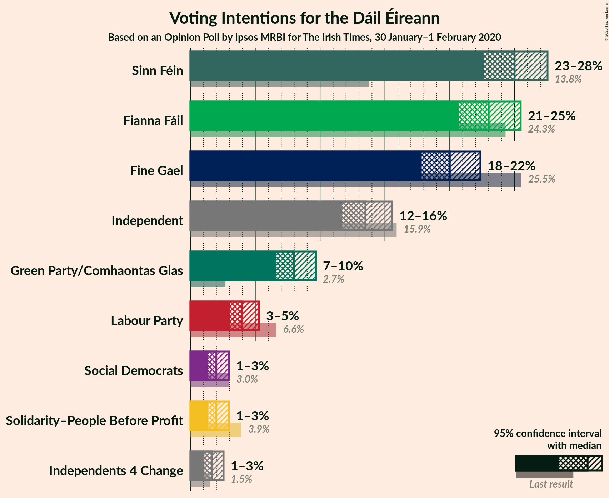
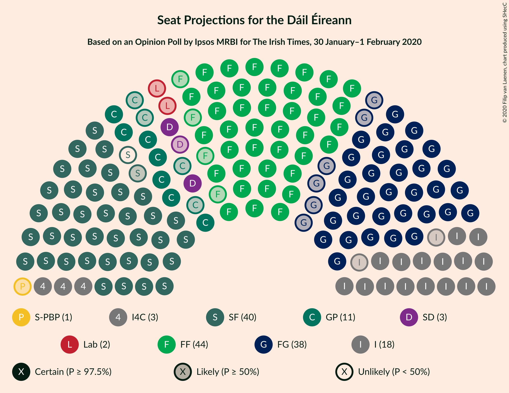

# Opinion Poll by Ipsos MRBI for The Irish Times, 30 January–1 February 2020

<a href="#voting-intentions">Voting Intentions</a> | <a href="#seats">Seats</a> | <a href="#coalitions">Coalitions</a> | <a href="#technical-information">Technical Information</a>

## Voting Intentions

### Confidence Intervals

| Party | Last Result | Poll Result | 80% Confidence Interval | 90% Confidence Interval | 95% Confidence Interval | 99% Confidence Interval |
|:-----:|:-----------:|:-----------:|:-----------------------:|:-----------------------:|:-----------------------:|:-----------------------:|
| Sinn Féin | 13.8% | 25.0% | 23.4–26.7% |23.0–27.1% |22.6–27.5% |21.9–28.3% |
| Fianna Fáil | 24.3% | 23.0% | 21.5–24.6% |21.1–25.1% |20.7–25.5% |20.0–26.3% |
| Fine Gael | 25.5% | 20.0% | 18.6–21.6% |18.2–22.0% |17.8–22.4% |17.2–23.1% |
| Independent | 15.9% | 13.5% | 12.3–14.8% |12.0–15.2% |11.7–15.6% |11.1–16.2% |
| Green Party/Comhaontas Glas | 2.7% | 8.0% | 7.1–9.1% |6.8–9.4% |6.6–9.7% |6.2–10.2% |
| Labour Party | 6.6% | 4.0% | 3.4–4.8% |3.2–5.1% |3.0–5.3% |2.7–5.7% |
| Solidarity–People Before Profit | 3.9% | 2.0% | 1.6–2.6% |1.4–2.8% |1.3–3.0% |1.2–3.3% |
| Social Democrats | 3.0% | 2.0% | 1.6–2.6% |1.4–2.8% |1.3–3.0% |1.2–3.3% |
| Independents 4 Change | 1.5% | 1.7% | 1.3–2.3% |1.2–2.4% |1.1–2.6% |0.9–2.9% |

*Note:* The poll result column reflects the actual value used in the calculations. Published results may vary slightly, and in addition be rounded to fewer digits.

## Seats

### Confidence Intervals

| Party | Last Result | Median | 80% Confidence Interval | 90% Confidence Interval | 95% Confidence Interval | 99% Confidence Interval |
|:-----:|:-----------:|:------:|:-----------------------:|:-----------------------:|:-----------------------:|:-----------------------:|
| <a href="#sinn-féin">Sinn Féin</a> | 23 | 39 | 38–40 |38–40 |38–40 |37–41 |
| <a href="#fianna-fáil">Fianna Fáil</a> | 44 | 44 | 42–47 |41–48 |40–49 |38–52 |
| <a href="#fine-gael">Fine Gael</a> | 49 | 38 | 35–40 |34–41 |32–41 |27–43 |
| <a href="#independent">Independent</a> | 19 | 18 | 17–19 |16–20 |16–21 |14–22 |
| <a href="#green-party/comhaontas-glas">Green Party/Comhaontas Glas</a> | 2 | 11 | 9–12 |8–14 |7–16 |6–18 |
| <a href="#labour-party">Labour Party</a> | 7 | 2 | 1–5 |1–6 |0–7 |0–8 |
| <a href="#solidarity–people-before-profit">Solidarity–People Before Profit</a> | 6 | 1 | 1–3 |0–3 |0–3 |0–4 |
| <a href="#social-democrats">Social Democrats</a> | 3 | 3 | 3 |2–3 |2–4 |1–4 |
| <a href="#independents-4-change">Independents 4 Change</a> | 4 | 3 | 3–4 |3–4 |3–4 |2–4 |

### Sinn Féin

*For a full overview of the results for this party, see the [Sinn Féin](party-sinnféin.html) page.*

| Number of Seats | Probability | Accumulated | Special Marks |
|:---------------:|:-----------:|:-----------:|:-------------:|
| 23 | 0% | 100% | Last Result |
| 24 | 0% | 100% |  |
| 25 | 0% | 100% |  |
| 26 | 0% | 100% |  |
| 27 | 0% | 100% |  |
| 28 | 0% | 100% |  |
| 29 | 0% | 100% |  |
| 30 | 0% | 100% |  |
| 31 | 0% | 100% |  |
| 32 | 0% | 100% |  |
| 33 | 0% | 100% |  |
| 34 | 0% | 100% |  |
| 35 | 0% | 100% |  |
| 36 | 0% | 100% |  |
| 37 | 0.5% | 100% |  |
| 38 | 26% | 99.4% |  |
| 39 | 27% | 73% | Median |
| 40 | 45% | 46% |  |
| 41 | 1.2% | 1.4% |  |
| 42 | 0.2% | 0.2% |  |
| 43 | 0% | 0% |  |

### Fianna Fáil

*For a full overview of the results for this party, see the [Fianna Fáil](party-fiannafáil.html) page.*

| Number of Seats | Probability | Accumulated | Special Marks |
|:---------------:|:-----------:|:-----------:|:-------------:|
| 35 | 0% | 100% |  |
| 36 | 0.1% | 99.9% |  |
| 37 | 0.3% | 99.8% |  |
| 38 | 0.9% | 99.6% |  |
| 39 | 0.8% | 98.7% |  |
| 40 | 1.5% | 98% |  |
| 41 | 3% | 96% |  |
| 42 | 9% | 93% |  |
| 43 | 24% | 84% |  |
| 44 | 15% | 60% | Last Result, Median |
| 45 | 15% | 45% |  |
| 46 | 14% | 31% |  |
| 47 | 7% | 16% |  |
| 48 | 5% | 9% |  |
| 49 | 2% | 4% |  |
| 50 | 0.8% | 2% |  |
| 51 | 0.8% | 2% |  |
| 52 | 0.4% | 0.7% |  |
| 53 | 0.2% | 0.3% |  |
| 54 | 0.1% | 0.1% |  |
| 55 | 0% | 0.1% |  |
| 56 | 0% | 0% |  |

### Fine Gael

*For a full overview of the results for this party, see the [Fine Gael](party-finegael.html) page.*

| Number of Seats | Probability | Accumulated | Special Marks |
|:---------------:|:-----------:|:-----------:|:-------------:|
| 25 | 0% | 100% |  |
| 26 | 0.1% | 99.9% |  |
| 27 | 0.3% | 99.8% |  |
| 28 | 0.6% | 99.5% |  |
| 29 | 0.3% | 98.8% |  |
| 30 | 0.1% | 98.6% |  |
| 31 | 0.2% | 98% |  |
| 32 | 0.8% | 98% |  |
| 33 | 0.9% | 97% |  |
| 34 | 3% | 96% |  |
| 35 | 5% | 93% |  |
| 36 | 14% | 88% |  |
| 37 | 15% | 75% |  |
| 38 | 28% | 60% | Median |
| 39 | 13% | 32% |  |
| 40 | 10% | 18% |  |
| 41 | 7% | 8% |  |
| 42 | 1.0% | 2% |  |
| 43 | 0.4% | 0.7% |  |
| 44 | 0.1% | 0.3% |  |
| 45 | 0% | 0.3% |  |
| 46 | 0.1% | 0.3% |  |
| 47 | 0% | 0.2% |  |
| 48 | 0% | 0.1% |  |
| 49 | 0.1% | 0.1% | Last Result |
| 50 | 0% | 0% |  |

### Independent

*For a full overview of the results for this party, see the [Independent](party-independent.html) page.*

| Number of Seats | Probability | Accumulated | Special Marks |
|:---------------:|:-----------:|:-----------:|:-------------:|
| 12 | 0.1% | 100% |  |
| 13 | 0.2% | 99.8% |  |
| 14 | 0.4% | 99.6% |  |
| 15 | 2% | 99.3% |  |
| 16 | 6% | 98% |  |
| 17 | 40% | 91% |  |
| 18 | 33% | 51% | Median |
| 19 | 12% | 18% | Last Result |
| 20 | 2% | 5% |  |
| 21 | 2% | 3% |  |
| 22 | 1.0% | 1.2% |  |
| 23 | 0.2% | 0.2% |  |
| 24 | 0% | 0% |  |

### Green Party/Comhaontas Glas

*For a full overview of the results for this party, see the [Green Party/Comhaontas Glas](party-greenpartycomhaontasglas.html) page.*

| Number of Seats | Probability | Accumulated | Special Marks |
|:---------------:|:-----------:|:-----------:|:-------------:|
| 2 | 0% | 100% | Last Result |
| 3 | 0% | 100% |  |
| 4 | 0% | 100% |  |
| 5 | 0% | 100% |  |
| 6 | 2% | 100% |  |
| 7 | 3% | 98% |  |
| 8 | 4% | 95% |  |
| 9 | 10% | 92% |  |
| 10 | 27% | 81% |  |
| 11 | 35% | 54% | Median |
| 12 | 9% | 19% |  |
| 13 | 3% | 10% |  |
| 14 | 2% | 7% |  |
| 15 | 1.2% | 5% |  |
| 16 | 1.3% | 3% |  |
| 17 | 0.7% | 2% |  |
| 18 | 0.9% | 1.3% |  |
| 19 | 0.3% | 0.4% |  |
| 20 | 0.1% | 0.1% |  |
| 21 | 0% | 0% |  |

### Labour Party

*For a full overview of the results for this party, see the [Labour Party](party-labourparty.html) page.*

| Number of Seats | Probability | Accumulated | Special Marks |
|:---------------:|:-----------:|:-----------:|:-------------:|
| 0 | 4% | 100% |  |
| 1 | 34% | 96% |  |
| 2 | 26% | 62% | Median |
| 3 | 9% | 36% |  |
| 4 | 13% | 26% |  |
| 5 | 7% | 13% |  |
| 6 | 3% | 7% |  |
| 7 | 3% | 4% | Last Result |
| 8 | 0.9% | 1.0% |  |
| 9 | 0.1% | 0.2% |  |
| 10 | 0% | 0.1% |  |
| 11 | 0% | 0% |  |

### Solidarity–People Before Profit

*For a full overview of the results for this party, see the [Solidarity–People Before Profit](party-solidarity–peoplebeforeprofit.html) page.*

| Number of Seats | Probability | Accumulated | Special Marks |
|:---------------:|:-----------:|:-----------:|:-------------:|
| 0 | 8% | 100% |  |
| 1 | 77% | 92% | Median |
| 2 | 6% | 16% |  |
| 3 | 9% | 10% |  |
| 4 | 0.8% | 0.8% |  |
| 5 | 0% | 0% |  |
| 6 | 0% | 0% | Last Result |

### Social Democrats

*For a full overview of the results for this party, see the [Social Democrats](party-socialdemocrats.html) page.*

| Number of Seats | Probability | Accumulated | Special Marks |
|:---------------:|:-----------:|:-----------:|:-------------:|
| 0 | 0.2% | 100% |  |
| 1 | 1.3% | 99.8% |  |
| 2 | 8% | 98% |  |
| 3 | 87% | 90% | Last Result, Median |
| 4 | 3% | 4% |  |
| 5 | 0.3% | 0.3% |  |
| 6 | 0% | 0% |  |

### Independents 4 Change

*For a full overview of the results for this party, see the [Independents 4 Change](party-independents4change.html) page.*

| Number of Seats | Probability | Accumulated | Special Marks |
|:---------------:|:-----------:|:-----------:|:-------------:|
| 1 | 0.5% | 100% |  |
| 2 | 0.9% | 99.5% |  |
| 3 | 66% | 98.6% | Median |
| 4 | 32% | 32% | Last Result |
| 5 | 0% | 0% |  |

## Coalitions

### Confidence Intervals

| Coalition | Last Result | Median | Majority? | 80% Confidence Interval | 90% Confidence Interval | 95% Confidence Interval | 99% Confidence Interval |
|:---------:|:-----------:|:------:|:---------:|:-----------------------:|:-----------------------:|:-----------------------:|:-----------------------:|
| Sinn Féin – Fianna Fáil | 67 | 83 | 94% | 81–86 | 80–87 | 79–89 | 76–91 |
| Fianna Fáil – Fine Gael | 93 | 82 | 77% | 78–86 | 77–86 | 76–87 | 73–90 |
| Fianna Fáil – Green Party/Comhaontas Glas – Labour Party – Social Democrats | 56 | 60 | 0% | 58–64 | 57–65 | 56–67 | 54–72 |
| Fianna Fáil – Green Party/Comhaontas Glas – Labour Party | 53 | 57 | 0% | 55–61 | 54–62 | 53–64 | 51–69 |
| Sinn Féin – Green Party/Comhaontas Glas – Labour Party – Social Democrats – Solidarity–People Before Profit | 41 | 56 | 0% | 54–60 | 53–62 | 52–63 | 50–66 |
| Sinn Féin – Green Party/Comhaontas Glas – Labour Party – Social Democrats | 35 | 55 | 0% | 53–59 | 52–60 | 51–62 | 50–65 |
| Fianna Fáil – Green Party/Comhaontas Glas | 46 | 55 | 0% | 53–58 | 51–59 | 50–60 | 49–67 |
| Sinn Féin – Green Party/Comhaontas Glas – Labour Party – Solidarity–People Before Profit | 38 | 53 | 0% | 51–57 | 50–59 | 49–60 | 48–64 |
| Sinn Féin – Green Party/Comhaontas Glas – Labour Party | 32 | 52 | 0% | 50–56 | 49–57 | 48–59 | 47–63 |
| Fine Gael – Green Party/Comhaontas Glas – Labour Party – Social Democrats | 61 | 53 | 0% | 51–56 | 50–57 | 49–58 | 47–61 |
| Fine Gael – Green Party/Comhaontas Glas – Labour Party | 58 | 50 | 0% | 48–53 | 47–54 | 46–56 | 44–59 |
| Fine Gael – Green Party/Comhaontas Glas | 51 | 48 | 0% | 45–52 | 44–52 | 43–54 | 41–56 |
| Fianna Fáil – Labour Party | 51 | 46 | 0% | 44–50 | 43–51 | 42–53 | 39–54 |
| Fine Gael – Labour Party | 56 | 40 | 0% | 38–42 | 37–43 | 35–44 | 30–46 |
| Fine Gael | 49 | 38 | 0% | 35–40 | 34–41 | 32–41 | 27–43 |

### Sinn Féin – Fianna Fáil

| Number of Seats | Probability | Accumulated | Special Marks |
|:---------------:|:-----------:|:-----------:|:-------------:|
| 67 | 0% | 100% | Last Result |
| 68 | 0% | 100% |  |
| 69 | 0% | 100% |  |
| 70 | 0% | 100% |  |
| 71 | 0% | 100% |  |
| 72 | 0% | 100% |  |
| 73 | 0% | 100% |  |
| 74 | 0.1% | 100% |  |
| 75 | 0.1% | 99.9% |  |
| 76 | 0.4% | 99.8% |  |
| 77 | 0.6% | 99.4% |  |
| 78 | 0.9% | 98.8% |  |
| 79 | 1.1% | 98% |  |
| 80 | 2% | 97% |  |
| 81 | 11% | 94% | Majority |
| 82 | 11% | 83% |  |
| 83 | 23% | 72% | Median |
| 84 | 16% | 49% |  |
| 85 | 14% | 33% |  |
| 86 | 11% | 19% |  |
| 87 | 5% | 8% |  |
| 88 | 0.9% | 3% |  |
| 89 | 1.0% | 3% |  |
| 90 | 1.0% | 2% |  |
| 91 | 0.3% | 0.6% |  |
| 92 | 0.2% | 0.4% |  |
| 93 | 0.1% | 0.2% |  |
| 94 | 0% | 0.1% |  |
| 95 | 0% | 0.1% |  |
| 96 | 0% | 0% |  |

### Fianna Fáil – Fine Gael

| Number of Seats | Probability | Accumulated | Special Marks |
|:---------------:|:-----------:|:-----------:|:-------------:|
| 69 | 0% | 100% |  |
| 70 | 0% | 99.9% |  |
| 71 | 0.2% | 99.9% |  |
| 72 | 0.1% | 99.7% |  |
| 73 | 0.3% | 99.5% |  |
| 74 | 0.8% | 99.3% |  |
| 75 | 0.6% | 98% |  |
| 76 | 2% | 98% |  |
| 77 | 2% | 95% |  |
| 78 | 4% | 93% |  |
| 79 | 4% | 89% |  |
| 80 | 7% | 84% |  |
| 81 | 19% | 77% | Majority |
| 82 | 10% | 58% | Median |
| 83 | 20% | 48% |  |
| 84 | 12% | 29% |  |
| 85 | 4% | 17% |  |
| 86 | 9% | 13% |  |
| 87 | 3% | 4% |  |
| 88 | 0.4% | 1.2% |  |
| 89 | 0.2% | 0.7% |  |
| 90 | 0.5% | 0.5% |  |
| 91 | 0.1% | 0.1% |  |
| 92 | 0% | 0% |  |
| 93 | 0% | 0% | Last Result |

### Fianna Fáil – Green Party/Comhaontas Glas – Labour Party – Social Democrats

| Number of Seats | Probability | Accumulated | Special Marks |
|:---------------:|:-----------:|:-----------:|:-------------:|
| 49 | 0% | 100% |  |
| 50 | 0% | 99.9% |  |
| 51 | 0.1% | 99.9% |  |
| 52 | 0.1% | 99.8% |  |
| 53 | 0.1% | 99.7% |  |
| 54 | 0.5% | 99.6% |  |
| 55 | 0.7% | 99.1% |  |
| 56 | 1.3% | 98% | Last Result |
| 57 | 4% | 97% |  |
| 58 | 18% | 93% |  |
| 59 | 18% | 76% |  |
| 60 | 13% | 58% | Median |
| 61 | 13% | 45% |  |
| 62 | 15% | 32% |  |
| 63 | 6% | 17% |  |
| 64 | 7% | 12% |  |
| 65 | 2% | 5% |  |
| 66 | 0.9% | 3% |  |
| 67 | 0.8% | 3% |  |
| 68 | 0.2% | 2% |  |
| 69 | 0.2% | 1.5% |  |
| 70 | 0.3% | 1.3% |  |
| 71 | 0.4% | 1.0% |  |
| 72 | 0.3% | 0.6% |  |
| 73 | 0.2% | 0.3% |  |
| 74 | 0% | 0.1% |  |
| 75 | 0% | 0% |  |

### Fianna Fáil – Green Party/Comhaontas Glas – Labour Party

| Number of Seats | Probability | Accumulated | Special Marks |
|:---------------:|:-----------:|:-----------:|:-------------:|
| 46 | 0% | 100% |  |
| 47 | 0% | 99.9% |  |
| 48 | 0.1% | 99.9% |  |
| 49 | 0.1% | 99.8% |  |
| 50 | 0.1% | 99.7% |  |
| 51 | 0.5% | 99.6% |  |
| 52 | 0.7% | 99.1% |  |
| 53 | 1.2% | 98% | Last Result |
| 54 | 4% | 97% |  |
| 55 | 18% | 93% |  |
| 56 | 17% | 76% |  |
| 57 | 13% | 59% | Median |
| 58 | 10% | 45% |  |
| 59 | 17% | 35% |  |
| 60 | 5% | 18% |  |
| 61 | 8% | 14% |  |
| 62 | 2% | 5% |  |
| 63 | 0.6% | 3% |  |
| 64 | 1.0% | 3% |  |
| 65 | 0.2% | 2% |  |
| 66 | 0.2% | 2% |  |
| 67 | 0.3% | 1.3% |  |
| 68 | 0.5% | 1.0% |  |
| 69 | 0.3% | 0.6% |  |
| 70 | 0.2% | 0.3% |  |
| 71 | 0.1% | 0.1% |  |
| 72 | 0% | 0% |  |

### Sinn Féin – Green Party/Comhaontas Glas – Labour Party – Social Democrats – Solidarity–People Before Profit

| Number of Seats | Probability | Accumulated | Special Marks |
|:---------------:|:-----------:|:-----------:|:-------------:|
| 41 | 0% | 100% | Last Result |
| 42 | 0% | 100% |  |
| 43 | 0% | 100% |  |
| 44 | 0% | 100% |  |
| 45 | 0% | 100% |  |
| 46 | 0% | 100% |  |
| 47 | 0% | 100% |  |
| 48 | 0% | 100% |  |
| 49 | 0.1% | 100% |  |
| 50 | 0.4% | 99.9% |  |
| 51 | 1.1% | 99.5% |  |
| 52 | 3% | 98% |  |
| 53 | 3% | 96% |  |
| 54 | 17% | 93% |  |
| 55 | 12% | 76% |  |
| 56 | 29% | 64% | Median |
| 57 | 8% | 35% |  |
| 58 | 7% | 27% |  |
| 59 | 7% | 20% |  |
| 60 | 4% | 13% |  |
| 61 | 4% | 9% |  |
| 62 | 2% | 5% |  |
| 63 | 2% | 4% |  |
| 64 | 0.4% | 2% |  |
| 65 | 0.8% | 1.5% |  |
| 66 | 0.2% | 0.7% |  |
| 67 | 0.2% | 0.5% |  |
| 68 | 0.2% | 0.3% |  |
| 69 | 0% | 0.1% |  |
| 70 | 0% | 0% |  |

### Sinn Féin – Green Party/Comhaontas Glas – Labour Party – Social Democrats

| Number of Seats | Probability | Accumulated | Special Marks |
|:---------------:|:-----------:|:-----------:|:-------------:|
| 35 | 0% | 100% | Last Result |
| 36 | 0% | 100% |  |
| 37 | 0% | 100% |  |
| 38 | 0% | 100% |  |
| 39 | 0% | 100% |  |
| 40 | 0% | 100% |  |
| 41 | 0% | 100% |  |
| 42 | 0% | 100% |  |
| 43 | 0% | 100% |  |
| 44 | 0% | 100% |  |
| 45 | 0% | 100% |  |
| 46 | 0% | 100% |  |
| 47 | 0% | 100% |  |
| 48 | 0.1% | 100% |  |
| 49 | 0.3% | 99.9% |  |
| 50 | 1.2% | 99.6% |  |
| 51 | 3% | 98% |  |
| 52 | 5% | 96% |  |
| 53 | 16% | 91% |  |
| 54 | 15% | 75% |  |
| 55 | 26% | 60% | Median |
| 56 | 10% | 34% |  |
| 57 | 7% | 23% |  |
| 58 | 4% | 16% |  |
| 59 | 4% | 12% |  |
| 60 | 4% | 8% |  |
| 61 | 1.0% | 4% |  |
| 62 | 2% | 3% |  |
| 63 | 0.8% | 2% |  |
| 64 | 0.3% | 1.0% |  |
| 65 | 0.2% | 0.6% |  |
| 66 | 0.2% | 0.5% |  |
| 67 | 0.2% | 0.3% |  |
| 68 | 0% | 0% |  |

### Fianna Fáil – Green Party/Comhaontas Glas

| Number of Seats | Probability | Accumulated | Special Marks |
|:---------------:|:-----------:|:-----------:|:-------------:|
| 45 | 0% | 100% |  |
| 46 | 0.1% | 99.9% | Last Result |
| 47 | 0.1% | 99.8% |  |
| 48 | 0.2% | 99.7% |  |
| 49 | 0.7% | 99.5% |  |
| 50 | 1.4% | 98.8% |  |
| 51 | 3% | 97% |  |
| 52 | 3% | 94% |  |
| 53 | 18% | 91% |  |
| 54 | 17% | 73% |  |
| 55 | 18% | 56% | Median |
| 56 | 14% | 38% |  |
| 57 | 9% | 24% |  |
| 58 | 6% | 14% |  |
| 59 | 5% | 8% |  |
| 60 | 0.6% | 3% |  |
| 61 | 0.2% | 2% |  |
| 62 | 0.4% | 2% |  |
| 63 | 0.5% | 2% |  |
| 64 | 0.3% | 1.3% |  |
| 65 | 0.2% | 1.0% |  |
| 66 | 0.2% | 0.8% |  |
| 67 | 0.4% | 0.6% |  |
| 68 | 0.2% | 0.2% |  |
| 69 | 0% | 0.1% |  |
| 70 | 0% | 0% |  |

### Sinn Féin – Green Party/Comhaontas Glas – Labour Party – Solidarity–People Before Profit

| Number of Seats | Probability | Accumulated | Special Marks |
|:---------------:|:-----------:|:-----------:|:-------------:|
| 38 | 0% | 100% | Last Result |
| 39 | 0% | 100% |  |
| 40 | 0% | 100% |  |
| 41 | 0% | 100% |  |
| 42 | 0% | 100% |  |
| 43 | 0% | 100% |  |
| 44 | 0% | 100% |  |
| 45 | 0% | 100% |  |
| 46 | 0% | 100% |  |
| 47 | 0.2% | 100% |  |
| 48 | 1.2% | 99.8% |  |
| 49 | 3% | 98.6% |  |
| 50 | 3% | 96% |  |
| 51 | 16% | 93% |  |
| 52 | 14% | 78% |  |
| 53 | 27% | 64% | Median |
| 54 | 9% | 36% |  |
| 55 | 7% | 28% |  |
| 56 | 7% | 21% |  |
| 57 | 4% | 13% |  |
| 58 | 3% | 9% |  |
| 59 | 2% | 6% |  |
| 60 | 2% | 4% |  |
| 61 | 0.5% | 2% |  |
| 62 | 0.9% | 2% |  |
| 63 | 0.2% | 0.7% |  |
| 64 | 0.2% | 0.6% |  |
| 65 | 0.2% | 0.3% |  |
| 66 | 0% | 0.1% |  |
| 67 | 0% | 0% |  |

### Sinn Féin – Green Party/Comhaontas Glas – Labour Party

| Number of Seats | Probability | Accumulated | Special Marks |
|:---------------:|:-----------:|:-----------:|:-------------:|
| 32 | 0% | 100% | Last Result |
| 33 | 0% | 100% |  |
| 34 | 0% | 100% |  |
| 35 | 0% | 100% |  |
| 36 | 0% | 100% |  |
| 37 | 0% | 100% |  |
| 38 | 0% | 100% |  |
| 39 | 0% | 100% |  |
| 40 | 0% | 100% |  |
| 41 | 0% | 100% |  |
| 42 | 0% | 100% |  |
| 43 | 0% | 100% |  |
| 44 | 0% | 100% |  |
| 45 | 0% | 100% |  |
| 46 | 0.3% | 100% |  |
| 47 | 1.0% | 99.7% |  |
| 48 | 3% | 98.7% |  |
| 49 | 5% | 96% |  |
| 50 | 15% | 92% |  |
| 51 | 17% | 77% |  |
| 52 | 26% | 60% | Median |
| 53 | 10% | 34% |  |
| 54 | 7% | 24% |  |
| 55 | 4% | 17% |  |
| 56 | 5% | 13% |  |
| 57 | 3% | 8% |  |
| 58 | 1.3% | 5% |  |
| 59 | 2% | 4% |  |
| 60 | 1.0% | 2% |  |
| 61 | 0.3% | 1.0% |  |
| 62 | 0.2% | 0.7% |  |
| 63 | 0.2% | 0.5% |  |
| 64 | 0.2% | 0.3% |  |
| 65 | 0% | 0% |  |

### Fine Gael – Green Party/Comhaontas Glas – Labour Party – Social Democrats

| Number of Seats | Probability | Accumulated | Special Marks |
|:---------------:|:-----------:|:-----------:|:-------------:|
| 43 | 0% | 100% |  |
| 44 | 0% | 99.9% |  |
| 45 | 0.1% | 99.9% |  |
| 46 | 0.2% | 99.9% |  |
| 47 | 0.6% | 99.6% |  |
| 48 | 1.3% | 99.1% |  |
| 49 | 2% | 98% |  |
| 50 | 3% | 96% |  |
| 51 | 7% | 93% |  |
| 52 | 12% | 86% |  |
| 53 | 28% | 74% |  |
| 54 | 12% | 47% | Median |
| 55 | 10% | 34% |  |
| 56 | 17% | 25% |  |
| 57 | 4% | 8% |  |
| 58 | 2% | 4% |  |
| 59 | 0.8% | 2% |  |
| 60 | 0.5% | 2% |  |
| 61 | 0.5% | 1.0% | Last Result |
| 62 | 0.3% | 0.5% |  |
| 63 | 0.1% | 0.2% |  |
| 64 | 0% | 0.1% |  |
| 65 | 0% | 0% |  |

### Fine Gael – Green Party/Comhaontas Glas – Labour Party

| Number of Seats | Probability | Accumulated | Special Marks |
|:---------------:|:-----------:|:-----------:|:-------------:|
| 41 | 0% | 100% |  |
| 42 | 0.1% | 99.9% |  |
| 43 | 0.2% | 99.8% |  |
| 44 | 0.5% | 99.6% |  |
| 45 | 0.9% | 99.1% |  |
| 46 | 2% | 98% |  |
| 47 | 3% | 96% |  |
| 48 | 8% | 93% |  |
| 49 | 9% | 85% |  |
| 50 | 26% | 76% |  |
| 51 | 14% | 49% | Median |
| 52 | 9% | 35% |  |
| 53 | 18% | 26% |  |
| 54 | 3% | 8% |  |
| 55 | 2% | 4% |  |
| 56 | 1.0% | 3% |  |
| 57 | 0.7% | 2% |  |
| 58 | 0.5% | 1.1% | Last Result |
| 59 | 0.4% | 0.6% |  |
| 60 | 0.1% | 0.2% |  |
| 61 | 0.1% | 0.1% |  |
| 62 | 0% | 0% |  |

### Fine Gael – Green Party/Comhaontas Glas

| Number of Seats | Probability | Accumulated | Special Marks |
|:---------------:|:-----------:|:-----------:|:-------------:|
| 39 | 0% | 100% |  |
| 40 | 0.1% | 99.9% |  |
| 41 | 0.4% | 99.8% |  |
| 42 | 1.2% | 99.4% |  |
| 43 | 1.1% | 98% |  |
| 44 | 4% | 97% |  |
| 45 | 6% | 93% |  |
| 46 | 11% | 88% |  |
| 47 | 13% | 76% |  |
| 48 | 19% | 63% |  |
| 49 | 13% | 44% | Median |
| 50 | 12% | 32% |  |
| 51 | 8% | 20% | Last Result |
| 52 | 8% | 12% |  |
| 53 | 1.1% | 4% |  |
| 54 | 1.3% | 3% |  |
| 55 | 0.6% | 1.5% |  |
| 56 | 0.4% | 0.9% |  |
| 57 | 0.3% | 0.4% |  |
| 58 | 0.1% | 0.2% |  |
| 59 | 0% | 0.1% |  |
| 60 | 0% | 0% |  |

### Fianna Fáil – Labour Party

| Number of Seats | Probability | Accumulated | Special Marks |
|:---------------:|:-----------:|:-----------:|:-------------:|
| 37 | 0% | 100% |  |
| 38 | 0.1% | 99.9% |  |
| 39 | 0.4% | 99.8% |  |
| 40 | 0.2% | 99.3% |  |
| 41 | 1.1% | 99.1% |  |
| 42 | 1.3% | 98% |  |
| 43 | 2% | 97% |  |
| 44 | 5% | 94% |  |
| 45 | 28% | 89% |  |
| 46 | 15% | 61% | Median |
| 47 | 9% | 46% |  |
| 48 | 9% | 37% |  |
| 49 | 7% | 28% |  |
| 50 | 13% | 20% |  |
| 51 | 4% | 8% | Last Result |
| 52 | 2% | 4% |  |
| 53 | 2% | 3% |  |
| 54 | 0.6% | 1.1% |  |
| 55 | 0.3% | 0.4% |  |
| 56 | 0.1% | 0.2% |  |
| 57 | 0% | 0.1% |  |
| 58 | 0% | 0% |  |

### Fine Gael – Labour Party

| Number of Seats | Probability | Accumulated | Special Marks |
|:---------------:|:-----------:|:-----------:|:-------------:|
| 27 | 0% | 100% |  |
| 28 | 0.1% | 99.9% |  |
| 29 | 0.3% | 99.9% |  |
| 30 | 0.4% | 99.5% |  |
| 31 | 0.2% | 99.1% |  |
| 32 | 0.4% | 99.0% |  |
| 33 | 0.2% | 98.6% |  |
| 34 | 0.4% | 98% |  |
| 35 | 0.7% | 98% |  |
| 36 | 1.4% | 97% |  |
| 37 | 3% | 96% |  |
| 38 | 9% | 93% |  |
| 39 | 16% | 84% |  |
| 40 | 28% | 68% | Median |
| 41 | 16% | 40% |  |
| 42 | 16% | 24% |  |
| 43 | 5% | 8% |  |
| 44 | 2% | 3% |  |
| 45 | 0.5% | 1.1% |  |
| 46 | 0.3% | 0.6% |  |
| 47 | 0.1% | 0.4% |  |
| 48 | 0% | 0.3% |  |
| 49 | 0% | 0.2% |  |
| 50 | 0.1% | 0.2% |  |
| 51 | 0.1% | 0.1% |  |
| 52 | 0% | 0% |  |
| 53 | 0% | 0% |  |
| 54 | 0% | 0% |  |
| 55 | 0% | 0% |  |
| 56 | 0% | 0% | Last Result |

### Fine Gael

| Number of Seats | Probability | Accumulated | Special Marks |
|:---------------:|:-----------:|:-----------:|:-------------:|
| 25 | 0% | 100% |  |
| 26 | 0.1% | 99.9% |  |
| 27 | 0.3% | 99.8% |  |
| 28 | 0.6% | 99.5% |  |
| 29 | 0.3% | 98.8% |  |
| 30 | 0.1% | 98.6% |  |
| 31 | 0.2% | 98% |  |
| 32 | 0.8% | 98% |  |
| 33 | 0.9% | 97% |  |
| 34 | 3% | 96% |  |
| 35 | 5% | 93% |  |
| 36 | 14% | 88% |  |
| 37 | 15% | 75% |  |
| 38 | 28% | 60% | Median |
| 39 | 13% | 32% |  |
| 40 | 10% | 18% |  |
| 41 | 7% | 8% |  |
| 42 | 1.0% | 2% |  |
| 43 | 0.4% | 0.7% |  |
| 44 | 0.1% | 0.3% |  |
| 45 | 0% | 0.3% |  |
| 46 | 0.1% | 0.3% |  |
| 47 | 0% | 0.2% |  |
| 48 | 0% | 0.1% |  |
| 49 | 0.1% | 0.1% | Last Result |
| 50 | 0% | 0% |  |

## Technical Information

### Opinion Poll

+ **Polling firm:** Ipsos MRBI
+ **Commissioner(s):** The Irish Times
+ **Fieldwork period:** 30 January–1 February 2020

### Calculations

+ **Sample size:** 1200
+ **Simulations done:** 1,048,576
+ **Error estimate:** 1.72%

