# Opinion Poll by Red C for The Sunday Business Post, 2 February 2020

<a href="#voting-intentions">Voting Intentions</a> | <a href="#seats">Seats</a> | <a href="#coalitions">Coalitions</a> | <a href="#technical-information">Technical Information</a>

## Voting Intentions

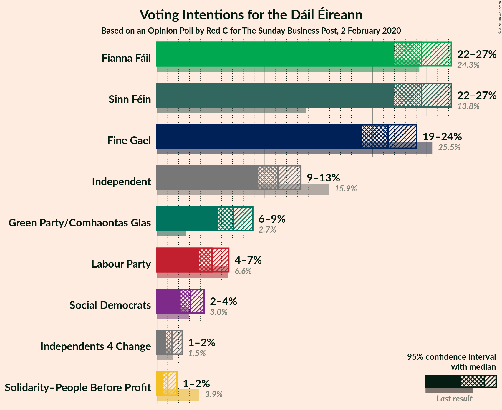

### Confidence Intervals

| Party | Last Result | Poll Result | 80% Confidence Interval | 90% Confidence Interval | 95% Confidence Interval | 99% Confidence Interval |
|:-----:|:-----------:|:-----------:|:-----------------------:|:-----------------------:|:-----------------------:|:-----------------------:|
| Fianna Fáil | 24.3% | 24.5% | 22.8–26.3% |22.3–26.8% |21.9–27.3% |21.1–28.2% |
| Sinn Féin | 13.8% | 24.5% | 22.8–26.3% |22.3–26.8% |21.9–27.3% |21.1–28.2% |
| Fine Gael | 25.5% | 21.4% | 19.8–23.1% |19.4–23.6% |19.0–24.1% |18.2–24.9% |
| Independent | 15.9% | 11.2% | 10.0–12.6% |9.7–13.0% |9.4–13.3% |8.8–14.0% |
| Green Party/Comhaontas Glas | 2.7% | 7.1% | 6.2–8.3% |5.9–8.6% |5.7–8.9% |5.2–9.4% |
| Labour Party | 6.6% | 5.1% | 4.3–6.1% |4.1–6.4% |3.9–6.6% |3.6–7.2% |
| Social Democrats | 3.0% | 3.1% | 2.5–3.9% |2.3–4.2% |2.2–4.4% |1.9–4.8% |
| Independents 4 Change | 1.5% | 1.4% | 1.0–2.0% |0.9–2.2% |0.8–2.3% |0.7–2.7% |
| Solidarity–People Before Profit | 3.9% | 1.0% | 0.7–1.5% |0.6–1.7% |0.5–1.8% |0.4–2.1% |

*Note:* The poll result column reflects the actual value used in the calculations. Published results may vary slightly, and in addition be rounded to fewer digits.

## Seats

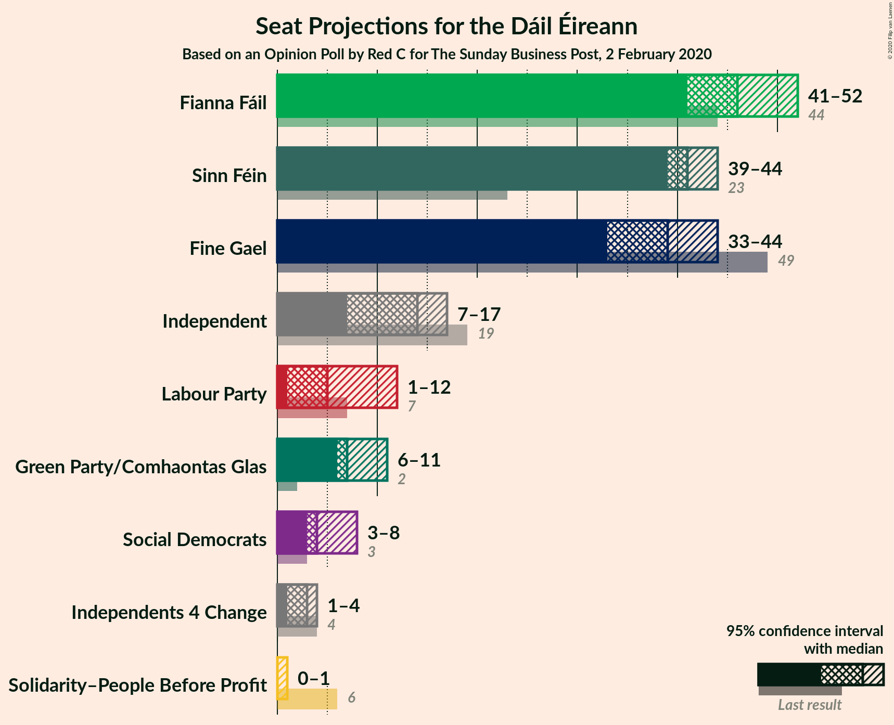

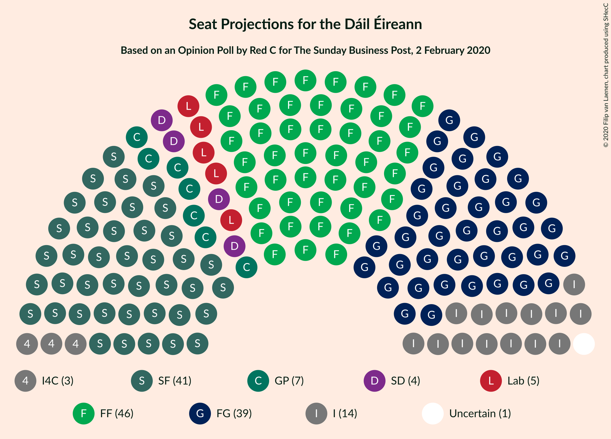

### Confidence Intervals

| Party | Last Result | Median | 80% Confidence Interval | 90% Confidence Interval | 95% Confidence Interval | 99% Confidence Interval |
|:-----:|:-----------:|:------:|:-----------------------:|:-----------------------:|:-----------------------:|:-----------------------:|
| <a href="#fianna-fáil">Fianna Fáil</a> | 44 | 46 | 42–50 |41–51 |41–52 |38–54 |
| <a href="#sinn-féin">Sinn Féin</a> | 23 | 41 | 40–44 |39–44 |39–44 |38–44 |
| <a href="#fine-gael">Fine Gael</a> | 49 | 39 | 34–42 |33–42 |33–44 |31–47 |
| <a href="#independent">Independent</a> | 19 | 14 | 10–17 |8–17 |7–17 |6–18 |
| <a href="#green-party/comhaontas-glas">Green Party/Comhaontas Glas</a> | 2 | 7 | 7–10 |6–11 |6–11 |4–14 |
| <a href="#labour-party">Labour Party</a> | 7 | 5 | 2–8 |1–11 |1–12 |1–15 |
| <a href="#social-democrats">Social Democrats</a> | 3 | 4 | 3–6 |3–7 |3–8 |3–9 |
| <a href="#independents-4-change">Independents 4 Change</a> | 4 | 3 | 3 |2–4 |1–4 |1–4 |
| <a href="#solidarity–people-before-profit">Solidarity–People Before Profit</a> | 6 | 0 | 0 |0–1 |0–1 |0–1 |

### Fianna Fáil

*For a full overview of the results for this party, see the [Fianna Fáil](party-fiannafáil.html) page.*

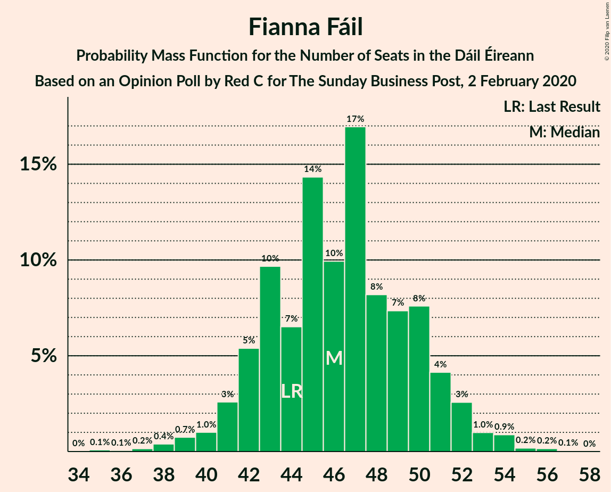

| Number of Seats | Probability | Accumulated | Special Marks |
|:---------------:|:-----------:|:-----------:|:-------------:|
| 35 | 0.1% | 100% |  |
| 36 | 0.1% | 99.9% |  |
| 37 | 0.2% | 99.8% |  |
| 38 | 0.4% | 99.7% |  |
| 39 | 0.7% | 99.3% |  |
| 40 | 1.0% | 98.5% |  |
| 41 | 3% | 98% |  |
| 42 | 5% | 95% |  |
| 43 | 10% | 90% |  |
| 44 | 7% | 80% | Last Result |
| 45 | 14% | 73% |  |
| 46 | 10% | 59% | Median |
| 47 | 17% | 49% |  |
| 48 | 8% | 32% |  |
| 49 | 7% | 24% |  |
| 50 | 8% | 17% |  |
| 51 | 4% | 9% |  |
| 52 | 3% | 5% |  |
| 53 | 1.0% | 2% |  |
| 54 | 0.9% | 1.3% |  |
| 55 | 0.2% | 0.4% |  |
| 56 | 0.2% | 0.2% |  |
| 57 | 0.1% | 0.1% |  |
| 58 | 0% | 0% |  |

### Sinn Féin

*For a full overview of the results for this party, see the [Sinn Féin](party-sinnféin.html) page.*

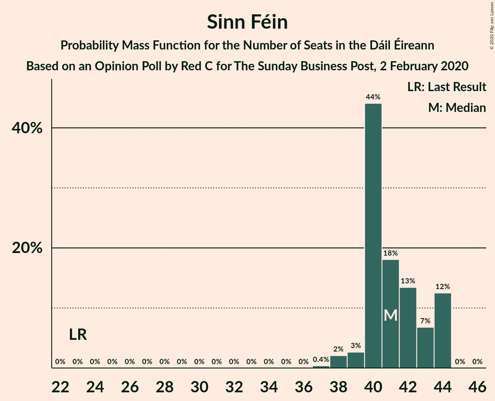

| Number of Seats | Probability | Accumulated | Special Marks |
|:---------------:|:-----------:|:-----------:|:-------------:|
| 23 | 0% | 100% | Last Result |
| 24 | 0% | 100% |  |
| 25 | 0% | 100% |  |
| 26 | 0% | 100% |  |
| 27 | 0% | 100% |  |
| 28 | 0% | 100% |  |
| 29 | 0% | 100% |  |
| 30 | 0% | 100% |  |
| 31 | 0% | 100% |  |
| 32 | 0% | 100% |  |
| 33 | 0% | 100% |  |
| 34 | 0% | 100% |  |
| 35 | 0% | 100% |  |
| 36 | 0% | 100% |  |
| 37 | 0.4% | 100% |  |
| 38 | 2% | 99.6% |  |
| 39 | 3% | 98% |  |
| 40 | 44% | 95% |  |
| 41 | 18% | 51% | Median |
| 42 | 13% | 33% |  |
| 43 | 7% | 19% |  |
| 44 | 12% | 12% |  |
| 45 | 0% | 0% |  |

### Fine Gael

*For a full overview of the results for this party, see the [Fine Gael](party-finegael.html) page.*

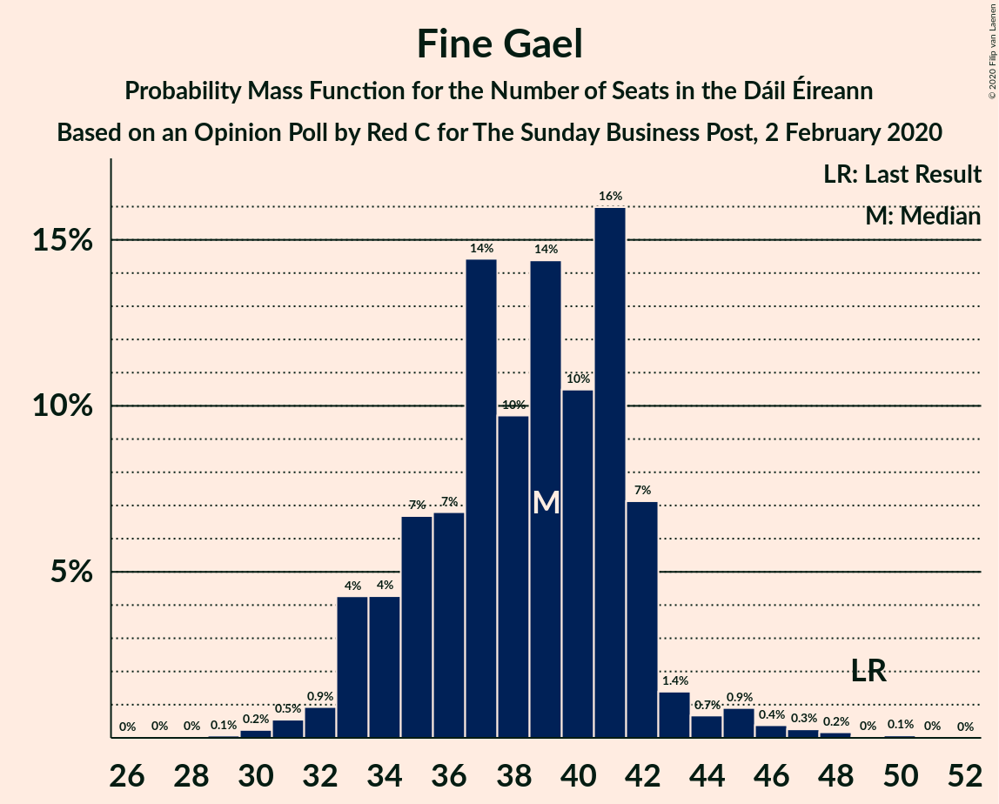

| Number of Seats | Probability | Accumulated | Special Marks |
|:---------------:|:-----------:|:-----------:|:-------------:|
| 27 | 0% | 100% |  |
| 28 | 0% | 99.9% |  |
| 29 | 0.1% | 99.9% |  |
| 30 | 0.2% | 99.8% |  |
| 31 | 0.5% | 99.6% |  |
| 32 | 0.9% | 99.0% |  |
| 33 | 4% | 98% |  |
| 34 | 4% | 94% |  |
| 35 | 7% | 90% |  |
| 36 | 7% | 83% |  |
| 37 | 14% | 76% |  |
| 38 | 10% | 62% |  |
| 39 | 14% | 52% | Median |
| 40 | 10% | 38% |  |
| 41 | 16% | 27% |  |
| 42 | 7% | 11% |  |
| 43 | 1.4% | 4% |  |
| 44 | 0.7% | 3% |  |
| 45 | 0.9% | 2% |  |
| 46 | 0.4% | 1.0% |  |
| 47 | 0.3% | 0.6% |  |
| 48 | 0.2% | 0.4% |  |
| 49 | 0% | 0.2% | Last Result |
| 50 | 0.1% | 0.1% |  |
| 51 | 0% | 0.1% |  |
| 52 | 0% | 0% |  |

### Independent

*For a full overview of the results for this party, see the [Independent](party-independent.html) page.*

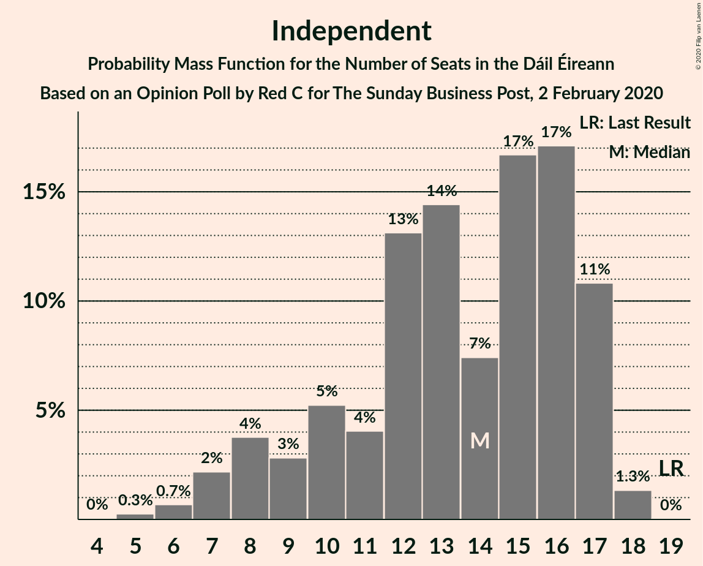

| Number of Seats | Probability | Accumulated | Special Marks |
|:---------------:|:-----------:|:-----------:|:-------------:|
| 4 | 0% | 100% |  |
| 5 | 0.3% | 99.9% |  |
| 6 | 0.7% | 99.7% |  |
| 7 | 2% | 99.0% |  |
| 8 | 4% | 97% |  |
| 9 | 3% | 93% |  |
| 10 | 5% | 90% |  |
| 11 | 4% | 85% |  |
| 12 | 13% | 81% |  |
| 13 | 14% | 68% |  |
| 14 | 7% | 53% | Median |
| 15 | 17% | 46% |  |
| 16 | 17% | 29% |  |
| 17 | 11% | 12% |  |
| 18 | 1.3% | 1.4% |  |
| 19 | 0% | 0% | Last Result |

### Green Party/Comhaontas Glas

*For a full overview of the results for this party, see the [Green Party/Comhaontas Glas](party-greenpartycomhaontasglas.html) page.*

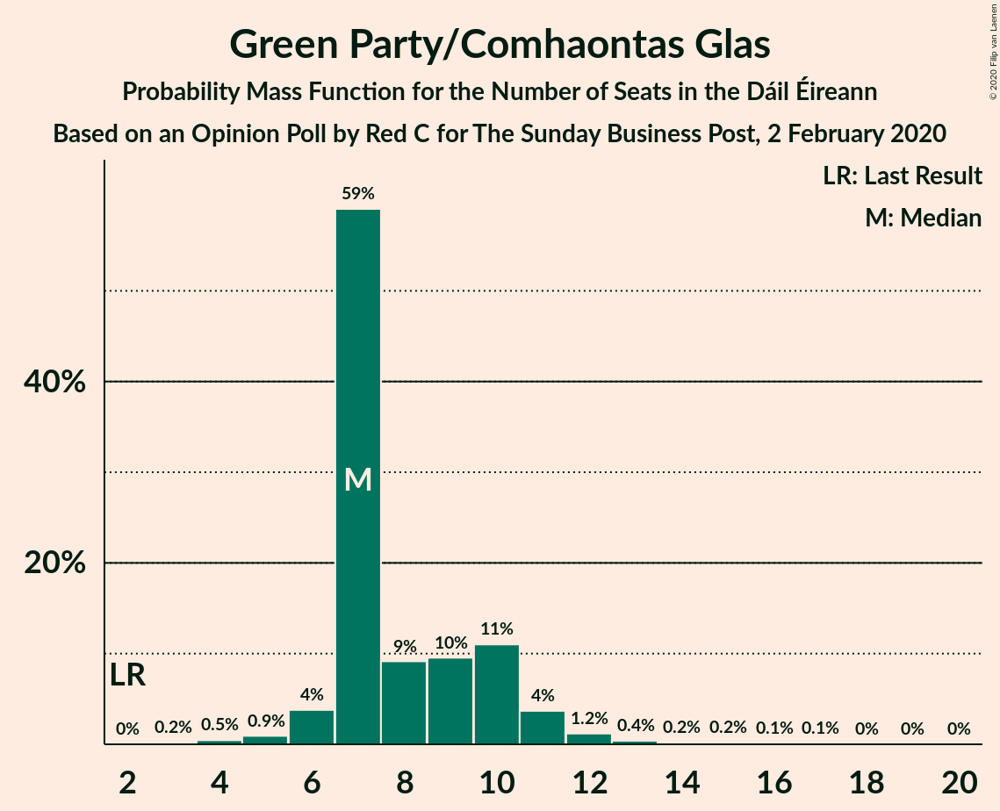

| Number of Seats | Probability | Accumulated | Special Marks |
|:---------------:|:-----------:|:-----------:|:-------------:|
| 2 | 0% | 100% | Last Result |
| 3 | 0.2% | 100% |  |
| 4 | 0.5% | 99.8% |  |
| 5 | 0.9% | 99.4% |  |
| 6 | 4% | 98% |  |
| 7 | 59% | 95% | Median |
| 8 | 9% | 36% |  |
| 9 | 10% | 26% |  |
| 10 | 11% | 17% |  |
| 11 | 4% | 6% |  |
| 12 | 1.2% | 2% |  |
| 13 | 0.4% | 1.0% |  |
| 14 | 0.2% | 0.6% |  |
| 15 | 0.2% | 0.4% |  |
| 16 | 0.1% | 0.2% |  |
| 17 | 0.1% | 0.2% |  |
| 18 | 0% | 0.1% |  |
| 19 | 0% | 0% |  |

### Labour Party

*For a full overview of the results for this party, see the [Labour Party](party-labourparty.html) page.*

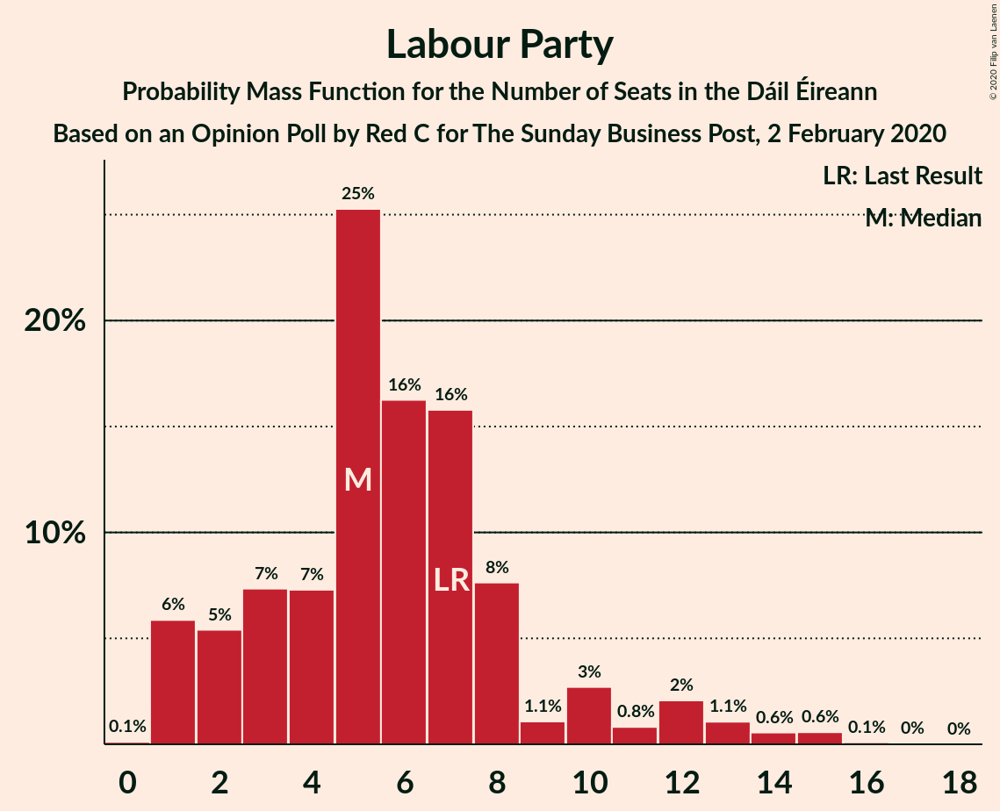

| Number of Seats | Probability | Accumulated | Special Marks |
|:---------------:|:-----------:|:-----------:|:-------------:|
| 0 | 0.1% | 100% |  |
| 1 | 6% | 99.9% |  |
| 2 | 5% | 94% |  |
| 3 | 7% | 89% |  |
| 4 | 7% | 81% |  |
| 5 | 25% | 74% | Median |
| 6 | 16% | 49% |  |
| 7 | 16% | 32% | Last Result |
| 8 | 8% | 17% |  |
| 9 | 1.1% | 9% |  |
| 10 | 3% | 8% |  |
| 11 | 0.8% | 5% |  |
| 12 | 2% | 4% |  |
| 13 | 1.1% | 2% |  |
| 14 | 0.6% | 1.3% |  |
| 15 | 0.6% | 0.7% |  |
| 16 | 0.1% | 0.1% |  |
| 17 | 0% | 0% |  |

### Social Democrats

*For a full overview of the results for this party, see the [Social Democrats](party-socialdemocrats.html) page.*

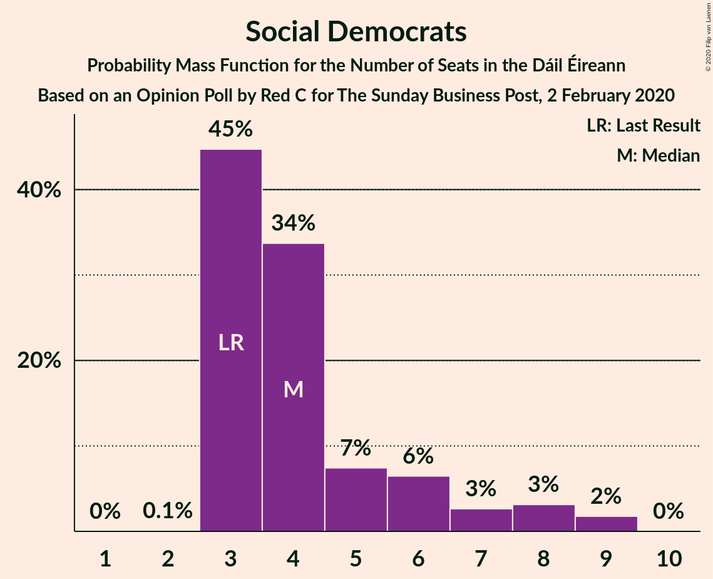

| Number of Seats | Probability | Accumulated | Special Marks |
|:---------------:|:-----------:|:-----------:|:-------------:|
| 2 | 0.1% | 100% |  |
| 3 | 45% | 99.9% | Last Result |
| 4 | 34% | 55% | Median |
| 5 | 7% | 21% |  |
| 6 | 6% | 14% |  |
| 7 | 3% | 8% |  |
| 8 | 3% | 5% |  |
| 9 | 2% | 2% |  |
| 10 | 0% | 0% |  |

### Independents 4 Change

*For a full overview of the results for this party, see the [Independents 4 Change](party-independents4change.html) page.*

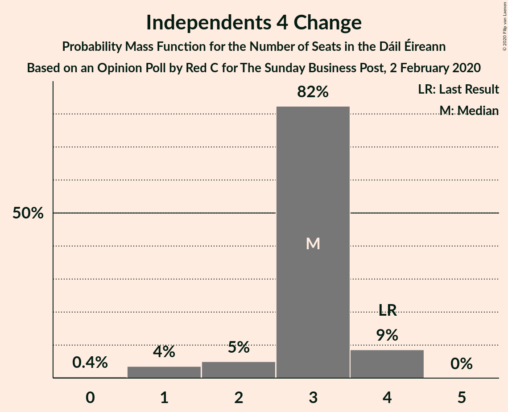

| Number of Seats | Probability | Accumulated | Special Marks |
|:---------------:|:-----------:|:-----------:|:-------------:|
| 0 | 0.4% | 100% |  |
| 1 | 4% | 99.6% |  |
| 2 | 5% | 96% |  |
| 3 | 82% | 91% | Median |
| 4 | 9% | 9% | Last Result |
| 5 | 0% | 0% |  |

### Solidarity–People Before Profit

*For a full overview of the results for this party, see the [Solidarity–People Before Profit](party-solidarity–peoplebeforeprofit.html) page.*

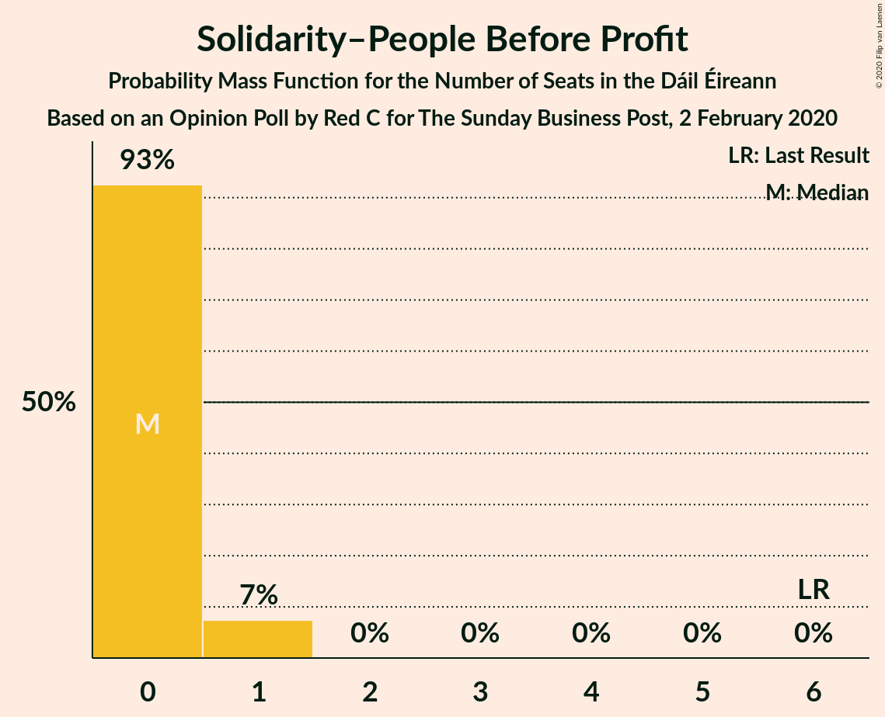

| Number of Seats | Probability | Accumulated | Special Marks |
|:---------------:|:-----------:|:-----------:|:-------------:|
| 0 | 93% | 100% | Median |
| 1 | 7% | 7% |  |
| 2 | 0% | 0% |  |
| 3 | 0% | 0% |  |
| 4 | 0% | 0% |  |
| 5 | 0% | 0% |  |
| 6 | 0% | 0% | Last Result |

## Coalitions

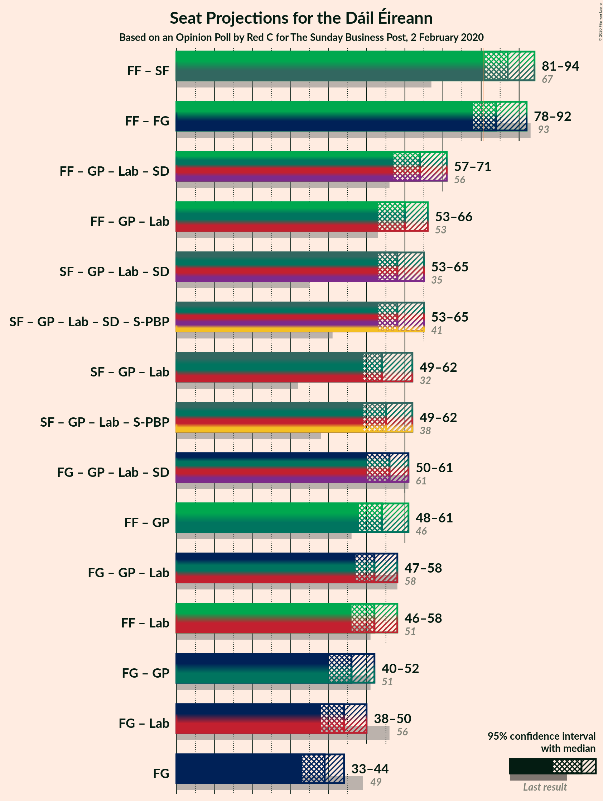

### Confidence Intervals

| Coalition | Last Result | Median | Majority? | 80% Confidence Interval | 90% Confidence Interval | 95% Confidence Interval | 99% Confidence Interval |
|:---------:|:-----------:|:------:|:---------:|:-----------------------:|:-----------------------:|:-----------------------:|:-----------------------:|
| Fianna Fáil – Sinn Féin | 67 | 87 | 98% | 83–92 | 82–94 | 81–94 | 79–96 |
| Fianna Fáil – Fine Gael | 93 | 84 | 88% | 80–89 | 79–91 | 78–92 | 75–95 |
| Fianna Fáil – Green Party/Comhaontas Glas – Labour Party – Social Democrats | 56 | 64 | 0% | 59–68 | 59–69 | 57–71 | 54–74 |
| Fianna Fáil – Green Party/Comhaontas Glas – Labour Party | 53 | 60 | 0% | 55–64 | 54–65 | 53–66 | 49–70 |
| Sinn Féin – Green Party/Comhaontas Glas – Labour Party – Social Democrats | 35 | 58 | 0% | 54–62 | 53–64 | 53–65 | 52–68 |
| Sinn Féin – Green Party/Comhaontas Glas – Labour Party – Social Democrats – Solidarity–People Before Profit | 41 | 58 | 0% | 54–62 | 54–64 | 53–65 | 52–68 |
| Sinn Féin – Green Party/Comhaontas Glas – Labour Party | 32 | 54 | 0% | 50–58 | 50–60 | 49–62 | 48–64 |
| Sinn Féin – Green Party/Comhaontas Glas – Labour Party – Solidarity–People Before Profit | 38 | 55 | 0% | 50–58 | 50–61 | 49–62 | 48–64 |
| Fine Gael – Green Party/Comhaontas Glas – Labour Party – Social Democrats | 61 | 56 | 0% | 52–59 | 51–60 | 50–61 | 49–64 |
| Fianna Fáil – Green Party/Comhaontas Glas | 46 | 54 | 0% | 50–59 | 49–60 | 48–61 | 45–63 |
| Fine Gael – Green Party/Comhaontas Glas – Labour Party | 58 | 52 | 0% | 48–55 | 47–57 | 47–58 | 44–60 |
| Fianna Fáil – Labour Party | 51 | 52 | 0% | 48–57 | 47–57 | 46–58 | 42–61 |
| Fine Gael – Green Party/Comhaontas Glas | 51 | 46 | 0% | 43–49 | 41–50 | 40–52 | 39–54 |
| Fine Gael – Labour Party | 56 | 44 | 0% | 40–48 | 39–49 | 38–50 | 36–53 |
| Fine Gael | 49 | 39 | 0% | 34–42 | 33–42 | 33–44 | 31–47 |

### Fianna Fáil – Sinn Féin

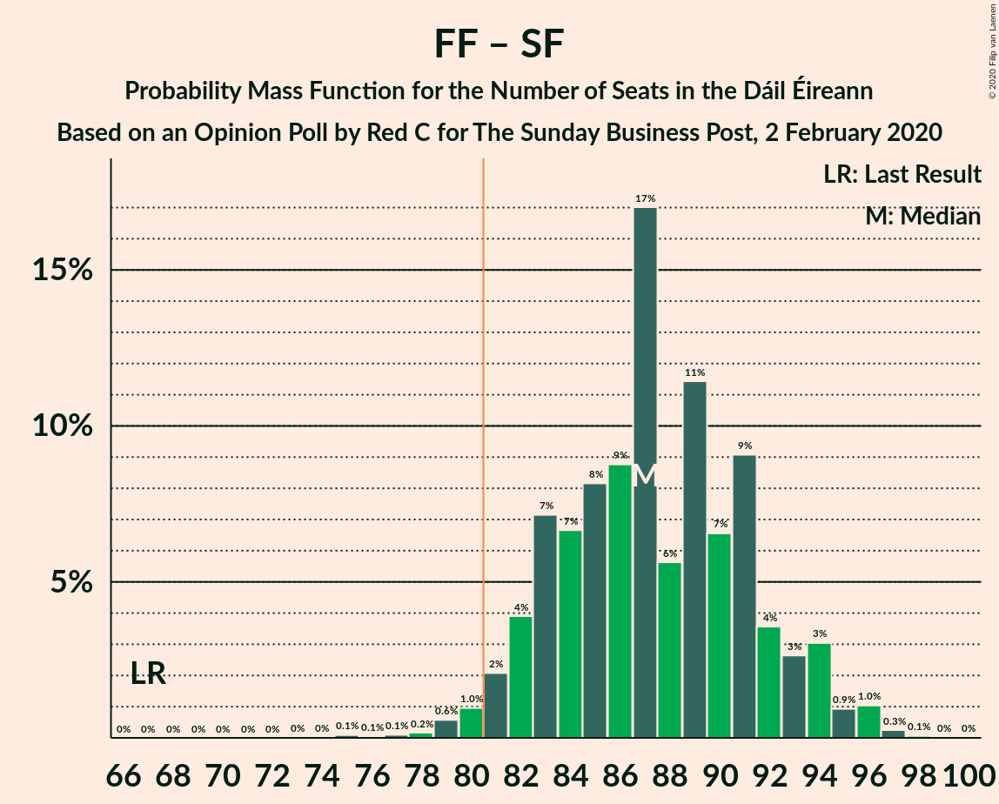

| Number of Seats | Probability | Accumulated | Special Marks |
|:---------------:|:-----------:|:-----------:|:-------------:|
| 67 | 0% | 100% | Last Result |
| 68 | 0% | 100% |  |
| 69 | 0% | 100% |  |
| 70 | 0% | 100% |  |
| 71 | 0% | 100% |  |
| 72 | 0% | 100% |  |
| 73 | 0% | 100% |  |
| 74 | 0% | 100% |  |
| 75 | 0.1% | 100% |  |
| 76 | 0.1% | 99.9% |  |
| 77 | 0.1% | 99.8% |  |
| 78 | 0.2% | 99.7% |  |
| 79 | 0.6% | 99.6% |  |
| 80 | 1.0% | 99.0% |  |
| 81 | 2% | 98% | Majority |
| 82 | 4% | 96% |  |
| 83 | 7% | 92% |  |
| 84 | 7% | 85% |  |
| 85 | 8% | 78% |  |
| 86 | 9% | 70% |  |
| 87 | 17% | 61% | Median |
| 88 | 6% | 44% |  |
| 89 | 11% | 39% |  |
| 90 | 7% | 27% |  |
| 91 | 9% | 21% |  |
| 92 | 4% | 12% |  |
| 93 | 3% | 8% |  |
| 94 | 3% | 5% |  |
| 95 | 0.9% | 2% |  |
| 96 | 1.0% | 1.4% |  |
| 97 | 0.3% | 0.4% |  |
| 98 | 0.1% | 0.1% |  |
| 99 | 0% | 0% |  |

### Fianna Fáil – Fine Gael

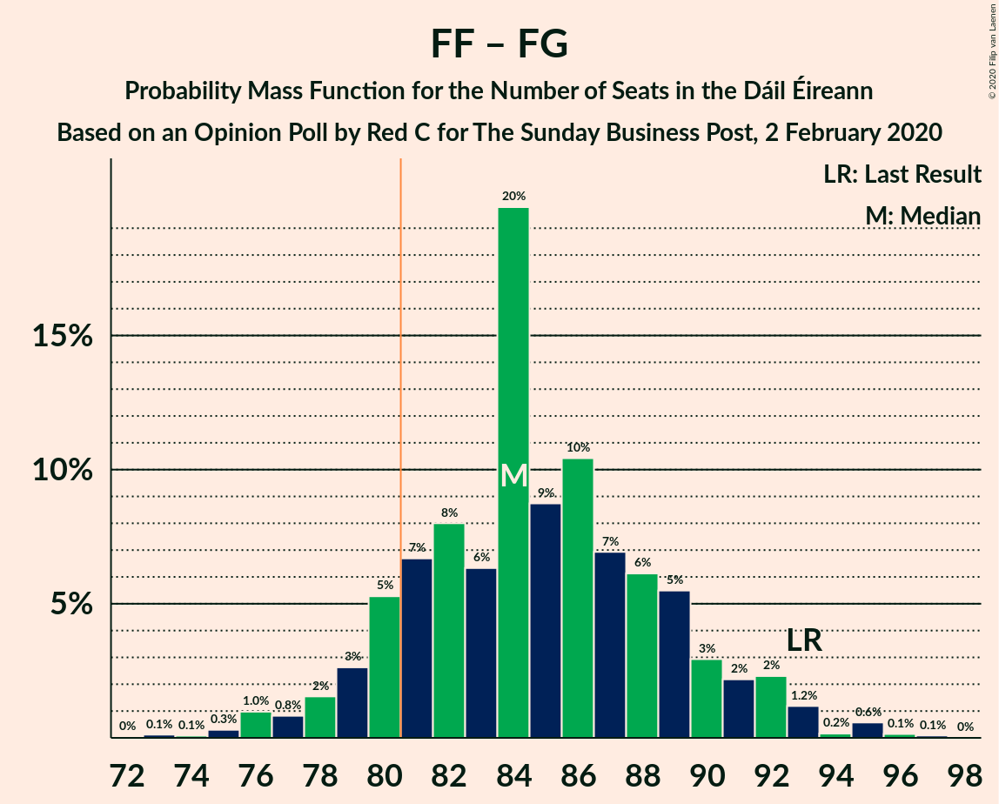

| Number of Seats | Probability | Accumulated | Special Marks |
|:---------------:|:-----------:|:-----------:|:-------------:|
| 72 | 0% | 100% |  |
| 73 | 0.1% | 99.9% |  |
| 74 | 0.1% | 99.8% |  |
| 75 | 0.3% | 99.7% |  |
| 76 | 1.0% | 99.4% |  |
| 77 | 0.8% | 98% |  |
| 78 | 2% | 98% |  |
| 79 | 3% | 96% |  |
| 80 | 5% | 93% |  |
| 81 | 7% | 88% | Majority |
| 82 | 8% | 81% |  |
| 83 | 6% | 73% |  |
| 84 | 20% | 67% |  |
| 85 | 9% | 47% | Median |
| 86 | 10% | 39% |  |
| 87 | 7% | 28% |  |
| 88 | 6% | 21% |  |
| 89 | 5% | 15% |  |
| 90 | 3% | 10% |  |
| 91 | 2% | 7% |  |
| 92 | 2% | 4% |  |
| 93 | 1.2% | 2% | Last Result |
| 94 | 0.2% | 1.0% |  |
| 95 | 0.6% | 0.8% |  |
| 96 | 0.1% | 0.3% |  |
| 97 | 0.1% | 0.1% |  |
| 98 | 0% | 0% |  |

### Fianna Fáil – Green Party/Comhaontas Glas – Labour Party – Social Democrats

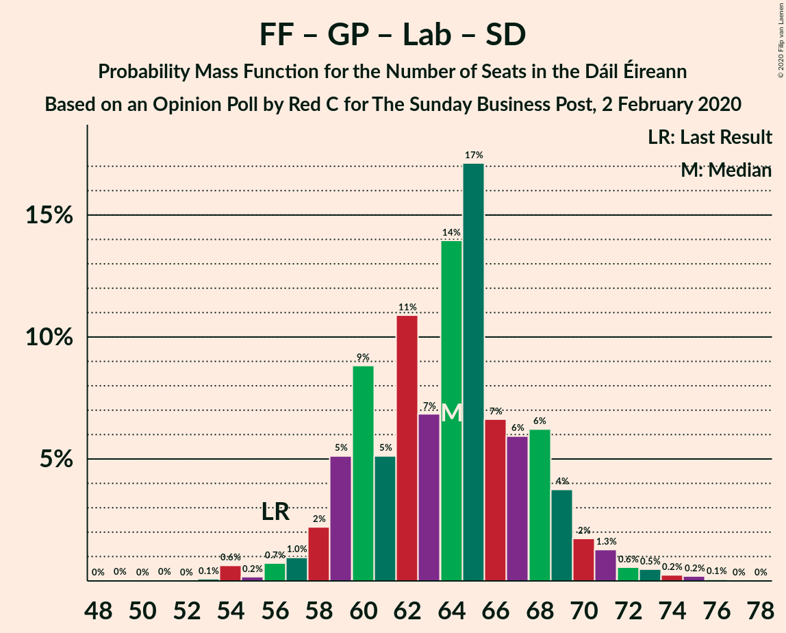

| Number of Seats | Probability | Accumulated | Special Marks |
|:---------------:|:-----------:|:-----------:|:-------------:|
| 49 | 0% | 100% |  |
| 50 | 0% | 99.9% |  |
| 51 | 0% | 99.9% |  |
| 52 | 0% | 99.9% |  |
| 53 | 0.1% | 99.9% |  |
| 54 | 0.6% | 99.8% |  |
| 55 | 0.2% | 99.1% |  |
| 56 | 0.7% | 99.0% | Last Result |
| 57 | 1.0% | 98% |  |
| 58 | 2% | 97% |  |
| 59 | 5% | 95% |  |
| 60 | 9% | 90% |  |
| 61 | 5% | 81% |  |
| 62 | 11% | 76% | Median |
| 63 | 7% | 65% |  |
| 64 | 14% | 58% |  |
| 65 | 17% | 44% |  |
| 66 | 7% | 27% |  |
| 67 | 6% | 21% |  |
| 68 | 6% | 15% |  |
| 69 | 4% | 8% |  |
| 70 | 2% | 5% |  |
| 71 | 1.3% | 3% |  |
| 72 | 0.6% | 2% |  |
| 73 | 0.5% | 1.0% |  |
| 74 | 0.2% | 0.5% |  |
| 75 | 0.2% | 0.3% |  |
| 76 | 0.1% | 0.1% |  |
| 77 | 0% | 0% |  |

### Fianna Fáil – Green Party/Comhaontas Glas – Labour Party

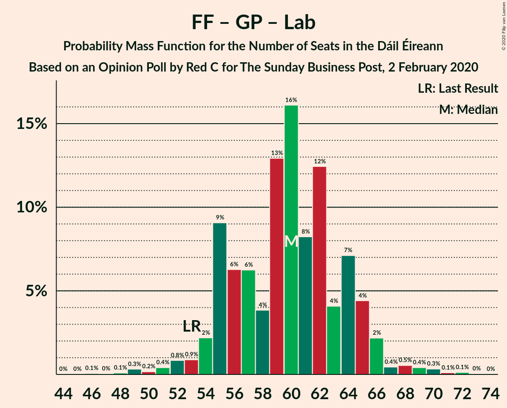

| Number of Seats | Probability | Accumulated | Special Marks |
|:---------------:|:-----------:|:-----------:|:-------------:|
| 46 | 0.1% | 100% |  |
| 47 | 0% | 99.9% |  |
| 48 | 0.1% | 99.9% |  |
| 49 | 0.3% | 99.8% |  |
| 50 | 0.2% | 99.5% |  |
| 51 | 0.4% | 99.3% |  |
| 52 | 0.8% | 98.9% |  |
| 53 | 0.9% | 98% | Last Result |
| 54 | 2% | 97% |  |
| 55 | 9% | 95% |  |
| 56 | 6% | 86% |  |
| 57 | 6% | 80% |  |
| 58 | 4% | 73% | Median |
| 59 | 13% | 70% |  |
| 60 | 16% | 57% |  |
| 61 | 8% | 40% |  |
| 62 | 12% | 32% |  |
| 63 | 4% | 20% |  |
| 64 | 7% | 16% |  |
| 65 | 4% | 9% |  |
| 66 | 2% | 4% |  |
| 67 | 0.4% | 2% |  |
| 68 | 0.5% | 2% |  |
| 69 | 0.4% | 1.0% |  |
| 70 | 0.3% | 0.6% |  |
| 71 | 0.1% | 0.3% |  |
| 72 | 0.1% | 0.2% |  |
| 73 | 0% | 0.1% |  |
| 74 | 0% | 0% |  |

### Sinn Féin – Green Party/Comhaontas Glas – Labour Party – Social Democrats

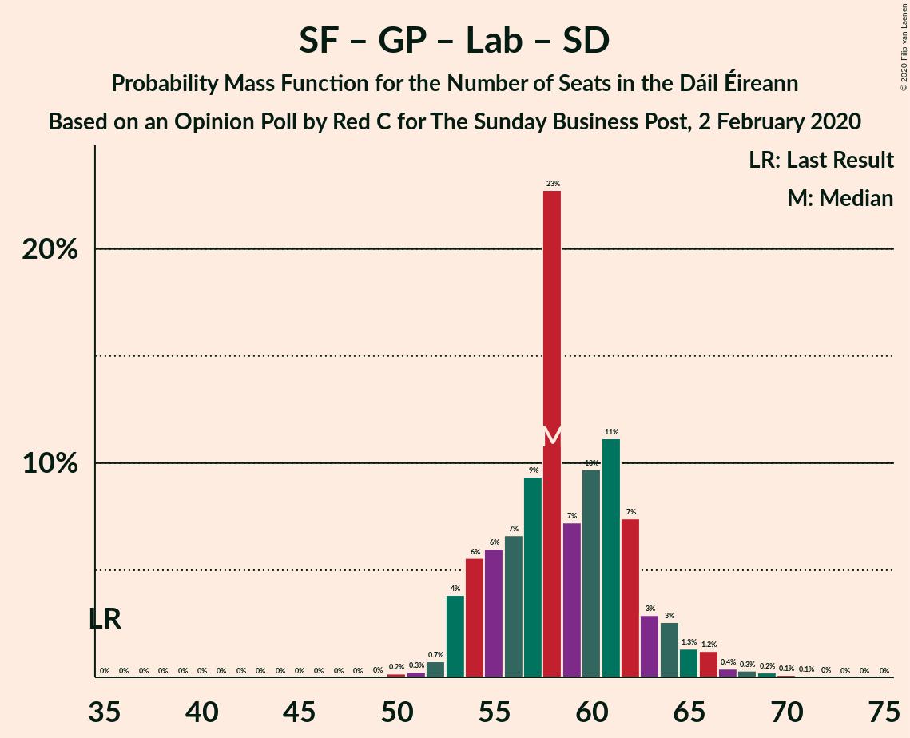

| Number of Seats | Probability | Accumulated | Special Marks |
|:---------------:|:-----------:|:-----------:|:-------------:|
| 35 | 0% | 100% | Last Result |
| 36 | 0% | 100% |  |
| 37 | 0% | 100% |  |
| 38 | 0% | 100% |  |
| 39 | 0% | 100% |  |
| 40 | 0% | 100% |  |
| 41 | 0% | 100% |  |
| 42 | 0% | 100% |  |
| 43 | 0% | 100% |  |
| 44 | 0% | 100% |  |
| 45 | 0% | 100% |  |
| 46 | 0% | 100% |  |
| 47 | 0% | 100% |  |
| 48 | 0% | 100% |  |
| 49 | 0% | 100% |  |
| 50 | 0.2% | 100% |  |
| 51 | 0.3% | 99.8% |  |
| 52 | 0.7% | 99.5% |  |
| 53 | 4% | 98.8% |  |
| 54 | 6% | 95% |  |
| 55 | 6% | 89% |  |
| 56 | 7% | 83% |  |
| 57 | 9% | 77% | Median |
| 58 | 23% | 67% |  |
| 59 | 7% | 45% |  |
| 60 | 10% | 37% |  |
| 61 | 11% | 28% |  |
| 62 | 7% | 17% |  |
| 63 | 3% | 9% |  |
| 64 | 3% | 6% |  |
| 65 | 1.3% | 4% |  |
| 66 | 1.2% | 2% |  |
| 67 | 0.4% | 1.1% |  |
| 68 | 0.3% | 0.7% |  |
| 69 | 0.2% | 0.4% |  |
| 70 | 0.1% | 0.2% |  |
| 71 | 0.1% | 0.1% |  |
| 72 | 0% | 0% |  |

### Sinn Féin – Green Party/Comhaontas Glas – Labour Party – Social Democrats – Solidarity–People Before Profit

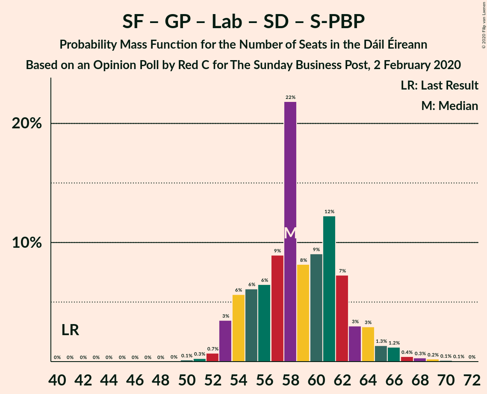

| Number of Seats | Probability | Accumulated | Special Marks |
|:---------------:|:-----------:|:-----------:|:-------------:|
| 41 | 0% | 100% | Last Result |
| 42 | 0% | 100% |  |
| 43 | 0% | 100% |  |
| 44 | 0% | 100% |  |
| 45 | 0% | 100% |  |
| 46 | 0% | 100% |  |
| 47 | 0% | 100% |  |
| 48 | 0% | 100% |  |
| 49 | 0% | 100% |  |
| 50 | 0.1% | 100% |  |
| 51 | 0.3% | 99.8% |  |
| 52 | 0.7% | 99.6% |  |
| 53 | 3% | 98.8% |  |
| 54 | 6% | 95% |  |
| 55 | 6% | 90% |  |
| 56 | 6% | 84% |  |
| 57 | 9% | 77% | Median |
| 58 | 22% | 68% |  |
| 59 | 8% | 46% |  |
| 60 | 9% | 38% |  |
| 61 | 12% | 29% |  |
| 62 | 7% | 17% |  |
| 63 | 3% | 10% |  |
| 64 | 3% | 7% |  |
| 65 | 1.3% | 4% |  |
| 66 | 1.2% | 2% |  |
| 67 | 0.4% | 1.2% |  |
| 68 | 0.3% | 0.7% |  |
| 69 | 0.2% | 0.4% |  |
| 70 | 0.1% | 0.2% |  |
| 71 | 0.1% | 0.1% |  |
| 72 | 0% | 0% |  |

### Sinn Féin – Green Party/Comhaontas Glas – Labour Party

| Number of Seats | Probability | Accumulated | Special Marks |
|:---------------:|:-----------:|:-----------:|:-------------:|
| 32 | 0% | 100% | Last Result |
| 33 | 0% | 100% |  |
| 34 | 0% | 100% |  |
| 35 | 0% | 100% |  |
| 36 | 0% | 100% |  |
| 37 | 0% | 100% |  |
| 38 | 0% | 100% |  |
| 39 | 0% | 100% |  |
| 40 | 0% | 100% |  |
| 41 | 0% | 100% |  |
| 42 | 0% | 100% |  |
| 43 | 0% | 100% |  |
| 44 | 0% | 100% |  |
| 45 | 0% | 100% |  |
| 46 | 0.1% | 100% |  |
| 47 | 0.3% | 99.9% |  |
| 48 | 0.6% | 99.6% |  |
| 49 | 4% | 99.1% |  |
| 50 | 6% | 95% |  |
| 51 | 5% | 89% |  |
| 52 | 13% | 85% |  |
| 53 | 9% | 72% | Median |
| 54 | 13% | 62% |  |
| 55 | 16% | 49% |  |
| 56 | 7% | 33% |  |
| 57 | 8% | 26% |  |
| 58 | 8% | 18% |  |
| 59 | 3% | 10% |  |
| 60 | 2% | 7% |  |
| 61 | 2% | 5% |  |
| 62 | 1.1% | 3% |  |
| 63 | 0.8% | 2% |  |
| 64 | 0.4% | 0.8% |  |
| 65 | 0.2% | 0.4% |  |
| 66 | 0.1% | 0.2% |  |
| 67 | 0% | 0.1% |  |
| 68 | 0.1% | 0.1% |  |
| 69 | 0% | 0% |  |

### Sinn Féin – Green Party/Comhaontas Glas – Labour Party – Solidarity–People Before Profit

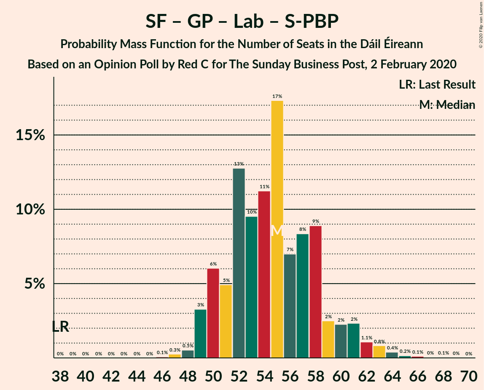

| Number of Seats | Probability | Accumulated | Special Marks |
|:---------------:|:-----------:|:-----------:|:-------------:|
| 38 | 0% | 100% | Last Result |
| 39 | 0% | 100% |  |
| 40 | 0% | 100% |  |
| 41 | 0% | 100% |  |
| 42 | 0% | 100% |  |
| 43 | 0% | 100% |  |
| 44 | 0% | 100% |  |
| 45 | 0% | 100% |  |
| 46 | 0.1% | 100% |  |
| 47 | 0.3% | 99.9% |  |
| 48 | 0.5% | 99.7% |  |
| 49 | 3% | 99.1% |  |
| 50 | 6% | 96% |  |
| 51 | 5% | 90% |  |
| 52 | 13% | 85% |  |
| 53 | 10% | 72% | Median |
| 54 | 11% | 63% |  |
| 55 | 17% | 51% |  |
| 56 | 7% | 34% |  |
| 57 | 8% | 27% |  |
| 58 | 9% | 19% |  |
| 59 | 2% | 10% |  |
| 60 | 2% | 7% |  |
| 61 | 2% | 5% |  |
| 62 | 1.1% | 3% |  |
| 63 | 0.8% | 2% |  |
| 64 | 0.4% | 0.8% |  |
| 65 | 0.2% | 0.4% |  |
| 66 | 0.1% | 0.2% |  |
| 67 | 0% | 0.1% |  |
| 68 | 0.1% | 0.1% |  |
| 69 | 0% | 0% |  |

### Fine Gael – Green Party/Comhaontas Glas – Labour Party – Social Democrats

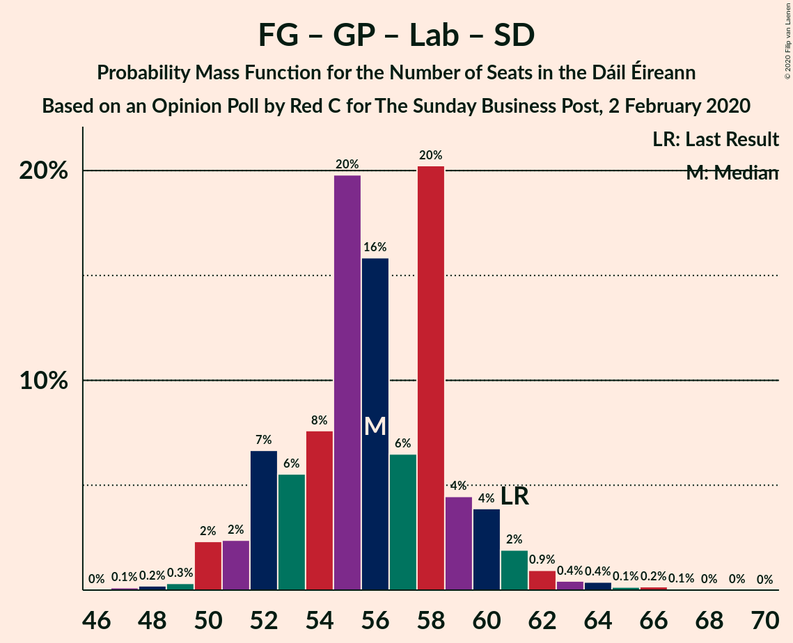

| Number of Seats | Probability | Accumulated | Special Marks |
|:---------------:|:-----------:|:-----------:|:-------------:|
| 47 | 0.1% | 100% |  |
| 48 | 0.2% | 99.8% |  |
| 49 | 0.3% | 99.6% |  |
| 50 | 2% | 99.3% |  |
| 51 | 2% | 97% |  |
| 52 | 7% | 95% |  |
| 53 | 6% | 88% |  |
| 54 | 8% | 82% |  |
| 55 | 20% | 75% | Median |
| 56 | 16% | 55% |  |
| 57 | 6% | 39% |  |
| 58 | 20% | 33% |  |
| 59 | 4% | 12% |  |
| 60 | 4% | 8% |  |
| 61 | 2% | 4% | Last Result |
| 62 | 0.9% | 2% |  |
| 63 | 0.4% | 1.2% |  |
| 64 | 0.4% | 0.8% |  |
| 65 | 0.1% | 0.4% |  |
| 66 | 0.2% | 0.3% |  |
| 67 | 0.1% | 0.1% |  |
| 68 | 0% | 0.1% |  |
| 69 | 0% | 0% |  |

### Fianna Fáil – Green Party/Comhaontas Glas

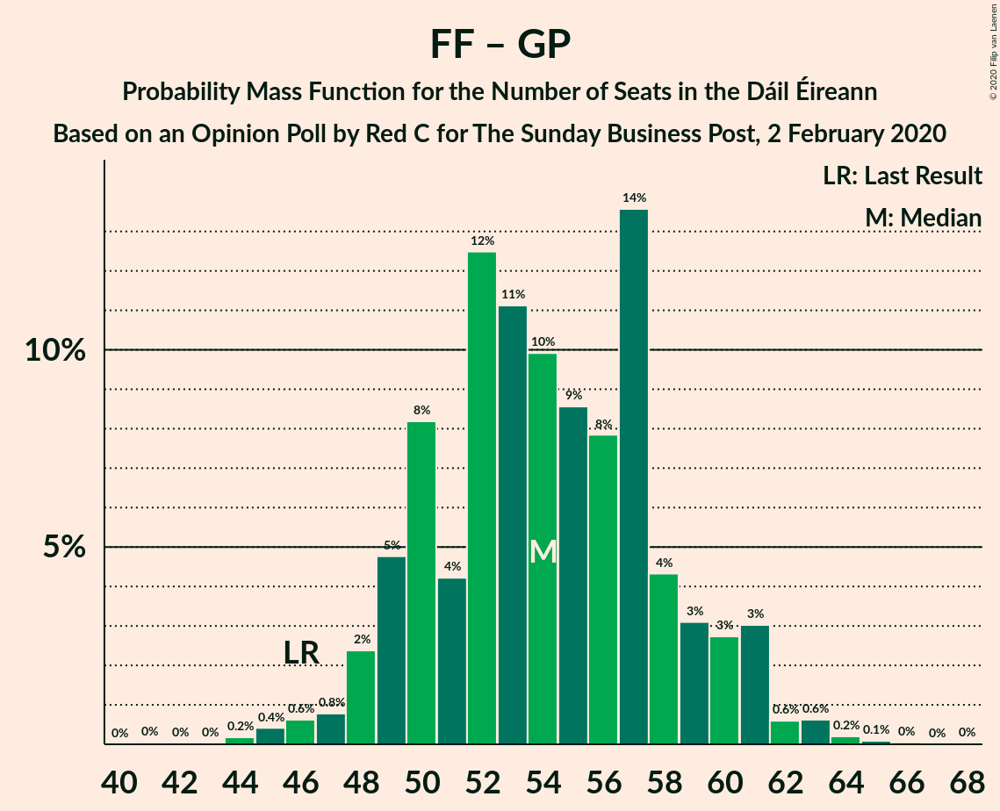

| Number of Seats | Probability | Accumulated | Special Marks |
|:---------------:|:-----------:|:-----------:|:-------------:|
| 41 | 0% | 100% |  |
| 42 | 0% | 99.9% |  |
| 43 | 0% | 99.9% |  |
| 44 | 0.2% | 99.9% |  |
| 45 | 0.4% | 99.7% |  |
| 46 | 0.6% | 99.3% | Last Result |
| 47 | 0.8% | 98.7% |  |
| 48 | 2% | 98% |  |
| 49 | 5% | 95% |  |
| 50 | 8% | 91% |  |
| 51 | 4% | 83% |  |
| 52 | 12% | 78% |  |
| 53 | 11% | 66% | Median |
| 54 | 10% | 55% |  |
| 55 | 9% | 45% |  |
| 56 | 8% | 36% |  |
| 57 | 14% | 28% |  |
| 58 | 4% | 15% |  |
| 59 | 3% | 10% |  |
| 60 | 3% | 7% |  |
| 61 | 3% | 5% |  |
| 62 | 0.6% | 2% |  |
| 63 | 0.6% | 1.0% |  |
| 64 | 0.2% | 0.4% |  |
| 65 | 0.1% | 0.2% |  |
| 66 | 0% | 0.1% |  |
| 67 | 0% | 0.1% |  |
| 68 | 0% | 0% |  |

### Fine Gael – Green Party/Comhaontas Glas – Labour Party

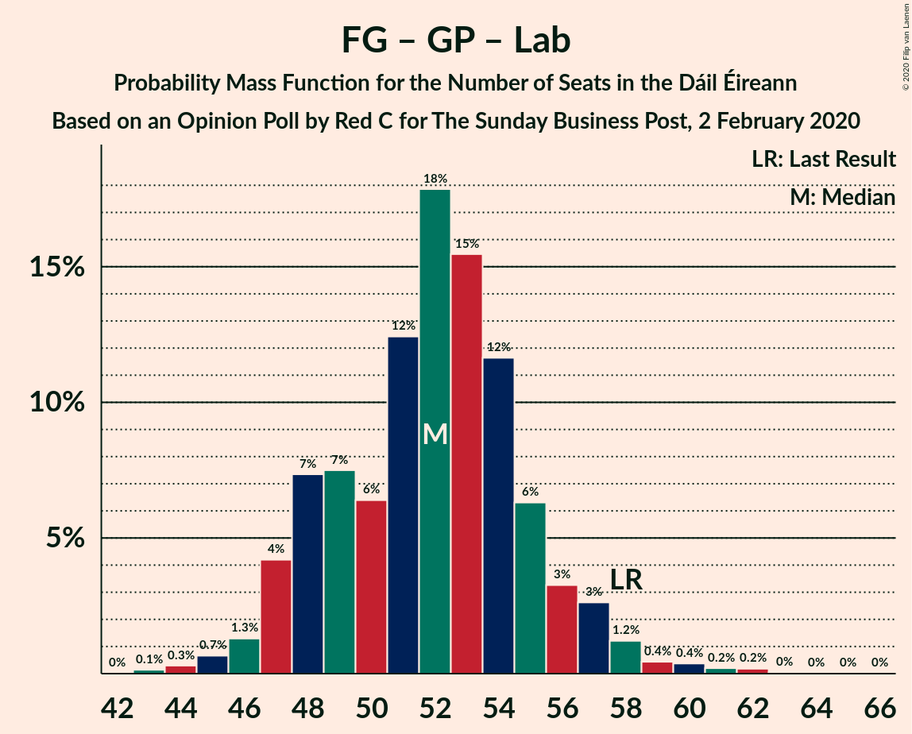

| Number of Seats | Probability | Accumulated | Special Marks |
|:---------------:|:-----------:|:-----------:|:-------------:|
| 42 | 0% | 100% |  |
| 43 | 0.1% | 99.9% |  |
| 44 | 0.3% | 99.8% |  |
| 45 | 0.7% | 99.5% |  |
| 46 | 1.3% | 98.8% |  |
| 47 | 4% | 98% |  |
| 48 | 7% | 93% |  |
| 49 | 7% | 86% |  |
| 50 | 6% | 78% |  |
| 51 | 12% | 72% | Median |
| 52 | 18% | 60% |  |
| 53 | 15% | 42% |  |
| 54 | 12% | 26% |  |
| 55 | 6% | 15% |  |
| 56 | 3% | 8% |  |
| 57 | 3% | 5% |  |
| 58 | 1.2% | 3% | Last Result |
| 59 | 0.4% | 1.3% |  |
| 60 | 0.4% | 0.9% |  |
| 61 | 0.2% | 0.5% |  |
| 62 | 0.2% | 0.3% |  |
| 63 | 0% | 0.1% |  |
| 64 | 0% | 0.1% |  |
| 65 | 0% | 0% |  |

### Fianna Fáil – Labour Party

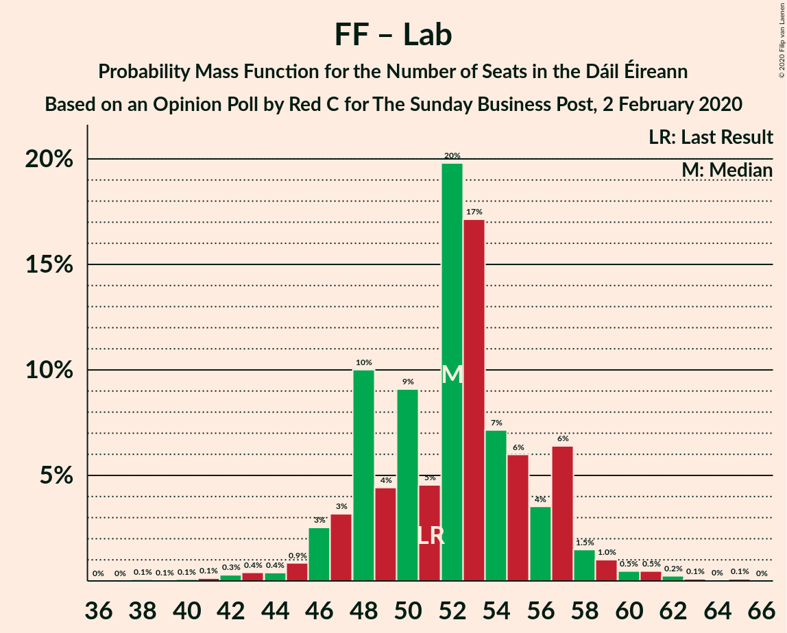

| Number of Seats | Probability | Accumulated | Special Marks |
|:---------------:|:-----------:|:-----------:|:-------------:|
| 38 | 0.1% | 100% |  |
| 39 | 0.1% | 99.9% |  |
| 40 | 0.1% | 99.9% |  |
| 41 | 0.1% | 99.8% |  |
| 42 | 0.3% | 99.6% |  |
| 43 | 0.4% | 99.4% |  |
| 44 | 0.4% | 99.0% |  |
| 45 | 0.9% | 98.6% |  |
| 46 | 3% | 98% |  |
| 47 | 3% | 95% |  |
| 48 | 10% | 92% |  |
| 49 | 4% | 82% |  |
| 50 | 9% | 78% |  |
| 51 | 5% | 68% | Last Result, Median |
| 52 | 20% | 64% |  |
| 53 | 17% | 44% |  |
| 54 | 7% | 27% |  |
| 55 | 6% | 20% |  |
| 56 | 4% | 14% |  |
| 57 | 6% | 10% |  |
| 58 | 1.5% | 4% |  |
| 59 | 1.0% | 2% |  |
| 60 | 0.5% | 1.4% |  |
| 61 | 0.5% | 1.0% |  |
| 62 | 0.2% | 0.5% |  |
| 63 | 0.1% | 0.2% |  |
| 64 | 0% | 0.1% |  |
| 65 | 0.1% | 0.1% |  |
| 66 | 0% | 0% |  |

### Fine Gael – Green Party/Comhaontas Glas

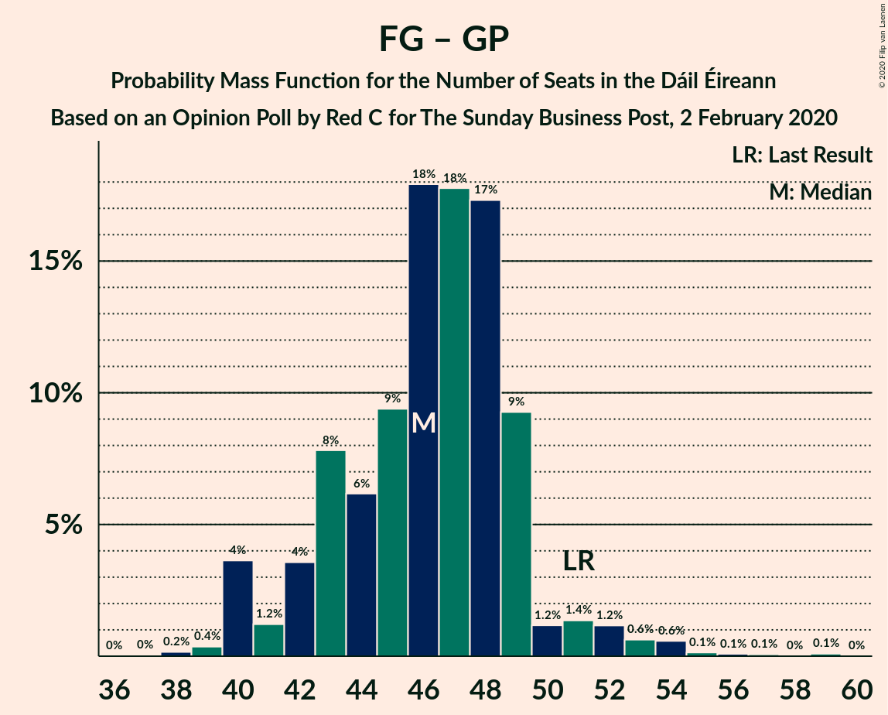

| Number of Seats | Probability | Accumulated | Special Marks |
|:---------------:|:-----------:|:-----------:|:-------------:|
| 37 | 0% | 100% |  |
| 38 | 0.2% | 99.9% |  |
| 39 | 0.4% | 99.8% |  |
| 40 | 4% | 99.4% |  |
| 41 | 1.2% | 96% |  |
| 42 | 4% | 95% |  |
| 43 | 8% | 91% |  |
| 44 | 6% | 83% |  |
| 45 | 9% | 77% |  |
| 46 | 18% | 68% | Median |
| 47 | 18% | 50% |  |
| 48 | 17% | 32% |  |
| 49 | 9% | 15% |  |
| 50 | 1.2% | 5% |  |
| 51 | 1.4% | 4% | Last Result |
| 52 | 1.2% | 3% |  |
| 53 | 0.6% | 2% |  |
| 54 | 0.6% | 1.0% |  |
| 55 | 0.1% | 0.4% |  |
| 56 | 0.1% | 0.3% |  |
| 57 | 0.1% | 0.2% |  |
| 58 | 0% | 0.1% |  |
| 59 | 0.1% | 0.1% |  |
| 60 | 0% | 0% |  |

### Fine Gael – Labour Party

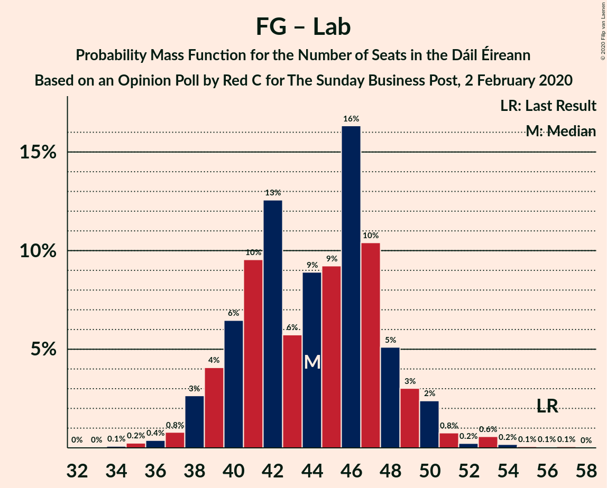

| Number of Seats | Probability | Accumulated | Special Marks |
|:---------------:|:-----------:|:-----------:|:-------------:|
| 32 | 0% | 100% |  |
| 33 | 0% | 99.9% |  |
| 34 | 0.1% | 99.9% |  |
| 35 | 0.2% | 99.8% |  |
| 36 | 0.4% | 99.6% |  |
| 37 | 0.8% | 99.2% |  |
| 38 | 3% | 98% |  |
| 39 | 4% | 96% |  |
| 40 | 6% | 92% |  |
| 41 | 10% | 85% |  |
| 42 | 13% | 76% |  |
| 43 | 6% | 63% |  |
| 44 | 9% | 57% | Median |
| 45 | 9% | 48% |  |
| 46 | 16% | 39% |  |
| 47 | 10% | 23% |  |
| 48 | 5% | 12% |  |
| 49 | 3% | 7% |  |
| 50 | 2% | 4% |  |
| 51 | 0.8% | 2% |  |
| 52 | 0.2% | 1.2% |  |
| 53 | 0.6% | 1.0% |  |
| 54 | 0.2% | 0.4% |  |
| 55 | 0.1% | 0.2% |  |
| 56 | 0.1% | 0.2% | Last Result |
| 57 | 0.1% | 0.1% |  |
| 58 | 0% | 0% |  |

### Fine Gael

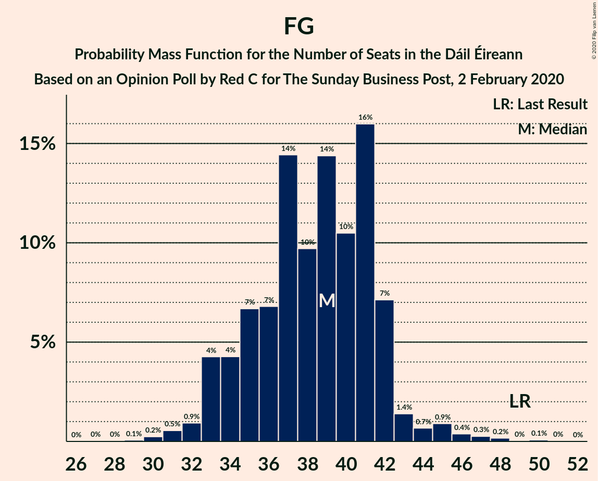

| Number of Seats | Probability | Accumulated | Special Marks |
|:---------------:|:-----------:|:-----------:|:-------------:|
| 27 | 0% | 100% |  |
| 28 | 0% | 99.9% |  |
| 29 | 0.1% | 99.9% |  |
| 30 | 0.2% | 99.8% |  |
| 31 | 0.5% | 99.6% |  |
| 32 | 0.9% | 99.0% |  |
| 33 | 4% | 98% |  |
| 34 | 4% | 94% |  |
| 35 | 7% | 90% |  |
| 36 | 7% | 83% |  |
| 37 | 14% | 76% |  |
| 38 | 10% | 62% |  |
| 39 | 14% | 52% | Median |
| 40 | 10% | 38% |  |
| 41 | 16% | 27% |  |
| 42 | 7% | 11% |  |
| 43 | 1.4% | 4% |  |
| 44 | 0.7% | 3% |  |
| 45 | 0.9% | 2% |  |
| 46 | 0.4% | 1.0% |  |
| 47 | 0.3% | 0.6% |  |
| 48 | 0.2% | 0.4% |  |
| 49 | 0% | 0.2% | Last Result |
| 50 | 0.1% | 0.1% |  |
| 51 | 0% | 0.1% |  |
| 52 | 0% | 0% |  |

## Technical Information

### Opinion Poll

+ **Polling firm:** Red C
+ **Commissioner(s):** The Sunday Business Post
+ **Fieldwork period:** 2 February 2020

### Calculations

+ **Sample size:** 1000
+ **Simulations done:** 1,048,576
+ **Error estimate:** 1.51%

