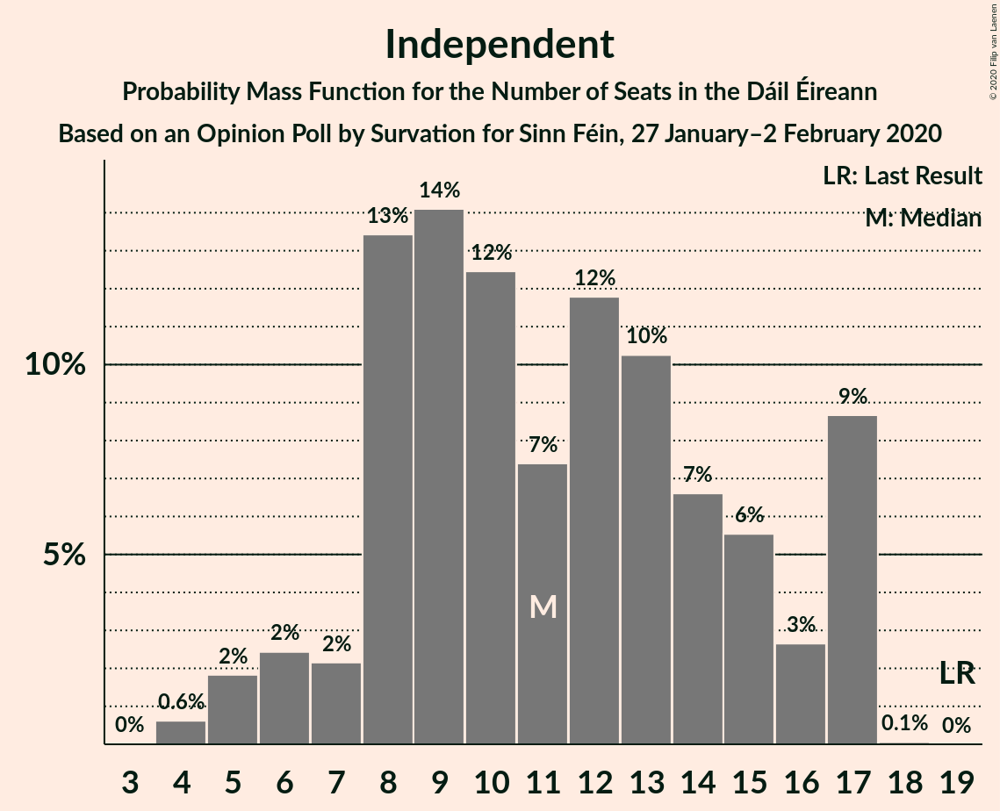
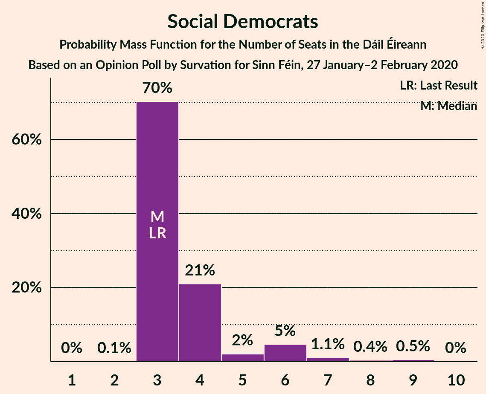
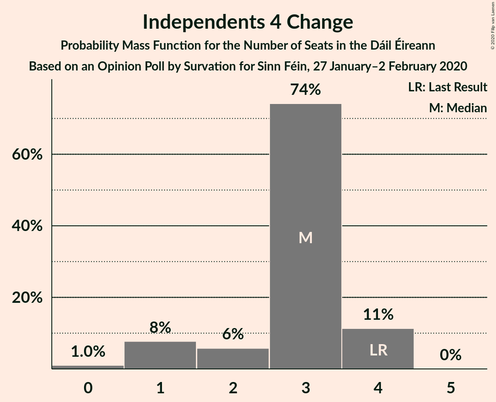
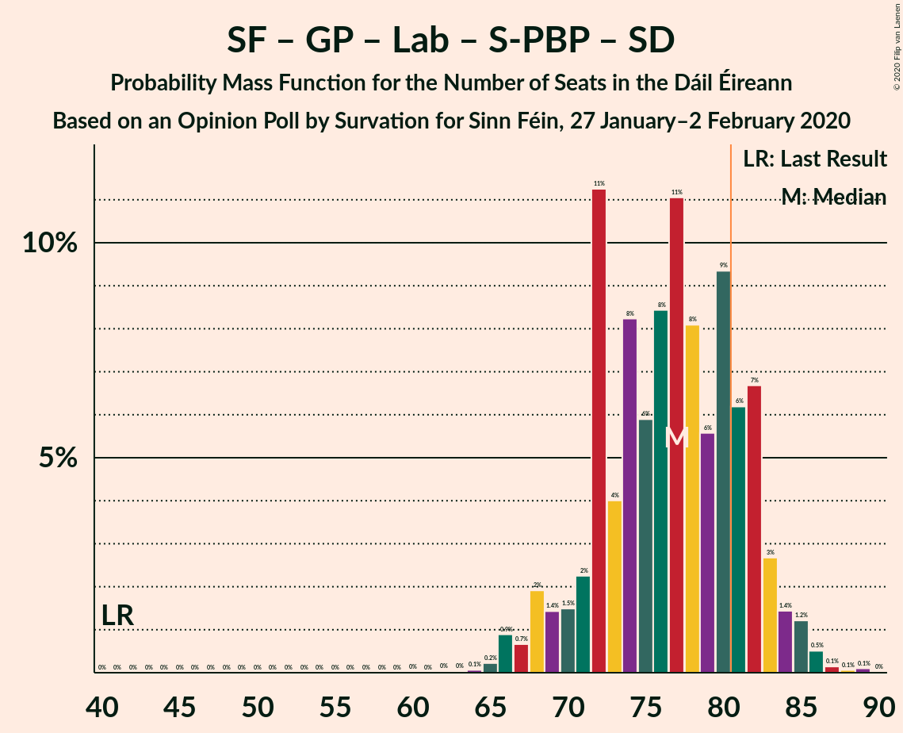
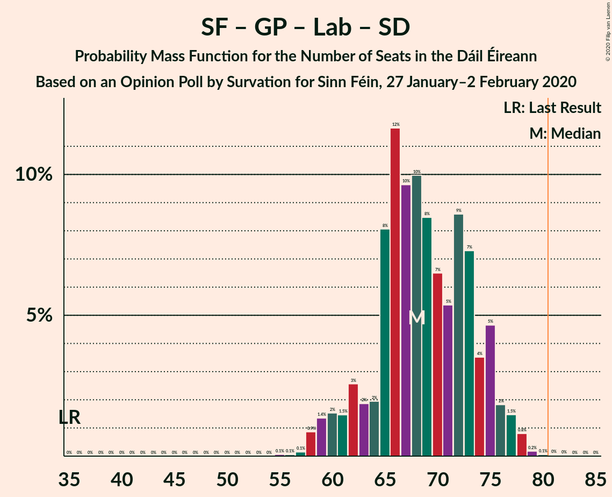
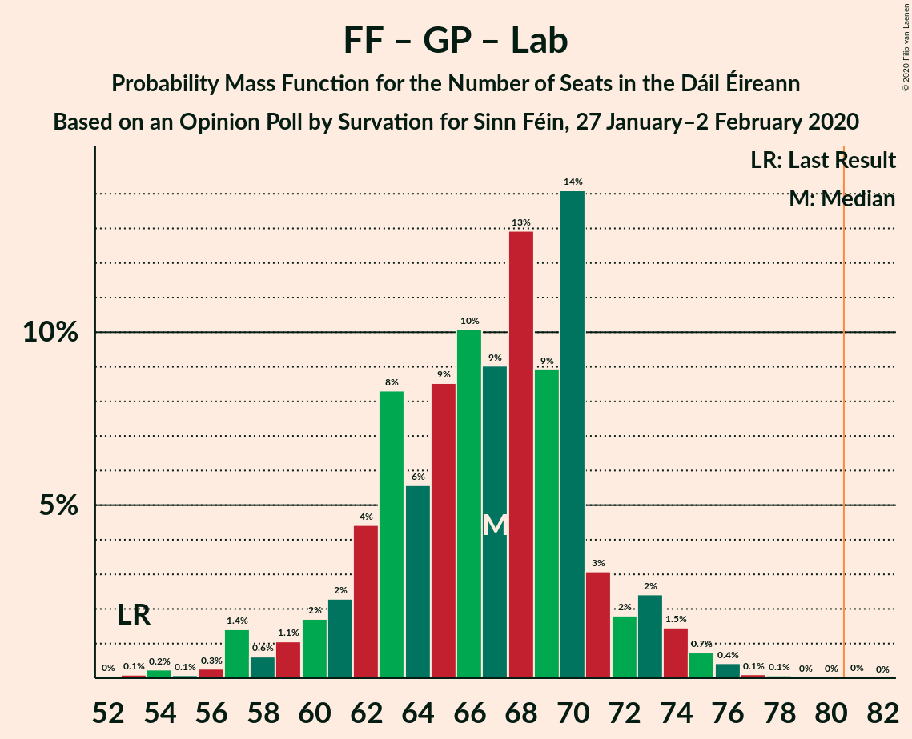

# Opinion Poll by Survation for Sinn Féin, 27 January–2 February 2020

<a href="#voting-intentions">Voting Intentions</a> | <a href="#seats">Seats</a> | <a href="#coalitions">Coalitions</a> | <a href="#technical-information">Technical Information</a>

## Voting Intentions

### Confidence Intervals

| Party | Last Result | Poll Result | 80% Confidence Interval | 90% Confidence Interval | 95% Confidence Interval | 99% Confidence Interval |
|:-----:|:-----------:|:-----------:|:-----------------------:|:-----------------------:|:-----------------------:|:-----------------------:|
| Sinn Féin | 13.8% | 25.0% | 23.4–26.8% |22.9–27.3% |22.5–27.7% |21.8–28.6% |
| Fianna Fáil | 24.3% | 22.0% | 20.4–23.7% |20.0–24.1% |19.6–24.6% |18.9–25.4% |
| Fine Gael | 25.5% | 17.0% | 15.6–18.6% |15.2–19.0% |14.9–19.4% |14.3–20.2% |
| Independent | 15.9% | 10.1% | 9.1–11.4% |8.7–11.8% |8.5–12.1% |8.0–12.7% |
| Green Party/Comhaontas Glas | 2.7% | 9.0% | 8.0–10.3% |7.7–10.6% |7.5–10.9% |7.0–11.5% |
| Labour Party | 6.6% | 6.0% | 5.1–7.0% |4.9–7.3% |4.7–7.5% |4.3–8.1% |
| Solidarity–People Before Profit | 3.9% | 5.0% | 4.3–6.0% |4.1–6.3% |3.9–6.5% |3.5–7.0% |
| Social Democrats | 3.0% | 3.0% | 2.4–3.8% |2.2–4.0% |2.1–4.2% |1.9–4.6% |
| Independents 4 Change | 1.5% | 1.3% | 0.9–1.9% |0.9–2.0% |0.8–2.2% |0.6–2.5% |

*Note:* The poll result column reflects the actual value used in the calculations. Published results may vary slightly, and in addition be rounded to fewer digits.

## Seats

### Confidence Intervals

| Party | Last Result | Median | 80% Confidence Interval | 90% Confidence Interval | 95% Confidence Interval | 99% Confidence Interval |
|:-----:|:-----------:|:------:|:-----------------------:|:-----------------------:|:-----------------------:|:-----------------------:|
| <a href="#sinn-féin">Sinn Féin</a> | 23 | 41 | 39–41 |39–42 |38–42 |38–42 |
| <a href="#fianna-fáil">Fianna Fáil</a> | 44 | 42 | 38–46 |37–47 |36–47 |33–49 |
| <a href="#fine-gael">Fine Gael</a> | 49 | 27 | 24–31 |23–33 |23–34 |20–36 |
| <a href="#independent">Independent</a> | 19 | 11 | 8–16 |7–17 |6–17 |4–17 |
| <a href="#green-party/comhaontas-glas">Green Party/Comhaontas Glas</a> | 2 | 16 | 12–19 |9–20 |9–20 |8–22 |
| <a href="#labour-party">Labour Party</a> | 7 | 9 | 4–14 |4–15 |4–15 |3–17 |
| <a href="#solidarity–people-before-profit">Solidarity–People Before Profit</a> | 6 | 8 | 5–10 |5–10 |4–10 |3–10 |
| <a href="#social-democrats">Social Democrats</a> | 3 | 3 | 3–4 |3–6 |3–6 |3–9 |
| <a href="#independents-4-change">Independents 4 Change</a> | 4 | 3 | 2–4 |1–4 |1–4 |0–4 |

### Sinn Féin

*For a full overview of the results for this party, see the [Sinn Féin](party-sinnféin.html) page.*

| Number of Seats | Probability | Accumulated | Special Marks |
|:---------------:|:-----------:|:-----------:|:-------------:|
| 23 | 0% | 100% | Last Result |
| 24 | 0% | 100% |  |
| 25 | 0% | 100% |  |
| 26 | 0% | 100% |  |
| 27 | 0% | 100% |  |
| 28 | 0% | 100% |  |
| 29 | 0% | 100% |  |
| 30 | 0% | 100% |  |
| 31 | 0% | 100% |  |
| 32 | 0% | 100% |  |
| 33 | 0% | 100% |  |
| 34 | 0% | 100% |  |
| 35 | 0% | 100% |  |
| 36 | 0% | 100% |  |
| 37 | 0.4% | 100% |  |
| 38 | 4% | 99.6% |  |
| 39 | 18% | 95% |  |
| 40 | 24% | 77% |  |
| 41 | 45% | 53% | Median |
| 42 | 8% | 8% |  |
| 43 | 0% | 0% |  |

### Fianna Fáil

*For a full overview of the results for this party, see the [Fianna Fáil](party-fiannafáil.html) page.*

| Number of Seats | Probability | Accumulated | Special Marks |
|:---------------:|:-----------:|:-----------:|:-------------:|
| 31 | 0.1% | 100% |  |
| 32 | 0.2% | 99.9% |  |
| 33 | 0.3% | 99.7% |  |
| 34 | 0.5% | 99.3% |  |
| 35 | 0.7% | 98.8% |  |
| 36 | 0.6% | 98% |  |
| 37 | 3% | 97% |  |
| 38 | 7% | 94% |  |
| 39 | 6% | 88% |  |
| 40 | 12% | 81% |  |
| 41 | 17% | 70% |  |
| 42 | 17% | 53% | Median |
| 43 | 7% | 36% |  |
| 44 | 6% | 28% | Last Result |
| 45 | 11% | 22% |  |
| 46 | 3% | 11% |  |
| 47 | 7% | 8% |  |
| 48 | 0.8% | 1.4% |  |
| 49 | 0.1% | 0.5% |  |
| 50 | 0.2% | 0.5% |  |
| 51 | 0.1% | 0.2% |  |
| 52 | 0.1% | 0.2% |  |
| 53 | 0% | 0.1% |  |
| 54 | 0% | 0.1% |  |
| 55 | 0% | 0% |  |

### Fine Gael

*For a full overview of the results for this party, see the [Fine Gael](party-finegael.html) page.*

| Number of Seats | Probability | Accumulated | Special Marks |
|:---------------:|:-----------:|:-----------:|:-------------:|
| 16 | 0.1% | 100% |  |
| 17 | 0.1% | 99.9% |  |
| 18 | 0.1% | 99.8% |  |
| 19 | 0.2% | 99.7% |  |
| 20 | 0.1% | 99.6% |  |
| 21 | 0.4% | 99.4% |  |
| 22 | 0.4% | 99.0% |  |
| 23 | 5% | 98.6% |  |
| 24 | 13% | 93% |  |
| 25 | 9% | 81% |  |
| 26 | 21% | 72% |  |
| 27 | 14% | 51% | Median |
| 28 | 11% | 37% |  |
| 29 | 7% | 26% |  |
| 30 | 4% | 19% |  |
| 31 | 7% | 15% |  |
| 32 | 3% | 8% |  |
| 33 | 2% | 5% |  |
| 34 | 2% | 3% |  |
| 35 | 0.7% | 2% |  |
| 36 | 0.7% | 0.8% |  |
| 37 | 0.1% | 0.2% |  |
| 38 | 0.1% | 0.1% |  |
| 39 | 0% | 0% |  |
| 40 | 0% | 0% |  |
| 41 | 0% | 0% |  |
| 42 | 0% | 0% |  |
| 43 | 0% | 0% |  |
| 44 | 0% | 0% |  |
| 45 | 0% | 0% |  |
| 46 | 0% | 0% |  |
| 47 | 0% | 0% |  |
| 48 | 0% | 0% |  |
| 49 | 0% | 0% | Last Result |

### Independent

*For a full overview of the results for this party, see the [Independent](party-independent.html) page.*

| Number of Seats | Probability | Accumulated | Special Marks |
|:---------------:|:-----------:|:-----------:|:-------------:|
| 4 | 0.6% | 100% |  |
| 5 | 2% | 99.4% |  |
| 6 | 2% | 98% |  |
| 7 | 2% | 95% |  |
| 8 | 13% | 93% |  |
| 9 | 14% | 80% |  |
| 10 | 12% | 65% |  |
| 11 | 7% | 53% | Median |
| 12 | 12% | 46% |  |
| 13 | 10% | 34% |  |
| 14 | 7% | 24% |  |
| 15 | 6% | 17% |  |
| 16 | 3% | 11% |  |
| 17 | 9% | 9% |  |
| 18 | 0.1% | 0.1% |  |
| 19 | 0% | 0% | Last Result |

### Green Party/Comhaontas Glas

*For a full overview of the results for this party, see the [Green Party/Comhaontas Glas](party-greenpartycomhaontasglas.html) page.*

| Number of Seats | Probability | Accumulated | Special Marks |
|:---------------:|:-----------:|:-----------:|:-------------:|
| 2 | 0% | 100% | Last Result |
| 3 | 0% | 100% |  |
| 4 | 0% | 100% |  |
| 5 | 0% | 100% |  |
| 6 | 0% | 100% |  |
| 7 | 0.1% | 100% |  |
| 8 | 0.6% | 99.9% |  |
| 9 | 4% | 99.3% |  |
| 10 | 3% | 95% |  |
| 11 | 2% | 92% |  |
| 12 | 5% | 91% |  |
| 13 | 7% | 86% |  |
| 14 | 11% | 79% |  |
| 15 | 13% | 68% |  |
| 16 | 14% | 55% | Median |
| 17 | 10% | 40% |  |
| 18 | 9% | 30% |  |
| 19 | 16% | 22% |  |
| 20 | 3% | 5% |  |
| 21 | 1.1% | 2% |  |
| 22 | 1.1% | 1.3% |  |
| 23 | 0.1% | 0.2% |  |
| 24 | 0.1% | 0.1% |  |
| 25 | 0% | 0.1% |  |
| 26 | 0% | 0% |  |

### Labour Party

*For a full overview of the results for this party, see the [Labour Party](party-labourparty.html) page.*

| Number of Seats | Probability | Accumulated | Special Marks |
|:---------------:|:-----------:|:-----------:|:-------------:|
| 2 | 0.3% | 100% |  |
| 3 | 2% | 99.7% |  |
| 4 | 11% | 98% |  |
| 5 | 6% | 87% |  |
| 6 | 9% | 81% |  |
| 7 | 4% | 72% | Last Result |
| 8 | 13% | 68% |  |
| 9 | 12% | 55% | Median |
| 10 | 7% | 44% |  |
| 11 | 7% | 37% |  |
| 12 | 8% | 30% |  |
| 13 | 9% | 22% |  |
| 14 | 8% | 13% |  |
| 15 | 3% | 5% |  |
| 16 | 1.0% | 2% |  |
| 17 | 1.0% | 1.4% |  |
| 18 | 0.3% | 0.4% |  |
| 19 | 0.1% | 0.1% |  |
| 20 | 0% | 0% |  |

### Solidarity–People Before Profit

*For a full overview of the results for this party, see the [Solidarity–People Before Profit](party-solidarity–peoplebeforeprofit.html) page.*

| Number of Seats | Probability | Accumulated | Special Marks |
|:---------------:|:-----------:|:-----------:|:-------------:|
| 3 | 1.4% | 100% |  |
| 4 | 2% | 98.6% |  |
| 5 | 11% | 97% |  |
| 6 | 12% | 86% | Last Result |
| 7 | 14% | 74% |  |
| 8 | 12% | 60% | Median |
| 9 | 18% | 48% |  |
| 10 | 30% | 30% |  |
| 11 | 0.1% | 0.1% |  |
| 12 | 0% | 0% |  |

### Social Democrats

*For a full overview of the results for this party, see the [Social Democrats](party-socialdemocrats.html) page.*

| Number of Seats | Probability | Accumulated | Special Marks |
|:---------------:|:-----------:|:-----------:|:-------------:|
| 2 | 0.1% | 100% |  |
| 3 | 70% | 99.9% | Last Result, Median |
| 4 | 21% | 30% |  |
| 5 | 2% | 9% |  |
| 6 | 5% | 7% |  |
| 7 | 1.1% | 2% |  |
| 8 | 0.4% | 0.9% |  |
| 9 | 0.5% | 0.5% |  |
| 10 | 0% | 0% |  |

### Independents 4 Change

*For a full overview of the results for this party, see the [Independents 4 Change](party-independents4change.html) page.*

| Number of Seats | Probability | Accumulated | Special Marks |
|:---------------:|:-----------:|:-----------:|:-------------:|
| 0 | 1.0% | 100% |  |
| 1 | 8% | 99.0% |  |
| 2 | 6% | 91% |  |
| 3 | 74% | 85% | Median |
| 4 | 11% | 11% | Last Result |
| 5 | 0% | 0% |  |

## Coalitions

### Confidence Intervals

| Coalition | Last Result | Median | Majority? | 80% Confidence Interval | 90% Confidence Interval | 95% Confidence Interval | 99% Confidence Interval |
|:---------:|:-----------:|:------:|:---------:|:-----------------------:|:-----------------------:|:-----------------------:|:-----------------------:|
| Sinn Féin – Fianna Fáil | 67 | 82 | 72% | 79–86 | 77–88 | 76–88 | 72–89 |
| Sinn Féin – Green Party/Comhaontas Glas – Labour Party – Solidarity–People Before Profit – Social Democrats | 41 | 77 | 19% | 72–82 | 69–83 | 68–84 | 66–86 |
| Sinn Féin – Green Party/Comhaontas Glas – Labour Party – Solidarity–People Before Profit | 38 | 73 | 3% | 68–79 | 66–80 | 65–81 | 62–83 |
| Fianna Fáil – Fine Gael | 93 | 68 | 0.4% | 64–74 | 62–76 | 61–78 | 59–80 |
| Fianna Fáil – Green Party/Comhaontas Glas – Labour Party – Social Democrats | 56 | 71 | 0.2% | 66–74 | 64–76 | 62–77 | 59–79 |
| Sinn Féin – Green Party/Comhaontas Glas – Labour Party – Social Democrats | 35 | 68 | 0.1% | 64–74 | 61–75 | 60–77 | 58–78 |
| Fianna Fáil – Green Party/Comhaontas Glas – Labour Party | 53 | 67 | 0.1% | 62–71 | 60–73 | 58–74 | 56–76 |
| Sinn Féin – Green Party/Comhaontas Glas – Labour Party | 32 | 65 | 0% | 60–71 | 58–72 | 56–73 | 54–75 |
| Fianna Fáil – Green Party/Comhaontas Glas | 46 | 58 | 0% | 53–61 | 51–62 | 51–63 | 48–65 |
| Fine Gael – Green Party/Comhaontas Glas – Labour Party – Social Democrats | 61 | 55 | 0% | 52–61 | 50–62 | 49–63 | 47–65 |
| Fine Gael – Green Party/Comhaontas Glas – Labour Party | 58 | 51 | 0% | 48–57 | 47–59 | 45–60 | 43–62 |
| Fianna Fáil – Labour Party | 51 | 52 | 0% | 46–56 | 45–57 | 44–58 | 40–61 |
| Fine Gael – Green Party/Comhaontas Glas | 51 | 43 | 0% | 39–47 | 38–48 | 36–48 | 34–51 |
| Fine Gael – Labour Party | 56 | 35 | 0% | 31–41 | 31–43 | 30–44 | 28–46 |
| Fine Gael | 49 | 27 | 0% | 24–31 | 23–33 | 23–34 | 20–36 |

### Sinn Féin – Fianna Fáil

| Number of Seats | Probability | Accumulated | Special Marks |
|:---------------:|:-----------:|:-----------:|:-------------:|
| 67 | 0% | 100% | Last Result |
| 68 | 0% | 100% |  |
| 69 | 0% | 100% |  |
| 70 | 0% | 100% |  |
| 71 | 0.2% | 99.9% |  |
| 72 | 0.3% | 99.7% |  |
| 73 | 0.4% | 99.4% |  |
| 74 | 0.5% | 99.0% |  |
| 75 | 0.5% | 98.5% |  |
| 76 | 2% | 98% |  |
| 77 | 2% | 96% |  |
| 78 | 3% | 95% |  |
| 79 | 7% | 92% |  |
| 80 | 14% | 85% |  |
| 81 | 13% | 72% | Majority |
| 82 | 16% | 58% |  |
| 83 | 12% | 43% | Median |
| 84 | 7% | 30% |  |
| 85 | 10% | 23% |  |
| 86 | 4% | 12% |  |
| 87 | 2% | 8% |  |
| 88 | 6% | 7% |  |
| 89 | 0.6% | 1.0% |  |
| 90 | 0.1% | 0.4% |  |
| 91 | 0.1% | 0.3% |  |
| 92 | 0.1% | 0.2% |  |
| 93 | 0.1% | 0.2% |  |
| 94 | 0% | 0.1% |  |
| 95 | 0% | 0% |  |

### Sinn Féin – Green Party/Comhaontas Glas – Labour Party – Solidarity–People Before Profit – Social Democrats

| Number of Seats | Probability | Accumulated | Special Marks |
|:---------------:|:-----------:|:-----------:|:-------------:|
| 41 | 0% | 100% | Last Result |
| 42 | 0% | 100% |  |
| 43 | 0% | 100% |  |
| 44 | 0% | 100% |  |
| 45 | 0% | 100% |  |
| 46 | 0% | 100% |  |
| 47 | 0% | 100% |  |
| 48 | 0% | 100% |  |
| 49 | 0% | 100% |  |
| 50 | 0% | 100% |  |
| 51 | 0% | 100% |  |
| 52 | 0% | 100% |  |
| 53 | 0% | 100% |  |
| 54 | 0% | 100% |  |
| 55 | 0% | 100% |  |
| 56 | 0% | 100% |  |
| 57 | 0% | 100% |  |
| 58 | 0% | 100% |  |
| 59 | 0% | 100% |  |
| 60 | 0% | 100% |  |
| 61 | 0% | 100% |  |
| 62 | 0% | 100% |  |
| 63 | 0% | 99.9% |  |
| 64 | 0.1% | 99.9% |  |
| 65 | 0.2% | 99.8% |  |
| 66 | 0.9% | 99.6% |  |
| 67 | 0.7% | 98.7% |  |
| 68 | 2% | 98% |  |
| 69 | 1.4% | 96% |  |
| 70 | 1.5% | 95% |  |
| 71 | 2% | 93% |  |
| 72 | 11% | 91% |  |
| 73 | 4% | 80% |  |
| 74 | 8% | 76% |  |
| 75 | 6% | 67% |  |
| 76 | 8% | 62% |  |
| 77 | 11% | 53% | Median |
| 78 | 8% | 42% |  |
| 79 | 6% | 34% |  |
| 80 | 9% | 28% |  |
| 81 | 6% | 19% | Majority |
| 82 | 7% | 13% |  |
| 83 | 3% | 6% |  |
| 84 | 1.4% | 4% |  |
| 85 | 1.2% | 2% |  |
| 86 | 0.5% | 0.8% |  |
| 87 | 0.1% | 0.3% |  |
| 88 | 0.1% | 0.2% |  |
| 89 | 0.1% | 0.1% |  |
| 90 | 0% | 0% |  |

### Sinn Féin – Green Party/Comhaontas Glas – Labour Party – Solidarity–People Before Profit

| Number of Seats | Probability | Accumulated | Special Marks |
|:---------------:|:-----------:|:-----------:|:-------------:|
| 38 | 0% | 100% | Last Result |
| 39 | 0% | 100% |  |
| 40 | 0% | 100% |  |
| 41 | 0% | 100% |  |
| 42 | 0% | 100% |  |
| 43 | 0% | 100% |  |
| 44 | 0% | 100% |  |
| 45 | 0% | 100% |  |
| 46 | 0% | 100% |  |
| 47 | 0% | 100% |  |
| 48 | 0% | 100% |  |
| 49 | 0% | 100% |  |
| 50 | 0% | 100% |  |
| 51 | 0% | 100% |  |
| 52 | 0% | 100% |  |
| 53 | 0% | 100% |  |
| 54 | 0% | 100% |  |
| 55 | 0% | 100% |  |
| 56 | 0% | 100% |  |
| 57 | 0% | 100% |  |
| 58 | 0% | 100% |  |
| 59 | 0% | 99.9% |  |
| 60 | 0.1% | 99.9% |  |
| 61 | 0.2% | 99.8% |  |
| 62 | 0.3% | 99.6% |  |
| 63 | 1.0% | 99.3% |  |
| 64 | 0.7% | 98% |  |
| 65 | 2% | 98% |  |
| 66 | 2% | 95% |  |
| 67 | 1.3% | 94% |  |
| 68 | 2% | 92% |  |
| 69 | 13% | 90% |  |
| 70 | 7% | 77% |  |
| 71 | 7% | 70% |  |
| 72 | 6% | 63% |  |
| 73 | 9% | 56% |  |
| 74 | 8% | 47% | Median |
| 75 | 8% | 38% |  |
| 76 | 9% | 31% |  |
| 77 | 4% | 22% |  |
| 78 | 6% | 18% |  |
| 79 | 7% | 12% |  |
| 80 | 3% | 5% |  |
| 81 | 0.9% | 3% | Majority |
| 82 | 1.0% | 2% |  |
| 83 | 0.5% | 0.7% |  |
| 84 | 0.1% | 0.3% |  |
| 85 | 0.1% | 0.2% |  |
| 86 | 0.1% | 0.1% |  |
| 87 | 0% | 0% |  |

### Fianna Fáil – Fine Gael

| Number of Seats | Probability | Accumulated | Special Marks |
|:---------------:|:-----------:|:-----------:|:-------------:|
| 56 | 0.1% | 100% |  |
| 57 | 0.1% | 99.9% |  |
| 58 | 0.2% | 99.9% |  |
| 59 | 0.4% | 99.7% |  |
| 60 | 0.6% | 99.2% |  |
| 61 | 2% | 98.7% |  |
| 62 | 2% | 97% |  |
| 63 | 3% | 95% |  |
| 64 | 6% | 91% |  |
| 65 | 8% | 85% |  |
| 66 | 8% | 77% |  |
| 67 | 6% | 69% |  |
| 68 | 14% | 64% |  |
| 69 | 9% | 50% | Median |
| 70 | 4% | 41% |  |
| 71 | 4% | 36% |  |
| 72 | 10% | 32% |  |
| 73 | 9% | 23% |  |
| 74 | 5% | 14% |  |
| 75 | 3% | 9% |  |
| 76 | 2% | 6% |  |
| 77 | 0.9% | 4% |  |
| 78 | 1.4% | 3% |  |
| 79 | 0.6% | 2% |  |
| 80 | 0.5% | 0.9% |  |
| 81 | 0.1% | 0.4% | Majority |
| 82 | 0.2% | 0.3% |  |
| 83 | 0% | 0.1% |  |
| 84 | 0% | 0% |  |
| 85 | 0% | 0% |  |
| 86 | 0% | 0% |  |
| 87 | 0% | 0% |  |
| 88 | 0% | 0% |  |
| 89 | 0% | 0% |  |
| 90 | 0% | 0% |  |
| 91 | 0% | 0% |  |
| 92 | 0% | 0% |  |
| 93 | 0% | 0% | Last Result |

### Fianna Fáil – Green Party/Comhaontas Glas – Labour Party – Social Democrats

| Number of Seats | Probability | Accumulated | Special Marks |
|:---------------:|:-----------:|:-----------:|:-------------:|
| 56 | 0.1% | 100% | Last Result |
| 57 | 0.1% | 99.9% |  |
| 58 | 0.2% | 99.8% |  |
| 59 | 0.2% | 99.6% |  |
| 60 | 1.1% | 99.4% |  |
| 61 | 0.7% | 98% |  |
| 62 | 1.1% | 98% |  |
| 63 | 1.4% | 97% |  |
| 64 | 2% | 95% |  |
| 65 | 3% | 93% |  |
| 66 | 6% | 90% |  |
| 67 | 8% | 84% |  |
| 68 | 4% | 76% |  |
| 69 | 8% | 72% |  |
| 70 | 13% | 64% | Median |
| 71 | 16% | 51% |  |
| 72 | 6% | 35% |  |
| 73 | 17% | 29% |  |
| 74 | 3% | 12% |  |
| 75 | 2% | 9% |  |
| 76 | 3% | 7% |  |
| 77 | 2% | 4% |  |
| 78 | 0.7% | 2% |  |
| 79 | 0.6% | 1.0% |  |
| 80 | 0.2% | 0.4% |  |
| 81 | 0.1% | 0.2% | Majority |
| 82 | 0% | 0.1% |  |
| 83 | 0% | 0.1% |  |
| 84 | 0% | 0.1% |  |
| 85 | 0% | 0% |  |

### Sinn Féin – Green Party/Comhaontas Glas – Labour Party – Social Democrats

| Number of Seats | Probability | Accumulated | Special Marks |
|:---------------:|:-----------:|:-----------:|:-------------:|
| 35 | 0% | 100% | Last Result |
| 36 | 0% | 100% |  |
| 37 | 0% | 100% |  |
| 38 | 0% | 100% |  |
| 39 | 0% | 100% |  |
| 40 | 0% | 100% |  |
| 41 | 0% | 100% |  |
| 42 | 0% | 100% |  |
| 43 | 0% | 100% |  |
| 44 | 0% | 100% |  |
| 45 | 0% | 100% |  |
| 46 | 0% | 100% |  |
| 47 | 0% | 100% |  |
| 48 | 0% | 100% |  |
| 49 | 0% | 100% |  |
| 50 | 0% | 100% |  |
| 51 | 0% | 100% |  |
| 52 | 0% | 100% |  |
| 53 | 0% | 100% |  |
| 54 | 0% | 100% |  |
| 55 | 0.1% | 100% |  |
| 56 | 0.1% | 99.9% |  |
| 57 | 0.1% | 99.9% |  |
| 58 | 0.9% | 99.7% |  |
| 59 | 1.4% | 98.9% |  |
| 60 | 2% | 98% |  |
| 61 | 1.5% | 96% |  |
| 62 | 3% | 95% |  |
| 63 | 2% | 92% |  |
| 64 | 2% | 90% |  |
| 65 | 8% | 88% |  |
| 66 | 12% | 80% |  |
| 67 | 10% | 68% |  |
| 68 | 10% | 59% |  |
| 69 | 8% | 49% | Median |
| 70 | 7% | 40% |  |
| 71 | 5% | 34% |  |
| 72 | 9% | 28% |  |
| 73 | 7% | 20% |  |
| 74 | 4% | 13% |  |
| 75 | 5% | 9% |  |
| 76 | 2% | 4% |  |
| 77 | 1.5% | 3% |  |
| 78 | 0.8% | 1.1% |  |
| 79 | 0.2% | 0.3% |  |
| 80 | 0.1% | 0.1% |  |
| 81 | 0% | 0.1% | Majority |
| 82 | 0% | 0% |  |

### Fianna Fáil – Green Party/Comhaontas Glas – Labour Party

| Number of Seats | Probability | Accumulated | Special Marks |
|:---------------:|:-----------:|:-----------:|:-------------:|
| 52 | 0% | 100% |  |
| 53 | 0.1% | 99.9% | Last Result |
| 54 | 0.2% | 99.8% |  |
| 55 | 0.1% | 99.6% |  |
| 56 | 0.3% | 99.5% |  |
| 57 | 1.4% | 99.2% |  |
| 58 | 0.6% | 98% |  |
| 59 | 1.1% | 97% |  |
| 60 | 2% | 96% |  |
| 61 | 2% | 94% |  |
| 62 | 4% | 92% |  |
| 63 | 8% | 88% |  |
| 64 | 6% | 79% |  |
| 65 | 9% | 74% |  |
| 66 | 10% | 65% |  |
| 67 | 9% | 55% | Median |
| 68 | 13% | 46% |  |
| 69 | 9% | 33% |  |
| 70 | 14% | 24% |  |
| 71 | 3% | 10% |  |
| 72 | 2% | 7% |  |
| 73 | 2% | 5% |  |
| 74 | 1.5% | 3% |  |
| 75 | 0.7% | 1.5% |  |
| 76 | 0.4% | 0.7% |  |
| 77 | 0.1% | 0.3% |  |
| 78 | 0.1% | 0.2% |  |
| 79 | 0% | 0.1% |  |
| 80 | 0% | 0.1% |  |
| 81 | 0% | 0.1% | Majority |
| 82 | 0% | 0% |  |

### Sinn Féin – Green Party/Comhaontas Glas – Labour Party

| Number of Seats | Probability | Accumulated | Special Marks |
|:---------------:|:-----------:|:-----------:|:-------------:|
| 32 | 0% | 100% | Last Result |
| 33 | 0% | 100% |  |
| 34 | 0% | 100% |  |
| 35 | 0% | 100% |  |
| 36 | 0% | 100% |  |
| 37 | 0% | 100% |  |
| 38 | 0% | 100% |  |
| 39 | 0% | 100% |  |
| 40 | 0% | 100% |  |
| 41 | 0% | 100% |  |
| 42 | 0% | 100% |  |
| 43 | 0% | 100% |  |
| 44 | 0% | 100% |  |
| 45 | 0% | 100% |  |
| 46 | 0% | 100% |  |
| 47 | 0% | 100% |  |
| 48 | 0% | 100% |  |
| 49 | 0% | 100% |  |
| 50 | 0% | 100% |  |
| 51 | 0.1% | 100% |  |
| 52 | 0% | 99.9% |  |
| 53 | 0.1% | 99.9% |  |
| 54 | 0.4% | 99.8% |  |
| 55 | 1.3% | 99.4% |  |
| 56 | 2% | 98% |  |
| 57 | 1.3% | 97% |  |
| 58 | 1.4% | 95% |  |
| 59 | 3% | 94% |  |
| 60 | 2% | 91% |  |
| 61 | 5% | 89% |  |
| 62 | 11% | 84% |  |
| 63 | 10% | 73% |  |
| 64 | 10% | 63% |  |
| 65 | 6% | 53% |  |
| 66 | 11% | 47% | Median |
| 67 | 3% | 36% |  |
| 68 | 6% | 32% |  |
| 69 | 10% | 26% |  |
| 70 | 6% | 16% |  |
| 71 | 4% | 11% |  |
| 72 | 3% | 6% |  |
| 73 | 1.3% | 3% |  |
| 74 | 1.3% | 2% |  |
| 75 | 0.7% | 0.8% |  |
| 76 | 0.1% | 0.2% |  |
| 77 | 0.1% | 0.1% |  |
| 78 | 0% | 0% |  |

### Fianna Fáil – Green Party/Comhaontas Glas

| Number of Seats | Probability | Accumulated | Special Marks |
|:---------------:|:-----------:|:-----------:|:-------------:|
| 45 | 0.1% | 100% |  |
| 46 | 0.1% | 99.8% | Last Result |
| 47 | 0.2% | 99.7% |  |
| 48 | 0.4% | 99.6% |  |
| 49 | 0.5% | 99.2% |  |
| 50 | 0.7% | 98.6% |  |
| 51 | 3% | 98% |  |
| 52 | 3% | 95% |  |
| 53 | 5% | 92% |  |
| 54 | 5% | 87% |  |
| 55 | 8% | 82% |  |
| 56 | 6% | 74% |  |
| 57 | 12% | 68% |  |
| 58 | 14% | 56% | Median |
| 59 | 12% | 42% |  |
| 60 | 14% | 30% |  |
| 61 | 8% | 15% |  |
| 62 | 3% | 7% |  |
| 63 | 2% | 4% |  |
| 64 | 1.4% | 2% |  |
| 65 | 0.4% | 0.7% |  |
| 66 | 0.1% | 0.3% |  |
| 67 | 0.1% | 0.3% |  |
| 68 | 0.1% | 0.2% |  |
| 69 | 0% | 0.1% |  |
| 70 | 0% | 0.1% |  |
| 71 | 0% | 0% |  |

### Fine Gael – Green Party/Comhaontas Glas – Labour Party – Social Democrats

| Number of Seats | Probability | Accumulated | Special Marks |
|:---------------:|:-----------:|:-----------:|:-------------:|
| 43 | 0% | 100% |  |
| 44 | 0.1% | 99.9% |  |
| 45 | 0.1% | 99.8% |  |
| 46 | 0.1% | 99.7% |  |
| 47 | 0.7% | 99.6% |  |
| 48 | 0.8% | 99.0% |  |
| 49 | 3% | 98% |  |
| 50 | 2% | 96% |  |
| 51 | 3% | 93% |  |
| 52 | 10% | 90% |  |
| 53 | 15% | 80% |  |
| 54 | 6% | 65% |  |
| 55 | 20% | 59% | Median |
| 56 | 7% | 39% |  |
| 57 | 6% | 32% |  |
| 58 | 6% | 26% |  |
| 59 | 3% | 20% |  |
| 60 | 7% | 18% |  |
| 61 | 2% | 11% | Last Result |
| 62 | 6% | 9% |  |
| 63 | 2% | 3% |  |
| 64 | 0.6% | 1.3% |  |
| 65 | 0.4% | 0.7% |  |
| 66 | 0.1% | 0.3% |  |
| 67 | 0.2% | 0.2% |  |
| 68 | 0% | 0.1% |  |
| 69 | 0% | 0% |  |

### Fine Gael – Green Party/Comhaontas Glas – Labour Party

| Number of Seats | Probability | Accumulated | Special Marks |
|:---------------:|:-----------:|:-----------:|:-------------:|
| 39 | 0% | 100% |  |
| 40 | 0% | 99.9% |  |
| 41 | 0.1% | 99.9% |  |
| 42 | 0.1% | 99.8% |  |
| 43 | 0.4% | 99.7% |  |
| 44 | 0.5% | 99.2% |  |
| 45 | 1.4% | 98.7% |  |
| 46 | 2% | 97% |  |
| 47 | 3% | 95% |  |
| 48 | 4% | 93% |  |
| 49 | 17% | 89% |  |
| 50 | 13% | 72% |  |
| 51 | 9% | 59% |  |
| 52 | 16% | 50% | Median |
| 53 | 4% | 34% |  |
| 54 | 7% | 31% |  |
| 55 | 6% | 23% |  |
| 56 | 3% | 18% |  |
| 57 | 6% | 15% |  |
| 58 | 3% | 9% | Last Result |
| 59 | 3% | 6% |  |
| 60 | 2% | 3% |  |
| 61 | 0.3% | 0.9% |  |
| 62 | 0.3% | 0.6% |  |
| 63 | 0.1% | 0.3% |  |
| 64 | 0.1% | 0.2% |  |
| 65 | 0% | 0.1% |  |
| 66 | 0% | 0% |  |

### Fianna Fáil – Labour Party

| Number of Seats | Probability | Accumulated | Special Marks |
|:---------------:|:-----------:|:-----------:|:-------------:|
| 37 | 0.1% | 100% |  |
| 38 | 0.1% | 99.9% |  |
| 39 | 0.1% | 99.8% |  |
| 40 | 0.3% | 99.8% |  |
| 41 | 0.2% | 99.5% |  |
| 42 | 0.6% | 99.3% |  |
| 43 | 0.5% | 98.7% |  |
| 44 | 2% | 98% |  |
| 45 | 6% | 96% |  |
| 46 | 6% | 91% |  |
| 47 | 8% | 85% |  |
| 48 | 6% | 77% |  |
| 49 | 5% | 71% |  |
| 50 | 7% | 65% |  |
| 51 | 8% | 58% | Last Result, Median |
| 52 | 8% | 50% |  |
| 53 | 15% | 42% |  |
| 54 | 9% | 27% |  |
| 55 | 6% | 18% |  |
| 56 | 7% | 13% |  |
| 57 | 3% | 6% |  |
| 58 | 1.3% | 3% |  |
| 59 | 0.6% | 2% |  |
| 60 | 1.0% | 2% |  |
| 61 | 0.3% | 0.6% |  |
| 62 | 0.2% | 0.3% |  |
| 63 | 0.1% | 0.2% |  |
| 64 | 0% | 0.1% |  |
| 65 | 0% | 0.1% |  |
| 66 | 0% | 0% |  |

### Fine Gael – Green Party/Comhaontas Glas

| Number of Seats | Probability | Accumulated | Special Marks |
|:---------------:|:-----------:|:-----------:|:-------------:|
| 30 | 0% | 100% |  |
| 31 | 0.1% | 99.9% |  |
| 32 | 0% | 99.9% |  |
| 33 | 0.1% | 99.8% |  |
| 34 | 0.2% | 99.7% |  |
| 35 | 1.1% | 99.5% |  |
| 36 | 1.1% | 98% |  |
| 37 | 2% | 97% |  |
| 38 | 4% | 96% |  |
| 39 | 8% | 92% |  |
| 40 | 11% | 84% |  |
| 41 | 9% | 72% |  |
| 42 | 14% | 64% |  |
| 43 | 8% | 50% | Median |
| 44 | 9% | 42% |  |
| 45 | 12% | 33% |  |
| 46 | 7% | 22% |  |
| 47 | 9% | 15% |  |
| 48 | 4% | 6% |  |
| 49 | 1.3% | 2% |  |
| 50 | 0.7% | 1.2% |  |
| 51 | 0.2% | 0.5% | Last Result |
| 52 | 0.1% | 0.3% |  |
| 53 | 0.1% | 0.2% |  |
| 54 | 0% | 0.1% |  |
| 55 | 0% | 0% |  |

### Fine Gael – Labour Party

| Number of Seats | Probability | Accumulated | Special Marks |
|:---------------:|:-----------:|:-----------:|:-------------:|
| 24 | 0% | 100% |  |
| 25 | 0% | 99.9% |  |
| 26 | 0.2% | 99.9% |  |
| 27 | 0.2% | 99.7% |  |
| 28 | 0.1% | 99.6% |  |
| 29 | 1.3% | 99.4% |  |
| 30 | 2% | 98% |  |
| 31 | 7% | 96% |  |
| 32 | 3% | 89% |  |
| 33 | 9% | 87% |  |
| 34 | 9% | 78% |  |
| 35 | 23% | 69% |  |
| 36 | 7% | 45% | Median |
| 37 | 5% | 38% |  |
| 38 | 5% | 33% |  |
| 39 | 5% | 28% |  |
| 40 | 6% | 23% |  |
| 41 | 8% | 17% |  |
| 42 | 2% | 9% |  |
| 43 | 3% | 8% |  |
| 44 | 2% | 4% |  |
| 45 | 1.1% | 2% |  |
| 46 | 0.6% | 1.1% |  |
| 47 | 0.2% | 0.5% |  |
| 48 | 0.1% | 0.3% |  |
| 49 | 0.1% | 0.2% |  |
| 50 | 0% | 0.1% |  |
| 51 | 0% | 0% |  |
| 52 | 0% | 0% |  |
| 53 | 0% | 0% |  |
| 54 | 0% | 0% |  |
| 55 | 0% | 0% |  |
| 56 | 0% | 0% | Last Result |

### Fine Gael

| Number of Seats | Probability | Accumulated | Special Marks |
|:---------------:|:-----------:|:-----------:|:-------------:|
| 16 | 0.1% | 100% |  |
| 17 | 0.1% | 99.9% |  |
| 18 | 0.1% | 99.8% |  |
| 19 | 0.2% | 99.7% |  |
| 20 | 0.1% | 99.6% |  |
| 21 | 0.4% | 99.4% |  |
| 22 | 0.4% | 99.0% |  |
| 23 | 5% | 98.6% |  |
| 24 | 13% | 93% |  |
| 25 | 9% | 81% |  |
| 26 | 21% | 72% |  |
| 27 | 14% | 51% | Median |
| 28 | 11% | 37% |  |
| 29 | 7% | 26% |  |
| 30 | 4% | 19% |  |
| 31 | 7% | 15% |  |
| 32 | 3% | 8% |  |
| 33 | 2% | 5% |  |
| 34 | 2% | 3% |  |
| 35 | 0.7% | 2% |  |
| 36 | 0.7% | 0.8% |  |
| 37 | 0.1% | 0.2% |  |
| 38 | 0.1% | 0.1% |  |
| 39 | 0% | 0% |  |
| 40 | 0% | 0% |  |
| 41 | 0% | 0% |  |
| 42 | 0% | 0% |  |
| 43 | 0% | 0% |  |
| 44 | 0% | 0% |  |
| 45 | 0% | 0% |  |
| 46 | 0% | 0% |  |
| 47 | 0% | 0% |  |
| 48 | 0% | 0% |  |
| 49 | 0% | 0% | Last Result |

## Technical Information

### Opinion Poll

+ **Polling firm:** Survation
+ **Commissioner(s):** Sinn Féin
+ **Fieldwork period:** 27 January–2 February 2020

### Calculations

+ **Sample size:** 1074
+ **Simulations done:** 1,048,576
+ **Error estimate:** 2.44%

