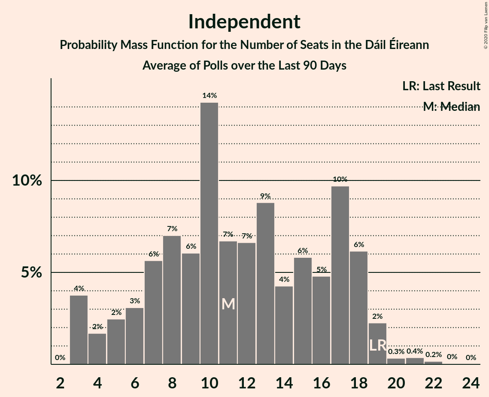
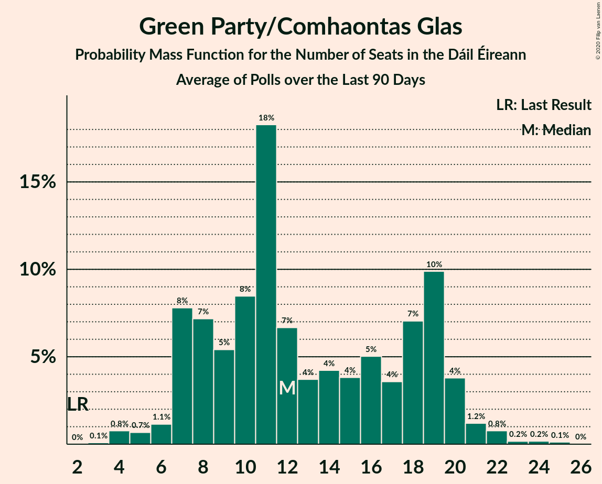
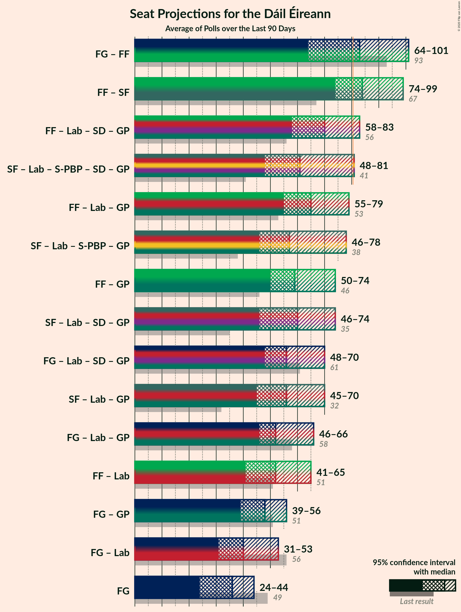
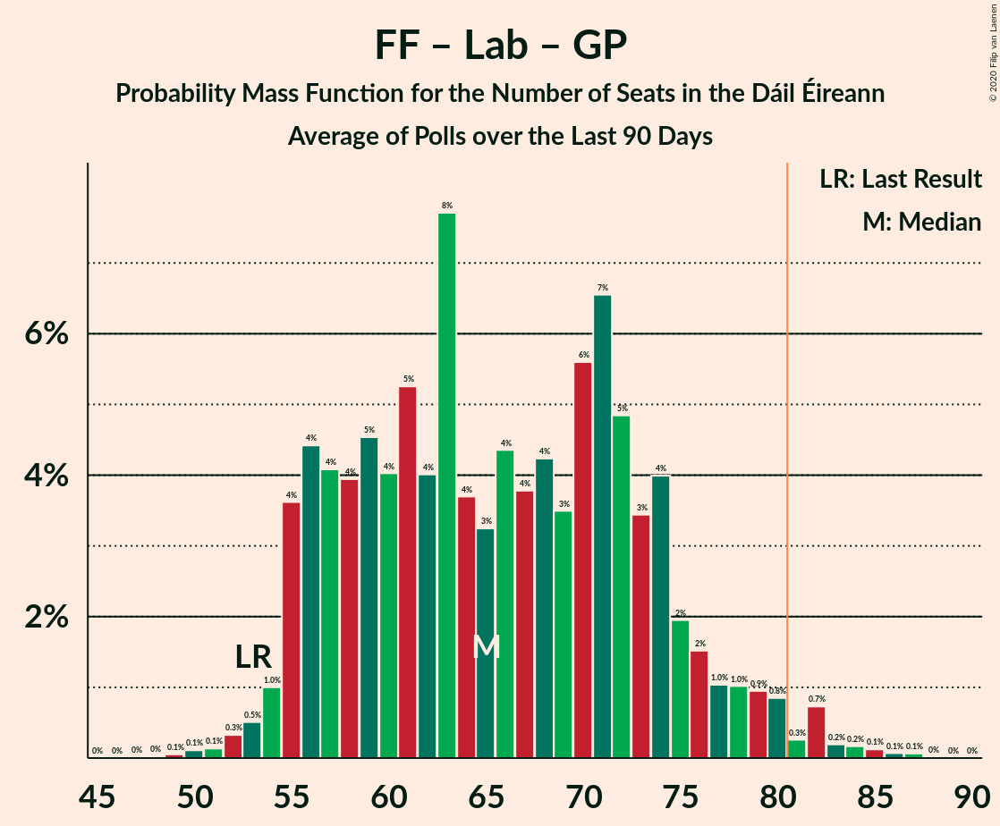

# Poll Average

<a href="#voting-intentions">Voting Intentions</a> | <a href="#seats">Seats</a> | <a href="#coalitions">Coalitions</a> | <a href="#technical-information">Technical Information</a>

## Summary

The table below lists the polls on which the average is based. They are the most recent polls (less than 90 days old) registered and analyzed so far.

| Period     | Polling firm/Commissioner(s) | FG | FF | SF | Lab | S-PBP | GP | RI | SD | I4C | I |
|:----------:|:----------------------------:|:--:|:--:|:--:|:--:|:--:|:--:|:--:|:--:|:--:|:--:|
| 26 February 2016 | General Election | 25.5%   49 | 24.3%   44 | 13.8%   23 | 6.6%   7 | 3.9%   6 | 2.7%   2 | 2.2%   0 | 3.0%   3 | 1.5%   4 | 15.9%   19 |
| N/A | Poll Average | 25–34%   54–77 | 22–30%   42–60 | 10–22%   10–36 | 4–8%   0–6 | 1–4%   0–5 | 5–10%   2–9 | 2–3%   0–2 | 1–4%   0–4 | 0–2%   0–5 | 2–14%   0–19 |
| [26 December 2019](2019-12-26-IrelandThinks.html) | Ireland Thinks   The Irish Daily Mail | 26–30%   53–62 | 23–27%   42–55 | 13–17%   18–26 | 4–6%   0–3 | 2–4%   0–3 | 6–8%   4–6 | N/A   N/A | 2–4%   3–4 | 1–2%   1–4 | 11–14%   16–18 |
| [5–17 December 2019](2019-12-17-BehaviourandAttitudes.html) | Behaviour and Attitudes   The Sunday Times | 24–30%   52–70 | 24–30%   46–60 | 18–23%   24–37 | 5–8%   0–5 | 2–4%   0–5 | 5–8%   2–5 | N/A   N/A | 1–2%   0–3 | 0–2%   0–2 | 6–9%   3–13 |
| [14–21 November 2019](2019-11-21-RedC.html) | Red C   The Sunday Business Post | 27–33%   60–73 | 21–27%   41–56 | 9–13%   9–18 | 5–8%   0–5 | 1–3%   0–2 | 6–9%   3–7 | N/A   N/A | 1–3%   0–3 | 1–3%   2–5 | 11–15%   15–20 |
| [11–13 October 2019](2019-10-13-IpsosMRBI.html) | Ipsos MRBI   The Irish Times | 30–35%   66–77 | 26–31%   49–61 | 14–18%   17–31 | 5–8%   1–7 | 1–2%   0–1 | 7–11%   4–9 | 2–3%   0–2 | 1–2%   0–3 | 0–1%   0 | 1–3%   0 |
| 26 February 2016 | General Election | 25.5%   49 | 24.3%   44 | 13.8%   23 | 6.6%   7 | 3.9%   6 | 2.7%   2 | 2.2%   0 | 3.0%   3 | 1.5%   4 | 15.9%   19 |

Only polls for which at least the sample size has been published are included in the table above.

**Legend:**
+ **Top half of each row:** Voting intentions (95% confidence interval)
+ **Bottom half of each row:** Seat projections for the Dáil Éireann (95% confidence interval)
+ **FG:** Fine Gael
+ **FF:** Fianna Fáil
+ **SF:** Sinn Féin
+ **Lab:** Labour Party
+ **S-PBP:** Solidarity–People Before Profit
+ **GP:** Green Party/Comhaontas Glas
+ **RI:** Renua Ireland
+ **SD:** Social Democrats
+ **I4C:** Independents 4 Change
+ **I:** Independent
+ **N/A (single party):** Party not included the published results
+ **N/A (entire row):** Calculation for this opinion poll not started yet

## Voting Intentions

### Confidence Intervals

| Party | Last Result | Median | 80% Confidence Interval | 90% Confidence Interval | 95% Confidence Interval | 99% Confidence Interval |
|:-----:|:-----------:|:------:|:-----------------------:|:-----------------------:|:-----------------------:|:-----------------------:|
| <a href="#fine-gael">Fine Gael</a> | 25.5% | 29.1% | 26.4–33.0% |25.7–33.8% | 25.2–34.4% | 24.2–35.4% |
| <a href="#fianna-fáil">Fianna Fáil</a> | 24.3% | 26.0% | 23.4–28.8% |22.8–29.5% | 22.3–30.0% | 21.3–31.0% |
| <a href="#independent">Independent</a> | 15.9% | 9.8% | 2.0–13.3% |1.7–13.7% | 1.6–14.0% | 1.3–14.8% |
| <a href="#sinn-féin">Sinn Féin</a> | 13.8% | 15.4% | 10.8–20.4% |10.2–21.1% | 9.8–21.7% | 9.1–22.8% |
| <a href="#labour-party">Labour Party</a> | 6.6% | 6.0% | 4.8–7.3% |4.5–7.6% | 4.3–7.9% | 4.0–8.5% |
| <a href="#solidarity–people-before-profit">Solidarity–People Before Profit</a> | 3.9% | 2.5% | 1.1–3.5% |0.9–3.7% | 0.8–4.0% | 0.6–4.4% |
| <a href="#social-democrats">Social Democrats</a> | 3.0% | 1.6% | 0.8–3.2% |0.7–3.5% | 0.6–3.7% | 0.5–4.0% |
| <a href="#green-party/comhaontas-glas">Green Party/Comhaontas Glas</a> | 2.7% | 7.1% | 5.7–9.3% |5.4–9.8% | 5.1–10.1% | 4.6–10.8% |
| <a href="#renua-ireland">Renua Ireland</a> | 2.2% | 2.3% | 1.8–2.9% |1.7–3.1% | 1.6–3.3% | 1.4–3.6% |
| <a href="#independents-4-change">Independents 4 Change</a> | 1.5% | 1.2% | 0.3–2.0% |0.2–2.1% | 0.1–2.3% | 0.1–2.7% |

### Fine Gael

*For a full overview of the results for this party, see the [Fine Gael](party-finegael.html) page.*

| Voting Intentions | Probability | Accumulated | Special Marks |
|:-----------------:|:-----------:|:-----------:|:-------------:|
| 21.5–22.5% | 0% | 100% |  |
| 22.5–23.5% | 0.1% | 100% |  |
| 23.5–24.5% | 0.8% | 99.8% |  |
| 24.5–25.5% | 3% | 99.0% |  |
| 25.5–26.5% | 8% | 96% | Last Result |
| 26.5–27.5% | 14% | 88% |  |
| 27.5–28.5% | 17% | 75% |  |
| 28.5–29.5% | 14% | 58% | Median |
| 29.5–30.5% | 11% | 44% |  |
| 30.5–31.5% | 10% | 33% |  |
| 31.5–32.5% | 9% | 23% |  |
| 32.5–33.5% | 8% | 14% |  |
| 33.5–34.5% | 4% | 6% |  |
| 34.5–35.5% | 2% | 2% |  |
| 35.5–36.5% | 0.4% | 0.4% |  |
| 36.5–37.5% | 0% | 0.1% |  |
| 37.5–38.5% | 0% | 0% |  |

### Fianna Fáil

*For a full overview of the results for this party, see the [Fianna Fáil](party-fiannafáil.html) page.*

| Voting Intentions | Probability | Accumulated | Special Marks |
|:-----------------:|:-----------:|:-----------:|:-------------:|
| 18.5–19.5% | 0% | 100% |  |
| 19.5–20.5% | 0.1% | 100% |  |
| 20.5–21.5% | 0.7% | 99.9% |  |
| 21.5–22.5% | 3% | 99.2% |  |
| 22.5–23.5% | 8% | 96% |  |
| 23.5–24.5% | 14% | 89% | Last Result |
| 24.5–25.5% | 17% | 74% |  |
| 25.5–26.5% | 16% | 57% | Median |
| 26.5–27.5% | 15% | 41% |  |
| 27.5–28.5% | 13% | 26% |  |
| 28.5–29.5% | 9% | 13% |  |
| 29.5–30.5% | 3% | 5% |  |
| 30.5–31.5% | 0.9% | 1.0% |  |
| 31.5–32.5% | 0.1% | 0.2% |  |
| 32.5–33.5% | 0% | 0% |  |

### Independent

*For a full overview of the results for this party, see the [Independent](party-independent.html) page.*

| Voting Intentions | Probability | Accumulated | Special Marks |
|:-----------------:|:-----------:|:-----------:|:-------------:|
| 0.0–0.5% | 0% | 100% |  |
| 0.5–1.5% | 2% | 100% |  |
| 1.5–2.5% | 19% | 98% |  |
| 2.5–3.5% | 3% | 78% |  |
| 3.5–4.5% | 0% | 75% |  |
| 4.5–5.5% | 0.4% | 75% |  |
| 5.5–6.5% | 5% | 75% |  |
| 6.5–7.5% | 11% | 70% |  |
| 7.5–8.5% | 7% | 59% |  |
| 8.5–9.5% | 2% | 52% |  |
| 9.5–10.5% | 1.0% | 50% | Median |
| 10.5–11.5% | 7% | 49% |  |
| 11.5–12.5% | 19% | 42% |  |
| 12.5–13.5% | 17% | 23% |  |
| 13.5–14.5% | 5% | 6% |  |
| 14.5–15.5% | 0.8% | 0.9% |  |
| 15.5–16.5% | 0.1% | 0.1% | Last Result |
| 16.5–17.5% | 0% | 0% |  |

### Sinn Féin

*For a full overview of the results for this party, see the [Sinn Féin](party-sinnféin.html) page.*

| Voting Intentions | Probability | Accumulated | Special Marks |
|:-----------------:|:-----------:|:-----------:|:-------------:|
| 6.5–7.5% | 0% | 100% |  |
| 7.5–8.5% | 0.1% | 100% |  |
| 8.5–9.5% | 1.4% | 99.9% |  |
| 9.5–10.5% | 6% | 98.6% |  |
| 10.5–11.5% | 10% | 92% |  |
| 11.5–12.5% | 6% | 83% |  |
| 12.5–13.5% | 3% | 77% |  |
| 13.5–14.5% | 9% | 74% | Last Result |
| 14.5–15.5% | 18% | 65% | Median |
| 15.5–16.5% | 15% | 47% |  |
| 16.5–17.5% | 6% | 32% |  |
| 17.5–18.5% | 4% | 26% |  |
| 18.5–19.5% | 6% | 22% |  |
| 19.5–20.5% | 7% | 16% |  |
| 20.5–21.5% | 5% | 9% |  |
| 21.5–22.5% | 2% | 3% |  |
| 22.5–23.5% | 0.6% | 0.7% |  |
| 23.5–24.5% | 0.1% | 0.1% |  |
| 24.5–25.5% | 0% | 0% |  |

### Labour Party

*For a full overview of the results for this party, see the [Labour Party](party-labourparty.html) page.*

| Voting Intentions | Probability | Accumulated | Special Marks |
|:-----------------:|:-----------:|:-----------:|:-------------:|
| 2.5–3.5% | 0% | 100% |  |
| 3.5–4.5% | 6% | 100% |  |
| 4.5–5.5% | 28% | 94% |  |
| 5.5–6.5% | 37% | 66% | Median |
| 6.5–7.5% | 23% | 29% | Last Result |
| 7.5–8.5% | 5% | 6% |  |
| 8.5–9.5% | 0.4% | 0.4% |  |
| 9.5–10.5% | 0% | 0% |  |

### Solidarity–People Before Profit

*For a full overview of the results for this party, see the [Solidarity–People Before Profit](party-solidarity–peoplebeforeprofit.html) page.*

| Voting Intentions | Probability | Accumulated | Special Marks |
|:-----------------:|:-----------:|:-----------:|:-------------:|
| 0.0–0.5% | 0.2% | 100% |  |
| 0.5–1.5% | 25% | 99.8% |  |
| 1.5–2.5% | 28% | 75% | Median |
| 2.5–3.5% | 39% | 47% |  |
| 3.5–4.5% | 8% | 9% | Last Result |
| 4.5–5.5% | 0.3% | 0.3% |  |
| 5.5–6.5% | 0% | 0% |  |

### Social Democrats

*For a full overview of the results for this party, see the [Social Democrats](party-socialdemocrats.html) page.*

| Voting Intentions | Probability | Accumulated | Special Marks |
|:-----------------:|:-----------:|:-----------:|:-------------:|
| 0.0–0.5% | 1.1% | 100% |  |
| 0.5–1.5% | 47% | 98.9% |  |
| 1.5–2.5% | 26% | 52% | Median |
| 2.5–3.5% | 23% | 26% | Last Result |
| 3.5–4.5% | 4% | 4% |  |
| 4.5–5.5% | 0% | 0% |  |

### Green Party/Comhaontas Glas

*For a full overview of the results for this party, see the [Green Party/Comhaontas Glas](party-greenpartycomhaontasglas.html) page.*

| Voting Intentions | Probability | Accumulated | Special Marks |
|:-----------------:|:-----------:|:-----------:|:-------------:|
| 2.5–3.5% | 0% | 100% | Last Result |
| 3.5–4.5% | 0.5% | 100% |  |
| 4.5–5.5% | 7% | 99.5% |  |
| 5.5–6.5% | 23% | 93% |  |
| 6.5–7.5% | 32% | 69% | Median |
| 7.5–8.5% | 18% | 38% |  |
| 8.5–9.5% | 13% | 20% |  |
| 9.5–10.5% | 6% | 7% |  |
| 10.5–11.5% | 1.0% | 1.0% |  |
| 11.5–12.5% | 0.1% | 0.1% |  |
| 12.5–13.5% | 0% | 0% |  |

### Renua Ireland

*For a full overview of the results for this party, see the [Renua Ireland](party-renuaireland.html) page.*

| Voting Intentions | Probability | Accumulated | Special Marks |
|:-----------------:|:-----------:|:-----------:|:-------------:|
| 0.0–0.5% | 0% | 100% |  |
| 0.5–1.5% | 2% | 100% |  |
| 1.5–2.5% | 68% | 98% | Last Result, Median |
| 2.5–3.5% | 29% | 29% |  |
| 3.5–4.5% | 0.6% | 0.6% |  |
| 4.5–5.5% | 0% | 0% |  |

### Independents 4 Change

*For a full overview of the results for this party, see the [Independents 4 Change](party-independents4change.html) page.*

| Voting Intentions | Probability | Accumulated | Special Marks |
|:-----------------:|:-----------:|:-----------:|:-------------:|
| 0.0–0.5% | 24% | 100% |  |
| 0.5–1.5% | 45% | 76% | Median |
| 1.5–2.5% | 30% | 31% | Last Result |
| 2.5–3.5% | 0.9% | 0.9% |  |
| 3.5–4.5% | 0% | 0% |  |

## Seats

### Confidence Intervals

| Party | Last Result | Median | 80% Confidence Interval | 90% Confidence Interval | 95% Confidence Interval | 99% Confidence Interval |
|:-----:|:-----------:|:------:|:-----------------------:|:-----------------------:|:-----------------------:|:-----------------------:|
| <a href="#fine-gael">Fine Gael</a> | 49 | 65 | 56–75 |55–77 | 54–77 | 50–77 |
| <a href="#fianna-fáil">Fianna Fáil</a> | 44 | 54 | 45–58 |43–59 | 42–60 | 40–62 |
| <a href="#independent">Independent</a> | 19 | 14 | 0–17 |0–19 | 0–19 | 0–21 |
| <a href="#sinn-féin">Sinn Féin</a> | 23 | 20 | 12–35 |11–36 | 10–36 | 9–37 |
| <a href="#labour-party">Labour Party</a> | 7 | 2 | 1–5 |1–5 | 0–6 | 0–8 |
| <a href="#solidarity–people-before-profit">Solidarity–People Before Profit</a> | 6 | 1 | 0–3 |0–3 | 0–5 | 0–5 |
| <a href="#social-democrats">Social Democrats</a> | 3 | 2 | 0–3 |0–3 | 0–4 | 0–4 |
| <a href="#green-party/comhaontas-glas">Green Party/Comhaontas Glas</a> | 2 | 5 | 3–6 |2–7 | 2–9 | 2–9 |
| <a href="#renua-ireland">Renua Ireland</a> | 0 | 0 | 0–1 |0–2 | 0–2 | 0–2 |
| <a href="#independents-4-change">Independents 4 Change</a> | 4 | 2 | 0–4 |0–5 | 0–5 | 0–5 |

### Fine Gael

*For a full overview of the results for this party, see the [Fine Gael](party-finegael.html) page.*

| Number of Seats | Probability | Accumulated | Special Marks |
|:---------------:|:-----------:|:-----------:|:-------------:|
| 46 | 0% | 100% |  |
| 47 | 0% | 99.9% |  |
| 48 | 0.2% | 99.9% |  |
| 49 | 0.2% | 99.7% | Last Result |
| 50 | 0.1% | 99.5% |  |
| 51 | 0.3% | 99.5% |  |
| 52 | 0.6% | 99.2% |  |
| 53 | 0.9% | 98.6% |  |
| 54 | 0.7% | 98% |  |
| 55 | 4% | 97% |  |
| 56 | 23% | 93% |  |
| 57 | 2% | 70% |  |
| 58 | 1.3% | 67% |  |
| 59 | 3% | 66% |  |
| 60 | 2% | 63% |  |
| 61 | 2% | 61% |  |
| 62 | 3% | 59% |  |
| 63 | 4% | 56% |  |
| 64 | 1.3% | 52% |  |
| 65 | 9% | 50% | Median |
| 66 | 2% | 42% |  |
| 67 | 2% | 40% |  |
| 68 | 5% | 37% |  |
| 69 | 3% | 32% |  |
| 70 | 3% | 29% |  |
| 71 | 8% | 26% |  |
| 72 | 4% | 17% |  |
| 73 | 2% | 14% |  |
| 74 | 2% | 12% |  |
| 75 | 4% | 10% |  |
| 76 | 0.6% | 6% |  |
| 77 | 5% | 6% |  |
| 78 | 0.3% | 0.3% |  |
| 79 | 0% | 0% |  |

### Fianna Fáil

*For a full overview of the results for this party, see the [Fianna Fáil](party-fiannafáil.html) page.*

| Number of Seats | Probability | Accumulated | Special Marks |
|:---------------:|:-----------:|:-----------:|:-------------:|
| 38 | 0.1% | 100% |  |
| 39 | 0.1% | 99.9% |  |
| 40 | 0.6% | 99.8% |  |
| 41 | 1.0% | 99.2% |  |
| 42 | 2% | 98% |  |
| 43 | 2% | 96% |  |
| 44 | 3% | 95% | Last Result |
| 45 | 2% | 91% |  |
| 46 | 5% | 89% |  |
| 47 | 1.3% | 85% |  |
| 48 | 2% | 84% |  |
| 49 | 4% | 81% |  |
| 50 | 3% | 78% |  |
| 51 | 1.1% | 75% |  |
| 52 | 6% | 73% |  |
| 53 | 15% | 67% |  |
| 54 | 25% | 52% | Median |
| 55 | 6% | 27% |  |
| 56 | 5% | 21% |  |
| 57 | 4% | 16% |  |
| 58 | 4% | 12% |  |
| 59 | 5% | 8% |  |
| 60 | 2% | 4% |  |
| 61 | 1.0% | 2% |  |
| 62 | 0.6% | 0.7% |  |
| 63 | 0% | 0.1% |  |
| 64 | 0% | 0% |  |

### Independent

*For a full overview of the results for this party, see the [Independent](party-independent.html) page.*

| Number of Seats | Probability | Accumulated | Special Marks |
|:---------------:|:-----------:|:-----------:|:-------------:|
| 0 | 25% | 100% |  |
| 1 | 0.3% | 75% |  |
| 2 | 0.1% | 75% |  |
| 3 | 1.4% | 75% |  |
| 4 | 9% | 74% |  |
| 5 | 4% | 65% |  |
| 6 | 2% | 61% |  |
| 7 | 2% | 58% |  |
| 8 | 4% | 56% |  |
| 9 | 0.4% | 52% |  |
| 10 | 0.3% | 52% |  |
| 11 | 0.6% | 52% |  |
| 12 | 0.3% | 51% |  |
| 13 | 0.7% | 51% |  |
| 14 | 0.4% | 50% | Median |
| 15 | 6% | 50% |  |
| 16 | 28% | 43% |  |
| 17 | 7% | 15% |  |
| 18 | 2% | 7% |  |
| 19 | 4% | 6% | Last Result |
| 20 | 0.7% | 1.2% |  |
| 21 | 0.1% | 0.5% |  |
| 22 | 0.3% | 0.4% |  |
| 23 | 0.1% | 0.1% |  |
| 24 | 0% | 0% |  |

### Sinn Féin

*For a full overview of the results for this party, see the [Sinn Féin](party-sinnféin.html) page.*

| Number of Seats | Probability | Accumulated | Special Marks |
|:---------------:|:-----------:|:-----------:|:-------------:|
| 8 | 0.4% | 100% |  |
| 9 | 0.6% | 99.6% |  |
| 10 | 3% | 99.0% |  |
| 11 | 3% | 96% |  |
| 12 | 7% | 94% |  |
| 13 | 0.7% | 86% |  |
| 14 | 2% | 86% |  |
| 15 | 2% | 83% |  |
| 16 | 1.0% | 81% |  |
| 17 | 6% | 80% |  |
| 18 | 3% | 74% |  |
| 19 | 1.3% | 72% |  |
| 20 | 25% | 70% | Median |
| 21 | 7% | 45% |  |
| 22 | 0.9% | 38% |  |
| 23 | 3% | 37% | Last Result |
| 24 | 3% | 34% |  |
| 25 | 2% | 31% |  |
| 26 | 3% | 29% |  |
| 27 | 3% | 26% |  |
| 28 | 0.8% | 23% |  |
| 29 | 0.9% | 22% |  |
| 30 | 2% | 21% |  |
| 31 | 2% | 19% |  |
| 32 | 1.1% | 17% |  |
| 33 | 3% | 16% |  |
| 34 | 2% | 13% |  |
| 35 | 6% | 12% |  |
| 36 | 4% | 5% |  |
| 37 | 0.7% | 1.1% |  |
| 38 | 0.1% | 0.3% |  |
| 39 | 0.1% | 0.2% |  |
| 40 | 0.1% | 0.1% |  |
| 41 | 0% | 0% |  |

### Labour Party

*For a full overview of the results for this party, see the [Labour Party](party-labourparty.html) page.*

| Number of Seats | Probability | Accumulated | Special Marks |
|:---------------:|:-----------:|:-----------:|:-------------:|
| 0 | 5% | 100% |  |
| 1 | 32% | 95% |  |
| 2 | 26% | 63% | Median |
| 3 | 16% | 38% |  |
| 4 | 9% | 22% |  |
| 5 | 9% | 12% |  |
| 6 | 0.7% | 3% |  |
| 7 | 1.2% | 2% | Last Result |
| 8 | 0.6% | 1.1% |  |
| 9 | 0.3% | 0.4% |  |
| 10 | 0.1% | 0.1% |  |
| 11 | 0% | 0% |  |

### Solidarity–People Before Profit

*For a full overview of the results for this party, see the [Solidarity–People Before Profit](party-solidarity–peoplebeforeprofit.html) page.*

| Number of Seats | Probability | Accumulated | Special Marks |
|:---------------:|:-----------:|:-----------:|:-------------:|
| 0 | 50% | 100% |  |
| 1 | 16% | 50% | Median |
| 2 | 8% | 34% |  |
| 3 | 23% | 27% |  |
| 4 | 0.5% | 4% |  |
| 5 | 3% | 3% |  |
| 6 | 0.1% | 0.2% | Last Result |
| 7 | 0.1% | 0.1% |  |
| 8 | 0% | 0.1% |  |
| 9 | 0% | 0% |  |

### Social Democrats

*For a full overview of the results for this party, see the [Social Democrats](party-socialdemocrats.html) page.*

| Number of Seats | Probability | Accumulated | Special Marks |
|:---------------:|:-----------:|:-----------:|:-------------:|
| 0 | 42% | 100% |  |
| 1 | 5% | 58% |  |
| 2 | 7% | 53% | Median |
| 3 | 43% | 46% | Last Result |
| 4 | 3% | 3% |  |
| 5 | 0% | 0% |  |

### Green Party/Comhaontas Glas

*For a full overview of the results for this party, see the [Green Party/Comhaontas Glas](party-greenpartycomhaontasglas.html) page.*

| Number of Seats | Probability | Accumulated | Special Marks |
|:---------------:|:-----------:|:-----------:|:-------------:|
| 1 | 0.1% | 100% |  |
| 2 | 8% | 99.9% | Last Result |
| 3 | 8% | 92% |  |
| 4 | 12% | 84% |  |
| 5 | 53% | 72% | Median |
| 6 | 10% | 20% |  |
| 7 | 5% | 10% |  |
| 8 | 2% | 4% |  |
| 9 | 2% | 3% |  |
| 10 | 0.2% | 0.3% |  |
| 11 | 0% | 0.1% |  |
| 12 | 0% | 0.1% |  |
| 13 | 0.1% | 0.1% |  |
| 14 | 0% | 0% |  |

### Renua Ireland

*For a full overview of the results for this party, see the [Renua Ireland](party-renuaireland.html) page.*

| Number of Seats | Probability | Accumulated | Special Marks |
|:---------------:|:-----------:|:-----------:|:-------------:|
| 0 | 81% | 100% | Last Result, Median |
| 1 | 13% | 19% |  |
| 2 | 6% | 6% |  |
| 3 | 0% | 0% |  |

### Independents 4 Change

*For a full overview of the results for this party, see the [Independents 4 Change](party-independents4change.html) page.*

| Number of Seats | Probability | Accumulated | Special Marks |
|:---------------:|:-----------:|:-----------:|:-------------:|
| 0 | 37% | 100% |  |
| 1 | 11% | 63% |  |
| 2 | 36% | 52% | Median |
| 3 | 5% | 16% |  |
| 4 | 2% | 11% | Last Result |
| 5 | 9% | 9% |  |
| 6 | 0% | 0% |  |

## Coalitions

### Confidence Intervals

| Coalition | Last Result | Median | Majority? | 80% Confidence Interval | 90% Confidence Interval | 95% Confidence Interval | 99% Confidence Interval |
|:---------:|:-----------:|:------:|:---------:|:-----------------------:|:-----------------------:|:-----------------------:|:-----------------------:|
| Fine Gael – Fianna Fáil | 93 | 114 | 100% | 110–130 | 108–130 | 104–133 | 102–133 |
| Fianna Fáil – Sinn Féin | 67 | 74 | 25% | 63–88 | 56–92 | 56–95 | 52–95 |
| Fine Gael – Labour Party – Social Democrats – Green Party/Comhaontas Glas | 61 | 73 | 22% | 63–84 | 61–87 | 60–87 | 56–89 |
| Fine Gael – Labour Party – Green Party/Comhaontas Glas | 58 | 71 | 16% | 62–84 | 59–85 | 59–87 | 55–89 |
| Fine Gael – Green Party/Comhaontas Glas | 51 | 69 | 9% | 61–79 | 58–82 | 57–83 | 54–84 |
| Fine Gael – Labour Party | 56 | 67 | 4% | 57–78 | 57–80 | 55–82 | 52–82 |
| Fine Gael | 49 | 65 | 0% | 56–75 | 55–77 | 54–77 | 50–77 |
| Fianna Fáil – Labour Party – Social Democrats – Green Party/Comhaontas Glas | 56 | 63 | 0% | 55–67 | 53–68 | 51–70 | 47–71 |
| Fianna Fáil – Labour Party – Green Party/Comhaontas Glas | 53 | 60 | 0% | 53–66 | 50–67 | 49–69 | 46–70 |
| Fianna Fáil – Green Party/Comhaontas Glas | 46 | 59 | 0% | 49–63 | 48–65 | 47–66 | 44–68 |
| Fianna Fáil – Labour Party | 51 | 55 | 0% | 48–61 | 46–62 | 45–63 | 43–64 |

### Fine Gael – Fianna Fáil

| Number of Seats | Probability | Accumulated | Special Marks |
|:---------------:|:-----------:|:-----------:|:-------------:|
| 93 | 0% | 100% | Last Result |
| 94 | 0% | 100% |  |
| 95 | 0% | 100% |  |
| 96 | 0% | 100% |  |
| 97 | 0% | 100% |  |
| 98 | 0% | 100% |  |
| 99 | 0.1% | 100% |  |
| 100 | 0.1% | 99.9% |  |
| 101 | 0.1% | 99.8% |  |
| 102 | 0.3% | 99.7% |  |
| 103 | 0.2% | 99.4% |  |
| 104 | 2% | 99.1% |  |
| 105 | 0.6% | 97% |  |
| 106 | 0.4% | 96% |  |
| 107 | 0.9% | 96% |  |
| 108 | 1.0% | 95% |  |
| 109 | 4% | 94% |  |
| 110 | 21% | 90% |  |
| 111 | 5% | 69% |  |
| 112 | 5% | 64% |  |
| 113 | 4% | 59% |  |
| 114 | 6% | 55% |  |
| 115 | 7% | 49% |  |
| 116 | 1.4% | 42% |  |
| 117 | 3% | 41% |  |
| 118 | 2% | 38% |  |
| 119 | 4% | 36% | Median |
| 120 | 0.6% | 32% |  |
| 121 | 7% | 31% |  |
| 122 | 0.6% | 24% |  |
| 123 | 2% | 24% |  |
| 124 | 2% | 21% |  |
| 125 | 2% | 19% |  |
| 126 | 1.0% | 18% |  |
| 127 | 0.7% | 17% |  |
| 128 | 3% | 16% |  |
| 129 | 2% | 13% |  |
| 130 | 6% | 11% |  |
| 131 | 0.2% | 5% |  |
| 132 | 2% | 5% |  |
| 133 | 3% | 3% |  |
| 134 | 0% | 0% |  |

### Fianna Fáil – Sinn Féin

| Number of Seats | Probability | Accumulated | Special Marks |
|:---------------:|:-----------:|:-----------:|:-------------:|
| 51 | 0.1% | 100% |  |
| 52 | 0.4% | 99.9% |  |
| 53 | 0.2% | 99.4% |  |
| 54 | 0% | 99.2% |  |
| 55 | 1.3% | 99.2% |  |
| 56 | 4% | 98% |  |
| 57 | 0.2% | 94% |  |
| 58 | 0.3% | 94% |  |
| 59 | 2% | 94% |  |
| 60 | 0.2% | 92% |  |
| 61 | 0.5% | 92% |  |
| 62 | 0.5% | 91% |  |
| 63 | 5% | 91% |  |
| 64 | 3% | 86% |  |
| 65 | 5% | 83% |  |
| 66 | 2% | 78% |  |
| 67 | 0.7% | 75% | Last Result |
| 68 | 0.3% | 75% |  |
| 69 | 0.7% | 74% |  |
| 70 | 1.2% | 74% |  |
| 71 | 0.5% | 73% |  |
| 72 | 1.4% | 72% |  |
| 73 | 5% | 71% |  |
| 74 | 20% | 66% | Median |
| 75 | 3% | 46% |  |
| 76 | 5% | 43% |  |
| 77 | 1.1% | 37% |  |
| 78 | 3% | 36% |  |
| 79 | 5% | 33% |  |
| 80 | 4% | 29% |  |
| 81 | 2% | 25% | Majority |
| 82 | 4% | 22% |  |
| 83 | 1.5% | 19% |  |
| 84 | 1.1% | 17% |  |
| 85 | 1.5% | 16% |  |
| 86 | 2% | 15% |  |
| 87 | 0.3% | 13% |  |
| 88 | 5% | 12% |  |
| 89 | 0.6% | 7% |  |
| 90 | 0.2% | 6% |  |
| 91 | 0.6% | 6% |  |
| 92 | 1.2% | 6% |  |
| 93 | 1.1% | 4% |  |
| 94 | 0.4% | 3% |  |
| 95 | 3% | 3% |  |
| 96 | 0% | 0.3% |  |
| 97 | 0.2% | 0.3% |  |
| 98 | 0.1% | 0.1% |  |
| 99 | 0% | 0% |  |

### Fine Gael – Labour Party – Social Democrats – Green Party/Comhaontas Glas

| Number of Seats | Probability | Accumulated | Special Marks |
|:---------------:|:-----------:|:-----------:|:-------------:|
| 52 | 0% | 100% |  |
| 53 | 0.1% | 99.9% |  |
| 54 | 0.2% | 99.8% |  |
| 55 | 0.1% | 99.7% |  |
| 56 | 0.1% | 99.6% |  |
| 57 | 0.1% | 99.5% |  |
| 58 | 0.5% | 99.4% |  |
| 59 | 0.8% | 98.9% |  |
| 60 | 3% | 98% |  |
| 61 | 2% | 95% | Last Result |
| 62 | 2% | 94% |  |
| 63 | 4% | 92% |  |
| 64 | 1.3% | 88% |  |
| 65 | 22% | 87% |  |
| 66 | 2% | 64% |  |
| 67 | 1.1% | 62% |  |
| 68 | 0.6% | 61% |  |
| 69 | 2% | 61% |  |
| 70 | 3% | 59% |  |
| 71 | 1.4% | 56% |  |
| 72 | 4% | 54% |  |
| 73 | 1.4% | 50% |  |
| 74 | 5% | 49% | Median |
| 75 | 1.2% | 44% |  |
| 76 | 1.5% | 43% |  |
| 77 | 1.4% | 41% |  |
| 78 | 10% | 40% |  |
| 79 | 3% | 30% |  |
| 80 | 5% | 27% |  |
| 81 | 3% | 22% | Majority |
| 82 | 2% | 19% |  |
| 83 | 5% | 17% |  |
| 84 | 5% | 13% |  |
| 85 | 2% | 8% |  |
| 86 | 0.7% | 6% |  |
| 87 | 3% | 5% |  |
| 88 | 0.6% | 2% |  |
| 89 | 0.9% | 1.0% |  |
| 90 | 0% | 0.1% |  |
| 91 | 0% | 0.1% |  |
| 92 | 0% | 0% |  |

### Fine Gael – Labour Party – Green Party/Comhaontas Glas

| Number of Seats | Probability | Accumulated | Special Marks |
|:---------------:|:-----------:|:-----------:|:-------------:|
| 50 | 0% | 100% |  |
| 51 | 0% | 99.9% |  |
| 52 | 0% | 99.9% |  |
| 53 | 0.2% | 99.9% |  |
| 54 | 0.1% | 99.7% |  |
| 55 | 0.1% | 99.6% |  |
| 56 | 0.4% | 99.5% |  |
| 57 | 0.4% | 99.0% |  |
| 58 | 0.4% | 98.7% | Last Result |
| 59 | 4% | 98% |  |
| 60 | 0.7% | 95% |  |
| 61 | 3% | 94% |  |
| 62 | 20% | 91% |  |
| 63 | 4% | 71% |  |
| 64 | 0.7% | 67% |  |
| 65 | 3% | 66% |  |
| 66 | 2% | 63% |  |
| 67 | 1.4% | 61% |  |
| 68 | 2% | 59% |  |
| 69 | 4% | 58% |  |
| 70 | 4% | 54% |  |
| 71 | 3% | 51% |  |
| 72 | 2% | 47% | Median |
| 73 | 1.3% | 45% |  |
| 74 | 2% | 44% |  |
| 75 | 6% | 42% |  |
| 76 | 5% | 36% |  |
| 77 | 2% | 31% |  |
| 78 | 3% | 30% |  |
| 79 | 3% | 27% |  |
| 80 | 7% | 23% |  |
| 81 | 2% | 16% | Majority |
| 82 | 1.0% | 14% |  |
| 83 | 0.9% | 13% |  |
| 84 | 5% | 12% |  |
| 85 | 2% | 7% |  |
| 86 | 0.3% | 5% |  |
| 87 | 3% | 5% |  |
| 88 | 0.3% | 1.2% |  |
| 89 | 0.8% | 0.9% |  |
| 90 | 0% | 0% |  |

### Fine Gael – Green Party/Comhaontas Glas

| Number of Seats | Probability | Accumulated | Special Marks |
|:---------------:|:-----------:|:-----------:|:-------------:|
| 49 | 0% | 100% |  |
| 50 | 0% | 99.9% |  |
| 51 | 0.2% | 99.9% | Last Result |
| 52 | 0% | 99.7% |  |
| 53 | 0.1% | 99.6% |  |
| 54 | 0.6% | 99.6% |  |
| 55 | 0.1% | 99.0% |  |
| 56 | 0.4% | 98.8% |  |
| 57 | 3% | 98% |  |
| 58 | 1.0% | 95% |  |
| 59 | 2% | 94% |  |
| 60 | 2% | 92% |  |
| 61 | 23% | 90% |  |
| 62 | 1.3% | 67% |  |
| 63 | 4% | 66% |  |
| 64 | 1.4% | 62% |  |
| 65 | 0.6% | 61% |  |
| 66 | 3% | 60% |  |
| 67 | 3% | 58% |  |
| 68 | 4% | 54% |  |
| 69 | 4% | 50% |  |
| 70 | 3% | 47% | Median |
| 71 | 1.0% | 43% |  |
| 72 | 5% | 43% |  |
| 73 | 5% | 37% |  |
| 74 | 3% | 32% |  |
| 75 | 3% | 29% |  |
| 76 | 7% | 26% |  |
| 77 | 3% | 19% |  |
| 78 | 3% | 16% |  |
| 79 | 3% | 13% |  |
| 80 | 1.1% | 10% |  |
| 81 | 0.5% | 9% | Majority |
| 82 | 4% | 8% |  |
| 83 | 2% | 5% |  |
| 84 | 2% | 2% |  |
| 85 | 0.1% | 0.1% |  |
| 86 | 0% | 0% |  |

### Fine Gael – Labour Party

| Number of Seats | Probability | Accumulated | Special Marks |
|:---------------:|:-----------:|:-----------:|:-------------:|
| 48 | 0.1% | 100% |  |
| 49 | 0% | 99.9% |  |
| 50 | 0.2% | 99.9% |  |
| 51 | 0.2% | 99.7% |  |
| 52 | 0.1% | 99.5% |  |
| 53 | 0.6% | 99.4% |  |
| 54 | 0.8% | 98.8% |  |
| 55 | 0.7% | 98% |  |
| 56 | 1.1% | 97% | Last Result |
| 57 | 23% | 96% |  |
| 58 | 4% | 74% |  |
| 59 | 3% | 69% |  |
| 60 | 1.1% | 67% |  |
| 61 | 2% | 66% |  |
| 62 | 3% | 64% |  |
| 63 | 0.6% | 60% |  |
| 64 | 4% | 60% |  |
| 65 | 3% | 55% |  |
| 66 | 2% | 52% |  |
| 67 | 3% | 51% | Median |
| 68 | 6% | 47% |  |
| 69 | 3% | 41% |  |
| 70 | 1.3% | 38% |  |
| 71 | 7% | 37% |  |
| 72 | 3% | 30% |  |
| 73 | 1.5% | 28% |  |
| 74 | 5% | 26% |  |
| 75 | 6% | 22% |  |
| 76 | 3% | 16% |  |
| 77 | 0.8% | 12% |  |
| 78 | 4% | 11% |  |
| 79 | 2% | 8% |  |
| 80 | 2% | 6% |  |
| 81 | 0.4% | 4% | Majority |
| 82 | 3% | 4% |  |
| 83 | 0.3% | 0.3% |  |
| 84 | 0% | 0% |  |

### Fine Gael

| Number of Seats | Probability | Accumulated | Special Marks |
|:---------------:|:-----------:|:-----------:|:-------------:|
| 46 | 0% | 100% |  |
| 47 | 0% | 99.9% |  |
| 48 | 0.2% | 99.9% |  |
| 49 | 0.2% | 99.7% | Last Result |
| 50 | 0.1% | 99.5% |  |
| 51 | 0.3% | 99.5% |  |
| 52 | 0.6% | 99.2% |  |
| 53 | 0.9% | 98.6% |  |
| 54 | 0.7% | 98% |  |
| 55 | 4% | 97% |  |
| 56 | 23% | 93% |  |
| 57 | 2% | 70% |  |
| 58 | 1.3% | 67% |  |
| 59 | 3% | 66% |  |
| 60 | 2% | 63% |  |
| 61 | 2% | 61% |  |
| 62 | 3% | 59% |  |
| 63 | 4% | 56% |  |
| 64 | 1.3% | 52% |  |
| 65 | 9% | 50% | Median |
| 66 | 2% | 42% |  |
| 67 | 2% | 40% |  |
| 68 | 5% | 37% |  |
| 69 | 3% | 32% |  |
| 70 | 3% | 29% |  |
| 71 | 8% | 26% |  |
| 72 | 4% | 17% |  |
| 73 | 2% | 14% |  |
| 74 | 2% | 12% |  |
| 75 | 4% | 10% |  |
| 76 | 0.6% | 6% |  |
| 77 | 5% | 6% |  |
| 78 | 0.3% | 0.3% |  |
| 79 | 0% | 0% |  |

### Fianna Fáil – Labour Party – Social Democrats – Green Party/Comhaontas Glas

| Number of Seats | Probability | Accumulated | Special Marks |
|:---------------:|:-----------:|:-----------:|:-------------:|
| 45 | 0% | 100% |  |
| 46 | 0.1% | 99.9% |  |
| 47 | 0.5% | 99.8% |  |
| 48 | 0.3% | 99.3% |  |
| 49 | 0.4% | 99.1% |  |
| 50 | 0.3% | 98.7% |  |
| 51 | 1.3% | 98% |  |
| 52 | 1.2% | 97% |  |
| 53 | 1.5% | 96% |  |
| 54 | 3% | 94% |  |
| 55 | 2% | 92% |  |
| 56 | 4% | 90% | Last Result |
| 57 | 4% | 85% |  |
| 58 | 4% | 81% |  |
| 59 | 7% | 78% |  |
| 60 | 5% | 71% |  |
| 61 | 6% | 66% |  |
| 62 | 3% | 61% |  |
| 63 | 32% | 57% | Median |
| 64 | 10% | 25% |  |
| 65 | 4% | 15% |  |
| 66 | 1.3% | 12% |  |
| 67 | 5% | 11% |  |
| 68 | 1.4% | 5% |  |
| 69 | 1.0% | 4% |  |
| 70 | 2% | 3% |  |
| 71 | 0.3% | 0.5% |  |
| 72 | 0.2% | 0.2% |  |
| 73 | 0% | 0.1% |  |
| 74 | 0% | 0.1% |  |
| 75 | 0% | 0% |  |

### Fianna Fáil – Labour Party – Green Party/Comhaontas Glas

| Number of Seats | Probability | Accumulated | Special Marks |
|:---------------:|:-----------:|:-----------:|:-------------:|
| 42 | 0.1% | 100% |  |
| 43 | 0.1% | 99.9% |  |
| 44 | 0.1% | 99.9% |  |
| 45 | 0.1% | 99.8% |  |
| 46 | 0.6% | 99.7% |  |
| 47 | 0.1% | 99.1% |  |
| 48 | 0.7% | 98.9% |  |
| 49 | 1.1% | 98% |  |
| 50 | 3% | 97% |  |
| 51 | 1.4% | 94% |  |
| 52 | 2% | 93% |  |
| 53 | 3% | 91% | Last Result |
| 54 | 3% | 88% |  |
| 55 | 1.4% | 85% |  |
| 56 | 5% | 84% |  |
| 57 | 4% | 79% |  |
| 58 | 5% | 75% |  |
| 59 | 4% | 70% |  |
| 60 | 25% | 66% |  |
| 61 | 9% | 41% | Median |
| 62 | 4% | 31% |  |
| 63 | 11% | 28% |  |
| 64 | 4% | 17% |  |
| 65 | 2% | 13% |  |
| 66 | 1.3% | 11% |  |
| 67 | 5% | 9% |  |
| 68 | 2% | 5% |  |
| 69 | 0.6% | 3% |  |
| 70 | 2% | 2% |  |
| 71 | 0.1% | 0.3% |  |
| 72 | 0.2% | 0.2% |  |
| 73 | 0% | 0.1% |  |
| 74 | 0% | 0% |  |

### Fianna Fáil – Green Party/Comhaontas Glas

| Number of Seats | Probability | Accumulated | Special Marks |
|:---------------:|:-----------:|:-----------:|:-------------:|
| 41 | 0.1% | 100% |  |
| 42 | 0.1% | 99.9% |  |
| 43 | 0.1% | 99.8% |  |
| 44 | 0.4% | 99.7% |  |
| 45 | 1.1% | 99.3% |  |
| 46 | 0.5% | 98% | Last Result |
| 47 | 2% | 98% |  |
| 48 | 2% | 96% |  |
| 49 | 5% | 94% |  |
| 50 | 1.4% | 89% |  |
| 51 | 0.7% | 88% |  |
| 52 | 2% | 87% |  |
| 53 | 5% | 85% |  |
| 54 | 2% | 80% |  |
| 55 | 5% | 78% |  |
| 56 | 4% | 73% |  |
| 57 | 5% | 69% |  |
| 58 | 13% | 63% |  |
| 59 | 24% | 50% | Median |
| 60 | 4% | 26% |  |
| 61 | 6% | 22% |  |
| 62 | 6% | 16% |  |
| 63 | 3% | 10% |  |
| 64 | 0.8% | 7% |  |
| 65 | 2% | 6% |  |
| 66 | 3% | 4% |  |
| 67 | 0.5% | 1.4% |  |
| 68 | 0.5% | 0.9% |  |
| 69 | 0.3% | 0.4% |  |
| 70 | 0% | 0.1% |  |
| 71 | 0.1% | 0.1% |  |
| 72 | 0% | 0% |  |

### Fianna Fáil – Labour Party

| Number of Seats | Probability | Accumulated | Special Marks |
|:---------------:|:-----------:|:-----------:|:-------------:|
| 39 | 0.1% | 100% |  |
| 40 | 0.1% | 99.9% |  |
| 41 | 0.2% | 99.8% |  |
| 42 | 0.1% | 99.6% |  |
| 43 | 0.9% | 99.5% |  |
| 44 | 0.3% | 98.6% |  |
| 45 | 3% | 98% |  |
| 46 | 1.0% | 95% |  |
| 47 | 2% | 94% |  |
| 48 | 3% | 93% |  |
| 49 | 5% | 89% |  |
| 50 | 3% | 84% |  |
| 51 | 3% | 82% | Last Result |
| 52 | 1.4% | 79% |  |
| 53 | 3% | 77% |  |
| 54 | 4% | 74% |  |
| 55 | 27% | 70% |  |
| 56 | 10% | 43% | Median |
| 57 | 6% | 33% |  |
| 58 | 9% | 27% |  |
| 59 | 4% | 18% |  |
| 60 | 4% | 14% |  |
| 61 | 3% | 11% |  |
| 62 | 5% | 7% |  |
| 63 | 0.4% | 3% |  |
| 64 | 2% | 2% |  |
| 65 | 0.1% | 0.3% |  |
| 66 | 0.1% | 0.2% |  |
| 67 | 0.1% | 0.1% |  |
| 68 | 0% | 0% |  |

## Technical Information

+ **Number of polls included in this average:** 4
+ **Lowest number of simulations done in a poll included in this average:** 131,072
+ **Total number of simulations done in the polls included in this average:** 655,360
+ **Error estimate:** 3.02%
