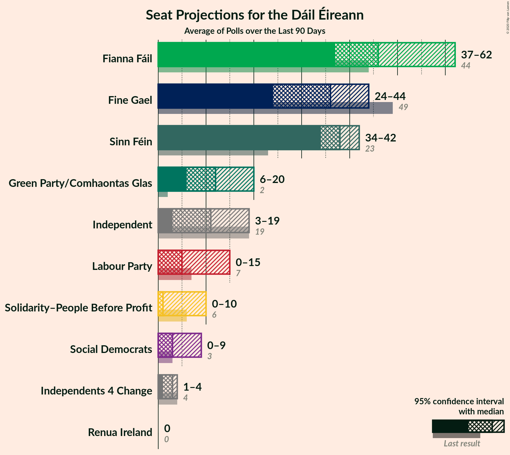
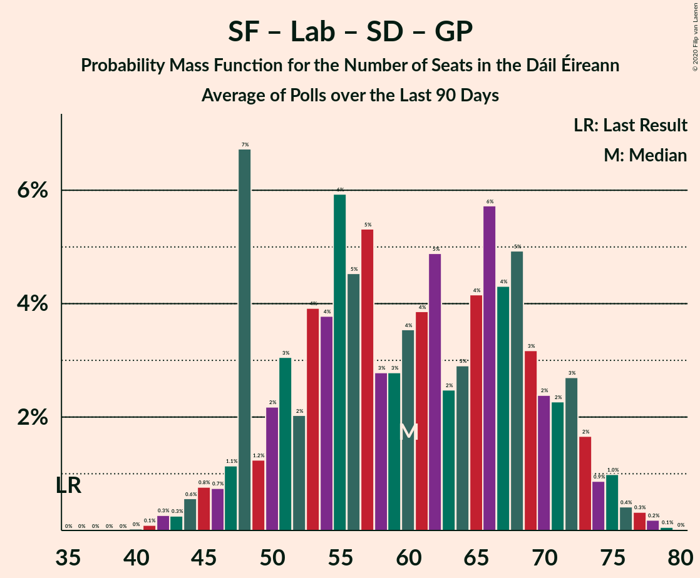

# Poll Average

<a href="#voting-intentions">Voting Intentions</a> | <a href="#seats">Seats</a> | <a href="#coalitions">Coalitions</a> | <a href="#technical-information">Technical Information</a>

## Summary

The table below lists the polls on which the average is based. They are the most recent polls (less than 90 days old) registered and analyzed so far.

| Period     | Polling firm/Commissioner(s) | FG | FF | SF | Lab | S-PBP | GP | RI | SD | I4C | I |
|:----------:|:----------------------------:|:--:|:--:|:--:|:--:|:--:|:--:|:--:|:--:|:--:|:--:|
| 26 February 2016 | General Election | 25.5%   49 | 24.3%   44 | 13.8%   23 | 6.6%   7 | 3.9%   6 | 2.7%   2 | 2.2%   0 | 3.0%   3 | 1.5%   4 | 15.9%   19 |
| N/A | Poll Average | 16–24%   24–44 | 20–34%   37–62 | 18–27%   34–42 | 3–7%   0–15 | 1–6%   0–10 | 6–12%   6–20 | 0–1%   0 | 1–6%   0–9 | 1–2%   1–4 | 8–15%   3–19 |
| [27 January–2 February 2020](2020-02-02-Survation.html) | Survation   Sinn Féin | 15–19%   23–34 | 20–25%   36–47 | 23–28%   38–42 | 5–8%   4–15 | 4–7%   4–10 | 7–11%   9–20 | N/A   N/A | 2–4%   3–6 | 1–2%   1–4 | 8–12%   6–17 |
| [30 January–1 February 2020](2020-02-01-IpsosMRBI.html) | Ipsos MRBI   The Irish Times | 18–22%   32–41 | 21–25%   40–49 | 23–28%   38–40 | 3–5%   0–7 | 1–3%   0–3 | 7–10%   7–16 | N/A   N/A | 1–3%   2–4 | 1–3%   3–4 | 12–16%   16–21 |
| [25–30 January 2020](2020-01-30-RedC.html) | Red C   The Sunday Business Post | 19–24%   33–45 | 22–27%   41–53 | 22–27%   37–42 | 4–7%   1–12 | 1–2%   0–1 | 6–9%   6–12 | N/A   N/A | 2–4%   3–8 | 1–2%   1–4 | 9–13%   7–18 |
| [24–30 January 2020](2020-01-30-Panelbase.html) | Panelbase   The Times | 17–22%   25–37 | 20–26%   34–49 | 19–24%   35–39 | 4–7%   1–11 | 4–7%   4–10 | 8–12%   10–22 | N/A   N/A | 4–7%   4–12 | 1–2%   1–4 | 8–12%   5–16 |
| [1–25 January 2020](2020-01-25-IrelandThinks.html) | Ireland Thinks   The Irish Daily Mail | 19–25%   27–46 | 24–30%   44–57 | 18–23%   34–38 | 5–8%   2–17 | 1–2%   0–1 | 8–12%   8–21 | N/A   N/A | 2–4%   3–7 | 1–2%   0–3 | 8–11%   3–15 |
| [4–14 January 2020](2020-01-14-BehaviourandAttitudes.html) | Behaviour and Attitudes   The Sunday Times | 18–23%   33–44 | 29–35%   57–65 | 17–22%   34–38 | 3–5%   0–6 | 1–3%   0–3 | 6–9%   4–14 | 0–1%   0 | 1–2%   0–3 | 1–2%   1–3 | 8–11%   4–13 |
| 26 February 2016 | General Election | 25.5%   49 | 24.3%   44 | 13.8%   23 | 6.6%   7 | 3.9%   6 | 2.7%   2 | 2.2%   0 | 3.0%   3 | 1.5%   4 | 15.9%   19 |

Only polls for which at least the sample size has been published are included in the table above.

**Legend:**
+ **Top half of each row:** Voting intentions (95% confidence interval)
+ **Bottom half of each row:** Seat projections for the Dáil Éireann (95% confidence interval)
+ **FG:** Fine Gael
+ **FF:** Fianna Fáil
+ **SF:** Sinn Féin
+ **Lab:** Labour Party
+ **S-PBP:** Solidarity–People Before Profit
+ **GP:** Green Party/Comhaontas Glas
+ **RI:** Renua Ireland
+ **SD:** Social Democrats
+ **I4C:** Independents 4 Change
+ **I:** Independent
+ **N/A (single party):** Party not included the published results
+ **N/A (entire row):** Calculation for this opinion poll not started yet

## Voting Intentions

### Confidence Intervals

| Party | Last Result | Median | 80% Confidence Interval | 90% Confidence Interval | 95% Confidence Interval | 99% Confidence Interval |
|:-----:|:-----------:|:------:|:-----------------------:|:-----------------------:|:-----------------------:|:-----------------------:|
| <a href="#fine-gael">Fine Gael</a> | 25.5% | 20.1% | 17.2–22.6% |16.4–23.2% | 15.9–23.8% | 15.0–24.8% |
| <a href="#fianna-fáil">Fianna Fáil</a> | 24.3% | 24.2% | 21.5–31.9% |21.0–33.1% | 20.5–33.9% | 19.6–35.2% |
| <a href="#independent">Independent</a> | 15.9% | 10.4% | 8.7–13.4% |8.3–14.1% | 8.0–14.6% | 7.4–15.5% |
| <a href="#sinn-féin">Sinn Féin</a> | 13.8% | 22.7% | 18.8–26.0% |18.2–26.6% | 17.7–27.1% | 16.8–28.0% |
| <a href="#labour-party">Labour Party</a> | 6.6% | 5.1% | 3.7–6.5% |3.5–6.9% | 3.2–7.2% | 2.9–7.9% |
| <a href="#solidarity–people-before-profit">Solidarity–People Before Profit</a> | 3.9% | 2.1% | 0.9–5.4% |0.7–5.8% | 0.6–6.1% | 0.5–6.7% |
| <a href="#social-democrats">Social Democrats</a> | 3.0% | 2.9% | 1.1–4.9% |0.9–5.4% | 0.7–5.8% | 0.5–6.5% |
| <a href="#green-party/comhaontas-glas">Green Party/Comhaontas Glas</a> | 2.7% | 8.5% | 6.7–10.6% |6.3–11.1% | 6.0–11.5% | 5.5–12.3% |
| <a href="#renua-ireland">Renua Ireland</a> | 2.2% | 0.4% | 0.2–0.7% |0.1–0.8% | 0.1–0.9% | 0.1–1.2% |
| <a href="#independents-4-change">Independents 4 Change</a> | 1.5% | 1.4% | 0.9–2.0% |0.8–2.2% | 0.7–2.3% | 0.6–2.6% |

### Fine Gael

*For a full overview of the results for this party, see the [Fine Gael](party-finegael.html) page.*

| Voting Intentions | Probability | Accumulated | Special Marks |
|:-----------------:|:-----------:|:-----------:|:-------------:|
| 12.5–13.5% | 0% | 100% |  |
| 13.5–14.5% | 0.2% | 100% |  |
| 14.5–15.5% | 1.3% | 99.8% |  |
| 15.5–16.5% | 4% | 98.6% |  |
| 16.5–17.5% | 8% | 94% |  |
| 17.5–18.5% | 11% | 87% |  |
| 18.5–19.5% | 16% | 76% |  |
| 19.5–20.5% | 19% | 60% | Median |
| 20.5–21.5% | 18% | 41% |  |
| 21.5–22.5% | 13% | 23% |  |
| 22.5–23.5% | 7% | 10% |  |
| 23.5–24.5% | 3% | 3% |  |
| 24.5–25.5% | 0.6% | 0.7% |  |
| 25.5–26.5% | 0.1% | 0.1% | Last Result |
| 26.5–27.5% | 0% | 0% |  |

### Fianna Fáil

*For a full overview of the results for this party, see the [Fianna Fáil](party-fiannafáil.html) page.*

| Voting Intentions | Probability | Accumulated | Special Marks |
|:-----------------:|:-----------:|:-----------:|:-------------:|
| 17.5–18.5% | 0% | 100% |  |
| 18.5–19.5% | 0.4% | 100% |  |
| 19.5–20.5% | 2% | 99.5% |  |
| 20.5–21.5% | 7% | 97% |  |
| 21.5–22.5% | 14% | 90% |  |
| 22.5–23.5% | 17% | 76% |  |
| 23.5–24.5% | 14% | 59% | Last Result, Median |
| 24.5–25.5% | 10% | 45% |  |
| 25.5–26.5% | 7% | 36% |  |
| 26.5–27.5% | 6% | 28% |  |
| 27.5–28.5% | 4% | 23% |  |
| 28.5–29.5% | 2% | 19% |  |
| 29.5–30.5% | 2% | 17% |  |
| 30.5–31.5% | 3% | 15% |  |
| 31.5–32.5% | 4% | 11% |  |
| 32.5–33.5% | 4% | 7% |  |
| 33.5–34.5% | 2% | 3% |  |
| 34.5–35.5% | 0.9% | 1.2% |  |
| 35.5–36.5% | 0.2% | 0.3% |  |
| 36.5–37.5% | 0% | 0.1% |  |
| 37.5–38.5% | 0% | 0% |  |

### Independent

*For a full overview of the results for this party, see the [Independent](party-independent.html) page.*

| Voting Intentions | Probability | Accumulated | Special Marks |
|:-----------------:|:-----------:|:-----------:|:-------------:|
| 5.5–6.5% | 0% | 100% |  |
| 6.5–7.5% | 0.7% | 100% |  |
| 7.5–8.5% | 7% | 99.3% |  |
| 8.5–9.5% | 21% | 93% |  |
| 9.5–10.5% | 27% | 72% | Median |
| 10.5–11.5% | 19% | 45% |  |
| 11.5–12.5% | 10% | 26% |  |
| 12.5–13.5% | 8% | 16% |  |
| 13.5–14.5% | 6% | 9% |  |
| 14.5–15.5% | 2% | 3% |  |
| 15.5–16.5% | 0.4% | 0.4% | Last Result |
| 16.5–17.5% | 0% | 0% |  |

### Sinn Féin

*For a full overview of the results for this party, see the [Sinn Féin](party-sinnféin.html) page.*

| Voting Intentions | Probability | Accumulated | Special Marks |
|:-----------------:|:-----------:|:-----------:|:-------------:|
| 13.5–14.5% | 0% | 100% | Last Result |
| 14.5–15.5% | 0% | 100% |  |
| 15.5–16.5% | 0.3% | 100% |  |
| 16.5–17.5% | 2% | 99.7% |  |
| 17.5–18.5% | 6% | 98% |  |
| 18.5–19.5% | 11% | 92% |  |
| 19.5–20.5% | 13% | 82% |  |
| 20.5–21.5% | 11% | 69% |  |
| 21.5–22.5% | 7% | 58% |  |
| 22.5–23.5% | 8% | 51% | Median |
| 23.5–24.5% | 13% | 43% |  |
| 24.5–25.5% | 14% | 30% |  |
| 25.5–26.5% | 10% | 16% |  |
| 26.5–27.5% | 4% | 5% |  |
| 27.5–28.5% | 1.0% | 1.2% |  |
| 28.5–29.5% | 0.2% | 0.2% |  |
| 29.5–30.5% | 0% | 0% |  |

### Labour Party

*For a full overview of the results for this party, see the [Labour Party](party-labourparty.html) page.*

| Voting Intentions | Probability | Accumulated | Special Marks |
|:-----------------:|:-----------:|:-----------:|:-------------:|
| 1.5–2.5% | 0.1% | 100% |  |
| 2.5–3.5% | 6% | 99.9% |  |
| 3.5–4.5% | 27% | 93% |  |
| 4.5–5.5% | 32% | 67% | Median |
| 5.5–6.5% | 25% | 35% |  |
| 6.5–7.5% | 9% | 10% | Last Result |
| 7.5–8.5% | 1.1% | 1.2% |  |
| 8.5–9.5% | 0.1% | 0.1% |  |
| 9.5–10.5% | 0% | 0% |  |

### Solidarity–People Before Profit

*For a full overview of the results for this party, see the [Solidarity–People Before Profit](party-solidarity–peoplebeforeprofit.html) page.*

| Voting Intentions | Probability | Accumulated | Special Marks |
|:-----------------:|:-----------:|:-----------:|:-------------:|
| 0.0–0.5% | 1.0% | 100% |  |
| 0.5–1.5% | 32% | 99.0% |  |
| 1.5–2.5% | 28% | 66% | Median |
| 2.5–3.5% | 6% | 39% |  |
| 3.5–4.5% | 7% | 33% | Last Result |
| 4.5–5.5% | 18% | 26% |  |
| 5.5–6.5% | 8% | 8% |  |
| 6.5–7.5% | 0.7% | 0.7% |  |
| 7.5–8.5% | 0% | 0% |  |

### Social Democrats

*For a full overview of the results for this party, see the [Social Democrats](party-socialdemocrats.html) page.*

| Voting Intentions | Probability | Accumulated | Special Marks |
|:-----------------:|:-----------:|:-----------:|:-------------:|
| 0.0–0.5% | 0.6% | 100% |  |
| 0.5–1.5% | 16% | 99.4% |  |
| 1.5–2.5% | 22% | 83% |  |
| 2.5–3.5% | 35% | 61% | Last Result, Median |
| 3.5–4.5% | 13% | 27% |  |
| 4.5–5.5% | 9% | 13% |  |
| 5.5–6.5% | 4% | 4% |  |
| 6.5–7.5% | 0.4% | 0.4% |  |
| 7.5–8.5% | 0% | 0% |  |

### Green Party/Comhaontas Glas

*For a full overview of the results for this party, see the [Green Party/Comhaontas Glas](party-greenpartycomhaontasglas.html) page.*

| Voting Intentions | Probability | Accumulated | Special Marks |
|:-----------------:|:-----------:|:-----------:|:-------------:|
| 2.5–3.5% | 0% | 100% | Last Result |
| 3.5–4.5% | 0% | 100% |  |
| 4.5–5.5% | 0.7% | 100% |  |
| 5.5–6.5% | 8% | 99.3% |  |
| 6.5–7.5% | 20% | 92% |  |
| 7.5–8.5% | 22% | 72% |  |
| 8.5–9.5% | 21% | 50% | Median |
| 9.5–10.5% | 18% | 29% |  |
| 10.5–11.5% | 9% | 11% |  |
| 11.5–12.5% | 2% | 2% |  |
| 12.5–13.5% | 0.2% | 0.3% |  |
| 13.5–14.5% | 0% | 0% |  |

### Renua Ireland

*For a full overview of the results for this party, see the [Renua Ireland](party-renuaireland.html) page.*

| Voting Intentions | Probability | Accumulated | Special Marks |
|:-----------------:|:-----------:|:-----------:|:-------------:|
| 0.0–0.5% | 75% | 100% | Median |
| 0.5–1.5% | 25% | 25% |  |
| 1.5–2.5% | 0% | 0% | Last Result |
| 2.5–3.5% | 0% | 0% |  |

### Independents 4 Change

*For a full overview of the results for this party, see the [Independents 4 Change](party-independents4change.html) page.*

| Voting Intentions | Probability | Accumulated | Special Marks |
|:-----------------:|:-----------:|:-----------:|:-------------:|
| 0.0–0.5% | 0.3% | 100% |  |
| 0.5–1.5% | 64% | 99.7% | Median |
| 1.5–2.5% | 35% | 35% | Last Result |
| 2.5–3.5% | 0.8% | 0.8% |  |
| 3.5–4.5% | 0% | 0% |  |

## Seats

### Confidence Intervals

| Party | Last Result | Median | 80% Confidence Interval | 90% Confidence Interval | 95% Confidence Interval | 99% Confidence Interval |
|:-----:|:-----------:|:------:|:-----------------------:|:-----------------------:|:-----------------------:|:-----------------------:|
| <a href="#fine-gael">Fine Gael</a> | 49 | 36 | 27–41 |25–43 | 24–44 | 23–47 |
| <a href="#fianna-fáil">Fianna Fáil</a> | 44 | 46 | 39–60 |38–61 | 37–62 | 34–64 |
| <a href="#independent">Independent</a> | 19 | 11 | 6–17 |4–18 | 3–19 | 3–21 |
| <a href="#sinn-féin">Sinn Féin</a> | 23 | 38 | 36–41 |35–41 | 34–42 | 34–42 |
| <a href="#labour-party">Labour Party</a> | 7 | 5 | 1–11 |0–14 | 0–15 | 0–17 |
| <a href="#solidarity–people-before-profit">Solidarity–People Before Profit</a> | 6 | 1 | 0–9 |0–10 | 0–10 | 0–10 |
| <a href="#social-democrats">Social Democrats</a> | 3 | 3 | 0–8 |0–9 | 0–9 | 0–11 |
| <a href="#green-party/comhaontas-glas">Green Party/Comhaontas Glas</a> | 2 | 12 | 7–19 |7–20 | 6–20 | 4–22 |
| <a href="#renua-ireland">Renua Ireland</a> | 0 | 0 | 0 |0 | 0 | 0 |
| <a href="#independents-4-change">Independents 4 Change</a> | 4 | 3 | 1–4 |1–4 | 1–4 | 0–4 |

### Fine Gael

*For a full overview of the results for this party, see the [Fine Gael](party-finegael.html) page.*

| Number of Seats | Probability | Accumulated | Special Marks |
|:---------------:|:-----------:|:-----------:|:-------------:|
| 19 | 0% | 100% |  |
| 20 | 0% | 99.9% |  |
| 21 | 0.1% | 99.9% |  |
| 22 | 0.1% | 99.8% |  |
| 23 | 0.9% | 99.7% |  |
| 24 | 2% | 98.8% |  |
| 25 | 2% | 97% |  |
| 26 | 4% | 95% |  |
| 27 | 3% | 90% |  |
| 28 | 3% | 87% |  |
| 29 | 3% | 84% |  |
| 30 | 4% | 81% |  |
| 31 | 5% | 78% |  |
| 32 | 4% | 72% |  |
| 33 | 5% | 69% |  |
| 34 | 3% | 64% |  |
| 35 | 6% | 60% |  |
| 36 | 6% | 54% | Median |
| 37 | 8% | 49% |  |
| 38 | 14% | 41% |  |
| 39 | 7% | 27% |  |
| 40 | 7% | 21% |  |
| 41 | 5% | 14% |  |
| 42 | 3% | 9% |  |
| 43 | 3% | 6% |  |
| 44 | 2% | 3% |  |
| 45 | 0.7% | 2% |  |
| 46 | 0.4% | 0.9% |  |
| 47 | 0.2% | 0.5% |  |
| 48 | 0.1% | 0.3% |  |
| 49 | 0.1% | 0.2% | Last Result |
| 50 | 0% | 0.1% |  |
| 51 | 0% | 0.1% |  |
| 52 | 0% | 0% |  |

### Fianna Fáil

*For a full overview of the results for this party, see the [Fianna Fáil](party-fiannafáil.html) page.*

| Number of Seats | Probability | Accumulated | Special Marks |
|:---------------:|:-----------:|:-----------:|:-------------:|
| 31 | 0.1% | 100% |  |
| 32 | 0.1% | 99.9% |  |
| 33 | 0.3% | 99.8% |  |
| 34 | 0.7% | 99.6% |  |
| 35 | 0.4% | 98.8% |  |
| 36 | 0.7% | 98% |  |
| 37 | 2% | 98% |  |
| 38 | 2% | 96% |  |
| 39 | 4% | 94% |  |
| 40 | 4% | 90% |  |
| 41 | 6% | 86% |  |
| 42 | 7% | 80% |  |
| 43 | 8% | 73% |  |
| 44 | 6% | 66% | Last Result |
| 45 | 7% | 60% |  |
| 46 | 7% | 52% | Median |
| 47 | 6% | 45% |  |
| 48 | 5% | 39% |  |
| 49 | 4% | 34% |  |
| 50 | 4% | 30% |  |
| 51 | 3% | 26% |  |
| 52 | 2% | 23% |  |
| 53 | 1.2% | 22% |  |
| 54 | 2% | 20% |  |
| 55 | 0.8% | 19% |  |
| 56 | 0.9% | 18% |  |
| 57 | 0.8% | 17% |  |
| 58 | 1.0% | 17% |  |
| 59 | 3% | 16% |  |
| 60 | 6% | 13% |  |
| 61 | 3% | 7% |  |
| 62 | 2% | 4% |  |
| 63 | 1.1% | 2% |  |
| 64 | 0.3% | 0.7% |  |
| 65 | 0.3% | 0.4% |  |
| 66 | 0.1% | 0.1% |  |
| 67 | 0% | 0.1% |  |
| 68 | 0% | 0% |  |

### Independent

*For a full overview of the results for this party, see the [Independent](party-independent.html) page.*

| Number of Seats | Probability | Accumulated | Special Marks |
|:---------------:|:-----------:|:-----------:|:-------------:|
| 3 | 4% | 100% |  |
| 4 | 2% | 96% |  |
| 5 | 2% | 95% |  |
| 6 | 3% | 92% |  |
| 7 | 6% | 89% |  |
| 8 | 7% | 83% |  |
| 9 | 6% | 76% |  |
| 10 | 14% | 70% |  |
| 11 | 7% | 56% | Median |
| 12 | 7% | 49% |  |
| 13 | 9% | 43% |  |
| 14 | 4% | 34% |  |
| 15 | 6% | 30% |  |
| 16 | 5% | 24% |  |
| 17 | 10% | 19% |  |
| 18 | 6% | 9% |  |
| 19 | 2% | 3% | Last Result |
| 20 | 0.3% | 0.9% |  |
| 21 | 0.4% | 0.6% |  |
| 22 | 0.2% | 0.2% |  |
| 23 | 0% | 0% |  |

### Sinn Féin

*For a full overview of the results for this party, see the [Sinn Féin](party-sinnféin.html) page.*

| Number of Seats | Probability | Accumulated | Special Marks |
|:---------------:|:-----------:|:-----------:|:-------------:|
| 23 | 0% | 100% | Last Result |
| 24 | 0% | 100% |  |
| 25 | 0% | 100% |  |
| 26 | 0% | 100% |  |
| 27 | 0% | 100% |  |
| 28 | 0% | 100% |  |
| 29 | 0% | 100% |  |
| 30 | 0% | 100% |  |
| 31 | 0% | 100% |  |
| 32 | 0.1% | 100% |  |
| 33 | 0.3% | 99.8% |  |
| 34 | 4% | 99.5% |  |
| 35 | 4% | 95% |  |
| 36 | 10% | 91% |  |
| 37 | 24% | 81% |  |
| 38 | 18% | 57% | Median |
| 39 | 13% | 39% |  |
| 40 | 14% | 26% |  |
| 41 | 9% | 12% |  |
| 42 | 3% | 3% |  |
| 43 | 0% | 0% |  |

### Labour Party

*For a full overview of the results for this party, see the [Labour Party](party-labourparty.html) page.*

| Number of Seats | Probability | Accumulated | Special Marks |
|:---------------:|:-----------:|:-----------:|:-------------:|
| 0 | 8% | 100% |  |
| 1 | 10% | 92% |  |
| 2 | 11% | 81% |  |
| 3 | 5% | 70% |  |
| 4 | 14% | 65% |  |
| 5 | 13% | 51% | Median |
| 6 | 9% | 38% |  |
| 7 | 6% | 29% | Last Result |
| 8 | 5% | 23% |  |
| 9 | 4% | 19% |  |
| 10 | 3% | 15% |  |
| 11 | 2% | 12% |  |
| 12 | 2% | 10% |  |
| 13 | 2% | 7% |  |
| 14 | 2% | 5% |  |
| 15 | 1.1% | 3% |  |
| 16 | 1.0% | 2% |  |
| 17 | 0.6% | 0.9% |  |
| 18 | 0.3% | 0.3% |  |
| 19 | 0% | 0.1% |  |
| 20 | 0% | 0% |  |

### Solidarity–People Before Profit

*For a full overview of the results for this party, see the [Solidarity–People Before Profit](party-solidarity–peoplebeforeprofit.html) page.*

| Number of Seats | Probability | Accumulated | Special Marks |
|:---------------:|:-----------:|:-----------:|:-------------:|
| 0 | 33% | 100% |  |
| 1 | 29% | 67% | Median |
| 2 | 1.3% | 38% |  |
| 3 | 4% | 37% |  |
| 4 | 2% | 33% |  |
| 5 | 3% | 31% |  |
| 6 | 3% | 27% | Last Result |
| 7 | 9% | 24% |  |
| 8 | 4% | 15% |  |
| 9 | 5% | 11% |  |
| 10 | 6% | 6% |  |
| 11 | 0% | 0% |  |

### Social Democrats

*For a full overview of the results for this party, see the [Social Democrats](party-socialdemocrats.html) page.*

| Number of Seats | Probability | Accumulated | Special Marks |
|:---------------:|:-----------:|:-----------:|:-------------:|
| 0 | 10% | 100% |  |
| 1 | 3% | 90% |  |
| 2 | 5% | 87% |  |
| 3 | 47% | 83% | Last Result, Median |
| 4 | 13% | 36% |  |
| 5 | 3% | 22% |  |
| 6 | 4% | 19% |  |
| 7 | 4% | 16% |  |
| 8 | 3% | 11% |  |
| 9 | 6% | 8% |  |
| 10 | 1.0% | 2% |  |
| 11 | 0.4% | 0.9% |  |
| 12 | 0.5% | 0.5% |  |
| 13 | 0% | 0% |  |

### Green Party/Comhaontas Glas

*For a full overview of the results for this party, see the [Green Party/Comhaontas Glas](party-greenpartycomhaontasglas.html) page.*

| Number of Seats | Probability | Accumulated | Special Marks |
|:---------------:|:-----------:|:-----------:|:-------------:|
| 2 | 0% | 100% | Last Result |
| 3 | 0.1% | 100% |  |
| 4 | 0.8% | 99.9% |  |
| 5 | 0.7% | 99.1% |  |
| 6 | 1.1% | 98% |  |
| 7 | 8% | 97% |  |
| 8 | 7% | 90% |  |
| 9 | 5% | 82% |  |
| 10 | 8% | 77% |  |
| 11 | 18% | 68% |  |
| 12 | 7% | 50% | Median |
| 13 | 4% | 44% |  |
| 14 | 4% | 40% |  |
| 15 | 4% | 36% |  |
| 16 | 5% | 32% |  |
| 17 | 4% | 27% |  |
| 18 | 7% | 23% |  |
| 19 | 10% | 16% |  |
| 20 | 4% | 6% |  |
| 21 | 1.2% | 2% |  |
| 22 | 0.8% | 1.3% |  |
| 23 | 0.2% | 0.5% |  |
| 24 | 0.2% | 0.3% |  |
| 25 | 0.1% | 0.1% |  |
| 26 | 0% | 0% |  |

### Renua Ireland

*For a full overview of the results for this party, see the [Renua Ireland](party-renuaireland.html) page.*

| Number of Seats | Probability | Accumulated | Special Marks |
|:---------------:|:-----------:|:-----------:|:-------------:|
| 0 | 99.7% | 100% | Last Result, Median |
| 1 | 0.1% | 0.3% |  |
| 2 | 0.2% | 0.2% |  |
| 3 | 0% | 0% |  |

### Independents 4 Change

*For a full overview of the results for this party, see the [Independents 4 Change](party-independents4change.html) page.*

| Number of Seats | Probability | Accumulated | Special Marks |
|:---------------:|:-----------:|:-----------:|:-------------:|
| 0 | 2% | 100% |  |
| 1 | 9% | 98% |  |
| 2 | 13% | 89% |  |
| 3 | 66% | 76% | Median |
| 4 | 10% | 10% | Last Result |
| 5 | 0% | 0% |  |

## Coalitions

### Confidence Intervals

| Coalition | Last Result | Median | Majority? | 80% Confidence Interval | 90% Confidence Interval | 95% Confidence Interval | 99% Confidence Interval |
|:---------:|:-----------:|:------:|:---------:|:-----------------------:|:-----------------------:|:-----------------------:|:-----------------------:|
| Fine Gael – Fianna Fáil | 93 | 83 | 61% | 68–98 | 66–99 | 64–101 | 61–106 |
| Fianna Fáil – Sinn Féin | 67 | 84 | 80% | 78–97 | 76–98 | 74–99 | 71–101 |
| Fianna Fáil – Labour Party – Social Democrats – Green Party/Comhaontas Glas | 56 | 70 | 5% | 60–77 | 59–80 | 58–83 | 56–87 |
| Sinn Féin – Labour Party – Solidarity–People Before Profit – Social Democrats – Green Party/Comhaontas Glas | 41 | 61 | 4% | 50–77 | 49–80 | 48–81 | 44–84 |
| Fianna Fáil – Labour Party – Green Party/Comhaontas Glas | 53 | 65 | 2% | 56–74 | 55–77 | 55–79 | 52–83 |
| Sinn Féin – Labour Party – Solidarity–People Before Profit – Green Party/Comhaontas Glas | 38 | 57 | 0.4% | 49–72 | 48–76 | 46–78 | 43–80 |
| Fianna Fáil – Green Party/Comhaontas Glas | 46 | 59 | 0% | 53–71 | 51–72 | 50–74 | 48–76 |
| Sinn Féin – Labour Party – Social Democrats – Green Party/Comhaontas Glas | 35 | 60 | 0% | 48–70 | 48–72 | 46–74 | 43–77 |
| Fine Gael – Labour Party – Social Democrats – Green Party/Comhaontas Glas | 61 | 56 | 0% | 49–65 | 49–67 | 48–70 | 45–75 |
| Sinn Féin – Labour Party – Green Party/Comhaontas Glas | 32 | 56 | 0% | 48–65 | 47–68 | 45–70 | 42–73 |
| Fine Gael – Labour Party – Green Party/Comhaontas Glas | 58 | 52 | 0% | 48–60 | 47–63 | 46–66 | 44–71 |
| Fianna Fáil – Labour Party | 51 | 52 | 0% | 44–62 | 43–64 | 41–65 | 38–68 |
| Fine Gael – Green Party/Comhaontas Glas | 51 | 48 | 0% | 42–53 | 40–55 | 39–56 | 37–59 |
| Fine Gael – Labour Party | 56 | 40 | 0% | 34–48 | 32–50 | 31–53 | 29–57 |
| Fine Gael | 49 | 36 | 0% | 27–41 | 25–43 | 24–44 | 23–47 |

### Fine Gael – Fianna Fáil

| Number of Seats | Probability | Accumulated | Special Marks |
|:---------------:|:-----------:|:-----------:|:-------------:|
| 58 | 0% | 100% |  |
| 59 | 0.1% | 99.9% |  |
| 60 | 0.1% | 99.9% |  |
| 61 | 0.4% | 99.7% |  |
| 62 | 0.4% | 99.4% |  |
| 63 | 0.6% | 99.0% |  |
| 64 | 1.2% | 98% |  |
| 65 | 2% | 97% |  |
| 66 | 2% | 95% |  |
| 67 | 2% | 94% |  |
| 68 | 3% | 92% |  |
| 69 | 2% | 88% |  |
| 70 | 2% | 86% |  |
| 71 | 3% | 84% |  |
| 72 | 4% | 81% |  |
| 73 | 2% | 77% |  |
| 74 | 2% | 75% |  |
| 75 | 1.2% | 73% |  |
| 76 | 2% | 71% |  |
| 77 | 2% | 70% |  |
| 78 | 2% | 68% |  |
| 79 | 2% | 66% |  |
| 80 | 3% | 64% |  |
| 81 | 5% | 61% | Majority |
| 82 | 4% | 56% | Median |
| 83 | 5% | 52% |  |
| 84 | 5% | 47% |  |
| 85 | 5% | 43% |  |
| 86 | 4% | 37% |  |
| 87 | 3% | 33% |  |
| 88 | 3% | 30% |  |
| 89 | 2% | 27% |  |
| 90 | 2% | 26% |  |
| 91 | 2% | 23% |  |
| 92 | 2% | 21% |  |
| 93 | 1.3% | 20% | Last Result |
| 94 | 1.0% | 19% |  |
| 95 | 1.2% | 18% |  |
| 96 | 4% | 16% |  |
| 97 | 0.8% | 12% |  |
| 98 | 6% | 11% |  |
| 99 | 1.4% | 6% |  |
| 100 | 1.5% | 4% |  |
| 101 | 0.4% | 3% |  |
| 102 | 0.6% | 2% |  |
| 103 | 0.6% | 2% |  |
| 104 | 0.5% | 1.1% |  |
| 105 | 0.1% | 0.6% |  |
| 106 | 0.3% | 0.5% |  |
| 107 | 0.2% | 0.2% |  |
| 108 | 0% | 0% |  |

### Fianna Fáil – Sinn Féin

| Number of Seats | Probability | Accumulated | Special Marks |
|:---------------:|:-----------:|:-----------:|:-------------:|
| 67 | 0% | 100% | Last Result |
| 68 | 0% | 100% |  |
| 69 | 0% | 99.9% |  |
| 70 | 0.2% | 99.9% |  |
| 71 | 0.3% | 99.7% |  |
| 72 | 0.8% | 99.3% |  |
| 73 | 0.7% | 98.5% |  |
| 74 | 0.9% | 98% |  |
| 75 | 0.9% | 97% |  |
| 76 | 3% | 96% |  |
| 77 | 2% | 93% |  |
| 78 | 3% | 91% |  |
| 79 | 3% | 88% |  |
| 80 | 5% | 85% |  |
| 81 | 7% | 80% | Majority |
| 82 | 7% | 73% |  |
| 83 | 9% | 66% |  |
| 84 | 8% | 57% | Median |
| 85 | 8% | 49% |  |
| 86 | 6% | 41% |  |
| 87 | 6% | 35% |  |
| 88 | 4% | 30% |  |
| 89 | 3% | 25% |  |
| 90 | 2% | 22% |  |
| 91 | 1.1% | 20% |  |
| 92 | 1.3% | 19% |  |
| 93 | 0.6% | 18% |  |
| 94 | 1.3% | 17% |  |
| 95 | 1.4% | 16% |  |
| 96 | 4% | 14% |  |
| 97 | 4% | 10% |  |
| 98 | 4% | 6% |  |
| 99 | 0.9% | 3% |  |
| 100 | 1.0% | 2% |  |
| 101 | 0.3% | 0.7% |  |
| 102 | 0.2% | 0.4% |  |
| 103 | 0.1% | 0.1% |  |
| 104 | 0% | 0% |  |

### Fianna Fáil – Labour Party – Social Democrats – Green Party/Comhaontas Glas

| Number of Seats | Probability | Accumulated | Special Marks |
|:---------------:|:-----------:|:-----------:|:-------------:|
| 52 | 0% | 100% |  |
| 53 | 0% | 99.9% |  |
| 54 | 0.1% | 99.9% |  |
| 55 | 0.2% | 99.8% |  |
| 56 | 0.3% | 99.6% | Last Result |
| 57 | 0.7% | 99.3% |  |
| 58 | 3% | 98.6% |  |
| 59 | 3% | 95% |  |
| 60 | 3% | 92% |  |
| 61 | 4% | 89% |  |
| 62 | 4% | 85% |  |
| 63 | 3% | 81% |  |
| 64 | 3% | 78% |  |
| 65 | 4% | 75% |  |
| 66 | 5% | 71% | Median |
| 67 | 4% | 67% |  |
| 68 | 4% | 63% |  |
| 69 | 5% | 59% |  |
| 70 | 7% | 54% |  |
| 71 | 10% | 47% |  |
| 72 | 6% | 37% |  |
| 73 | 6% | 31% |  |
| 74 | 3% | 25% |  |
| 75 | 6% | 21% |  |
| 76 | 3% | 15% |  |
| 77 | 2% | 12% |  |
| 78 | 2% | 10% |  |
| 79 | 2% | 7% |  |
| 80 | 0.9% | 6% |  |
| 81 | 1.1% | 5% | Majority |
| 82 | 0.7% | 4% |  |
| 83 | 1.1% | 3% |  |
| 84 | 0.5% | 2% |  |
| 85 | 0.8% | 1.5% |  |
| 86 | 0.2% | 0.7% |  |
| 87 | 0.2% | 0.5% |  |
| 88 | 0.2% | 0.3% |  |
| 89 | 0.1% | 0.2% |  |
| 90 | 0.1% | 0.1% |  |
| 91 | 0% | 0% |  |

### Sinn Féin – Labour Party – Solidarity–People Before Profit – Social Democrats – Green Party/Comhaontas Glas

| Number of Seats | Probability | Accumulated | Special Marks |
|:---------------:|:-----------:|:-----------:|:-------------:|
| 41 | 0% | 100% | Last Result |
| 42 | 0.1% | 100% |  |
| 43 | 0.2% | 99.9% |  |
| 44 | 0.3% | 99.8% |  |
| 45 | 0.6% | 99.4% |  |
| 46 | 0.7% | 98.8% |  |
| 47 | 0.5% | 98% |  |
| 48 | 0.5% | 98% |  |
| 49 | 7% | 97% |  |
| 50 | 2% | 90% |  |
| 51 | 3% | 89% |  |
| 52 | 4% | 86% |  |
| 53 | 2% | 82% |  |
| 54 | 4% | 80% |  |
| 55 | 3% | 76% |  |
| 56 | 8% | 73% |  |
| 57 | 5% | 65% |  |
| 58 | 3% | 60% |  |
| 59 | 3% | 57% | Median |
| 60 | 3% | 54% |  |
| 61 | 4% | 51% |  |
| 62 | 4% | 47% |  |
| 63 | 2% | 43% |  |
| 64 | 2% | 42% |  |
| 65 | 2% | 40% |  |
| 66 | 2% | 38% |  |
| 67 | 1.2% | 36% |  |
| 68 | 2% | 35% |  |
| 69 | 2% | 34% |  |
| 70 | 1.4% | 32% |  |
| 71 | 2% | 30% |  |
| 72 | 3% | 28% |  |
| 73 | 4% | 25% |  |
| 74 | 4% | 22% |  |
| 75 | 3% | 18% |  |
| 76 | 3% | 15% |  |
| 77 | 3% | 12% |  |
| 78 | 2% | 10% |  |
| 79 | 2% | 8% |  |
| 80 | 2% | 6% |  |
| 81 | 1.2% | 4% | Majority |
| 82 | 1.3% | 2% |  |
| 83 | 0.5% | 1.2% |  |
| 84 | 0.3% | 0.7% |  |
| 85 | 0.2% | 0.4% |  |
| 86 | 0.1% | 0.2% |  |
| 87 | 0% | 0.1% |  |
| 88 | 0% | 0% |  |

### Fianna Fáil – Labour Party – Green Party/Comhaontas Glas

| Number of Seats | Probability | Accumulated | Special Marks |
|:---------------:|:-----------:|:-----------:|:-------------:|
| 48 | 0% | 100% |  |
| 49 | 0.1% | 99.9% |  |
| 50 | 0.1% | 99.9% |  |
| 51 | 0.1% | 99.8% |  |
| 52 | 0.3% | 99.6% |  |
| 53 | 0.5% | 99.3% | Last Result |
| 54 | 1.0% | 98.8% |  |
| 55 | 4% | 98% |  |
| 56 | 4% | 94% |  |
| 57 | 4% | 90% |  |
| 58 | 4% | 86% |  |
| 59 | 5% | 82% |  |
| 60 | 4% | 77% |  |
| 61 | 5% | 73% |  |
| 62 | 4% | 68% |  |
| 63 | 8% | 64% | Median |
| 64 | 4% | 56% |  |
| 65 | 3% | 53% |  |
| 66 | 4% | 49% |  |
| 67 | 4% | 45% |  |
| 68 | 4% | 41% |  |
| 69 | 3% | 37% |  |
| 70 | 6% | 33% |  |
| 71 | 7% | 28% |  |
| 72 | 5% | 21% |  |
| 73 | 3% | 16% |  |
| 74 | 4% | 13% |  |
| 75 | 2% | 9% |  |
| 76 | 2% | 7% |  |
| 77 | 1.0% | 5% |  |
| 78 | 1.0% | 4% |  |
| 79 | 0.9% | 3% |  |
| 80 | 0.8% | 2% |  |
| 81 | 0.3% | 2% | Majority |
| 82 | 0.7% | 1.4% |  |
| 83 | 0.2% | 0.6% |  |
| 84 | 0.2% | 0.4% |  |
| 85 | 0.1% | 0.3% |  |
| 86 | 0.1% | 0.1% |  |
| 87 | 0.1% | 0.1% |  |
| 88 | 0% | 0% |  |

### Sinn Féin – Labour Party – Solidarity–People Before Profit – Green Party/Comhaontas Glas

| Number of Seats | Probability | Accumulated | Special Marks |
|:---------------:|:-----------:|:-----------:|:-------------:|
| 38 | 0% | 100% | Last Result |
| 39 | 0% | 100% |  |
| 40 | 0% | 100% |  |
| 41 | 0.1% | 100% |  |
| 42 | 0.1% | 99.9% |  |
| 43 | 0.3% | 99.8% |  |
| 44 | 0.5% | 99.5% |  |
| 45 | 0.7% | 98.9% |  |
| 46 | 0.9% | 98% |  |
| 47 | 0.8% | 97% |  |
| 48 | 2% | 97% |  |
| 49 | 10% | 95% |  |
| 50 | 3% | 85% |  |
| 51 | 7% | 82% |  |
| 52 | 4% | 75% |  |
| 53 | 8% | 70% |  |
| 54 | 5% | 63% |  |
| 55 | 3% | 58% |  |
| 56 | 3% | 55% | Median |
| 57 | 4% | 52% |  |
| 58 | 2% | 48% |  |
| 59 | 4% | 46% |  |
| 60 | 2% | 42% |  |
| 61 | 3% | 40% |  |
| 62 | 2% | 37% |  |
| 63 | 3% | 35% |  |
| 64 | 3% | 32% |  |
| 65 | 2% | 30% |  |
| 66 | 3% | 27% |  |
| 67 | 2% | 24% |  |
| 68 | 3% | 22% |  |
| 69 | 3% | 19% |  |
| 70 | 2% | 16% |  |
| 71 | 2% | 13% |  |
| 72 | 2% | 12% |  |
| 73 | 2% | 10% |  |
| 74 | 2% | 8% |  |
| 75 | 1.3% | 7% |  |
| 76 | 2% | 5% |  |
| 77 | 0.6% | 4% |  |
| 78 | 1.0% | 3% |  |
| 79 | 1.1% | 2% |  |
| 80 | 0.5% | 0.9% |  |
| 81 | 0.1% | 0.4% | Majority |
| 82 | 0.2% | 0.3% |  |
| 83 | 0.1% | 0.1% |  |
| 84 | 0% | 0% |  |

### Fianna Fáil – Green Party/Comhaontas Glas

| Number of Seats | Probability | Accumulated | Special Marks |
|:---------------:|:-----------:|:-----------:|:-------------:|
| 45 | 0.1% | 100% |  |
| 46 | 0.1% | 99.9% | Last Result |
| 47 | 0.3% | 99.8% |  |
| 48 | 0.3% | 99.5% |  |
| 49 | 0.7% | 99.2% |  |
| 50 | 1.4% | 98% |  |
| 51 | 3% | 97% |  |
| 52 | 2% | 95% |  |
| 53 | 6% | 92% |  |
| 54 | 7% | 86% |  |
| 55 | 7% | 79% |  |
| 56 | 6% | 72% |  |
| 57 | 6% | 66% |  |
| 58 | 7% | 60% | Median |
| 59 | 9% | 53% |  |
| 60 | 5% | 44% |  |
| 61 | 4% | 39% |  |
| 62 | 4% | 35% |  |
| 63 | 2% | 31% |  |
| 64 | 2% | 29% |  |
| 65 | 2% | 27% |  |
| 66 | 2% | 24% |  |
| 67 | 2% | 22% |  |
| 68 | 3% | 20% |  |
| 69 | 1.5% | 18% |  |
| 70 | 3% | 16% |  |
| 71 | 6% | 13% |  |
| 72 | 3% | 7% |  |
| 73 | 2% | 4% |  |
| 74 | 0.7% | 3% |  |
| 75 | 0.9% | 2% |  |
| 76 | 0.6% | 0.9% |  |
| 77 | 0.2% | 0.3% |  |
| 78 | 0.1% | 0.1% |  |
| 79 | 0% | 0% |  |

### Sinn Féin – Labour Party – Social Democrats – Green Party/Comhaontas Glas

| Number of Seats | Probability | Accumulated | Special Marks |
|:---------------:|:-----------:|:-----------:|:-------------:|
| 35 | 0% | 100% | Last Result |
| 36 | 0% | 100% |  |
| 37 | 0% | 100% |  |
| 38 | 0% | 100% |  |
| 39 | 0% | 100% |  |
| 40 | 0% | 100% |  |
| 41 | 0.1% | 100% |  |
| 42 | 0.3% | 99.9% |  |
| 43 | 0.3% | 99.6% |  |
| 44 | 0.6% | 99.4% |  |
| 45 | 0.8% | 98.8% |  |
| 46 | 0.7% | 98% |  |
| 47 | 1.1% | 97% |  |
| 48 | 7% | 96% |  |
| 49 | 1.2% | 89% |  |
| 50 | 2% | 88% |  |
| 51 | 3% | 86% |  |
| 52 | 2% | 83% |  |
| 53 | 4% | 81% |  |
| 54 | 4% | 77% |  |
| 55 | 6% | 73% |  |
| 56 | 5% | 67% |  |
| 57 | 5% | 63% |  |
| 58 | 3% | 57% | Median |
| 59 | 3% | 55% |  |
| 60 | 4% | 52% |  |
| 61 | 4% | 48% |  |
| 62 | 5% | 44% |  |
| 63 | 2% | 40% |  |
| 64 | 3% | 37% |  |
| 65 | 4% | 34% |  |
| 66 | 6% | 30% |  |
| 67 | 4% | 24% |  |
| 68 | 5% | 20% |  |
| 69 | 3% | 15% |  |
| 70 | 2% | 12% |  |
| 71 | 2% | 9% |  |
| 72 | 3% | 7% |  |
| 73 | 2% | 5% |  |
| 74 | 0.9% | 3% |  |
| 75 | 1.0% | 2% |  |
| 76 | 0.4% | 1.0% |  |
| 77 | 0.3% | 0.6% |  |
| 78 | 0.2% | 0.3% |  |
| 79 | 0.1% | 0.1% |  |
| 80 | 0% | 0% |  |

### Fine Gael – Labour Party – Social Democrats – Green Party/Comhaontas Glas

| Number of Seats | Probability | Accumulated | Special Marks |
|:---------------:|:-----------:|:-----------:|:-------------:|
| 42 | 0% | 100% |  |
| 43 | 0% | 99.9% |  |
| 44 | 0.2% | 99.9% |  |
| 45 | 0.2% | 99.7% |  |
| 46 | 0.9% | 99.5% |  |
| 47 | 0.7% | 98.6% |  |
| 48 | 2% | 98% |  |
| 49 | 8% | 96% |  |
| 50 | 4% | 89% |  |
| 51 | 3% | 84% |  |
| 52 | 5% | 82% |  |
| 53 | 9% | 77% |  |
| 54 | 5% | 68% |  |
| 55 | 7% | 63% |  |
| 56 | 7% | 56% | Median |
| 57 | 7% | 49% |  |
| 58 | 5% | 42% |  |
| 59 | 4% | 38% |  |
| 60 | 7% | 34% |  |
| 61 | 5% | 26% | Last Result |
| 62 | 4% | 22% |  |
| 63 | 5% | 18% |  |
| 64 | 2% | 13% |  |
| 65 | 3% | 11% |  |
| 66 | 1.4% | 7% |  |
| 67 | 2% | 6% |  |
| 68 | 1.2% | 4% |  |
| 69 | 0.6% | 3% |  |
| 70 | 0.7% | 3% |  |
| 71 | 0.6% | 2% |  |
| 72 | 0.4% | 1.3% |  |
| 73 | 0.2% | 0.9% |  |
| 74 | 0.2% | 0.7% |  |
| 75 | 0.4% | 0.5% |  |
| 76 | 0.1% | 0.1% |  |
| 77 | 0% | 0% |  |

### Sinn Féin – Labour Party – Green Party/Comhaontas Glas

| Number of Seats | Probability | Accumulated | Special Marks |
|:---------------:|:-----------:|:-----------:|:-------------:|
| 32 | 0% | 100% | Last Result |
| 33 | 0% | 100% |  |
| 34 | 0% | 100% |  |
| 35 | 0% | 100% |  |
| 36 | 0% | 100% |  |
| 37 | 0% | 100% |  |
| 38 | 0% | 100% |  |
| 39 | 0% | 100% |  |
| 40 | 0.1% | 100% |  |
| 41 | 0.1% | 99.8% |  |
| 42 | 0.4% | 99.7% |  |
| 43 | 0.4% | 99.4% |  |
| 44 | 0.9% | 98.9% |  |
| 45 | 0.7% | 98% |  |
| 46 | 1.0% | 97% |  |
| 47 | 2% | 96% |  |
| 48 | 9% | 94% |  |
| 49 | 3% | 85% |  |
| 50 | 6% | 82% |  |
| 51 | 6% | 76% |  |
| 52 | 7% | 71% |  |
| 53 | 5% | 64% |  |
| 54 | 5% | 59% |  |
| 55 | 3% | 54% | Median |
| 56 | 4% | 51% |  |
| 57 | 5% | 47% |  |
| 58 | 3% | 42% |  |
| 59 | 8% | 39% |  |
| 60 | 3% | 31% |  |
| 61 | 5% | 28% |  |
| 62 | 4% | 23% |  |
| 63 | 4% | 19% |  |
| 64 | 3% | 15% |  |
| 65 | 2% | 12% |  |
| 66 | 2% | 10% |  |
| 67 | 1.1% | 8% |  |
| 68 | 2% | 6% |  |
| 69 | 2% | 5% |  |
| 70 | 1.1% | 3% |  |
| 71 | 0.9% | 2% |  |
| 72 | 0.6% | 1.2% |  |
| 73 | 0.3% | 0.6% |  |
| 74 | 0.2% | 0.4% |  |
| 75 | 0.1% | 0.1% |  |
| 76 | 0% | 0% |  |

### Fine Gael – Labour Party – Green Party/Comhaontas Glas

| Number of Seats | Probability | Accumulated | Special Marks |
|:---------------:|:-----------:|:-----------:|:-------------:|
| 40 | 0% | 100% |  |
| 41 | 0% | 99.9% |  |
| 42 | 0.2% | 99.9% |  |
| 43 | 0.2% | 99.7% |  |
| 44 | 0.6% | 99.5% |  |
| 45 | 0.8% | 99.0% |  |
| 46 | 2% | 98% |  |
| 47 | 2% | 96% |  |
| 48 | 8% | 94% |  |
| 49 | 11% | 86% |  |
| 50 | 11% | 74% |  |
| 51 | 7% | 63% |  |
| 52 | 8% | 57% |  |
| 53 | 10% | 49% | Median |
| 54 | 6% | 39% |  |
| 55 | 6% | 33% |  |
| 56 | 6% | 26% |  |
| 57 | 3% | 21% |  |
| 58 | 3% | 17% | Last Result |
| 59 | 3% | 14% |  |
| 60 | 2% | 11% |  |
| 61 | 1.3% | 9% |  |
| 62 | 3% | 8% |  |
| 63 | 0.7% | 5% |  |
| 64 | 0.8% | 4% |  |
| 65 | 0.9% | 4% |  |
| 66 | 0.5% | 3% |  |
| 67 | 0.4% | 2% |  |
| 68 | 0.6% | 2% |  |
| 69 | 0.3% | 1.2% |  |
| 70 | 0.1% | 0.8% |  |
| 71 | 0.2% | 0.7% |  |
| 72 | 0.4% | 0.5% |  |
| 73 | 0.1% | 0.1% |  |
| 74 | 0% | 0% |  |

### Fianna Fáil – Labour Party

| Number of Seats | Probability | Accumulated | Special Marks |
|:---------------:|:-----------:|:-----------:|:-------------:|
| 35 | 0% | 100% |  |
| 36 | 0.2% | 99.9% |  |
| 37 | 0.1% | 99.8% |  |
| 38 | 0.5% | 99.7% |  |
| 39 | 0.6% | 99.2% |  |
| 40 | 0.6% | 98.5% |  |
| 41 | 1.1% | 98% |  |
| 42 | 1.4% | 97% |  |
| 43 | 3% | 95% |  |
| 44 | 3% | 93% |  |
| 45 | 8% | 90% |  |
| 46 | 5% | 82% |  |
| 47 | 4% | 77% |  |
| 48 | 5% | 72% |  |
| 49 | 4% | 67% |  |
| 50 | 6% | 64% |  |
| 51 | 3% | 58% | Last Result, Median |
| 52 | 5% | 55% |  |
| 53 | 7% | 50% |  |
| 54 | 5% | 42% |  |
| 55 | 3% | 38% |  |
| 56 | 3% | 34% |  |
| 57 | 3% | 31% |  |
| 58 | 2% | 29% |  |
| 59 | 4% | 26% |  |
| 60 | 7% | 23% |  |
| 61 | 3% | 15% |  |
| 62 | 2% | 12% |  |
| 63 | 4% | 10% |  |
| 64 | 2% | 6% |  |
| 65 | 1.3% | 3% |  |
| 66 | 0.9% | 2% |  |
| 67 | 0.4% | 1.3% |  |
| 68 | 0.7% | 0.9% |  |
| 69 | 0.1% | 0.2% |  |
| 70 | 0% | 0.1% |  |
| 71 | 0% | 0% |  |

### Fine Gael – Green Party/Comhaontas Glas

| Number of Seats | Probability | Accumulated | Special Marks |
|:---------------:|:-----------:|:-----------:|:-------------:|
| 33 | 0% | 100% |  |
| 34 | 0% | 99.9% |  |
| 35 | 0.2% | 99.9% |  |
| 36 | 0.2% | 99.7% |  |
| 37 | 0.3% | 99.5% |  |
| 38 | 0.7% | 99.2% |  |
| 39 | 1.5% | 98.6% |  |
| 40 | 2% | 97% |  |
| 41 | 2% | 95% |  |
| 42 | 4% | 92% |  |
| 43 | 3% | 89% |  |
| 44 | 4% | 86% |  |
| 45 | 5% | 81% |  |
| 46 | 10% | 76% |  |
| 47 | 8% | 66% |  |
| 48 | 11% | 58% | Median |
| 49 | 15% | 47% |  |
| 50 | 7% | 31% |  |
| 51 | 6% | 25% | Last Result |
| 52 | 6% | 19% |  |
| 53 | 4% | 12% |  |
| 54 | 3% | 8% |  |
| 55 | 1.4% | 5% |  |
| 56 | 2% | 4% |  |
| 57 | 0.6% | 2% |  |
| 58 | 0.7% | 2% |  |
| 59 | 0.5% | 0.9% |  |
| 60 | 0.1% | 0.4% |  |
| 61 | 0.1% | 0.2% |  |
| 62 | 0% | 0.1% |  |
| 63 | 0% | 0.1% |  |
| 64 | 0% | 0.1% |  |
| 65 | 0% | 0.1% |  |
| 66 | 0% | 0% |  |

### Fine Gael – Labour Party

| Number of Seats | Probability | Accumulated | Special Marks |
|:---------------:|:-----------:|:-----------:|:-------------:|
| 26 | 0% | 100% |  |
| 27 | 0.1% | 99.9% |  |
| 28 | 0.1% | 99.9% |  |
| 29 | 0.4% | 99.8% |  |
| 30 | 0.7% | 99.4% |  |
| 31 | 2% | 98.7% |  |
| 32 | 2% | 97% |  |
| 33 | 3% | 94% |  |
| 34 | 4% | 91% |  |
| 35 | 8% | 88% |  |
| 36 | 4% | 80% |  |
| 37 | 8% | 76% |  |
| 38 | 10% | 68% |  |
| 39 | 8% | 59% |  |
| 40 | 9% | 51% |  |
| 41 | 7% | 42% | Median |
| 42 | 7% | 35% |  |
| 43 | 5% | 28% |  |
| 44 | 3% | 23% |  |
| 45 | 3% | 20% |  |
| 46 | 2% | 17% |  |
| 47 | 4% | 15% |  |
| 48 | 2% | 11% |  |
| 49 | 2% | 9% |  |
| 50 | 2% | 7% |  |
| 51 | 1.0% | 5% |  |
| 52 | 0.8% | 4% |  |
| 53 | 0.5% | 3% |  |
| 54 | 0.7% | 2% |  |
| 55 | 0.3% | 2% |  |
| 56 | 0.6% | 1.2% | Last Result |
| 57 | 0.3% | 0.6% |  |
| 58 | 0.1% | 0.3% |  |
| 59 | 0.1% | 0.2% |  |
| 60 | 0% | 0.1% |  |
| 61 | 0% | 0% |  |

### Fine Gael

| Number of Seats | Probability | Accumulated | Special Marks |
|:---------------:|:-----------:|:-----------:|:-------------:|
| 19 | 0% | 100% |  |
| 20 | 0% | 99.9% |  |
| 21 | 0.1% | 99.9% |  |
| 22 | 0.1% | 99.8% |  |
| 23 | 0.9% | 99.7% |  |
| 24 | 2% | 98.8% |  |
| 25 | 2% | 97% |  |
| 26 | 4% | 95% |  |
| 27 | 3% | 90% |  |
| 28 | 3% | 87% |  |
| 29 | 3% | 84% |  |
| 30 | 4% | 81% |  |
| 31 | 5% | 78% |  |
| 32 | 4% | 72% |  |
| 33 | 5% | 69% |  |
| 34 | 3% | 64% |  |
| 35 | 6% | 60% |  |
| 36 | 6% | 54% | Median |
| 37 | 8% | 49% |  |
| 38 | 14% | 41% |  |
| 39 | 7% | 27% |  |
| 40 | 7% | 21% |  |
| 41 | 5% | 14% |  |
| 42 | 3% | 9% |  |
| 43 | 3% | 6% |  |
| 44 | 2% | 3% |  |
| 45 | 0.7% | 2% |  |
| 46 | 0.4% | 0.9% |  |
| 47 | 0.2% | 0.5% |  |
| 48 | 0.1% | 0.3% |  |
| 49 | 0.1% | 0.2% | Last Result |
| 50 | 0% | 0.1% |  |
| 51 | 0% | 0.1% |  |
| 52 | 0% | 0% |  |

## Technical Information

+ **Number of polls included in this average:** 6
+ **Lowest number of simulations done in a poll included in this average:** 1,048,576
+ **Total number of simulations done in the polls included in this average:** 6,291,456
+ **Error estimate:** 2.83%
