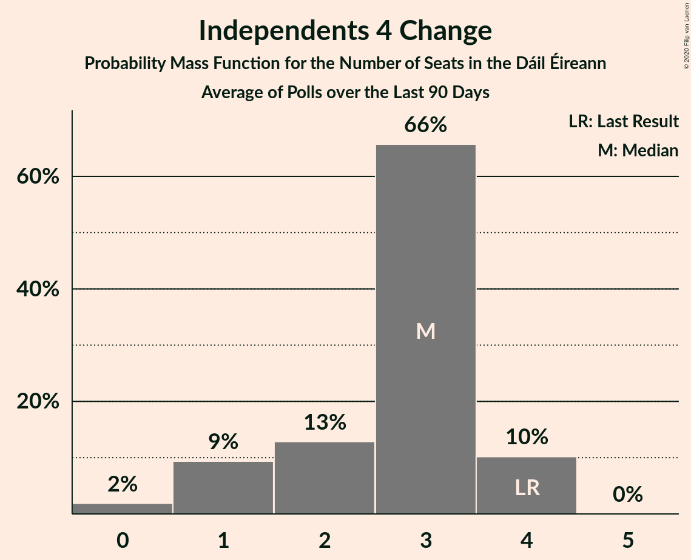
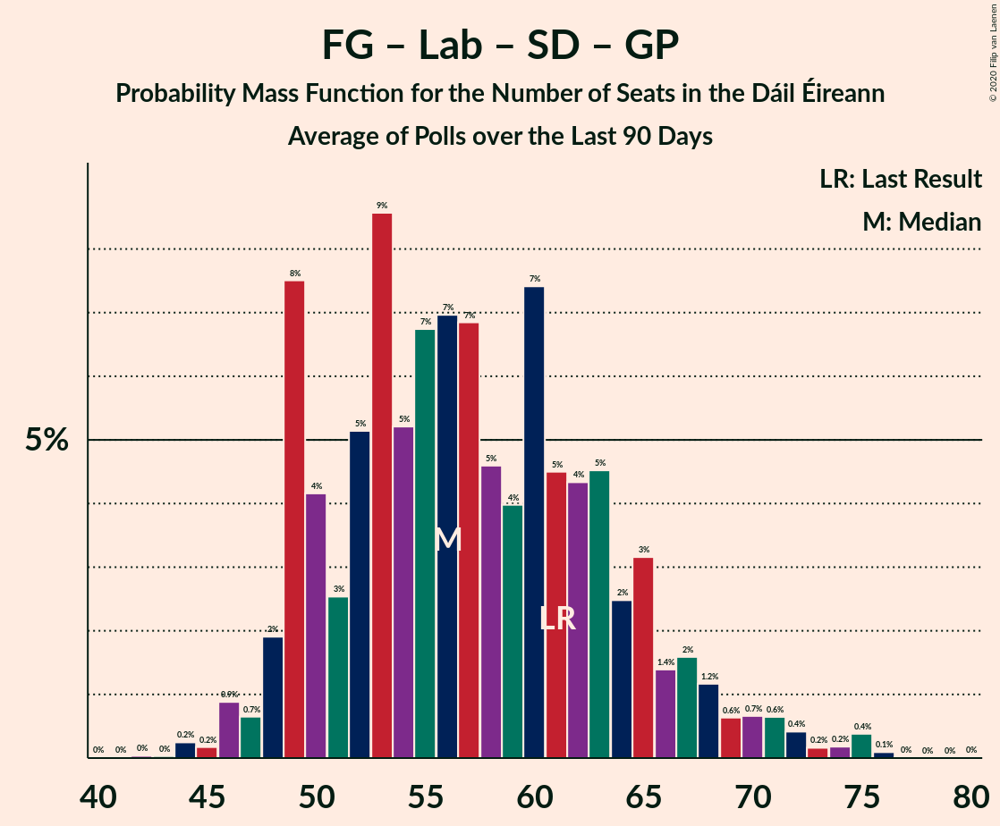

# Poll Average

<a href="#voting-intentions">Voting Intentions</a> | <a href="#seats">Seats</a> | <a href="#coalitions">Coalitions</a> | <a href="#technical-information">Technical Information</a>

## Summary

The table below lists the polls on which the average is based. They are the most recent polls (less than 90 days old) registered and analyzed so far.

| Period     | Polling firm/Commissioner(s) | FG | FF | SF | Lab | S-PBP | GP | RI | SD | I4C | I |
|:----------:|:----------------------------:|:--:|:--:|:--:|:--:|:--:|:--:|:--:|:--:|:--:|:--:|
| 26 February 2016 | General Election | 25.5%   49 | 24.3%   44 | 13.8%   23 | 6.6%   7 | 3.9%   6 | 2.7%   2 | 2.2%   0 | 3.0%   3 | 1.5%   4 | 15.9%   19 |
| N/A | Poll Average | 18–25%   30–46 | 23–34%   42–63 | 17–23%   34–40 | 3–7%   0–15 | 1–3%   0–3 | 6–11%   7–19 | 0–2%   0–3 | 1–4%   0–5 | 1–2%   2–3 | 8–14%   3–17 |
| [1–25 January 2020](2020-01-25-IrelandThinks.html) | Ireland Thinks   The Irish Daily Mail | 19–25%   28–45 | 24–30%   44–57 | 18–23%   34–40 | 5–8%   2–17 | 1–2%   0–1 | 8–12%   7–21 | N/A   N/A | 2–4%   3–7 | 1–2%   1–3 | 8–11%   3–15 |
| [16–23 January 2020](2020-01-23-RedC.html) | Red C   The Sunday Business Post | 20–26%   35–47 | 23–29%   42–56 | 17–22%   34–39 | 3–5%   0–6 | 1–3%   0–3 | 6–10%   7–14 | N/A   N/A | 2–4%   3–6 | 1–3%   2–3 | 11–15%   12–18 |
| [16–18 January 2020](2020-01-18-IpsosMRBI.html) | Ipsos MRBI   The Irish Times | 21–25%   36–47 | 23–28%   40–54 | 19–23%   35–40 | 4–6%   1–9 | 1–3%   0–3 | 7–10%   7–14 | N/A   N/A | 1–3%   2–3 | 1–2%   2–3 | 9–13%   7–17 |
| [4–14 January 2020](2020-01-14-BehaviourandAttitudes.html) | Behaviour and Attitudes   The Sunday Times | 18–23%   31–45 | 29–35%   57–65 | 17–22%   33–40 | 3–5%   0–6 | 1–3%   0–4 | 6–9%   5–14 | 1–2%   0–3 | 1–2%   0–3 | 1–2%   1–3 | 8–11%   4–13 |
| 26 February 2016 | General Election | 25.5%   49 | 24.3%   44 | 13.8%   23 | 6.6%   7 | 3.9%   6 | 2.7%   2 | 2.2%   0 | 3.0%   3 | 1.5%   4 | 15.9%   19 |

Only polls for which at least the sample size has been published are included in the table above.

**Legend:**
+ **Top half of each row:** Voting intentions (95% confidence interval)
+ **Bottom half of each row:** Seat projections for the Dáil Éireann (95% confidence interval)
+ **FG:** Fine Gael
+ **FF:** Fianna Fáil
+ **SF:** Sinn Féin
+ **Lab:** Labour Party
+ **S-PBP:** Solidarity–People Before Profit
+ **GP:** Green Party/Comhaontas Glas
+ **RI:** Renua Ireland
+ **SD:** Social Democrats
+ **I4C:** Independents 4 Change
+ **I:** Independent
+ **N/A (single party):** Party not included the published results
+ **N/A (entire row):** Calculation for this opinion poll not started yet

## Voting Intentions

### Confidence Intervals

| Party | Last Result | Median | 80% Confidence Interval | 90% Confidence Interval | 95% Confidence Interval | 99% Confidence Interval |
|:-----:|:-----------:|:------:|:-----------------------:|:-----------------------:|:-----------------------:|:-----------------------:|
| <a href="#fine-gael">Fine Gael</a> | 25.5% | 22.2% | 19.6–24.2% |18.9–24.8% | 18.4–25.2% | 17.4–26.1% |
| <a href="#fianna-fáil">Fianna Fáil</a> | 24.3% | 26.7% | 24.3–32.5% |23.7–33.4% | 23.3–34.0% | 22.4–35.3% |
| <a href="#independent">Independent</a> | 15.9% | 10.4% | 8.6–13.1% |8.2–13.7% | 7.9–14.2% | 7.3–15.0% |
| <a href="#sinn-féin">Sinn Féin</a> | 13.8% | 19.8% | 17.9–21.8% |17.4–22.3% | 17.0–22.8% | 16.2–23.6% |
| <a href="#labour-party">Labour Party</a> | 6.6% | 4.7% | 3.5–6.4% |3.3–6.8% | 3.1–7.2% | 2.8–7.8% |
| <a href="#solidarity–people-before-profit">Solidarity–People Before Profit</a> | 3.9% | 1.9% | 0.9–2.6% |0.8–2.8% | 0.7–3.0% | 0.5–3.4% |
| <a href="#social-democrats">Social Democrats</a> | 3.0% | 2.4% | 1.0–3.5% |0.8–3.8% | 0.7–4.0% | 0.5–4.5% |
| <a href="#green-party/comhaontas-glas">Green Party/Comhaontas Glas</a> | 2.7% | 8.1% | 6.7–10.3% |6.3–10.9% | 6.0–11.3% | 5.4–12.2% |
| <a href="#renua-ireland">Renua Ireland</a> | 2.2% | 1.0% | 0.7–1.5% |0.6–1.7% | 0.5–1.8% | 0.4–2.1% |
| <a href="#independents-4-change">Independents 4 Change</a> | 1.5% | 1.4% | 0.9–2.0% |0.8–2.2% | 0.7–2.3% | 0.6–2.7% |

### Fine Gael

*For a full overview of the results for this party, see the [Fine Gael](party-finegael.html) page.*

| Voting Intentions | Probability | Accumulated | Special Marks |
|:-----------------:|:-----------:|:-----------:|:-------------:|
| 15.5–16.5% | 0.1% | 100% |  |
| 16.5–17.5% | 0.5% | 99.9% |  |
| 17.5–18.5% | 3% | 99.4% |  |
| 18.5–19.5% | 7% | 97% |  |
| 19.5–20.5% | 11% | 90% |  |
| 20.5–21.5% | 16% | 79% |  |
| 21.5–22.5% | 21% | 63% | Median |
| 22.5–23.5% | 21% | 42% |  |
| 23.5–24.5% | 14% | 21% |  |
| 24.5–25.5% | 5% | 7% |  |
| 25.5–26.5% | 1.3% | 2% | Last Result |
| 26.5–27.5% | 0.2% | 0.2% |  |
| 27.5–28.5% | 0% | 0% |  |

### Fianna Fáil

*For a full overview of the results for this party, see the [Fianna Fáil](party-fiannafáil.html) page.*

| Voting Intentions | Probability | Accumulated | Special Marks |
|:-----------------:|:-----------:|:-----------:|:-------------:|
| 20.5–21.5% | 0.1% | 100% |  |
| 21.5–22.5% | 0.6% | 99.9% |  |
| 22.5–23.5% | 3% | 99.3% |  |
| 23.5–24.5% | 9% | 96% | Last Result |
| 24.5–25.5% | 16% | 87% |  |
| 25.5–26.5% | 18% | 71% |  |
| 26.5–27.5% | 14% | 52% | Median |
| 27.5–28.5% | 8% | 38% |  |
| 28.5–29.5% | 4% | 29% |  |
| 29.5–30.5% | 4% | 25% |  |
| 30.5–31.5% | 5% | 21% |  |
| 31.5–32.5% | 6% | 16% |  |
| 32.5–33.5% | 5% | 9% |  |
| 33.5–34.5% | 3% | 4% |  |
| 34.5–35.5% | 1.0% | 1.4% |  |
| 35.5–36.5% | 0.3% | 0.3% |  |
| 36.5–37.5% | 0% | 0.1% |  |
| 37.5–38.5% | 0% | 0% |  |

### Independent

*For a full overview of the results for this party, see the [Independent](party-independent.html) page.*

| Voting Intentions | Probability | Accumulated | Special Marks |
|:-----------------:|:-----------:|:-----------:|:-------------:|
| 5.5–6.5% | 0% | 100% |  |
| 6.5–7.5% | 1.0% | 100% |  |
| 7.5–8.5% | 9% | 98.9% |  |
| 8.5–9.5% | 21% | 90% |  |
| 9.5–10.5% | 22% | 70% | Median |
| 10.5–11.5% | 18% | 48% |  |
| 11.5–12.5% | 14% | 30% |  |
| 12.5–13.5% | 10% | 16% |  |
| 13.5–14.5% | 5% | 6% |  |
| 14.5–15.5% | 1.1% | 1.2% |  |
| 15.5–16.5% | 0.1% | 0.2% | Last Result |
| 16.5–17.5% | 0% | 0% |  |

### Sinn Féin

*For a full overview of the results for this party, see the [Sinn Féin](party-sinnféin.html) page.*

| Voting Intentions | Probability | Accumulated | Special Marks |
|:-----------------:|:-----------:|:-----------:|:-------------:|
| 13.5–14.5% | 0% | 100% | Last Result |
| 14.5–15.5% | 0.1% | 100% |  |
| 15.5–16.5% | 1.0% | 99.9% |  |
| 16.5–17.5% | 5% | 98.9% |  |
| 17.5–18.5% | 15% | 94% |  |
| 18.5–19.5% | 24% | 79% |  |
| 19.5–20.5% | 25% | 56% | Median |
| 20.5–21.5% | 19% | 31% |  |
| 21.5–22.5% | 9% | 13% |  |
| 22.5–23.5% | 3% | 3% |  |
| 23.5–24.5% | 0.5% | 0.6% |  |
| 24.5–25.5% | 0.1% | 0.1% |  |
| 25.5–26.5% | 0% | 0% |  |

### Labour Party

*For a full overview of the results for this party, see the [Labour Party](party-labourparty.html) page.*

| Voting Intentions | Probability | Accumulated | Special Marks |
|:-----------------:|:-----------:|:-----------:|:-------------:|
| 0.5–1.5% | 0% | 100% |  |
| 1.5–2.5% | 0.2% | 100% |  |
| 2.5–3.5% | 10% | 99.8% |  |
| 3.5–4.5% | 34% | 90% |  |
| 4.5–5.5% | 30% | 55% | Median |
| 5.5–6.5% | 18% | 26% |  |
| 6.5–7.5% | 7% | 8% | Last Result |
| 7.5–8.5% | 1.0% | 1.1% |  |
| 8.5–9.5% | 0.1% | 0.1% |  |
| 9.5–10.5% | 0% | 0% |  |

### Solidarity–People Before Profit

*For a full overview of the results for this party, see the [Solidarity–People Before Profit](party-solidarity–peoplebeforeprofit.html) page.*

| Voting Intentions | Probability | Accumulated | Special Marks |
|:-----------------:|:-----------:|:-----------:|:-------------:|
| 0.0–0.5% | 1.0% | 100% |  |
| 0.5–1.5% | 29% | 99.0% |  |
| 1.5–2.5% | 58% | 70% | Median |
| 2.5–3.5% | 12% | 12% |  |
| 3.5–4.5% | 0.2% | 0.2% | Last Result |
| 4.5–5.5% | 0% | 0% |  |

### Social Democrats

*For a full overview of the results for this party, see the [Social Democrats](party-socialdemocrats.html) page.*

| Voting Intentions | Probability | Accumulated | Special Marks |
|:-----------------:|:-----------:|:-----------:|:-------------:|
| 0.0–0.5% | 0.9% | 100% |  |
| 0.5–1.5% | 24% | 99.1% |  |
| 1.5–2.5% | 30% | 75% | Median |
| 2.5–3.5% | 35% | 45% | Last Result |
| 3.5–4.5% | 9% | 10% |  |
| 4.5–5.5% | 0.4% | 0.4% |  |
| 5.5–6.5% | 0% | 0% |  |

### Green Party/Comhaontas Glas

*For a full overview of the results for this party, see the [Green Party/Comhaontas Glas](party-greenpartycomhaontasglas.html) page.*

| Voting Intentions | Probability | Accumulated | Special Marks |
|:-----------------:|:-----------:|:-----------:|:-------------:|
| 2.5–3.5% | 0% | 100% | Last Result |
| 3.5–4.5% | 0% | 100% |  |
| 4.5–5.5% | 0.7% | 100% |  |
| 5.5–6.5% | 7% | 99.3% |  |
| 6.5–7.5% | 23% | 92% |  |
| 7.5–8.5% | 30% | 69% | Median |
| 8.5–9.5% | 19% | 39% |  |
| 9.5–10.5% | 12% | 19% |  |
| 10.5–11.5% | 6% | 8% |  |
| 11.5–12.5% | 2% | 2% |  |
| 12.5–13.5% | 0.2% | 0.2% |  |
| 13.5–14.5% | 0% | 0% |  |

### Renua Ireland

*For a full overview of the results for this party, see the [Renua Ireland](party-renuaireland.html) page.*

| Voting Intentions | Probability | Accumulated | Special Marks |
|:-----------------:|:-----------:|:-----------:|:-------------:|
| 0.0–0.5% | 4% | 100% |  |
| 0.5–1.5% | 88% | 96% | Median |
| 1.5–2.5% | 9% | 9% | Last Result |
| 2.5–3.5% | 0% | 0% |  |
| 3.5–4.5% | 0% | 0% |  |

### Independents 4 Change

*For a full overview of the results for this party, see the [Independents 4 Change](party-independents4change.html) page.*

| Voting Intentions | Probability | Accumulated | Special Marks |
|:-----------------:|:-----------:|:-----------:|:-------------:|
| 0.0–0.5% | 0.3% | 100% |  |
| 0.5–1.5% | 64% | 99.7% | Median |
| 1.5–2.5% | 35% | 36% | Last Result |
| 2.5–3.5% | 1.0% | 1.0% |  |
| 3.5–4.5% | 0% | 0% |  |

## Seats

### Confidence Intervals

| Party | Last Result | Median | 80% Confidence Interval | 90% Confidence Interval | 95% Confidence Interval | 99% Confidence Interval |
|:-----:|:-----------:|:------:|:-----------------------:|:-----------------------:|:-----------------------:|:-----------------------:|
| <a href="#fine-gael">Fine Gael</a> | 49 | 39 | 34–44 |32–45 | 30–46 | 27–49 |
| <a href="#fianna-fáil">Fianna Fáil</a> | 44 | 51 | 45–61 |44–62 | 42–63 | 39–65 |
| <a href="#independent">Independent</a> | 19 | 12 | 6–17 |3–17 | 3–17 | 3–18 |
| <a href="#sinn-féin">Sinn Féin</a> | 23 | 37 | 34–39 |34–40 | 34–40 | 33–41 |
| <a href="#labour-party">Labour Party</a> | 7 | 3 | 0–10 |0–13 | 0–15 | 0–17 |
| <a href="#solidarity–people-before-profit">Solidarity–People Before Profit</a> | 6 | 1 | 0–1 |0–2 | 0–3 | 0–4 |
| <a href="#social-democrats">Social Democrats</a> | 3 | 3 | 0–4 |0–4 | 0–5 | 0–8 |
| <a href="#green-party/comhaontas-glas">Green Party/Comhaontas Glas</a> | 2 | 9 | 7–18 |7–19 | 7–19 | 5–21 |
| <a href="#renua-ireland">Renua Ireland</a> | 0 | 1 | 0–3 |0–3 | 0–3 | 0–3 |
| <a href="#independents-4-change">Independents 4 Change</a> | 4 | 3 | 2–3 |2–3 | 2–3 | 0–3 |

### Fine Gael

*For a full overview of the results for this party, see the [Fine Gael](party-finegael.html) page.*

| Number of Seats | Probability | Accumulated | Special Marks |
|:---------------:|:-----------:|:-----------:|:-------------:|
| 25 | 0.1% | 100% |  |
| 26 | 0.2% | 99.9% |  |
| 27 | 0.3% | 99.7% |  |
| 28 | 0.3% | 99.4% |  |
| 29 | 0.6% | 99.1% |  |
| 30 | 1.3% | 98% |  |
| 31 | 1.2% | 97% |  |
| 32 | 2% | 96% |  |
| 33 | 4% | 94% |  |
| 34 | 3% | 90% |  |
| 35 | 4% | 87% |  |
| 36 | 5% | 83% |  |
| 37 | 6% | 78% |  |
| 38 | 11% | 72% |  |
| 39 | 14% | 61% | Median |
| 40 | 8% | 47% |  |
| 41 | 13% | 40% |  |
| 42 | 9% | 27% |  |
| 43 | 6% | 17% |  |
| 44 | 5% | 11% |  |
| 45 | 2% | 6% |  |
| 46 | 1.4% | 3% |  |
| 47 | 0.9% | 2% |  |
| 48 | 0.4% | 0.9% |  |
| 49 | 0.3% | 0.6% | Last Result |
| 50 | 0.2% | 0.3% |  |
| 51 | 0.1% | 0.1% |  |
| 52 | 0% | 0.1% |  |
| 53 | 0% | 0% |  |

### Fianna Fáil

*For a full overview of the results for this party, see the [Fianna Fáil](party-fiannafáil.html) page.*

| Number of Seats | Probability | Accumulated | Special Marks |
|:---------------:|:-----------:|:-----------:|:-------------:|
| 36 | 0% | 100% |  |
| 37 | 0.2% | 99.9% |  |
| 38 | 0.1% | 99.8% |  |
| 39 | 0.3% | 99.6% |  |
| 40 | 0.4% | 99.3% |  |
| 41 | 0.5% | 98.9% |  |
| 42 | 1.2% | 98% |  |
| 43 | 1.4% | 97% |  |
| 44 | 2% | 96% | Last Result |
| 45 | 5% | 94% |  |
| 46 | 7% | 89% |  |
| 47 | 8% | 82% |  |
| 48 | 5% | 74% |  |
| 49 | 12% | 69% |  |
| 50 | 6% | 57% |  |
| 51 | 10% | 51% | Median |
| 52 | 4% | 41% |  |
| 53 | 4% | 37% |  |
| 54 | 2% | 33% |  |
| 55 | 3% | 31% |  |
| 56 | 2% | 28% |  |
| 57 | 1.3% | 26% |  |
| 58 | 3% | 24% |  |
| 59 | 2% | 21% |  |
| 60 | 6% | 19% |  |
| 61 | 8% | 13% |  |
| 62 | 2% | 5% |  |
| 63 | 1.1% | 3% |  |
| 64 | 1.0% | 2% |  |
| 65 | 0.6% | 0.8% |  |
| 66 | 0.1% | 0.1% |  |
| 67 | 0% | 0% |  |

### Independent

*For a full overview of the results for this party, see the [Independent](party-independent.html) page.*

| Number of Seats | Probability | Accumulated | Special Marks |
|:---------------:|:-----------:|:-----------:|:-------------:|
| 3 | 6% | 100% |  |
| 4 | 2% | 94% |  |
| 5 | 2% | 92% |  |
| 6 | 3% | 90% |  |
| 7 | 7% | 87% |  |
| 8 | 6% | 81% |  |
| 9 | 5% | 75% |  |
| 10 | 8% | 70% |  |
| 11 | 11% | 62% |  |
| 12 | 4% | 51% | Median |
| 13 | 12% | 48% |  |
| 14 | 7% | 35% |  |
| 15 | 6% | 28% |  |
| 16 | 6% | 21% |  |
| 17 | 14% | 16% |  |
| 18 | 1.1% | 2% |  |
| 19 | 0.4% | 0.5% | Last Result |
| 20 | 0% | 0.1% |  |
| 21 | 0% | 0% |  |

### Sinn Féin

*For a full overview of the results for this party, see the [Sinn Féin](party-sinnféin.html) page.*

| Number of Seats | Probability | Accumulated | Special Marks |
|:---------------:|:-----------:|:-----------:|:-------------:|
| 23 | 0% | 100% | Last Result |
| 24 | 0% | 100% |  |
| 25 | 0% | 100% |  |
| 26 | 0% | 100% |  |
| 27 | 0% | 100% |  |
| 28 | 0% | 100% |  |
| 29 | 0% | 100% |  |
| 30 | 0% | 100% |  |
| 31 | 0% | 100% |  |
| 32 | 0.2% | 99.9% |  |
| 33 | 1.1% | 99.8% |  |
| 34 | 18% | 98.7% |  |
| 35 | 16% | 81% |  |
| 36 | 13% | 65% |  |
| 37 | 18% | 52% | Median |
| 38 | 14% | 33% |  |
| 39 | 12% | 19% |  |
| 40 | 7% | 7% |  |
| 41 | 0.6% | 0.8% |  |
| 42 | 0.2% | 0.3% |  |
| 43 | 0.1% | 0.1% |  |
| 44 | 0% | 0% |  |

### Labour Party

*For a full overview of the results for this party, see the [Labour Party](party-labourparty.html) page.*

| Number of Seats | Probability | Accumulated | Special Marks |
|:---------------:|:-----------:|:-----------:|:-------------:|
| 0 | 21% | 100% |  |
| 1 | 15% | 79% |  |
| 2 | 8% | 64% |  |
| 3 | 10% | 56% | Median |
| 4 | 5% | 46% |  |
| 5 | 7% | 41% |  |
| 6 | 7% | 34% |  |
| 7 | 8% | 27% | Last Result |
| 8 | 6% | 19% |  |
| 9 | 4% | 14% |  |
| 10 | 2% | 10% |  |
| 11 | 2% | 8% |  |
| 12 | 0.7% | 6% |  |
| 13 | 1.2% | 5% |  |
| 14 | 1.0% | 4% |  |
| 15 | 0.9% | 3% |  |
| 16 | 1.3% | 2% |  |
| 17 | 0.7% | 1.0% |  |
| 18 | 0.3% | 0.3% |  |
| 19 | 0% | 0% |  |

### Solidarity–People Before Profit

*For a full overview of the results for this party, see the [Solidarity–People Before Profit](party-solidarity–peoplebeforeprofit.html) page.*

| Number of Seats | Probability | Accumulated | Special Marks |
|:---------------:|:-----------:|:-----------:|:-------------:|
| 0 | 38% | 100% |  |
| 1 | 54% | 62% | Median |
| 2 | 5% | 8% |  |
| 3 | 2% | 3% |  |
| 4 | 1.0% | 1.0% |  |
| 5 | 0% | 0% |  |
| 6 | 0% | 0% | Last Result |

### Social Democrats

*For a full overview of the results for this party, see the [Social Democrats](party-socialdemocrats.html) page.*

| Number of Seats | Probability | Accumulated | Special Marks |
|:---------------:|:-----------:|:-----------:|:-------------:|
| 0 | 20% | 100% |  |
| 1 | 1.5% | 80% |  |
| 2 | 2% | 79% |  |
| 3 | 60% | 77% | Last Result, Median |
| 4 | 14% | 17% |  |
| 5 | 2% | 4% |  |
| 6 | 0.8% | 2% |  |
| 7 | 0.4% | 1.1% |  |
| 8 | 0.4% | 0.7% |  |
| 9 | 0.3% | 0.3% |  |
| 10 | 0% | 0% |  |

### Green Party/Comhaontas Glas

*For a full overview of the results for this party, see the [Green Party/Comhaontas Glas](party-greenpartycomhaontasglas.html) page.*

| Number of Seats | Probability | Accumulated | Special Marks |
|:---------------:|:-----------:|:-----------:|:-------------:|
| 2 | 0% | 100% | Last Result |
| 3 | 0% | 100% |  |
| 4 | 0.1% | 100% |  |
| 5 | 1.2% | 99.9% |  |
| 6 | 0.8% | 98.7% |  |
| 7 | 18% | 98% |  |
| 8 | 15% | 79% |  |
| 9 | 17% | 64% | Median |
| 10 | 12% | 47% |  |
| 11 | 10% | 35% |  |
| 12 | 4% | 25% |  |
| 13 | 4% | 22% |  |
| 14 | 2% | 17% |  |
| 15 | 2% | 16% |  |
| 16 | 2% | 13% |  |
| 17 | 1.1% | 12% |  |
| 18 | 2% | 10% |  |
| 19 | 7% | 9% |  |
| 20 | 0.9% | 2% |  |
| 21 | 0.6% | 0.9% |  |
| 22 | 0.2% | 0.3% |  |
| 23 | 0.1% | 0.1% |  |
| 24 | 0.1% | 0.1% |  |
| 25 | 0% | 0% |  |

### Renua Ireland

*For a full overview of the results for this party, see the [Renua Ireland](party-renuaireland.html) page.*

| Number of Seats | Probability | Accumulated | Special Marks |
|:---------------:|:-----------:|:-----------:|:-------------:|
| 0 | 32% | 100% | Last Result |
| 1 | 29% | 68% | Median |
| 2 | 11% | 39% |  |
| 3 | 27% | 28% |  |
| 4 | 0.4% | 0.4% |  |
| 5 | 0% | 0% |  |

### Independents 4 Change

*For a full overview of the results for this party, see the [Independents 4 Change](party-independents4change.html) page.*

| Number of Seats | Probability | Accumulated | Special Marks |
|:---------------:|:-----------:|:-----------:|:-------------:|
| 0 | 0.7% | 100% |  |
| 1 | 1.3% | 99.3% |  |
| 2 | 45% | 98% |  |
| 3 | 53% | 53% | Median |
| 4 | 0% | 0% | Last Result |

## Coalitions

### Confidence Intervals

| Coalition | Last Result | Median | Majority? | 80% Confidence Interval | 90% Confidence Interval | 95% Confidence Interval | 99% Confidence Interval |
|:---------:|:-----------:|:------:|:---------:|:-----------------------:|:-----------------------:|:-----------------------:|:-----------------------:|
| Fine Gael – Fianna Fáil | 93 | 91 | 95% | 83–99 | 81–100 | 79–103 | 76–104 |
| Fianna Fáil – Sinn Féin | 67 | 87 | 94% | 81–98 | 80–99 | 79–100 | 76–104 |
| Fianna Fáil – Labour Party – Social Democrats – Green Party/Comhaontas Glas | 56 | 69 | 6% | 62–78 | 60–82 | 59–83 | 56–87 |
| Fianna Fáil – Labour Party – Green Party/Comhaontas Glas | 53 | 67 | 2% | 59–75 | 57–79 | 56–80 | 53–84 |
| Fianna Fáil – Green Party/Comhaontas Glas | 46 | 61 | 0% | 54–71 | 53–73 | 52–75 | 48–77 |
| Fine Gael – Labour Party – Social Democrats – Green Party/Comhaontas Glas | 61 | 56 | 0% | 47–65 | 47–68 | 45–71 | 43–74 |
| Fine Gael – Labour Party – Green Party/Comhaontas Glas | 58 | 53 | 0% | 47–61 | 46–64 | 44–67 | 42–71 |
| Fianna Fáil – Labour Party | 51 | 55 | 0% | 50–62 | 48–64 | 47–66 | 43–68 |
| Fine Gael – Green Party/Comhaontas Glas | 51 | 49 | 0% | 45–54 | 44–56 | 42–57 | 40–60 |
| Fine Gael – Labour Party | 56 | 43 | 0% | 38–50 | 36–53 | 35–55 | 32–58 |
| Fine Gael | 49 | 39 | 0% | 34–44 | 32–45 | 30–46 | 27–49 |

### Fine Gael – Fianna Fáil

| Number of Seats | Probability | Accumulated | Special Marks |
|:---------------:|:-----------:|:-----------:|:-------------:|
| 72 | 0% | 100% |  |
| 73 | 0.1% | 99.9% |  |
| 74 | 0.1% | 99.8% |  |
| 75 | 0.1% | 99.7% |  |
| 76 | 1.0% | 99.6% |  |
| 77 | 0.3% | 98.6% |  |
| 78 | 0.6% | 98% |  |
| 79 | 0.7% | 98% |  |
| 80 | 2% | 97% |  |
| 81 | 1.4% | 95% | Majority |
| 82 | 2% | 94% |  |
| 83 | 2% | 92% |  |
| 84 | 4% | 90% |  |
| 85 | 4% | 85% |  |
| 86 | 4% | 82% |  |
| 87 | 6% | 78% |  |
| 88 | 7% | 71% |  |
| 89 | 5% | 64% |  |
| 90 | 4% | 60% | Median |
| 91 | 10% | 56% |  |
| 92 | 10% | 46% |  |
| 93 | 4% | 36% | Last Result |
| 94 | 4% | 32% |  |
| 95 | 3% | 28% |  |
| 96 | 4% | 25% |  |
| 97 | 3% | 21% |  |
| 98 | 2% | 19% |  |
| 99 | 10% | 16% |  |
| 100 | 2% | 7% |  |
| 101 | 1.0% | 4% |  |
| 102 | 0.6% | 3% |  |
| 103 | 2% | 3% |  |
| 104 | 0.5% | 0.8% |  |
| 105 | 0.1% | 0.3% |  |
| 106 | 0.1% | 0.2% |  |
| 107 | 0% | 0.1% |  |
| 108 | 0.1% | 0.1% |  |
| 109 | 0% | 0% |  |

### Fianna Fáil – Sinn Féin

| Number of Seats | Probability | Accumulated | Special Marks |
|:---------------:|:-----------:|:-----------:|:-------------:|
| 67 | 0% | 100% | Last Result |
| 68 | 0% | 100% |  |
| 69 | 0% | 100% |  |
| 70 | 0% | 100% |  |
| 71 | 0% | 100% |  |
| 72 | 0% | 100% |  |
| 73 | 0% | 99.9% |  |
| 74 | 0.1% | 99.9% |  |
| 75 | 0.1% | 99.8% |  |
| 76 | 0.4% | 99.7% |  |
| 77 | 0.3% | 99.3% |  |
| 78 | 0.9% | 99.0% |  |
| 79 | 0.8% | 98% |  |
| 80 | 4% | 97% |  |
| 81 | 4% | 94% | Majority |
| 82 | 3% | 89% |  |
| 83 | 6% | 87% |  |
| 84 | 8% | 80% |  |
| 85 | 10% | 72% |  |
| 86 | 7% | 62% |  |
| 87 | 6% | 55% |  |
| 88 | 9% | 49% | Median |
| 89 | 5% | 39% |  |
| 90 | 4% | 35% |  |
| 91 | 2% | 31% |  |
| 92 | 3% | 29% |  |
| 93 | 2% | 26% |  |
| 94 | 2% | 24% |  |
| 95 | 5% | 22% |  |
| 96 | 2% | 17% |  |
| 97 | 3% | 15% |  |
| 98 | 7% | 12% |  |
| 99 | 2% | 5% |  |
| 100 | 1.4% | 3% |  |
| 101 | 0.6% | 2% |  |
| 102 | 0.6% | 1.4% |  |
| 103 | 0.2% | 0.8% |  |
| 104 | 0.5% | 0.6% |  |
| 105 | 0% | 0.1% |  |
| 106 | 0% | 0.1% |  |
| 107 | 0% | 0% |  |

### Fianna Fáil – Labour Party – Social Democrats – Green Party/Comhaontas Glas

| Number of Seats | Probability | Accumulated | Special Marks |
|:---------------:|:-----------:|:-----------:|:-------------:|
| 51 | 0% | 100% |  |
| 52 | 0.1% | 99.9% |  |
| 53 | 0.1% | 99.9% |  |
| 54 | 0.1% | 99.8% |  |
| 55 | 0.1% | 99.7% |  |
| 56 | 0.3% | 99.7% | Last Result |
| 57 | 0.2% | 99.3% |  |
| 58 | 1.1% | 99.1% |  |
| 59 | 1.2% | 98% |  |
| 60 | 3% | 97% |  |
| 61 | 2% | 93% |  |
| 62 | 3% | 91% |  |
| 63 | 7% | 89% |  |
| 64 | 8% | 82% |  |
| 65 | 6% | 74% |  |
| 66 | 5% | 68% | Median |
| 67 | 5% | 62% |  |
| 68 | 6% | 57% |  |
| 69 | 4% | 51% |  |
| 70 | 12% | 47% |  |
| 71 | 4% | 35% |  |
| 72 | 3% | 31% |  |
| 73 | 4% | 27% |  |
| 74 | 2% | 23% |  |
| 75 | 3% | 21% |  |
| 76 | 4% | 18% |  |
| 77 | 3% | 14% |  |
| 78 | 2% | 11% |  |
| 79 | 2% | 9% |  |
| 80 | 1.2% | 7% |  |
| 81 | 0.7% | 6% | Majority |
| 82 | 0.9% | 5% |  |
| 83 | 2% | 4% |  |
| 84 | 1.1% | 2% |  |
| 85 | 0.4% | 1.2% |  |
| 86 | 0.2% | 0.8% |  |
| 87 | 0.2% | 0.6% |  |
| 88 | 0.2% | 0.3% |  |
| 89 | 0.1% | 0.2% |  |
| 90 | 0.1% | 0.1% |  |
| 91 | 0% | 0% |  |

### Fianna Fáil – Labour Party – Green Party/Comhaontas Glas

| Number of Seats | Probability | Accumulated | Special Marks |
|:---------------:|:-----------:|:-----------:|:-------------:|
| 48 | 0% | 100% |  |
| 49 | 0% | 99.9% |  |
| 50 | 0.1% | 99.9% |  |
| 51 | 0.1% | 99.8% |  |
| 52 | 0.1% | 99.7% |  |
| 53 | 0.3% | 99.6% | Last Result |
| 54 | 0.6% | 99.3% |  |
| 55 | 0.9% | 98.7% |  |
| 56 | 1.4% | 98% |  |
| 57 | 4% | 96% |  |
| 58 | 2% | 92% |  |
| 59 | 3% | 91% |  |
| 60 | 11% | 88% |  |
| 61 | 5% | 77% |  |
| 62 | 6% | 72% |  |
| 63 | 6% | 67% | Median |
| 64 | 4% | 61% |  |
| 65 | 3% | 57% |  |
| 66 | 3% | 54% |  |
| 67 | 4% | 50% |  |
| 68 | 5% | 47% |  |
| 69 | 3% | 42% |  |
| 70 | 12% | 39% |  |
| 71 | 4% | 27% |  |
| 72 | 4% | 23% |  |
| 73 | 5% | 19% |  |
| 74 | 2% | 14% |  |
| 75 | 2% | 12% |  |
| 76 | 2% | 10% |  |
| 77 | 2% | 8% |  |
| 78 | 0.7% | 6% |  |
| 79 | 1.4% | 5% |  |
| 80 | 2% | 4% |  |
| 81 | 0.9% | 2% | Majority |
| 82 | 0.3% | 1.1% |  |
| 83 | 0.2% | 0.8% |  |
| 84 | 0.3% | 0.6% |  |
| 85 | 0.1% | 0.3% |  |
| 86 | 0.1% | 0.2% |  |
| 87 | 0.1% | 0.1% |  |
| 88 | 0% | 0% |  |

### Fianna Fáil – Green Party/Comhaontas Glas

| Number of Seats | Probability | Accumulated | Special Marks |
|:---------------:|:-----------:|:-----------:|:-------------:|
| 44 | 0.1% | 100% |  |
| 45 | 0% | 99.9% |  |
| 46 | 0.1% | 99.9% | Last Result |
| 47 | 0.2% | 99.7% |  |
| 48 | 0.1% | 99.5% |  |
| 49 | 0.6% | 99.4% |  |
| 50 | 0.6% | 98.8% |  |
| 51 | 0.4% | 98% |  |
| 52 | 0.8% | 98% |  |
| 53 | 3% | 97% |  |
| 54 | 4% | 94% |  |
| 55 | 3% | 90% |  |
| 56 | 5% | 86% |  |
| 57 | 6% | 81% |  |
| 58 | 7% | 75% |  |
| 59 | 10% | 69% |  |
| 60 | 5% | 59% | Median |
| 61 | 5% | 54% |  |
| 62 | 4% | 49% |  |
| 63 | 4% | 45% |  |
| 64 | 3% | 41% |  |
| 65 | 4% | 38% |  |
| 66 | 4% | 34% |  |
| 67 | 4% | 30% |  |
| 68 | 4% | 26% |  |
| 69 | 3% | 23% |  |
| 70 | 9% | 20% |  |
| 71 | 2% | 11% |  |
| 72 | 3% | 8% |  |
| 73 | 1.4% | 5% |  |
| 74 | 1.3% | 4% |  |
| 75 | 2% | 3% |  |
| 76 | 0.5% | 1.0% |  |
| 77 | 0.3% | 0.6% |  |
| 78 | 0.1% | 0.2% |  |
| 79 | 0% | 0.2% |  |
| 80 | 0.1% | 0.2% |  |
| 81 | 0% | 0% | Majority |

### Fine Gael – Labour Party – Social Democrats – Green Party/Comhaontas Glas

| Number of Seats | Probability | Accumulated | Special Marks |
|:---------------:|:-----------:|:-----------:|:-------------:|
| 40 | 0% | 100% |  |
| 41 | 0.3% | 99.9% |  |
| 42 | 0.1% | 99.7% |  |
| 43 | 0.5% | 99.5% |  |
| 44 | 0.6% | 99.1% |  |
| 45 | 1.2% | 98% |  |
| 46 | 2% | 97% |  |
| 47 | 6% | 96% |  |
| 48 | 2% | 89% |  |
| 49 | 5% | 87% |  |
| 50 | 2% | 82% |  |
| 51 | 3% | 80% |  |
| 52 | 3% | 77% |  |
| 53 | 3% | 74% |  |
| 54 | 8% | 71% | Median |
| 55 | 5% | 63% |  |
| 56 | 10% | 57% |  |
| 57 | 8% | 48% |  |
| 58 | 6% | 40% |  |
| 59 | 5% | 34% |  |
| 60 | 3% | 29% |  |
| 61 | 3% | 25% | Last Result |
| 62 | 4% | 22% |  |
| 63 | 5% | 18% |  |
| 64 | 3% | 13% |  |
| 65 | 2% | 10% |  |
| 66 | 2% | 8% |  |
| 67 | 2% | 7% |  |
| 68 | 1.0% | 5% |  |
| 69 | 0.7% | 4% |  |
| 70 | 0.8% | 3% |  |
| 71 | 0.5% | 3% |  |
| 72 | 0.8% | 2% |  |
| 73 | 0.4% | 1.2% |  |
| 74 | 0.5% | 0.8% |  |
| 75 | 0.1% | 0.3% |  |
| 76 | 0.1% | 0.2% |  |
| 77 | 0% | 0.1% |  |
| 78 | 0% | 0% |  |

### Fine Gael – Labour Party – Green Party/Comhaontas Glas

| Number of Seats | Probability | Accumulated | Special Marks |
|:---------------:|:-----------:|:-----------:|:-------------:|
| 39 | 0% | 100% |  |
| 40 | 0.1% | 99.9% |  |
| 41 | 0.4% | 99.9% |  |
| 42 | 0.2% | 99.5% |  |
| 43 | 0.8% | 99.3% |  |
| 44 | 1.1% | 98% |  |
| 45 | 2% | 97% |  |
| 46 | 2% | 95% |  |
| 47 | 7% | 93% |  |
| 48 | 3% | 86% |  |
| 49 | 7% | 83% |  |
| 50 | 6% | 76% |  |
| 51 | 7% | 70% | Median |
| 52 | 6% | 63% |  |
| 53 | 11% | 58% |  |
| 54 | 8% | 47% |  |
| 55 | 6% | 39% |  |
| 56 | 5% | 33% |  |
| 57 | 3% | 28% |  |
| 58 | 3% | 25% | Last Result |
| 59 | 3% | 21% |  |
| 60 | 6% | 18% |  |
| 61 | 2% | 12% |  |
| 62 | 2% | 10% |  |
| 63 | 2% | 8% |  |
| 64 | 1.3% | 6% |  |
| 65 | 0.8% | 5% |  |
| 66 | 0.8% | 4% |  |
| 67 | 0.7% | 3% |  |
| 68 | 0.4% | 2% |  |
| 69 | 0.8% | 2% |  |
| 70 | 0.3% | 1.1% |  |
| 71 | 0.5% | 0.8% |  |
| 72 | 0.1% | 0.3% |  |
| 73 | 0.1% | 0.2% |  |
| 74 | 0% | 0% |  |

### Fianna Fáil – Labour Party

| Number of Seats | Probability | Accumulated | Special Marks |
|:---------------:|:-----------:|:-----------:|:-------------:|
| 39 | 0% | 100% |  |
| 40 | 0.1% | 99.9% |  |
| 41 | 0.1% | 99.9% |  |
| 42 | 0.1% | 99.8% |  |
| 43 | 0.3% | 99.7% |  |
| 44 | 0.2% | 99.4% |  |
| 45 | 0.4% | 99.2% |  |
| 46 | 1.1% | 98.8% |  |
| 47 | 1.2% | 98% |  |
| 48 | 3% | 96% |  |
| 49 | 4% | 94% |  |
| 50 | 5% | 90% |  |
| 51 | 4% | 85% | Last Result |
| 52 | 10% | 81% |  |
| 53 | 6% | 71% |  |
| 54 | 8% | 65% | Median |
| 55 | 8% | 57% |  |
| 56 | 4% | 49% |  |
| 57 | 4% | 45% |  |
| 58 | 3% | 42% |  |
| 59 | 5% | 39% |  |
| 60 | 9% | 34% |  |
| 61 | 11% | 25% |  |
| 62 | 4% | 14% |  |
| 63 | 3% | 10% |  |
| 64 | 2% | 7% |  |
| 65 | 1.0% | 5% |  |
| 66 | 2% | 4% |  |
| 67 | 0.8% | 2% |  |
| 68 | 1.1% | 1.4% |  |
| 69 | 0.2% | 0.3% |  |
| 70 | 0.1% | 0.1% |  |
| 71 | 0.1% | 0.1% |  |
| 72 | 0% | 0% |  |

### Fine Gael – Green Party/Comhaontas Glas

| Number of Seats | Probability | Accumulated | Special Marks |
|:---------------:|:-----------:|:-----------:|:-------------:|
| 36 | 0% | 100% |  |
| 37 | 0.1% | 99.9% |  |
| 38 | 0.1% | 99.9% |  |
| 39 | 0.2% | 99.8% |  |
| 40 | 0.4% | 99.6% |  |
| 41 | 0.9% | 99.2% |  |
| 42 | 1.3% | 98% |  |
| 43 | 2% | 97% |  |
| 44 | 2% | 95% |  |
| 45 | 4% | 93% |  |
| 46 | 6% | 89% |  |
| 47 | 11% | 83% |  |
| 48 | 9% | 72% | Median |
| 49 | 15% | 63% |  |
| 50 | 11% | 48% |  |
| 51 | 9% | 37% | Last Result |
| 52 | 7% | 28% |  |
| 53 | 7% | 21% |  |
| 54 | 5% | 14% |  |
| 55 | 3% | 8% |  |
| 56 | 2% | 5% |  |
| 57 | 1.0% | 3% |  |
| 58 | 0.7% | 2% |  |
| 59 | 0.7% | 1.3% |  |
| 60 | 0.3% | 0.6% |  |
| 61 | 0.1% | 0.3% |  |
| 62 | 0.1% | 0.2% |  |
| 63 | 0.1% | 0.2% |  |
| 64 | 0% | 0.1% |  |
| 65 | 0% | 0.1% |  |
| 66 | 0% | 0% |  |

### Fine Gael – Labour Party

| Number of Seats | Probability | Accumulated | Special Marks |
|:---------------:|:-----------:|:-----------:|:-------------:|
| 29 | 0% | 100% |  |
| 30 | 0.1% | 99.9% |  |
| 31 | 0.1% | 99.8% |  |
| 32 | 0.4% | 99.7% |  |
| 33 | 0.3% | 99.3% |  |
| 34 | 0.9% | 99.0% |  |
| 35 | 2% | 98% |  |
| 36 | 2% | 96% |  |
| 37 | 3% | 94% |  |
| 38 | 8% | 91% |  |
| 39 | 7% | 82% |  |
| 40 | 6% | 75% |  |
| 41 | 5% | 69% |  |
| 42 | 10% | 63% | Median |
| 43 | 8% | 53% |  |
| 44 | 8% | 45% |  |
| 45 | 7% | 37% |  |
| 46 | 5% | 30% |  |
| 47 | 6% | 25% |  |
| 48 | 5% | 20% |  |
| 49 | 3% | 15% |  |
| 50 | 4% | 12% |  |
| 51 | 2% | 8% |  |
| 52 | 1.0% | 7% |  |
| 53 | 2% | 6% |  |
| 54 | 1.2% | 4% |  |
| 55 | 0.6% | 3% |  |
| 56 | 0.7% | 2% | Last Result |
| 57 | 0.7% | 1.2% |  |
| 58 | 0.3% | 0.6% |  |
| 59 | 0.2% | 0.3% |  |
| 60 | 0% | 0.1% |  |
| 61 | 0% | 0.1% |  |
| 62 | 0% | 0% |  |

### Fine Gael

| Number of Seats | Probability | Accumulated | Special Marks |
|:---------------:|:-----------:|:-----------:|:-------------:|
| 25 | 0.1% | 100% |  |
| 26 | 0.2% | 99.9% |  |
| 27 | 0.3% | 99.7% |  |
| 28 | 0.3% | 99.4% |  |
| 29 | 0.6% | 99.1% |  |
| 30 | 1.3% | 98% |  |
| 31 | 1.2% | 97% |  |
| 32 | 2% | 96% |  |
| 33 | 4% | 94% |  |
| 34 | 3% | 90% |  |
| 35 | 4% | 87% |  |
| 36 | 5% | 83% |  |
| 37 | 6% | 78% |  |
| 38 | 11% | 72% |  |
| 39 | 14% | 61% | Median |
| 40 | 8% | 47% |  |
| 41 | 13% | 40% |  |
| 42 | 9% | 27% |  |
| 43 | 6% | 17% |  |
| 44 | 5% | 11% |  |
| 45 | 2% | 6% |  |
| 46 | 1.4% | 3% |  |
| 47 | 0.9% | 2% |  |
| 48 | 0.4% | 0.9% |  |
| 49 | 0.3% | 0.6% | Last Result |
| 50 | 0.2% | 0.3% |  |
| 51 | 0.1% | 0.1% |  |
| 52 | 0% | 0.1% |  |
| 53 | 0% | 0% |  |

## Technical Information

+ **Number of polls included in this average:** 4
+ **Lowest number of simulations done in a poll included in this average:** 1,048,576
+ **Total number of simulations done in the polls included in this average:** 4,194,304
+ **Error estimate:** 2.83%
