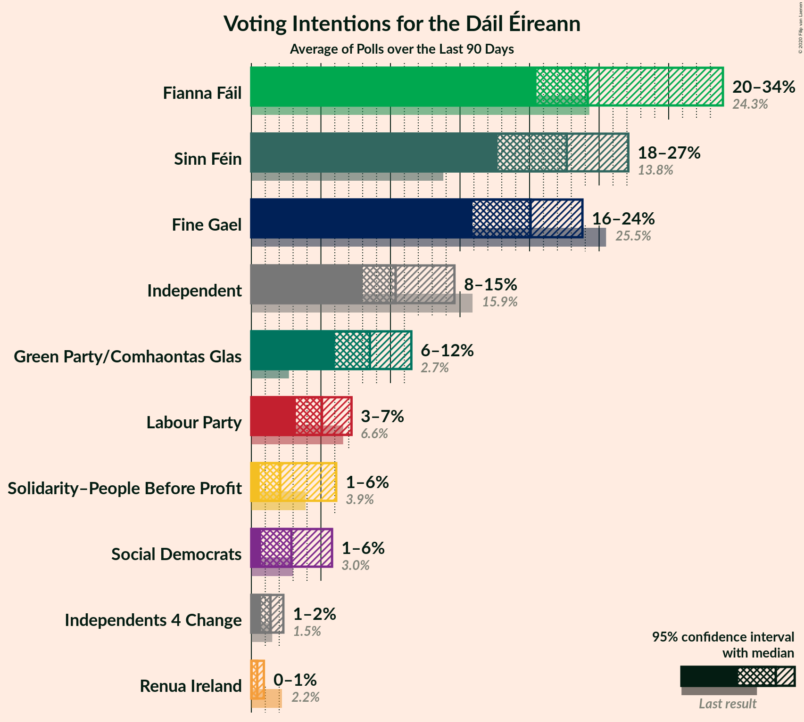

# Overview

The table below lists the most recent polls (less than 90 days old) registered and analyzed so far.

| Period                                                     | Polling firm/Commissioner(s)                  | FG                                                  | FF                                                  | SF                                 | Lab                             | S-PBP                                           | GP                                | RI           | SD                                              | I4C                                             | I                                                 | Performance  |
|:----------------------------------------------------------:|:---------------------------------------------:|:---------------------------------------------------:|:---------------------------------------------------:|:----------------------------------:|:-------------------------------:|:-----------------------------------------------:|:---------------------------------:|:------------:|:-----------------------------------------------:|:-----------------------------------------------:|:-------------------------------------------------:|:------------:|
| 8 February 2020                                            | General Election                              | 20.9%   35                                       | 22.2%   38                                       | 24.5%   37                      | 4.4%   6                     | 2.9%   6                                     | 7.1%   12                      | 0.3%   0  | 2.9%   6                                     | 0.4%   1                                     | 12.2%   19                                     | N/A          |
| N/A                                                        | [Poll Average](average.html)                  | 16–24%   24–44                                   | 20–34%   37–62                                   | 18–27%   34–42                  | 3–7%   0–15                  | 1–6%   0–10                                  | 6–12%   6–20                   | 0–1%   0  | 1–6%   0–9                                   | <strike>1–2%</strike>   1–4                  | 8–15%   3–19                                   | 8/8   8/8 |
| [27 January–2 February 2020](2020-02-02-Survation.html)    | Survation   Sinn Féin                      | <strike>15–19%</strike>   <strike>23–34</strike> | 20–25%   36–47                                   | 23–28%   <strike>38–42</strike> | <strike>5–8%</strike>   4–15 | <strike>4–7%</strike>   4–10                 | 7–11%   9–20                   | N/A   N/A | 2–4%   3–6                                   | <strike>1–2%</strike>   1–4                  | 8–12%   <strike>6–17</strike>                  | 5/8   5/8 |
| [30 January–1 February 2020](2020-02-01-IpsosMRBI.html)    | Ipsos MRBI   The Irish Times               | 18–22%   32–41                                   | 21–25%   <strike>40–49</strike>                  | 23–28%   <strike>38–40</strike> | 3–5%   0–7                   | 1–3%   <strike>0–3</strike>                  | 7–10%   7–16                   | N/A   N/A | 1–3%   <strike>2–4</strike>                  | <strike>1–3%</strike>   <strike>3–4</strike> | 12–16%   16–21                                 | 8/8   4/8 |
| [25–30 January 2020](2020-01-30-RedC.html)                 | Red C   The Sunday Business Post           | 19–24%   33–45                                   | 22–27%   <strike>41–53</strike>                  | 22–27%   37–42                  | 4–7%   1–12                  | <strike>1–2%</strike>   <strike>0–1</strike> | 6–9%   6–12                    | N/A   N/A | 2–4%   3–8                                   | <strike>1–2%</strike>   1–4                  | 9–13%   <strike>7–18</strike>                  | 7/8   5/8 |
| [24–30 January 2020](2020-01-30-Panelbase.html)            | Panelbase   The Times                      | 17–22%   25–37                                   | 20–26%   34–49                                   | 19–24%   35–39                  | 4–7%   1–11                  | <strike>4–7%</strike>   4–10                 | <strike>8–12%</strike>   10–22 | N/A   N/A | <strike>4–7%</strike>   4–12                 | <strike>1–2%</strike>   1–4                  | 8–12%   <strike>5–16</strike>                  | 5/8   7/8 |
| [1–25 January 2020](2020-01-25-IrelandThinks.html)         | Ireland Thinks   The Irish Daily Mail      | 19–25%   27–46                                   | <strike>24–30%</strike>   <strike>44–57</strike> | <strike>18–23%</strike>   34–38 | <strike>5–8%</strike>   2–17 | <strike>1–2%</strike>   <strike>0–1</strike> | <strike>8–12%</strike>   8–21  | N/A   N/A | 2–4%   3–7                                   | <strike>1–2%</strike>   0–3                  | <strike>8–11%</strike>   <strike>3–15</strike> | 2/8   5/8 |
| [4–14 January 2020](2020-01-14-BehaviourandAttitudes.html) | Behaviour and Attitudes   The Sunday Times | 18–23%   33–44                                   | <strike>29–35%</strike>   <strike>57–65</strike> | <strike>17–22%</strike>   34–38 | 3–5%   0–6                   | 1–3%   <strike>0–3</strike>                  | 6–9%   4–14                    | 0–1%   0  | <strike>1–2%</strike>   <strike>0–3</strike> | <strike>1–2%</strike>   1–3                  | <strike>8–11%</strike>   <strike>4–13</strike> | 5/9   5/9 |
| 26 February 2016                                           | General Election                              | 25.5%   49                                       | 24.3%   44                                       | 13.8%   23                      | 6.6%   7                     | 3.9%   6                                     | 2.7%   2                       | 2.2%   0  | 3.0%   3                                     | 1.5%   4                                     | 15.9%   19                                     | N/A          |

Only polls for which at least the sample size has been published are included in the table above.

**Legend:**
+ **Top half of each row:** Voting intentions (95% confidence interval)
+ **Bottom half of each row:** Seat projections for the Dáil Éireann (95% confidence interval)
+ **FG:** Fine Gael
+ **FF:** Fianna Fáil
+ **SF:** Sinn Féin
+ **Lab:** Labour Party
+ **S-PBP:** Solidarity–People Before Profit
+ **GP:** Green Party/Comhaontas Glas
+ **RI:** Renua Ireland
+ **SD:** Social Democrats
+ **I4C:** Independents 4 Change
+ **I:** Independent
+ **Performance:** How well the pollster did in terms of number of results within the 95% confidence interval, not including I4C
+ **N/A (single party):** Party not included the published results
+ **N/A (entire row):** Calculation for this opinion poll not started yet

