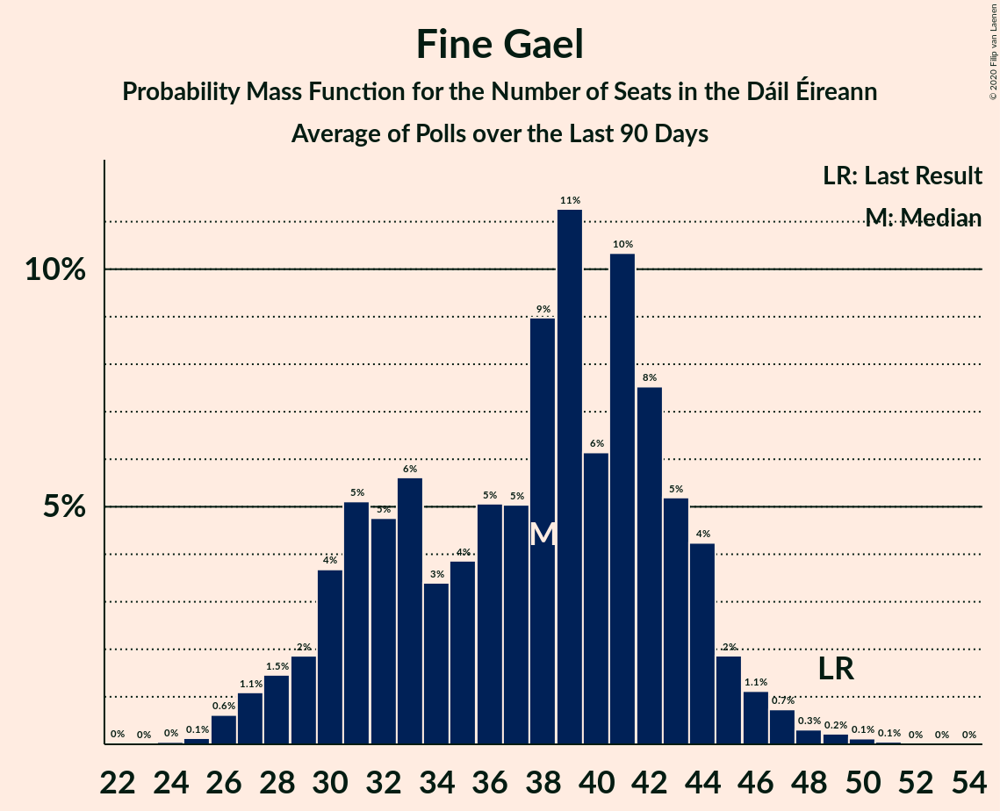

# Fine Gael

<a href="#voting-intentions">Voting Intentions</a> | <a href="#seats">Seats</a>

## Voting Intentions

Last result: **25.5%** (General Election of 26 February 2016)

### Confidence Intervals

| Period     | Polling firm/Commissioner(s) | Median | 80% Confidence Interval | 90% Confidence Interval | 95% Confidence Interval | 99% Confidence Interval |
|:----------:|:----------------:|:-----------:|:-----------------------:|:-----------------------:|:-----------------------:|:-----------------------:|
| N/A | [Poll Average](average.html) | 22.2% | 19.6–24.2% | 18.9–24.8% | 18.4–25.2% | 17.4–26.1% |
| [1–25 January 2020](2020-01-25-IrelandThinks.html) | Ireland Thinks   The Irish Daily Mail | 22.0% | 20.3–23.8% | 19.8–24.3% | 19.4–24.7% | 18.7–25.6% |
| [16–23 January 2020](2020-01-23-RedC.html) | Red C   The Sunday Business Post | 23.0% | 21.4–24.8% | 20.9–25.3% | 20.5–25.7% | 19.7–26.6% |
| [16–18 January 2020](2020-01-18-IpsosMRBI.html) | Ipsos MRBI   The Irish Times | 23.0% | 21.5–24.6% | 21.1–25.1% | 20.7–25.5% | 20.0–26.3% |
| [4–14 January 2020](2020-01-14-BehaviourandAttitudes.html) | Behaviour and Attitudes   The Sunday Times | 20.0% | 18.4–21.8% | 17.9–22.3% | 17.5–22.7% | 16.8–23.6% |
| [26 December 2019](2019-12-26-IrelandThinks.html) | Ireland Thinks   The Irish Daily Mail | 28.0% | 26.6–29.5% | 26.2–29.9% | 25.8–30.3% | 25.2–31.0% |
| [5–17 December 2019](2019-12-17-BehaviourandAttitudes.html) | Behaviour and Attitudes   The Sunday Times | 27.0% | 25.2–29.0% | 24.7–29.5% | 24.3–30.0% | 23.4–30.9% |
| [14–21 November 2019](2019-11-21-RedC.html) | Red C   The Sunday Business Post | 30.0% | 28.2–31.9% | 27.7–32.4% | 27.2–32.9% | 26.4–33.9% |
| [1–12 November 2019](2019-11-12-BehaviourandAttitudes.html) | Behaviour and Attitudes   The Sunday Times | 27.0% | 25.2–28.9% | 24.6–29.5% | 24.2–29.9% | 23.4–30.9% |
| [17–24 October 2019](2019-10-24-RedC.html) | Red C   The Sunday Business Post | 32.0% | 30.1–33.9% | 29.6–34.5% | 29.2–35.0% | 28.3–35.9% |
| [3–15 October 2019](2019-10-15-BehaviourandAttitudes.html) | Behaviour and Attitudes   The Sunday Times | 29.0% | 27.1–31.0% | 26.6–31.6% | 26.1–32.1% | 25.2–33.0% |
| [11–13 October 2019](2019-10-13-IpsosMRBI.html) | Ipsos MRBI   The Irish Times | 29.3% | 27.7–31.1% | 27.2–31.6% | 26.8–32.0% | 26.0–32.8% |
| [5–17 September 2019](2019-09-17-BehaviourandAttitudes.html) | Behaviour and Attitudes   The Sunday Times | 26.0% | 24.2–27.9% | 23.7–28.5% | 23.2–29.0% | 22.4–29.9% |
| [5–12 September 2019](2019-09-12-RedC.html) | Red C   The Sunday Business Post | 28.9% | 27.1–30.8% | 26.6–31.3% | 26.2–31.8% | 25.3–32.7% |
| [4–16 July 2019](2019-07-16-BehaviourandAttitudes.html) | Behaviour and Attitudes   The Sunday Times | 26.5% | 24.7–28.5% | 24.2–29.1% | 23.8–29.5% | 22.9–30.5% |
| [31 May–11 June 2019](2019-06-11-BehaviourandAttitudes.html) | Behaviour and Attitudes   The Sunday Times | 23.2% | 21.5–25.1% | 21.0–25.6% | 20.6–26.1% | 19.8–27.0% |
| [24 May 2019](2019-05-24-RedC.html) | Red C   RTÉ | 26.0% | 24.9–27.1% | 24.6–27.4% | 24.4–27.7% | 23.8–28.2% |
| [1–22 May 2019](2019-05-22-IrelandThinks.html) | Ireland Thinks   The Irish Daily Mail | 28.0% | 26.6–29.5% | 26.2–29.9% | 25.8–30.3% | 25.2–31.0% |
| [6–16 May 2019](2019-05-16-RedC.html) | Red C   The Sunday Business Post | 28.0% | 26.7–29.3% | 26.4–29.7% | 26.1–30.0% | 25.5–30.7% |
| [2–14 May 2019](2019-05-14-BehaviourandAttitudes.html) | Behaviour and Attitudes   The Sunday Times | 28.0% | 26.1–29.9% | 25.6–30.5% | 25.2–31.0% | 24.3–31.9% |
| [6–8 May 2019](2019-05-08-IpsosMRBI.html) | Ipsos MRBI   The Irish Times | 28.8% | 27.3–30.3% | 26.9–30.8% | 26.6–31.2% | 25.9–31.9% |
| [11–17 April 2019](2019-04-17-RedC.html) | Red C   The Sunday Business Post | 32.9% | 31.0–34.9% | 30.5–35.4% | 30.1–35.9% | 29.2–36.8% |
| [4–16 April 2019](2019-04-16-BehaviourandAttitudes.html) | Behaviour and Attitudes   The Sunday Times | 28.2% | 26.4–30.1% | 25.8–30.7% | 25.4–31.2% | 24.5–32.1% |
| [21–28 March 2019](2019-03-28-RedC.html) | Red C   The Sunday Business Post | 30.9% | 29.1–32.8% | 28.5–33.4% | 28.1–33.8% | 27.3–34.8% |
| [28 February–12 March 2019](2019-03-12-BehaviourandAttitudes.html) | Behaviour and Attitudes   The Sunday Times | 31.5% | 29.6–33.5% | 29.1–34.1% | 28.6–34.6% | 27.7–35.5% |
| [4–5 March 2019](2019-03-05-IpsosMRBI.html) | Ipsos MRBI   The Irish Times | 30.0% | 28.3–31.7% | 27.9–32.2% | 27.5–32.7% | 26.7–33.5% |
| [14–20 February 2019](2019-02-20-RedC.html) | Red C   The Sunday Business Post | 30.9% | 29.1–32.8% | 28.5–33.4% | 28.1–33.8% | 27.3–34.8% |
| [31 January–12 February 2019](2019-02-12-BehaviourandAttitudes.html) | Behaviour and Attitudes   The Sunday Times | 29.7% | 27.8–31.7% | 27.3–32.2% | 26.8–32.7% | 25.9–33.7% |
| [17–24 January 2019](2019-01-24-RedC.html) | Red C   The Sunday Business Post | 32.2% | 30.3–34.1% | 29.8–34.7% | 29.4–35.2% | 28.5–36.1% |
| [4–15 January 2019](2019-01-15-BehaviourandAttitudes.html) | Behaviour and Attitudes   The Sunday Times | 30.0% | 28.1–32.0% | 27.6–32.6% | 27.1–33.1% | 26.2–34.0% |
| [14–21 December 2018](2018-12-21-IrelandThinks.html) | Ireland Thinks   The Irish Daily Mail | 31.4% | 29.9–32.9% | 29.5–33.3% | 29.1–33.7% | 28.4–34.5% |
| [6–18 December 2018](2018-12-18-BehaviourandAttitudes.html) | Behaviour and Attitudes   The Sunday Times | 30.7% | 28.8–32.8% | 28.3–33.3% | 27.8–33.8% | 26.9–34.8% |
| [1–13 December 2018](2018-12-13-MillwardBrown.html) | Millward Brown   The Sunday Independent | 32.3% | 30.3–34.3% | 29.8–34.9% | 29.3–35.4% | 28.4–36.4% |
| [15–22 November 2018](2018-11-22-RedC.html) | Red C   The Sunday Business Post | 33.8% | 31.9–35.8% | 31.4–36.3% | 30.9–36.8% | 30.0–37.7% |
| [1–13 November 2018](2018-11-13-BehaviourandAttitudes.html) | Behaviour and Attitudes   The Sunday Times | 30.1% | 28.2–32.1% | 27.6–32.6% | 27.1–33.1% | 26.3–34.1% |
| [26 October 2018](2018-10-26-RedC.html) | Red C   RTÉ | 34.9% | 33.9–36.0% | 33.6–36.3% | 33.3–36.5% | 32.9–37.0% |
| [11–17 October 2018](2018-10-17-RedC.html) | Red C   The Sunday Business Post | 32.9% | 31.0–34.9% | 30.5–35.4% | 30.1–35.9% | 29.2–36.8% |
| [5–16 October 2018](2018-10-16-BehaviourandAttitudes.html) | Behaviour and Attitudes   The Sunday Times | 31.5% | 29.6–33.5% | 29.1–34.1% | 28.6–34.6% | 27.7–35.5% |
| [10–12 October 2018](2018-10-12-IpsosMRBI.html) | Ipsos MRBI   The Irish Times | 33.3% | 31.6–35.1% | 31.1–35.6% | 30.7–36.1% | 29.9–36.9% |
| [3–10 October 2018](2018-10-10-RedC.html) | Red C   Paddy Power | 31.9% | 30.1–33.8% | 29.5–34.4% | 29.1–34.9% | 28.2–35.8% |
| [6–18 September 2018](2018-09-18-BehaviourandAttitudes.html) | Behaviour and Attitudes   The Sunday Times | 31.8% | 29.9–33.8% | 29.4–34.4% | 28.9–34.9% | 28.0–35.8% |
| [6–13 September 2018](2018-09-13-RedC.html) | Red C   The Sunday Business Post | 33.3% | 31.4–35.3% | 30.9–35.8% | 30.4–36.3% | 29.6–37.2% |
| [15–24 August 2018](2018-08-24-IrelandThinks.html) | Ireland Thinks   The Irish Daily Mail | 29.0% | 27.1–30.9% | 26.6–31.5% | 26.2–32.0% | 25.3–32.9% |
| [5–17 July 2018](2018-07-17-BehaviourandAttitudes.html) | Behaviour and Attitudes   The Sunday Times | 34.6% | 32.6–36.6% | 32.1–37.2% | 31.6–37.7% | 30.7–38.7% |
| [12 June 2018](2018-06-12-BehaviourandAttitudes.html) | Behaviour and Attitudes   The Sunday Times | 30.9% | 29.0–32.9% | 28.5–33.5% | 28.0–34.0% | 27.1–34.9% |
| [10–16 May 2018](2018-05-16-RedC.html) | Red C   The Sunday Business Post | 33.9% | 32.0–35.9% | 31.5–36.4% | 31.0–36.9% | 30.1–37.8% |
| [3–15 May 2018](2018-05-15-BehaviourandAttitudes.html) | Behaviour and Attitudes   The Sunday Times | 30.3% | 28.4–32.3% | 27.9–32.8% | 27.4–33.3% | 26.5–34.3% |
| [19–30 April 2018](2018-04-30-MillwardBrown.html) | Millward Brown   The Sunday Independent | 34.3% | 32.4–36.3% | 31.9–36.8% | 31.4–37.3% | 30.5–38.2% |
| [26 April 2018](2018-04-26-RedC.html) | Red C   The Sunday Business Post | 32.3% | 30.4–34.2% | 29.9–34.8% | 29.5–35.3% | 28.6–36.2% |
| [16–17 April 2018](2018-04-17-IpsosMRBI.html) | Ipsos MRBI   The Irish Times | 31.0% | 29.3–32.8% | 28.9–33.3% | 28.4–33.7% | 27.6–34.5% |
| [5–17 April 2018](2018-04-17-BehaviourandAttitudes.html) | Behaviour and Attitudes   The Sunday Times | 32.3% | 30.4–34.3% | 29.9–34.9% | 29.4–35.4% | 28.5–36.4% |
| [15–22 March 2018](2018-03-22-RedC.html) | Red C   The Sunday Business Post | 33.0% | 31.1–34.9% | 30.6–35.5% | 30.1–36.0% | 29.3–36.9% |
| [6–13 March 2018](2018-03-13-BehaviourandAttitudes.html) | Behaviour and Attitudes   The Sunday Times | 31.3% | 29.4–33.4% | 28.9–33.9% | 28.4–34.4% | 27.5–35.4% |
| [15–22 February 2018](2018-02-22-RedC.html) | Red C   The Sunday Business Post | 32.0% | 30.1–33.9% | 29.6–34.5% | 29.2–35.0% | 28.3–35.9% |
| [6–14 February 2018](2018-02-14-MillwardBrown.html) | Millward Brown   The Sunday Independent | 33.9% | 32.0–35.9% | 31.5–36.5% | 31.0–37.0% | 30.1–37.9% |
| [1–13 February 2018](2018-02-13-BehaviourandAttitudes.html) | Behaviour and Attitudes   The Sunday Times | 36.0% | 34.0–38.0% | 33.4–38.6% | 32.9–39.1% | 32.0–40.1% |
| [15–25 January 2018](2018-01-25-RedC.html) | Red C   The Sunday Business Post | 31.9% | 30.1–33.8% | 29.5–34.4% | 29.1–34.9% | 28.2–35.8% |
| [22–23 January 2018](2018-01-23-IpsosMRBI.html) | Ipsos MRBI   The Irish Times | 34.0% | 32.3–35.8% | 31.8–36.3% | 31.4–36.7% | 30.6–37.6% |
| [4–16 January 2018](2018-01-16-BehaviourandAttitudes.html) | Behaviour and Attitudes   The Sunday Times | 32.0% | 30.0–34.0% | 29.5–34.6% | 29.0–35.1% | 28.1–36.0% |
| [24 December 2017](2017-12-24-BehaviourandAttitudes.html) | Behaviour and Attitudes   The Sunday Times | 34.0% | 32.0–36.0% | 31.4–36.6% | 31.0–37.1% | 30.0–38.1% |
| [22 December 2017](2017-12-22-IrelandThinks.html) | Ireland Thinks   Irish Daily Mail | 33.0% | 31.3–34.9% | 30.8–35.4% | 30.4–35.8% | 29.5–36.7% |
| [7 December 2017](2017-12-07-IpsosMRBI.html) | Ipsos MRBI   Irish Times | 36.0% | 34.2–37.8% | 33.8–38.3% | 33.3–38.8% | 32.5–39.6% |
| [23 November 2017](2017-11-23-RedC.html) | Red C   The Sunday Business Post | 27.0% | 25.2–28.9% | 24.8–29.4% | 24.3–29.8% | 23.5–30.7% |
| [7 November 2017](2017-11-07-BehaviourandAttitudes.html) | Behaviour and Attitudes   The Sunday Times | 34.3% | 32.3–36.3% | 31.7–36.9% | 31.3–37.4% | 30.3–38.4% |
| [20 October 2017](2017-10-20-RedC.html) | Red C   The Sunday Business Post | 28.9% | 27.1–30.8% | 26.6–31.3% | 26.2–31.8% | 25.3–32.7% |
| [10 October 2017](2017-10-10-BehaviourandAttitudes.html) | Behaviour and Attitudes   The Sunday Times | 30.9% | 29.0–32.9% | 28.5–33.5% | 28.0–34.0% | 27.1–35.0% |
| [2 October 2017](2017-10-02-IpsosMRBI.html) | Ipsos MRBI   Irish Times | 30.9% | 29.2–32.7% | 28.8–33.2% | 28.4–33.6% | 27.6–34.4% |
| [22 September 2017](2017-09-22-RedC.html) | Red C   The Sunday Business Post | 30.0% | 28.2–31.9% | 27.7–32.4% | 27.2–32.9% | 26.4–33.8% |
| [12 September 2017](2017-09-12-BehaviourandAttitudes.html) | Behaviour and Attitudes   The Sunday Times | 32.9% | 30.9–34.9% | 30.4–35.5% | 29.9–36.0% | 29.0–36.9% |
| [21 July 2017](2017-07-21-MillwardBrown.html) | Millward Brown   The Sunday Independent | 29.7% | 27.9–31.7% | 27.3–32.2% | 26.9–32.7% | 26.0–33.6% |
| [11 July 2017](2017-07-11-BehaviourandAttitudes.html) | Behaviour and Attitudes   The Sunday Times | 28.9% | 27.1–30.9% | 26.5–31.5% | 26.1–31.9% | 25.2–32.9% |
| [5 July 2017](2017-07-05-RedC.html) | Red C   The Sunday Business Post | 27.0% | 25.3–28.9% | 24.8–29.4% | 24.3–29.8% | 23.5–30.7% |
| [10 June 2017](2017-06-10-BehaviourandAttitudes.html) | Behaviour and Attitudes   The Sunday Times | 28.7% | 26.9–30.6% | 26.4–31.1% | 26.0–31.6% | 25.1–32.5% |
| [25 May 2017](2017-05-25-RedC.html) | Red C   The Sunday Business Post | 29.0% | 27.2–30.9% | 26.7–31.4% | 26.3–31.9% | 25.4–32.8% |
| [13 May 2017](2017-05-13-BehaviourandAttitudes.html) | Behaviour and Attitudes   The Sunday Times | 28.0% | 26.2–30.0% | 25.7–30.5% | 25.3–31.0% | 24.4–31.9% |
| [28 April 2017](2017-04-28-RedC.html) | Red C   The Sunday Business Post | 24.0% | 22.3–25.8% | 21.9–26.3% | 21.5–26.7% | 20.7–27.6% |
| [11 April 2017](2017-04-11-BehaviourandAttitudes.html) | Behaviour and Attitudes   The Sunday Times | 28.6% | 26.8–30.6% | 26.2–31.1% | 25.8–31.6% | 24.9–32.5% |
| [24 March 2017](2017-03-24-RedC.html) | Red C   The Sunday Business Post | 23.9% | 22.2–25.7% | 21.8–26.2% | 21.4–26.6% | 20.6–27.5% |
| [8 March 2017](2017-03-08-BehaviourAttitudes.html) | Behaviour & Attitudes   The Sunday Times | 22.2% | 20.5–24.0% | 20.0–24.5% | 19.6–25.0% | 18.8–25.8% |
| [28 February 2017](2017-02-28-IpsosMRBI.html) | Ipsos MRBI   Irish Times | 28.0% | 26.4–29.7% | 25.9–30.2% | 25.5–30.6% | 24.8–31.4% |
| [23 February 2017](2017-02-23-RedC.html) | Red C   The Sunday Business Post | 24.0% | 22.3–25.8% | 21.9–26.3% | 21.5–26.7% | 20.7–27.6% |
| [16 February 2017](2017-02-16-MillwardBrown.html) | Millward Brown   The Sunday Independent | 25.0% | 23.3–26.9% | 22.8–27.4% | 22.4–27.8% | 21.6–28.7% |
| [8 February 2017](2017-02-08-BehaviourAttitudes.html) | Behaviour & Attitudes   The Sunday Times | 20.9% | 19.3–22.7% | 18.9–23.2% | 18.5–23.6% | 17.7–24.5% |
| [26 January 2017](2017-01-26-RedC.html) | Red C   The Sunday Business Post | 24.0% | 22.3–25.8% | 21.9–26.3% | 21.5–26.7% | 20.7–27.6% |
| [21 January 2017](2017-01-21-BehaviourAttitudes.html) | Behaviour & Attitudes   The Sunday Times | 22.7% | 21.0–24.5% | 20.5–25.1% | 20.1–25.5% | 19.3–26.4% |
| [13 December 2016](2016-12-13-BehaviourAttitudes.html) | Behaviour & Attitudes   The Sunday Times | 26.0% | 24.2–27.9% | 23.7–28.4% | 23.2–28.9% | 22.4–29.8% |
| [6 December 2016](2016-12-06-IpsosMRBI.html) | Ipsos MRBI   Irish Times | 27.0% | 25.4–28.7% | 25.0–29.2% | 24.6–29.6% | 23.8–30.4% |
| [25 November 2016](2016-11-25-RedC.html) | Red C   The Sunday Business Post | 25.3% | 23.6–27.1% | 23.1–27.6% | 22.7–28.1% | 21.9–29.0% |
| [9 November 2016](2016-11-09-BehaviourAttitudes.html) | Behaviour & Attitudes   The Sunday Times | 28.1% | 26.3–30.1% | 25.8–30.7% | 25.3–31.1% | 24.5–32.1% |
| [27 October 2016](2016-10-27-RedC.html) | Red C   The Sunday Business Post | 25.0% | 23.3–26.8% | 22.8–27.3% | 22.4–27.7% | 21.6–28.6% |
| [20 October 2016](2016-10-20-MillwardBrown.html) | Millward Brown   The Sunday Independent | 29.0% | 27.1–30.9% | 26.6–31.5% | 26.2–32.0% | 25.3–32.9% |
| [12 October 2016](2016-10-12-BehaviourAttitudes.html) | Behaviour & Attitudes   The Sunday Times | 26.3% | 24.5–28.2% | 24.0–28.8% | 23.5–29.2% | 22.7–30.2% |
| [4 October 2016](2016-10-04-IpsosMRBI.html) | Ipsos MRBI   Irish Times | 26.2% | 24.7–27.9% | 24.2–28.4% | 23.8–28.8% | 23.1–29.6% |
| [22 September 2016](2016-09-22-RedC.html) | Red C   The Sunday Business Post | 25.0% | 23.3–26.8% | 22.8–27.3% | 22.4–27.7% | 21.6–28.6% |
| [14 September 2016](2016-09-14-BehaviourAttitudes.html) | Behaviour & Attitudes   The Sunday Times | 23.2% | 21.4–25.0% | 20.9–25.6% | 20.5–26.0% | 19.7–26.9% |
| [27 July 2016](2016-07-27-RedC.html) | Red C   Paddy Power | 27.2% | 25.5–29.1% | 25.0–29.6% | 24.5–30.1% | 23.7–31.0% |
| [13 July 2016](2016-07-13-RedC.html) | Red C   The Sunday Business Post | 25.7% | 24.0–27.5% | 23.5–28.0% | 23.1–28.5% | 22.3–29.4% |
| [13 July 2016](2016-07-13-BehaviourAttitudes.html) | Behaviour & Attitudes   The Sunday Times | 25.0% | 23.2–26.9% | 22.7–27.4% | 22.3–27.9% | 21.4–28.8% |
| [7 July 2016](2016-07-07-IpsosMRBI.html) | Ipsos MRBI   Irish Times | 24.2% | 22.7–25.9% | 22.3–26.4% | 21.9–26.8% | 21.2–27.6% |
| [29 June 2016](2016-06-29-MillwardBrown.html) | Millward Brown   The Sunday Independent | 30.0% | 28.2–31.9% | 27.7–32.4% | 27.2–32.9% | 26.4–33.9% |
| [15 June 2016](2016-06-15-BehaviourAttitudes.html) | Behaviour & Attitudes   The Sunday Times | 25.3% | 23.5–27.2% | 23.0–27.8% | 22.6–28.2% | 21.7–29.2% |
| [26 May 2016](2016-05-26-RedC.html) | Red C   The Sunday Business Post | 26.2% | 24.5–28.0% | 24.0–28.6% | 23.6–29.0% | 22.8–29.9% |
| [11 May 2016](2016-05-11-RedC.html) | Red C   Paddy Power | 27.0% | 25.3–28.8% | 24.8–29.4% | 24.4–29.8% | 23.5–30.7% |
| [11 May 2016](2016-05-11-BehaviourAttitudes.html) | Behaviour & Attitudes   The Sunday Times | 25.9% | 24.1–27.9% | 23.6–28.4% | 23.2–28.9% | 22.3–29.9% |
| [13 April 2016](2016-04-13-BehaviourAttitudes.html) | Behaviour & Attitudes   The Sunday Times | 23.0% | 21.3–24.8% | 20.8–25.4% | 20.4–25.8% | 19.6–26.7% |
| [10 March 2016](2016-03-10-RedC.html) | Red C   The Sunday Business Post | 27.2% | 25.5–29.1% | 25.0–29.6% | 24.6–30.1% | 23.7–31.0% |

### Probability Mass Function

The following table shows the probability mass function per percentage block of voting intentions for the [poll average](average.html) for Fine Gael.

| Voting Intentions | Probability | Accumulated | Special Marks |
|:-----------------:|:-----------:|:-----------:|:-------------:|
| 15.5–16.5% | 0.1% | 100% |  |
| 16.5–17.5% | 0.5% | 99.9% |  |
| 17.5–18.5% | 3% | 99.4% |  |
| 18.5–19.5% | 7% | 97% |  |
| 19.5–20.5% | 11% | 90% |  |
| 20.5–21.5% | 16% | 79% |  |
| 21.5–22.5% | 21% | 63% | Median |
| 22.5–23.5% | 21% | 42% |  |
| 23.5–24.5% | 14% | 21% |  |
| 24.5–25.5% | 5% | 7% |  |
| 25.5–26.5% | 1.3% | 2% | Last Result |
| 26.5–27.5% | 0.2% | 0.2% |  |
| 27.5–28.5% | 0% | 0% |  |

## Seats

Last result: **49** seats (General Election of 26 February 2016)

### Confidence Intervals

| Period     | Polling firm/Commissioner(s) | Median | 80% Confidence Interval | 90% Confidence Interval | 95% Confidence Interval | 99% Confidence Interval |
|:----------:|:----------------:|:------:|:-----------------------:|:-----------------------:|:-----------------------:|:-----------------------:|
| N/A | [Poll Average](average.html) | 39 | 34–44 | 32–45 | 30–46 | 27–49 |
| [1–25 January 2020](2020-01-25-IrelandThinks.html) | Ireland Thinks   The Irish Daily Mail | 37 | 31–43 | 30–44 | 28–45 | 26–48 |
| [16–23 January 2020](2020-01-23-RedC.html) | Red C   The Sunday Business Post | 41 | 37–44 | 36–45 | 35–47 | 33–50 |
| [16–18 January 2020](2020-01-18-IpsosMRBI.html) | Ipsos MRBI   The Irish Times | 41 | 37–44 | 37–46 | 36–47 | 34–49 |
| [4–14 January 2020](2020-01-14-BehaviourandAttitudes.html) | Behaviour and Attitudes   The Sunday Times | 38 | 34–43 | 33–43 | 31–45 | 28–46 |
| [26 December 2019](2019-12-26-IrelandThinks.html) | Ireland Thinks   The Irish Daily Mail | 53 | 48–57 | 46–59 | 44–60 | 42–61 |
| [5–17 December 2019](2019-12-17-BehaviourandAttitudes.html) | Behaviour and Attitudes   The Sunday Times | 51 | 48–57 | 47–59 | 46–60 | 44–61 |
| [14–21 November 2019](2019-11-21-RedC.html) | Red C   The Sunday Business Post | 65 | 57–68 | 55–69 | 54–70 | 51–71 |
| [1–12 November 2019](2019-11-12-BehaviourandAttitudes.html) | Behaviour and Attitudes   The Sunday Times | 54 | 45–58 | 44–60 | 44–61 | 42–61 |
| [17–24 October 2019](2019-10-24-RedC.html) | Red C   The Sunday Business Post | 65 | 61–70 | 58–71 | 58–72 | 56–73 |
| [3–15 October 2019](2019-10-15-BehaviourandAttitudes.html) | Behaviour and Attitudes   The Sunday Times | 59 | 54–61 | 53–62 | 51–63 | 49–67 |
| [11–13 October 2019](2019-10-13-IpsosMRBI.html) | Ipsos MRBI   The Irish Times | 56 | 51–59 | 49–61 | 47–63 | 47–64 |
| [5–17 September 2019](2019-09-17-BehaviourandAttitudes.html) | Behaviour and Attitudes   The Sunday Times | 51 | 47–56 | 47–59 | 46–59 | 44–61 |
| [5–12 September 2019](2019-09-12-RedC.html) | Red C   The Sunday Business Post | 57 | 52–63 | 51–65 | 50–66 | 47–67 |
| [4–16 July 2019](2019-07-16-BehaviourandAttitudes.html) | Behaviour and Attitudes   The Sunday Times | 53 | 48–58 | 48–60 | 47–60 | 46–62 |
| [31 May–11 June 2019](2019-06-11-BehaviourandAttitudes.html) | Behaviour and Attitudes   The Sunday Times | 46 | 41–50 | 40–51 | 38–54 | 36–56 |
| [24 May 2019](2019-05-24-RedC.html) | Red C   RTÉ | 50 | 47–54 | 45–54 | 43–54 | 41–56 |
| [1–22 May 2019](2019-05-22-IrelandThinks.html) | Ireland Thinks   The Irish Daily Mail | 56 | 56–57 | 53–59 | 52–59 | 50–62 |
| [6–16 May 2019](2019-05-16-RedC.html) | Red C   The Sunday Business Post | 54 | 51–58 | 50–60 | 50–61 | 48–63 |
| [2–14 May 2019](2019-05-14-BehaviourandAttitudes.html) | Behaviour and Attitudes   The Sunday Times | 56 | 51–60 | 49–60 | 48–62 | 45–63 |
| [6–8 May 2019](2019-05-08-IpsosMRBI.html) | Ipsos MRBI   The Irish Times | 55 | 52–56 | 51–56 | 50–60 | 47–64 |
| [11–17 April 2019](2019-04-17-RedC.html) | Red C   The Sunday Business Post | 64 | 61–68 | 60–69 | 58–70 | 57–71 |
| [4–16 April 2019](2019-04-16-BehaviourandAttitudes.html) | Behaviour and Attitudes   The Sunday Times | 56 | 52–60 | 52–61 | 50–61 | 48–64 |
| [21–28 March 2019](2019-03-28-RedC.html) | Red C   The Sunday Business Post | 64 | 58–68 | 56–70 | 55–71 | 53–71 |
| [28 February–12 March 2019](2019-03-12-BehaviourandAttitudes.html) | Behaviour and Attitudes   The Sunday Times | 66 | 59–67 | 59–68 | 56–68 | 51–69 |
| [4–5 March 2019](2019-03-05-IpsosMRBI.html) | Ipsos MRBI   The Irish Times | 60 | 54–64 | 53–65 | 52–66 | 49–66 |
| [14–20 February 2019](2019-02-20-RedC.html) | Red C   The Sunday Business Post | 63 | 54–64 | 52–66 | 52–67 | 52–68 |
| [31 January–12 February 2019](2019-02-12-BehaviourandAttitudes.html) | Behaviour and Attitudes   The Sunday Times | 60 | 51–63 | 48–64 | 48–64 | 45–66 |
| [17–24 January 2019](2019-01-24-RedC.html) | Red C   The Sunday Business Post | 67 | 63–70 | 62–71 | 62–71 | 57–71 |
| [4–15 January 2019](2019-01-15-BehaviourandAttitudes.html) | Behaviour and Attitudes   The Sunday Times | 61 | 55–66 | 52–67 | 51–67 | 47–68 |
| [14–21 December 2018](2018-12-21-IrelandThinks.html) | Ireland Thinks   The Irish Daily Mail | 62 | 59–64 | 57–66 | 55–67 | 53–68 |
| [6–18 December 2018](2018-12-18-BehaviourandAttitudes.html) | Behaviour and Attitudes   The Sunday Times | 59 | 57–63 | 55–65 | 55–67 | 52–68 |
| [1–13 December 2018](2018-12-13-MillwardBrown.html) | Millward Brown   The Sunday Independent | 61 | 58–63 | 58–63 | 57–66 | 56–67 |
| [15–22 November 2018](2018-11-22-RedC.html) | Red C   The Sunday Business Post | 69 | 64–71 | 63–72 | 63–72 | 59–74 |
| [1–13 November 2018](2018-11-13-BehaviourandAttitudes.html) | Behaviour and Attitudes   The Sunday Times | 56 | 53–61 | 52–64 | 51–65 | 48–66 |
| [26 October 2018](2018-10-26-RedC.html) | Red C   RTÉ | 69 | 68–70 | 67–71 | 66–71 | 65–71 |
| [11–17 October 2018](2018-10-17-RedC.html) | Red C   The Sunday Business Post | 65 | 61–69 | 59–70 | 58–70 | 56–72 |
| [5–16 October 2018](2018-10-16-BehaviourandAttitudes.html) | Behaviour and Attitudes   The Sunday Times | 60 | 54–63 | 54–65 | 54–67 | 54–67 |
| [10–12 October 2018](2018-10-12-IpsosMRBI.html) | Ipsos MRBI   The Irish Times | 65 | 61–67 | 60–67 | 59–68 | 57–69 |
| [3–10 October 2018](2018-10-10-RedC.html) | Red C   Paddy Power | 65 | 60–68 | 60–70 | 58–70 | 55–71 |
| [6–18 September 2018](2018-09-18-BehaviourandAttitudes.html) | Behaviour and Attitudes   The Sunday Times | 66 | 61–68 | 59–68 | 57–69 | 54–69 |
| [6–13 September 2018](2018-09-13-RedC.html) | Red C   The Sunday Business Post | 70 | 65–71 | 64–71 | 63–71 | 59–72 |
| [15–24 August 2018](2018-08-24-IrelandThinks.html) | Ireland Thinks   The Irish Daily Mail | 55 | 51–59 | 50–59 | 49–61 | 45–63 |
| [5–17 July 2018](2018-07-17-BehaviourandAttitudes.html) | Behaviour and Attitudes   The Sunday Times | 68 | 65–70 | 65–71 | 64–71 | 63–71 |
| [12 June 2018](2018-06-12-BehaviourandAttitudes.html) | Behaviour and Attitudes   The Sunday Times | 64 | 59–68 | 58–69 | 57–69 | 54–70 |
| [10–16 May 2018](2018-05-16-RedC.html) | Red C   The Sunday Business Post | 65 | 62–68 | 61–70 | 60–71 | 58–71 |
| [3–15 May 2018](2018-05-15-BehaviourandAttitudes.html) | Behaviour and Attitudes   The Sunday Times | 62 | 56–65 | 55–66 | 54–67 | 52–68 |
| [19–30 April 2018](2018-04-30-MillwardBrown.html) | Millward Brown   The Sunday Independent | 63 | 60–66 | 58–68 | 57–68 | 55–69 |
| [26 April 2018](2018-04-26-RedC.html) | Red C   The Sunday Business Post | 65 | 60–70 | 58–70 | 55–71 | 52–71 |
| [16–17 April 2018](2018-04-17-IpsosMRBI.html) | Ipsos MRBI   The Irish Times | 59 | 57–65 | 54–66 | 54–67 | 53–67 |
| [5–17 April 2018](2018-04-17-BehaviourandAttitudes.html) | Behaviour and Attitudes   The Sunday Times | 63 | 59–65 | 58–66 | 56–66 | 53–68 |
| [15–22 March 2018](2018-03-22-RedC.html) | Red C   The Sunday Business Post | 66 | 61–68 | 60–69 | 60–70 | 58–71 |
| [6–13 March 2018](2018-03-13-BehaviourandAttitudes.html) | Behaviour and Attitudes   The Sunday Times | 61 | 58–65 | 57–66 | 56–66 | 53–68 |
| [15–22 February 2018](2018-02-22-RedC.html) | Red C   The Sunday Business Post | 63 | 60–66 | 59–68 | 59–70 | 56–70 |
| [6–14 February 2018](2018-02-14-MillwardBrown.html) | Millward Brown   The Sunday Independent | 66 | 63–67 | 61–68 | 61–69 | 60–70 |
| [1–13 February 2018](2018-02-13-BehaviourandAttitudes.html) | Behaviour and Attitudes   The Sunday Times | 67 | 66–70 | 66–70 | 65–71 | 62–72 |
| [15–25 January 2018](2018-01-25-RedC.html) | Red C   The Sunday Business Post | 65 | 60–68 | 59–69 | 57–70 | 55–70 |
| [22–23 January 2018](2018-01-23-IpsosMRBI.html) | Ipsos MRBI   The Irish Times | 67 | 65–68 | 63–69 | 62–69 | 61–70 |
| [4–16 January 2018](2018-01-16-BehaviourandAttitudes.html) | Behaviour and Attitudes   The Sunday Times | 63 | 59–66 | 59–67 | 58–68 | 55–69 |
| [24 December 2017](2017-12-24-BehaviourandAttitudes.html) | Behaviour and Attitudes   The Sunday Times | 66 | 61–69 | 61–70 | 60–70 | 58–71 |
| [22 December 2017](2017-12-22-IrelandThinks.html) | Ireland Thinks   Irish Daily Mail | 63 | 60–67 | 59–68 | 59–68 | 57–69 |
| [7 December 2017](2017-12-07-IpsosMRBI.html) | Ipsos MRBI   Irish Times | 67 | 65–71 | 64–72 | 64–72 | 62–72 |
| [23 November 2017](2017-11-23-RedC.html) | Red C   The Sunday Business Post | 55 | 50–58 | 49–60 | 47–62 | 45–64 |
| [7 November 2017](2017-11-07-BehaviourandAttitudes.html) | Behaviour and Attitudes   The Sunday Times | 69 | 63–70 | 63–71 | 62–71 | 59–73 |
| [20 October 2017](2017-10-20-RedC.html) | Red C   The Sunday Business Post | 58 | 54–63 | 54–65 | 51–66 | 46–68 |
| [10 October 2017](2017-10-10-BehaviourandAttitudes.html) | Behaviour and Attitudes   The Sunday Times | 62 | 58–67 | 55–67 | 54–68 | 51–69 |
| [2 October 2017](2017-10-02-IpsosMRBI.html) | Ipsos MRBI   Irish Times | 59 | 59–62 | 57–63 | 56–64 | 52–65 |
| [22 September 2017](2017-09-22-RedC.html) | Red C   The Sunday Business Post | 60 | 56–64 | 54–65 | 51–65 | 48–66 |
| [12 September 2017](2017-09-12-BehaviourandAttitudes.html) | Behaviour and Attitudes   The Sunday Times | 66 | 61–68 | 61–69 | 60–69 | 58–69 |
| [21 July 2017](2017-07-21-MillwardBrown.html) | Millward Brown   The Sunday Independent | 56 | 52–59 | 51–60 | 49–61 | 47–65 |
| [11 July 2017](2017-07-11-BehaviourandAttitudes.html) | Behaviour and Attitudes   The Sunday Times | 59 | 55–62 | 51–62 | 50–62 | 49–63 |
| [5 July 2017](2017-07-05-RedC.html) | Red C   The Sunday Business Post | 55 | 49–62 | 47–64 | 46–64 | 44–65 |
| [10 June 2017](2017-06-10-BehaviourandAttitudes.html) | Behaviour and Attitudes   The Sunday Times | 58 | 55–61 | 52–62 | 51–63 | 48–65 |
| [25 May 2017](2017-05-25-RedC.html) | Red C   The Sunday Business Post | 61 | 56–62 | 54–63 | 54–65 | 50–66 |
| [13 May 2017](2017-05-13-BehaviourandAttitudes.html) | Behaviour and Attitudes   The Sunday Times | 56 | 52–61 | 51–62 | 46–64 | 46–65 |
| [28 April 2017](2017-04-28-RedC.html) | Red C   The Sunday Business Post | 42 | 41–49 | 41–52 | 41–56 | 39–56 |
| [11 April 2017](2017-04-11-BehaviourandAttitudes.html) | Behaviour and Attitudes   The Sunday Times | 57 | 54–60 | 52–61 | 51–62 | 49–64 |
| [24 March 2017](2017-03-24-RedC.html) | Red C   The Sunday Business Post | 42 | 41–45 | 40–47 | 40–50 | 38–54 |
| [8 March 2017](2017-03-08-BehaviourAttitudes.html) | Behaviour & Attitudes   The Sunday Times | 45 | 41–47 | 40–50 | 39–51 | 36–52 |
| [28 February 2017](2017-02-28-IpsosMRBI.html) | Ipsos MRBI   Irish Times | 54 | 49–60 | 48–61 | 47–61 | 46–62 |
| [23 February 2017](2017-02-23-RedC.html) | Red C   The Sunday Business Post | 48 | 42–52 | 41–53 | 40–54 | 38–56 |
| [16 February 2017](2017-02-16-MillwardBrown.html) | Millward Brown   The Sunday Independent | 48 | 44–52 | 42–53 | 42–54 | 40–56 |
| [8 February 2017](2017-02-08-BehaviourAttitudes.html) | Behaviour & Attitudes   The Sunday Times | 40 | 40–42 | 36–45 | 36–45 | 33–47 |
| [26 January 2017](2017-01-26-RedC.html) | Red C   The Sunday Business Post | 47 | 43–48 | 41–50 | 41–52 | 38–57 |
| [21 January 2017](2017-01-21-BehaviourAttitudes.html) | Behaviour & Attitudes   The Sunday Times | 40 | 40–44 | 39–45 | 38–45 | 37–48 |
| [13 December 2016](2016-12-13-BehaviourAttitudes.html) | Behaviour & Attitudes   The Sunday Times | 52 | 45–58 | 44–59 | 43–59 | 43–61 |
| [6 December 2016](2016-12-06-IpsosMRBI.html) | Ipsos MRBI   Irish Times | 54 | 48–57 | 47–58 | 44–59 | 43–60 |
| [25 November 2016](2016-11-25-RedC.html) | Red C   The Sunday Business Post | 49 | 44–55 | 43–56 | 42–58 | 41–61 |
| [9 November 2016](2016-11-09-BehaviourAttitudes.html) | Behaviour & Attitudes   The Sunday Times | 56 | 51–58 | 49–61 | 48–62 | 46–64 |
| [27 October 2016](2016-10-27-RedC.html) | Red C   The Sunday Business Post | 50 | 50–51 | 50–54 | 48–54 | 46–62 |
| [20 October 2016](2016-10-20-MillwardBrown.html) | Millward Brown   The Sunday Independent | 51 | 47–58 | 46–59 | 46–61 | 44–62 |
| [12 October 2016](2016-10-12-BehaviourAttitudes.html) | Behaviour & Attitudes   The Sunday Times | 51 | 48–57 | 45–57 | 44–57 | 44–58 |
| [4 October 2016](2016-10-04-IpsosMRBI.html) | Ipsos MRBI   Irish Times | 47 | 43–52 | 42–54 | 42–57 | 40–59 |
| [22 September 2016](2016-09-22-RedC.html) | Red C   The Sunday Business Post | 47 | 46–53 | 46–56 | 44–57 | 41–57 |
| [14 September 2016](2016-09-14-BehaviourAttitudes.html) | Behaviour & Attitudes   The Sunday Times | 42 | 39–46 | 38–46 | 37–50 | 35–56 |
| [27 July 2016](2016-07-27-RedC.html) | Red C   Paddy Power | 55 | 50–59 | 49–61 | 48–62 | 46–64 |
| [13 July 2016](2016-07-13-RedC.html) | Red C   The Sunday Business Post | 51 | 47–55 | 46–59 | 46–60 | 43–61 |
| [13 July 2016](2016-07-13-BehaviourAttitudes.html) | Behaviour & Attitudes   The Sunday Times | 47 | 43–51 | 40–53 | 40–55 | 40–58 |
| [7 July 2016](2016-07-07-IpsosMRBI.html) | Ipsos MRBI   Irish Times | 44 | 43–49 | 42–51 | 42–52 | 41–54 |
| [29 June 2016](2016-06-29-MillwardBrown.html) | Millward Brown   The Sunday Independent | 58 | 51–59 | 51–63 | 51–66 | 47–66 |
| [15 June 2016](2016-06-15-BehaviourAttitudes.html) | Behaviour & Attitudes   The Sunday Times | 50 | 44–57 | 43–58 | 42–59 | 41–61 |
| [26 May 2016](2016-05-26-RedC.html) | Red C   The Sunday Business Post | 51 | 47–56 | 45–57 | 44–58 | 42–61 |
| [11 May 2016](2016-05-11-RedC.html) | Red C   Paddy Power | 53 | 48–58 | 47–60 | 44–61 | 42–64 |
| [11 May 2016](2016-05-11-BehaviourAttitudes.html) | Behaviour & Attitudes   The Sunday Times | 50 | 48–53 | 48–57 | 48–58 | 44–60 |
| [13 April 2016](2016-04-13-BehaviourAttitudes.html) | Behaviour & Attitudes   The Sunday Times | 44 | 42–50 | 41–52 | 39–53 | 38–56 |
| [10 March 2016](2016-03-10-RedC.html) | Red C   The Sunday Business Post | 56 | 49–61 | 49–63 | 48–64 | 46–66 |

### Probability Mass Function

The following table shows the probability mass function per seat for the [poll average](average.html) for Fine Gael.

| Number of Seats | Probability | Accumulated | Special Marks |
|:---------------:|:-----------:|:-----------:|:-------------:|
| 25 | 0.1% | 100% |  |
| 26 | 0.2% | 99.9% |  |
| 27 | 0.3% | 99.7% |  |
| 28 | 0.3% | 99.4% |  |
| 29 | 0.6% | 99.1% |  |
| 30 | 1.3% | 98% |  |
| 31 | 1.2% | 97% |  |
| 32 | 2% | 96% |  |
| 33 | 4% | 94% |  |
| 34 | 3% | 90% |  |
| 35 | 4% | 87% |  |
| 36 | 5% | 83% |  |
| 37 | 6% | 78% |  |
| 38 | 11% | 72% |  |
| 39 | 14% | 61% | Median |
| 40 | 8% | 47% |  |
| 41 | 13% | 40% |  |
| 42 | 9% | 27% |  |
| 43 | 6% | 17% |  |
| 44 | 5% | 11% |  |
| 45 | 2% | 6% |  |
| 46 | 1.4% | 3% |  |
| 47 | 0.9% | 2% |  |
| 48 | 0.4% | 0.9% |  |
| 49 | 0.3% | 0.6% | Last Result |
| 50 | 0.2% | 0.3% |  |
| 51 | 0.1% | 0.1% |  |
| 52 | 0% | 0.1% |  |
| 53 | 0% | 0% |  |

