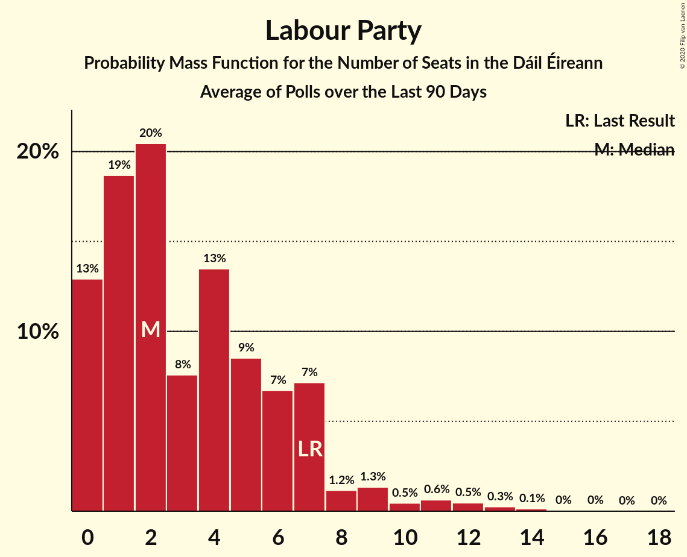

# Labour Party

<a href="#voting-intentions">Voting Intentions</a> | <a href="#seats">Seats</a>

## Voting Intentions

Last result: **6.6%** (General Election of 26 February 2016)

### Confidence Intervals

| Period     | Polling firm/Commissioner(s) | Median | 80% Confidence Interval | 90% Confidence Interval | 95% Confidence Interval | 99% Confidence Interval |
|:----------:|:----------------:|:-----------:|:-----------------------:|:-----------------------:|:-----------------------:|:-----------------------:|
| N/A | [Poll Average](average.html) | 4.8% | 3.6–6.3% | 3.4–6.7% | 3.2–7.1% | 2.8–7.8% |
| [24–30 January 2020](2020-01-30-Panelbase.html) | Panelbase   The Times | 5.0% | 4.2–6.0% | 4.0–6.3% | 3.8–6.5% | 3.5–7.1% |
| [1–25 January 2020](2020-01-25-IrelandThinks.html) | Ireland Thinks   The Irish Daily Mail | 6.1% | 5.2–7.2% | 4.9–7.5% | 4.7–7.8% | 4.3–8.3% |
| [16–23 January 2020](2020-01-23-RedC.html) | Red C   The Sunday Business Post | 4.0% | 3.3–4.9% | 3.1–5.2% | 2.9–5.4% | 2.7–5.9% |
| [16–18 January 2020](2020-01-18-IpsosMRBI.html) | Ipsos MRBI   The Irish Times | 5.0% | 4.3–5.9% | 4.1–6.2% | 3.9–6.4% | 3.6–6.8% |
| [4–14 January 2020](2020-01-14-BehaviourandAttitudes.html) | Behaviour and Attitudes   The Sunday Times | 4.0% | 3.3–5.0% | 3.1–5.2% | 2.9–5.5% | 2.6–6.0% |
| [24 December 2019](2019-12-24-IrelandThinks.html) | Ireland Thinks   The Irish Daily Mail | 5.0% | 4.3–5.8% | 4.2–6.0% | 4.0–6.2% | 3.7–6.6% |
| [5–17 December 2019](2019-12-17-BehaviourandAttitudes.html) | Behaviour and Attitudes   The Sunday Times | 6.0% | 5.1–7.1% | 4.8–7.4% | 4.6–7.7% | 4.2–8.3% |
| [14–21 November 2019](2019-11-21-RedC.html) | Red C   The Sunday Business Post | 6.0% | 5.1–7.1% | 4.9–7.4% | 4.7–7.7% | 4.3–8.2% |
| [1–12 November 2019](2019-11-12-BehaviourandAttitudes.html) | Behaviour and Attitudes   The Sunday Times | 6.0% | 5.1–7.1% | 4.8–7.4% | 4.6–7.7% | 4.2–8.3% |
| [17–24 October 2019](2019-10-24-RedC.html) | Red C   The Sunday Business Post | 4.0% | 3.3–4.9% | 3.1–5.2% | 2.9–5.4% | 2.7–5.9% |
| [3–15 October 2019](2019-10-15-BehaviourandAttitudes.html) | Behaviour and Attitudes   The Sunday Times | 5.0% | 4.2–6.1% | 3.9–6.4% | 3.7–6.6% | 3.4–7.2% |
| [11–13 October 2019](2019-10-13-IpsosMRBI.html) | Ipsos MRBI   The Irish Times | 6.1% | 5.3–7.1% | 5.0–7.3% | 4.9–7.6% | 4.5–8.1% |
| [5–17 September 2019](2019-09-17-BehaviourandAttitudes.html) | Behaviour and Attitudes   The Sunday Times | 3.0% | 2.4–3.9% | 2.2–4.1% | 2.1–4.3% | 1.8–4.8% |
| [5–12 September 2019](2019-09-12-RedC.html) | Red C   The Sunday Business Post | 6.0% | 5.1–7.1% | 4.9–7.4% | 4.7–7.7% | 4.3–8.2% |
| [4–16 July 2019](2019-07-16-BehaviourandAttitudes.html) | Behaviour and Attitudes   The Sunday Times | 5.1% | 4.3–6.2% | 4.0–6.5% | 3.8–6.7% | 3.5–7.3% |
| [31 May–11 June 2019](2019-06-11-BehaviourandAttitudes.html) | Behaviour and Attitudes   The Sunday Times | 5.0% | 4.2–6.1% | 3.9–6.4% | 3.7–6.6% | 3.4–7.2% |
| [24 May 2019](2019-05-24-RedC.html) | Red C   RTÉ | 5.1% | 4.5–5.6% | 4.4–5.8% | 4.3–5.9% | 4.0–6.2% |
| [1–22 May 2019](2019-05-22-IrelandThinks.html) | Ireland Thinks   The Irish Daily Mail | 6.0% | 5.3–6.8% | 5.1–7.1% | 4.9–7.3% | 4.6–7.7% |
| [6–16 May 2019](2019-05-16-RedC.html) | Red C   The Sunday Business Post | 5.0% | 4.4–5.7% | 4.3–5.9% | 4.1–6.1% | 3.9–6.4% |
| [2–14 May 2019](2019-05-14-BehaviourandAttitudes.html) | Behaviour and Attitudes   The Sunday Times | 4.0% | 3.2–4.9% | 3.0–5.2% | 2.9–5.4% | 2.6–5.9% |
| [6–8 May 2019](2019-05-08-IpsosMRBI.html) | Ipsos MRBI   The Irish Times | 6.9% | 6.2–7.8% | 5.9–8.1% | 5.7–8.3% | 5.4–8.8% |
| [11–17 April 2019](2019-04-17-RedC.html) | Red C   The Sunday Business Post | 5.0% | 4.2–6.0% | 4.0–6.3% | 3.8–6.5% | 3.5–7.1% |
| [4–16 April 2019](2019-04-16-BehaviourandAttitudes.html) | Behaviour and Attitudes   The Sunday Times | 4.1% | 3.4–5.0% | 3.1–5.3% | 3.0–5.5% | 2.7–6.0% |
| [21–28 March 2019](2019-03-28-RedC.html) | Red C   The Sunday Business Post | 5.0% | 4.2–6.0% | 4.0–6.3% | 3.8–6.5% | 3.5–7.1% |
| [28 February–12 March 2019](2019-03-12-BehaviourandAttitudes.html) | Behaviour and Attitudes   The Sunday Times | 5.1% | 4.2–6.1% | 4.0–6.4% | 3.8–6.7% | 3.5–7.2% |
| [4–5 March 2019](2019-03-05-IpsosMRBI.html) | Ipsos MRBI   The Irish Times | 6.0% | 5.2–7.0% | 5.0–7.3% | 4.8–7.5% | 4.4–8.0% |
| [14–20 February 2019](2019-02-20-RedC.html) | Red C   The Sunday Business Post | 5.0% | 4.2–6.0% | 4.0–6.3% | 3.8–6.5% | 3.5–7.1% |
| [31 January–12 February 2019](2019-02-12-BehaviourandAttitudes.html) | Behaviour and Attitudes   The Sunday Times | 5.0% | 4.1–6.0% | 3.9–6.3% | 3.7–6.6% | 3.4–7.1% |
| [17–24 January 2019](2019-01-24-RedC.html) | Red C   The Sunday Business Post | 6.0% | 5.1–7.1% | 4.9–7.4% | 4.7–7.7% | 4.3–8.2% |
| [4–15 January 2019](2019-01-15-BehaviourandAttitudes.html) | Behaviour and Attitudes   The Sunday Times | 4.0% | 3.2–4.9% | 3.0–5.2% | 2.9–5.5% | 2.6–6.0% |
| [14–21 December 2018](2018-12-21-IrelandThinks.html) | Ireland Thinks   The Irish Daily Mail | 6.9% | 6.1–7.8% | 5.9–8.0% | 5.7–8.2% | 5.3–8.7% |
| [6–18 December 2018](2018-12-18-BehaviourandAttitudes.html) | Behaviour and Attitudes   The Sunday Times | 4.9% | 4.1–6.0% | 3.9–6.3% | 3.7–6.6% | 3.4–7.1% |
| [1–13 December 2018](2018-12-13-MillwardBrown.html) | Millward Brown   The Sunday Independent | 5.0% | 4.2–6.1% | 4.0–6.4% | 3.8–6.6% | 3.4–7.1% |
| [15–22 November 2018](2018-11-22-RedC.html) | Red C   The Sunday Business Post | 6.0% | 5.1–7.1% | 4.9–7.4% | 4.7–7.7% | 4.3–8.2% |
| [1–13 November 2018](2018-11-13-BehaviourandAttitudes.html) | Behaviour and Attitudes   The Sunday Times | 6.0% | 5.1–7.1% | 4.8–7.4% | 4.6–7.7% | 4.2–8.3% |
| [26 October 2018](2018-10-26-RedC.html) | Red C   RTÉ | 7.0% | 6.5–7.6% | 6.3–7.8% | 6.2–7.9% | 5.9–8.2% |
| [11–17 October 2018](2018-10-17-RedC.html) | Red C   The Sunday Business Post | 5.0% | 4.2–6.0% | 4.0–6.3% | 3.8–6.5% | 3.5–7.1% |
| [5–16 October 2018](2018-10-16-BehaviourandAttitudes.html) | Behaviour and Attitudes   The Sunday Times | 6.1% | 5.2–7.3% | 5.0–7.6% | 4.8–7.9% | 4.4–8.4% |
| [10–12 October 2018](2018-10-12-IpsosMRBI.html) | Ipsos MRBI   The Irish Times | 4.0% | 3.4–4.8% | 3.2–5.1% | 3.0–5.3% | 2.7–5.7% |
| [3–10 October 2018](2018-10-10-RedC.html) | Red C   Paddy Power | 5.0% | 4.2–6.0% | 4.0–6.3% | 3.8–6.5% | 3.5–7.1% |
| [6–18 September 2018](2018-09-18-BehaviourandAttitudes.html) | Behaviour and Attitudes   The Sunday Times | 5.0% | 4.2–6.0% | 4.0–6.3% | 3.8–6.6% | 3.4–7.1% |
| [6–13 September 2018](2018-09-13-RedC.html) | Red C   The Sunday Business Post | 6.1% | 5.2–7.2% | 5.0–7.5% | 4.8–7.8% | 4.4–8.3% |
| [15–24 August 2018](2018-08-24-IrelandThinks.html) | Ireland Thinks   The Irish Daily Mail | 6.1% | 5.2–7.2% | 4.9–7.5% | 4.7–7.8% | 4.3–8.3% |
| [5–17 July 2018](2018-07-17-BehaviourandAttitudes.html) | Behaviour and Attitudes   The Sunday Times | 3.0% | 2.4–3.9% | 2.2–4.1% | 2.1–4.3% | 1.8–4.8% |
| [12 June 2018](2018-06-12-BehaviourandAttitudes.html) | Behaviour and Attitudes   The Sunday Times | 4.0% | 3.3–4.9% | 3.1–5.2% | 2.9–5.4% | 2.6–5.9% |
| [10–16 May 2018](2018-05-16-RedC.html) | Red C   The Sunday Business Post | 6.0% | 5.1–7.1% | 4.9–7.4% | 4.7–7.7% | 4.3–8.2% |
| [3–15 May 2018](2018-05-15-BehaviourandAttitudes.html) | Behaviour and Attitudes   The Sunday Times | 4.1% | 3.3–5.0% | 3.1–5.3% | 3.0–5.5% | 2.7–6.0% |
| [19–30 April 2018](2018-04-30-MillwardBrown.html) | Millward Brown   The Sunday Independent | 5.1% | 4.3–6.1% | 4.1–6.4% | 3.9–6.6% | 3.5–7.1% |
| [26 April 2018](2018-04-26-RedC.html) | Red C   The Sunday Business Post | 6.1% | 5.2–7.2% | 5.0–7.5% | 4.8–7.8% | 4.4–8.3% |
| [16–17 April 2018](2018-04-17-IpsosMRBI.html) | Ipsos MRBI   The Irish Times | 5.0% | 4.3–5.9% | 4.1–6.2% | 3.9–6.4% | 3.6–6.8% |
| [5–17 April 2018](2018-04-17-BehaviourandAttitudes.html) | Behaviour and Attitudes   The Sunday Times | 6.0% | 5.0–7.0% | 4.8–7.4% | 4.6–7.7% | 4.2–8.2% |
| [15–22 March 2018](2018-03-22-RedC.html) | Red C   The Sunday Business Post | 6.1% | 5.1–7.1% | 4.9–7.4% | 4.7–7.7% | 4.3–8.2% |
| [6–13 March 2018](2018-03-13-BehaviourandAttitudes.html) | Behaviour and Attitudes   The Sunday Times | 5.9% | 5.0–7.0% | 4.7–7.3% | 4.5–7.6% | 4.1–8.2% |
| [15–22 February 2018](2018-02-22-RedC.html) | Red C   The Sunday Business Post | 6.0% | 5.1–7.1% | 4.9–7.4% | 4.7–7.7% | 4.3–8.2% |
| [6–14 February 2018](2018-02-14-MillwardBrown.html) | Millward Brown   The Sunday Independent | 3.8% | 3.1–4.7% | 2.9–5.0% | 2.8–5.2% | 2.5–5.7% |
| [1–13 February 2018](2018-02-13-BehaviourandAttitudes.html) | Behaviour and Attitudes   The Sunday Times | 5.0% | 4.2–6.0% | 3.9–6.3% | 3.7–6.6% | 3.4–7.1% |
| [15–25 January 2018](2018-01-25-RedC.html) | Red C   The Sunday Business Post | 6.0% | 5.1–7.1% | 4.9–7.4% | 4.7–7.6% | 4.3–8.2% |
| [22–23 January 2018](2018-01-23-IpsosMRBI.html) | Ipsos MRBI   The Irish Times | 4.0% | 3.4–4.8% | 3.2–5.1% | 3.0–5.3% | 2.7–5.7% |
| [4–16 January 2018](2018-01-16-BehaviourandAttitudes.html) | Behaviour and Attitudes   The Sunday Times | 6.0% | 5.1–7.1% | 4.8–7.4% | 4.6–7.7% | 4.2–8.3% |
| [24 December 2017](2017-12-24-BehaviourandAttitudes.html) | Behaviour and Attitudes   The Sunday Times | 5.0% | 4.2–6.1% | 4.0–6.4% | 3.8–6.7% | 3.4–7.2% |
| [22 December 2017](2017-12-22-IrelandThinks.html) | Ireland Thinks   Irish Daily Mail | 6.0% | 5.2–7.0% | 5.0–7.3% | 4.8–7.6% | 4.4–8.1% |
| [7 December 2017](2017-12-07-IpsosMRBI.html) | Ipsos MRBI   Irish Times | 4.0% | 3.4–4.8% | 3.2–5.1% | 3.0–5.3% | 2.7–5.7% |
| [23 November 2017](2017-11-23-RedC.html) | Red C   The Sunday Business Post | 6.0% | 5.1–7.1% | 4.9–7.4% | 4.7–7.6% | 4.3–8.2% |
| [7 November 2017](2017-11-07-BehaviourandAttitudes.html) | Behaviour and Attitudes   The Sunday Times | 3.1% | 2.4–3.9% | 2.3–4.2% | 2.1–4.4% | 1.9–4.8% |
| [20 October 2017](2017-10-20-RedC.html) | Red C   The Sunday Business Post | 6.0% | 5.1–7.1% | 4.9–7.4% | 4.7–7.6% | 4.3–8.2% |
| [10 October 2017](2017-10-10-BehaviourandAttitudes.html) | Behaviour and Attitudes   The Sunday Times | 4.0% | 3.3–5.0% | 3.1–5.3% | 2.9–5.5% | 2.6–6.0% |
| [2 October 2017](2017-10-02-IpsosMRBI.html) | Ipsos MRBI   Irish Times | 4.0% | 3.4–4.8% | 3.2–5.1% | 3.0–5.3% | 2.7–5.7% |
| [22 September 2017](2017-09-22-RedC.html) | Red C   The Sunday Business Post | 5.0% | 4.2–6.0% | 4.0–6.3% | 3.8–6.5% | 3.4–7.0% |
| [12 September 2017](2017-09-12-BehaviourandAttitudes.html) | Behaviour and Attitudes   The Sunday Times | 5.0% | 4.2–6.1% | 4.0–6.4% | 3.8–6.6% | 3.4–7.1% |
| [21 July 2017](2017-07-21-MillwardBrown.html) | Millward Brown   The Sunday Independent | 6.9% | 5.9–8.1% | 5.7–8.4% | 5.5–8.7% | 5.0–9.3% |
| [11 July 2017](2017-07-11-BehaviourandAttitudes.html) | Behaviour and Attitudes   The Sunday Times | 5.0% | 4.2–6.0% | 3.9–6.3% | 3.7–6.6% | 3.4–7.1% |
| [5 July 2017](2017-07-05-RedC.html) | Red C   The Sunday Business Post | 6.1% | 5.1–7.1% | 4.9–7.4% | 4.7–7.7% | 4.3–8.2% |
| [10 June 2017](2017-06-10-BehaviourandAttitudes.html) | Behaviour and Attitudes   The Sunday Times | 5.0% | 4.2–6.0% | 4.0–6.3% | 3.8–6.5% | 3.4–7.0% |
| [25 May 2017](2017-05-25-RedC.html) | Red C   The Sunday Business Post | 6.0% | 5.1–7.1% | 4.9–7.4% | 4.7–7.6% | 4.3–8.2% |
| [13 May 2017](2017-05-13-BehaviourandAttitudes.html) | Behaviour and Attitudes   The Sunday Times | 4.0% | 3.3–5.0% | 3.1–5.2% | 2.9–5.5% | 2.6–6.0% |
| [28 April 2017](2017-04-28-RedC.html) | Red C   The Sunday Business Post | 6.0% | 5.1–7.1% | 4.9–7.4% | 4.7–7.6% | 4.3–8.2% |
| [11 April 2017](2017-04-11-BehaviourandAttitudes.html) | Behaviour and Attitudes   The Sunday Times | 4.9% | 4.1–5.9% | 3.9–6.2% | 3.7–6.5% | 3.4–7.0% |
| [24 March 2017](2017-03-24-RedC.html) | Red C   The Sunday Business Post | 6.0% | 5.1–7.1% | 4.9–7.4% | 4.7–7.6% | 4.3–8.2% |
| [8 March 2017](2017-03-08-BehaviourAttitudes.html) | Behaviour & Attitudes   The Sunday Times | 6.0% | 5.1–7.1% | 4.8–7.4% | 4.6–7.7% | 4.3–8.3% |
| [28 February 2017](2017-02-28-IpsosMRBI.html) | Ipsos MRBI   Irish Times | 4.0% | 3.4–4.8% | 3.2–5.1% | 3.0–5.3% | 2.7–5.7% |
| [23 February 2017](2017-02-23-RedC.html) | Red C   The Sunday Business Post | 4.0% | 3.3–4.9% | 3.1–5.2% | 2.9–5.4% | 2.6–5.9% |
| [16 February 2017](2017-02-16-MillwardBrown.html) | Millward Brown   The Sunday Independent | 6.0% | 5.2–7.1% | 4.9–7.5% | 4.7–7.7% | 4.3–8.3% |
| [8 February 2017](2017-02-08-BehaviourAttitudes.html) | Behaviour & Attitudes   The Sunday Times | 6.0% | 5.1–7.1% | 4.8–7.4% | 4.6–7.7% | 4.2–8.2% |
| [26 January 2017](2017-01-26-RedC.html) | Red C   The Sunday Business Post | 5.0% | 4.2–6.0% | 4.0–6.3% | 3.8–6.5% | 3.4–7.0% |
| [21 January 2017](2017-01-21-BehaviourAttitudes.html) | Behaviour & Attitudes   The Sunday Times | 4.9% | 4.1–5.9% | 3.9–6.2% | 3.7–6.5% | 3.3–7.0% |
| [13 December 2016](2016-12-13-BehaviourAttitudes.html) | Behaviour & Attitudes   The Sunday Times | 5.0% | 4.2–6.0% | 3.9–6.3% | 3.7–6.6% | 3.4–7.1% |
| [6 December 2016](2016-12-06-IpsosMRBI.html) | Ipsos MRBI   Irish Times | 6.0% | 5.2–7.0% | 5.0–7.3% | 4.8–7.5% | 4.4–8.0% |
| [25 November 2016](2016-11-25-RedC.html) | Red C   The Sunday Business Post | 5.1% | 4.3–6.1% | 4.1–6.4% | 3.9–6.6% | 3.6–7.2% |
| [9 November 2016](2016-11-09-BehaviourAttitudes.html) | Behaviour & Attitudes   The Sunday Times | 3.0% | 2.4–3.9% | 2.2–4.1% | 2.1–4.4% | 1.8–4.8% |
| [27 October 2016](2016-10-27-RedC.html) | Red C   The Sunday Business Post | 5.0% | 4.2–6.0% | 4.0–6.3% | 3.8–6.5% | 3.5–7.0% |
| [20 October 2016](2016-10-20-MillwardBrown.html) | Millward Brown   The Sunday Independent | 8.0% | 6.9–9.2% | 6.6–9.6% | 6.4–9.9% | 5.9–10.5% |
| [12 October 2016](2016-10-12-BehaviourAttitudes.html) | Behaviour & Attitudes   The Sunday Times | 5.0% | 4.2–6.1% | 4.0–6.4% | 3.8–6.6% | 3.4–7.2% |
| [4 October 2016](2016-10-04-IpsosMRBI.html) | Ipsos MRBI   Irish Times | 5.1% | 4.3–6.0% | 4.1–6.2% | 4.0–6.5% | 3.6–7.0% |
| [22 September 2016](2016-09-22-RedC.html) | Red C   The Sunday Business Post | 7.0% | 6.1–8.1% | 5.8–8.5% | 5.6–8.7% | 5.1–9.3% |
| [14 September 2016](2016-09-14-BehaviourAttitudes.html) | Behaviour & Attitudes   The Sunday Times | 7.0% | 6.1–8.2% | 5.8–8.6% | 5.5–8.9% | 5.1–9.5% |
| [27 July 2016](2016-07-27-RedC.html) | Red C   Paddy Power | 4.0% | 3.3–4.9% | 3.1–5.2% | 2.9–5.4% | 2.7–5.9% |
| [13 July 2016](2016-07-13-RedC.html) | Red C   The Sunday Business Post | 6.0% | 5.1–7.1% | 4.9–7.4% | 4.7–7.6% | 4.3–8.2% |
| [13 July 2016](2016-07-13-BehaviourAttitudes.html) | Behaviour & Attitudes   The Sunday Times | 5.9% | 5.0–7.1% | 4.8–7.4% | 4.6–7.7% | 4.2–8.3% |
| [7 July 2016](2016-07-07-IpsosMRBI.html) | Ipsos MRBI   Irish Times | 5.1% | 4.3–6.0% | 4.1–6.2% | 4.0–6.5% | 3.6–7.0% |
| [29 June 2016](2016-06-29-MillwardBrown.html) | Millward Brown   The Sunday Independent | 7.0% | 6.1–8.2% | 5.8–8.5% | 5.6–8.8% | 5.2–9.3% |
| [15 June 2016](2016-06-15-BehaviourAttitudes.html) | Behaviour & Attitudes   The Sunday Times | 5.1% | 4.2–6.1% | 4.0–6.4% | 3.8–6.7% | 3.4–7.2% |
| [26 May 2016](2016-05-26-RedC.html) | Red C   The Sunday Business Post | 6.1% | 5.2–7.2% | 5.0–7.5% | 4.8–7.7% | 4.4–8.3% |
| [11 May 2016](2016-05-11-RedC.html) | Red C   Paddy Power | 5.1% | 4.2–6.0% | 4.0–6.3% | 3.8–6.6% | 3.5–7.1% |
| [11 May 2016](2016-05-11-BehaviourAttitudes.html) | Behaviour & Attitudes   The Sunday Times | 5.0% | 4.2–6.1% | 4.0–6.4% | 3.8–6.6% | 3.4–7.2% |
| [13 April 2016](2016-04-13-BehaviourAttitudes.html) | Behaviour & Attitudes   The Sunday Times | 4.0% | 3.3–5.0% | 3.1–5.2% | 2.9–5.5% | 2.6–6.0% |
| [10 March 2016](2016-03-10-RedC.html) | Red C   The Sunday Business Post | 4.1% | 3.4–5.0% | 3.2–5.3% | 3.0–5.5% | 2.7–6.0% |

### Probability Mass Function

The following table shows the probability mass function per percentage block of voting intentions for the [poll average](average.html) for Labour Party.

| Voting Intentions | Probability | Accumulated | Special Marks |
|:-----------------:|:-----------:|:-----------:|:-------------:|
| 0.5–1.5% | 0% | 100% |  |
| 1.5–2.5% | 0.1% | 100% |  |
| 2.5–3.5% | 8% | 99.9% |  |
| 3.5–4.5% | 32% | 92% |  |
| 4.5–5.5% | 35% | 60% | Median |
| 5.5–6.5% | 19% | 26% |  |
| 6.5–7.5% | 6% | 7% | Last Result |
| 7.5–8.5% | 0.8% | 0.9% |  |
| 8.5–9.5% | 0% | 0% |  |
| 9.5–10.5% | 0% | 0% |  |

## Seats

Last result: **7** seats (General Election of 26 February 2016)

### Confidence Intervals

| Period     | Polling firm/Commissioner(s) | Median | 80% Confidence Interval | 90% Confidence Interval | 95% Confidence Interval | 99% Confidence Interval |
|:----------:|:----------------:|:------:|:-----------------------:|:-----------------------:|:-----------------------:|:-----------------------:|
| N/A | [Poll Average](average.html) | 4 | 0–9 | 0–12 | 0–14 | 0–17 |
| [24–30 January 2020](2020-01-30-Panelbase.html) | Panelbase   The Times | 5 | 2–6 | 2–7 | 1–11 | 1–13 |
| [1–25 January 2020](2020-01-25-IrelandThinks.html) | Ireland Thinks   The Irish Daily Mail | 8 | 4–15 | 3–16 | 2–17 | 1–18 |
| [16–23 January 2020](2020-01-23-RedC.html) | Red C   The Sunday Business Post | 1 | 0–3 | 0–5 | 0–6 | 0–8 |
| [16–18 January 2020](2020-01-18-IpsosMRBI.html) | Ipsos MRBI   The Irish Times | 5 | 2–8 | 1–9 | 1–9 | 1–11 |
| [4–14 January 2020](2020-01-14-BehaviourandAttitudes.html) | Behaviour and Attitudes   The Sunday Times | 1 | 0–4 | 0–5 | 0–6 | 0–6 |
| [24 December 2019](2019-12-24-IrelandThinks.html) | Ireland Thinks   The Irish Daily Mail | 4 | 1–6 | 1–7 | 1–8 | 0–10 |
| [5–17 December 2019](2019-12-17-BehaviourandAttitudes.html) | Behaviour and Attitudes   The Sunday Times | 8 | 4–13 | 4–14 | 3–16 | 1–18 |
| [14–21 November 2019](2019-11-21-RedC.html) | Red C   The Sunday Business Post | 6 | 4–9 | 3–11 | 2–12 | 1–14 |
| [1–12 November 2019](2019-11-12-BehaviourandAttitudes.html) | Behaviour and Attitudes   The Sunday Times | 8 | 6–15 | 4–16 | 2–16 | 2–18 |
| [17–24 October 2019](2019-10-24-RedC.html) | Red C   The Sunday Business Post | 1 | 0–3 | 0–4 | 0–5 | 0–6 |
| [3–15 October 2019](2019-10-15-BehaviourandAttitudes.html) | Behaviour and Attitudes   The Sunday Times | 5 | 1–8 | 1–9 | 0–10 | 0–13 |
| [11–13 October 2019](2019-10-13-IpsosMRBI.html) | Ipsos MRBI   The Irish Times | 4 | 4–8 | 2–9 | 2–10 | 1–14 |
| [5–17 September 2019](2019-09-17-BehaviourandAttitudes.html) | Behaviour and Attitudes   The Sunday Times | 0 | 0–2 | 0–2 | 0–2 | 0–2 |
| [5–12 September 2019](2019-09-12-RedC.html) | Red C   The Sunday Business Post | 5 | 3–10 | 2–12 | 1–13 | 1–15 |
| [4–16 July 2019](2019-07-16-BehaviourandAttitudes.html) | Behaviour and Attitudes   The Sunday Times | 4 | 1–7 | 0–7 | 0–9 | 0–12 |
| [31 May–11 June 2019](2019-06-11-BehaviourandAttitudes.html) | Behaviour and Attitudes   The Sunday Times | 3 | 1–7 | 1–8 | 0–8 | 0–10 |
| [24 May 2019](2019-05-24-RedC.html) | Red C   RTÉ | 5 | 3–7 | 1–8 | 1–9 | 1–10 |
| [1–22 May 2019](2019-05-22-IrelandThinks.html) | Ireland Thinks   The Irish Daily Mail | 8 | 6–8 | 6–8 | 5–9 | 3–14 |
| [6–16 May 2019](2019-05-16-RedC.html) | Red C   The Sunday Business Post | 3 | 2–4 | 1–4 | 1–5 | 1–7 |
| [2–14 May 2019](2019-05-14-BehaviourandAttitudes.html) | Behaviour and Attitudes   The Sunday Times | 1 | 0–4 | 0–5 | 0–6 | 0–8 |
| [6–8 May 2019](2019-05-08-IpsosMRBI.html) | Ipsos MRBI   The Irish Times | 10 | 5–12 | 5–12 | 5–12 | 3–12 |
| [11–17 April 2019](2019-04-17-RedC.html) | Red C   The Sunday Business Post | 5 | 2–9 | 0–10 | 0–12 | 0–15 |
| [4–16 April 2019](2019-04-16-BehaviourandAttitudes.html) | Behaviour and Attitudes   The Sunday Times | 0 | 0–2 | 0–2 | 0–3 | 0–8 |
| [21–28 March 2019](2019-03-28-RedC.html) | Red C   The Sunday Business Post | 3 | 2–6 | 1–7 | 0–8 | 0–10 |
| [28 February–12 March 2019](2019-03-12-BehaviourandAttitudes.html) | Behaviour and Attitudes   The Sunday Times | 3 | 2–5 | 1–7 | 0–8 | 0–8 |
| [4–5 March 2019](2019-03-05-IpsosMRBI.html) | Ipsos MRBI   The Irish Times | 6 | 2–9 | 2–10 | 2–11 | 1–14 |
| [14–20 February 2019](2019-02-20-RedC.html) | Red C   The Sunday Business Post | 2 | 2–4 | 2–5 | 0–7 | 0–8 |
| [31 January–12 February 2019](2019-02-12-BehaviourandAttitudes.html) | Behaviour and Attitudes   The Sunday Times | 2 | 1–8 | 1–9 | 1–11 | 0–14 |
| [17–24 January 2019](2019-01-24-RedC.html) | Red C   The Sunday Business Post | 5 | 4–9 | 3–11 | 2–13 | 1–14 |
| [4–15 January 2019](2019-01-15-BehaviourandAttitudes.html) | Behaviour and Attitudes   The Sunday Times | 0 | 0–2 | 0–2 | 0–3 | 0–6 |
| [14–21 December 2018](2018-12-21-IrelandThinks.html) | Ireland Thinks   The Irish Daily Mail | 6 | 6–13 | 4–13 | 3–14 | 1–16 |
| [6–18 December 2018](2018-12-18-BehaviourandAttitudes.html) | Behaviour and Attitudes   The Sunday Times | 2 | 1–5 | 0–7 | 0–7 | 0–8 |
| [1–13 December 2018](2018-12-13-MillwardBrown.html) | Millward Brown   The Sunday Independent | 3 | 0–7 | 0–7 | 0–7 | 0–8 |
| [15–22 November 2018](2018-11-22-RedC.html) | Red C   The Sunday Business Post | 7 | 4–9 | 3–10 | 2–13 | 1–15 |
| [1–13 November 2018](2018-11-13-BehaviourandAttitudes.html) | Behaviour and Attitudes   The Sunday Times | 7 | 3–8 | 2–9 | 2–10 | 1–13 |
| [26 October 2018](2018-10-26-RedC.html) | Red C   RTÉ | 9 | 6–11 | 6–13 | 5–13 | 5–14 |
| [11–17 October 2018](2018-10-17-RedC.html) | Red C   The Sunday Business Post | 5 | 1–9 | 0–10 | 0–11 | 0–14 |
| [5–16 October 2018](2018-10-16-BehaviourandAttitudes.html) | Behaviour and Attitudes   The Sunday Times | 6 | 4–7 | 3–8 | 3–8 | 1–16 |
| [10–12 October 2018](2018-10-12-IpsosMRBI.html) | Ipsos MRBI   The Irish Times | 2 | 0–3 | 0–3 | 0–4 | 0–5 |
| [3–10 October 2018](2018-10-10-RedC.html) | Red C   Paddy Power | 2 | 1–6 | 0–6 | 0–7 | 0–8 |
| [6–18 September 2018](2018-09-18-BehaviourandAttitudes.html) | Behaviour and Attitudes   The Sunday Times | 5 | 2–7 | 1–7 | 0–7 | 0–9 |
| [6–13 September 2018](2018-09-13-RedC.html) | Red C   The Sunday Business Post | 6 | 3–11 | 3–12 | 2–13 | 1–14 |
| [15–24 August 2018](2018-08-24-IrelandThinks.html) | Ireland Thinks   The Irish Daily Mail | 5 | 3–8 | 3–9 | 2–11 | 1–14 |
| [5–17 July 2018](2018-07-17-BehaviourandAttitudes.html) | Behaviour and Attitudes   The Sunday Times | 0 | 0–1 | 0–1 | 0–1 | 0–2 |
| [12 June 2018](2018-06-12-BehaviourandAttitudes.html) | Behaviour and Attitudes   The Sunday Times | 3 | 0–6 | 0–6 | 0–8 | 0–10 |
| [10–16 May 2018](2018-05-16-RedC.html) | Red C   The Sunday Business Post | 10 | 5–15 | 4–15 | 3–16 | 1–17 |
| [3–15 May 2018](2018-05-15-BehaviourandAttitudes.html) | Behaviour and Attitudes   The Sunday Times | 2 | 0–4 | 0–5 | 0–6 | 0–7 |
| [19–30 April 2018](2018-04-30-MillwardBrown.html) | Millward Brown   The Sunday Independent | 3 | 3–6 | 1–7 | 0–7 | 0–9 |
| [26 April 2018](2018-04-26-RedC.html) | Red C   The Sunday Business Post | 4 | 2–10 | 2–14 | 2–14 | 0–17 |
| [16–17 April 2018](2018-04-17-IpsosMRBI.html) | Ipsos MRBI   The Irish Times | 2 | 2–7 | 2–7 | 1–7 | 0–8 |
| [5–17 April 2018](2018-04-17-BehaviourandAttitudes.html) | Behaviour and Attitudes   The Sunday Times | 10 | 5–15 | 4–16 | 3–16 | 2–17 |
| [15–22 March 2018](2018-03-22-RedC.html) | Red C   The Sunday Business Post | 6 | 3–8 | 2–10 | 2–11 | 1–14 |
| [6–13 March 2018](2018-03-13-BehaviourandAttitudes.html) | Behaviour and Attitudes   The Sunday Times | 7 | 2–8 | 2–9 | 2–12 | 1–14 |
| [15–22 February 2018](2018-02-22-RedC.html) | Red C   The Sunday Business Post | 9 | 5–10 | 3–13 | 3–13 | 2–13 |
| [6–14 February 2018](2018-02-14-MillwardBrown.html) | Millward Brown   The Sunday Independent | 0 | 0–1 | 0–2 | 0–2 | 0–5 |
| [1–13 February 2018](2018-02-13-BehaviourandAttitudes.html) | Behaviour and Attitudes   The Sunday Times | 3 | 1–5 | 1–6 | 0–7 | 0–8 |
| [15–25 January 2018](2018-01-25-RedC.html) | Red C   The Sunday Business Post | 6 | 3–8 | 2–10 | 1–11 | 1–13 |
| [22–23 January 2018](2018-01-23-IpsosMRBI.html) | Ipsos MRBI   The Irish Times | 0 | 0–2 | 0–2 | 0–4 | 0–5 |
| [4–16 January 2018](2018-01-16-BehaviourandAttitudes.html) | Behaviour and Attitudes   The Sunday Times | 7 | 4–9 | 3–10 | 2–12 | 1–15 |
| [24 December 2017](2017-12-24-BehaviourandAttitudes.html) | Behaviour and Attitudes   The Sunday Times | 3 | 1–7 | 0–8 | 0–8 | 0–10 |
| [22 December 2017](2017-12-22-IrelandThinks.html) | Ireland Thinks   Irish Daily Mail | 6 | 1–8 | 1–9 | 1–9 | 1–12 |
| [7 December 2017](2017-12-07-IpsosMRBI.html) | Ipsos MRBI   Irish Times | 0 | 0–3 | 0–5 | 0–6 | 0–8 |
| [23 November 2017](2017-11-23-RedC.html) | Red C   The Sunday Business Post | 6 | 3–7 | 2–9 | 1–11 | 1–17 |
| [7 November 2017](2017-11-07-BehaviourandAttitudes.html) | Behaviour and Attitudes   The Sunday Times | 0 | 0 | 0–1 | 0–2 | 0–3 |
| [20 October 2017](2017-10-20-RedC.html) | Red C   The Sunday Business Post | 6 | 5–11 | 3–11 | 2–11 | 1–14 |
| [10 October 2017](2017-10-10-BehaviourandAttitudes.html) | Behaviour and Attitudes   The Sunday Times | 1 | 0–2 | 0–4 | 0–4 | 0–6 |
| [2 October 2017](2017-10-02-IpsosMRBI.html) | Ipsos MRBI   Irish Times | 1 | 0–3 | 0–4 | 0–6 | 0–9 |
| [22 September 2017](2017-09-22-RedC.html) | Red C   The Sunday Business Post | 5 | 1–9 | 1–12 | 0–12 | 0–12 |
| [12 September 2017](2017-09-12-BehaviourandAttitudes.html) | Behaviour and Attitudes   The Sunday Times | 3 | 1–8 | 0–8 | 0–8 | 0–9 |
| [21 July 2017](2017-07-21-MillwardBrown.html) | Millward Brown   The Sunday Independent | 8 | 6–12 | 4–13 | 3–16 | 2–19 |
| [11 July 2017](2017-07-11-BehaviourandAttitudes.html) | Behaviour and Attitudes   The Sunday Times | 3 | 2–7 | 1–7 | 0–8 | 0–10 |
| [5 July 2017](2017-07-05-RedC.html) | Red C   The Sunday Business Post | 5 | 3–8 | 2–10 | 1–12 | 1–16 |
| [10 June 2017](2017-06-10-BehaviourandAttitudes.html) | Behaviour and Attitudes   The Sunday Times | 3 | 2–7 | 1–8 | 1–8 | 0–9 |
| [25 May 2017](2017-05-25-RedC.html) | Red C   The Sunday Business Post | 7 | 4–9 | 2–10 | 1–14 | 1–16 |
| [13 May 2017](2017-05-13-BehaviourandAttitudes.html) | Behaviour and Attitudes   The Sunday Times | 2 | 0–2 | 0–3 | 0–3 | 0–4 |
| [28 April 2017](2017-04-28-RedC.html) | Red C   The Sunday Business Post | 6 | 2–8 | 2–11 | 1–12 | 0–14 |
| [11 April 2017](2017-04-11-BehaviourandAttitudes.html) | Behaviour and Attitudes   The Sunday Times | 3 | 1–6 | 1–7 | 0–8 | 0–9 |
| [24 March 2017](2017-03-24-RedC.html) | Red C   The Sunday Business Post | 4 | 3–7 | 1–9 | 1–9 | 1–16 |
| [8 March 2017](2017-03-08-BehaviourAttitudes.html) | Behaviour & Attitudes   The Sunday Times | 8 | 5–10 | 3–12 | 2–13 | 1–17 |
| [28 February 2017](2017-02-28-IpsosMRBI.html) | Ipsos MRBI   Irish Times | 1 | 0–3 | 0–3 | 0–4 | 0–6 |
| [23 February 2017](2017-02-23-RedC.html) | Red C   The Sunday Business Post | 1 | 0–5 | 0–6 | 0–7 | 0–8 |
| [16 February 2017](2017-02-16-MillwardBrown.html) | Millward Brown   The Sunday Independent | 7 | 4–10 | 3–11 | 3–11 | 2–12 |
| [8 February 2017](2017-02-08-BehaviourAttitudes.html) | Behaviour & Attitudes   The Sunday Times | 9 | 6–9 | 1–9 | 1–10 | 1–12 |
| [26 January 2017](2017-01-26-RedC.html) | Red C   The Sunday Business Post | 2 | 0–8 | 0–9 | 0–9 | 0–9 |
| [21 January 2017](2017-01-21-BehaviourAttitudes.html) | Behaviour & Attitudes   The Sunday Times | 2 | 0–2 | 0–3 | 0–3 | 0–5 |
| [13 December 2016](2016-12-13-BehaviourAttitudes.html) | Behaviour & Attitudes   The Sunday Times | 3 | 1–8 | 1–8 | 0–8 | 0–10 |
| [6 December 2016](2016-12-06-IpsosMRBI.html) | Ipsos MRBI   Irish Times | 6 | 1–8 | 1–10 | 1–10 | 1–14 |
| [25 November 2016](2016-11-25-RedC.html) | Red C   The Sunday Business Post | 2 | 1–5 | 1–6 | 1–7 | 0–9 |
| [9 November 2016](2016-11-09-BehaviourAttitudes.html) | Behaviour & Attitudes   The Sunday Times | 0 | 0 | 0 | 0–1 | 0–1 |
| [27 October 2016](2016-10-27-RedC.html) | Red C   The Sunday Business Post | 7 | 3–8 | 2–10 | 1–11 | 0–15 |
| [20 October 2016](2016-10-20-MillwardBrown.html) | Millward Brown   The Sunday Independent | 13 | 7–17 | 7–17 | 6–18 | 5–20 |
| [12 October 2016](2016-10-12-BehaviourAttitudes.html) | Behaviour & Attitudes   The Sunday Times | 2 | 2–6 | 1–6 | 1–8 | 0–10 |
| [4 October 2016](2016-10-04-IpsosMRBI.html) | Ipsos MRBI   Irish Times | 5 | 2–9 | 1–10 | 1–10 | 0–12 |
| [22 September 2016](2016-09-22-RedC.html) | Red C   The Sunday Business Post | 7 | 6–12 | 4–13 | 4–16 | 3–18 |
| [14 September 2016](2016-09-14-BehaviourAttitudes.html) | Behaviour & Attitudes   The Sunday Times | 11 | 7–15 | 4–17 | 3–20 | 2–20 |
| [27 July 2016](2016-07-27-RedC.html) | Red C   Paddy Power | 1 | 0–1 | 0–2 | 0–3 | 0–5 |
| [13 July 2016](2016-07-13-RedC.html) | Red C   The Sunday Business Post | 6 | 3–10 | 3–11 | 1–11 | 1–14 |
| [13 July 2016](2016-07-13-BehaviourAttitudes.html) | Behaviour & Attitudes   The Sunday Times | 7 | 2–10 | 1–11 | 1–12 | 1–15 |
| [7 July 2016](2016-07-07-IpsosMRBI.html) | Ipsos MRBI   Irish Times | 2 | 2–6 | 1–7 | 1–8 | 0–9 |
| [29 June 2016](2016-06-29-MillwardBrown.html) | Millward Brown   The Sunday Independent | 9 | 6–10 | 6–10 | 5–13 | 3–17 |
| [15 June 2016](2016-06-15-BehaviourAttitudes.html) | Behaviour & Attitudes   The Sunday Times | 2 | 1–6 | 1–8 | 0–8 | 0–10 |
| [26 May 2016](2016-05-26-RedC.html) | Red C   The Sunday Business Post | 6 | 3–8 | 3–9 | 2–10 | 1–15 |
| [11 May 2016](2016-05-11-RedC.html) | Red C   Paddy Power | 5 | 1–8 | 1–8 | 1–11 | 0–13 |
| [11 May 2016](2016-05-11-BehaviourAttitudes.html) | Behaviour & Attitudes   The Sunday Times | 7 | 2–9 | 1–9 | 0–10 | 0–15 |
| [13 April 2016](2016-04-13-BehaviourAttitudes.html) | Behaviour & Attitudes   The Sunday Times | 1 | 0–3 | 0–4 | 0–5 | 0–7 |
| [10 March 2016](2016-03-10-RedC.html) | Red C   The Sunday Business Post | 1 | 0–3 | 0–3 | 0–4 | 0–5 |

### Probability Mass Function

The following table shows the probability mass function per seat for the [poll average](average.html) for Labour Party.

| Number of Seats | Probability | Accumulated | Special Marks |
|:---------------:|:-----------:|:-----------:|:-------------:|
| 0 | 13% | 100% |  |
| 1 | 15% | 87% |  |
| 2 | 12% | 73% |  |
| 3 | 9% | 61% |  |
| 4 | 5% | 52% | Median |
| 5 | 14% | 47% |  |
| 6 | 9% | 32% |  |
| 7 | 7% | 23% | Last Result |
| 8 | 5% | 16% |  |
| 9 | 3% | 11% |  |
| 10 | 1.4% | 9% |  |
| 11 | 2% | 7% |  |
| 12 | 0.8% | 5% |  |
| 13 | 1.1% | 4% |  |
| 14 | 0.8% | 3% |  |
| 15 | 0.7% | 2% |  |
| 16 | 1.0% | 2% |  |
| 17 | 0.5% | 0.8% |  |
| 18 | 0.2% | 0.2% |  |
| 19 | 0% | 0% |  |

